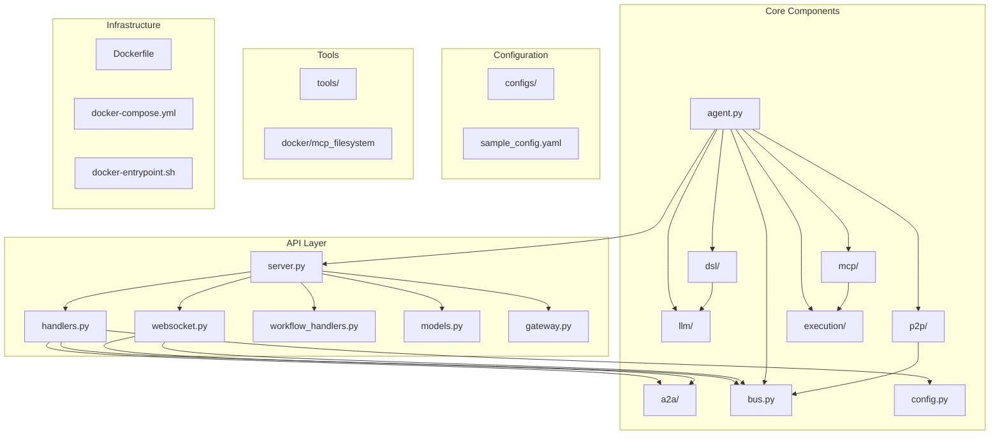
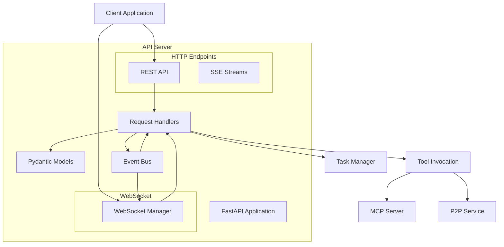
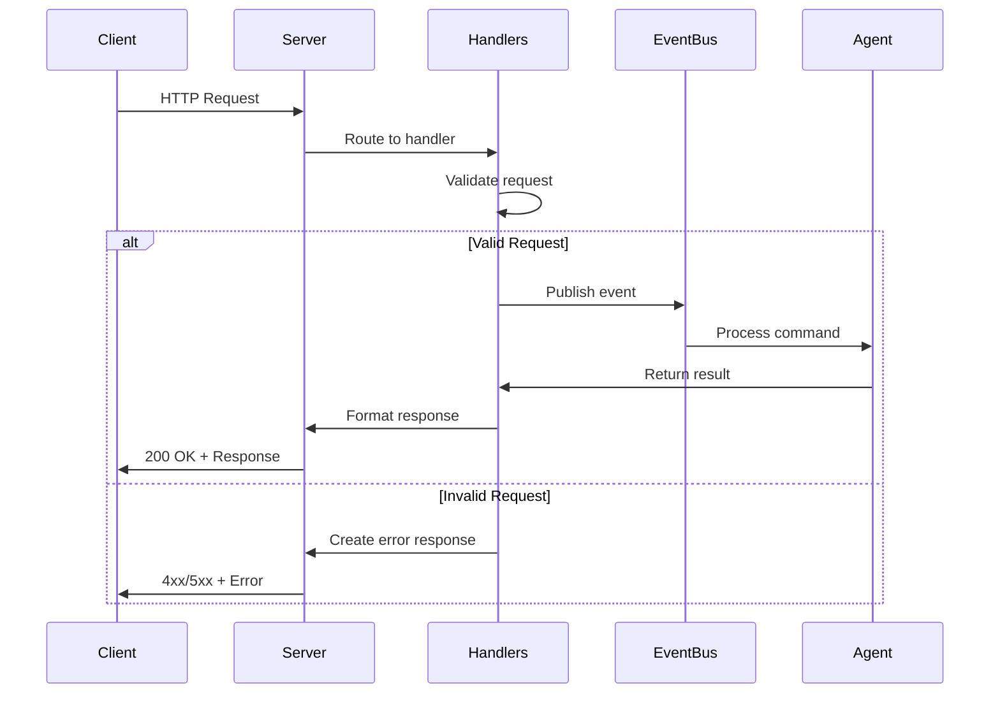
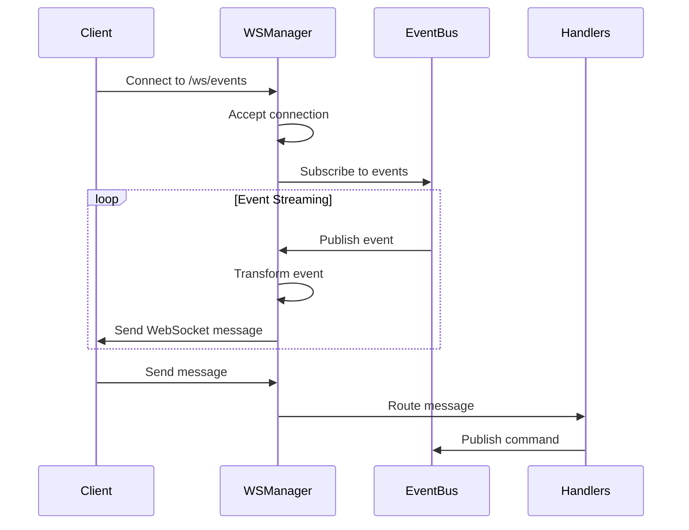
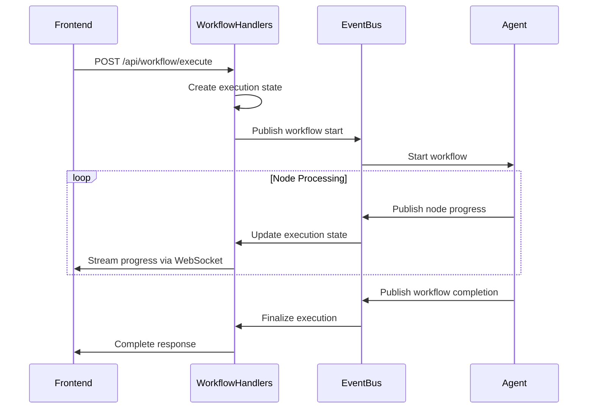
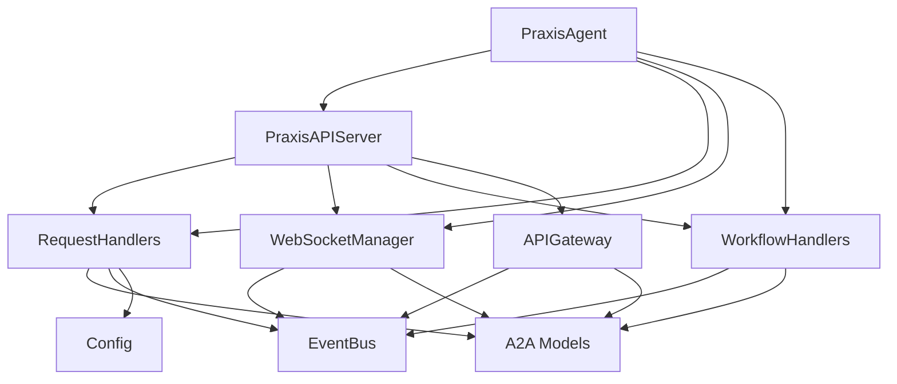

# API Reference


## Table of Contents
1. [Introduction](#introduction)
2. [Project Structure](#project-structure)
3. [Core Components](#core-components)
4. [Architecture Overview](#architecture-overview)
5. [Detailed Component Analysis](#detailed-component-analysis)
6. [Dependency Analysis](#dependency-analysis)
7. [Performance Considerations](#performance-considerations)
8. [Troubleshooting Guide](#troubleshooting-guide)
9. [Conclusion](#conclusion)

## Introduction
This document provides comprehensive API documentation for the Praxis Python SDK, detailing both REST and WebSocket interfaces. The system enables agent-to-agent communication, task execution, workflow orchestration, and real-time event streaming. It supports the A2A (Agent-to-Agent) protocol specification and integrates with MCP (Model Context Protocol) tools, P2P networking, and LLM-driven orchestration. The API is designed for both programmatic interaction and frontend integration, offering robust endpoints for health monitoring, agent discovery, tool invocation, and execution management.

## Project Structure
The project follows a modular structure with clear separation of concerns. Core API components reside in the `src/praxis_sdk/api` directory, while agent logic, event bus, and protocol implementations are organized in dedicated modules. Configuration files, Docker resources, and integration tests support deployment and validation.



**Diagram sources**
- [server.py](file://src/praxis_sdk/api/server.py)
- [agent.py](file://src/praxis_sdk/agent.py)
- [p2p/](file://src/praxis_sdk/p2p)
- [mcp/](file://src/praxis_sdk/mcp)

**Section sources**
- [server.py](file://src/praxis_sdk/api/server.py)
- [agent.py](file://src/praxis_sdk/agent.py)

## Core Components
The API is built around several core components that handle HTTP/HTTPS requests, WebSocket connections, event streaming, and business logic. The `PraxisAPIServer` class orchestrates the FastAPI application, integrating request handlers, WebSocket management, and workflow execution. The `RequestHandlers` class manages REST endpoint logic, while `WebSocketManager` handles real-time communication. The `WorkflowHandlers` class provides frontend-compatible endpoints for workflow management.

**Section sources**
- [server.py](file://src/praxis_sdk/api/server.py#L1-L1063)
- [handlers.py](file://src/praxis_sdk/api/handlers.py#L1-L751)
- [websocket.py](file://src/praxis_sdk/api/websocket.py#L1-L799)
- [workflow_handlers.py](file://src/praxis_sdk/api/workflow_handlers.py#L1-L581)

## Architecture Overview
The API architecture follows a layered design with clear separation between transport, business logic, and data models. FastAPI serves as the web framework, handling HTTP and WebSocket connections. The event bus enables decoupled communication between components. Request handlers process incoming commands, manage tasks, and invoke tools. The WebSocket manager streams real-time events to connected clients.



**Diagram sources**
- [server.py](file://src/praxis_sdk/api/server.py#L1-L1063)
- [handlers.py](file://src/praxis_sdk/api/handlers.py#L1-L751)
- [websocket.py](file://src/praxis_sdk/api/websocket.py#L1-L799)

## Detailed Component Analysis

### REST API Endpoints
The REST API provides comprehensive endpoints for agent interaction, task management, and system monitoring. All endpoints support both JSON-RPC 2.0 and legacy DSL formats for backward compatibility.

#### REST Endpoint Structure
```mermaid
flowchart TD
A[Client Request] --> B{Endpoint Type}
B --> C[/health]
B --> D[/agent/card]
B --> E[/execute]
B --> F[/tasks]
B --> G[/tools]
B --> H[/p2p]
B --> I[/mcp]
B --> J[/cache]
B --> K[/api/workflow]
B --> L[/api/upload]
C --> M[Health Check]
D --> N[Agent Card]
E --> O[Command Execution]
F --> P[Task Management]
G --> Q[Tool Invocation]
H --> R[P2P Operations]
I --> S[MCP Integration]
J --> T[Cache Management]
K --> U[Workflow Execution]
L --> V[File Upload]
M --> Z[Response]
N --> Z
O --> Z
P --> Z
Q --> Z
R --> Z
S --> Z
T --> Z
U --> Z
V --> Z
```

**Diagram sources**
- [server.py](file://src/praxis_sdk/api/server.py#L1-L1063)

**Section sources**
- [server.py](file://src/praxis_sdk/api/server.py#L1-L1063)

### Request Handling and Validation
The `RequestHandlers` class implements business logic for all API endpoints, ensuring proper validation, error handling, and integration with the underlying agent system.

#### Request Handling Flow


**Diagram sources**
- [handlers.py](file://src/praxis_sdk/api/handlers.py#L1-L751)

**Section sources**
- [handlers.py](file://src/praxis_sdk/api/handlers.py#L1-L751)

### WebSocket Real-time Communication
The WebSocket API enables real-time event streaming for task progress, workflow execution, and system events. The `WebSocketManager` class manages connections, message routing, and event filtering.

#### WebSocket Message Flow


**Diagram sources**
- [websocket.py](file://src/praxis_sdk/api/websocket.py#L1-L799)

**Section sources**
- [websocket.py](file://src/praxis_sdk/api/websocket.py#L1-L799)

### Workflow Orchestration
The workflow API provides endpoints for creating, executing, and monitoring complex workflows. The `WorkflowHandlers` class manages workflow state and integrates with the event bus for real-time updates.

#### Workflow Execution Sequence


**Diagram sources**
- [workflow_handlers.py](file://src/praxis_sdk/api/workflow_handlers.py#L1-L581)

**Section sources**
- [workflow_handlers.py](file://src/praxis_sdk/api/workflow_handlers.py#L1-L581)

## Dependency Analysis
The API components have well-defined dependencies that enable modularity and separation of concerns. The core dependency graph shows how components interact through the event bus and shared services.



**Diagram sources**
- [server.py](file://src/praxis_sdk/api/server.py#L1-L1063)
- [handlers.py](file://src/praxis_sdk/api/handlers.py#L1-L751)
- [websocket.py](file://src/praxis_sdk/api/websocket.py#L1-L799)
- [workflow_handlers.py](file://src/praxis_sdk/api/workflow_handlers.py#L1-L581)

**Section sources**
- [server.py](file://src/praxis_sdk/api/server.py#L1-L1063)
- [handlers.py](file://src/praxis_sdk/api/handlers.py#L1-L751)

## Performance Considerations
The API is designed for high-performance operation with efficient request handling, connection management, and event streaming. Key performance characteristics include:

- **Connection Handling**: The WebSocket manager supports up to 100 concurrent connections with memory-efficient channel-based event streaming.
- **Request Processing**: All endpoints are asynchronous, allowing non-blocking I/O operations and efficient resource utilization.
- **Event Broadcasting**: The event bus uses publish-subscribe pattern with filtered delivery to minimize unnecessary message processing.
- **Caching**: Cache endpoints provide Go-compatible interfaces for integration with external caching systems.
- **Rate Limiting**: While not explicitly implemented, the architecture supports middleware-based rate limiting for production deployments.

The system uses trio-asyncio integration for efficient async/await patterns and proper resource management. Health endpoints provide real-time statistics for monitoring API performance and system load.

## Troubleshooting Guide
Common issues and their solutions:

**WebSocket Connection Issues**
- Ensure the `/ws/events` endpoint is accessible
- Verify client is sending properly formatted JSON messages
- Check server logs for connection acceptance messages
- Confirm event filter configuration matches expected event types

**Tool Invocation Failures**
- Verify tool exists in `/tools` response
- Check tool parameters against schema in tool information
- Ensure execution engine (Dagger, MCP, etc.) is available and healthy
- Review agent logs for tool execution errors

**Workflow Execution Problems**
- Validate workflow payload structure matches `WorkflowExecutionPayload` model
- Check node and edge definitions for completeness
- Monitor WebSocket events for progress updates and error messages
- Verify agent has required tools for workflow steps

**Authentication and Security**
- The API currently does not implement authentication; secure deployment requires reverse proxy with authentication
- CORS is configurable via `api.cors_origins` in configuration
- Input validation is enforced through Pydantic models with comprehensive error responses

**Error Response Format**
All errors follow the standardized `APIError` model:
```json
{
  "success": false,
  "error_code": "validation_error",
  "message": "Request validation failed",
  "details": {
    "validation_errors": [
      {
        "loc": ["body", "dsl"],
        "msg": "DSL command cannot be empty",
        "type": "value_error"
      }
    ]
  },
  "timestamp": "2024-01-01T12:00:00Z"
}
```

**Section sources**
- [server.py](file://src/praxis_sdk/api/server.py#L1-L1063)
- [handlers.py](file://src/praxis_sdk/api/handlers.py#L1-L751)
- [websocket.py](file://src/praxis_sdk/api/websocket.py#L1-L799)

## Conclusion
The Praxis Python SDK provides a comprehensive API for agent-to-agent communication, task execution, and workflow orchestration. The REST and WebSocket interfaces support both the A2A protocol specification and custom frontend integration requirements. The system architecture enables real-time event streaming, distributed tool execution, and LLM-driven orchestration. With proper configuration and deployment, the API serves as a robust foundation for building intelligent agent networks and automation systems.

**Referenced Files in This Document**   
- [server.py](file://src/praxis_sdk/api/server.py)
- [handlers.py](file://src/praxis_sdk/api/handlers.py)
- [websocket.py](file://src/praxis_sdk/api/websocket.py)
- [workflow_handlers.py](file://src/praxis_sdk/api/workflow_handlers.py)
- [models.py](file://src/praxis_sdk/api/models.py)
- [gateway.py](file://src/praxis_sdk/api/gateway.py)
- [a2a/models.py](file://src/praxis_sdk/a2a/models.py)