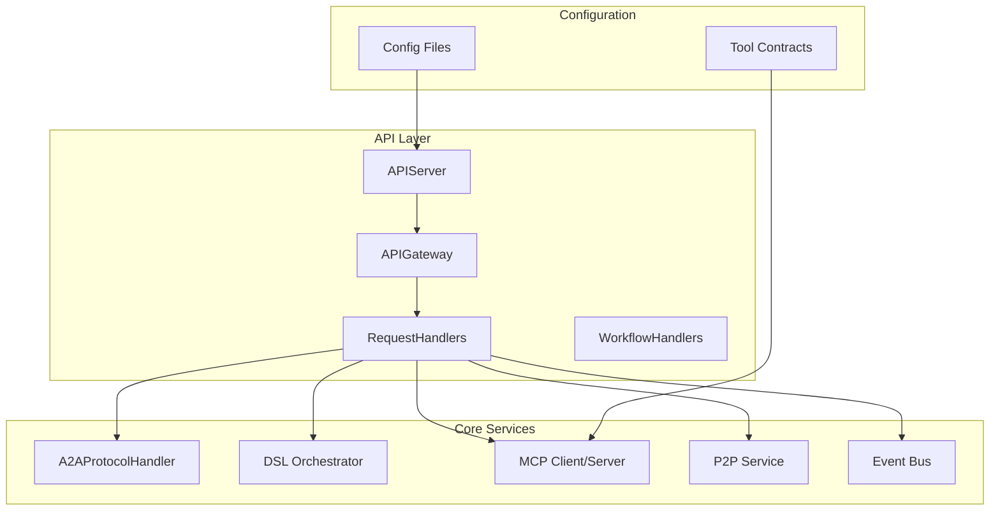
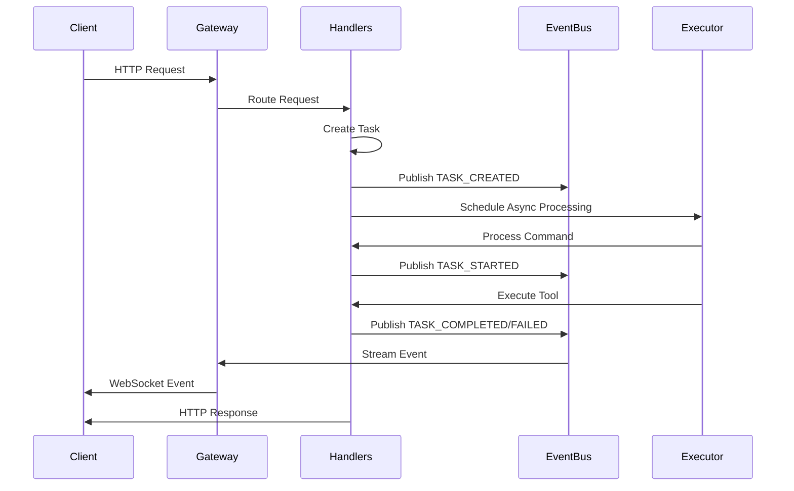
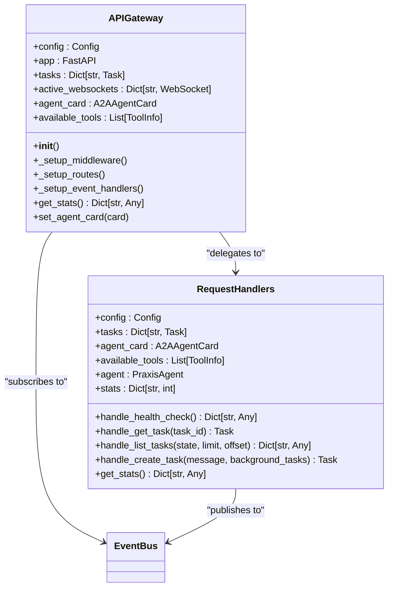
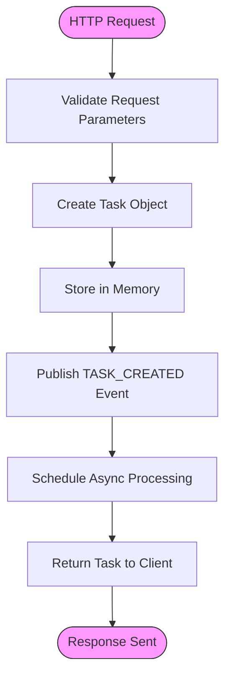
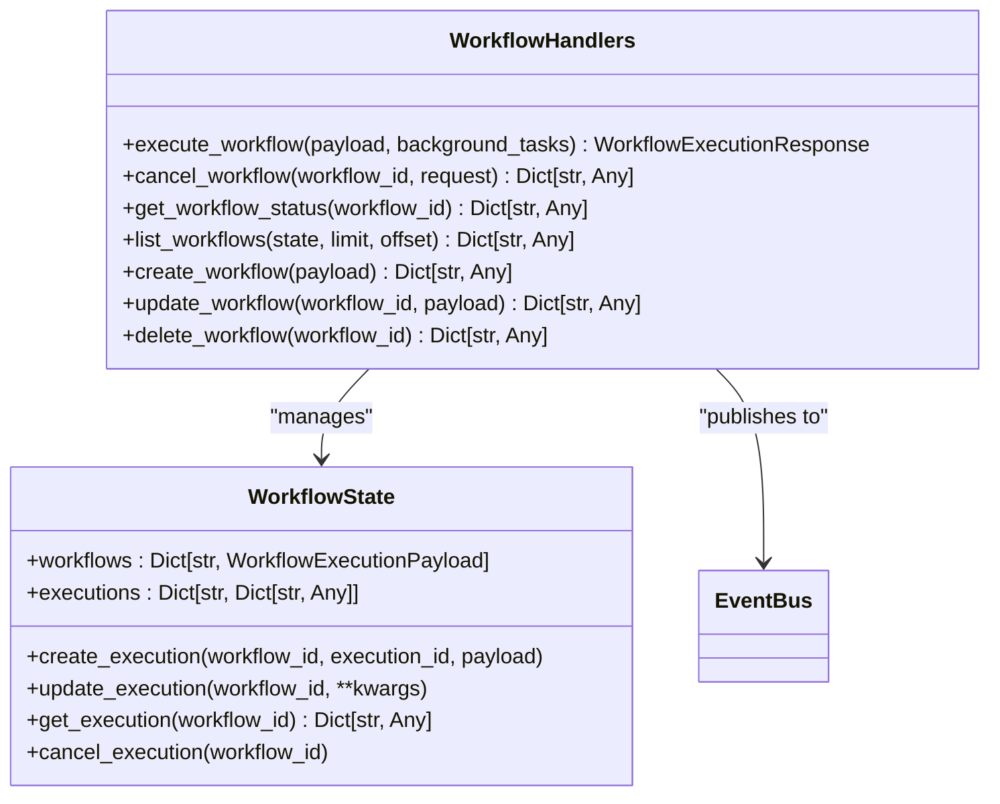
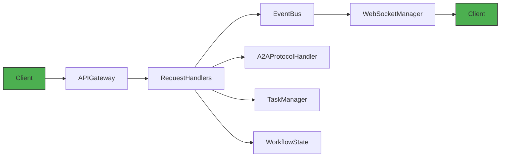

# REST API Reference

## Table of Contents
1. [Introduction](#introduction)
2. [Project Structure](#project-structure)
3. [Core Components](#core-components)
4. [Architecture Overview](#architecture-overview)
5. [Detailed Component Analysis](#detailed-component-analysis)
6. [Dependency Analysis](#dependency-analysis)
7. [Performance Considerations](#performance-considerations)
8. [Troubleshooting Guide](#troubleshooting-guide)
9. [Conclusion](#conclusion)

## Introduction
This document provides comprehensive REST API documentation for the PraxisAgent system. It details all HTTP endpoints for agent management, task execution, workflow orchestration, and health monitoring. The API is built on FastAPI and supports both REST and JSON-RPC 2.0 protocols. The system enables asynchronous task processing, WebSocket event streaming, and integration with external tools via MCP (Model Control Protocol). This reference includes endpoint specifications, request/response schemas, authentication policies, and usage examples.

## Project Structure
The PraxisAgent system follows a modular architecture with clear separation of concerns. The API layer resides in `src/praxis_sdk/api/` and integrates with core components for task management, DSL processing, and P2P communication. Configuration is managed through YAML files in the `configs/` directory, while tools are defined in the `tools/` directory with contract specifications.

**Diagram sources**
- [gateway.py](file://src/praxis_sdk/api/gateway.py#L79-L119)
- [server.py](file://src/praxis_sdk/api/server.py#L133-L176)
- [handlers.py](file://src/praxis_sdk/api/handlers.py#L27-L64)

**Section sources**
- [gateway.py](file://src/praxis_sdk/api/gateway.py#L79-L119)
- [server.py](file://src/praxis_sdk/api/server.py#L133-L176)

## Core Components
The PraxisAgent system's API layer consists of several key components that handle HTTP requests, manage tasks, and coordinate workflows. The `APIGateway` class serves as the central entry point, routing requests to appropriate handlers. The `RequestHandlers` class contains business logic for task creation and retrieval, while `WorkflowHandlers` manages complex workflow operations for frontend integration.

The system uses an event-driven architecture where the `EventBus` broadcasts state changes to WebSocket clients. Task status is maintained in memory and updated via events from the execution engine. The A2A (Agent-to-Agent) protocol enables standardized communication between agents using JSON-RPC 2.0.

**Section sources**
- [gateway.py](file://src/praxis_sdk/api/gateway.py#L79-L119)
- [handlers.py](file://src/praxis_sdk/api/handlers.py#L27-L64)
- [workflow_handlers.py](file://src/praxis_sdk/api/workflow_handlers.py#L142-L173)

## Architecture Overview
The PraxisAgent API follows a layered architecture with clear separation between routing, business logic, and integration components. The FastAPI application is initialized in `server.py` and configured with middleware for CORS and request logging. The `APIGateway` sets up routes and manages WebSocket connections, while `RequestHandlers` processes requests and interacts with the event bus.

Task execution follows an asynchronous pattern where requests create tasks that are processed in the background. The system publishes events for task lifecycle changes, which are broadcast to WebSocket clients. Workflow operations are handled separately to support frontend requirements, with dedicated endpoints for creation, execution, and monitoring.

**Diagram sources**
- [server.py](file://src/praxis_sdk/api/server.py#L171-L203)
- [gateway.py](file://src/praxis_sdk/api/gateway.py#L149-L184)
- [handlers.py](file://src/praxis_sdk/api/handlers.py#L384-L426)

## Detailed Component Analysis

### API Gateway Analysis
The `APIGateway` class is the central routing component that initializes the FastAPI application and sets up all HTTP endpoints. It maintains in-memory storage for tasks and active WebSocket connections, providing a unified interface for the entire API surface.

**Diagram sources**
- [gateway.py](file://src/praxis_sdk/api/gateway.py#L79-L119)
- [handlers.py](file://src/praxis_sdk/api/handlers.py#L27-L64)

### Request Handling Flow
The request handling process follows a consistent pattern across all endpoints, with standardized error handling, statistics collection, and event publishing. When a task creation request arrives, the system creates a task object, stores it in memory, and schedules asynchronous processing.

**Diagram sources**
- [handlers.py](file://src/praxis_sdk/api/handlers.py#L384-L426)
- [gateway.py](file://src/praxis_sdk/api/gateway.py#L149-L184)

### Workflow Orchestration
The workflow system provides specialized endpoints for managing complex multi-step processes. These endpoints are designed for frontend integration and support full CRUD operations on workflow definitions, as well as execution control and status monitoring.

**Diagram sources**
- [workflow_handlers.py](file://src/praxis_sdk/api/workflow_handlers.py#L142-L173)
- [server.py](file://src/praxis_sdk/api/server.py#L683-L710)

**Section sources**
- [workflow_handlers.py](file://src/praxis_sdk/api/workflow_handlers.py#L142-L173)
- [server.py](file://src/praxis_sdk/api/server.py#L683-L710)

## Dependency Analysis
The API components have well-defined dependencies that follow the dependency inversion principle. The `APIGateway` depends on `RequestHandlers` for business logic, while `RequestHandlers` depends on core services like the event bus and A2A protocol handler. This layered approach allows for easier testing and maintenance.

**Diagram sources**
- [gateway.py](file://src/praxis_sdk/api/gateway.py#L79-L119)
- [handlers.py](file://src/praxis_sdk/api/handlers.py#L27-L64)
- [server.py](file://src/praxis_sdk/api/server.py#L72-L96)

**Section sources**
- [gateway.py](file://src/praxis_sdk/api/gateway.py#L79-L119)
- [handlers.py](file://src/praxis_sdk/api/handlers.py#L27-L64)

## Performance Considerations
The current implementation uses in-memory storage for tasks and state, which provides high performance but limits scalability and persistence. For production deployments, consider implementing persistent storage for tasks to survive process restarts.

The system handles asynchronous operations efficiently using FastAPI's background tasks, but long-running operations should be monitored for resource consumption. WebSocket connections are managed through a dedicated manager that handles connection lifecycle and event broadcasting.

Rate limiting is not currently implemented but should be considered for production environments to prevent abuse. The API supports content negotiation through standard HTTP headers, with JSON being the primary format for both requests and responses.

## Troubleshooting Guide
Common issues with the PraxisAgent API typically involve configuration errors, connectivity problems, or tool availability. When troubleshooting, check the following:

1. Verify the agent card is properly configured with correct URL and available tools
2. Ensure the event bus is functioning and events are being published
3. Check WebSocket connections are being established and maintained
4. Validate that external MCP servers are reachable and tools are discovered

The system provides several diagnostic endpoints:
- `/stats` - Comprehensive system statistics
- `/api/test/query-peer-card` - Cross-agent communication testing
- `/health` - Basic health check

Monitor logs for errors related to task processing, tool execution, or connection failures. The request handlers maintain statistics that can help identify performance bottlenecks or error patterns.

**Section sources**
- [gateway.py](file://src/praxis_sdk/api/gateway.py#L529-L547)
- [server.py](file://src/praxis_sdk/api/server.py#L401-L430)
- [handlers.py](file://src/praxis_sdk/api/handlers.py#L717-L750)

## Conclusion
The PraxisAgent system provides a comprehensive REST API for agent management, task execution, and workflow orchestration. The API is well-structured with clear separation of concerns and follows modern web standards. Key features include asynchronous task processing, WebSocket event streaming, and standardized A2A communication.

For production deployment, consider implementing persistent task storage, rate limiting, and enhanced monitoring. The current architecture supports horizontal scaling through P2P connections between agents, enabling distributed processing of tasks across multiple nodes.

The system is designed for extensibility, with clear integration points for custom tools and external services via the MCP protocol. The frontend-compatible workflow endpoints make it suitable for integration with web applications requiring complex orchestration capabilities.

**Referenced Files in This Document**   
- [gateway.py](file://src/praxis_sdk/api/gateway.py)
- [server.py](file://src/praxis_sdk/api/server.py)
- [handlers.py](file://src/praxis_sdk/api/handlers.py)
- [workflow_handlers.py](file://src/praxis_sdk/api/workflow_handlers.py)
- [models.py](file://src/praxis_sdk/api/models.py)
- [protocol.py](file://src/praxis_sdk/a2a/protocol.py)