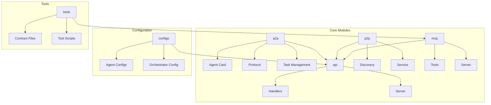
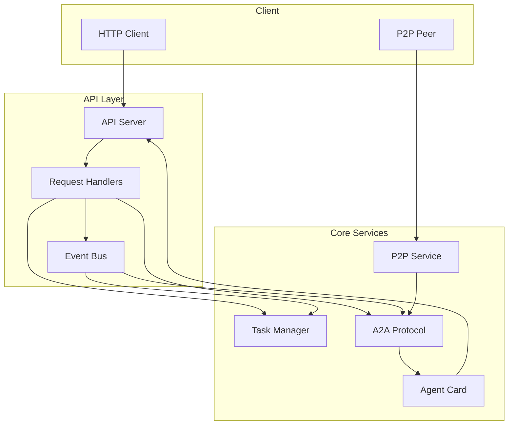
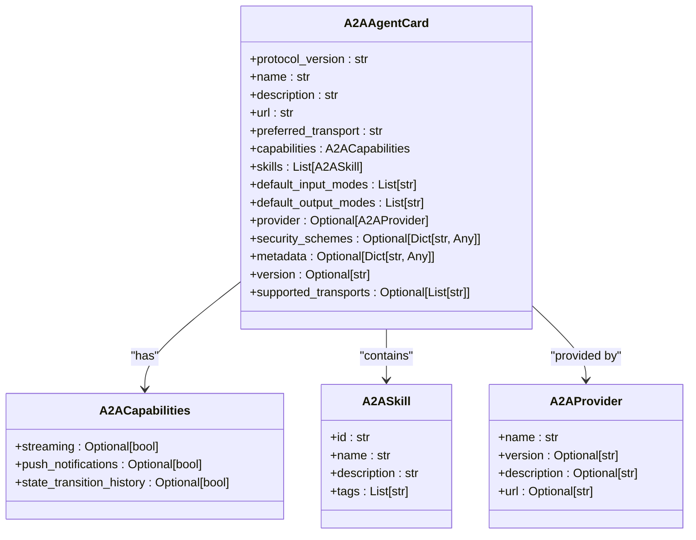
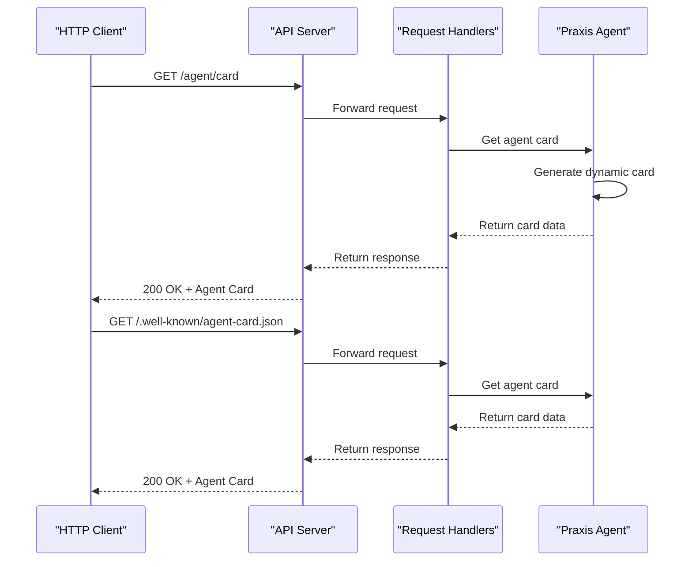
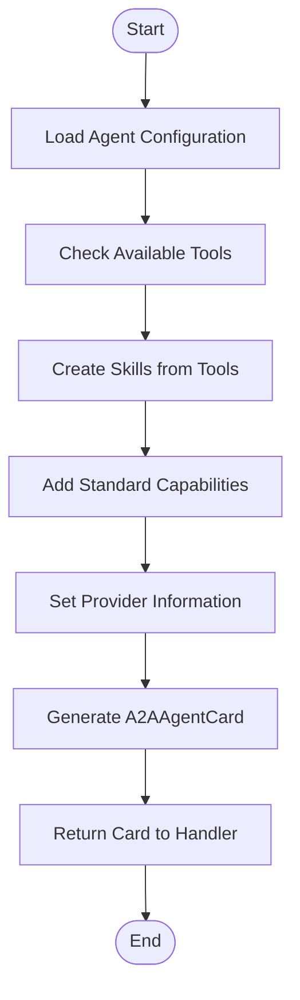
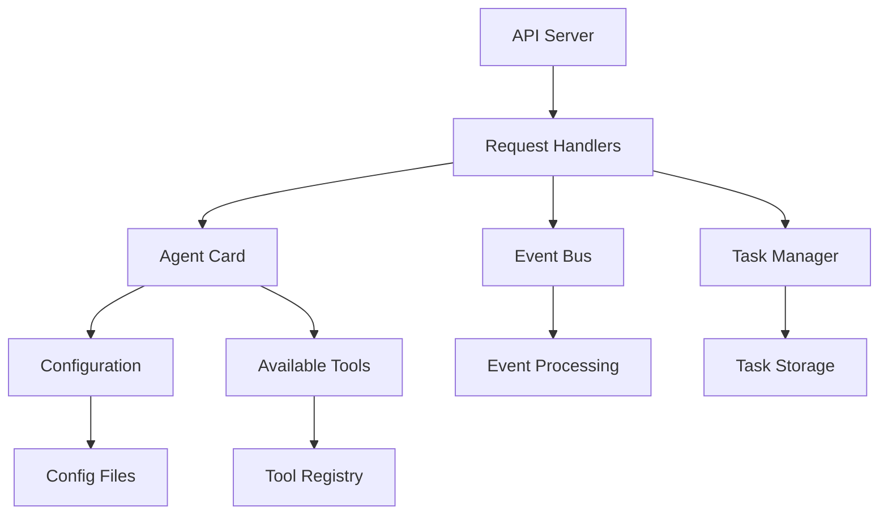

# Agent Management API

## Table of Contents
1. [Introduction](#introduction)
2. [Project Structure](#project-structure)
3. [Core Components](#core-components)
4. [Architecture Overview](#architecture-overview)
5. [Detailed Component Analysis](#detailed-component-analysis)
6. [Dependency Analysis](#dependency-analysis)
7. [Performance Considerations](#performance-considerations)
8. [Troubleshooting Guide](#troubleshooting-guide)
9. [Conclusion](#conclusion)

## Introduction
The Agent Management API in the Praxis SDK provides a standardized interface for agent discovery, capability exchange, and interoperability through the A2A (Agent-to-Agent) protocol. This document details the implementation and usage of key endpoints such as `/agent/card`, `/card`, and `/.well-known/agent-card.json` that expose agent metadata, supported transports, and functional capabilities. The API enables service discovery, dynamic capability negotiation, and cross-agent communication, forming the foundation for decentralized agent collaboration.

## Project Structure
The Praxis SDK follows a modular architecture with clear separation of concerns. Core functionality is organized into distinct packages including `a2a` for agent-to-agent communication, `api` for HTTP endpoints, `p2p` for peer-to-peer networking, and `mcp` for tool integration. Configuration files are stored in the `configs` directory, while tools and their contracts reside in the `tools` directory. The API server integrates these components through request handlers and event-driven communication.

**Diagram sources**
- [server.py](file://src/praxis_sdk/api/server.py)
- [models.py](file://src/praxis_sdk/a2a/models.py)

## Core Components
The Agent Management API centers around the A2AAgentCard model which encapsulates agent metadata, capabilities, and skills. This card is dynamically generated from configuration and updated during runtime to reflect current capabilities. The API gateway serves this card through multiple endpoints, enabling both direct access and standardized discovery. Request handlers process incoming requests, validate parameters, and coordinate with underlying services to fulfill commands.

**Section sources**
- [models.py](file://src/praxis_sdk/a2a/models.py#L240-L262)
- [handlers.py](file://src/praxis_sdk/api/handlers.py#L100-L150)

## Architecture Overview
The system architecture integrates HTTP-based API endpoints with P2P networking and event-driven processing. The API server exposes REST and WebSocket endpoints that interact with request handlers. These handlers coordinate with the event bus, task manager, and protocol handler to process commands and maintain state. Agent cards are dynamically generated and served through multiple endpoints to support different client requirements.

**Diagram sources**
- [server.py](file://src/praxis_sdk/api/server.py#L401-L430)
- [agent.py](file://src/praxis_sdk/agent.py#L300-L350)

## Detailed Component Analysis

### Agent Card Model Analysis
The A2AAgentCard model defines the structure of agent metadata and capabilities according to the A2A specification. It includes fields for protocol version, name, description, URL, preferred transport, capabilities, skills, and provider information. The model supports both A2A-standard fields and compatibility fields for backward compatibility.

**Diagram sources**
- [models.py](file://src/praxis_sdk/a2a/models.py#L240-L262)

**Section sources**
- [models.py](file://src/praxis_sdk/a2a/models.py#L240-L262)

### API Endpoint Flow Analysis
The agent card retrieval process involves multiple endpoints that serve the same underlying data with different URL patterns. The request flow starts at the API server, passes through request handlers, and returns the dynamically generated agent card. This flow supports both direct access and standardized discovery mechanisms.

**Diagram sources**
- [server.py](file://src/praxis_sdk/api/server.py#L401-L430)
- [handlers.py](file://src/praxis_sdk/api/handlers.py#L200-L250)

**Section sources**
- [server.py](file://src/praxis_sdk/api/server.py#L401-L430)
- [handlers.py](file://src/praxis_sdk/api/handlers.py#L200-L250)

### Dynamic Card Generation Analysis
The agent card is dynamically generated based on configuration and runtime state. The generation process incorporates available tools, skills, and capabilities to create a comprehensive representation of the agent's functionality. This dynamic approach ensures that the card accurately reflects current capabilities and supports service discovery in changing environments.

**Diagram sources**
- [agent.py](file://src/praxis_sdk/agent.py#L300-L350)
- [models.py](file://src/praxis_sdk/a2a/models.py#L400-L450)

**Section sources**
- [agent.py](file://src/praxis_sdk/agent.py#L300-L350)

## Dependency Analysis
The Agent Management API components have well-defined dependencies that enable modularity and extensibility. The API server depends on request handlers, which in turn depend on the agent card and event bus. The agent card generation depends on configuration and available tools. This dependency structure allows for independent development and testing of components while maintaining integration through well-defined interfaces.

**Diagram sources**
- [server.py](file://src/praxis_sdk/api/server.py)
- [agent.py](file://src/praxis_sdk/agent.py)

**Section sources**
- [server.py](file://src/praxis_sdk/api/server.py)
- [agent.py](file://src/praxis_sdk/agent.py)

## Performance Considerations
The Agent Management API is designed for high availability and low-latency responses. Agent card retrieval is optimized through caching and pre-generation where possible. The use of asynchronous request handling allows for concurrent processing of multiple requests without blocking. The system minimizes serialization overhead by using efficient data structures and direct object mapping.

## Troubleshooting Guide
Common issues with the Agent Management API typically involve configuration errors, missing dependencies, or network connectivity problems. When agent card endpoints return errors, verify that the agent is properly initialized and that configuration files are correctly formatted. For P2P-related issues, ensure that network ports are open and that peer discovery is functioning correctly. Monitoring logs can help identify specific failure points in the request processing chain.

**Section sources**
- [server.py](file://src/praxis_sdk/api/server.py#L401-L430)
- [handlers.py](file://src/praxis_sdk/api/handlers.py#L200-L250)

## Conclusion
The Agent Management API in the Praxis SDK provides a robust foundation for agent discovery and interoperability through standardized endpoints and dynamic capability exchange. By implementing the A2A protocol specification, it enables seamless communication between agents regardless of implementation details. The modular architecture supports extensibility and integration with external service directories, making it suitable for complex multi-agent systems. Proper configuration and monitoring ensure reliable operation in production environments.

**Referenced Files in This Document**   
- [server.py](file://src/praxis_sdk/api/server.py)
- [models.py](file://src/praxis_sdk/a2a/models.py)
- [handlers.py](file://src/praxis_sdk/api/handlers.py)
- [agent.py](file://src/praxis_sdk/agent.py)
- [protocol.py](file://src/praxis_sdk/a2a/protocol.py)