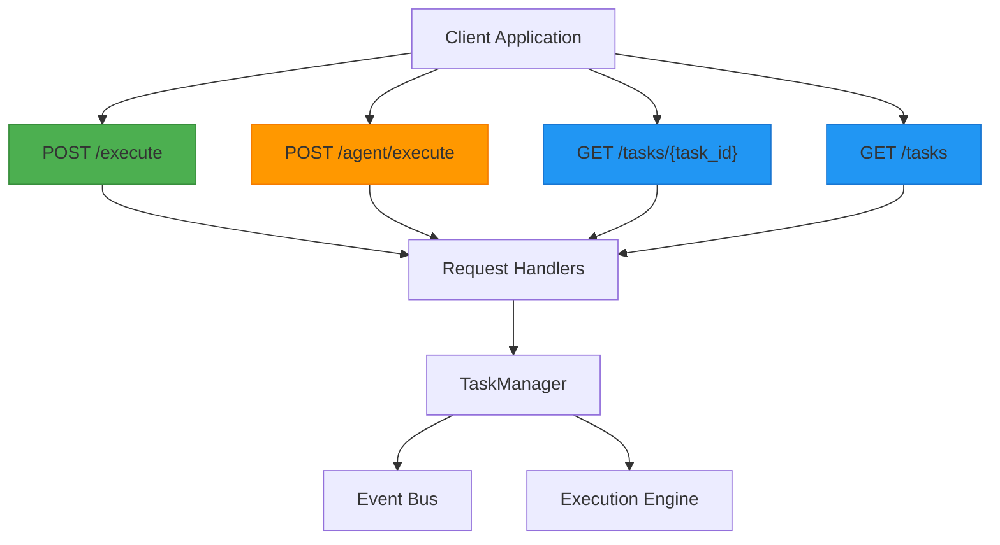
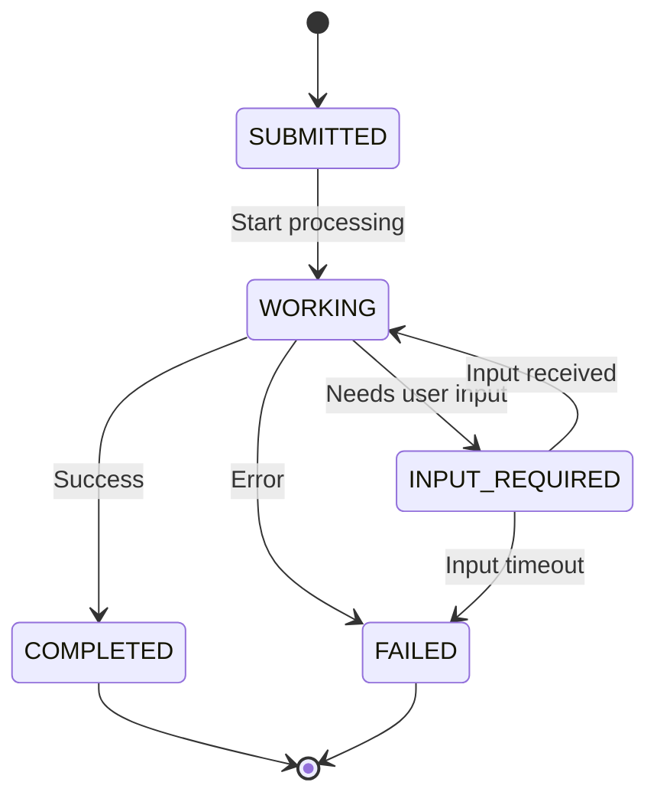
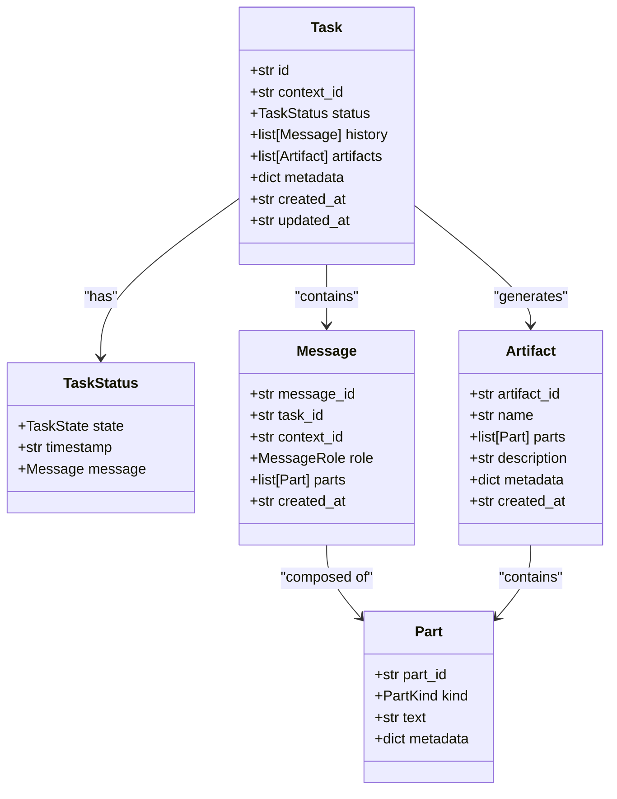
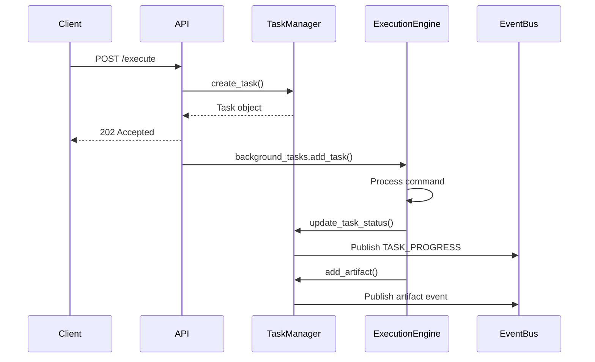
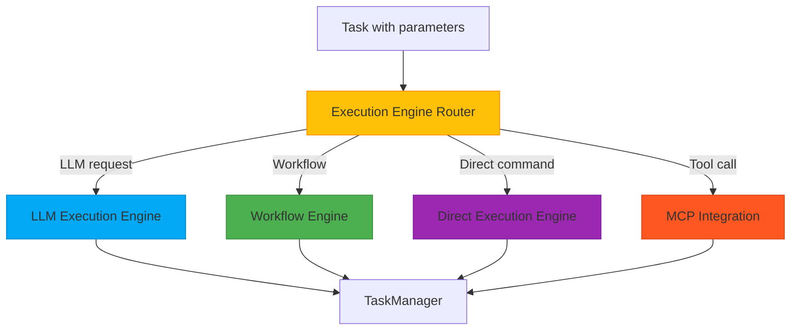

# Task Execution API


## Table of Contents
1. [Task Execution API](#task-execution-api)
2. [API Endpoints Overview](#api-endpoints-overview)
3. [Task Lifecycle and State Management](#task-lifecycle-and-state-management)
4. [A2A JSON-RPC 2.0 Protocol](#a2a-json-rpc-20-protocol)
5. [Task and Message Models](#task-and-message-models)
6. [Background Task Processing](#background-task-processing)
7. [Event Bus Integration](#event-bus-integration)
8. [Error Handling and Status Codes](#error-handling-and-status-codes)
9. [Execution Engine Selection](#execution-engine-selection)
10. [Client Examples](#client-examples)

## API Endpoints Overview

The Task Execution API provides endpoints for submitting, retrieving, and managing tasks within the A2A (Agent-to-Agent) framework. The primary endpoints include `/execute`, `/agent/execute` (legacy), `/tasks`, and `/tasks/{task_id}`.



**Diagram sources**
- [server.py](file://src/praxis_sdk/api/server.py#L171-L203)

**Section sources**
- [server.py](file://src/praxis_sdk/api/server.py#L171-L203)
- [gateway.py](file://src/praxis_sdk/api/gateway.py#L149-L184)

### Main Execution Endpoint

The `/execute` endpoint is the primary interface for submitting tasks using the A2A-compliant JSON-RPC 2.0 protocol. It accepts a JSON-RPC request object containing method, parameters, and ID.

```python
@app.post("/execute")
async def execute_command_a2a(request: dict, background_tasks: BackgroundTasks):
    """Main A2A execution endpoint supporting JSON-RPC 2.0"""
    return await get_request_handlers().handle_execute_command(request, background_tasks)
```

### Legacy Execution Endpoint

The `/agent/execute` endpoint maintains backward compatibility with older clients. It routes requests through the same handler as the main execution endpoint.

```python
@app.post("/agent/execute") 
async def execute_command_legacy(request: dict, background_tasks: BackgroundTasks):
    """Legacy execution endpoint for backward compatibility"""
    return await get_request_handlers().handle_execute_command(request, background_tasks)
```

### Task Management Endpoints

The `/tasks` endpoints provide CRUD operations for task management:

- `GET /tasks/{task_id}`: Retrieve a specific task by ID
- `GET /tasks`: List tasks with optional filtering and pagination
- `POST /tasks`: Create a new task from a message

```python
@self.app.get("/tasks/{task_id}", response_model=Task)
async def get_task(task_id: str):
    """Get task by ID."""
    task = self.tasks.get(task_id)
    if not task:
        raise HTTPException(status_code=404, detail="Task not found")
    return task
```

## Task Lifecycle and State Management

Tasks progress through a well-defined state machine that ensures proper execution flow and error handling.



**Diagram sources**
- [task_manager.py](file://src/praxis_sdk/a2a/task_manager.py#L417-L455)

**Section sources**
- [task_manager.py](file://src/praxis_sdk/a2a/task_manager.py#L205-L242)
- [task_manager.py](file://src/praxis_sdk/a2a/task_manager.py#L241-L274)

### Valid State Transitions

The TaskManager enforces valid state transitions according to the A2A specification:

| From State | To States |
|-----------|-----------|
| SUBMITTED | WORKING, FAILED |
| WORKING | COMPLETED, FAILED, INPUT_REQUIRED |
| INPUT_REQUIRED | WORKING, FAILED |
| COMPLETED | (none - terminal) |
| FAILED | (none - terminal) |

```python
def _is_valid_transition(self, from_state: TaskState, to_state: TaskState) -> bool:
    """Validate task state transitions."""
    
    valid_transitions = {
        TaskState.SUBMITTED: [TaskState.WORKING, TaskState.FAILED],
        TaskState.WORKING: [TaskState.COMPLETED, TaskState.FAILED, TaskState.INPUT_REQUIRED],
        TaskState.INPUT_REQUIRED: [TaskState.WORKING, TaskState.FAILED],
        TaskState.COMPLETED: [],  # Terminal state
        TaskState.FAILED: [],     # Terminal state
    }
    
    return to_state in valid_transitions.get(from_state, [])
```

## A2A JSON-RPC 2.0 Protocol

The API implements the A2A-compliant JSON-RPC 2.0 specification for task submission and retrieval.

### Request Format

```json
{
  "jsonrpc": "2.0",
  "id": "request-123",
  "method": "message/send",
  "params": {
    "message": {
      "role": "user",
      "parts": [
        {
          "kind": "text",
          "text": "Summarize this document"
        }
      ]
    }
  }
}
```

### Response Format

Successful response:
```json
{
  "jsonrpc": "2.0",
  "id": "request-123",
  "result": {
    "id": "task-456",
    "status": {
      "state": "submitted",
      "timestamp": "2023-12-07T10:30:00Z"
    },
    "context_id": "context-789"
  }
}
```

Error response:
```json
{
  "jsonrpc": "2.0",
  "id": "request-123",
  "error": {
    "code": 4001,
    "message": "Invalid parameters",
    "data": "Missing required field: message"
  }
}
```

**Section sources**
- [protocol.py](file://src/praxis_sdk/a2a/protocol.py#L213-L248)
- [handlers.py](file://src/praxis_sdk/api/handlers.py#L182-L216)

## Task and Message Models

The system uses well-defined data models for tasks and messages, ensuring consistency across the API.

### Task Model



**Diagram sources**
- [models.py](file://src/praxis_sdk/a2a/models.py)
- [models.py](file://src/praxis_sdk/api/models.py)

**Section sources**
- [models.py](file://src/praxis_sdk/a2a/models.py)
- [models.py](file://src/praxis_sdk/api/models.py)

### Model Definitions

The Task model represents a unit of work with its state, history, and artifacts:

```python
class Task(BaseModel):
    """Represents a task in the A2A system."""
    
    id: str = Field(default_factory=lambda: f"task_{uuid4().hex[:8]}")
    context_id: Optional[str] = None
    status: TaskStatus = Field(default_factory=TaskStatus)
    history: List[Message] = Field(default_factory=list)
    artifacts: List[Artifact] = Field(default_factory=list)
    metadata: Dict[str, Any] = Field(default_factory=dict)
    created_at: str = Field(default_factory=lambda: datetime.utcnow().isoformat() + "Z")
    updated_at: str = Field(default_factory=lambda: datetime.utcnow().isoformat() + "Z")
```

The Message model represents communication within a task:

```python
class Message(BaseModel):
    """Represents a message in the A2A system."""
    
    message_id: str = Field(default_factory=lambda: f"msg_{uuid4().hex[:8]}")
    task_id: Optional[str] = None
    context_id: Optional[str] = None
    role: MessageRole
    parts: List[Part]
    created_at: str = Field(default_factory=lambda: datetime.utcnow().isoformat() + "Z")
```

## Background Task Processing

Tasks are processed asynchronously using FastAPI's BackgroundTasks, enabling non-blocking execution.



**Diagram sources**
- [handlers.py](file://src/praxis_sdk/api/handlers.py#L384-L426)
- [task_manager.py](file://src/praxis_sdk/a2a/task_manager.py#L123-L167)

**Section sources**
- [handlers.py](file://src/praxis_sdk/api/handlers.py#L384-L426)
- [task_manager.py](file://src/praxis_sdk/a2a/task_manager.py#L123-L167)

### Processing Workflow

1. Client submits task via `/execute`
2. API creates task in SUBMITTED state
3. Task is stored in memory with timeout tracking
4. Background task begins processing
5. Task status updates as processing progresses
6. Final state (COMPLETED or FAILED) is set upon completion

```python
background_tasks.add_task(
    self._process_command_async,
    task.id,
    command_text,
    task.context_id
)
```

## Event Bus Integration

The system uses an event bus for real-time updates and decoupled communication between components.

```mermaid
graph TB
API[API Layer] --> EventBus
TaskManager[TaskManager] --> EventBus
WebSocket[WebSocket Server] --> EventBus
Analytics[Analytics Service] --> EventBus
Logging[Logging Service] --> EventBus
EventBus --> WebSocket: TASK_CREATED
EventBus --> WebSocket: TASK_PROGRESS
EventBus --> WebSocket: TASK_COMPLETED
EventBus --> Analytics: Task metrics
EventBus --> Logging: State changes
classDef component fill:#E3F2FD,stroke:#1976D2;
class API,TaskManager,WebSocket,Analytics,Logging,EventBus component;
```

**Diagram sources**
- [task_manager.py](file://src/praxis_sdk/a2a/task_manager.py#L123-L167)
- [task_manager.py](file://src/praxis_sdk/a2a/task_manager.py#L241-L274)

**Section sources**
- [task_manager.py](file://src/praxis_sdk/a2a/task_manager.py#L123-L167)
- [task_manager.py](file://src/praxis_sdk/a2a/task_manager.py#L241-L274)

### Event Types

The following events are published during task execution:

- **TASK_CREATED**: When a new task is created
- **TASK_PROGRESS**: When task status changes
- **TASK_COMPLETED**: When task completes successfully
- **TASK_FAILED**: When task fails
- **ARTIFACT_ADDED**: When an artifact is generated

```python
await self.event_bus.publish_data(
    EventType.TASK_CREATED,
    {
        "task_id": task.id,
        "context_id": task.context_id,
        "task": task.dict(),
        "timeout": task_timeout,
    },
    source="task_manager"
)
```

## Error Handling and Status Codes

The API implements comprehensive error handling with appropriate HTTP status codes and A2A error codes.

### HTTP Status Codes

| Status Code | Meaning | Usage |
|-----------|-------|------|
| 200 | OK | Successful GET requests |
| 201 | Created | Task successfully created |
| 202 | Accepted | Task accepted for processing |
| 400 | Bad Request | Invalid request format |
| 404 | Not Found | Task not found |
| 422 | Unprocessable Entity | Validation errors |
| 500 | Internal Server Error | Unexpected server errors |

### A2A Error Codes

| Code | Name | Description |
|------|------|-------------|
| 4001 | INVALID_PARAMS | Invalid parameters in request |
| 4002 | TASK_NOT_FOUND | Task ID not found |
| 4003 | INVALID_STATE_TRANSITION | Attempted invalid state change |
| 4004 | EXECUTION_TIMEOUT | Task execution timed out |
| 5001 | INTERNAL_ERROR | Internal server error |

```python
raise HTTPException(status_code=404, detail="Task not found")
```

**Section sources**
- [gateway.py](file://src/praxis_sdk/api/gateway.py#L149-L184)
- [protocol.py](file://src/praxis_sdk/a2a/protocol.py#L285-L323)

## Execution Engine Selection

The task execution system integrates with various execution engines based on task requirements and configuration.



**Diagram sources**
- [execution/engine.py](file://src/praxis_sdk/execution/engine.py)
- [llm/workflow_planner.py](file://src/praxis_sdk/llm/workflow_planner.py)

The engine selection process considers:

1. **Task content analysis**: Natural language processing to determine intent
2. **Parameter inspection**: Examining request parameters for execution hints
3. **Configuration rules**: Predefined routing rules in configuration files
4. **Historical performance**: Past success rates of different engines

## Client Examples

### cURL Examples

Submit a task:
```bash
curl -X POST http://localhost:8000/execute \
  -H "Content-Type: application/json" \
  -d '{
    "jsonrpc": "2.0",
    "id": "req-123",
    "method": "message/send",
    "params": {
      "message": {
        "role": "user",
        "parts": [
          {
            "kind": "text",
            "text": "Calculate the sum of 2 + 2"
          }
        ]
      }
    }
  }'
```

Retrieve a task:
```bash
curl -X GET http://localhost:8000/tasks/task_abc123
```

List tasks:
```bash
curl -X GET "http://localhost:8000/tasks?state=completed&limit=10"
```

### Python Client Examples

```python
import requests
import json

class TaskExecutionClient:
    def __init__(self, base_url: str):
        self.base_url = base_url.rstrip('/')
    
    def execute_task(self, command: str) -> dict:
        """Submit a task for execution."""
        
        payload = {
            "jsonrpc": "2.0",
            "id": f"req_{hash(command)}",
            "method": "message/send",
            "params": {
                "message": {
                    "role": "user",
                    "parts": [
                        {
                            "kind": "text",
                            "text": command
                        }
                    ]
                }
            }
        }
        
        response = requests.post(
            f"{self.base_url}/execute",
            json=payload,
            headers={"Content-Type": "application/json"}
        )
        
        response.raise_for_status()
        return response.json()
    
    def get_task(self, task_id: str) -> dict:
        """Retrieve task status and details."""
        
        response = requests.get(f"{self.base_url}/tasks/{task_id}")
        response.raise_for_status()
        return response.json()
    
    def list_tasks(self, state: str = None, limit: int = 100) -> dict:
        """List tasks with optional filtering."""
        
        params = {"limit": limit}
        if state:
            params["state"] = state
            
        response = requests.get(f"{self.base_url}/tasks", params=params)
        response.raise_for_status()
        return response.json()

# Usage example
client = TaskExecutionClient("http://localhost:8000")

# Submit a task
result = client.execute_task("Summarize the benefits of renewable energy")
task_id = result["result"]["id"]
print(f"Task submitted: {task_id}")

# Poll for completion
import time
while True:
    task = client.get_task(task_id)
    state = task["result"]["status"]["state"]
    print(f"Task state: {state}")
    
    if state in ["completed", "failed"]:
        break
        
    time.sleep(1)
```

**Section sources**
- [server.py](file://src/praxis_sdk/api/server.py#L171-L203)
- [gateway.py](file://src/praxis_sdk/api/gateway.py#L149-L184)
- [handlers.py](file://src/praxis_sdk/api/handlers.py#L384-L426)

**Referenced Files in This Document**   
- [server.py](file://src/praxis_sdk/api/server.py#L171-L203)
- [gateway.py](file://src/praxis_sdk/api/gateway.py#L149-L184)
- [gateway.py](file://src/praxis_sdk/api/gateway.py#L180-L213)
- [protocol.py](file://src/praxis_sdk/a2a/protocol.py#L285-L323)
- [models.py](file://src/praxis_sdk/api/models.py#L146-L171)
- [task_manager.py](file://src/praxis_sdk/a2a/task_manager.py#L163-L208)
- [task_manager.py](file://src/praxis_sdk/a2a/task_manager.py#L123-L167)
- [task_manager.py](file://src/praxis_sdk/a2a/task_manager.py#L205-L242)
- [task_manager.py](file://src/praxis_sdk/a2a/task_manager.py#L241-L274)
- [task_manager.py](file://src/praxis_sdk/a2a/task_manager.py#L417-L455)
- [handlers.py](file://src/praxis_sdk/api/handlers.py#L384-L426)
- [handlers.py](file://src/praxis_sdk/api/handlers.py#L182-L216)
- [task_manager.py](file://src/praxis_sdk/a2a/task_manager.py)
- [models.py](file://src/praxis_sdk/a2a/models.py)
- [models.py](file://src/praxis_sdk/api/models.py)
- [models.py](file://src/praxis_sdk/workflow/models.py)