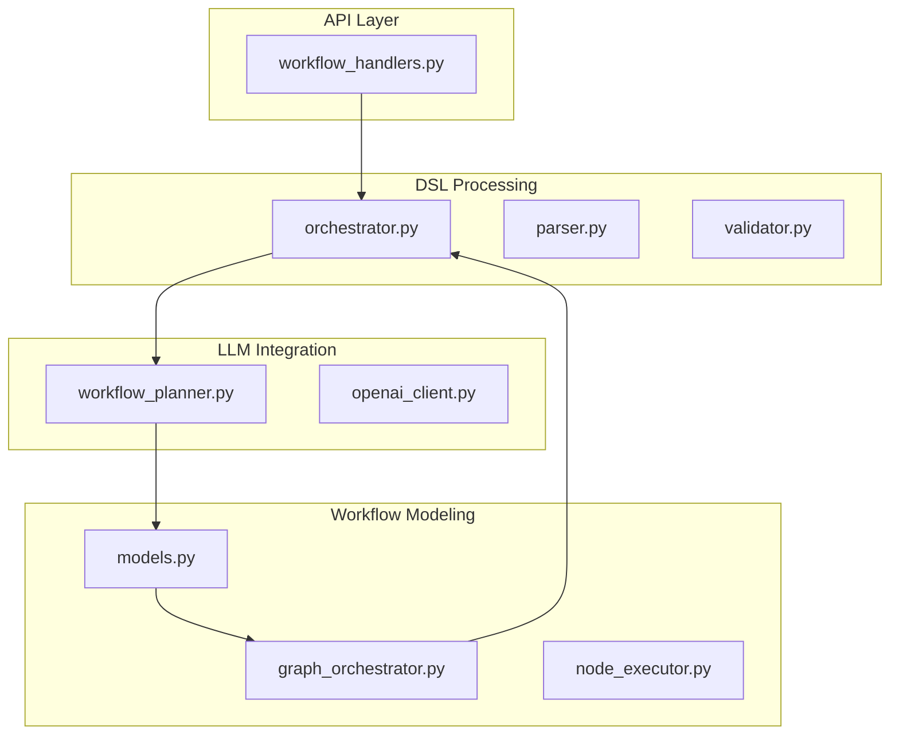
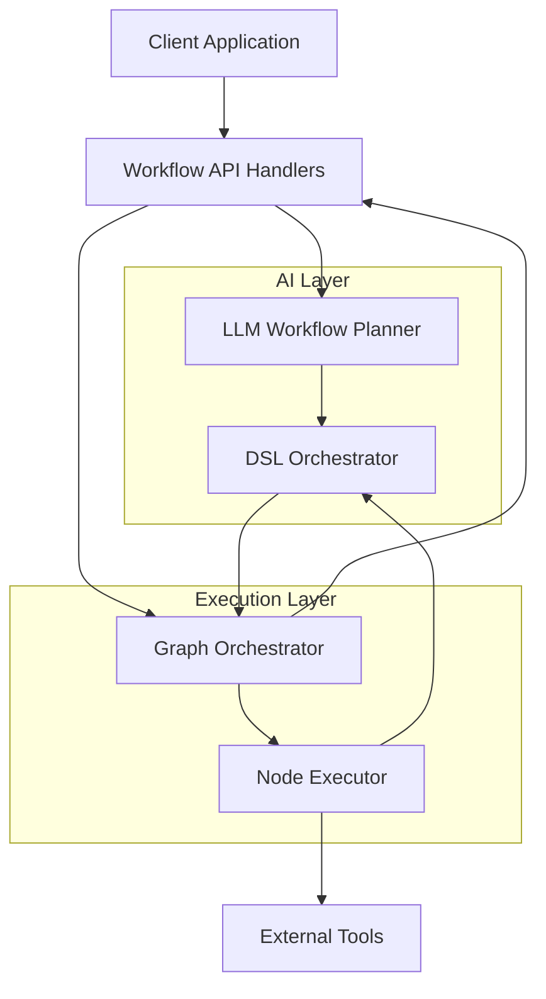
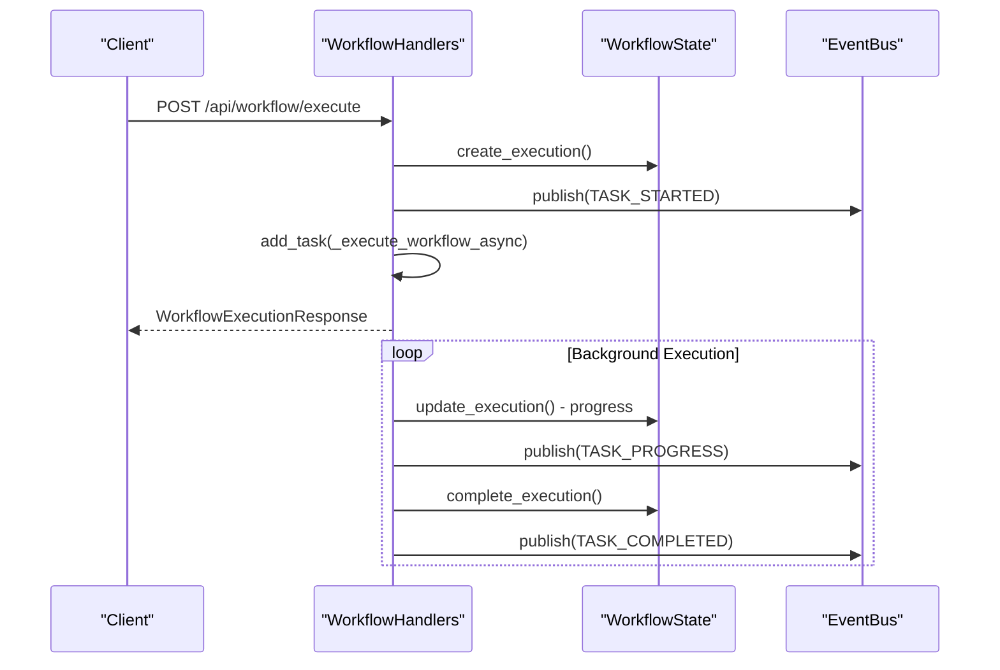
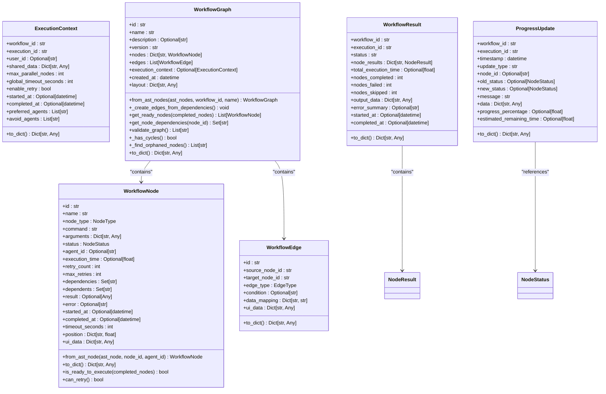
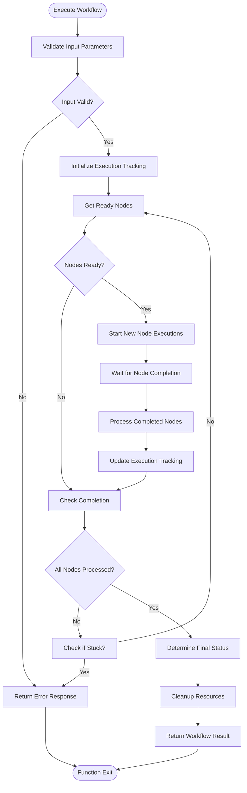
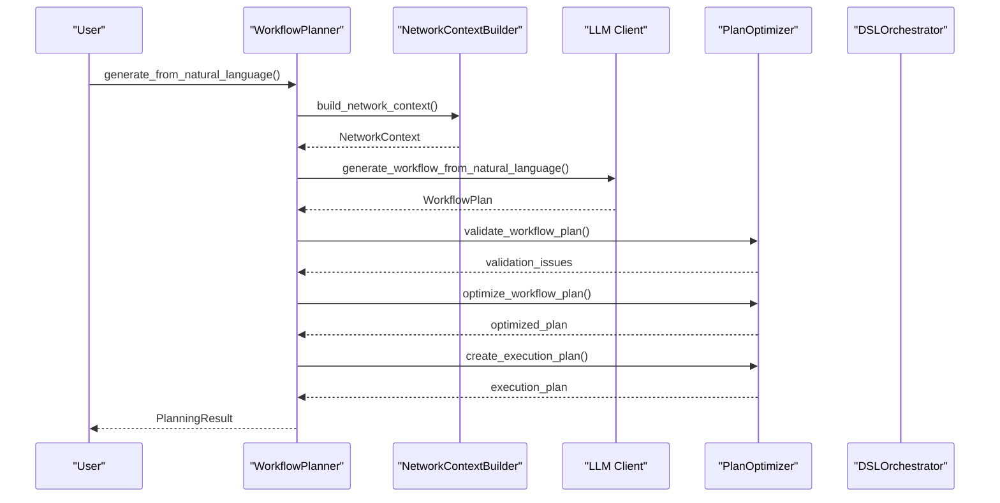
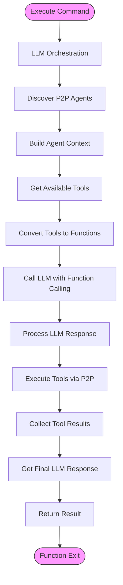
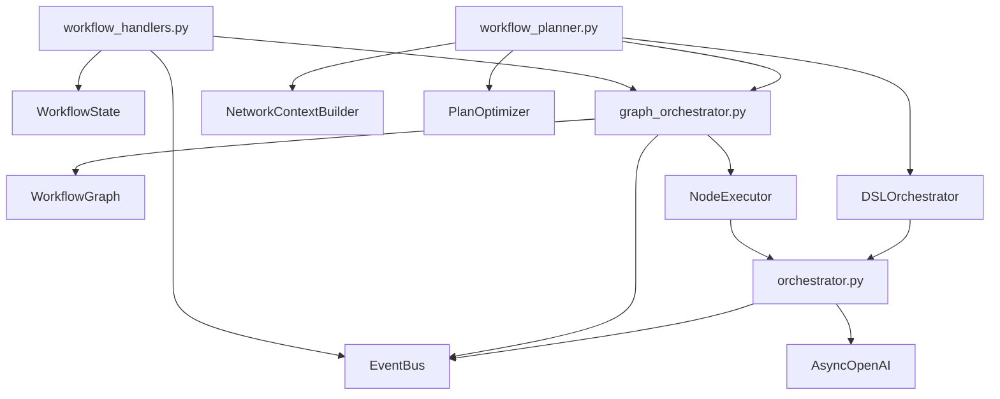

# Workflow Orchestration API

## Table of Contents
1. [Introduction](#introduction)
2. [Project Structure](#project-structure)
3. [Core Components](#core-components)
4. [Architecture Overview](#architecture-overview)
5. [Detailed Component Analysis](#detailed-component-analysis)
6. [Dependency Analysis](#dependency-analysis)
7. [Performance Considerations](#performance-considerations)
8. [Troubleshooting Guide](#troubleshooting-guide)
9. [Conclusion](#conclusion)

## Introduction
The Workflow Orchestration API provides a comprehensive system for managing and executing DSL-based workflows through a RESTful interface. This documentation details the API endpoints under `/api/workflow`, the workflow lifecycle, integration with the LLM planner and DSL orchestrator, and practical usage examples. The system enables users to create, execute, monitor, and manage complex workflows through both direct API calls and natural language processing.

## Project Structure
The project follows a modular structure with clear separation of concerns. The core workflow orchestration components are located in the `src/praxis_sdk` directory, with specific modules for API handling, DSL processing, workflow modeling, and execution orchestration.

**Diagram sources**
- [workflow_handlers.py](file://src/praxis_sdk/api/workflow_handlers.py)
- [orchestrator.py](file://src/praxis_sdk/dsl/orchestrator.py)
- [workflow_planner.py](file://src/praxis_sdk/llm/workflow_planner.py)
- [models.py](file://src/praxis_sdk/workflow/models.py)
- [graph_orchestrator.py](file://src/praxis_sdk/workflow/graph_orchestrator.py)

**Section sources**
- [workflow_handlers.py](file://src/praxis_sdk/api/workflow_handlers.py)
- [orchestrator.py](file://src/praxis_sdk/dsl/orchestrator.py)

## Core Components

The Workflow Orchestration API consists of several interconnected components that work together to provide a complete workflow management system. The core components include the API handlers that expose the REST endpoints, the workflow models that define the data structures, the graph orchestrator that manages execution, and the LLM-based planner that converts natural language to executable workflows.

**Section sources**
- [workflow_handlers.py](file://src/praxis_sdk/api/workflow_handlers.py#L1-L581)
- [models.py](file://src/praxis_sdk/workflow/models.py#L1-L512)

## Architecture Overview

The architecture follows a layered approach with clear separation between the API interface, workflow modeling, execution engine, and AI integration components. The system is designed to handle both simple DSL commands and complex multi-step workflows generated from natural language requests.

**Diagram sources**
- [workflow_handlers.py](file://src/praxis_sdk/api/workflow_handlers.py#L1-L581)
- [workflow_planner.py](file://src/praxis_sdk/llm/workflow_planner.py#L1-L490)
- [orchestrator.py](file://src/praxis_sdk/dsl/orchestrator.py#L1-L799)
- [graph_orchestrator.py](file://src/praxis_sdk/workflow/graph_orchestrator.py#L1-L654)

## Detailed Component Analysis

### API Handlers Analysis
The `workflow_handlers.py` module provides FastAPI handlers for the `/api/workflow/*` endpoints, ensuring compatibility with the frontend's API client expectations. It handles all CRUD operations for workflows and provides real-time status updates.

#### For API/Service Components:

**Diagram sources**
- [workflow_handlers.py](file://src/praxis_sdk/api/workflow_handlers.py#L1-L581)

**Section sources**
- [workflow_handlers.py](file://src/praxis_sdk/api/workflow_handlers.py#L1-L581)

### Workflow Models Analysis
The `models.py` file defines the core data structures for workflow orchestration using Python dataclasses. These models represent nodes, edges, execution contexts, and results in a workflow graph.

#### For Object-Oriented Components:

**Diagram sources**
- [models.py](file://src/praxis_sdk/workflow/models.py#L1-L512)

**Section sources**
- [models.py](file://src/praxis_sdk/workflow/models.py#L1-L512)

### Graph Orchestrator Analysis
The `graph_orchestrator.py` module is the main execution engine for visual workflows, providing parallel and sequential node execution, real-time progress tracking, and error recovery mechanisms.

#### For Complex Logic Components:

**Diagram sources**
- [graph_orchestrator.py](file://src/praxis_sdk/workflow/graph_orchestrator.py#L1-L654)

**Section sources**
- [graph_orchestrator.py](file://src/praxis_sdk/workflow/graph_orchestrator.py#L1-L654)

### LLM Workflow Planner Analysis
The `workflow_planner.py` module serves as the intelligent workflow generator that converts natural language requests into executable workflows using LLM technology.

#### For API/Service Components:

**Diagram sources**
- [workflow_planner.py](file://src/praxis_sdk/llm/workflow_planner.py#L1-L490)

**Section sources**
- [workflow_planner.py](file://src/praxis_sdk/llm/workflow_planner.py#L1-L490)

### DSL Orchestrator Analysis
The `orchestrator.py` module provides enhanced DSL command orchestration with Advanced DSL Processing Engine integration, supporting both simple DSL commands and natural language processing with LLM.

#### For Complex Logic Components:

**Diagram sources**
- [orchestrator.py](file://src/praxis_sdk/dsl/orchestrator.py#L1-L799)

**Section sources**
- [orchestrator.py](file://src/praxis_sdk/dsl/orchestrator.py#L1-L799)

## Dependency Analysis

The Workflow Orchestration API components have a well-defined dependency structure that enables modularity and separation of concerns. The API handlers depend on the workflow state management, which in turn integrates with the graph orchestrator for execution. The LLM workflow planner generates plans that are executed by the DSL orchestrator, creating a cohesive system for natural language to executable workflow conversion.

**Diagram sources**
- [workflow_handlers.py](file://src/praxis_sdk/api/workflow_handlers.py#L1-L581)
- [graph_orchestrator.py](file://src/praxis_sdk/workflow/graph_orchestrator.py#L1-L654)
- [workflow_planner.py](file://src/praxis_sdk/llm/workflow_planner.py#L1-L490)
- [orchestrator.py](file://src/praxis_sdk/dsl/orchestrator.py#L1-L799)

**Section sources**
- [workflow_handlers.py](file://src/praxis_sdk/api/workflow_handlers.py#L1-L581)
- [graph_orchestrator.py](file://src/praxis_sdk/workflow/graph_orchestrator.py#L1-L654)
- [workflow_planner.py](file://src/praxis_sdk/llm/workflow_planner.py#L1-L490)
- [orchestrator.py](file://src/praxis_sdk/dsl/orchestrator.py#L1-L799)

## Performance Considerations

The Workflow Orchestration API is designed with performance in mind, particularly for handling long-running workflows and real-time progress updates. The system uses asynchronous execution with background tasks to prevent blocking the main API thread. The graph orchestrator limits parallel execution to prevent resource exhaustion, with a default maximum of 5 parallel nodes.

For large workflows, the system provides estimated duration calculations based on node count (10 seconds per node with a minimum of 30 seconds). The event-driven architecture using the EventBus pattern enables efficient real-time updates without polling, reducing network overhead.

Caching mechanisms are implemented in the DSL orchestrator to avoid redundant LLM calls for similar commands. The workflow state is maintained in memory for active executions, providing fast access to status information.

## Troubleshooting Guide

When encountering issues with the Workflow Orchestration API, consider the following common problems and solutions:

**Section sources**
- [workflow_handlers.py](file://src/praxis_sdk/api/workflow_handlers.py#L1-L581)
- [graph_orchestrator.py](file://src/praxis_sdk/workflow/graph_orchestrator.py#L1-L654)
- [orchestrator.py](file://src/praxis_sdk/dsl/orchestrator.py#L1-L799)

### Common Issues

1. **Workflow execution timeout**: Workflows have a default timeout of 1800 seconds (30 minutes). For longer workflows, increase the `execution_timeout` parameter in the GraphOrchestrator initialization.

2. **LLM orchestration failures**: Ensure the OpenAI API key is properly configured in the environment variables or configuration file. Check the LLM service availability and rate limits.

3. **Node execution errors**: Verify that the required tools are available and properly registered in the tool registry. Check the agent's capabilities and P2P connectivity.

4. **Progress updates not received**: Confirm that the WebSocket connection is established and the EventBus is properly configured to broadcast events.

5. **Workflow validation errors**: Check for cycles in the workflow graph or orphaned nodes without dependencies. Ensure all edge references point to existing nodes.

### Debugging Tips

- Enable debug logging to trace the workflow execution path
- Use the `list_workflows` endpoint to inspect the state of active workflows
- Check the `get_workflow_status` response for detailed node-level information
- Monitor the EventBus for published events to verify progress updates
- Validate workflow definitions using the `validate_graph()` method before execution

## Conclusion

The Workflow Orchestration API provides a robust and flexible system for managing complex workflows through both programmatic API calls and natural language interaction. The architecture combines RESTful endpoints for direct control with LLM-powered natural language processing for intuitive workflow creation.

Key features include:
- Comprehensive CRUD operations for workflow management
- Real-time progress tracking through event-driven updates
- Support for both sequential and parallel execution
- Integration with LLM for natural language to workflow conversion
- Robust error handling and retry mechanisms
- Scalable architecture suitable for long-running workflows

The system is designed to be extensible, allowing for the addition of new tools, agents, and execution strategies while maintaining a consistent API interface.

**Referenced Files in This Document**   
- [workflow_handlers.py](file://src/praxis_sdk/api/workflow_handlers.py)
- [orchestrator.py](file://src/praxis_sdk/dsl/orchestrator.py)
- [workflow_planner.py](file://src/praxis_sdk/llm/workflow_planner.py)
- [models.py](file://src/praxis_sdk/workflow/models.py)
- [graph_orchestrator.py](file://src/praxis_sdk/workflow/graph_orchestrator.py)