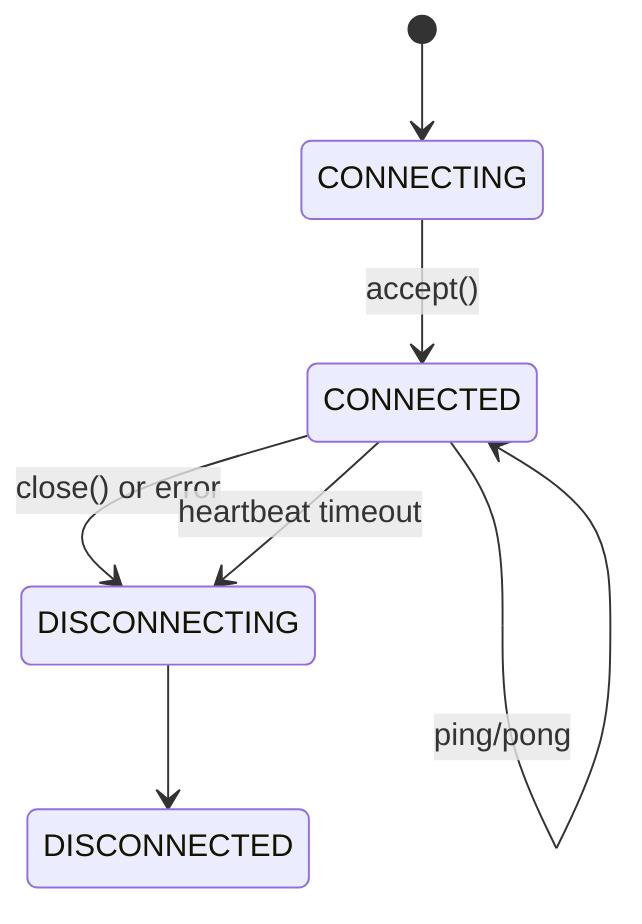
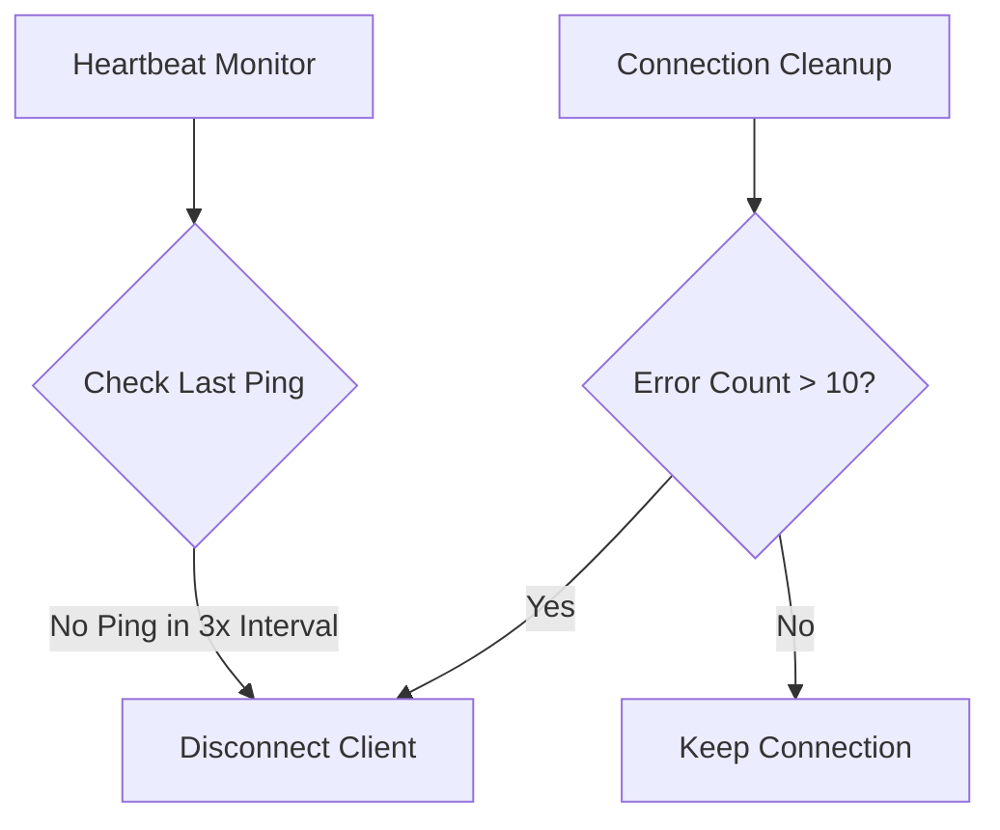
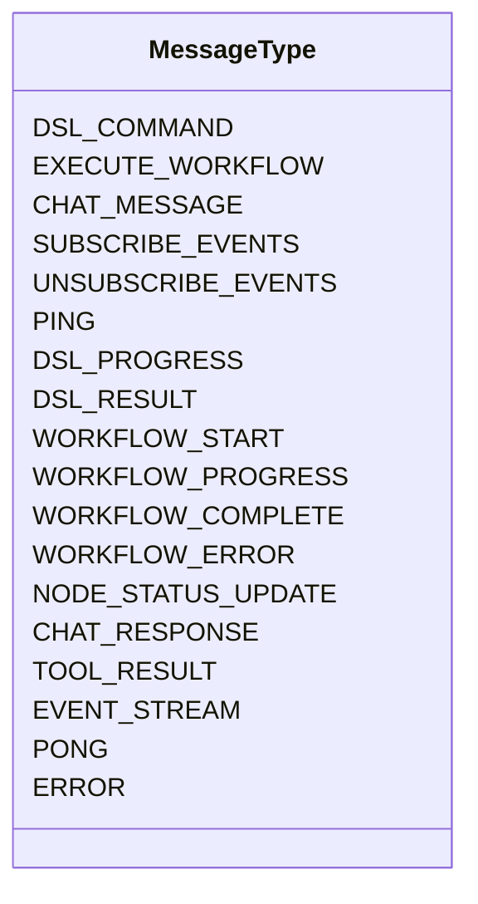
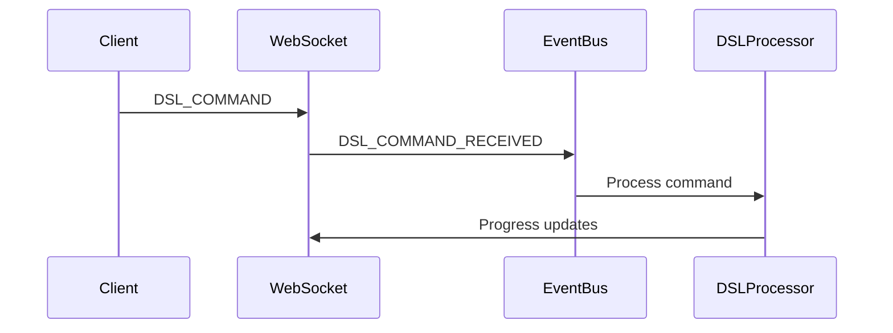
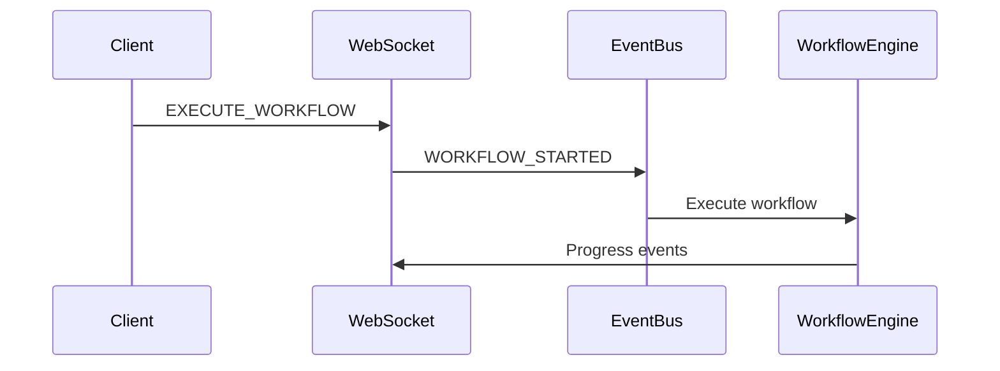
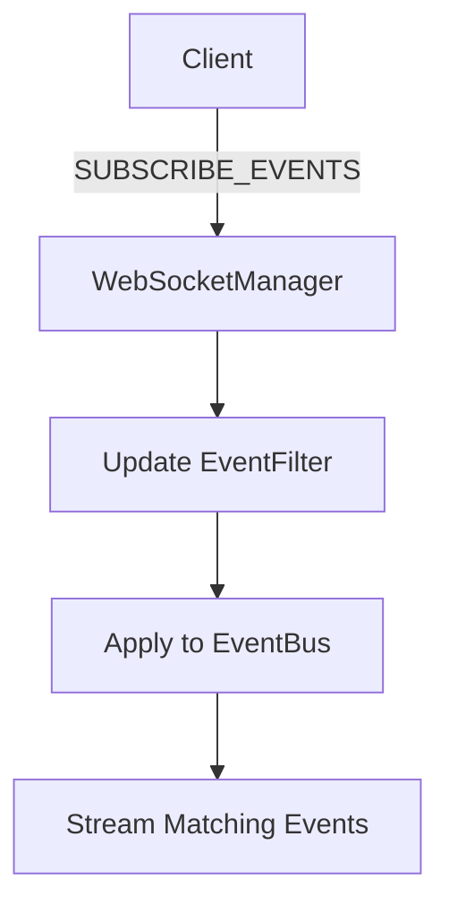
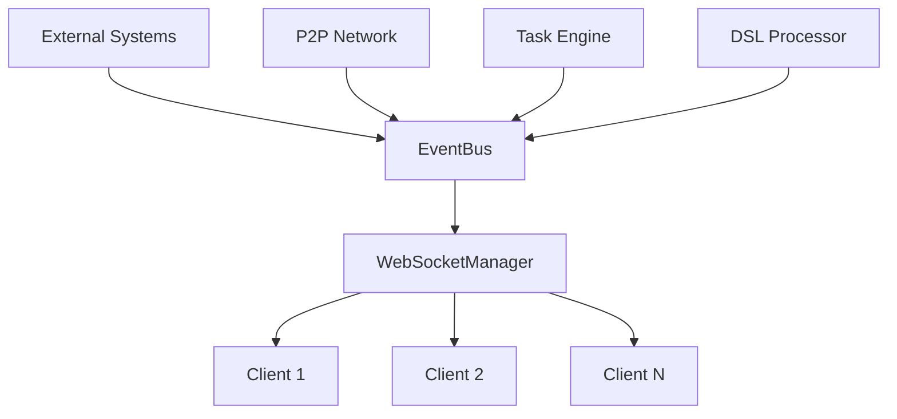
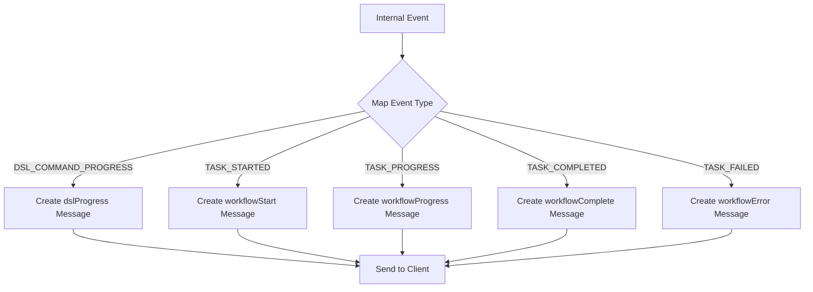
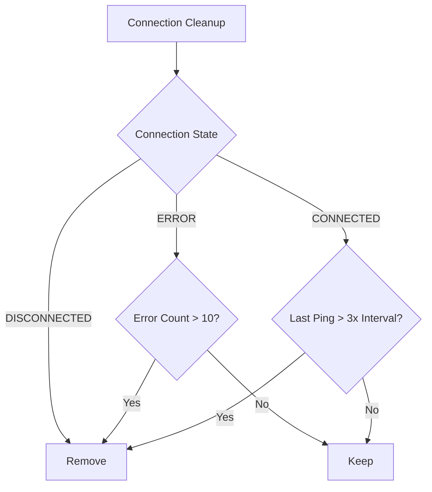

# WebSocket API Reference


## Table of Contents
1. [Introduction](#introduction)
2. [WebSocket Endpoint and Connection Lifecycle](#websocket-endpoint-and-connection-lifecycle)
3. [Authentication and Security](#authentication-and-security)
4. [Message Framing and Schema](#message-framing-and-schema)
5. [Client-to-Server Commands](#client-to-server-commands)
6. [Server-to-Client Events](#server-to-client-events)
7. [Event Bus Integration](#event-bus-integration)
8. [Client Examples](#client-examples)
9. [Error Handling and Recovery](#error-handling-and-recovery)
10. [Performance and Scalability](#performance-and-scalability)

## Introduction

The WebSocket API provides real-time bidirectional communication between clients and the Praxis Agent, enabling live updates for task execution, workflow progress, agent discovery, and tool execution. Built on FastAPI and Trio, the system integrates with an event bus to deliver low-latency streaming of execution logs, status updates, and system events.

This document details the WebSocket endpoint, connection lifecycle, message schema, event types, and integration with the event bus system. It also provides client implementation examples and error recovery strategies.

## WebSocket Endpoint and Connection Lifecycle

The WebSocket service is exposed through two endpoints for compatibility:

- **Primary**: `wss://<host>:<port>/ws/events`
- **Legacy**: `wss://<host>:<port>/ws/workflow`

These endpoints are defined in `server.py` and handled by the `PraxisAPIServer._handle_websocket_connection` method.

### Connection Lifecycle

The connection lifecycle follows a standard WebSocket pattern with enhanced health monitoring:



**Section sources**
- [websocket.py](file://src/praxis_sdk/api/websocket.py#L150-L200)
- [server.py](file://src/praxis_sdk/api/server.py#L400-L450)

### Connection States

The `WebSocketConnection` class tracks connection state using the `ConnectionState` enum:

```python
class ConnectionState(Enum):
    CONNECTING = "connecting"
    CONNECTED = "connected"
    DISCONNECTING = "disconnecting"
    DISCONNECTED = "disconnected"
    ERROR = "error"
```

When a client connects:
1. The server accepts the WebSocket handshake
2. A `WebSocketConnection` object is created
3. Memory channels are established for event streaming
4. The connection is registered with the WebSocket manager
5. A welcome message is sent to the client

The `WebSocketManager.handle_connection()` method manages this process and enforces connection limits via the `max_connections` parameter.

### Heartbeat and Health Monitoring

The system implements two background tasks for connection health:

1. **Heartbeat Monitor**: Checks for missing ping responses
2. **Connection Cleanup**: Removes stale or error-prone connections



**Diagram sources**
- [websocket.py](file://src/praxis_sdk/api/websocket.py#L700-L750)

**Section sources**
- [websocket.py](file://src/praxis_sdk/api/websocket.py#L650-L800)

## Authentication and Security

### Authentication Mechanism

Authentication is implemented through token-based verification in the query parameter:

```
wss://localhost:8000/ws/events?token=your_jwt_token
```

While the current implementation does not explicitly parse the token in the provided files, the framework is designed to support token validation. The `handle_connection` method in `websocket.py` can be extended to validate the token before accepting the connection.

### Security Considerations

The system enforces several security measures:

- **Secure WebSocket (wss)**: Production deployments should use TLS
- **Connection Limits**: Prevents resource exhaustion
- **Message Validation**: All incoming messages are validated
- **Error Isolation**: Connection errors are contained and don't affect other clients

The server is configured with CORS middleware to restrict origins:

```python
app.add_middleware(
    CORSMiddleware,
    allow_origins=self.config.api.cors_origins,
    allow_credentials=True,
    allow_methods=["*"],
    allow_headers=["*"],
)
```

**Section sources**
- [server.py](file://src/praxis_sdk/api/server.py#L150-L180)
- [websocket.py](file://src/praxis_sdk/api/websocket.py#L150-L200)

## Message Framing and Schema

### Message Structure

All WebSocket messages follow a standardized JSON schema defined by the `WebSocketMessage` Pydantic model:

```python
class WebSocketMessage(BaseModel):
    type: str
    payload: Dict[str, Any] = Field(default_factory=dict)
    id: Optional[str] = Field(default_factory=lambda: str(uuid4()))
    timestamp: datetime = Field(default_factory=datetime.utcnow)
    correlation_id: Optional[str] = None
```

Messages are serialized as JSON with the following structure:
```json
{
  "type": "workflowStart",
  "payload": { "workflowId": "123" },
  "id": "msg-456",
  "timestamp": "2023-12-01T10:00:00.000Z",
  "correlation_id": "corr-789"
}
```

### Message Types

The `MessageType` enum defines all supported message types:



**Diagram sources**
- [websocket.py](file://src/praxis_sdk/api/websocket.py#L50-L100)

**Section sources**
- [websocket.py](file://src/praxis_sdk/api/websocket.py#L50-L140)

## Client-to-Server Commands

Clients can send the following command types to the server:

### DSL Command Execution

```json
{
  "type": "DSL_COMMAND",
  "payload": {
    "command": "Analyze the sales report and create a summary"
  }
}
```

This triggers DSL processing through the event bus:


**Section sources**
- [websocket.py](file://src/praxis_sdk/api/websocket.py#L450-L470)

### Workflow Execution

```json
{
  "type": "EXECUTE_WORKFLOW",
  "payload": {
    "workflowId": "wf-123",
    "nodes": [...],
    "edges": [...]
  }
}
```

This initiates a workflow execution:


**Section sources**
- [websocket.py](file://src/praxis_sdk/api/websocket.py#L472-L485)
- [workflow_handlers.py](file://src/praxis_sdk/api/workflow_handlers.py#L200-L250)

### Event Subscription

Clients can subscribe to specific event types:

```json
{
  "type": "SUBSCRIBE_EVENTS",
  "payload": {
    "event_types": ["TASK_STARTED", "TASK_PROGRESS", "TASK_COMPLETED"]
  }
}
```

The server maintains a subscription set for each connection and filters events accordingly.



**Section sources**
- [websocket.py](file://src/praxis_sdk/api/websocket.py#L520-L560)

### Ping/Pong Heartbeat

Clients can send ping messages to test connection health:

```json
{
  "type": "PING",
  "payload": {}
}
```

The server responds with a pong message containing the timestamp:
```json
{
  "type": "PONG",
  "payload": {
    "timestamp": "2023-12-01T10:00:00.000Z"
  },
  "correlation_id": "ping-123"
}
```

**Section sources**
- [websocket.py](file://src/praxis_sdk/api/websocket.py#L580-L600)

## Server-to-Client Events

The server pushes various event types to subscribed clients.

### Workflow Events

| Event Type | Payload Structure | Description |
|-----------|------------------|-------------|
| `workflowStart` | `{workflowId, executionId, nodes, edges}` | Workflow execution started |
| `workflowProgress` | `{workflowId, nodeId, status, progress}` | Node processing update |
| `workflowComplete` | `{workflowId, results, duration}` | Workflow completed successfully |
| `workflowError` | `{workflowId, nodeId, error}` | Workflow or node failed |

```python
def _create_workflow_start_message(self, event: Event, message_type: str) -> WebSocketMessage:
    return WebSocketMessage(
        type=message_type,
        payload={
            "workflowId": data.get("workflow_id", ""),
            "executionId": data.get("execution_id", ""),
            "nodes": data.get("nodes", []),
            "edges": data.get("edges", []),
            "startTime": event.metadata.timestamp.isoformat() + "Z"
        }
    )
```

**Section sources**
- [websocket.py](file://src/praxis_sdk/api/websocket.py#L300-L350)

### Task and Node Updates

The `nodeStatusUpdate` event provides real-time node status changes:

```json
{
  "type": "nodeStatusUpdate",
  "payload": {
    "workflowId": "wf-123",
    "nodeId": "node-456",
    "status": "running",
    "timestamp": "2023-12-01T10:00:00.000Z"
  }
}
```

### Tool Execution Results

When tools complete execution, the server broadcasts results:

```json
{
  "type": "tool_result",
  "payload": {
    "toolName": "file_analyzer",
    "status": "completed",
    "result": { "summary": "File processed successfully" }
  }
}
```

This event is triggered by both local tool execution and P2P tool responses.

### Chat Messages

Interactive chat messages are streamed to clients:

```json
{
  "type": "chatMessage",
  "payload": {
    "content": "Processing your request...",
    "sender": "system",
    "type": "system"
  }
}
```

**Section sources**
- [websocket.py](file://src/praxis_sdk/api/websocket.py#L350-L440)

## Event Bus Integration

The WebSocket service is tightly integrated with the event bus system, enabling real-time updates across components.

### Architecture Overview



**Diagram sources**
- [bus.py](file://src/praxis_sdk/bus.py#L200-L300)
- [websocket.py](file://src/praxis_sdk/api/websocket.py#L100-L150)

**Section sources**
- [bus.py](file://src/praxis_sdk/bus.py#L100-L350)

### Event Flow

When an event occurs in any system component, it follows this path:

1. Component publishes event to `event_bus`
2. `WebSocketManager` receives event via `broadcast_event()`
3. Event is filtered based on client subscriptions
4. Event is transformed to frontend format
5. Event is sent to client via WebSocket

```python
async def broadcast_event(self, event: Event) -> None:
    for connection_id, send_channel in self.connections.items():
        event_filter = self.filters.get(connection_id)
        if event_filter and not event_filter.matches(event):
            continue
        await send_channel.send(event)
```

### Event Transformation

Events are transformed from internal format to frontend-compatible messages:



The `_transform_event_for_frontend()` method handles this mapping, ensuring compatibility with the frontend client.

**Section sources**
- [websocket.py](file://src/praxis_sdk/api/websocket.py#L250-L300)

## Client Examples

### Python Client

```python
import asyncio
import json
import websockets

async def websocket_client():
    uri = "wss://localhost:8000/ws/events"
    
    async with websockets.connect(uri) as websocket:
        # Subscribe to workflow events
        await websocket.send(json.dumps({
            "type": "SUBSCRIBE_EVENTS",
            "payload": {
                "event_types": [
                    "workflowStart", 
                    "workflowProgress", 
                    "workflowComplete", 
                    "workflowError"
                ]
            }
        }))
        
        # Send a DSL command
        await websocket.send(json.dumps({
            "type": "DSL_COMMAND",
            "payload": {
                "command": "Analyze the data and create a report"
            }
        }))
        
        # Receive events
        try:
            while True:
                message = await websocket.recv()
                data = json.loads(message)
                print(f"Received: {data['type']} - {data['payload']}")
        except websockets.exceptions.ConnectionClosed:
            print("Connection closed")

# Run the client
asyncio.run(websocket_client())
```

### JavaScript Client

```javascript
class PraxisWebSocketClient {
    constructor(url) {
        this.url = url;
        this.socket = null;
        this.eventHandlers = new Map();
        this.reconnectAttempts = 0;
        this.maxReconnectAttempts = 5;
    }
    
    async connect() {
        return new Promise((resolve, reject) => {
            this.socket = new WebSocket(this.url);
            
            this.socket.onopen = () => {
                console.log('Connected to Praxis WebSocket');
                this.reconnectAttempts = 0;
                resolve();
            };
            
            this.socket.onmessage = (event) => {
                const data = JSON.parse(event.data);
                this.handleMessage(data);
            };
            
            this.socket.onclose = (event) => {
                console.log('WebSocket closed:', event);
                this.attemptReconnect();
            };
            
            this.socket.onerror = (error) => {
                console.error('WebSocket error:', error);
                reject(error);
            };
        });
    }
    
    async subscribe(events) {
        if (this.socket && this.socket.readyState === WebSocket.OPEN) {
            this.socket.send(JSON.stringify({
                type: 'SUBSCRIBE_EVENTS',
                payload: { event_types: events }
            }));
        }
    }
    
    handleMessage(message) {
        const { type, payload } = message;
        
        // Emit event to registered handlers
        if (this.eventHandlers.has(type)) {
            this.eventHandlers.get(type).forEach(handler => handler(payload));
        }
        
        // Handle specific event types
        switch (type) {
            case 'workflowStart':
                console.log(`Workflow started: ${payload.workflowId}`);
                break;
            case 'workflowProgress':
                console.log(`Workflow ${payload.workflowId} progress: ${payload.progress}%`);
                break;
            case 'workflowComplete':
                console.log(`Workflow completed: ${payload.message}`);
                break;
            case 'workflowError':
                console.error(`Workflow error: ${payload.error}`);
                break;
            case 'chatMessage':
                console.log(`Chat: ${payload.content}`);
                break;
        }
    }
    
    on(eventType, handler) {
        if (!this.eventHandlers.has(eventType)) {
            this.eventHandlers.set(eventType, []);
        }
        this.eventHandlers.get(eventType).push(handler);
    }
    
    attemptReconnect() {
        if (this.reconnectAttempts < this.maxReconnectAttempts) {
            this.reconnectAttempts++;
            const delay = Math.min(1000 * Math.pow(2, this.reconnectAttempts), 10000);
            
            console.log(`Reconnecting in ${delay}ms... (attempt ${this.reconnectAttempts})`);
            setTimeout(() => {
                this.connect().catch(err => {
                    console.error('Reconnection failed:', err);
                });
            }, delay);
        } else {
            console.error('Max reconnection attempts reached');
        }
    }
    
    async disconnect() {
        if (this.socket) {
            this.socket.close();
        }
    }
}

// Usage example
async function runClient() {
    const client = new PraxisWebSocketClient('wss://localhost:8000/ws/events');
    
    // Register event handlers
    client.on('workflowStart', (payload) => {
        console.log('Workflow started:', payload.workflowId);
    });
    
    client.on('workflowProgress', (payload) => {
        console.log(`Progress: ${payload.progress}%`);
    });
    
    // Connect and subscribe
    try {
        await client.connect();
        await client.subscribe([
            'workflowStart',
            'workflowProgress',
            'workflowComplete',
            'workflowError',
            'chatMessage'
        ]);
        
        // Send a command
        client.socket.send(JSON.stringify({
            type: 'DSL_COMMAND',
            payload: {
                command: 'Create a summary of the sales data'
            }
        }));
        
    } catch (error) {
        console.error('Failed to connect:', error);
    }
}

runClient();
```

**Section sources**
- [websocket.py](file://src/praxis_sdk/api/websocket.py#L400-L600)
- [bus.py](file://src/praxis_sdk/bus.py#L200-L300)

## Error Handling and Recovery

### Error Message Schema

The server sends standardized error messages:

```json
{
  "type": "error",
  "payload": {
    "message": "Invalid message format",
    "code": "WEBSOCKET_ERROR",
    "timestamp": "2023-12-01T10:00:00.000Z"
  }
}
```

Errors are sent via the `_send_error()` method in `WebSocketManager`.

### Error Recovery Strategies

The system implements several recovery mechanisms:

#### Automatic Reconnection

Clients should implement exponential backoff reconnection:

```javascript
reconnectDelay = min(1000 * 2^reconnectCount, 10000) // Max 10 seconds
```

#### Message Ordering and Consistency

The system ensures message ordering through:
- Sequential event processing in the event bus
- Ordered memory channels for event streaming
- Timestamp-based ordering in the frontend

#### Connection State Management

The server automatically cleans up stale connections:



**Section sources**
- [websocket.py](file://src/praxis_sdk/api/websocket.py#L600-L800)

## Performance and Scalability

### Connection Limits

The `WebSocketManager` enforces a configurable connection limit:

```python
def __init__(self, max_connections: int = 100, heartbeat_interval: int = 30):
    self.max_connections = max_connections
```

When the limit is reached, new connections receive a 1008 error code.

### Message Throughput

The system is optimized for high message throughput:

- **Memory Channels**: Trio memory channels for efficient event queuing
- **Batch Processing**: Events are processed asynchronously
- **Connection Pooling**: Reusable connection objects

### Statistics and Monitoring

The system provides comprehensive statistics:

```python
def get_stats(self) -> Dict[str, Any]:
    return {
        "total_connections": self.stats["total_connections"],
        "active_connections": self.stats["active_connections"],
        "messages_sent": self.stats["messages_sent"],
        "messages_received": self.stats["messages_received"],
        "broadcast_count": self.stats["broadcast_count"],
        "errors": self.stats["errors"],
        "connection_states": {
            state.value: sum(1 for conn in self.connections.values() if conn.state == state)
            for state in ConnectionState
        }
    }
```

These statistics are available via the `/stats` endpoint in the API server.

**Section sources**
- [websocket.py](file://src/praxis_sdk/api/websocket.py#L800-L850)
- [server.py](file://src/praxis_sdk/api/server.py#L800-L850)

**Referenced Files in This Document**   
- [websocket.py](file://src/praxis_sdk/api/websocket.py)
- [bus.py](file://src/praxis_sdk/bus.py)
- [server.py](file://src/praxis_sdk/api/server.py)
- [handlers.py](file://src/praxis_sdk/api/handlers.py)
- [workflow_handlers.py](file://src/praxis_sdk/api/workflow_handlers.py)