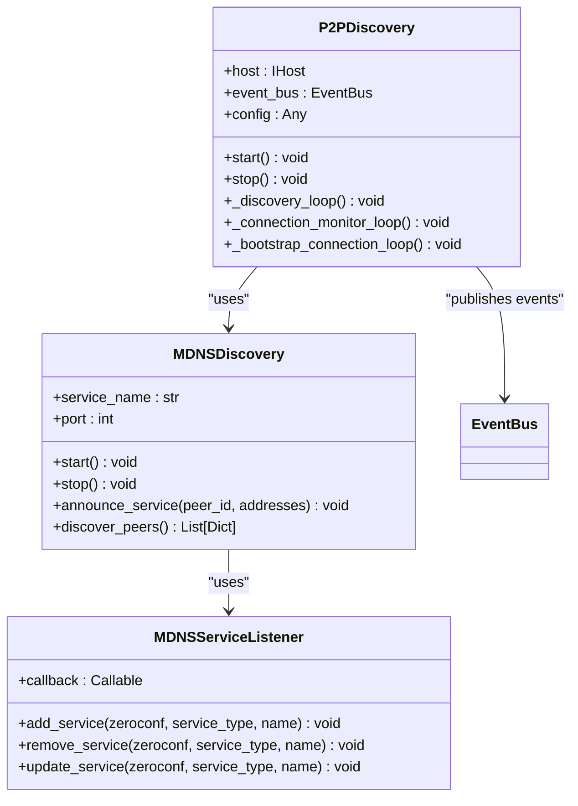
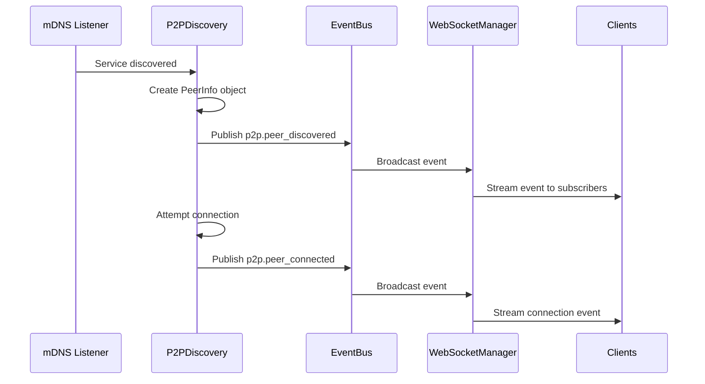
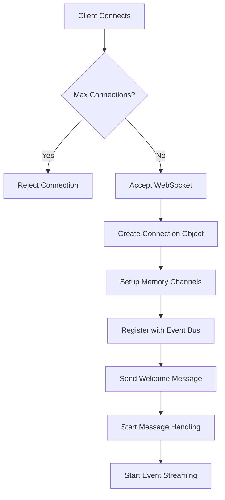
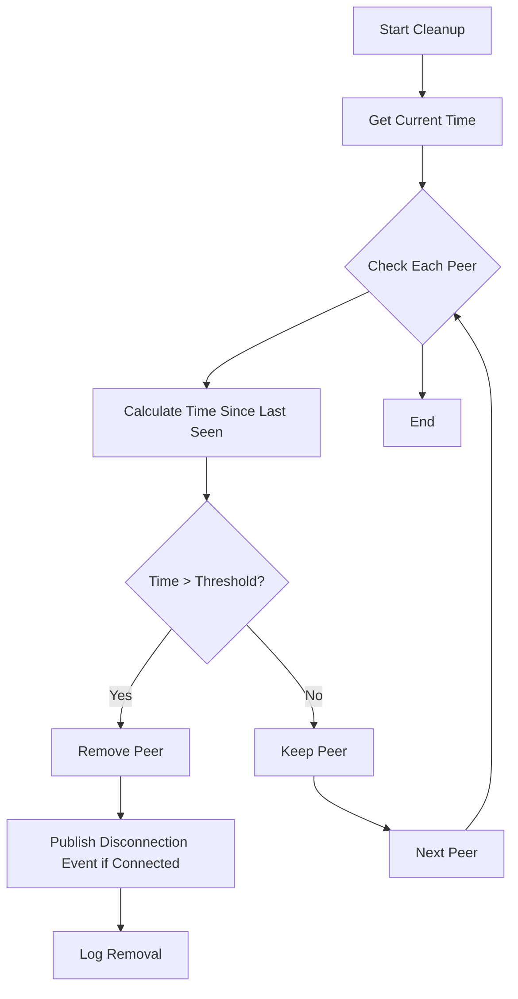

# Agent Events


## Table of Contents
1. [Introduction](#introduction)
2. [Agent Lifecycle and Discovery Events](#agent-lifecycle-and-discovery-events)
3. [Event Types and Payload Schema](#event-types-and-payload-schema)
4. [P2P Discovery and Event Publishing](#p2p-discovery-and-event-publishing)
5. [WebSocket Event Streaming](#websocket-event-streaming)
6. [Use Cases](#use-cases)
7. [Client Subscription and Real-Time Registry](#client-subscription-and-real-time-registry)
8. [Handling Network Partitions and Stale States](#handling-network-partitions-and-stale-states)
9. [Security and Access Control](#security-and-access-control)

## Introduction
This document provides comprehensive documentation for agent lifecycle and discovery events over WebSocket in the Praxis Python SDK. It details the event types, payload schemas, P2P discovery mechanisms, and WebSocket integration that enable real-time monitoring and interaction with distributed agents. The system leverages a trio-based event bus to coordinate communication between components and broadcast events to connected clients.

## Agent Lifecycle and Discovery Events
The Praxis SDK implements a robust event-driven architecture for tracking agent lifecycle and peer discovery events. These events are published through a centralized event bus and streamed to WebSocket clients for real-time monitoring and interaction. The system supports four primary agent event types: 'agent.discovered', 'agent.connected', 'agent.disconnected', and 'agent.updated', each representing a distinct state in the agent lifecycle.

The P2P discovery service automatically detects new agents in the network using mDNS (Multicast DNS) service discovery. When a new agent is discovered, the system publishes a discovery event that contains essential information about the peer, including its peer ID, network addresses, and capabilities. This enables dynamic agent network formation without requiring static configuration.

**Section sources**
- [discovery.py](file://src/praxis_sdk/p2p/discovery.py#L1-L603)
- [bus.py](file://src/praxis_sdk/bus.py#L1-L368)

## Event Types and Payload Schema
The agent event system defines specific event types with standardized payload schemas to ensure consistent data exchange across the system.

### Agent Event Types
The following event types are defined in the system:

- **agent.discovered**: Published when a new agent is discovered in the network
- **agent.connected**: Published when a successful connection is established with an agent
- **agent.disconnected**: Published when a connection to an agent is lost
- **agent.updated**: Published when an agent's metadata or capabilities change

These event types are implemented as enum values in the `EventType` class within the event bus system.

### Payload Schema
Each agent event contains a standardized payload with the following structure:

```json
{
  "peer_id": "string",
  "capabilities": ["string"],
  "address": ["string"],
  "metadata": {
    "agent_card": "object",
    "discovered_at": "timestamp",
    "last_seen": "timestamp",
    "is_connected": "boolean"
  }
}
```

The payload includes:
- **peer_id**: Unique identifier for the agent (Base58-encoded)
- **capabilities**: List of capabilities the agent provides
- **address**: Network addresses where the agent can be reached
- **metadata**: Additional information about the agent, including its agent card, discovery timestamp, connection status, and other properties

**Section sources**
- [bus.py](file://src/praxis_sdk/bus.py#L1-L368)
- [discovery.py](file://src/praxis_sdk/p2p/discovery.py#L1-L603)

## P2P Discovery and Event Publishing
The P2P discovery system is responsible for detecting new agents and publishing discovery events through the event bus to all connected WebSocket clients.

### mDNS-Based Discovery
The system implements mDNS-based peer discovery using the zeroconf library. The `MDNSDiscovery` class handles service registration and discovery to automatically find other Praxis agents in the local network.



**Diagram sources**
- [discovery.py](file://src/praxis_sdk/p2p/discovery.py#L1-L603)

### Discovery Workflow
The discovery process follows these steps:

1. **Service Announcement**: Each agent announces its presence on the network by registering an mDNS service with its peer ID, addresses, and other metadata
2. **Peer Detection**: The discovery service listens for mDNS announcements and detects new peers
3. **Event Publication**: When a new peer is discovered, the system publishes a `p2p.peer_discovered` event through the event bus
4. **Connection Attempt**: The system automatically attempts to establish a connection with the discovered peer
5. **Connection Events**: Upon successful connection, a `p2p.peer_connected` event is published; if the connection fails or is lost, a `p2p.peer_disconnected` event is published

### Event Bus Integration
The `P2PDiscovery` class integrates with the event bus to publish peer lifecycle events. When a peer is discovered, connected, or disconnected, the system calls `event_bus.publish()` with the appropriate event type and payload.



**Diagram sources**
- [discovery.py](file://src/praxis_sdk/p2p/discovery.py#L1-L603)
- [bus.py](file://src/praxis_sdk/bus.py#L1-L368)

## WebSocket Event Streaming
The WebSocket manager handles real-time event streaming to connected clients, enabling dynamic agent network monitoring and interaction.

### Connection Management
The `WebSocketManager` class manages WebSocket connections and event streaming. When a client connects, the system:

1. Accepts the WebSocket connection
2. Creates a `WebSocketConnection` object to track connection state
3. Sets up memory channels for event streaming
4. Registers the connection with the event bus
5. Sends a welcome message to the client



**Diagram sources**
- [websocket.py](file://src/praxis_sdk/api/websocket.py#L1-L807)

### Event Subscription
Clients can subscribe to specific event types using the `SUBSCRIBE_EVENTS` message type. The WebSocket manager updates the connection's event filter and registers it with the event bus's WebSocket manager.

```python
# Example subscription message
{
    "type": "SUBSCRIBE_EVENTS",
    "payload": {
        "event_types": [
            "p2p.peer_discovered",
            "p2p.peer_connected", 
            "p2p.peer_disconnected"
        ]
    }
}
```

The event bus uses the `EventFilter` class to determine which events to broadcast to each connection based on the subscribed event types.

**Section sources**
- [websocket.py](file://src/praxis_sdk/api/websocket.py#L1-L807)

## Use Cases
The agent event system enables several important use cases for distributed agent networks.

### Dynamic Agent Network Monitoring
The real-time event stream allows clients to monitor the dynamic state of the agent network. By subscribing to agent lifecycle events, clients can maintain an up-to-date view of all available agents and their connection status.

### Capability-Based Routing
With access to agent capabilities in the event payload, clients can implement intelligent routing strategies. For example, a client could route a file processing task to an agent with filesystem capabilities, or a mathematical computation to an agent with calculator tools.

### Presence Tracking
The system provides reliable presence tracking through the combination of discovery, connection, and disconnection events. Clients can use this information to maintain a presence-aware agent registry and respond appropriately to network changes.

## Client Subscription and Real-Time Registry
Clients can subscribe to agent events and maintain a real-time agent registry using the WebSocket API.

### Subscription Example
```python
import asyncio
import json
import websockets

async def monitor_agents():
    async with websockets.connect("ws://localhost:9000/ws") as websocket:
        # Subscribe to agent events
        subscription_msg = {
            "type": "SUBSCRIBE_EVENTS",
            "payload": {
                "event_types": [
                    "p2p.peer_discovered",
                    "p2p.peer_connected",
                    "p2p.peer_disconnected"
                ]
            }
        }
        await websocket.send(json.dumps(subscription_msg))
        
        # Maintain real-time registry
        agent_registry = {}
        
        try:
            async for message in websocket:
                event = json.loads(message)
                event_type = event.get("type")
                payload = event.get("payload", {})
                
                if event_type == "p2p.peer_discovered":
                    peer_id = payload["id"]
                    agent_registry[peer_id] = {
                        "status": "discovered",
                        "addresses": payload["addresses"],
                        "capabilities": payload.get("capabilities", []),
                        "discovered_at": payload["discovered_at"]
                    }
                    print(f"Discovered agent: {peer_id}")
                    
                elif event_type == "p2p.peer_connected":
                    peer_id = payload["id"]
                    if peer_id in agent_registry:
                        agent_registry[peer_id]["status"] = "connected"
                        agent_registry[peer_id]["connected_at"] = payload["connected_at"]
                    print(f"Connected to agent: {peer_id}")
                    
                elif event_type == "p2p.peer_disconnected":
                    peer_id = payload["id"]
                    if peer_id in agent_registry:
                        agent_registry[peer_id]["status"] = "disconnected"
                        agent_registry[peer_id]["disconnected_at"] = payload["disconnected_at"]
                    print(f"Disconnected from agent: {peer_id}")
                    
        except websockets.exceptions.ConnectionClosed:
            print("WebSocket connection closed")

# Run the monitoring client
asyncio.run(monitor_agents())
```

### Registry Management
The real-time registry should handle:
- Adding newly discovered agents
- Updating connection status
- Removing disconnected agents
- Tracking agent capabilities
- Monitoring last seen timestamps

**Section sources**
- [websocket.py](file://src/praxis_sdk/api/websocket.py#L1-L807)

## Handling Network Partitions and Stale States
The system includes mechanisms to handle network partitions, duplicate events, and stale agent states.

### Network Partition Handling
When network partitions occur, the system may detect temporary disconnections. The `P2PDiscovery` class includes connection monitoring and reconnection logic to handle transient network issues.

### Duplicate Event Prevention
The event system uses unique event IDs and correlation IDs to help clients identify and filter duplicate events. Clients should implement deduplication logic based on these identifiers.

### Stale State Management
The discovery system automatically cleans up stale peers that haven't been seen within a threshold period (5 minutes by default). The `_cleanup_stale_peers` method removes peers that haven't been seen recently and publishes disconnection events if necessary.



**Diagram sources**
- [discovery.py](file://src/praxis_sdk/p2p/discovery.py#L1-L603)

## Security and Access Control
Exposing agent metadata through events has security implications that should be addressed.

### Security Implications
Publishing agent metadata can expose sensitive information about the network topology and available services. This information could be used by malicious actors to target specific agents or understand the system architecture.

### Filtering Strategies
The system should implement filtering strategies based on access control policies:

1. **Role-Based Filtering**: Restrict event access based on client roles or permissions
2. **Attribute-Based Filtering**: Filter events based on agent attributes or sensitivity levels
3. **Scope-Based Filtering**: Limit event visibility to specific network segments or domains

The current event bus supports event filtering through the `EventFilter` class, which can be extended to incorporate access control policies.

```python
# Example of enhanced filtering with access control
class AccessControlledEventFilter(EventFilter):
    def __init__(self, user_role: str, *args, **kwargs):
        super().__init__(*args, **kwargs)
        self.user_role = user_role
    
    def matches(self, event: Event) -> bool:
        # Apply standard filtering
        if not super().matches(event):
            return False
            
        # Apply access control based on role
        required_role = event.metadata.tags.get("required_role", "guest")
        role_hierarchy = {"admin": 3, "user": 2, "guest": 1}
        
        return role_hierarchy.get(self.user_role, 0) >= role_hierarchy.get(required_role, 0)
```

**Section sources**
- [bus.py](file://src/praxis_sdk/bus.py#L1-L368)
- [discovery.py](file://src/praxis_sdk/p2p/discovery.py#L1-L603)

**Referenced Files in This Document**   
- [discovery.py](file://src/praxis_sdk/p2p/discovery.py#L1-L603)
- [websocket.py](file://src/praxis_sdk/api/websocket.py#L1-L807)
- [bus.py](file://src/praxis_sdk/bus.py#L1-L368)