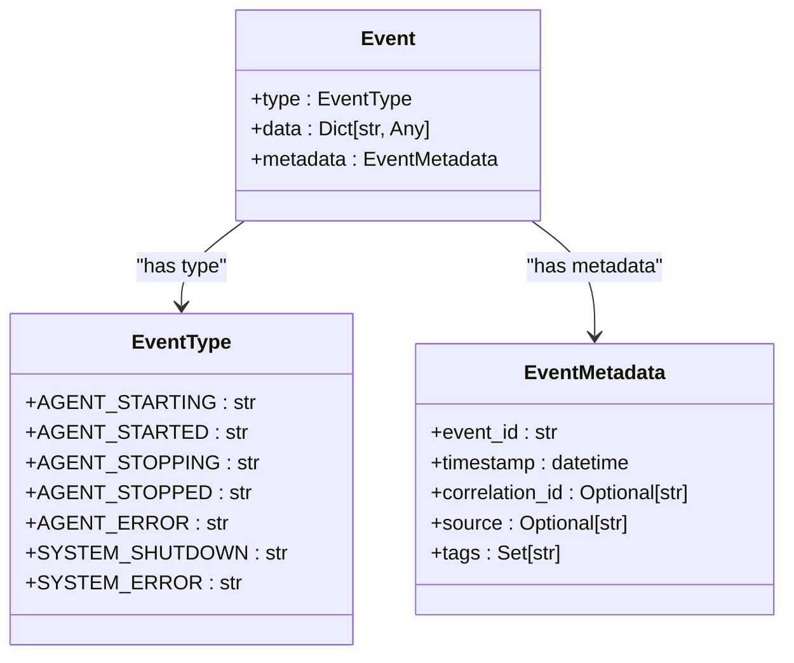
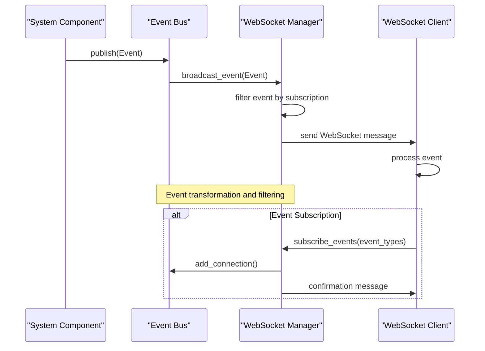
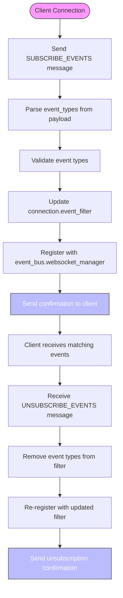
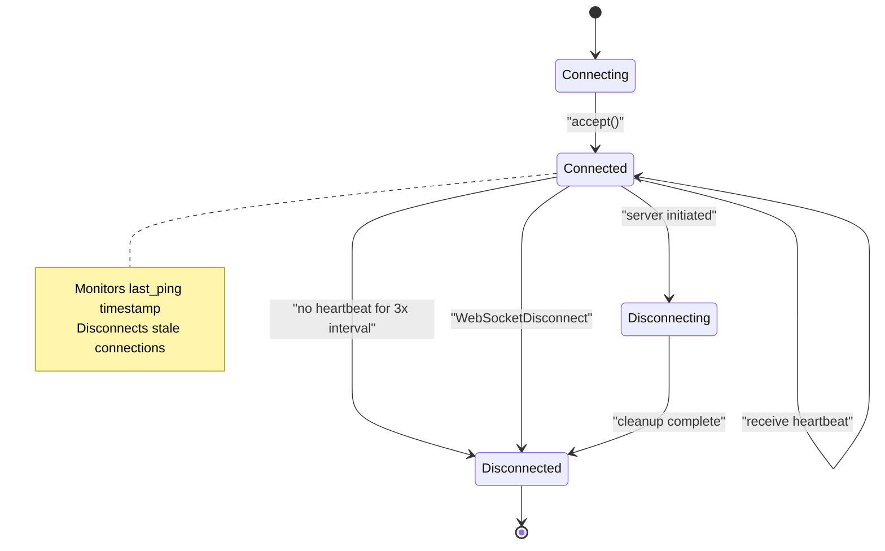
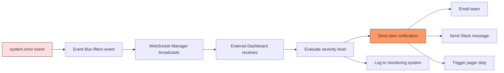
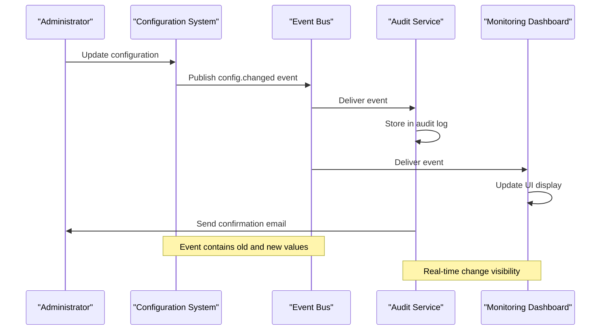
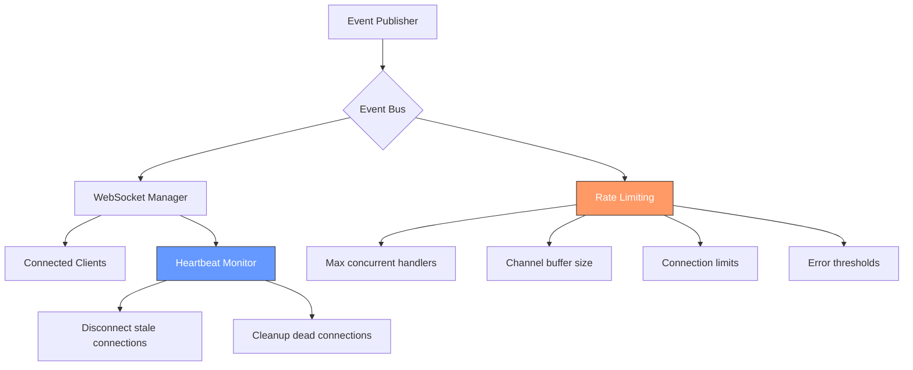

# System Events


## Table of Contents
1. [Introduction](#introduction)
2. [System Event Types](#system-event-types)
3. [Event Schema Definition](#event-schema-definition)
4. [Event Bus and WebSocket Integration](#event-bus-and-websocket-integration)
5. [Monitoring and Observability](#monitoring-and-observability)
6. [Alerting and Configuration Tracking](#alerting-and-configuration-tracking)
7. [Reliability Considerations](#reliability-considerations)

## Introduction
The PraxisAgent system utilizes a robust event-driven architecture to provide real-time observability into system health, configuration changes, and service status. This document details the implementation and usage of system-level WebSocket events such as 'system.health', 'system.error', 'config.changed', and 'service.status'. The event bus architecture enables decoupled communication between system components and allows external dashboards to consume critical events for monitoring and alerting purposes.

**Section sources**
- [bus.py](file://src/praxis_sdk/bus.py#L16-L68)

## System Event Types
The PraxisAgent system defines several critical system event types through the `EventType` enum in the event bus implementation. These include:

- **SYSTEM_SHUTDOWN**: Indicates the system is shutting down gracefully
- **SYSTEM_ERROR**: Signals a critical system error condition
- **AGENT_STARTING/AGENT_STARTED**: Lifecycle events for agent initialization
- **AGENT_STOPPING/AGENT_STOPPED**: Lifecycle events for agent shutdown
- **AGENT_ERROR**: Errors occurring within the agent process

These system events are published to the event bus and can be subscribed to via WebSocket connections by monitoring clients and dashboards.



**Diagram sources**
- [bus.py](file://src/praxis_sdk/bus.py#L16-L68)

**Section sources**
- [bus.py](file://src/praxis_sdk/bus.py#L16-L68)

## Event Schema Definition
All system events follow a consistent JSON schema structure with standardized fields for interoperability and ease of consumption.

### System Error Event Schema
```json
{
  "type": "system.error",
  "data": {
    "severity": "critical|error|warning|info",
    "message": "string",
    "error_code": "string",
    "component": "string",
    "diagnostic_data": "object",
    "stack_trace": "string"
  },
  "metadata": {
    "event_id": "string",
    "timestamp": "ISO 8601 datetime",
    "correlation_id": "string",
    "source": "string",
    "tags": ["string"]
  }
}
```

### Configuration Changed Event Schema
```json
{
  "type": "config.changed",
  "data": {
    "config_path": "string",
    "old_value": "any",
    "new_value": "any",
    "changed_by": "string",
    "change_reason": "string"
  },
  "metadata": {
    "event_id": "string",
    "timestamp": "ISO 8601 datetime",
    "correlation_id": "string",
    "source": "string",
    "tags": ["string"]
  }
}
```

### Service Status Event Schema
```json
{
  "type": "service.status",
  "data": {
    "service_name": "string",
    "status": "healthy|degraded|unhealthy",
    "health_check_results": "object",
    "metrics": "object"
  },
  "metadata": {
    "event_id": "string",
    "timestamp": "ISO 8601 datetime",
    "correlation_id": "string",
    "source": "string",
    "tags": ["string"]
  }
}
```

**Section sources**
- [bus.py](file://src/praxis_sdk/bus.py#L16-L68)

## Event Bus and WebSocket Integration
The PraxisAgent core monitors system health and broadcasts critical events through the event bus to all WebSocket subscribers. The integration between the event bus and WebSocket manager enables real-time event streaming to connected clients.

### Event Flow Architecture


**Diagram sources**
- [bus.py](file://src/praxis_sdk/bus.py#L16-L68)
- [websocket.py](file://src/praxis_sdk/api/websocket.py#L580-L646)

**Section sources**
- [bus.py](file://src/praxis_sdk/bus.py#L16-L68)
- [websocket.py](file://src/praxis_sdk/api/websocket.py#L580-L646)

### Event Subscription Management
Clients can dynamically subscribe to and unsubscribe from specific event types using WebSocket messages:



**Diagram sources**
- [websocket.py](file://src/praxis_sdk/api/websocket.py#L580-L646)
- [websocket.py](file://src/praxis_sdk/api/websocket.py#L643-L677)

**Section sources**
- [websocket.py](file://src/praxis_sdk/api/websocket.py#L580-L677)

## Monitoring and Observability
External dashboards can use system events for real-time observability into the PraxisAgent system. The WebSocket interface provides a streaming API for consuming events as they occur.

### Connection Health Monitoring
The WebSocket manager implements heartbeat monitoring to ensure connection reliability:



**Diagram sources**
- [websocket.py](file://src/praxis_sdk/api/websocket.py#L707-L738)

**Section sources**
- [websocket.py](file://src/praxis_sdk/api/websocket.py#L707-L738)

### WebSocket Statistics
The system provides comprehensive statistics for monitoring WebSocket connections:

```python
{
    "total_connections": int,
    "active_connections": int,
    "messages_sent": int,
    "messages_received": int,
    "broadcast_count": int,
    "errors": int,
    "connection_states": {
        "connecting": int,
        "connected": int,
        "disconnecting": int,
        "disconnected": int,
        "error": int
    },
    "total_errors": int,
    "average_messages_per_connection": float
}
```

These statistics are accessible via the `get_stats()` method and can be used for monitoring system health and performance.

**Section sources**
- [websocket.py](file://src/praxis_sdk/api/websocket.py#L764-L806)

## Alerting and Configuration Tracking
The event system enables powerful alerting workflows and configuration change tracking capabilities.

### Alerting Workflow for System Errors
When a `system.error` event occurs, the following alerting workflow is triggered:



**Section sources**
- [bus.py](file://src/praxis_sdk/bus.py#L68)
- [test_websocket_connectivity.py](file://tests/integration/test_websocket_connectivity.py#L279-L323)

### Configuration Change Tracking
The `config.changed` event enables auditing and tracking of configuration modifications:



**Section sources**
- [bus.py](file://src/praxis_sdk/bus.py#L16-L68)

## Reliability Considerations
The system addresses several reliability concerns to ensure robust event delivery.

### Event Durability During Outages
While the current implementation uses in-memory event broadcasting, the architecture supports durability enhancements:

- **Message Queues**: Integration with persistent message queues (e.g., RabbitMQ, Kafka) could provide durability during outages
- **Event Storage**: Critical events could be stored in a database for replay after system recovery
- **Client Reconnection**: WebSocket clients should implement reconnection logic with event replay capabilities

### Message Ordering
The event bus ensures message ordering within individual event handlers:

- Events are processed sequentially from the receive channel
- Each event is handled completely before processing the next
- However, different event types may be processed concurrently

### Rate Limiting
The system implements several rate limiting and protection mechanisms:

- **Connection Limits**: Maximum concurrent WebSocket connections can be configured
- **Error Thresholds**: Connections with excessive errors are automatically disconnected
- **Heartbeat Monitoring**: Stale connections are cleaned up periodically
- **Buffer Limits**: Event channels have bounded capacity to prevent memory exhaustion



**Diagram sources**
- [websocket.py](file://src/praxis_sdk/api/websocket.py#L707-L738)
- [websocket.py](file://src/praxis_sdk/api/websocket.py#L764-L806)

**Section sources**
- [websocket.py](file://src/praxis_sdk/api/websocket.py#L707-L806)
- [test_websocket_connectivity.py](file://tests/integration/test_websocket_connectivity.py#L360-L410)

**Referenced Files in This Document**   
- [bus.py](file://src/praxis_sdk/bus.py#L16-L68)
- [websocket.py](file://src/praxis_sdk/api/websocket.py#L580-L646)
- [websocket.py](file://src/praxis_sdk/api/websocket.py#L707-L738)
- [websocket.py](file://src/praxis_sdk/api/websocket.py#L764-L806)
- [test_websocket_connectivity.py](file://tests/integration/test_websocket_connectivity.py#L279-L323)
- [test_websocket_connectivity.py](file://tests/integration/test_websocket_connectivity.py#L360-L410)