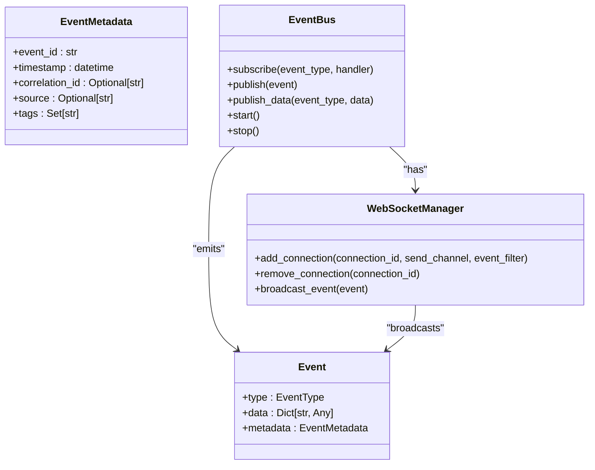
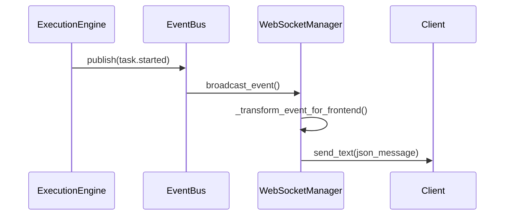
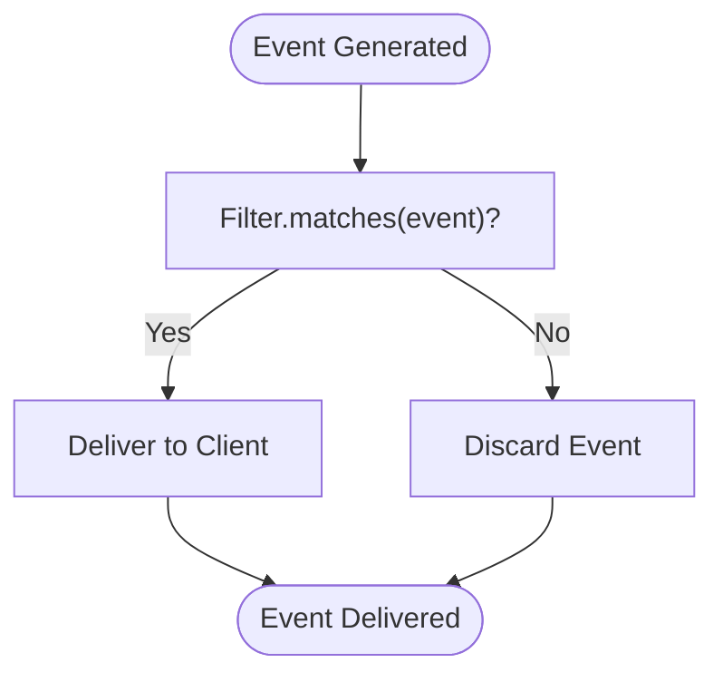
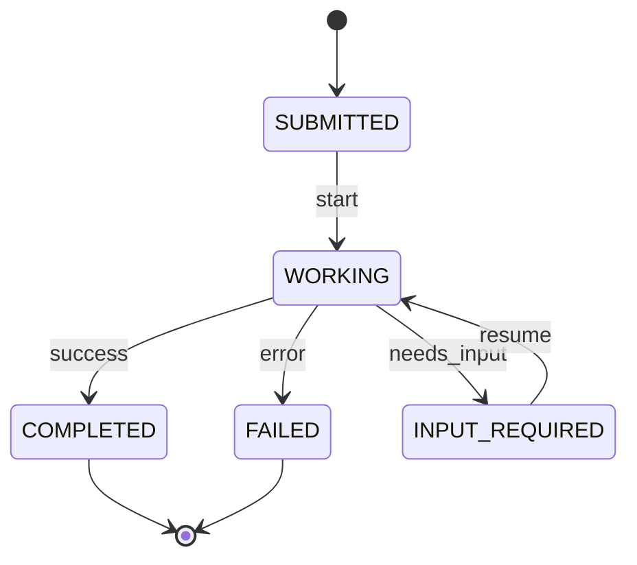
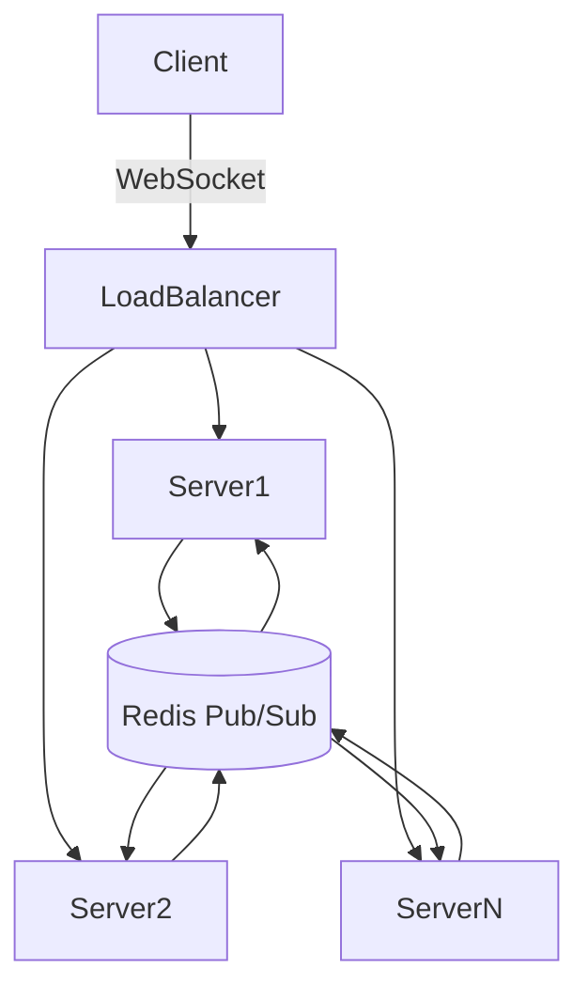

# Task Events


## Table of Contents
1. [Introduction](#introduction)
2. [Event Types and Payload Structure](#event-types-and-payload-structure)
3. [Event Bus and WebSocket Integration](#event-bus-and-websocket-integration)
4. [Client Subscription and Filtering](#client-subscription-and-filtering)
5. [Task State Management](#task-state-management)
6. [Real-World Examples](#real-world-examples)
7. [Error Handling](#error-handling)
8. [Performance Considerations](#performance-considerations)
9. [Conclusion](#conclusion)

## Introduction
This document provides comprehensive documentation for the WebSocket API used to handle task-related events in the Praxis Python SDK. The system enables real-time communication between the execution engine and clients through a robust event bus architecture. Task events such as 'task.started', 'task.progress', 'task.completed', and 'task.failed' are emitted by the execution engine and broadcast to subscribed clients via WebSocket connections. This documentation details the event payload structure, subscription mechanisms, client implementation examples, error handling, and performance optimization strategies.

## Event Types and Payload Structure

The system defines several task-related event types that represent different stages of task execution. These events follow a standardized JSON payload structure containing essential metadata and contextual information.

### Task Event Types
The following event types are defined in the `EventType` enum within `bus.py`:

- **TASK_STARTED**: Emitted when a task begins execution
- **TASK_PROGRESS**: Emitted periodically during task execution to report progress
- **TASK_COMPLETED**: Emitted when a task finishes successfully
- **TASK_FAILED**: Emitted when a task encounters an error and cannot complete
- **TASK_CREATED**: Emitted when a new task is initialized
- **TASK_CANCELLED**: Emitted when a task is explicitly cancelled

### JSON Payload Structure
Each event contains a consistent structure with the following key fields:

**Event Structure**
- `type`: String identifier of the event type (e.g., "task.started")
- `payload`: Object containing event-specific data
- `timestamp`: ISO 8601 formatted timestamp of event creation
- `correlation_id`: Unique identifier linking related events and requests
- `task_id`: Identifier of the associated task

**Common Fields in Payload**
- `task_id`: Unique identifier for the task
- `status`: Current state of the task (submitted, working, completed, failed)
- `timestamp`: Time when the event was generated
- `metadata`: Additional contextual information about the task
- `progress`: Numeric value (0-100) indicating completion percentage (for progress events)
- `message`: Human-readable description of the current state
- `results`: Output data or artifacts produced by the task (on completion)
- `error`: Error details including code and message (on failure)

For example, a `task.progress` event payload might look like:
```json
{
  "type": "task.progress",
  "payload": {
    "task_id": "task-123",
    "status": "working",
    "progress": 75,
    "message": "Processing data batch 3 of 4",
    "timestamp": "2023-12-07T15:30:45.123Z"
  },
  "timestamp": "2023-12-07T15:30:45.123Z",
  "correlation_id": "corr-456"
}
```

**Section sources**
- [bus.py](file://src/praxis_sdk/bus.py#L50-L80)
- [models.py](file://src/praxis_sdk/a2a/models.py#L10-L40)

## Event Bus and WebSocket Integration

The event distribution system is built on a two-layer architecture consisting of an event bus for internal communication and WebSocket connections for external client notifications.

### Event Bus Architecture
The `EventBus` class in `bus.py` serves as the central hub for all system events. It uses Trio-based asynchronous programming to handle event publication and subscription with high performance and reliability.



**Diagram sources**
- [bus.py](file://src/praxis_sdk/bus.py#L100-L300)

### WebSocket Event Broadcasting
When the execution engine changes a task's state, it publishes an event to the global `event_bus` instance. The event bus then forwards the event to the `WebSocketManager`, which broadcasts it to all connected clients that have subscribed to receive such events.

The `WebSocketManager` in `websocket.py` handles the lifecycle of WebSocket connections and ensures reliable message delivery. It transforms internal event objects into frontend-compatible messages using the `_transform_event_for_frontend` method, which maps backend event types to appropriate frontend message types.



**Diagram sources**
- [websocket.py](file://src/praxis_sdk/api/websocket.py#L250-L300)
- [bus.py](file://src/praxis_sdk/bus.py#L250-L300)

**Section sources**
- [bus.py](file://src/praxis_sdk/bus.py#L100-L368)
- [websocket.py](file://src/praxis_sdk/api/websocket.py#L100-L400)

## Client Subscription and Filtering

Clients can establish WebSocket connections to receive real-time task event updates. The system supports flexible subscription and filtering mechanisms to optimize bandwidth usage and client processing.

### Connection Establishment
Clients connect to the WebSocket endpoint and are assigned a unique connection ID. Upon connection, a default event filter is applied that subscribes to common task-related events:

- TASK_STARTED
- TASK_PROGRESS
- TASK_COMPLETED
- TASK_FAILED
- WORKFLOW_STARTED
- WORKFLOW_PROGRESS
- WORKFLOW_COMPLETED

### Event Filtering
The `EventFilter` class allows clients to specify which event types they want to receive. This filtering occurs server-side, reducing network traffic and client-side processing overhead.

```python
# Example of event filter configuration
event_filter = EventFilter(
    event_types={
        EventType.TASK_COMPLETED,
        EventType.TASK_FAILED
    }
)
websocket_manager.add_connection(connection_id, send_channel, event_filter)
```

Clients can dynamically modify their subscriptions using special WebSocket messages:

- `SUBSCRIBE_EVENTS`: Add new event types to the subscription
- `UNSUBSCRIBE_EVENTS`: Remove event types from the subscription

The filtering logic is implemented in the `matches` method of the `EventFilter` class, which evaluates whether an event should be delivered to a particular client based on its configured criteria.



**Diagram sources**
- [bus.py](file://src/praxis_sdk/bus.py#L85-L100)
- [websocket.py](file://src/praxis_sdk/api/websocket.py#L500-L600)

**Section sources**
- [bus.py](file://src/praxis_sdk/bus.py#L80-L100)
- [websocket.py](file://src/praxis_sdk/api/websocket.py#L500-L700)

## Task State Management

The system maintains task state through the `Task` and `TaskStatus` models defined in `models.py`. These models provide a structured representation of task execution states and transitions.

### Task State Model
The `TaskState` enum defines the possible states a task can be in:

- **SUBMITTED**: Task has been created but not yet started
- **WORKING**: Task is currently being executed
- **COMPLETED**: Task finished successfully
- **FAILED**: Task encountered an error
- **INPUT_REQUIRED**: Task is paused waiting for user input



**Diagram sources**
- [models.py](file://src/praxis_sdk/a2a/models.py#L10-L25)

### State Transition Handling
The API gateway listens for task status update events and updates the corresponding task objects accordingly. This is implemented in the `_setup_event_handlers` method of the gateway class:

```python
async def handle_task_status_update(event: Event):
    if event.type in [EventType.TASK_STARTED, EventType.TASK_COMPLETED, EventType.TASK_FAILED]:
        task_id = event.data.get("task_id")
        if task_id and task_id in self.tasks:
            task = self.tasks[task_id]
            if event.type == EventType.TASK_STARTED:
                task.status.state = TaskState.WORKING
            elif event.type == EventType.TASK_COMPLETED:
                task.status.state = TaskState.COMPLETED
            elif event.type == EventType.TASK_FAILED:
                task.status.state = TaskState.FAILED
            
            # Update timestamp
            task.status.timestamp = datetime.utcnow().isoformat() + "Z"
```

The event bus automatically subscribes to these event types to ensure state synchronization across the system.

**Section sources**
- [gateway.py](file://src/praxis_sdk/api/gateway.py#L245-L272)
- [models.py](file://src/praxis_sdk/a2a/models.py#L30-L50)

## Real-World Examples

### Python Client with AsyncIO
```python
import asyncio
import json
import websockets

async def listen_to_task_events(task_id: str):
    """Listen for task events for a specific task."""
    
    async with websockets.connect("ws://localhost:8000/ws") as websocket:
        # Subscribe to task events
        subscribe_msg = {
            "type": "SUBSCRIBE_EVENTS",
            "payload": {
                "event_types": [
                    "task.started",
                    "task.progress",
                    "task.completed",
                    "task.failed"
                ]
            }
        }
        await websocket.send(json.dumps(subscribe_msg))
        
        try:
            while True:
                message = await websocket.recv()
                event = json.loads(message)
                
                if event.get("payload", {}).get("task_id") == task_id:
                    print(f"Task {task_id} - {event['type']}: {event['payload']}")
                    
                    # Handle specific event types
                    if event["type"] == "task.completed":
                        print("Task completed successfully!")
                        break
                    elif event["type"] == "task.failed":
                        print(f"Task failed: {event['payload'].get('error')}")
                        break
                        
        except websockets.exceptions.ConnectionClosed:
            print("Connection closed")

# Run the listener
asyncio.run(listen_to_task_events("task-123"))
```

### JavaScript Client with WebSocket API
```javascript
class TaskEventClient {
    constructor(taskId) {
        this.taskId = taskId;
        this.websocket = null;
        this.eventHandlers = new Map();
        this.connect();
    }
    
    connect() {
        this.websocket = new WebSocket('ws://localhost:8000/ws');
        
        this.websocket.onopen = () => {
            console.log('Connected to task event stream');
            
            // Subscribe to task events
            this.websocket.send(JSON.stringify({
                type: 'SUBSCRIBE_EVENTS',
                payload: {
                    event_types: [
                        'task.started',
                        'task.progress',
                        'task.completed',
                        'task.failed'
                    ]
                }
            }));
        };
        
        this.websocket.onmessage = (event) => {
            const message = JSON.parse(event.data);
            const taskId = message.payload?.task_id;
            
            // Only process events for our target task
            if (taskId === this.taskId) {
                this.handleEvent(message);
            }
        };
        
        this.websocket.onclose = () => {
            console.log('Connection closed, reconnecting...');
            setTimeout(() => this.connect(), 5000);
        };
    }
    
    handleEvent(event) {
        const handler = this.eventHandlers.get(event.type);
        if (handler) {
            handler(event.payload);
        }
        
        // Update UI based on event type
        switch (event.type) {
            case 'task.started':
                updateUIStatus('Running...');
                break;
            case 'task.progress':
                updateProgress(event.payload.progress);
                updateStatusMessage(event.payload.message);
                break;
            case 'task.completed':
                updateUIStatus('Completed');
                showResults(event.payload.results);
                break;
            case 'task.failed':
                updateUIStatus('Failed');
                showError(event.payload.error);
                break;
        }
    }
    
    on(eventType, handler) {
        this.eventHandlers.set(eventType, handler);
    }
}

// Usage
const client = new TaskEventClient('task-123');
client.on('task.progress', (payload) => {
    console.log(`Progress: ${payload.progress}%`);
});
```

**Section sources**
- [websocket.py](file://src/praxis_sdk/api/websocket.py#L300-L500)
- [server.py](file://src/praxis_sdk/api/server.py#L500-L534)

## Error Handling

The system implements comprehensive error handling for various failure scenarios that may occur during event transmission and processing.

### Malformed Payload Handling
When receiving messages from clients, the WebSocket manager validates JSON structure and handles parsing errors gracefully:

```python
try:
    message_data = json.loads(data)
    message = WebSocketMessage(**message_data)
    await self._route_message(connection_id, message)
except (json.JSONDecodeError, ValueError) as e:
    logger.error(f"Invalid message from {connection_id}: {e}")
    await self._send_error(connection_id, f"Invalid message format: {e}")
    connection.error_count += 1
```

### Message Loss and Recovery
The system handles connection interruptions and potential message loss through several mechanisms:

1. **Heartbeat Monitoring**: The `_heartbeat_monitor` task checks connection health and closes stale connections
2. **Automatic Reconnection**: Clients should implement reconnection logic to maintain event stream continuity
3. **State Synchronization**: After reconnection, clients can query current task state to synchronize

### Race Condition Prevention
The event bus uses Trio's concurrency primitives to prevent race conditions when processing events:

- **Semaphore**: Limits concurrent handler execution to prevent resource exhaustion
- **Memory Channels**: Provides thread-safe event queuing between publisher and consumers
- **Weak References**: Prevents memory leaks in event handler subscriptions

### Error Propagation
When errors occur in event handlers, they are captured and logged without disrupting the entire event processing pipeline:

```python
try:
    result = handler(event)
    if hasattr(result, '__await__'):
        await result
except Exception as e:
    self.stats["handler_errors"] += 1
    logger.error(f"Error in event handler: {e}")
```

**Section sources**
- [websocket.py](file://src/praxis_sdk/api/websocket.py#L400-L500)
- [bus.py](file://src/praxis_sdk/bus.py#L300-L350)

## Performance Considerations

The system is designed to handle high volumes of task events efficiently while maintaining responsiveness and reliability.

### Message Batching
While the current implementation sends events individually, a batching mechanism could be implemented for high-frequency updates:

```python
# Conceptual batching implementation
class BatchingWebSocketManager(WebSocketManager):
    def __init__(self, batch_interval=1.0):
        self.batch_interval = batch_interval
        self.pending_events = []
        self.batch_timer = None
    
    async def queue_event(self, event):
        self.pending_events.append(event)
        if not self.batch_timer:
            self.batch_timer = asyncio.ensure_future(self._flush_batch())
    
    async def _flush_batch(self):
        await asyncio.sleep(self.batch_interval)
        if self.pending_events:
            batch_message = {
                "type": "eventBatch",
                "payload": {"events": self.pending_events}
            }
            await self.broadcast_message(batch_message)
            self.pending_events = []
            self.batch_timer = None
```

### Backpressure Management
The system implements several backpressure mechanisms:

- **Channel Buffering**: Memory channels have configurable buffer sizes to handle temporary spikes
- **Connection Limits**: Maximum concurrent connections can be configured
- **Error Thresholds**: Connections with excessive errors are automatically disconnected

### Connection Throttling
Under high task volume, the system can implement throttling strategies:

- **Selective Filtering**: Clients can subscribe only to critical events (completed/failed)
- **Sampling**: For progress events, only send updates at certain intervals or percentage thresholds
- **Priority Queuing**: Critical events (failures) are delivered immediately, while progress updates may be delayed

### Scalability Recommendations
1. **Horizontal Scaling**: Deploy multiple WebSocket server instances behind a load balancer
2. **Redis Pub/Sub**: For multi-server deployments, use Redis to broadcast events across instances
3. **Client-Side Buffering**: Implement client-side queues to handle temporary server unavailability
4. **Event Compression**: For high-volume scenarios, consider compressing event payloads



**Diagram sources**
- [websocket.py](file://src/praxis_sdk/api/websocket.py#L700-L800)
- [bus.py](file://src/praxis_sdk/bus.py#L200-L250)

**Section sources**
- [websocket.py](file://src/praxis_sdk/api/websocket.py#L600-L800)
- [bus.py](file://src/praxis_sdk/bus.py#L200-L300)

## Conclusion
The WebSocket API for task events in the Praxis Python SDK provides a robust, real-time communication channel between the execution engine and clients. By leveraging an event-driven architecture with the EventBus and WebSocketManager components, the system efficiently broadcasts task state changes including 'task.started', 'task.progress', 'task.completed', and 'task.failed' events. Clients can subscribe to these events, filter by task ID, and receive updates through persistent WebSocket connections. The implementation includes comprehensive error handling, performance optimizations, and scalability considerations to ensure reliable operation under various conditions. Developers can integrate this system into their applications using the provided Python and JavaScript examples to create responsive user interfaces that reflect real-time task progress.

**Referenced Files in This Document**   
- [websocket.py](file://src/praxis_sdk/api/websocket.py)
- [bus.py](file://src/praxis_sdk/bus.py)
- [models.py](file://src/praxis_sdk/a2a/models.py)
- [gateway.py](file://src/praxis_sdk/api/gateway.py)
- [server.py](file://src/praxis_sdk/api/server.py)