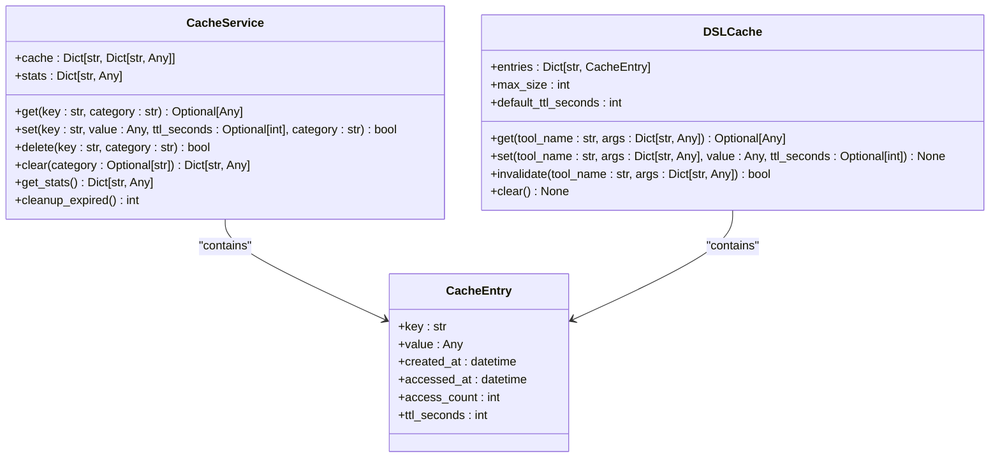
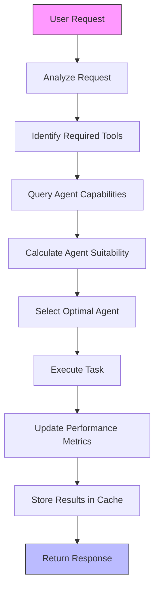
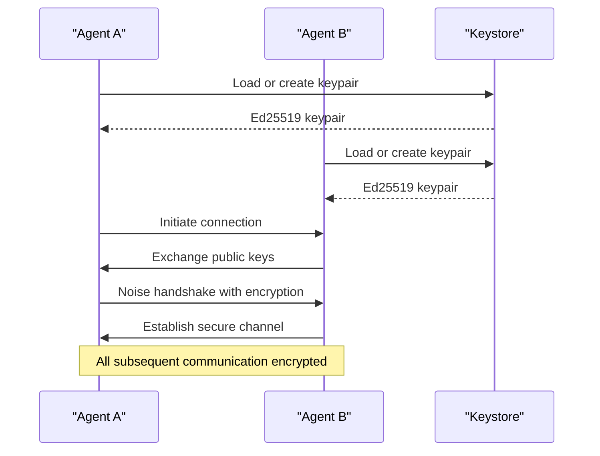
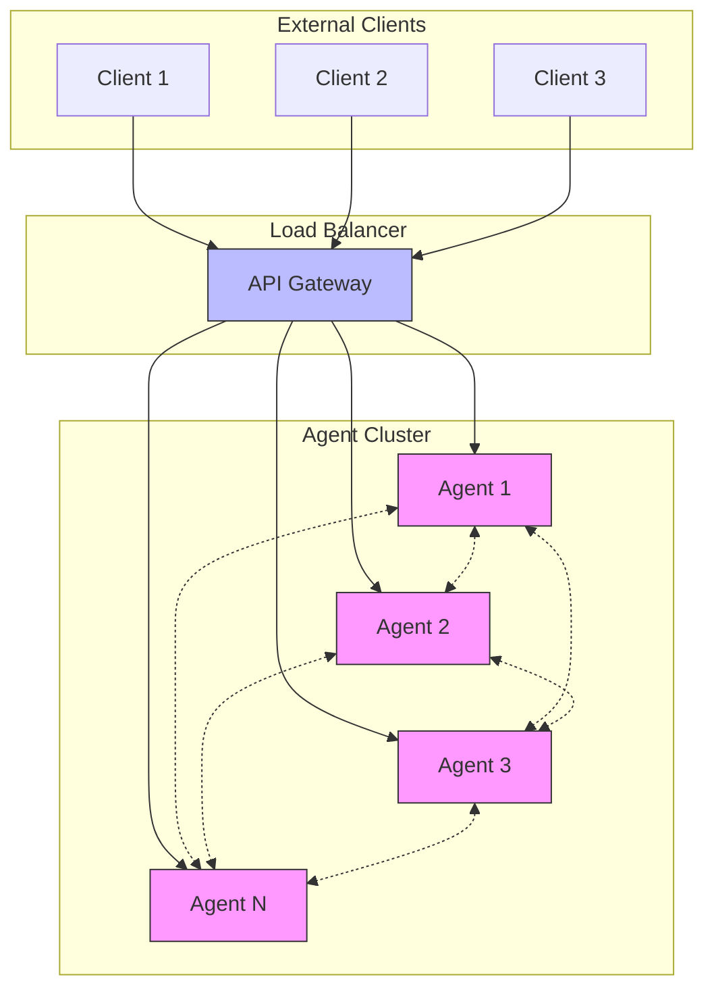
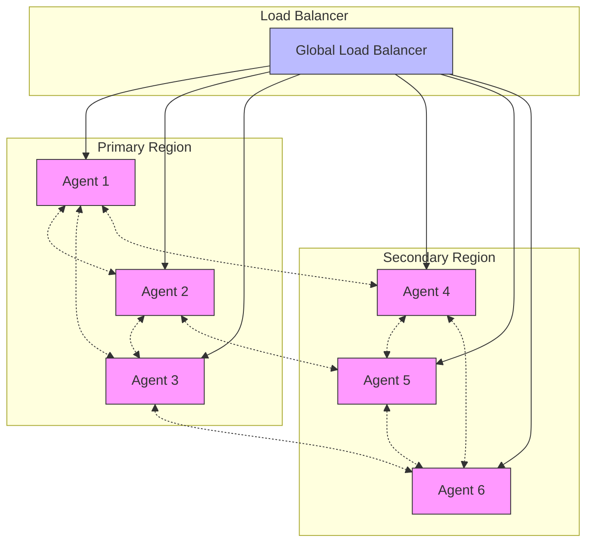

# Advanced Topics


## Table of Contents
1. [Performance Optimization](#performance-optimization)
2. [Security Considerations](#security-considerations)
3. [Scaling and Load Balancing](#scaling-and-load-balancing)
4. [Custom Extensions Development](#custom-extensions-development)
5. [Advanced Debugging Techniques](#advanced-debugging-techniques)
6. [High-Availability and Disaster Recovery](#high-availability-and-disaster-recovery)
7. [Experimental Features](#experimental-features)
8. [Migration and Compatibility](#migration-and-compatibility)
9. [Contributing to Core Framework](#contributing-to-core-framework)

## Performance Optimization

The Praxis SDK implements multiple performance optimization strategies across its architecture, with a strong focus on caching mechanisms and query optimization.

### Caching Strategies

The SDK provides a comprehensive caching system with two primary implementations: a general-purpose cache service and a specialized DSL cache for tool execution results.



**Diagram sources**
- [cache/service.py](file://src/praxis_sdk/cache/service.py#L0-L376)
- [dsl/cache.py](file://src/praxis_sdk/dsl/cache.py#L0-L260)

The `CacheService` provides in-memory caching with TTL support, statistics tracking, and memory usage monitoring. It organizes cached items by categories and tracks comprehensive metrics including hit/miss rates, memory usage, and access patterns.

```python
# Example of cache usage in the SDK
def get(self, key: str, category: str = "general") -> Optional[Any]:
    """
    Get value from cache.
    
    Args:
        key: Cache key
        category: Cache category for organization
        
    Returns:
        Cached value or None if not found/expired
    """
    full_key = f"{category}:{key}"
    
    if full_key not in self.cache:
        self.stats["misses"] += 1
        return None
    
    entry = self.cache[full_key]
    
    # Check TTL
    if entry.get("ttl") and time.time() > entry["ttl"]:
        self.delete(key, category)
        self.stats["expired"] += 1
        self.stats["misses"] += 1
        return None
```

**Section sources**
- [cache/service.py](file://src/praxis_sdk/cache/service.py#L0-L64)

The DSL cache specifically targets tool execution results, implementing LRU (Least Recently Used) eviction when the cache reaches its maximum size. This prevents memory exhaustion while maintaining performance benefits for frequently used tool combinations.

```python
def _evict_lru(self) -> None:
    """
    Evict least recently used entry.
    Implements LRU eviction strategy matching Go SDK.
    """
    if not self.entries:
        return
    
    # Find entry with oldest access time
    oldest_key = None
    oldest_time = None
    
    for key, entry in self.entries.items():
        if oldest_key is None or entry.accessed_at < oldest_time:
            oldest_key = key
            oldest_time = entry.accessed_at
    
    if oldest_key:
        del self.entries[oldest_key]
        self.stats["evictions"] += 1
        logger.debug(f"LRU eviction: {oldest_key}")
```

**Section sources**
- [dsl/cache.py](file://src/praxis_sdk/dsl/cache.py#L215-L260)

### Query Optimization

The SDK optimizes queries through intelligent agent selection and load-aware routing. The LLM context builder analyzes network conditions and agent capabilities to route tasks to the most suitable agents.



**Diagram sources**
- [llm/context_builder.py](file://src/praxis_sdk/llm/context_builder.py#L34-L87)

The agent suitability calculation considers multiple factors including current load, success rate, response time, and specific requirements:

```python
def _calculate_agent_suitability(
    self,
    agent_info: AgentInfo,
    tool_name: str,
    requirements: Optional[Dict[str, Any]]
) -> float:
    """Calculate suitability score for an agent."""
    score = 1.0
    
    # Factor in current load (lower is better)
    load_factor = 1.0 - (agent_info.load_percentage / 100.0)
    score *= (0.3 + 0.7 * load_factor)  # Load weighted at 70%
    
    # Factor in success rate
    score *= agent_info.success_rate
    
    # Factor in response time (lower is better)
    response_factor = max(0.1, 1.0 - (agent_info.response_time_avg / 5000.0))
    score *= response_factor
    
    # Apply requirements if specified
    if requirements:
        if "max_load" in requirements and agent_info.load_percentage > requirements["max_load"]:
            score *= 0.5
        
        if "preferred_location" in requirements:
            if agent_info.location == requirements["preferred_location"]:
                score *= 1.2
            else:
                score *= 0.8
    
    return min(score, 1.0)
```

**Section sources**
- [llm/context_builder.py](file://src/praxis_sdk/llm/context_builder.py#L497-L566)

## Security Considerations

The Praxis SDK implements robust security measures for both P2P networks and data protection, ensuring secure communication and execution across distributed agents.

### P2P Network Security

The P2P communication layer uses libp2p with Noise protocol encryption for secure data transmission. The security configuration is managed through the `SecurityConfig` class, which supports multiple encryption methods.



**Diagram sources**
- [p2p/security.py](file://src/praxis_sdk/p2p/security.py#L0-L58)
- [p2p/service.py](file://src/praxis_sdk/p2p/service.py#L208-L238)

The `P2PSecurityManager` handles key generation, loading, and storage, ensuring that each agent has a unique cryptographic identity:

```python
class P2PSecurityManager:
    """
    Manages security aspects of P2P communication.
    
    Features:
    - Ed25519 keypair generation and loading
    - Secure key storage
    - Noise protocol key handling
    """
    
    def __init__(self, config):
        self.config = config
        self.keystore_path = Path(config.keystore_path)
        self.keystore_path.mkdir(parents=True, exist_ok=True)
    
    def load_or_create_keypair(self, key_filename: str = "node.key") -> KeyPair:
        """Load existing keypair or create a new one"""
        key_path = self.keystore_path / key_filename
        
        if key_path.exists():
            logger.info(f"Loading existing keypair from: {key_path}")
            seed = key_path.read_bytes()
        else:
            logger.info(f"Creating new keypair: {key_path}")
            seed = os.urandom(32)
            key_path.write_bytes(seed)
        
        return create_new_key_pair(seed)
```

**Section sources**
- [p2p/security.py](file://src/praxis_sdk/p2p/security.py#L18-L58)

The P2P service configures security options based on the agent configuration, enabling Noise protocol encryption when configured:

```python
def _get_security_options(self) -> Dict:
    """Get security transport options."""
    if self.config.security.use_noise and self.config.security.noise_key:
        # Use Noise protocol for encryption
        return {
            NOISE_PROTOCOL_ID: NoiseTransport(
                libp2p_keypair=self.keypair,
                noise_privkey=self._decode_noise_key(self.config.security.noise_key)
            )
        }
    else:
        # Use plaintext for development
        return {
            PLAINTEXT_PROTOCOL_ID: InsecureTransport(
                local_key_pair=self.keypair
            )
        }
```

**Section sources**
- [p2p/service.py](file://src/praxis_sdk/p2p/service.py#L208-L238)

### Data Encryption

Data is protected both at rest and in transit through multiple mechanisms. The configuration system supports TLS for API endpoints and encrypted storage of sensitive data.

```python
class SecurityConfig(BaseModel):
    """Security configuration for P2P and API."""
    
    use_noise: bool = True
    noise_key: Optional[str] = None
    tls_cert_path: Optional[str] = None
    tls_key_path: Optional[str] = None
    api_key: Optional[str] = None
```

**Section sources**
- [config.py](file://src/praxis_sdk/config.py#L0-L21)

Execution environments are secured through sandboxing and resource limits, particularly in the Dagger execution engine:

```yaml
# worker_analytics.yaml
execution:
  dagger:
    resource_limits:
      cpu: "2000m"
      memory: "4Gi"
      disk: "10Gi"
    security:
      drop_capabilities: ["ALL"]
      run_as_non_root: true
```

**Section sources**
- [worker_analytics.yaml](file://configs/worker_analytics.yaml#L397-L442)

## Scaling and Load Balancing

The Praxis SDK supports distributed agent clusters with sophisticated load balancing strategies to ensure optimal resource utilization and high availability.

### Distributed Agent Clusters

The architecture supports horizontal scaling through multiple agent instances that automatically discover and connect to each other via P2P protocols. Configuration files define different scaling profiles for various workloads.



**Diagram sources**
- [agent_production.yaml](file://configs/agent_production.yaml#L112-L165)
- [agent_development.yaml](file://configs/agent_development.yaml#L144-L171)

The `agent_production.yaml` configuration demonstrates production-ready settings with optimized resource allocation:

```yaml
execution:
  default_engine: "dagger"
  dagger:
    enabled: true
    session_timeout: 600
    default_image: "python:3.11-slim"
    mount_docker_socket: true
    resource_limits:
      cpu: "4000m"
      memory: "2Gi"
  enable_sandboxing: true
  max_execution_time: 1200
  cleanup_temp_files: true
```

**Section sources**
- [agent_production.yaml](file://configs/agent_production.yaml#L112-L165)

For analytics workloads requiring more resources, the `worker_analytics.yaml` configuration provides enhanced capabilities:

```yaml
execution:
  dagger:
    resource_limits:
      cpu: "2000m"
      memory: "4Gi"
      disk: "10Gi"
  max_execution_time: 1800  # 30 minutes for complex analysis
  concurrent_executions: 3
```

**Section sources**
- [worker_analytics.yaml](file://configs/worker_analytics.yaml#L397-L442)

### Load Balancing Strategies

The SDK implements intelligent load balancing through the LLM-based agent selection system, which distributes tasks based on real-time performance metrics and agent capabilities.

```python
def _calculate_agent_suitability(
    self,
    agent_info: AgentInfo,
    tool_name: str,
    requirements: Optional[Dict[str, Any]]
) -> float:
    """Calculate suitability score for an agent."""
    score = 1.0
    
    # Factor in current load (lower is better)
    load_factor = 1.0 - (agent_info.load_percentage / 100.0)
    score *= (0.3 + 0.7 * load_factor)  # Load weighted at 70%
    
    # Factor in success rate
    score *= agent_info.success_rate
    
    # Factor in response time (lower is better)
    response_factor = max(0.1, 1.0 - (agent_info.response_time_avg / 5000.0))
    score *= response_factor
```

**Section sources**
- [llm/context_builder.py](file://src/praxis_sdk/llm/context_builder.py#L497-L534)

The system also provides health monitoring and automatic failover capabilities:

```python
@dataclass
class AgentInfo:
    """Comprehensive information about an agent."""
    
    id: str
    peer_id: str
    capabilities: List[AgentCapability]
    current_load: float
    max_load: float
    location: str
    last_seen: datetime
    response_time_avg: float
    success_rate: float
    metadata: Dict[str, Any] = field(default_factory=dict)
    
    @property
    def is_available(self) -> bool:
        """Check if agent is available for new tasks."""
        return (
            self.current_load < self.max_load * 0.9 and
            (datetime.now() - self.last_seen).seconds < 300  # Seen within 5 minutes
        )
```

**Section sources**
- [llm/context_builder.py](file://src/praxis_sdk/llm/context_builder.py#L34-L87)

## Custom Extensions Development

The Praxis SDK provides extensibility points for developing custom components including execution engines, communication protocols, and event handlers.

### New Execution Engines

Custom execution engines can be developed by implementing the `ExecutionEngine` interface. The SDK already supports multiple engines including Dagger, Docker, and local execution.

```python
class ExecutionEngine(ABC):
    """Base class for execution engines."""
    
    @abstractmethod
    async def execute(self, contract: ToolContract, args: Dict[str, Any], timeout: Optional[int] = None) -> ExecutionResult:
        """Execute a tool with given arguments."""
        pass
    
    @abstractmethod
    async def cleanup(self) -> None:
        """Clean up resources."""
        pass
```

To create a custom engine, extend this base class and implement the required methods:

```python
class CustomExecutionEngine(ExecutionEngine):
    """Custom execution engine implementation."""
    
    def __init__(self, config: Dict[str, Any]):
        self.config = config
        self.initialized = False
    
    async def execute(self, contract: ToolContract, args: Dict[str, Any], timeout: Optional[int] = None) -> ExecutionResult:
        """Execute tool using custom engine."""
        try:
            # Initialize if needed
            if not self.initialized:
                await self._initialize()
            
            # Custom execution logic here
            result = await self._run_execution(contract, args, timeout)
            
            return ExecutionResult(
                success=True,
                output=result,
                duration=time.time() - start_time
            )
            
        except Exception as e:
            return ExecutionResult.error_result(str(e))
    
    async def cleanup(self) -> None:
        """Clean up custom engine resources."""
        # Custom cleanup logic
        self.initialized = False
```

The agent registers execution engines during initialization:

```python
async def _start_execution_engines(self):
    """Start all configured execution engines."""
    logger.info("Starting execution engines...")
    
    # Start Dagger engine if enabled
    if self.config.execution.dagger.enabled:
        try:
            from praxis_sdk.execution import DaggerEngine
            engine = DaggerEngine(self.config.execution.dagger)
            self.execution_engines[EngineType.DAGGER] = engine
            logger.info("✅ Dagger execution engine started")
        except Exception as e:
            logger.error(f"❌ Failed to initialize Dagger engine: {e}")
            self._health_status["dagger_execution_engine"] = False
```

**Section sources**
- [agent.py](file://src/praxis_sdk/agent.py#L256-L284)

### Communication Protocols

Custom communication protocols can be developed by extending the P2P protocol handlers. The SDK uses libp2p for underlying transport and provides hooks for custom protocol implementation.

```python
class P2PProtocolHandler:
    """Base class for P2P protocol handlers."""
    
    def __init__(self, host, protocol_id: str):
        self.host = host
        self.protocol_id = protocol_id
        self.logger = logging.getLogger(f"praxis.p2p.protocol.{protocol_id}")
    
    async def register(self):
        """Register the protocol with the host."""
        await self.host.register_protocol(self.protocol_id, self._handle_stream)
    
    async def _handle_stream(self, stream):
        """Handle incoming stream for this protocol."""
        try:
            # Read message
            message_data = await stream.read()
            message = json.loads(message_data.decode())
            
            # Process message
            response = await self.process_message(message)
            
            # Send response
            await stream.write(json.dumps(response).encode())
            await stream.close()
            
        except Exception as e:
            self.logger.error(f"Error handling stream: {e}")
            await stream.reset()
```

**Section sources**
- [p2p/__init__.py](file://src/praxis_sdk/p2p/__init__.py#L0-L30)

### Event Handlers

Custom event handlers can be developed to respond to system events. The SDK uses an event bus pattern for decoupled communication between components.

```python
def _setup_event_handlers(self):
    """Setup event bus handlers for MCP integration"""
    
    # P2P events
    event_bus.subscribe("p2p.peer_discovered", self._on_peer_discovered)
    event_bus.subscribe("p2p.peer_connected", self._on_peer_connected)
    event_bus.subscribe("p2p.peer_disconnected", self._on_peer_disconnected)
    event_bus.subscribe("p2p.tool_request", self._on_p2p_tool_request)
    event_bus.subscribe("p2p.mcp_request", self._on_p2p_mcp_request)
    
    # MCP events
    event_bus.subscribe("mcp.tool_registered", self._on_mcp_tool_registered)
    event_bus.subscribe("mcp.tool_unregistered", self._on_mcp_tool_unregistered)
    event_bus.subscribe("mcp.external_server_connected", self._on_external_server_connected)
    event_bus.subscribe("mcp.external_server_disconnected", self._on_external_server_disconnected)
    
    # Tool execution events
    event_bus.subscribe("tool_execution_start", self._on_tool_execution_start)
    event_bus.subscribe("tool_execution_complete", self._on_tool_execution_complete)
    event_bus.subscribe("tool_execution_error", self._on_tool_execution_error)
```

**Section sources**
- [mcp/integration.py](file://src/praxis_sdk/mcp/integration.py#L119-L144)

## Advanced Debugging Techniques

The SDK provides comprehensive debugging capabilities through distributed tracing, logging aggregation, and monitoring tools.

### Distributed Tracing

The system implements structured logging with correlation IDs to trace requests across multiple agents and components.

```yaml
# agent_production.yaml
logging:
  structured_logging: true
  correlation_id_enabled: true
```

**Section sources**
- [agent_production.yaml](file://configs/agent_production.yaml#L112-L165)

The API handlers track detailed statistics for monitoring and debugging:

```python
def get_stats(self) -> Dict[str, Any]:
    """Get handler statistics."""
    return {
        **self.stats,
        "task_states": {
            state.value: sum(1 for task in self.tasks.values() if task.status.state == state)
            for state in TaskState
        },
        "success_rate": (
            self.stats["successful_requests"] / self.stats["total_requests"]
            if self.stats["total_requests"] > 0 else 0.0
        ),
        "error_rate": (
            self.stats["failed_requests"] / self.stats["total_requests"]
            if self.stats["total_requests"] > 0 else 0.0
        ),
    }
```

**Section sources**
- [api/handlers.py](file://src/praxis_sdk/api/handlers.py#L717-L750)

### Logging Aggregation

The SDK supports multiple logging formats and destinations, enabling centralized log collection and analysis.

```python
def _setup_logging(self):
    """Configure logging based on configuration."""
    log_config = self.config.logging
    
    # Remove default handler
    logger.remove()
    
    # Fix format if it's configured as "text" (causing spam)
    log_format = log_config.format
    if log_format == "text":
        # Use simplified format to reduce spam
        log_format = "{time:YYYY-MM-DD HH:mm:ss} | {level: <8} | {name}:{function}:{line} | {message}"
    else:
        # JSON format for structured logging
        log_format = '{"timestamp": "{time:YYYY-MM-DD HH:mm:ss}", "level": "{level}", "module": "{name}", "function": "{function}", "line": {line}, "message": "{message}"}'
```

**Section sources**
- [agent.py](file://src/praxis_sdk/agent.py#L65-L103)

## High-Availability and Disaster Recovery

The SDK implements patterns for high-availability deployments and disaster recovery to ensure system resilience.

### High-Availability Deployments

The architecture supports high-availability through redundant agent instances and automatic failover. The P2P network topology ensures that the system remains functional even if individual agents fail.



**Diagram sources**
- [agent_production.yaml](file://configs/agent_production.yaml#L112-L165)

### Disaster Recovery

The system includes mechanisms for data persistence and recovery. Tool execution results can be automatically saved to shared storage:

```python
def _save_execution_result(self, tool_name: str, result: Any, engine: Optional[EngineType] = None):
    """
    Save execution result to shared storage.
    
    - Always saves for Dagger engine tools.
    - Saves both raw stdout (txt) and structured report (json) when possible.
    - Uses configured shared_dir if available, defaults to /app/shared.
    """
    try:
        # Only enforce for Dagger tools per requirement
        if engine is not None and engine != EngineType.DAGGER:
            return

        import json
        import datetime
        from pathlib import Path

        # Determine reports directory from config shared_dir
        shared_dir = self.config.shared_dir or "/app/shared"
        reports_dir = Path(shared_dir) / "reports"
        reports_dir.mkdir(parents=True, exist_ok=True)

        # Normalize result content
        if hasattr(result, 'output'):
            content = result.output
        else:
            content = result

        # Build timestamped filenames
        timestamp = datetime.datetime.now().strftime("%Y%m%d_%H%M%S")
        base_name = f"{tool_name}_{timestamp}"
        text_path = reports_dir / f"{base_name}.txt"
        json_path = reports_dir / f"{base_name}.json"
```

**Section sources**
- [agent.py](file://src/praxis_sdk/agent.py#L956-L984)

## Experimental Features

The SDK includes several experimental features that are under active development and may change in future releases.

### Enhanced Execution Engine Detection

An experimental feature tests Dagger engine availability with retry logic and comprehensive diagnostics:

```python
async def test_dagger_availability() -> bool:
    """
    Test if Dagger Engine is available and working.
    
    Returns:
        True if Dagger is available
    """
    if not DAGGER_AVAILABLE:
        logger.debug("Dagger SDK not imported")
        return False
    
    logger.info("🔍 TESTING DAGGER ENGINE AVAILABILITY...")
    
    try:
        logger.info("   STEP 1: Checking Dagger CLI availability...")
        import subprocess
        result = subprocess.run(['dagger', 'version'], capture_output=True, text=True, timeout=10)
        if result.returncode != 0:
            logger.warning(f"   ❌ Dagger CLI not available or not working: {result.stderr}")
            return False
        logger.info(f"   ✅ Dagger CLI available: {result.stdout.strip()}")
        
        logger.info("   STEP 2: Checking Docker CLI availability...")
        docker_result = subprocess.run(['docker', '--version'], capture_output=True, text=True, timeout=5)
        if docker_result.returncode != 0:
            logger.warning("   ❌ Docker CLI not available - required by Dagger Engine")
            return False
        logger.info(f"   ✅ Docker CLI available: {docker_result.stdout.strip()}")
        
        logger.info("   STEP 3: Testing Dagger Engine connection with retry logic...")
        
        # Retry logic with exponential backoff
        max_retries = 3
        base_delay = 2.0
```

**Section sources**
- [execution/engine.py](file://src/praxis_sdk/execution/engine.py#L941-L974)

## Migration and Compatibility

The SDK provides strategies for migrating from deprecated components and maintaining backwards compatibility.

### Migration Paths

When configuration options are deprecated, the system provides backward compatibility through field validators:

```python
@field_validator('enable_mdns', mode='before')
@classmethod 
def sync_mdns_config(cls, v, info: ValidationInfo):
    """Sync enable_mdns with peer_discovery for compatibility."""
    if v is None and 'peer_discovery' in info.data:
        return info.data['peer_discovery']
    return v if v is not None else True
```

**Section sources**
- [config.py](file://src/praxis_sdk/config.py#L24-L63)

### Backwards Compatibility

The system maintains compatibility with older configuration formats while encouraging migration to newer standards. The configuration system handles missing or deprecated fields gracefully:

```python
def _get_agent_config(self, agent_name: str) -> AgentConfig:
    """Get configuration for this specific agent."""
    agent_config = self.config.get_agent_config(agent_name)
    
    if not agent_config:
        # Create default agent config
        agent_config = AgentConfig(
            name=agent_name,
            description=f"Praxis agent: {agent_name}",
            tools=["filesystem", "python_exec", "web_search"],
            capabilities=["task_management", "tool_execution", "p2p_communication"]
        )
        self.config.add_agent(agent_config)
    
    return agent_config
```

**Section sources**
- [agent.py](file://src/praxis_sdk/agent.py#L65-L103)

## Contributing to Core Framework

The SDK welcomes contributions to the core framework, with clear guidelines for adding new features and improvements.

### Contribution Process

Contributors should follow the established patterns for new feature development:

1. Implement new functionality in a modular component
2. Add comprehensive tests
3. Update documentation
4. Follow coding standards (PEP 8, type hints, docstrings)
5. Submit a pull request with a clear description

The event-driven architecture makes it easy to extend functionality without modifying core components:

```python
# Example of adding a new event handler
def setup_custom_monitoring():
    """Setup custom monitoring handlers."""
    
    # Subscribe to relevant events
    event_bus.subscribe("tool_execution_start", handle_tool_start)
    event_bus.subscribe("tool_execution_complete", handle_tool_complete)
    event_bus.subscribe("tool_execution_error", handle_tool_error)
    event_bus.subscribe("p2p.peer_discovered", handle_peer_discovery)
    
    logger.info("Custom monitoring handlers registered")
```

The modular design allows new features to be added as plugins or extensions, minimizing the risk of breaking existing functionality.

**Referenced Files in This Document**   
- [agent.py](file://src/praxis_sdk/agent.py)
- [config.py](file://src/praxis_sdk/config.py)
- [service.py](file://src/praxis_sdk/p2p/service.py)
- [security.py](file://src/praxis_sdk/p2p/security.py)
- [cache/service.py](file://src/praxis_sdk/cache/service.py)
- [dsl/cache.py](file://src/praxis_sdk/dsl/cache.py)
- [execution/engine.py](file://src/praxis_sdk/execution/engine.py)
- [llm/context_builder.py](file://src/praxis_sdk/llm/context_builder.py)
- [api/handlers.py](file://src/praxis_sdk/api/handlers.py)
- [mcp/integration.py](file://src/praxis_sdk/mcp/integration.py)
- [agent_production.yaml](file://configs/agent_production.yaml)
- [worker_analytics.yaml](file://configs/worker_analytics.yaml)
- [agent_development.yaml](file://configs/agent_development.yaml)