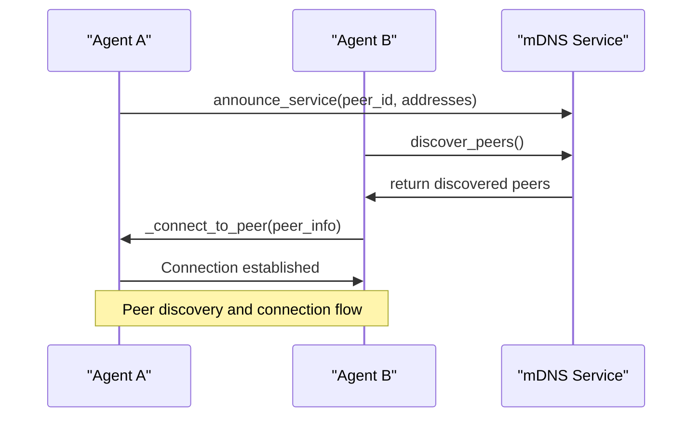
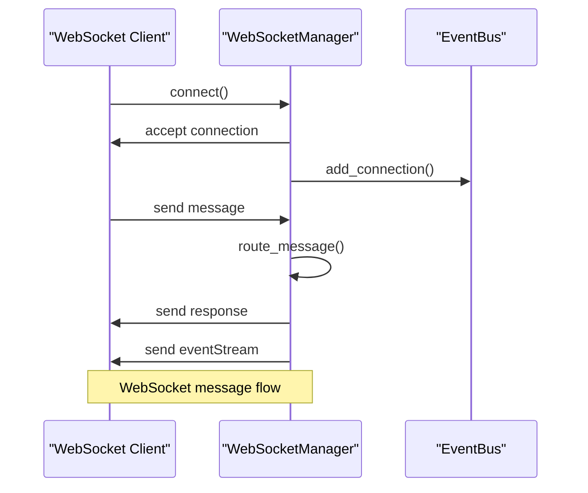
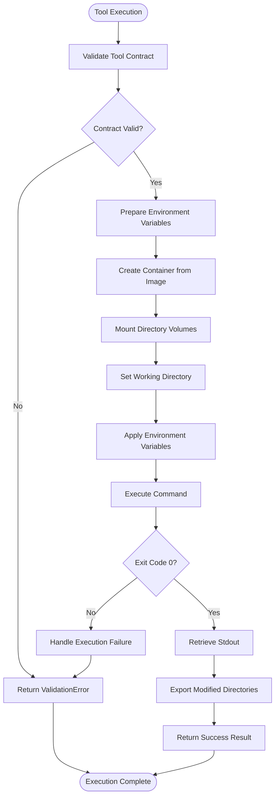
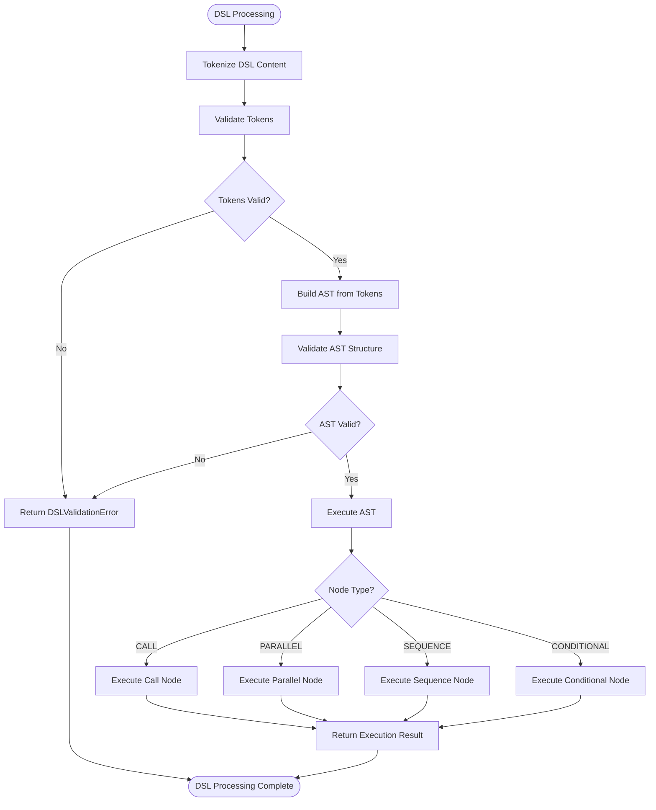
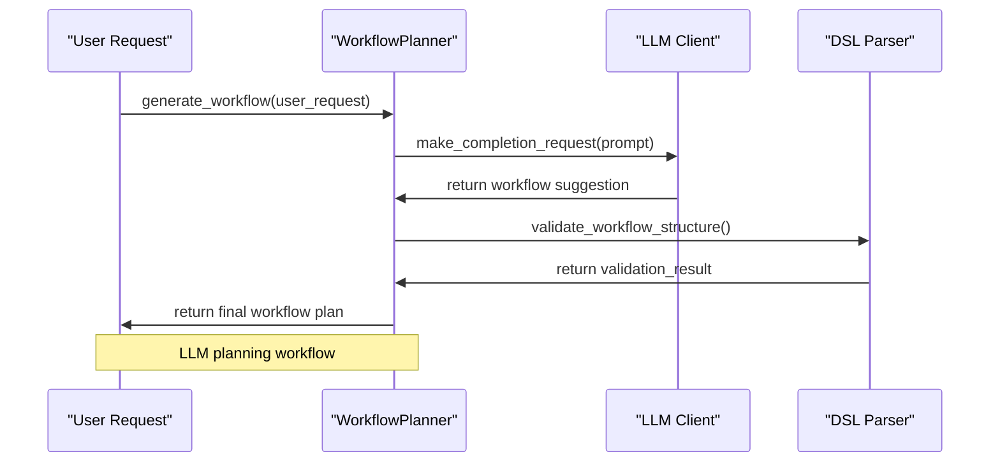
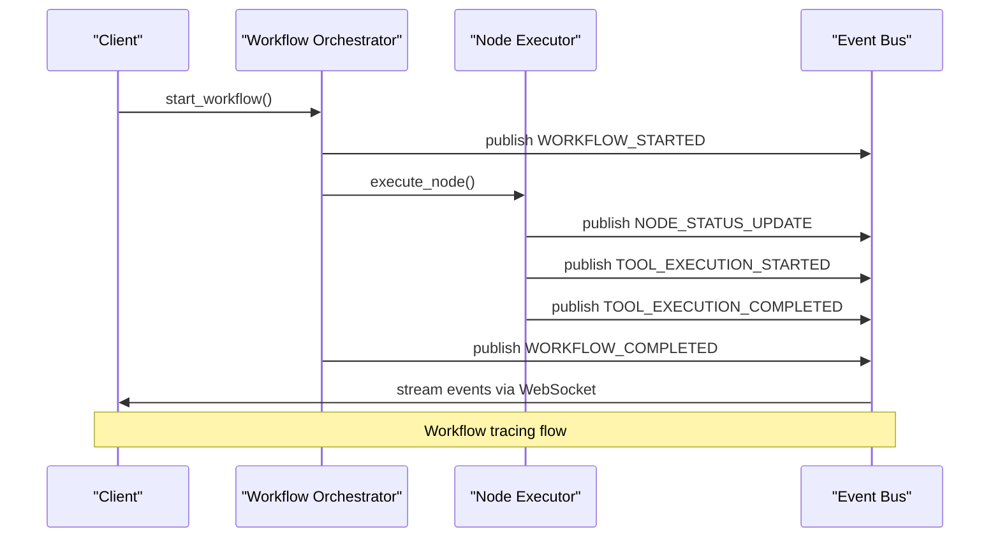
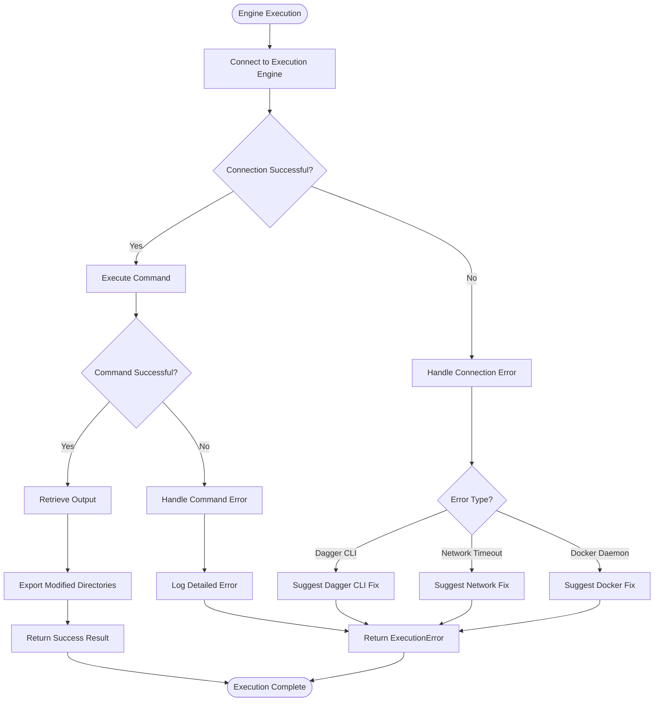
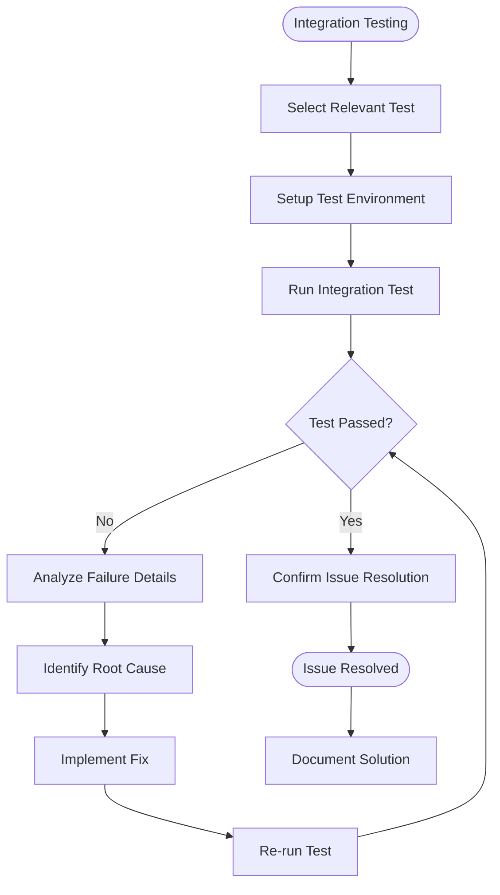
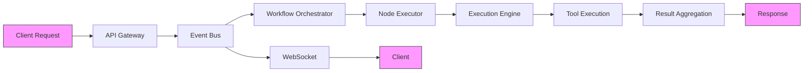

# Debugging and Troubleshooting

## Table of Contents
1. [P2P Connectivity and Agent Discovery Issues](#p2p-connectivity-and-agent-discovery-issues)
2. [Message Routing and WebSocket Disconnections](#message-routing-and-websocket-disconnections)
3. [Tool Execution and Contract Validation Failures](#tool-execution-and-contract-validation-failures)
4. [DSL Parsing and Orchestration Errors](#dsl-parsing-and-orchestration-errors)
5. [LLM Planning and Context Building Failures](#llm-planning-and-context-building-failures)
6. [Workflow Execution Tracing](#workflow-execution-tracing)
7. [Engine Failure Handling and Recovery Patterns](#engine-failure-handling-and-recovery-patterns)
8. [Integration Testing as a Diagnostic Tool](#integration-testing-as-a-diagnostic-tool)
9. [Logging Best Practices and Distributed Tracing](#logging-best-practices-and-distributed-tracing)

## P2P Connectivity and Agent Discovery Issues

The Praxis SDK uses mDNS-based peer discovery for automatic agent detection in local networks. The `P2PDiscovery` class in `src/praxis_sdk/p2p/discovery.py` manages peer discovery, connection handling, and lifecycle management.

Common issues in P2P connectivity include:
- mDNS service not starting due to network configuration
- Peer connection timeouts
- Bootstrap peer configuration errors
- Firewall blocking mDNS traffic (UDP port 5353)

Diagnostic techniques:
1. Check mDNS service status in logs for "Started mDNS discovery" messages
2. Verify network interfaces are properly detected using `_get_local_ip()`
3. Monitor peer discovery events through the event bus
4. Validate bootstrap peer addresses are correctly formatted

**Diagram sources**
- [discovery.py](file://src/praxis_sdk/p2p/discovery.py#L200-L400)

**Section sources**
- [discovery.py](file://src/praxis_sdk/p2p/discovery.py#L1-L600)

## Message Routing and WebSocket Disconnections

WebSocket connectivity issues can stem from several sources including connection timeouts, message handling errors, or heartbeat failures. The `WebSocketManager` class in `src/praxis_sdk/api/websocket.py` handles connection lifecycle, message routing, and event streaming.

Common WebSocket issues:
- Connection timeouts during high load
- Message serialization/deserialization errors
- Heartbeat timeout disconnections
- Event subscription filtering problems

Diagnostic workflow:
1. Check connection state using `get_connection_info()`
2. Monitor heartbeat intervals and last ping timestamps
3. Validate message format follows `WebSocketMessage` schema
4. Check event subscription filters are correctly applied

**Diagram sources**
- [websocket.py](file://src/praxis_sdk/api/websocket.py#L200-L500)

**Section sources**
- [websocket.py](file://src/praxis_sdk/api/websocket.py#L1-L800)

## Tool Execution and Contract Validation Failures

Tool execution failures can occur due to contract validation errors, environment issues, or execution engine problems. The SDK supports multiple execution engines including Dagger, Docker SDK, local subprocess, and remote MCP.

Common tool execution issues:
- Invalid contract specifications
- Missing dependencies in container environments
- Environment variable propagation failures
- Timeout during tool execution
- Permission denied errors

Diagnostic techniques:
1. Check contract validation using `validate_contract()` method
2. Verify engine capabilities with `get_capabilities()`
3. Examine environment variable preparation in `_prepare_environment_variables()`
4. Review container mounting configuration in `spec.mounts`

**Diagram sources**
- [engine_broken.py](file://src/praxis_sdk/execution/engine_broken.py#L100-L300)

**Section sources**
- [engine_broken.py](file://src/praxis_sdk/execution/engine_broken.py#L1-L980)
- [test_tool_execution.py](file://tests/integration/test_tool_execution.py#L1-L100)

## DSL Parsing and Orchestration Errors

DSL parsing issues typically involve syntax errors, validation failures, or execution problems. The `AdvancedDSLParser` class in `src/praxis_sdk/dsl/parser.py` handles the complete DSL processing pipeline including tokenization, AST building, validation, and execution.

Common DSL issues:
- Syntax errors in DSL commands
- Invalid AST node types
- Failed validation checks
- Cache-related execution problems
- Agent selection failures

Diagnostic workflow:
1. Check tokenization output for proper token separation
2. Validate AST structure using `validate_ast()`
3. Examine execution context and available tools
4. Review cache hit/miss statistics
5. Trace node execution through different node types

**Diagram sources**
- [parser.py](file://src/praxis_sdk/dsl/parser.py#L200-L400)

**Section sources**
- [parser.py](file://src/praxis_sdk/dsl/parser.py#L1-L679)

## LLM Planning and Context Building Failures

LLM planning failures can occur due to prompt engineering issues, context limitations, or planning algorithm problems. The SDK uses LLM integration for workflow planning and natural language processing.

Common LLM issues:
- Prompt formatting errors
- Context window overflow
- Planning algorithm failures
- API timeout errors
- Rate limiting issues

Diagnostic techniques:
1. Check prompt formatting in `format_prompt()`
2. Validate context size before sending to LLM
3. Monitor API request/response times
4. Review error analysis and recovery suggestions
5. Examine planning optimization strategies

**Diagram sources**
- [test_llm_workflow_planning.py](file://tests/test_llm_workflow_planning.py#L1-L50)

**Section sources**
- [test_llm_workflow_planning.py](file://tests/test_llm_workflow_planning.py#L1-L100)

## Workflow Execution Tracing

Workflow execution tracing relies on the event bus system to propagate events across distributed components. The `EventBus` class enables real-time monitoring of workflow progress, node status, and execution results.

Tracing strategies:
1. Subscribe to workflow events using event filters
2. Monitor node execution status changes
3. Track workflow progression from start to completion
4. Capture error events for failed executions
5. Correlate events using correlation IDs

**Diagram sources**
- [test_event_bus.py](file://tests/test_event_bus.py#L50-L100)

**Section sources**
- [test_event_bus.py](file://tests/test_event_bus.py#L1-L150)

## Engine Failure Handling and Recovery Patterns

The `engine_broken.py` file provides an example of failure handling and recovery patterns in the Praxis SDK. The implementation includes comprehensive error handling, logging, and fallback mechanisms.

Key recovery patterns:
- Connection error detection and retry logic
- Fallback execution engines
- Cache-busting mechanisms
- Detailed error logging
- Graceful degradation

**Diagram sources**
- [engine_broken.py](file://src/praxis_sdk/execution/engine_broken.py#L300-L500)

**Section sources**
- [engine_broken.py](file://src/praxis_sdk/execution/engine_broken.py#L1-L980)

## Integration Testing as a Diagnostic Tool

Integration tests serve as valuable diagnostic tools for identifying system-level issues. The Praxis SDK includes comprehensive integration tests for key functionality.

Available integration tests:
- `test_p2p_connectivity.py`: Validates peer discovery and connection
- `test_tool_execution.py`: Tests tool execution across different engines
- `test_websocket_connectivity.py`: Verifies WebSocket message handling
- `test_multi_agent_communication.py`: Tests agent-to-agent protocols
- `test_a2a_protocol.py`: Validates A2A protocol implementation

Diagnostic usage:
1. Run specific integration tests to isolate issues
2. Use test outputs to identify failure points
3. Leverage test setup for reproducing production issues
4. Examine test assertions for expected behavior

**Diagram sources**
- [test_p2p_connectivity.py](file://tests/integration/test_p2p_connectivity.py#L1-L20)
- [test_tool_execution.py](file://tests/integration/test_tool_execution.py#L1-L20)
- [test_websocket_connectivity.py](file://tests/integration/test_websocket_connectivity.py#L1-L20)

**Section sources**
- [test_p2p_connectivity.py](file://tests/integration/test_p2p_connectivity.py#L1-L100)
- [test_tool_execution.py](file://tests/integration/test_tool_execution.py#L1-L100)
- [test_websocket_connectivity.py](file://tests/integration/test_websocket_connectivity.py#L1-L100)

## Logging Best Practices and Distributed Tracing

Effective logging and distributed tracing are essential for debugging distributed systems. The Praxis SDK implements comprehensive logging throughout its components.

Logging best practices:
- Use structured logging with consistent formatting
- Include execution context in log messages
- Implement log levels appropriately (debug, info, warning, error)
- Add correlation IDs for tracing requests
- Log entry and exit points of critical functions

Distributed tracing integration points:
- Event bus for cross-component event propagation
- WebSocket for real-time client updates
- Correlation IDs for request tracking
- Execution context for workflow tracing
- Performance metrics for bottleneck identification

**Diagram sources**
- [websocket.py](file://src/praxis_sdk/api/websocket.py#L100-L150)
- [bus.py](file://src/praxis_sdk/bus.py#L1-L50)

**Section sources**
- [websocket.py](file://src/praxis_sdk/api/websocket.py#L1-L800)
- [bus.py](file://src/praxis_sdk/bus.py#L1-L200)

**Referenced Files in This Document**   
- [engine_broken.py](file://src/praxis_sdk/execution/engine_broken.py)
- [websocket.py](file://src/praxis_sdk/api/websocket.py)
- [discovery.py](file://src/praxis_sdk/p2p/discovery.py)
- [parser.py](file://src/praxis_sdk/dsl/parser.py)
- [node_executor.py](file://src/praxis_sdk/workflow/node_executor.py)
- [test_p2p_connectivity.py](file://tests/integration/test_p2p_connectivity.py)
- [test_tool_execution.py](file://tests/integration/test_tool_execution.py)
- [test_websocket_connectivity.py](file://tests/integration/test_websocket_connectivity.py)
- [test_llm_workflow_planning.py](file://tests/test_llm_workflow_planning.py)
- [test_event_bus.py](file://tests/test_event_bus.py)