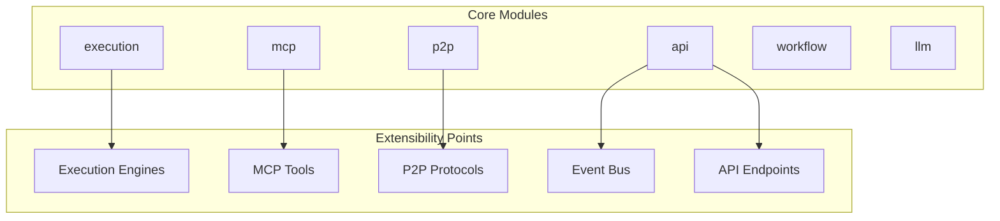
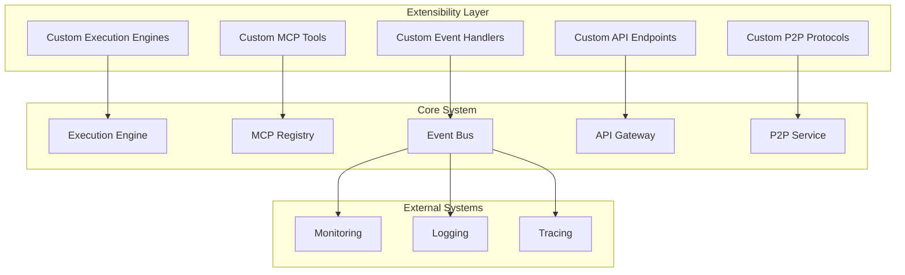
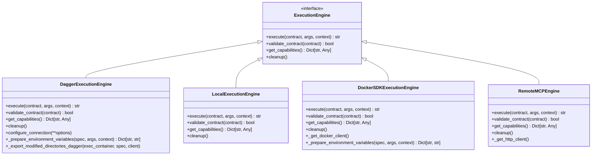
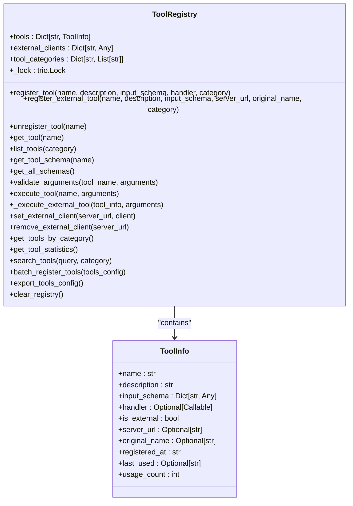
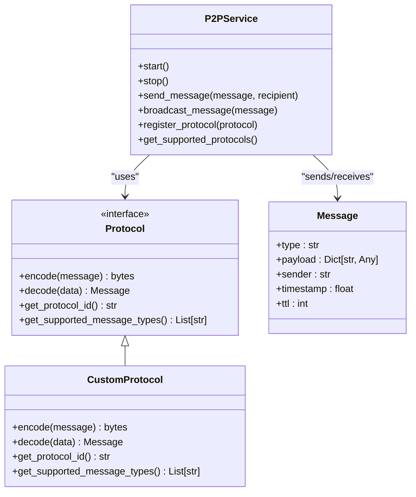
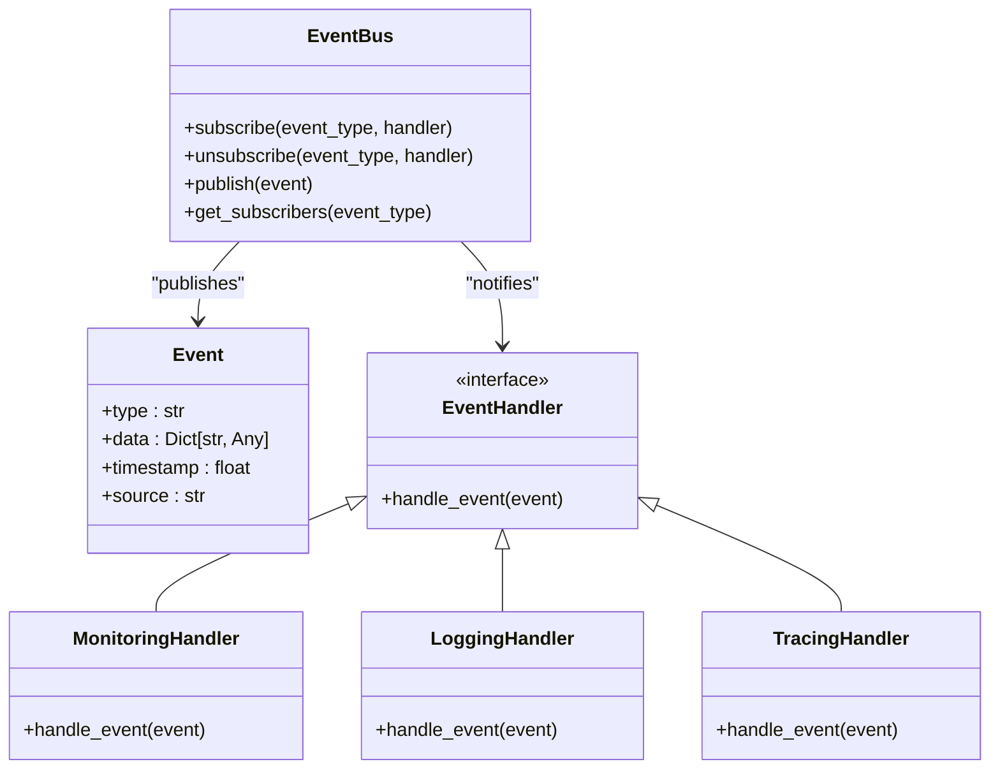
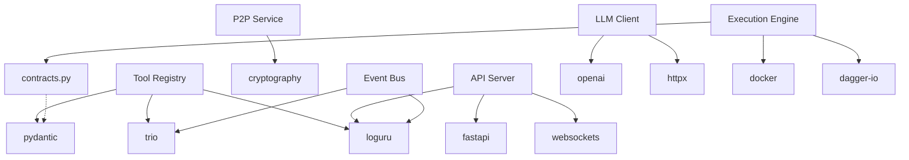

# Extensibility and Customization


## Table of Contents
1. [Introduction](#introduction)
2. [Project Structure](#project-structure)
3. [Core Components](#core-components)
4. [Architecture Overview](#architecture-overview)
5. [Detailed Component Analysis](#detailed-component-analysis)
6. [Dependency Analysis](#dependency-analysis)
7. [Performance Considerations](#performance-considerations)
8. [Troubleshooting Guide](#troubleshooting-guide)
9. [Conclusion](#conclusion)

## Introduction
This document provides a comprehensive guide to extending and customizing the Praxis SDK. It covers implementation of custom execution engines, creation of MCP tools, extension of P2P communication, development of event handlers, API endpoint additions, and integration with external monitoring systems. The content is designed to be accessible to developers with varying levels of technical expertise while providing deep technical insights into the SDK's extensibility mechanisms.

## Project Structure
The Praxis SDK follows a modular architecture with clearly defined components for execution, communication, tool management, and workflow orchestration. The structure enables developers to extend functionality without modifying core components.



**Diagram sources**
- [engine.py](file://src/praxis_sdk/execution/engine.py#L0-L1052)
- [registry.py](file://src/praxis_sdk/mcp/registry.py#L0-L463)
- [protocols.py](file://src/praxis_sdk/p2p/protocols.py#L0-L150)

**Section sources**
- [engine.py](file://src/praxis_sdk/execution/engine.py#L0-L1052)
- [registry.py](file://src/praxis_sdk/mcp/registry.py#L0-L463)

## Core Components
The Praxis SDK's extensibility framework is built around several core components that provide well-defined interfaces for customization. These include the execution engine abstraction, MCP tool registry, P2P communication layer, event bus, and API gateway.

**Section sources**
- [engine.py](file://src/praxis_sdk/execution/engine.py#L0-L1052)
- [contracts.py](file://src/praxis_sdk/execution/contracts.py#L0-L378)
- [registry.py](file://src/praxis_sdk/mcp/registry.py#L0-L463)

## Architecture Overview
The Praxis SDK architecture is designed with extensibility as a primary concern. Components are loosely coupled through well-defined interfaces, allowing for easy replacement and extension of functionality.



**Diagram sources**
- [engine.py](file://src/praxis_sdk/execution/engine.py#L0-L1052)
- [registry.py](file://src/praxis_sdk/mcp/registry.py#L0-L463)
- [bus.py](file://src/praxis_sdk/bus.py#L0-L100)
- [server.py](file://src/praxis_sdk/api/server.py#L0-L200)

## Detailed Component Analysis

### Execution Engine Extension
The execution engine system allows developers to implement custom execution strategies by extending the base `ExecutionEngine` interface. This enables integration with different execution environments such as container orchestration platforms, serverless functions, or specialized hardware.

#### Engine Interface Implementation


**Diagram sources**
- [engine.py](file://src/praxis_sdk/execution/engine.py#L0-L1052)
- [contracts.py](file://src/praxis_sdk/execution/contracts.py#L0-L378)

**Section sources**
- [engine.py](file://src/praxis_sdk/execution/engine.py#L0-L1052)
- [contracts.py](file://src/praxis_sdk/execution/contracts.py#L0-L378)

#### Custom Engine Implementation Example
To create a custom execution engine, implement the `ExecutionEngine` interface:

```python
from praxis_sdk.execution.contracts import ExecutionEngine, ToolContract, ExecutionError
from typing import Dict, Any, Optional

class CustomExecutionEngine(ExecutionEngine):
    """
    Custom execution engine implementation
    """
    
    def __init__(self, custom_config: Dict[str, Any]):
        self.config = custom_config
        self.initialized = False
    
    async def execute(
        self, 
        contract: ToolContract, 
        args: Dict[str, Any],
        context: Optional[Dict[str, Any]] = None
    ) -> str:
        """
        Execute tool using custom execution strategy
        """
        try:
            # Validate contract
            if not await self.validate_contract(contract):
                raise ExecutionError(f"Invalid contract for tool '{contract.name}'")
            
            # Custom execution logic here
            # This could involve calling external services,
            # using specialized hardware, or other execution methods
            result = await self._custom_execution_logic(contract, args, context)
            
            return result
            
        except Exception as e:
            raise ExecutionError(f"Custom engine execution failed: {str(e)}")
    
    async def validate_contract(self, contract: ToolContract) -> bool:
        """
        Validate if this engine can execute the given contract
        """
        # Custom validation logic
        return True
    
    async def get_capabilities(self) -> Dict[str, Any]:
        """
        Return capabilities of this engine
        """
        return {
            "engine_type": "custom",
            "supports_containers": True,
            "supports_mounts": True,
            "custom_feature": True
        }
    
    async def cleanup(self):
        """
        Cleanup resources
        """
        pass
    
    async def _custom_execution_logic(self, contract, args, context):
        """
        Implement custom execution strategy
        """
        # Placeholder for custom logic
        pass
```

### MCP Tool Creation and Registration
The MCP (Modular Component Protocol) system allows for dynamic registration of tools that can be invoked by agents. Tools can be local functions or external services, and are managed through a central registry.

#### Tool Registry Architecture


**Diagram sources**
- [registry.py](file://src/praxis_sdk/mcp/registry.py#L0-L463)

**Section sources**
- [registry.py](file://src/praxis_sdk/mcp/registry.py#L0-L463)

#### Creating and Registering MCP Tools
To create a new MCP tool, define a function with appropriate input validation and register it with the tool registry:

```python
from praxis_sdk.mcp.registry import ToolRegistry, ToolInfo
import json
from typing import Dict, Any

# Create tool registry instance
registry = ToolRegistry()

async def analyze_text(text: str, max_words: int = 100) -> Dict[str, Any]:
    """
    Analyze text and return statistics
    """
    words = text.split()
    word_count = len(words)
    char_count = len(text)
    avg_word_length = sum(len(word) for word in words) / word_count if word_count > 0 else 0
    
    return {
        "success": True,
        "word_count": word_count,
        "char_count": char_count,
        "avg_word_length": round(avg_word_length, 2),
        "analysis_timestamp": "2023-12-07T10:30:00Z"
    }

# Define input schema for validation
text_analysis_schema = {
    "type": "object",
    "properties": {
        "text": {
            "type": "string",
            "description": "Text to analyze",
            "minLength": 1
        },
        "max_words": {
            "type": "integer",
            "description": "Maximum number of words to process",
            "minimum": 1,
            "maximum": 10000
        }
    },
    "required": ["text"]
}

# Register the tool
success = registry.register_tool(
    name="analyze_text",
    description="Analyze text and return word count, character count, and average word length",
    input_schema=text_analysis_schema,
    handler=analyze_text,
    category="text_processing"
)

if success:
    print("Text analysis tool registered successfully")
else:
    print("Failed to register text analysis tool")
```

### P2P Communication Extension
The P2P (Peer-to-Peer) communication layer supports custom protocols and message types, enabling developers to extend the network capabilities of the Praxis SDK.

#### P2P Protocol Extension


**Diagram sources**
- [protocols.py](file://src/praxis_sdk/p2p/protocols.py#L0-L150)
- [service.py](file://src/praxis_sdk/p2p/service.py#L0-L200)

**Section sources**
- [protocols.py](file://src/praxis_sdk/p2p/protocols.py#L0-L150)

#### Implementing Custom P2P Protocol
To create a custom P2P protocol, implement the `Protocol` interface:

```python
from abc import ABC, abstractmethod
from typing import Dict, Any, List
import json
import base64

class CustomProtocol(Protocol):
    """
    Custom P2P protocol implementation
    """
    
    def __init__(self, encryption_key: str = None):
        self.encryption_key = encryption_key
        self.supported_types = ["custom_data", "analytics", "status"]
    
    def get_protocol_id(self) -> str:
        """
        Return unique protocol identifier
        """
        return "custom-v1"
    
    def get_supported_message_types(self) -> List[str]:
        """
        Return list of supported message types
        """
        return self.supported_types
    
    def encode(self, message: Message) -> bytes:
        """
        Encode message for transmission
        """
        # Convert message to dictionary
        message_dict = {
            "type": message.type,
            "payload": message.payload,
            "sender": message.sender,
            "timestamp": message.timestamp,
            "ttl": message.ttl
        }
        
        # Convert to JSON
        json_data = json.dumps(message_dict)
        
        # Apply encryption if key is provided
        if self.encryption_key:
            # Simple base64 encoding as example
            encoded = base64.b64encode(json_data.encode()).decode()
        else:
            encoded = json_data
        
        return encoded.encode()
    
    def decode(self, data: bytes) -> Message:
        """
        Decode received data into message
        """
        # Convert bytes to string
        data_str = data.decode()
        
        # Apply decryption if key is provided
        if self.encryption_key:
            # Simple base64 decoding as example
            decoded_data = base64.b64decode(data_str).decode()
        else:
            decoded_data = data_str
        
        # Parse JSON
        message_dict = json.loads(decoded_data)
        
        # Create Message object
        message = Message(
            type=message_dict["type"],
            payload=message_dict["payload"],
            sender=message_dict["sender"],
            timestamp=message_dict["timestamp"],
            ttl=message_dict["ttl"]
        )
        
        return message
```

### Event Bus and Custom Event Handlers
The event bus system allows developers to intercept and react to system events, enabling integration with external monitoring, logging, and analytics systems.

#### Event Bus Architecture


**Diagram sources**
- [bus.py](file://src/praxis_sdk/bus.py#L0-L100)

**Section sources**
- [bus.py](file://src/praxis_sdk/bus.py#L0-L100)

#### Creating Custom Event Handlers
To create a custom event handler, subscribe to specific event types:

```python
from praxis_sdk.bus import event_bus
import logging
from datetime import datetime

# Set up logging
logging.basicConfig(level=logging.INFO)
logger = logging.getLogger(__name__)

async def handle_execution_started(event):
    """
    Handle execution started events
    """
    tool_name = event.data.get("tool_name", "unknown")
    logger.info(f"Execution started: {tool_name}")
    
    # Send to external monitoring system
    await send_to_monitoring_system({
        "event": "execution_started",
        "tool": tool_name,
        "timestamp": datetime.utcnow().isoformat(),
        "agent_id": event.data.get("agent_id")
    })

async def handle_execution_completed(event):
    """
    Handle execution completed events
    """
    tool_name = event.data.get("tool_name", "unknown")
    duration = event.data.get("duration", 0)
    success = event.data.get("success", False)
    
    status = "SUCCESS" if success else "FAILED"
    logger.info(f"Execution completed: {tool_name} ({status}, {duration:.2f}s)")
    
    # Record metrics for tracing
    record_trace_span({
        "name": f"execution.{tool_name}",
        "start_time": event.data.get("start_time"),
        "end_time": event.timestamp,
        "attributes": {
            "tool.name": tool_name,
            "execution.success": success,
            "execution.duration": duration
        }
    })

async def handle_error_event(event):
    """
    Handle error events
    """
    error_type = event.data.get("error_type", "Unknown")
    error_message = event.data.get("message", "No message")
    logger.error(f"Error occurred: {error_type} - {error_message}")
    
    # Send alert to notification system
    await send_alert_notification({
        "severity": "HIGH",
        "title": f"Praxis SDK Error: {error_type}",
        "message": error_message,
        "timestamp": datetime.utcnow().isoformat()
    })

# Register event handlers
event_bus.subscribe("execution.started", handle_execution_started)
event_bus.subscribe("execution.completed", handle_execution_completed)
event_bus.subscribe("error", handle_error_event)
```

### API Extension and WebSocket Integration
The API gateway supports extension with custom endpoints and WebSocket event types, enabling developers to expose new functionality to external systems.

#### API Extension Example
```python
from praxis_sdk.api.server import app
from fastapi import APIRouter, WebSocket, WebSocketDisconnect
import json

# Create custom router
router = APIRouter(prefix="/custom")

@router.get("/status")
async def get_custom_status():
    """
    Custom status endpoint
    """
    return {
        "status": "active",
        "service": "custom-extension",
        "version": "1.0.0",
        "timestamp": datetime.utcnow().isoformat()
    }

@router.post("/process-data")
async def process_data(request: Dict[str, Any]):
    """
    Custom data processing endpoint
    """
    try:
        # Custom processing logic
        result = await custom_data_processing(request)
        
        return {
            "success": True,
            "result": result,
            "processed_at": datetime.utcnow().isoformat()
        }
    except Exception as e:
        return {
            "success": False,
            "error": str(e)
        }

# Add custom router to main app
app.include_router(router)

# WebSocket endpoint
@router.websocket("/ws/events")
async def websocket_events(websocket: WebSocket):
    """
    WebSocket endpoint for real-time events
    """
    await websocket.accept()
    
    # Subscribe to relevant events
    def event_handler(event):
        try:
            message = {
                "type": event.type,
                "data": event.data,
                "timestamp": event.timestamp
            }
            websocket.send_json(message)
        except Exception:
            pass
    
    # Subscribe to events
    event_bus.subscribe("custom.event", event_handler)
    
    try:
        while True:
            # Keep connection alive
            data = await websocket.receive_text()
            # Handle incoming messages if needed
    except WebSocketDisconnect:
        # Unsubscribe when disconnected
        event_bus.unsubscribe("custom.event", event_handler)
```

## Dependency Analysis
The Praxis SDK's extensibility components have well-defined dependencies that enable modular development and integration.



**Diagram sources**
- [engine.py](file://src/praxis_sdk/execution/engine.py#L0-L1052)
- [contracts.py](file://src/praxis_sdk/execution/contracts.py#L0-L378)
- [registry.py](file://src/praxis_sdk/mcp/registry.py#L0-L463)
- [bus.py](file://src/praxis_sdk/bus.py#L0-L100)
- [server.py](file://src/praxis_sdk/api/server.py#L0-L200)

**Section sources**
- [engine.py](file://src/praxis_sdk/execution/engine.py#L0-L1052)
- [contracts.py](file://src/praxis_sdk/execution/contracts.py#L0-L378)
- [registry.py](file://src/praxis_sdk/mcp/registry.py#L0-L463)

## Performance Considerations
When implementing custom components for the Praxis SDK, consider the following performance implications:

1. **Execution Engine Overhead**: Custom execution engines should minimize startup time and resource usage. Consider reusing connections and clients where possible.

2. **Tool Registration Efficiency**: When registering multiple tools, use the `batch_register_tools` method to reduce overhead.

3. **Event Handler Performance**: Event handlers should process events quickly to avoid blocking the event bus. For time-consuming operations, use asynchronous processing.

4. **P2P Communication**: Custom protocols should be efficient in terms of encoding/decoding overhead and message size.

5. **API Endpoint Design**: Custom API endpoints should implement proper error handling and input validation to prevent denial-of-service attacks.

6. **Memory Management**: Ensure proper cleanup of resources in the `cleanup` methods of custom components to prevent memory leaks.

7. **Concurrency**: Design custom components to handle concurrent access, especially when they maintain internal state.

## Troubleshooting Guide
This section provides guidance for common issues encountered when extending the Praxis SDK.

**Section sources**
- [engine.py](file://src/praxis_sdk/execution/engine.py#L0-L1052)
- [registry.py](file://src/praxis_sdk/mcp/registry.py#L0-L463)
- [bus.py](file://src/praxis_sdk/bus.py#L0-L100)

### Common Issues and Solutions

1. **Tool Registration Conflicts**
   - **Symptom**: Tool registration returns `False`
   - **Cause**: A tool with the same name already exists
   - **Solution**: Use unique tool names or unregister the existing tool first

2. **Execution Engine Initialization Failures**
   - **Symptom**: Engine constructor raises `RuntimeError`
   - **Cause**: Required dependencies are not installed
   - **Solution**: Install required packages (e.g., `pip install dagger-io` for Dagger engine)

3. **Event Handler Not Triggering**
   - **Symptom**: Custom event handler is not called
   - **Cause**: Incorrect event type subscription or handler not properly registered
   - **Solution**: Verify event type spelling and ensure subscription is established

4. **P2P Communication Errors**
   - **Symptom**: Messages not received or protocol errors
   - **Cause**: Protocol mismatch between peers or network connectivity issues
   - **Solution**: Ensure all peers support the same protocols and network is accessible

5. **API Endpoint Not Accessible**
   - **Symptom**: HTTP 404 error when accessing custom endpoint
   - **Cause**: Router not properly included in the main application
   - **Solution**: Verify that `app.include_router()` is called with the custom router

6. **Performance Degradation**
   - **Symptom**: Slow execution or high resource usage
   - **Cause**: Inefficient implementation or resource leaks
   - **Solution**: Profile the code and optimize critical sections, ensure proper cleanup

## Conclusion
The Praxis SDK provides a comprehensive framework for extensibility and customization, enabling developers to adapt the system to their specific requirements. By implementing custom execution engines, creating MCP tools, extending P2P communication, developing event handlers, and adding API endpoints, developers can significantly enhance the functionality of the SDK. The modular architecture ensures that custom components can be developed and integrated without modifying the core system, promoting maintainability and compatibility with future updates. When implementing custom components, consider performance implications and follow best practices for error handling and resource management to ensure a robust and reliable system.

**Referenced Files in This Document**   
- [engine.py](file://src/praxis_sdk/execution/engine.py#L0-L1052)
- [contracts.py](file://src/praxis_sdk/execution/contracts.py#L0-L378)
- [registry.py](file://src/praxis_sdk/mcp/registry.py#L0-L463)
- [filesystem.py](file://src/praxis_sdk/mcp/tools/filesystem.py#L0-L679)
- [bus.py](file://src/praxis_sdk/bus.py#L0-L100)
- [server.py](file://src/praxis_sdk/api/server.py#L0-L200)
- [protocols.py](file://src/praxis_sdk/p2p/protocols.py#L0-L150)