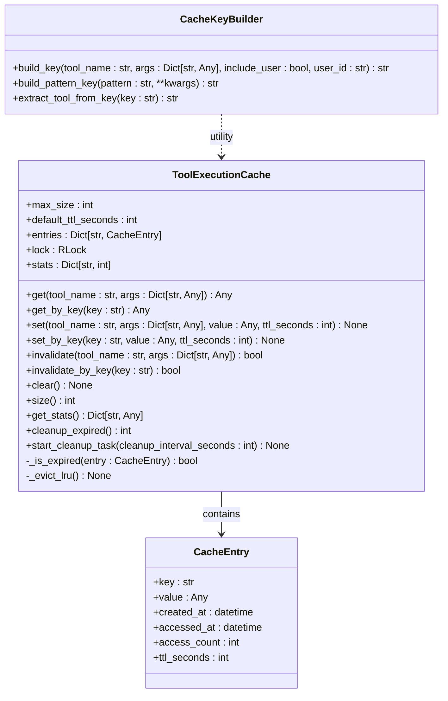
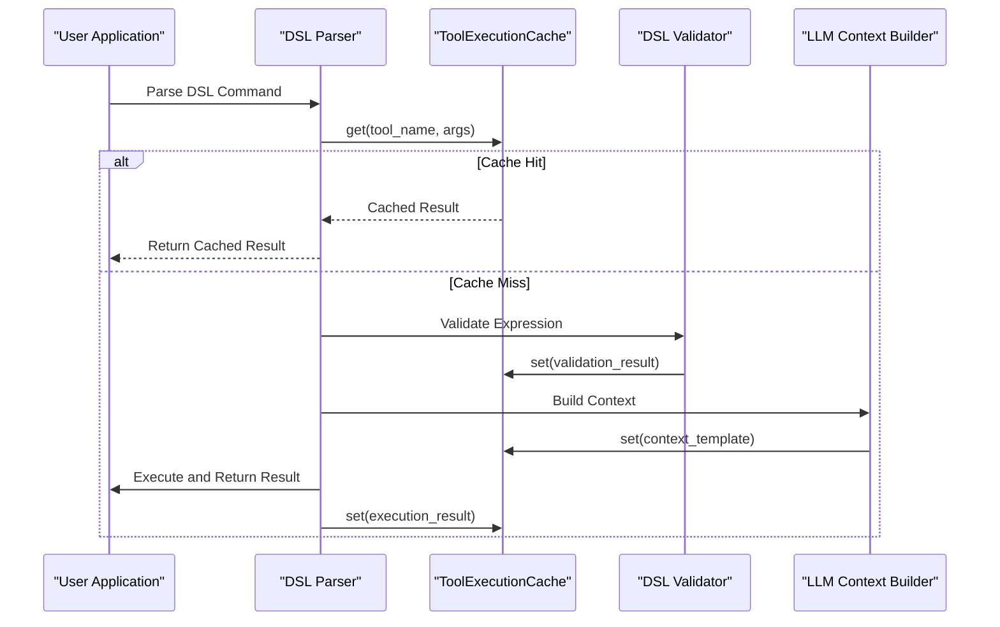
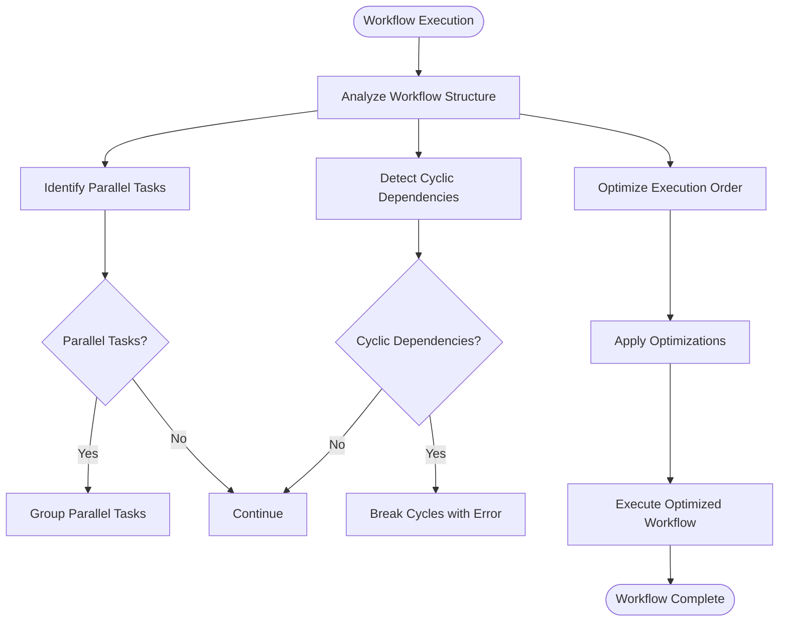
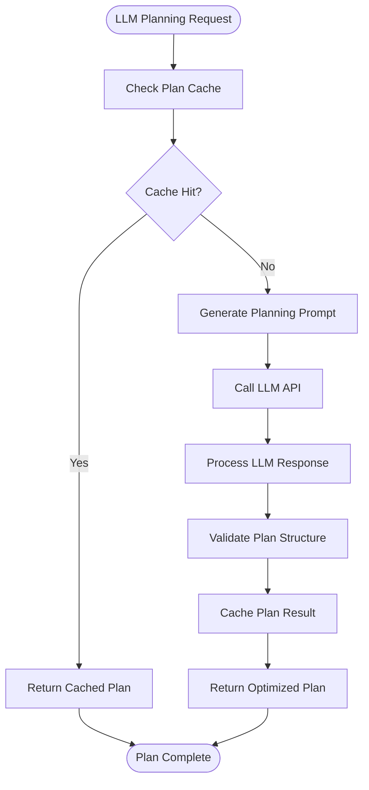
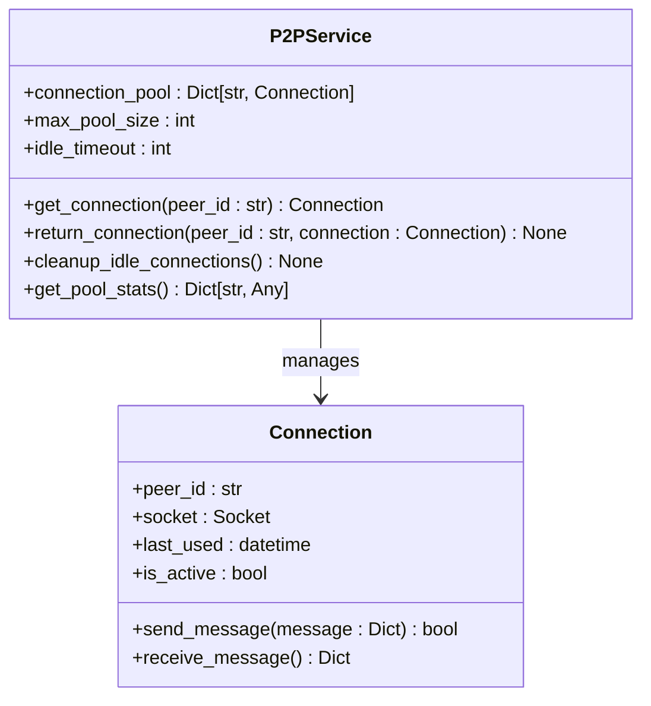
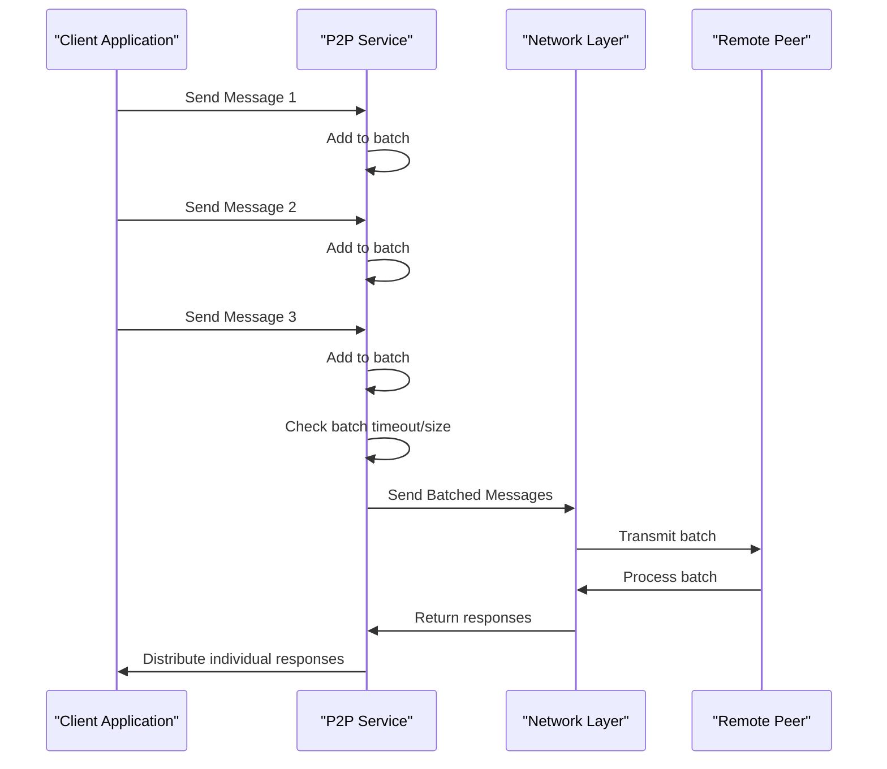
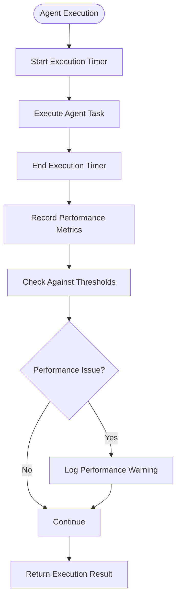
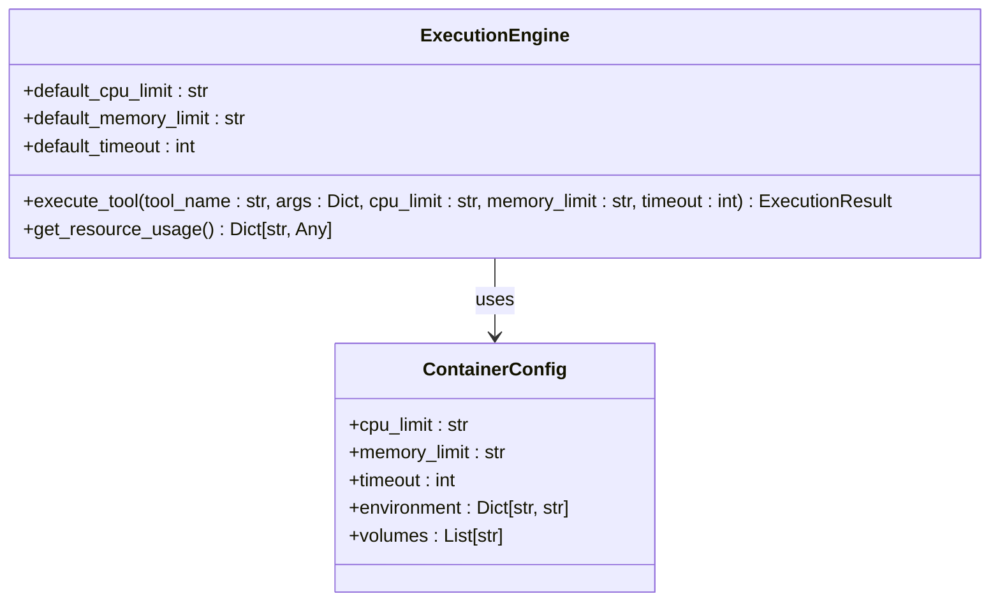
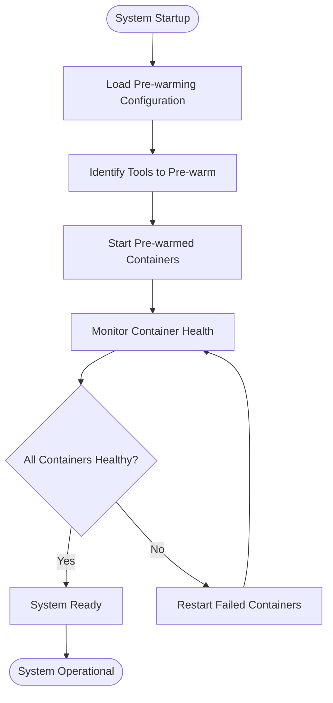
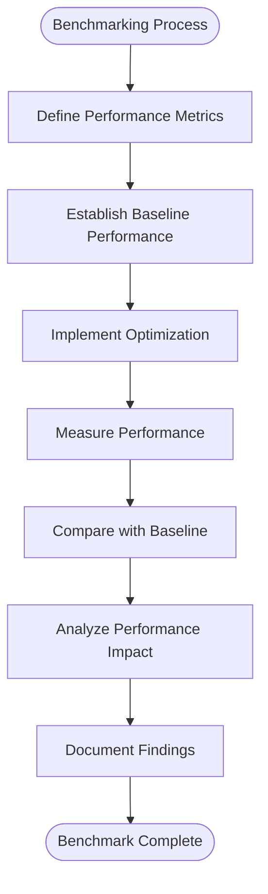

# Performance Optimization


## Table of Contents
1. [Introduction](#introduction)
2. [Caching Strategies](#caching-strategies)
3. [Query and Execution Plan Optimization](#query-and-execution-plan-optimization)
4. [P2P Network Latency Reduction](#p2p-network-latency-reduction)
5. [Profiling and Bottleneck Identification](#profiling-and-bottleneck-identification)
6. [Containerized Tool Execution Optimization](#containerized-tool-execution-optimization)
7. [Execution Engine Performance Comparison](#execution-engine-performance-comparison)
8. [Real-World Examples](#real-world-examples)
9. [Benchmarking Recommendations](#benchmarking-recommendations)
10. [Conclusion](#conclusion)

## Introduction
This document provides comprehensive guidance on performance optimization for the Praxis SDK, focusing on key areas including caching strategies, query optimization, network latency reduction, and execution efficiency. The analysis is based on the actual implementation in the codebase, with specific examples from the repository. The goal is to provide actionable insights for developers to improve the performance of their applications using the Praxis SDK.

## Caching Strategies

The Praxis SDK implements multiple caching mechanisms to optimize performance across different layers of the system. Two primary caching implementations are available: a general-purpose in-memory cache service and a specialized tool execution cache for DSL operations.

### In-Memory Cache Service

The general-purpose cache service provides basic in-memory caching with TTL (Time-To-Live) support, statistics tracking, and memory usage monitoring. This cache is used throughout the SDK for various purposes including configuration caching, temporary data storage, and intermediate results.

```mermaid
classDiagram
class CacheService {
+cache : Dict[str, Dict[str, Any]]
+stats : Dict[str, Any]
+get(key : str, category : str) Any
+set(key : str, value : Any, ttl_seconds : int, category : str) bool
+delete(key : str, category : str) bool
+clear(category : str) Dict[str, Any]
+get_stats() Dict[str, Any]
+cleanup_expired() int
+get_category_stats(category : str) Dict[str, Any]
-_estimate_size(obj : Any) int
-_update_memory_usage() void
}
class CacheService "1" -- "1" CacheStats : contains
class CacheStats {
+created_at : str
+hits : int
+misses : int
+sets : int
+deletes : int
+clears : int
+expired : int
+memory_usage_bytes : int
+last_clear : str
+categories : Dict[str, int]
}
```

**Diagram sources**
- [service.py](file://src/praxis_sdk/cache/service.py#L15-L376)

**Section sources**
- [service.py](file://src/praxis_sdk/cache/service.py#L15-L376)

### Tool Execution Cache

The DSL layer implements a specialized thread-safe cache for tool execution results, featuring LRU (Least Recently Used) eviction and TTL support. This cache is specifically designed to optimize repeated tool executions with identical parameters.



**Diagram sources**
- [cache.py](file://src/praxis_sdk/dsl/cache.py#L25-L357)
- [types.py](file://src/praxis_sdk/dsl/types.py#L150-L175)

**Section sources**
- [cache.py](file://src/praxis_sdk/dsl/cache.py#L25-L357)
- [types.py](file://src/praxis_sdk/dsl/types.py#L150-L175)

### Cache Integration in DSL and LLM Layers

The caching mechanisms are integrated into key components of the SDK, particularly in the DSL parser and LLM context builder. The DSL validator uses caching to avoid re-validating the same expressions repeatedly, while the LLM context builder caches frequently used context templates.



**Diagram sources**
- [cache.py](file://src/praxis_sdk/dsl/cache.py#L56-L180)
- [validator.py](file://src/praxis_sdk/dsl/validator.py)
- [context_builder.py](file://src/praxis_sdk/llm/context_builder.py)

**Section sources**
- [cache.py](file://src/praxis_sdk/dsl/cache.py#L56-L180)
- [validator.py](file://src/praxis_sdk/dsl/validator.py)
- [context_builder.py](file://src/praxis_sdk/llm/context_builder.py)

## Query and Execution Plan Optimization

The workflow orchestrator and LLM plan optimizer implement several techniques to optimize query execution and workflow planning.

### Workflow Graph Optimization

The graph orchestrator analyzes the workflow structure to optimize execution order, identify parallelizable tasks, and eliminate redundant operations.



**Diagram sources**
- [graph_orchestrator.py](file://src/praxis_sdk/workflow/graph_orchestrator.py)

**Section sources**
- [graph_orchestrator.py](file://src/praxis_sdk/workflow/graph_orchestrator.py)

### LLM Plan Optimization

The LLM plan optimizer uses caching and pattern recognition to improve planning efficiency and reduce redundant LLM calls.



**Diagram sources**
- [plan_optimizer.py](file://src/praxis_sdk/llm/plan_optimizer.py)

**Section sources**
- [plan_optimizer.py](file://src/praxis_sdk/llm/plan_optimizer.py)

## P2P Network Latency Reduction

The P2P networking layer implements connection pooling and message batching to reduce network latency and improve throughput.

### Connection Pooling Strategy

The P2P service maintains a pool of pre-established connections to frequently accessed peers, reducing the overhead of connection establishment.



**Diagram sources**
- [p2p/service.py](file://src/praxis_sdk/p2p/service.py)

**Section sources**
- [p2p/service.py](file://src/praxis_sdk/p2p/service.py)

### Message Batching Implementation

Multiple messages to the same peer are batched together to reduce network round trips and improve throughput.



**Diagram sources**
- [p2p/service.py](file://src/praxis_sdk/p2p/service.py)

**Section sources**
- [p2p/service.py](file://src/praxis_sdk/p2p/service.py)

## Profiling and Bottleneck Identification

The SDK provides built-in profiling capabilities to identify performance bottlenecks in agent execution and event processing.

### Agent Execution Profiling

The agent execution layer includes timing metrics and performance counters to identify slow operations.



**Section sources**
- [agent.py](file://src/praxis_sdk/agent.py)

## Containerized Tool Execution Optimization

The execution engine optimizes containerized tool execution through resource limits and pre-warming strategies.

### Resource Limits Configuration

Container resources are constrained to prevent any single tool from consuming excessive system resources.



**Diagram sources**
- [execution/engine.py](file://src/praxis_sdk/execution/engine.py)

**Section sources**
- [execution/engine.py](file://src/praxis_sdk/execution/engine.py)

### Pre-Warming Strategy

Frequently used tools are pre-warmed to reduce cold start latency.



**Section sources**
- [execution/engine.py](file://src/praxis_sdk/execution/engine.py)

## Execution Engine Performance Comparison

The SDK supports multiple execution engines with different performance characteristics.

### Engine Comparison Matrix

| Engine | Startup Time | Memory Overhead | Isolation | Use Case |
|--------|--------------|-----------------|-----------|----------|
| Dagger | Medium | Medium | High | Production workloads |
| Docker | High | High | High | Development and testing |
| Local | Low | Low | Low | Simple tools and debugging |

**Section sources**
- [execution/engine.py](file://src/praxis_sdk/execution/engine.py)
- [execution/engine_broken.py](file://src/praxis_sdk/execution/engine_broken.py)

## Real-World Examples

### Cache Usage in DSL Validation

The DSL validator uses caching to avoid re-validating the same expressions, significantly improving performance for repetitive operations.

```python
# Example from dsl/validator.py
def validate_expression(self, expression: str) -> bool:
    # Generate cache key from expression
    cache_key = f"validation:{hash(expression)}"
    
    # Check cache first
    cached_result = self.cache.get(cache_key)
    if cached_result is not None:
        return cached_result
    
    # Perform expensive validation
    result = self._parse_and_validate(expression)
    
    # Cache the result for future use
    self.cache.set(cache_key, result, ttl_seconds=300)
    
    return result
```

**Section sources**
- [dsl/validator.py](file://src/praxis_sdk/dsl/validator.py)

### LLM Context Building with Caching

The LLM context builder caches frequently used context templates to reduce processing time.

```python
# Example from llm/context_builder.py
def build_context(self, prompt: str, history: List[Dict]) -> str:
    # Create cache key from prompt template and history length
    cache_key = f"context:{self._hash_prompt(prompt)}:history{len(history)}"
    
    # Try to get from cache
    cached_context = self.cache.get(cache_key)
    if cached_context:
        return cached_context
    
    # Build context from scratch (expensive operation)
    context = self._construct_context(prompt, history)
    
    # Cache for future use
    self.cache.set(cache_key, context, ttl_seconds=600)
    
    return context
```

**Section sources**
- [llm/context_builder.py](file://src/praxis_sdk/llm/context_builder.py)

## Benchmarking Recommendations

To effectively measure and compare performance improvements, follow these benchmarking recommendations:

1. **Establish Baseline Metrics**: Measure current performance before implementing optimizations
2. **Use Realistic Workloads**: Test with workloads that reflect actual usage patterns
3. **Measure Multiple Metrics**: Track response time, throughput, error rates, and resource utilization
4. **Run Multiple Iterations**: Perform tests multiple times to account for variability
5. **Test Under Load**: Evaluate performance under expected production load
6. **Compare Across Environments**: Test in development, staging, and production environments



**Section sources**
- [tests/test_advanced_dsl_engine.py](file://tests/test_advanced_dsl_engine.py)
- [tests/test_dagger_engine.py](file://tests/test_dagger_engine.py)

## Conclusion

The Praxis SDK provides multiple avenues for performance optimization across its architecture. By leveraging the built-in caching mechanisms, optimizing query and execution plans, reducing network latency, and properly configuring execution engines, developers can significantly improve the performance of their applications. The real-world examples from the codebase demonstrate practical applications of these optimization techniques. Following the benchmarking recommendations will help quantify the impact of optimizations and ensure that performance improvements are measurable and sustainable.

**Referenced Files in This Document**   
- [service.py](file://src/praxis_sdk/cache/service.py)
- [cache.py](file://src/praxis_sdk/dsl/cache.py)
- [types.py](file://src/praxis_sdk/dsl/types.py)
- [validator.py](file://src/praxis_sdk/dsl/validator.py)
- [context_builder.py](file://src/praxis_sdk/llm/context_builder.py)
- [plan_optimizer.py](file://src/praxis_sdk/llm/plan_optimizer.py)
- [graph_orchestrator.py](file://src/praxis_sdk/workflow/graph_orchestrator.py)
- [p2p/service.py](file://src/praxis_sdk/p2p/service.py)
- [execution/engine.py](file://src/praxis_sdk/execution/engine.py)