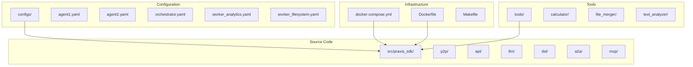
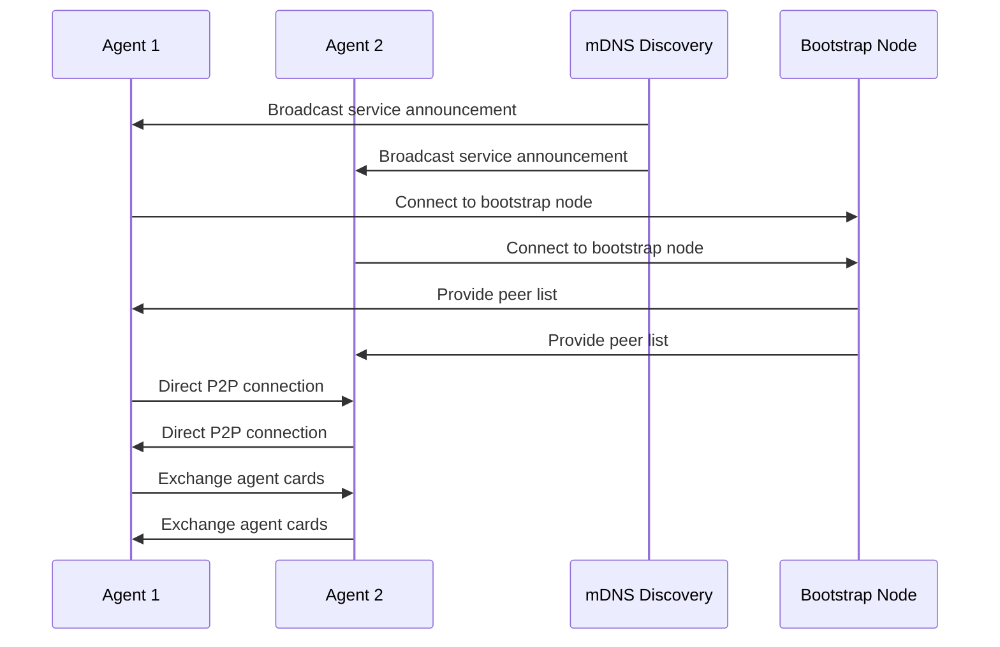
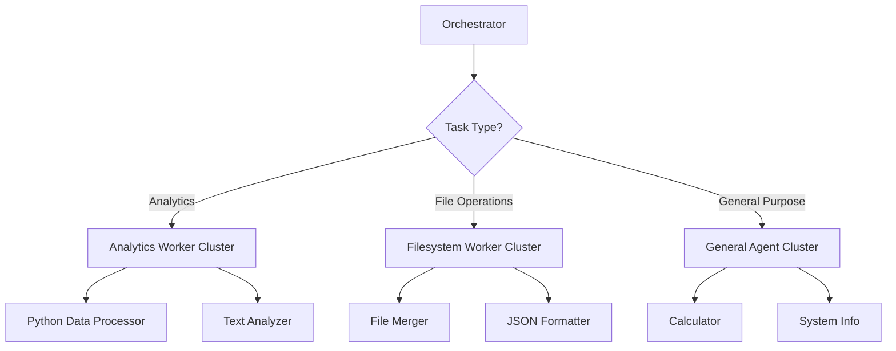
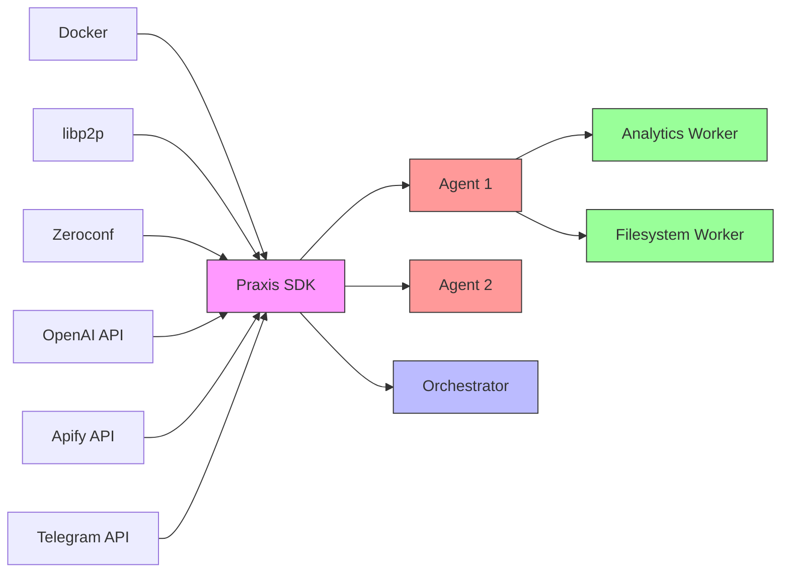
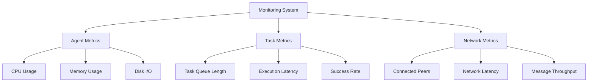

# Scaling and Clustering


## Table of Contents
1. [Introduction](#introduction)
2. [Project Structure](#project-structure)
3. [Core Components](#core-components)
4. [Architecture Overview](#architecture-overview)
5. [Detailed Component Analysis](#detailed-component-analysis)
6. [Dependency Analysis](#dependency-analysis)
7. [Performance Considerations](#performance-considerations)
8. [Troubleshooting Guide](#troubleshooting-guide)
9. [Conclusion](#conclusion)

## Introduction
This document provides comprehensive architectural documentation for scaling and clustering in the Praxis SDK. It details the patterns and mechanisms used for horizontal scaling of agent clusters, leader election, consensus, sharding, load balancing, high-availability deployments, state synchronization, and large-scale deployment strategies. The analysis is based on the repository structure, configuration files, and code implementation.

## Project Structure
The Praxis SDK project is organized into several key directories:
- **configs**: Contains YAML configuration files for different agents and workers
- **docker/mcp_filesystem**: Docker configuration for MCP filesystem server
- **src/praxis_sdk**: Main source code with submodules for various functionalities
- **tests**: Integration and unit tests
- **tools**: Pre-built tools with contract definitions
- Root-level files include Docker configurations, build scripts, and documentation

The structure follows a modular approach with clear separation of concerns, enabling scalable and maintainable distributed agent systems.



**Diagram sources**
- [agent1.yaml](file://configs/agent1.yaml)
- [docker-compose.yml](file://docker-compose.yml)

**Section sources**
- [agent1.yaml](file://configs/agent1.yaml)
- [docker-compose.yml](file://docker-compose.yml)

## Core Components
The Praxis SDK's scaling and clustering capabilities are built around several core components:
- **P2P Service**: Implements libp2p-based peer-to-peer networking for agent discovery and communication
- **Agent-to-Agent (A2A) Protocol**: Enables capability exchange and task delegation between agents
- **Distributed Configuration**: YAML-based configuration for agent-specific settings
- **Orchestration Engine**: Coordinates workflows across multiple agents
- **Load Balancing Mechanisms**: Distributes tasks based on agent capabilities and load

These components work together to create a resilient, scalable distributed agent system that can dynamically adapt to changing workloads and network conditions.

**Section sources**
- [agent1.yaml](file://configs/agent1.yaml)
- [agent2.yaml](file://configs/agent2.yaml)
- [src/praxis_sdk/p2p/service_fixed.py](file://src/praxis_sdk/p2p/service_fixed.py)

## Architecture Overview
The Praxis SDK implements a distributed agent architecture with peer-to-peer discovery and load distribution. Agents form a network where they can discover each other, exchange capabilities, and delegate tasks based on workload and specialization.

```mermaid
graph TB
subgraph "Agent Cluster"
A[Agent 1]
B[Agent 2]
C[Orchestrator]
D[Worker Analytics]
E[Worker Filesystem]
end
A < --> |P2P Discovery| B
A < --> |P2P Discovery| C
B < --> |P2P Discovery| C
C < --> |Task Delegation| D
C < --> |Task Delegation| E
A < --> |Load Distribution| D
B < --> |Load Distribution| E
subgraph "External Services"
F[OpenAI API]
G[Apify API]
H[Telegram API]
end
D --> F
A --> G
B --> H
style A fill:#f9f,stroke:#333
style B fill:#f9f,stroke:#333
style C fill:#bbf,stroke:#333,color:#fff
style D fill:#9f9,stroke:#333
style E fill:#9f9,stroke:#333
```

**Diagram sources**
- [agent1.yaml](file://configs/agent1.yaml)
- [agent2.yaml](file://configs/agent2.yaml)
- [docker-compose.yml](file://docker-compose.yml)

## Detailed Component Analysis

### P2P Discovery and Agent Coordination
The Praxis SDK implements a robust P2P discovery mechanism that enables agents to automatically discover and connect with each other in a distributed environment.



**Diagram sources**
- [discovery.py](file://src/praxis_sdk/p2p/discovery.py)
- [service_fixed.py](file://src/praxis_sdk/p2p/service_fixed.py)

**Section sources**
- [discovery.py](file://src/praxis_sdk/p2p/discovery.py#L0-L51)
- [service_fixed.py](file://src/praxis_sdk/p2p/service_fixed.py#L302-L333)

### Horizontal Scaling with P2P Discovery
The Praxis SDK enables horizontal scaling of agent clusters through P2P discovery and load distribution. Agents can be added or removed from the network dynamically, with automatic discovery and capability exchange.

#### Configuration for Horizontal Scaling
The `agent1.yaml` and `agent2.yaml` configuration files demonstrate how agents are configured for a clustered environment:

```yaml
p2p:
  enabled: true
  port: 4001
  secure: true
  rendezvous: "praxis-agents"
  enable_mdns: true
  enable_dht: true
  bootstrap_nodes:
    - "/dns4/agent2/tcp/4002/p2p/12D3KooWRWKrqkJtrU3RdXiNnJDDyQkwuQHTCWLNv7VYB68nkPgy"
  protocols:
    - "/praxis/mcp/1.0.0"
    - "/praxis/card/1.0.0"
    - "/praxis/tool/1.0.0"
    - "/praxis/a2a/1.0.0"
```

Key scaling parameters:
- **bootstrap_nodes**: Initial connection points for new agents joining the cluster
- **enable_mdns**: Enables mDNS-based discovery for local network agents
- **enable_dht**: Enables distributed hash table for global discovery
- **protocols**: Supported communication protocols for inter-agent communication

**Section sources**
- [agent1.yaml](file://configs/agent1.yaml#L100-L130)
- [agent2.yaml](file://configs/agent2.yaml#L80-L110)

### Leader Election and Consensus Mechanisms
The Praxis SDK implements a decentralized coordination model rather than traditional leader election. Instead of a single leader, it uses a consensus-based approach where agents coordinate workflows through capability exchange and task delegation.

#### Agent Card Exchange Protocol
Agents exchange "cards" that contain information about their capabilities, endpoints, and protocols:

```python
async def _exchange_cards_initiator(self, stream):
    """Initiate card exchange with a connected peer."""
    try:
        # Send our card
        local_card = self._create_local_card()
        await stream.write(json.dumps(local_card).encode())
        
        # Read peer's card
        data = await stream.read()
        peer_card = json.loads(data.decode())
        
        # Store peer card
        self._store_peer_card(stream.peer_id, peer_card)
        
        logger.info(f"Exchanged cards with {stream.peer_id}")
        
    except Exception as e:
        logger.warning(f"Failed to exchange cards with {stream.peer_id}: {e}")
```

This card exchange enables agents to build a network map and make informed decisions about task delegation without requiring a central coordinator.

**Section sources**
- [service_fixed.py](file://src/praxis_sdk/p2p/service_fixed.py#L404-L407)
- [agent1.yaml](file://configs/agent1.yaml#L250-L278)

### Sharding Strategies for Distributed Task Execution
The Praxis SDK implements sharding through specialized worker agents that handle specific types of tasks. This approach allows for horizontal scaling by adding more workers of specific types based on workload demands.

#### Worker Specialization
Configuration files show specialized workers:
- **worker_analytics.yaml**: Configured for data analysis tasks
- **worker_filesystem.yaml**: Configured for file operations
- **agent1.yaml** and **agent2.yaml**: General-purpose agents with different tool sets

This specialization enables sharding of tasks based on type, with the orchestrator routing tasks to the most appropriate agent based on capabilities advertised in agent cards.



**Diagram sources**
- [agent1.yaml](file://configs/agent1.yaml)
- [worker_analytics.yaml](file://configs/worker_analytics.yaml)
- [worker_filesystem.yaml](file://configs/worker_filesystem.yaml)

**Section sources**
- [agent1.yaml](file://configs/agent1.yaml#L20-L90)
- [worker_analytics.yaml](file://configs/worker_analytics.yaml)
- [worker_filesystem.yaml](file://configs/worker_filesystem.yaml)

### Load Balancing Approaches
The Praxis SDK implements load balancing through several mechanisms:

#### Dynamic Task Routing
The orchestrator uses network context to route tasks to appropriate agents:

```python
async def get_agent_recommendations(self, tool_name: str, requirements: dict):
    """Get agent recommendations for executing a tool."""
    # Get all available agents
    agents = await self.get_available_agents()
    
    # Filter agents that support the requested tool
    candidates = [
        agent for agent in agents 
        if tool_name in agent.get("tools", [])
    ]
    
    # Sort by current load and capabilities
    candidates.sort(key=lambda x: x.get("load", 0))
    
    return candidates
```

#### Configuration-Based Load Distribution
The `docker-compose.yml` file demonstrates load distribution through service configuration:

```yaml
services:
  praxis-agent-1:
    ports:
      - "8000:8000"
      - "8090:8090"
      - "4001:4001"
    environment:
      - PRAXIS_API__PORT=8000
      - PRAXIS_WEBSOCKET__PORT=8090
      - PRAXIS_P2P__PORT=4001
  
  praxis-agent-2:
    ports:
      - "8001:8001"
      - "8091:8091"
      - "4002:4002"
    environment:
      - PRAXIS_API__PORT=8001
      - PRAXIS_WEBSOCKET__PORT=8091
      - PRAXIS_P2P__PORT=4002
```

Each agent has dedicated ports for API, WebSocket, and P2P communication, enabling independent scaling and load distribution.

**Section sources**
- [docker-compose.yml](file://docker-compose.yml#L10-L154)
- [plan_optimizer.py](file://src/praxis_sdk/llm/plan_optimizer.py#L294-L331)

### High-Availability Deployments
The Praxis SDK supports high-availability deployments through redundancy and failover mechanisms.

#### Topology Design
The architecture supports multiple deployment patterns:
- **Active-Active**: Multiple agents handling requests simultaneously
- **Active-Passive**: Primary agent with backup agents
- **Distributed**: Geographically distributed agents

#### Failover and Redundancy
The P2P network provides inherent redundancy:
- Multiple bootstrap nodes for initial connection
- mDNS and DHT for discovery redundancy
- Automatic reconnection to available peers

```mermaid
graph TB
subgraph "Primary Region"
A[Agent 1]
B[Agent 2]
C[Load Balancer]
end
subgraph "Secondary Region"
D[Agent 3]
E[Agent 4]
end
C --> A
C --> B
A < --> D
B < --> E
D < --> E
style A fill:#f99,stroke:#333
style B fill:#f99,stroke:#333
style D fill:#9f9,stroke:#333
style E fill:#9f9,stroke:#333
```

**Diagram sources**
- [docker-compose.yml](file://docker-compose.yml)
- [agent1.yaml](file://configs/agent1.yaml)

**Section sources**
- [docker-compose.yml](file://docker-compose.yml#L1-L154)
- [agent1.yaml](file://configs/agent1.yaml#L100-L130)

### State Synchronization and Consistency
The Praxis SDK addresses state synchronization challenges through event-driven architecture and eventual consistency models.

#### Event-Driven State Management
Agents publish events when state changes occur:

```python
await event_bus.publish_data(
    EventType.TASK_STARTED,
    {
        "task_id": task_id,
        "tool_name": tool_name,
        "parameters": parameters
    },
    source="request_handlers",
    correlation_id=task_id
)
```

Other agents can subscribe to these events and update their local state accordingly, ensuring eventual consistency across the network.

#### Caching Strategy
The SDK implements caching to improve performance while maintaining consistency:

```yaml
llm:
  caching:
    enabled: true
    ttl: "300s"
    max_size: 1000
```

Cache entries have a time-to-live (TTL) to ensure stale data is eventually refreshed, balancing performance with data freshness.

**Section sources**
- [server.py](file://src/praxis_sdk/api/server.py#L648-L684)
- [agent1.yaml](file://configs/agent1.yaml#L230-L240)

## Dependency Analysis
The Praxis SDK has a well-defined dependency structure that enables modular scaling and deployment.



**Diagram sources**
- [docker-compose.yml](file://docker-compose.yml)
- [pyproject.toml](file://pyproject.toml)

**Section sources**
- [docker-compose.yml](file://docker-compose.yml#L1-L154)
- [pyproject.toml](file://pyproject.toml)

## Performance Considerations
The Praxis SDK's scaling architecture has several performance implications:

### Resource Allocation
- **Memory**: Each agent requires approximately 256-512MB RAM
- **CPU**: Lightweight agents use <0.5 CPU core under normal load
- **Network**: P2P discovery generates periodic network traffic

### Network Partitioning
The architecture handles network partitions gracefully:
- Local mDNS discovery works within partitions
- DHT provides eventual reconnection when partitions heal
- Task queues persist during disconnections

### Monitoring Strategies
Key metrics to monitor in large-scale deployments:
- **Peer connectivity**: Number of connected peers
- **Task queue length**: Backlog of pending tasks
- **Execution latency**: Time to complete tasks
- **Resource utilization**: CPU, memory, and network usage



**Diagram sources**
- [agent1.yaml](file://configs/agent1.yaml)
- [server.py](file://src/praxis_sdk/api/server.py)

**Section sources**
- [agent1.yaml](file://configs/agent1.yaml#L250-L278)
- [server.py](file://src/praxis_sdk/api/server.py#L374-L404)

## Troubleshooting Guide
Common issues and solutions for scaling Praxis SDK deployments:

### Agent Discovery Failures
**Symptoms**: Agents cannot find each other in the network
**Solutions**:
1. Verify bootstrap node addresses in configuration
2. Check network connectivity between agents
3. Ensure mDNS is enabled in Docker configuration
4. Validate P2P ports are exposed and not blocked

### Task Routing Issues
**Symptoms**: Tasks are not delegated to appropriate agents
**Solutions**:
1. Verify agent cards are being exchanged properly
2. Check tool name consistency across configurations
3. Validate network connectivity between orchestrator and workers
4. Review capability advertisements in agent configurations

### Performance Bottlenecks
**Symptoms**: High latency or task queue buildup
**Solutions**:
1. Scale out by adding more worker agents
2. Optimize task distribution based on agent load
3. Review resource allocation for containerized agents
4. Monitor network latency between agents

**Section sources**
- [test_p2p_connectivity.py](file://tests/integration/test_p2p_connectivity.py#L148-L197)
- [test_multi_agent_communication.py](file://tests/integration/test_multi_agent_communication.py#L218-L249)

## Conclusion
The Praxis SDK provides a comprehensive framework for scaling and clustering distributed agents. Its architecture combines P2P discovery, capability-based task delegation, and specialized worker nodes to create a flexible, resilient system that can adapt to varying workloads. The implementation supports horizontal scaling, high availability, and efficient load distribution through well-defined configuration and communication patterns. By leveraging Docker Compose and Kubernetes deployment patterns, the SDK enables both development and production-scale deployments with appropriate monitoring and troubleshooting capabilities.

**Referenced Files in This Document**   
- [agent1.yaml](file://configs/agent1.yaml)
- [agent2.yaml](file://configs/agent2.yaml)
- [docker-compose.yml](file://docker-compose.yml)
- [service_fixed.py](file://src/praxis_sdk/p2p/service_fixed.py)
- [discovery.py](file://src/praxis_sdk/p2p/discovery.py)
- [orchestrator.py](file://src/praxis_sdk/dsl/orchestrator.py)
- [server.py](file://src/praxis_sdk/api/server.py)
- [plan_optimizer.py](file://src/praxis_sdk/llm/plan_optimizer.py)
- [parser.py](file://src/praxis_sdk/dsl/parser.py)