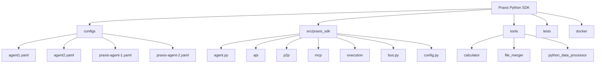
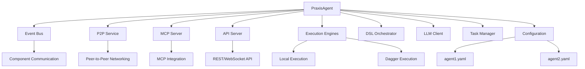
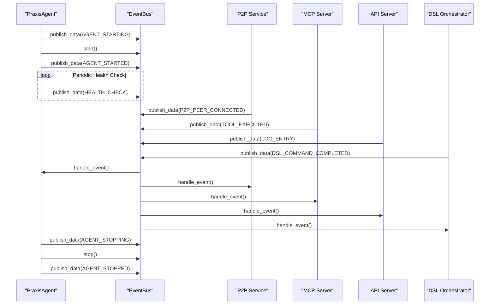
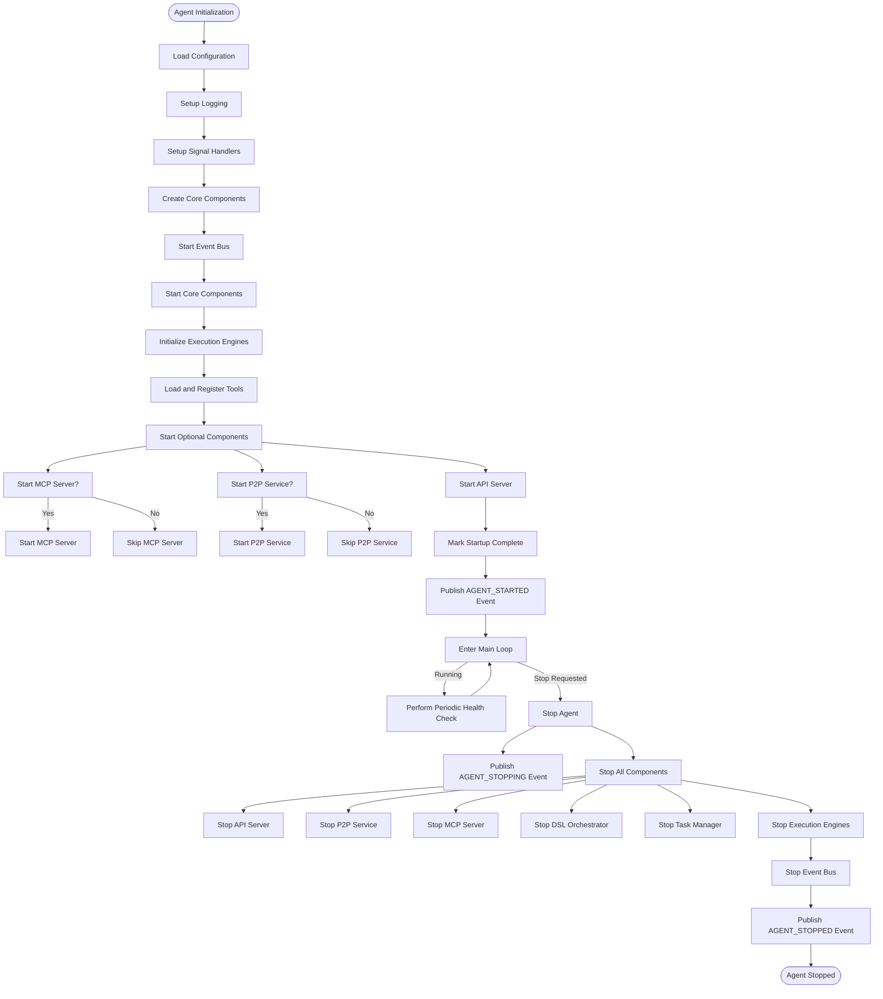
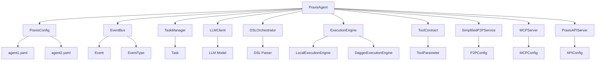

# Agent System

## Table of Contents
1. [Introduction](#introduction)
2. [Project Structure](#project-structure)
3. [Core Components](#core-components)
4. [Architecture Overview](#architecture-overview)
5. [Detailed Component Analysis](#detailed-component-analysis)
6. [Dependency Analysis](#dependency-analysis)
7. [Performance Considerations](#performance-considerations)
8. [Troubleshooting Guide](#troubleshooting-guide)
9. [Conclusion](#conclusion)

## Introduction
The PraxisAgent component serves as the central coordinator within the Praxis Python SDK, orchestrating interactions between various subsystems including P2P networking, MCP integration, execution engines, and API services. This document provides a comprehensive architectural overview of the agent, detailing its implementation of the Component Coordinator pattern, lifecycle management, event-driven communication, and extensibility mechanisms. The agent acts as the primary entry point for the system, managing the initialization, coordination, and graceful shutdown of all integrated components while providing a unified interface for external interaction.

## Project Structure
The Praxis Python SDK follows a modular structure with clearly defined component directories. The agent system is primarily located in the `src/praxis_sdk` directory, with configuration files in the `configs` directory and integration tools in the `tools` directory. The core agent functionality is implemented in `agent.py`, while supporting components are organized into specialized modules for API, P2P, MCP, execution, and other subsystems.

**Diagram sources**
- [agent.py](file://src/praxis_sdk/agent.py)
- [config.py](file://src/praxis_sdk/config.py)

## Core Components
The PraxisAgent class is the central component that coordinates all subsystems within the Praxis Python SDK. It implements a Component Coordinator pattern, managing the lifecycle of various services and ensuring proper initialization and shutdown sequences. The agent integrates with an event bus for real-time communication, manages execution engines for tool execution, and provides API endpoints for external interaction. Key responsibilities include component lifecycle management, health monitoring, dependency injection, and serving as the central point for tool registration and execution.

**Section sources**
- [agent.py](file://src/praxis_sdk/agent.py#L34-L1057)

## Architecture Overview
The PraxisAgent implements a centralized coordination architecture where the agent serves as the orchestrator for all subsystems. The architecture follows a layered approach with clear separation of concerns, where the agent manages core components, optional services, and execution engines. Communication between components occurs primarily through an event bus, enabling loose coupling and asynchronous processing. The agent also provides API endpoints for external interaction and supports P2P networking for distributed agent communication.

**Diagram sources**
- [agent.py](file://src/praxis_sdk/agent.py#L34-L1057)
- [bus.py](file://src/praxis_sdk/bus.py#L0-L367)

## Detailed Component Analysis

### PraxisAgent Class Analysis
The PraxisAgent class serves as the central coordinator for the entire system, managing the lifecycle and interaction of all subsystems. It implements the Component Coordinator pattern, where it is responsible for initializing, starting, and stopping all integrated components in the correct order. The agent maintains the overall system state and provides a unified interface for external interaction while ensuring proper dependency management between components.

#### For Object-Oriented Components:

```mermaid
classDiagram
class PraxisAgent {
-config : PraxisConfig
-agent_name : str
-_running : bool
-_startup_complete : bool
-_shutdown_in_progress : bool
-_health_status : Dict[str, bool]
+event_bus : EventBus
+task_manager : TaskManager
+llm_client : LLMClient
+dsl_orchestrator : DSLOrchestrator
+p2p_service : Optional[SimplifiedP2PService]
+mcp_server : Optional[MCPServer]
+api_server : Optional[PraxisAPIServer]
+a2a_protocol : Optional[A2AProtocolHandler]
+execution_engines : Dict[EngineType, ExecutionEngine]
+tool_contracts : Dict[str, ToolContract]
+__init__(config : Optional[PraxisConfig], agent_name : str)
+start() void
+stop() void
+get_agent_card() Dict[str, Any]
+get_available_tools() List[Dict[str, Any]]
+get_peer_id() Optional[str]
+get_listen_addresses() List[str]
+dispatch_a2a_request(request : Dict[str, Any]) Dict[str, Any]
+execute_dsl_command(command : str, context : Optional[Dict[str, Any]]) Dict[str, Any]
+invoke_tool(tool_name : str, arguments : Dict[str, Any]) Dict[str, Any]
+is_healthy() bool
+get_status() Dict[str, Any]
+register_tool_contract(contract : ToolContract) void
}
class EventBus {
+start() void
+stop() void
+publish(event : Event) void
+subscribe(event_type : EventType, handler : HandlerType) void
}
class TaskManager {
+start() void
+stop() void
}
class LLMClient {
+initialize() void
}
class DSLOrchestrator {
+start() void
+stop() void
+execute_command(command : str, context : Dict[str, Any]) Dict[str, Any]
}
class SimplifiedP2PService {
+start() void
+stop() void
+get_peer_id() str
+get_listen_addresses() List[str]
}
class MCPServer {
+start() void
+stop() void
+invoke_tool(tool_name : str, arguments : Dict[str, Any]) Dict[str, Any]
}
class PraxisAPIServer {
+run() void
}
class A2AProtocolHandler {
+handle_request(request : Dict[str, Any]) Dict[str, Any]
}
class ExecutionEngine {
+execute(contract : ToolContract, args : Dict[str, Any], timeout : Optional[int]) ExecutionResult
+cleanup() void
}
class ToolContract {
+name : str
+description : str
+parameters : List[ToolParameter]
+engine : EngineType
+engine_spec : Dict[str, Any]
}
PraxisAgent --> EventBus : "uses"
PraxisAgent --> TaskManager : "uses"
PraxisAgent --> LLMClient : "uses"
PraxisAgent --> DSLOrchestrator : "uses"
PraxisAgent --> SimplifiedP2PService : "manages"
PraxisAgent --> MCPServer : "manages"
PraxisAgent --> PraxisAPIServer : "manages"
PraxisAgent --> A2AProtocolHandler : "uses"
PraxisAgent --> ExecutionEngine : "manages"
PraxisAgent --> ToolContract : "registers"
```

**Diagram sources**
- [agent.py](file://src/praxis_sdk/agent.py#L34-L1057)

### Event Bus Integration Analysis
The PraxisAgent integrates with an event bus system to enable real-time communication between components. The event bus implements a publish-subscribe pattern, allowing components to emit events and subscribe to events of interest without direct coupling. This decoupled communication model enables asynchronous processing and facilitates the implementation of reactive system behavior. The agent uses the event bus extensively for lifecycle management, status updates, and inter-component coordination.

#### For API/Service Components:

**Diagram sources**
- [agent.py](file://src/praxis_sdk/agent.py#L34-L1057)
- [bus.py](file://src/praxis_sdk/bus.py#L0-L367)

### Initialization and Lifecycle Management Analysis
The PraxisAgent implements a comprehensive lifecycle management system that handles the startup, operation, and shutdown of all subsystems. The initialization sequence follows a specific order to ensure proper dependency resolution, with core components starting before optional services. The agent also implements graceful shutdown procedures and signal handling to ensure clean termination of all services.

#### For Complex Logic Components:

**Diagram sources**
- [agent.py](file://src/praxis_sdk/agent.py#L34-L1057)

## Dependency Analysis
The PraxisAgent has a complex dependency structure, serving as the central hub that connects all subsystems. The agent depends on configuration data to determine which components to initialize and how to configure them. It maintains direct dependencies on core services like the event bus, task manager, and LLM client, while managing optional dependencies on P2P, MCP, and API services based on configuration. The agent also depends on execution engines for tool execution and maintains a registry of tool contracts that define the available functionality.

**Diagram sources**
- [agent.py](file://src/praxis_sdk/agent.py#L34-L1057)
- [config.py](file://src/praxis_sdk/config.py#L0-L411)

## Performance Considerations
The PraxisAgent is designed with performance and scalability in mind, implementing several optimization strategies. The agent uses asynchronous programming with asyncio and trio to handle concurrent operations efficiently. Execution engines are managed in a pool to avoid the overhead of repeated initialization. The event bus implements a buffered channel system to handle high volumes of events without blocking. The agent also includes periodic health checks and performance monitoring to identify potential bottlenecks. Resource management is handled through proper cleanup procedures during shutdown and exception handling to prevent resource leaks.

## Troubleshooting Guide
When troubleshooting issues with the PraxisAgent, start by checking the agent's health status through the get_status() method or the /health API endpoint. Common issues include configuration errors, missing dependencies, and network connectivity problems. For P2P connectivity issues, verify that the keystore files exist and that the port is not blocked by a firewall. For MCP integration problems, ensure that external endpoints are correctly configured and accessible. Execution engine failures often relate to Docker or Dagger installation issues, so verify that these dependencies are properly installed. The agent's logging system provides detailed information about startup, operation, and error conditions, which can be invaluable for diagnosing issues.

**Section sources**
- [agent.py](file://src/praxis_sdk/agent.py#L34-L1057)
- [bus.py](file://src/praxis_sdk/bus.py#L0-L367)

## Conclusion
The PraxisAgent component serves as the central nervous system of the Praxis Python SDK, providing a robust and extensible framework for coordinating distributed agent systems. Through its implementation of the Component Coordinator pattern, the agent effectively manages the lifecycle of various subsystems while maintaining loose coupling through event-driven communication. The architecture supports both local execution and distributed P2P networking, making it suitable for a wide range of use cases from single-agent systems to complex multi-agent networks. The agent's design emphasizes configurability, extensibility, and resilience, providing a solid foundation for building intelligent agent-based applications.

**Referenced Files in This Document**   
- [agent.py](file://src/praxis_sdk/agent.py)
- [bus.py](file://src/praxis_sdk/bus.py)
- [config.py](file://src/praxis_sdk/config.py)
- [p2p/service_simplified.py](file://src/praxis_sdk/p2p/service_simplified.py)
- [mcp/server.py](file://src/praxis_sdk/mcp/server.py)
- [api/server.py](file://src/praxis_sdk/api/server.py)