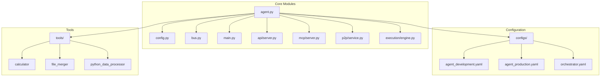
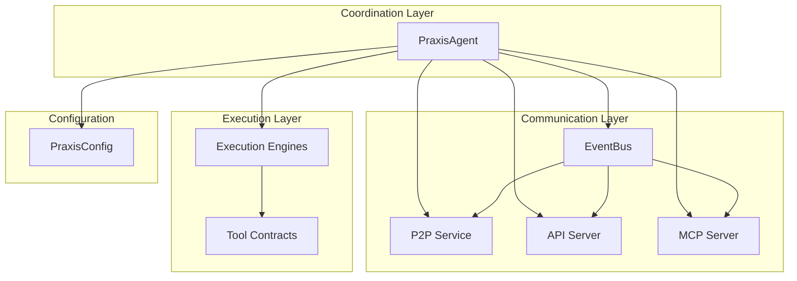
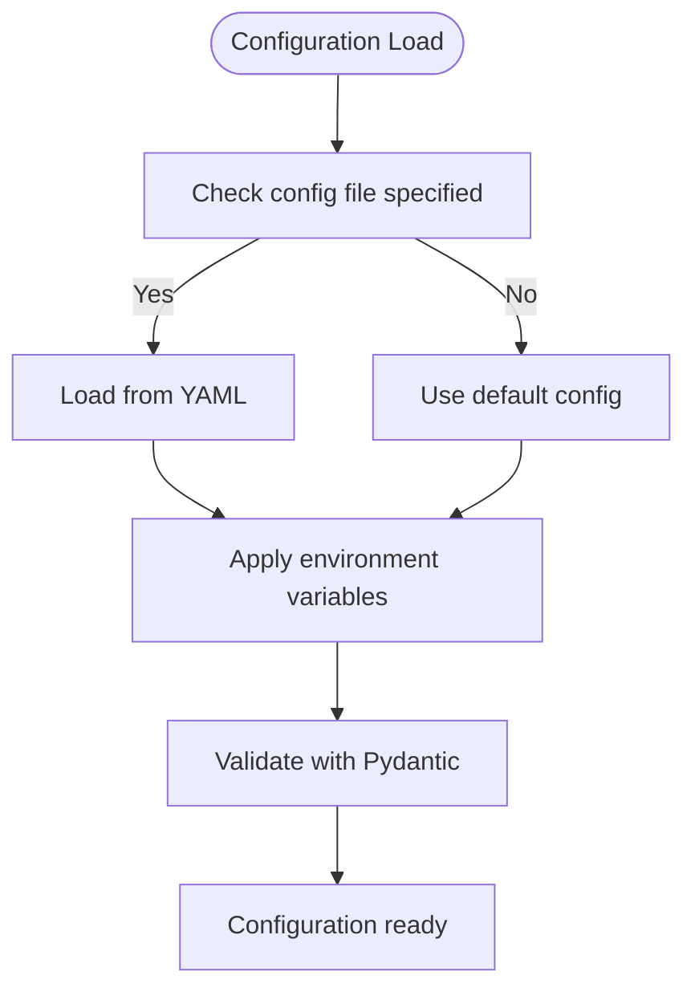
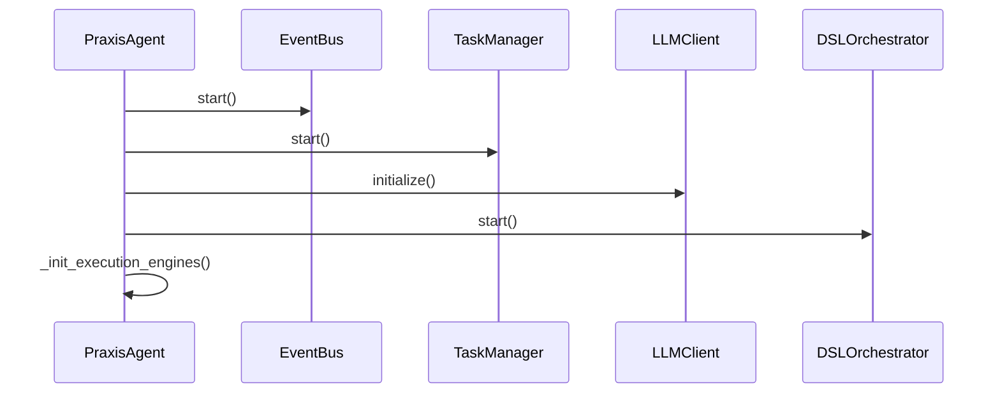
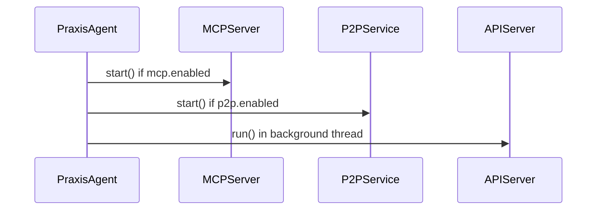
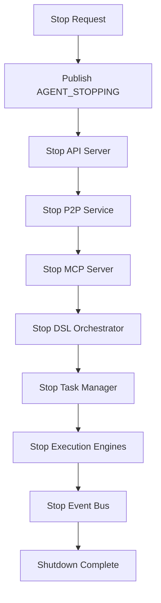
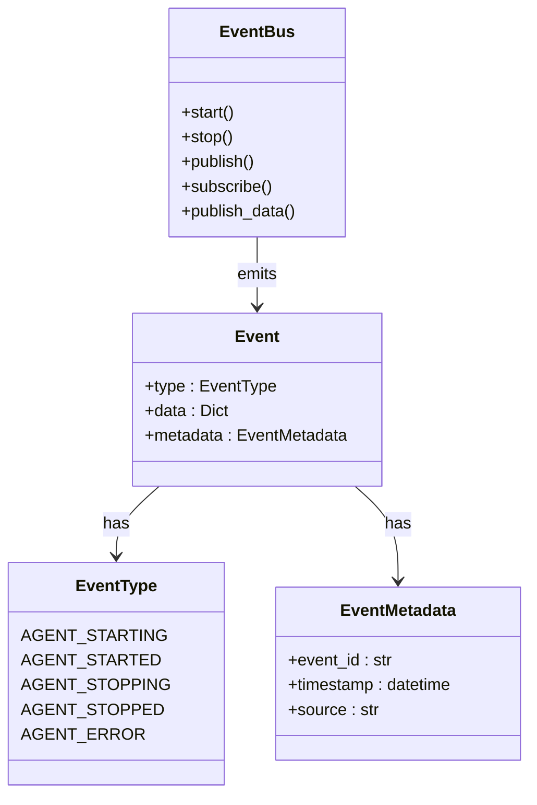
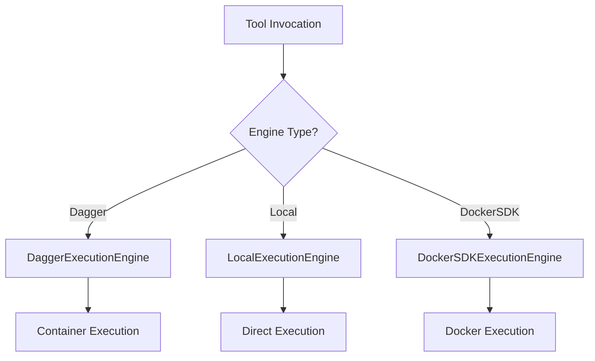
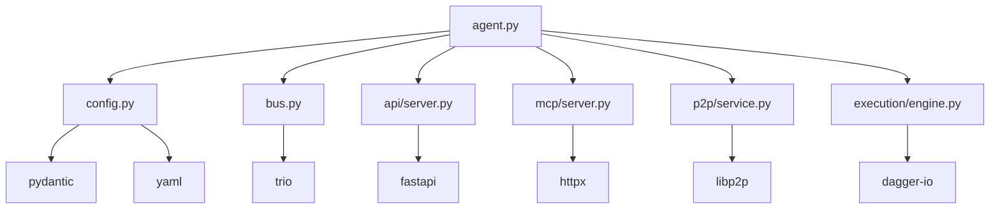

# Agent Lifecycle Management


## Table of Contents
1. [Introduction](#introduction)
2. [Project Structure](#project-structure)
3. [Core Components](#core-components)
4. [Architecture Overview](#architecture-overview)
5. [Detailed Component Analysis](#detailed-component-analysis)
6. [Dependency Analysis](#dependency-analysis)
7. [Performance Considerations](#performance-considerations)
8. [Troubleshooting Guide](#troubleshooting-guide)
9. [Conclusion](#conclusion)

## Introduction
The Praxis Python SDK provides a distributed agent platform with robust lifecycle management for autonomous agents. This document details the initialization, startup, graceful shutdown, and restart procedures of the `PraxisAgent`, focusing on asynchronous component coordination using Trio and asyncio, configuration injection via Pydantic models and YAML files, and event-driven communication through an event bus. The agent orchestrates P2P networking, MCP (Model Context Protocol), API services, and execution engines, ensuring reliable operation in production environments.

## Project Structure
The project follows a modular structure with clear separation of concerns. Core agent logic resides in `src/praxis_sdk`, with configuration, lifecycle management, and inter-component communication handled by dedicated modules. Configuration files in the `configs/` directory define agent behavior across environments.



**Diagram sources**
- [agent.py](file://src/praxis_sdk/agent.py#L0-L1088)
- [config.py](file://src/praxis_sdk/config.py#L0-L412)

**Section sources**
- [agent.py](file://src/praxis_sdk/agent.py#L0-L1088)
- [config.py](file://src/praxis_sdk/config.py#L0-L412)

## Core Components
The `PraxisAgent` class serves as the central coordinator, managing the lifecycle of all subsystems including P2P, MCP, API, and execution engines. It uses an event bus for inter-component communication and supports dynamic configuration via YAML files and environment variables.

Key components:
- **PraxisAgent**: Main agent orchestrator
- **EventBus**: Trio-based event system
- **PraxisConfig**: Configuration manager using Pydantic
- **ExecutionEngine**: Tool execution via Dagger, Docker, or local
- **MCPServer**: Model Context Protocol server integration
- **P2PService**: Peer-to-peer networking layer

**Section sources**
- [agent.py](file://src/praxis_sdk/agent.py#L0-L1088)
- [bus.py](file://src/praxis_sdk/bus.py#L0-L368)
- [config.py](file://src/praxis_sdk/config.py#L0-L412)

## Architecture Overview
The agent architecture follows a layered design with clear separation between coordination, communication, and execution layers. Components are initialized asynchronously and communicate via a central event bus.



**Diagram sources**
- [agent.py](file://src/praxis_sdk/agent.py#L0-L1088)
- [bus.py](file://src/praxis_sdk/bus.py#L0-L368)

## Detailed Component Analysis

### Agent Initialization and Configuration
The `PraxisAgent` is initialized with configuration injected via `PraxisConfig`, which can be loaded from YAML files or environment variables. Configuration uses Pydantic models for validation and type safety.

```python
def __init__(self, config: Optional[PraxisConfig] = None, agent_name: str = "orchestrator"):
    self.config = config or load_config()
    self.agent_name = agent_name
    self.agent_config = self._get_agent_config(agent_name)
```

Configuration supports hierarchical overrides:
1. Environment variables (PRAXIS_* prefix)
2. YAML configuration file
3. Default values in Pydantic models



**Diagram sources**
- [config.py](file://src/praxis_sdk/config.py#L0-L412)

**Section sources**
- [config.py](file://src/praxis_sdk/config.py#L0-L412)

### Startup Sequence
The agent startup sequence follows a strict order to ensure proper dependency resolution and service availability.

```python
async def start(self):
    if self._running:
        return
        
    await self.event_bus.start()
    await self._start_core_components()
    await self._start_optional_components()
    self._startup_complete = True
```

#### Core Components Startup
Core components are initialized first, establishing foundational services:



**Diagram sources**
- [agent.py](file://src/praxis_sdk/agent.py#L0-L1088)

#### Optional Components Startup
Optional components are started based on configuration flags:



**Diagram sources**
- [agent.py](file://src/praxis_sdk/agent.py#L0-L1088)

### Graceful Shutdown
The agent implements graceful shutdown with proper cleanup of all resources and services.

```python
async def stop(self):
    await self.event_bus.publish_data(EventType.AGENT_STOPPING, {...})
    await self._stop_components()
    await self._stop_execution_engines()
    await self.event_bus.stop()
```

Shutdown sequence:
1. Publish `AGENT_STOPPING` event
2. Stop API server
3. Stop P2P service
4. Stop MCP server
5. Stop DSL orchestrator
6. Stop task manager
7. Stop execution engines
8. Stop event bus



**Diagram sources**
- [agent.py](file://src/praxis_sdk/agent.py#L0-L1088)

### Event Bus Integration
The event bus propagates lifecycle events across components using Trio-based asynchronous communication.

```python
# Lifecycle events
EventType.AGENT_STARTING
EventType.AGENT_STARTED  
EventType.AGENT_STOPPING
EventType.AGENT_STOPPED
EventType.AGENT_ERROR
```

Components subscribe to events for coordination:

```python
async def start(self):
    await self.event_bus.publish_data(
        EventType.AGENT_STARTING,
        {"agent_name": self.agent_name},
        source=f"agent.{self.agent_name}"
    )
```



**Diagram sources**
- [bus.py](file://src/praxis_sdk/bus.py#L0-L368)

### Execution Engine Management
The agent manages multiple execution engines for tool execution, with Dagger as the primary engine.

```python
async def _init_execution_engines(self):
    # Initialize Local engine
    local_engine = LocalExecutionEngine()
    self.execution_engines[EngineType.LOCAL] = local_engine
    
    # Initialize Dagger engine
    try:
        dagger_available = await test_dagger_availability()
        if dagger_available:
            dagger_engine = DaggerExecutionEngine()
            self.execution_engines[EngineType.DAGGER] = dagger_engine
    except Exception as e:
        logger.error(f"Failed to initialize Dagger engine: {e}")
```



**Diagram sources**
- [agent.py](file://src/praxis_sdk/agent.py#L0-L1088)

## Dependency Analysis
The agent has a well-defined dependency graph with clear component boundaries.



**Diagram sources**
- [agent.py](file://src/praxis_sdk/agent.py#L0-L1088)
- [config.py](file://src/praxis_sdk/config.py#L0-L412)

**Section sources**
- [agent.py](file://src/praxis_sdk/agent.py#L0-L1088)
- [config.py](file://src/praxis_sdk/config.py#L0-L412)

## Performance Considerations
The agent is designed for efficient operation in production environments:

- **Asynchronous initialization**: Components start concurrently where possible
- **Resource pooling**: Execution engines maintain connection pools
- **Health monitoring**: Periodic health checks every 30 seconds
- **Memory management**: Weak references in event bus subscriptions
- **Logging optimization**: Configurable log levels and output formats

Best practices:
- Use environment variables for production configuration
- Enable file logging with rotation
- Monitor event bus statistics
- Set appropriate timeout values
- Use dedicated execution engines for resource-intensive tasks

## Troubleshooting Guide
Common issues and their solutions:

### Failed Component Initialization
**Symptom**: Agent fails to start with component-specific errors
**Solution**: 
- Check configuration file syntax
- Verify environment variables
- Ensure required services are running
- Review log output for specific error messages

```python
# Example: Dagger engine initialization failure
logger.error("❌ DAGGER ENGINE NOT AVAILABLE!")
logger.error("Fix: Ensure gql==3.5.0 is installed (not gql>=4.0.0)")
logger.error("Run: pip install --force-reinstall 'gql[all]==3.5.0'")
```

### Timeout Handling During Shutdown
**Symptom**: Agent takes too long to shut down
**Solution**:
- Configure `shutdown_timeout` in PraxisConfig
- Implement proper cleanup in custom components
- Ensure background threads are daemonized

```yaml
# In configuration file
shutdown_timeout: 30
```

### Recovery Strategies
**For failed tool execution**:
- Retry with exponential backoff
- Fall back to alternative execution engines
- Log detailed error information

**For network disconnections**:
- Implement reconnection logic
- Use heartbeat mechanisms
- Maintain connection state

**Section sources**
- [agent.py](file://src/praxis_sdk/agent.py#L0-L1088)
- [config.py](file://src/praxis_sdk/config.py#L0-L412)

## Conclusion
The PraxisAgent provides a robust framework for managing the lifecycle of autonomous agents in distributed systems. Its architecture emphasizes reliability, configurability, and observability through proper initialization, startup sequencing, graceful shutdown, and event-driven communication. By leveraging modern Python async patterns and well-structured configuration, the agent can be effectively deployed and managed in production environments. The integration of Trio for core coordination and asyncio for compatibility ensures both performance and flexibility.

**Referenced Files in This Document**   
- [agent.py](file://src/praxis_sdk/agent.py#L0-L1088)
- [config.py](file://src/praxis_sdk/config.py#L0-L412)
- [bus.py](file://src/praxis_sdk/bus.py#L0-L368)
- [main.py](file://src/praxis_sdk/main.py#L0-L130)