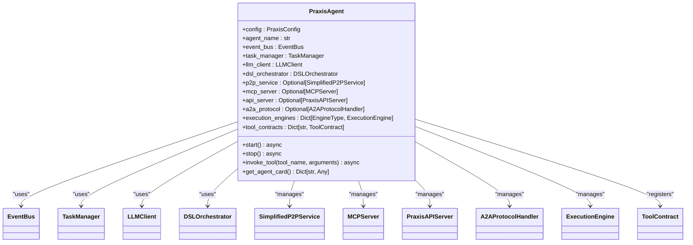
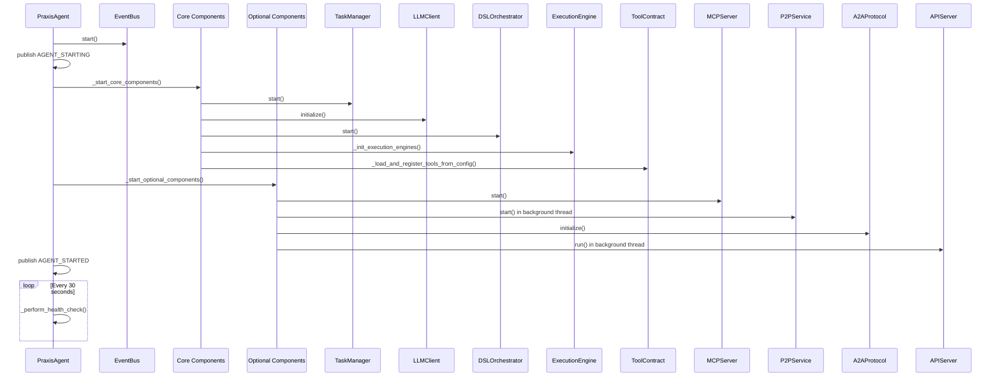
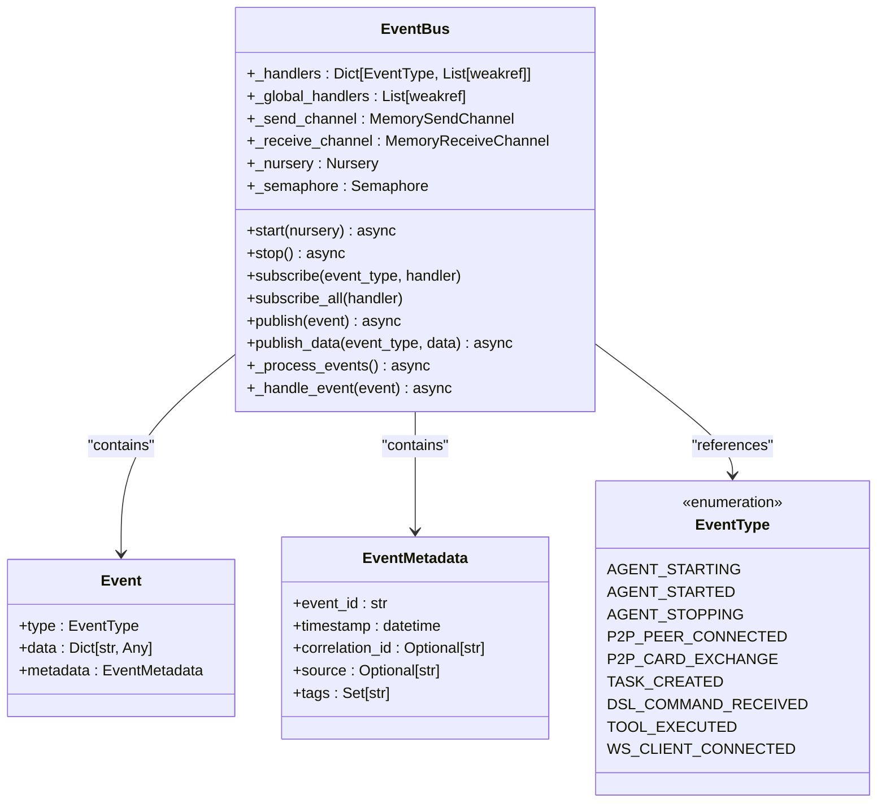
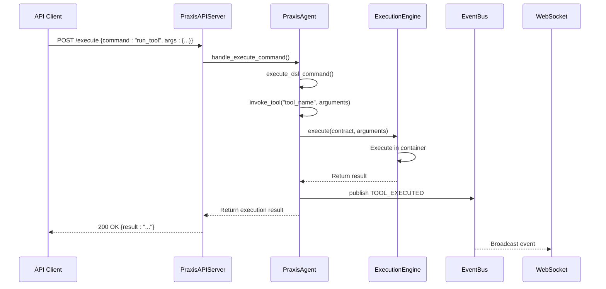

# Component Coordination


## Table of Contents
1. [Introduction](#introduction)
2. [Core Components](#core-components)
3. [PraxisAgent: Central Coordinator Pattern](#praxisagent-central-coordinator-pattern)
4. [Dependency Injection and Configuration Sharing](#dependency-injection-and-configuration-sharing)
5. [Startup Orchestration and Component Readiness](#startup-orchestration-and-component-readiness)
6. [Event-Driven Communication via EventBus](#event-driven-communication-via-eventbus)
7. [Workflow Sequence: API Request to Tool Execution](#workflow-sequence-api-request-to-tool-execution)
8. [Challenges in Asynchronous Lifecycle Management](#challenges-in-asynchronous-lifecycle-management)
9. [Extending Coordination Logic](#extending-coordination-logic)
10. [Conclusion](#conclusion)

## Introduction
This document details the component coordination architecture within the Praxis Python SDK, focusing on the PraxisAgent as the central orchestrator. The agent implements the Component Coordinator pattern to manage the lifecycle and interaction of key subsystems including P2PService, MCPServer, ExecutionEngine, and APIServer. Through dependency injection, shared configuration, and event-driven communication, the agent ensures consistent state and coordinated operation across distributed components. The design emphasizes decoupling, resilience, and extensibility, enabling complex workflows to be executed reliably across both local and networked environments.

## Core Components

The PraxisAgent serves as the central coordinator, managing the following core components:

- **EventBus**: A trio-based event bus enabling asynchronous, decoupled communication between components.
- **P2PService**: A libp2p-based service for peer-to-peer communication, running in a separate thread with trio event loop.
- **MCPServer**: An MCP (Model Context Protocol) server that exposes tools and integrates with external MCP services.
- **APIServer**: A FastAPI-based server providing REST and WebSocket endpoints for external interaction.
- **ExecutionEngine**: A pluggable engine system supporting local, containerized (Dagger), and remote execution.
- **A2AProtocolHandler**: Implements the Agent-to-Agent protocol for structured task and message exchange.

These components are initialized, started, and stopped in a controlled sequence by the PraxisAgent, ensuring proper dependency resolution and system readiness.

**Section sources**
- [src/praxis_sdk/agent.py](file://src/praxis_sdk/agent.py#L34-L1057)

## PraxisAgent: Central Coordinator Pattern

The PraxisAgent class implements the Component Coordinator pattern, acting as the central authority for system orchestration. It manages the lifecycle of all major subsystems, ensuring they are properly initialized, configured, and interconnected.



**Diagram sources**
- [src/praxis_sdk/agent.py](file://src/praxis_sdk/agent.py#L34-L1057)

The agent maintains references to all core components and exposes a unified API for external interaction. It handles signal-based graceful shutdown and performs periodic health checks to monitor component status.

## Dependency Injection and Configuration Sharing

The PraxisAgent uses dependency injection to share configuration and services across components. The `__init__` method accepts a `PraxisConfig` object which is then propagated to all subsystems.

```python
def __init__(self, config: Optional[PraxisConfig] = None, agent_name: str = "orchestrator"):
    self.config = config or load_config()
    self.agent_name = agent_name
    self.agent_config = self._get_agent_config(agent_name)
    
    # Core components
    self.event_bus = event_bus
    self.task_manager = TaskManager(self.event_bus)
    self.llm_client = LLMClient(self.config.llm)
    self.dsl_orchestrator = DSLOrchestrator(self, self.config)
```

Configuration is shared hierarchically:
- The agent loads the base configuration from YAML files
- Agent-specific configuration is extracted and used to customize behavior
- Subsystems receive the relevant portions of the configuration
- Runtime state (like peer IDs) is dynamically shared through method calls

The agent also injects itself into components that require access to other subsystems. For example, the APIServer is attached to the agent context to enable P2P operations:

```python
def attach_context(self, agent, event_bus_obj=None):
    """Attach running agent context for P2P operations and shared bus."""
    self._agent = agent
    initialize_request_handlers(agent=agent)
```

This pattern ensures that components can access shared resources without creating tight coupling.

**Section sources**
- [src/praxis_sdk/agent.py](file://src/praxis_sdk/agent.py#L34-L1057)
- [src/praxis_sdk/api/server.py](file://src/praxis_sdk/api/server.py#L100-L130)

## Startup Orchestration and Component Readiness

The PraxisAgent orchestrates startup in a specific sequence to ensure dependencies are met. The `start()` method follows a phased approach:



**Diagram sources**
- [src/praxis_sdk/agent.py](file://src/praxis_sdk/agent.py#L134-L350)

The startup sequence is:
1. **EventBus first**: All components depend on the event bus for communication
2. **Core components**: TaskManager, LLMClient, DSLOrchestrator, and ExecutionEngines
3. **Optional components**: MCP, P2P, A2A, and API servers
4. **API server last**: Ensures all services are available before accepting external requests

The agent uses background threads with trio_asyncio to run P2P and API servers, allowing them to operate with their own event loops while remaining coordinated with the main asyncio loop.

## Event-Driven Communication via EventBus

Components communicate through the EventBus using a publish-subscribe model. The EventBus supports both trio and asyncio contexts, enabling seamless interaction between components with different concurrency models.



**Diagram sources**
- [src/praxis_sdk/bus.py](file://src/praxis_sdk/bus.py#L1-L368)

Key event types include:
- **Agent lifecycle**: AGENT_STARTING, AGENT_STARTED, AGENT_STOPPING
- **P2P events**: P2P_PEER_CONNECTED, P2P_CARD_EXCHANGE
- **Task execution**: TASK_CREATED, TASK_COMPLETED
- **DSL/Workflow**: DSL_COMMAND_RECEIVED, DSL_COMMAND_COMPLETED
- **Tool execution**: TOOL_EXECUTED, TOOL_FAILED
- **WebSocket**: WS_CLIENT_CONNECTED, WS_MESSAGE_RECEIVED

Components publish events to signal state changes and subscribe to events to react to system activity. For example, when a tool is executed, the agent publishes a TOOL_EXECUTED event:

```python
await self.event_bus.publish_data(
    EventType.TOOL_EXECUTED,
    {
        "tool_name": contract.name,
        "engine": str(contract.engine),
        "success": result.success,
        "duration": result.duration,
        "error": result.error
    },
    source=f"agent.{self.agent_name}"
)
```

This decoupled communication enables components to remain independent while still coordinating effectively.

**Section sources**
- [src/praxis_sdk/bus.py](file://src/praxis_sdk/bus.py#L1-L368)
- [src/praxis_sdk/agent.py](file://src/praxis_sdk/agent.py#L870-L890)

## Workflow Sequence: API Request to Tool Execution

The following sequence diagram illustrates a typical workflow where an API request triggers tool execution through coordinated component interaction:



**Diagram sources**
- [src/praxis_sdk/api/server.py](file://src/praxis_sdk/api/server.py#L200-L250)
- [src/praxis_sdk/agent.py](file://src/praxis_sdk/agent.py#L750-L850)
- [src/praxis_sdk/execution/engine.py](file://src/praxis_sdk/execution/engine.py#L150-L250)

The workflow steps are:
1. Client sends an execution request to the API server
2. API server delegates to the agent's request handlers
3. Agent routes the command through the DSL orchestrator
4. Agent invokes the specified tool using its execution engine
5. Execution engine runs the tool in an isolated environment
6. Result is returned to the agent and published as an event
7. Agent returns the result to the API server
8. API server responds to the client
9. EventBus broadcasts the event to WebSocket clients

This sequence demonstrates how the coordinator pattern enables seamless integration between components while maintaining clear separation of concerns.

**Section sources**
- [src/praxis_sdk/api/server.py](file://src/praxis_sdk/api/server.py#L200-L250)
- [src/praxis_sdk/agent.py](file://src/praxis_sdk/agent.py#L750-L850)

## Challenges in Asynchronous Lifecycle Management

Managing asynchronous component lifecycles presents several challenges:

1. **Mixed concurrency models**: The system uses both asyncio and trio, requiring careful bridging with trio_asyncio
2. **Background thread management**: P2P and API servers run in background threads, complicating shutdown and error handling
3. **Resource cleanup**: Ensuring all resources are properly released during shutdown
4. **Health monitoring**: Detecting and recovering from component failures
5. **Startup ordering**: Ensuring dependencies are available before dependent components start

The PraxisAgent addresses these challenges through:

- **Trio-asyncio bridge**: Using `trio_asyncio.aio_as_trio` and `trio_as_aio` to call between event loops
- **Thread management**: Using daemon threads with proper cleanup in the `stop()` method
- **Graceful shutdown**: Stopping components in reverse order and handling signals
- **Health checks**: Periodic checks to detect component failures
- **Phased startup**: Starting components in dependency order

For example, when stopping the agent, components are stopped in reverse order:

```python
async def _stop_components(self):
    """Stop all components gracefully."""
    if self.api_server:  # First
        # No explicit stop - relies on process exit
        pass
    if self.p2p_service:  # Then P2P
        self.p2p_service.stop()  # Synchronous call
    if self.mcp_server:  # Then MCP
        await self.mcp_server.stop()
    # ... other components
    await self.event_bus.stop()  # Last
```

This careful ordering prevents resource leaks and ensures clean shutdown.

**Section sources**
- [src/praxis_sdk/agent.py](file://src/praxis_sdk/agent.py#L352-L450)
- [src/praxis_sdk/p2p/service.py](file://src/praxis_sdk/p2p/service.py#L250-L300)

## Extending Coordination Logic

The coordination logic can be extended for custom components or plugins through several mechanisms:

1. **Tool registration**: Custom tools can be registered with the agent
2. **Event subscription**: Components can subscribe to system events
3. **Component integration**: New components can be integrated into the startup/shutdown sequence

For example, a custom tool can be registered:

```python
async def create_custom_tool(self, shared_path: str = "/app/shared") -> ToolContract:
    """Create custom tool contract."""
    return ToolContract.create_dagger_tool(
        name="custom_analyzer",
        image="my-custom-image:latest",
        command=["python", "/app/custom.py"],
        mounts={shared_path: "/shared"},
        description="Custom analysis tool"
    )
```

Components can subscribe to events:

```python
# Subscribe to tool execution events
event_bus.subscribe(EventType.TOOL_EXECUTED, self._handle_tool_executed)
```

The agent's modular design allows new components to be added without modifying the core coordination logic, enabling extensibility while maintaining system stability.

**Section sources**
- [src/praxis_sdk/agent.py](file://src/praxis_sdk/agent.py#L1000-L1050)
- [src/praxis_sdk/bus.py](file://src/praxis_sdk/bus.py#L250-L300)

## Conclusion
The PraxisAgent effectively implements the Component Coordinator pattern to manage the complex interactions between P2P, MCP, API, and execution components. Through dependency injection, shared configuration, and event-driven communication, it ensures consistent state and coordinated operation across the system. The design successfully addresses the challenges of asynchronous lifecycle management and provides a robust foundation for extending functionality through custom components and plugins. This architecture enables reliable execution of complex workflows in both local and distributed environments.

**Referenced Files in This Document**   
- [src/praxis_sdk/agent.py](file://src/praxis_sdk/agent.py)
- [src/praxis_sdk/bus.py](file://src/praxis_sdk/bus.py)
- [src/praxis_sdk/execution/engine.py](file://src/praxis_sdk/execution/engine.py)
- [src/praxis_sdk/api/server.py](file://src/praxis_sdk/api/server.py)
- [src/praxis_sdk/mcp/server.py](file://src/praxis_sdk/mcp/server.py)
- [src/praxis_sdk/p2p/service.py](file://src/praxis_sdk/p2p/service.py)
- [src/praxis_sdk/a2a/protocol.py](file://src/praxis_sdk/a2a/protocol.py)