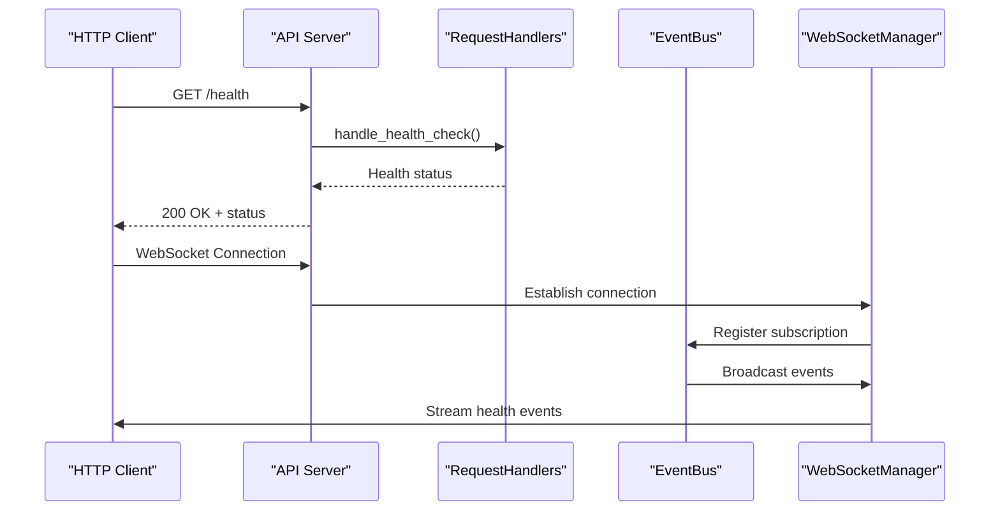
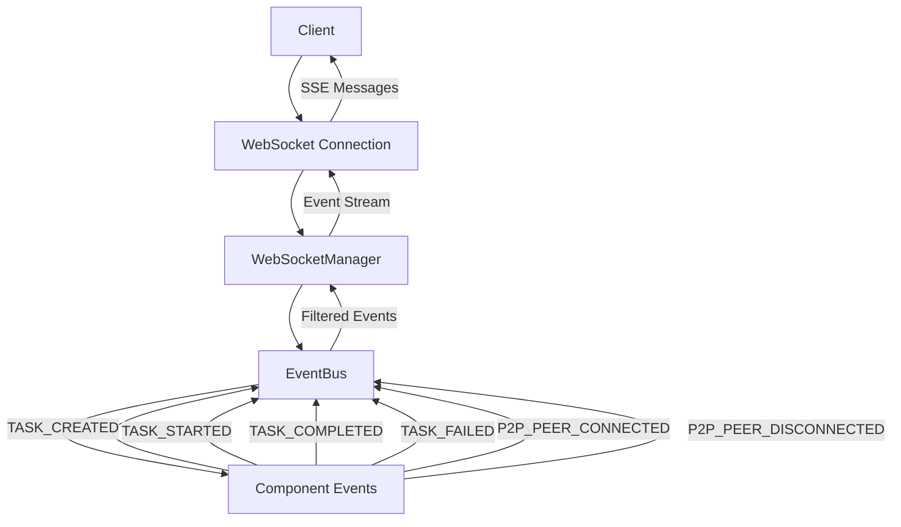

# Health Monitoring


## Table of Contents
1. [Health Check Endpoint Implementation](#health-check-endpoint-implementation)
2. [Event Bus Integration for Health Status](#event-bus-integration-for-health-status)
3. [Component Health Aggregation](#component-health-aggregation)
4. [WebSocket Event Streaming](#websocket-event-streaming)
5. [Failure Detection and Reporting](#failure-detection-and-reporting)
6. [External Monitoring Integration](#external-monitoring-integration)
7. [Custom Health Check Extension](#custom-health-check-extension)

## Health Check Endpoint Implementation

The PraxisAgent exposes its health status through a dedicated `/health` API endpoint implemented in the FastAPI server. This endpoint provides a comprehensive overview of the agent's operational status, configuration, and system metrics.

The health check endpoint is defined in the API server configuration and routes requests to the `RequestHandlers.handle_health_check()` method. This method returns a JSON response containing key health indicators:

```python
async def handle_health_check(self) -> Dict[str, Any]:
    """Handle health check requests."""
    self.stats["total_requests"] += 1
    self.stats["successful_requests"] += 1
    
    return {
        "status": "healthy",
        "agent": self.config.agents[0].name if self.config.agents else "praxis-agent",
        "version": "1.0.0",
        "timestamp": datetime.utcnow().isoformat() + "Z",
        "uptime_seconds": 0.0,
        "config": {
            "p2p_enabled": self.config.p2p.enabled,
            "llm_enabled": self.config.llm.api_key is not None,
            "tools_available": len(self.available_tools),
            "active_tasks": len([t for t in self.tasks.values() if t.status.state in [TaskState.SUBMITTED, TaskState.WORKING]])
        }
    }
```

The endpoint returns a structured response with the following key fields:
- **status**: Current health status ("healthy" when operational)
- **agent**: Agent name from configuration
- **version**: Agent version identifier
- **timestamp**: ISO 8601 timestamp of the health check
- **uptime_seconds**: Agent uptime (currently a placeholder)
- **config**: Configuration details including P2P status, LLM availability, tool count, and active task count

This endpoint serves as a liveness probe for container orchestration systems and provides immediate feedback on the agent's basic operational status.

**Section sources**
- [server.py](file://src/praxis_sdk/api/server.py#L72-L137)
- [handlers.py](file://src/praxis_sdk/api/handlers.py#L27-L64)

## Event Bus Integration for Health Status

The PraxisAgent uses a trio-based event bus system to propagate health status changes across components and to external systems. The event bus serves as the central nervous system for health monitoring, enabling real-time status updates and failure detection.



**Diagram sources**
- [server.py](file://src/praxis_sdk/api/server.py#L72-L137)
- [bus.py](file://src/praxis_sdk/bus.py#L323-L367)
- [websocket.py](file://src/praxis_sdk/api/websocket.py#L613-L646)

The event bus implementation includes comprehensive statistics tracking and WebSocket integration for real-time event streaming. When a health-related event occurs, it is published to the event bus, which then broadcasts it to all subscribed components and WebSocket clients.

Key event types relevant to health monitoring include:
- `AGENT_STARTING`, `AGENT_STARTED`, `AGENT_STOPPING`, `AGENT_STOPPED`
- `SYSTEM_ERROR`, `AGENT_ERROR`
- `P2P_PEER_CONNECTED`, `P2P_PEER_DISCONNECTED`
- `TASK_FAILED`, `TASK_CANCELLED`

The event bus maintains statistics on event processing, handler errors, and active connections, providing valuable insights into system health and performance.

**Section sources**
- [bus.py](file://src/praxis_sdk/bus.py#L53-L88)
- [bus.py](file://src/praxis_sdk/bus.py#L323-L367)

## Component Health Aggregation

Health status in the PraxisAgent is not monolithic but rather an aggregation of multiple component health indicators. The system monitors health across various subsystems including P2P networking, MCP (Multi-Component Processing), execution engines, and external dependencies.

The network health assessment is implemented in the LLM context builder, which calculates an overall health score based on multiple metrics:

```python
async def get_network_health(self) -> Dict[str, Any]:
    """
    Get comprehensive network health information.
    
    Returns:
        Network health metrics and status
    """
    
    try:
        context = await self.build_network_context()
        metrics = self._metrics_cache
        
        if not metrics:
            return {"status": "unknown", "reason": "No metrics available"}
        
        # Calculate health scores
        agent_health = min(metrics.active_agents / max(metrics.total_agents, 1), 1.0)
        connectivity_health = metrics.connectivity_score
        performance_health = max(0.0, 1.0 - (metrics.average_response_time / 5000.0))  # 5s = 0 health
        
        overall_health = (agent_health + connectivity_health + performance_health) / 3.0
        
        # Determine status
        if overall_health >= 0.8:
            status = "excellent"
        elif overall_health >= 0.6:
            status = "good"
        elif overall_health >= 0.4:
            status = "fair"
        else:
            status = "poor"
        
        return {
            "status": status,
            "overall_health": overall_health,
            "metrics": {
                "agent_health": agent_health,
                "connectivity_health": connectivity_health,
                "performance_health": performance_health,
                "active_agents": metrics.active_agents,
                "total_agents": metrics.total_agents,
                "average_response_time": metrics.average_response_time,
                "network_load": metrics.network_load
            },
            "recommendations": self._get_health_recommendations(overall_health, metrics)
        }
```

This implementation demonstrates a weighted approach to health assessment, combining agent availability, network connectivity, and performance metrics into a single overall health score. The system categorizes health into four tiers: excellent, good, fair, and poor, providing clear guidance on system status.

**Section sources**
- [context_builder.py](file://src/praxis_sdk/llm/context_builder.py#L228-L295)

## WebSocket Event Streaming

The PraxisAgent provides real-time health monitoring through WebSocket event streaming, allowing external systems to subscribe to health status changes as they occur. This push-based model enables immediate detection of state changes without the need for polling.



**Diagram sources**
- [websocket.py](file://src/praxis_sdk/api/websocket.py#L613-L646)
- [bus.py](file://src/praxis_sdk/bus.py#L323-L367)

The WebSocket manager acts as an intermediary between the event bus and connected clients, managing subscriptions and filtering events based on client preferences. Clients can subscribe to specific event types or receive all events, enabling flexible monitoring strategies.

Key WebSocket functionality includes:
- Connection management with automatic cleanup of disconnected clients
- Event filtering based on type, source, and tags
- Real-time broadcasting of health-related events
- Support for both individual and global event subscriptions

The system uses memory channels to decouple event publishing from delivery, ensuring that event processing does not block the main application flow. When a client disconnects, the connection is automatically cleaned up, preventing resource leaks.

**Section sources**
- [websocket.py](file://src/praxis_sdk/api/websocket.py#L613-L677)
- [bus.py](file://src/praxis_sdk/bus.py#L323-L367)

## Failure Detection and Reporting

The PraxisAgent implements comprehensive failure detection mechanisms to identify and report issues across its distributed architecture. The system monitors for common failure modes including unresponsive components, network partitions, and service degradation.

Failure detection is implemented through a combination of proactive health checks and reactive event monitoring:

1. **Heartbeat monitoring**: Components publish regular status updates that serve as heartbeats
2. **Timeout detection**: Operations with expected completion times are monitored for delays
3. **Event correlation**: Related events are correlated to identify cascading failures
4. **Statistical analysis**: Performance metrics are analyzed for anomalies

When a failure is detected, the system publishes appropriate events to the event bus:

```python
# Example failure detection pattern
async def _handle_event(self, event: Event) -> None:
    """Handle a single event."""
    async with self._semaphore:
        self.stats["events_processed"] += 1
        
        # ... handler execution ...
        
        # Handle errors
        except Exception as e:
            self.stats["handler_errors"] += 1
            logger.error(f"Error in event handler: {e}")
            
            # Publish failure event
            await event_bus.publish_data(
                EventType.SYSTEM_ERROR,
                {
                    "error": str(e),
                    "source": "event_handler",
                    "event_type": event.type.value
                },
                source="event_bus",
                correlation_id=event.metadata.correlation_id
            )
```

The system distinguishes between different types of failures:
- **Transient failures**: Temporary issues that may resolve automatically
- **Persistent failures**: Ongoing issues requiring intervention
- **Cascading failures**: Failures that affect multiple components
- **Partial failures**: Degraded operation rather than complete failure

Failure reports include contextual information such as timestamps, correlation IDs, and affected components, enabling effective troubleshooting and root cause analysis.

**Section sources**
- [bus.py](file://src/praxis_sdk/bus.py#L323-L367)
- [handlers.py](file://src/praxis_sdk/api/handlers.py#L27-L64)

## External Monitoring Integration

The PraxisAgent provides multiple integration points for external monitoring tools like Prometheus and Grafana, enabling comprehensive observability in production environments.

The `/stats` endpoint aggregates metrics from various system components:

```python
@app.get("/stats")
async def get_statistics():
    return {
        "api_gateway": api_gateway.get_stats(),
        "get_request_handlers()": get_request_handlers().get_stats(),
        "websocket_manager": websocket_manager.get_stats(),
        "event_bus": event_bus.get_stats(),
        "server": {
            "running": self._running,
            "config": {
                "environment": self.config.environment,
                "api_host": self.config.api.host,
                "api_port": self.config.api.port,
                "websocket_enabled": self.config.api.websocket_enabled,
                "p2p_enabled": self.config.p2p.enabled,
            }
        }
    }
```

This endpoint provides a centralized source of system metrics that can be scraped by monitoring tools. Key metrics include:
- Request rates and success/failure ratios
- Active WebSocket connections
- Event processing statistics
- System configuration details

For Prometheus integration, the system could expose metrics in the standard Prometheus text format, with appropriate labels and types. Grafana dashboards could then visualize these metrics, providing real-time insights into agent health and performance.

The event bus architecture also supports integration with logging systems, allowing health events to be forwarded to centralized logging solutions for long-term analysis and alerting.

**Section sources**
- [server.py](file://src/praxis_sdk/api/server.py#L72-L137)
- [bus.py](file://src/praxis_sdk/bus.py#L323-L367)

## Custom Health Check Extension

The PraxisAgent architecture supports extension of health checks with custom logic, allowing developers to implement domain-specific health assessments. The modular design enables integration of custom health probes without modifying core system components.

To implement custom health checks, developers can:
1. Subscribe to relevant events on the event bus
2. Implement custom health assessment logic
3. Publish health status updates
4. Expose custom metrics through the statistics endpoint

Example extension pattern:

```python
# Custom health check implementation
async def custom_health_monitor(event_bus):
    """Monitor custom health indicators."""
    
    def check_database_health(event):
        # Custom health logic
        if database_unresponsive():
            event_bus.publish_data(
                EventType.SYSTEM_ERROR,
                {"component": "database", "issue": "unresponsive"},
                source="health_monitor"
            )
    
    # Subscribe to relevant events
    event_bus.subscribe(EventType.TASK_STARTED, check_database_health)
    event_bus.subscribe(EventType.TASK_FAILED, check_database_health)
    
    # Periodic health checks
    while True:
        await asyncio.sleep(60)  # Check every minute
        perform_custom_health_check()
```

This extensibility ensures that the health monitoring system can adapt to specific deployment requirements and operational constraints, providing comprehensive coverage across all critical system components.

**Section sources**
- [bus.py](file://src/praxis_sdk/bus.py#L323-L367)
- [handlers.py](file://src/praxis_sdk/api/handlers.py#L27-L64)

**Referenced Files in This Document**   
- [handlers.py](file://src/praxis_sdk/api/handlers.py)
- [server.py](file://src/praxis_sdk/api/server.py)
- [bus.py](file://src/praxis_sdk/bus.py)
- [websocket.py](file://src/praxis_sdk/api/websocket.py)
- [context_builder.py](file://src/praxis_sdk/llm/context_builder.py)