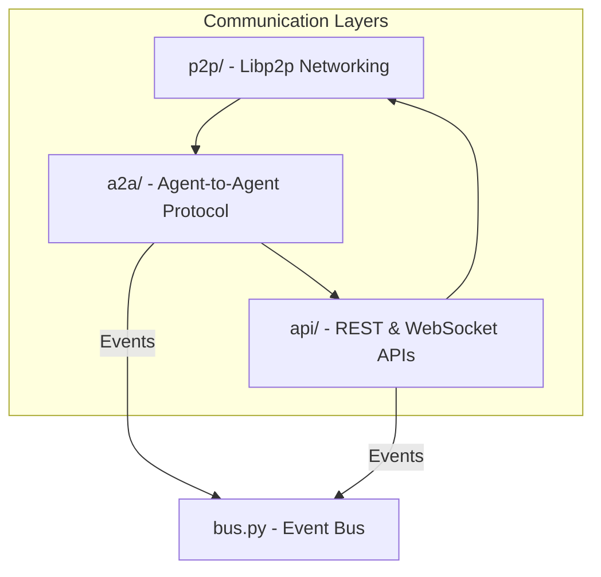
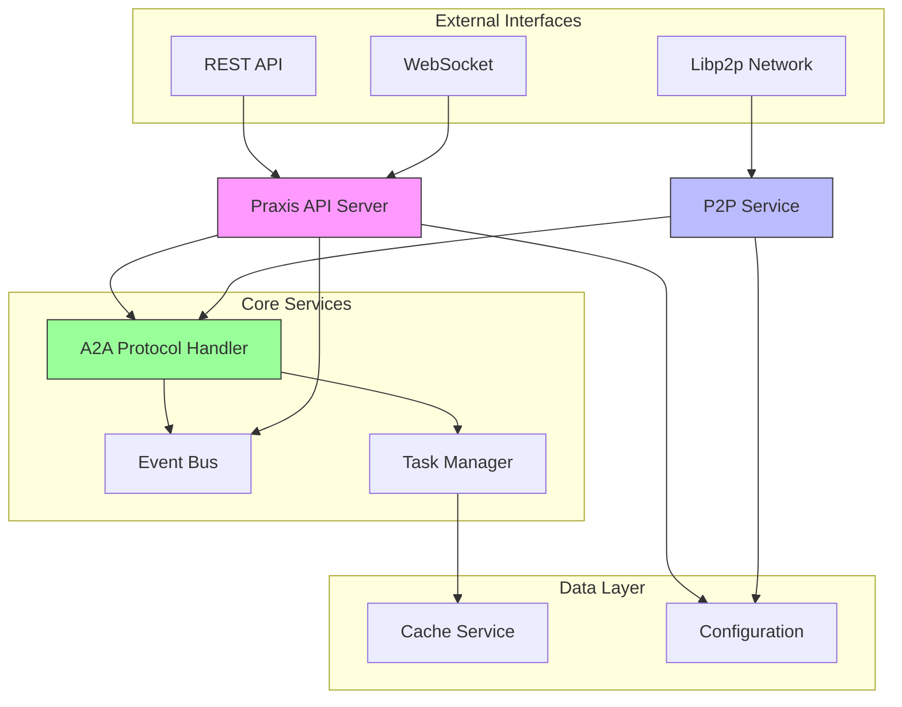
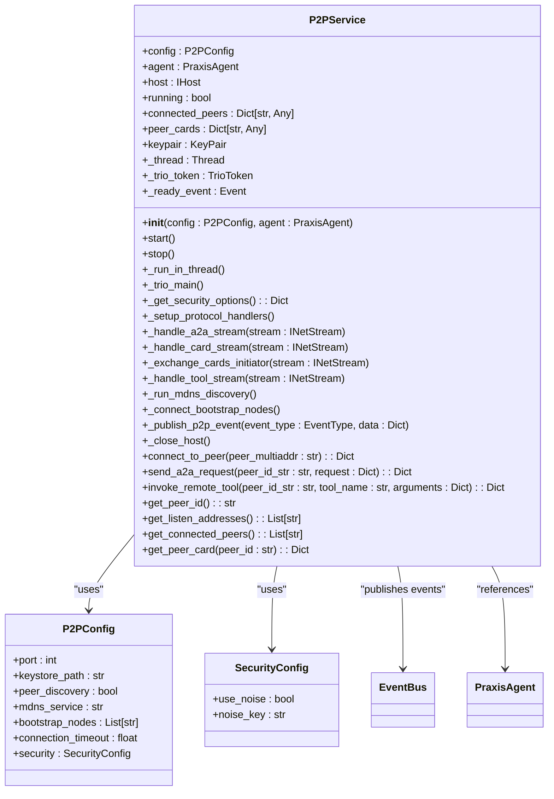
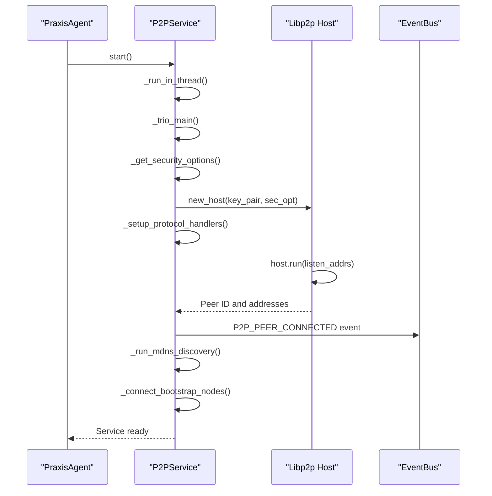
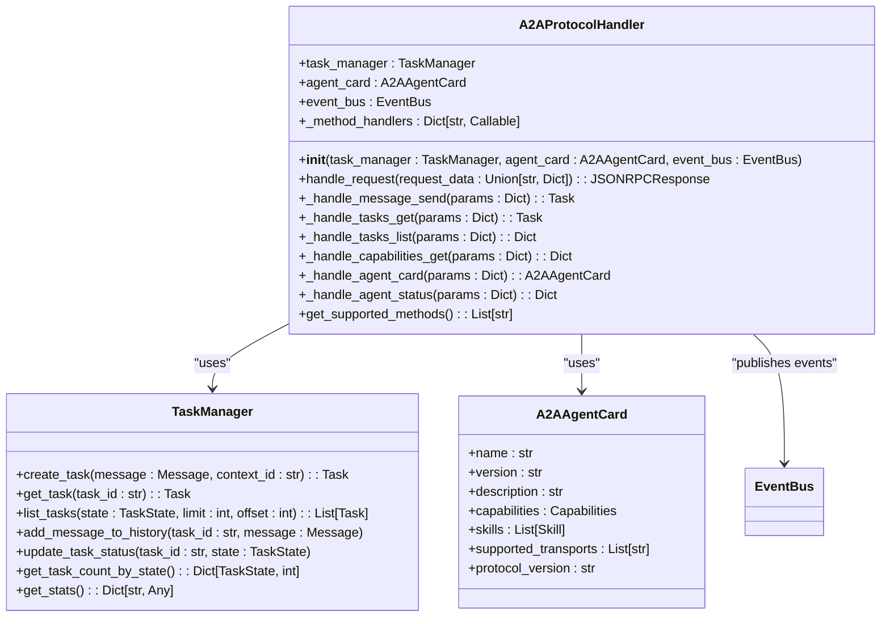
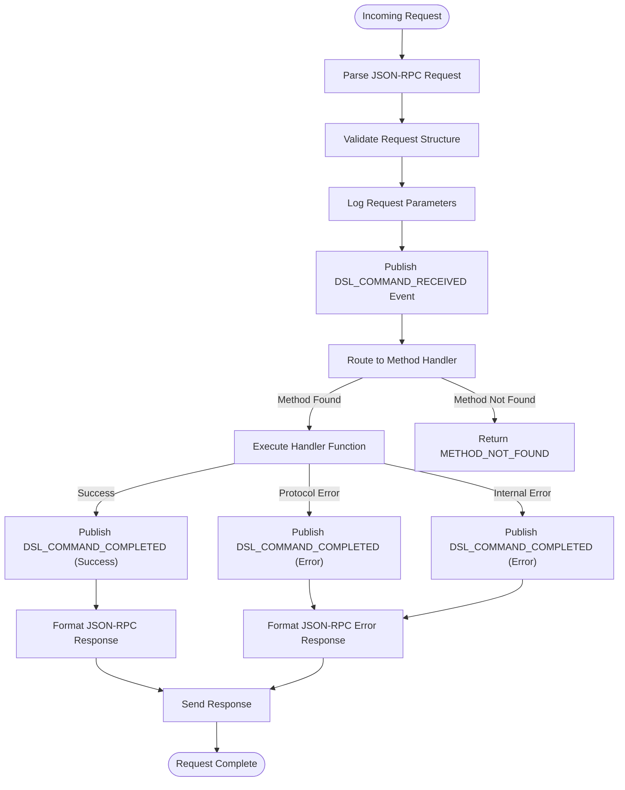
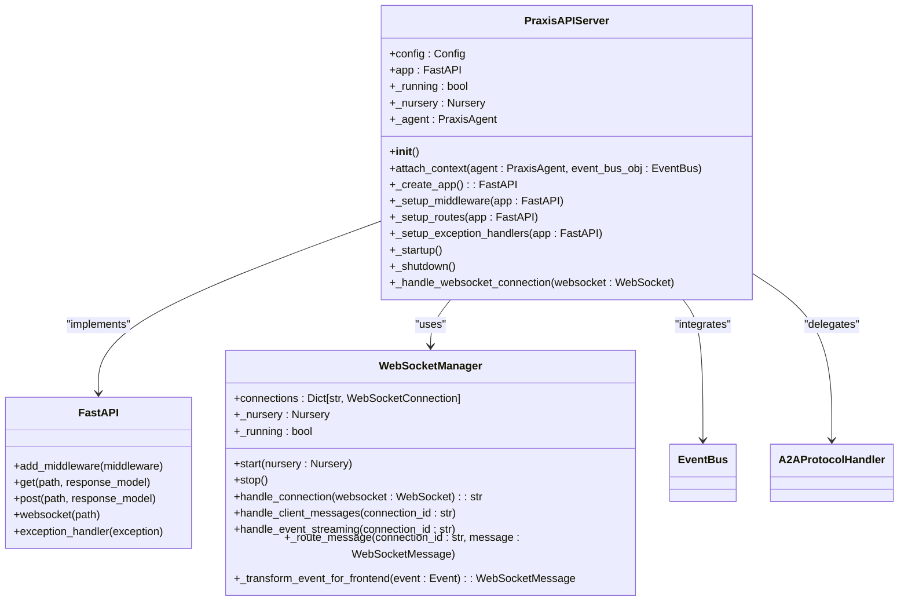
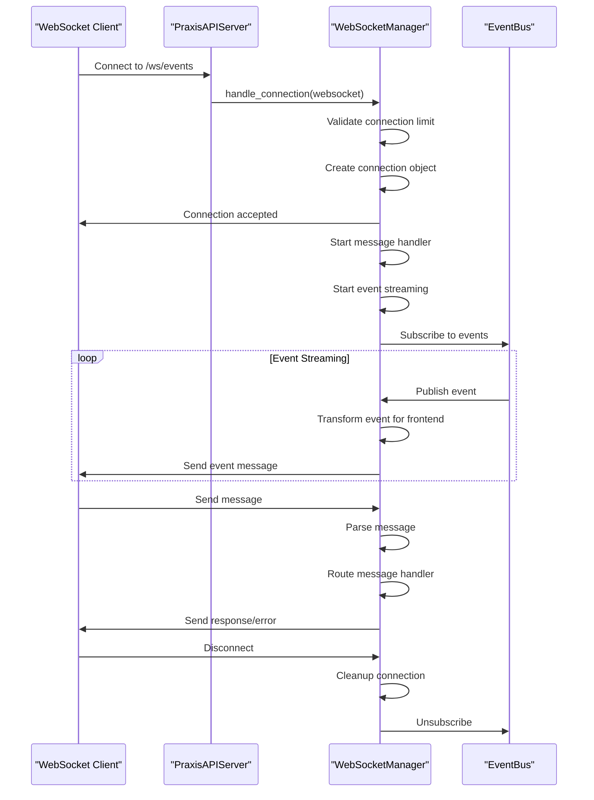
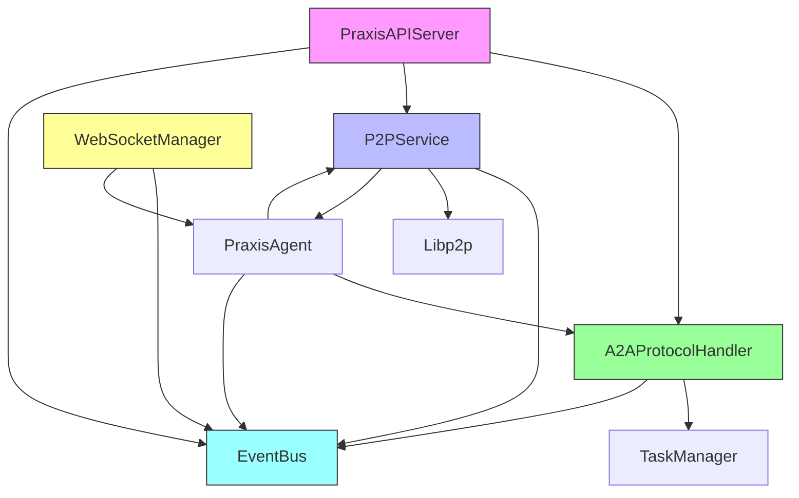

# Communication Protocols

## Table of Contents
1. [Introduction](#introduction)
2. [Project Structure](#project-structure)
3. [Core Components](#core-components)
4. [Architecture Overview](#architecture-overview)
5. [Detailed Component Analysis](#detailed-component-analysis)
6. [Dependency Analysis](#dependency-analysis)
7. [Performance Considerations](#performance-considerations)
8. [Troubleshooting Guide](#troubleshooting-guide)
9. [Conclusion](#conclusion)

## Introduction
This document provides comprehensive architectural documentation for the communication protocols layer of the Praxis Python SDK. It details a multi-layered communication architecture that integrates P2P networking (libp2p), Agent-to-Agent (A2A) protocol, and REST/WebSocket APIs. The system enables secure peer discovery, encrypted communication between agents, task delegation, capability exchange, and real-time event streaming. This documentation explains how these components work together, their security considerations, data flow patterns, and performance characteristics.

## Project Structure
The communication protocols are organized across several key directories within the `src/praxis_sdk` module:
- `p2p/`: Contains libp2p-based peer-to-peer networking implementation
- `a2a/`: Implements the Agent-to-Agent protocol for task management and capability exchange
- `api/`: Houses the FastAPI server, WebSocket handlers, and HTTP endpoints
- `bus.py`: Provides the event bus for internal component communication

The architecture follows a layered approach where P2P networking forms the foundation, A2A protocol operates at the agent communication layer, and REST/WebSocket APIs provide external access points.

**Diagram sources**
- [service.py](file://src/praxis_sdk/p2p/service.py)
- [protocol.py](file://src/praxis_sdk/a2a/protocol.py)
- [server.py](file://src/praxis_sdk/api/server.py)
- [bus.py](file://src/praxis_sdk/bus.py)

**Section sources**
- [service.py](file://src/praxis_sdk/p2p/service.py)
- [protocol.py](file://src/praxis_sdk/a2a/protocol.py)
- [server.py](file://src/praxis_sdk/api/server.py)

## Core Components
The communication system consists of three primary components that work together to enable agent interaction:

1. **P2PService**: Implements libp2p-based peer-to-peer networking with secure transport options
2. **A2AProtocolHandler**: Manages Agent-to-Agent communication using JSON-RPC 2.0 for task delegation
3. **PraxisAPIServer**: Provides RESTful endpoints and WebSocket connections for external interaction

These components are interconnected through an event bus that facilitates asynchronous communication and state synchronization.

**Section sources**
- [service.py](file://src/praxis_sdk/p2p/service.py#L1-L50)
- [protocol.py](file://src/praxis_sdk/a2a/protocol.py#L1-L50)
- [server.py](file://src/praxis_sdk/api/server.py#L1-L50)

## Architecture Overview
The communication architecture follows a multi-layered design that enables both direct peer-to-peer communication and centralized API access. The system integrates libp2p for decentralized networking, A2A protocol for structured agent interaction, and FastAPI for HTTP-based services.

**Diagram sources**
- [service.py](file://src/praxis_sdk/p2p/service.py)
- [protocol.py](file://src/praxis_sdk/a2a/protocol.py)
- [server.py](file://src/praxis_sdk/api/server.py)

## Detailed Component Analysis

### P2P Service Analysis
The P2PService implements libp2p-based peer-to-peer networking with support for secure communication and peer discovery. It runs in a separate thread with a trio event loop, bridging between asyncio and trio concurrency models.

**Diagram sources**
- [service.py](file://src/praxis_sdk/p2p/service.py#L37-L627)

**Section sources**
- [service.py](file://src/praxis_sdk/p2p/service.py#L1-L627)

#### Connection Establishment Flow
The P2P service establishes connections through a well-defined sequence that includes security setup, protocol registration, and peer discovery.

**Diagram sources**
- [service.py](file://src/praxis_sdk/p2p/service.py#L171-L206)

### A2A Protocol Analysis
The A2AProtocolHandler implements the Agent-to-Agent protocol with full JSON-RPC 2.0 compliance, enabling structured communication between agents for task management and capability exchange.

**Diagram sources**
- [protocol.py](file://src/praxis_sdk/a2a/protocol.py#L48-L536)

**Section sources**
- [protocol.py](file://src/praxis_sdk/a2a/protocol.py#L1-L536)

#### A2A Request Processing Flow
The A2A protocol processes incoming requests through a standardized pipeline that includes parsing, validation, method routing, and response generation.

**Diagram sources**
- [protocol.py](file://src/praxis_sdk/a2a/protocol.py#L119-L154)

### API Server Analysis
The PraxisAPIServer implements a FastAPI-based server that provides RESTful endpoints and WebSocket connections for external interaction with the agent system.

**Diagram sources**
- [server.py](file://src/praxis_sdk/api/server.py#L76-L1063)

**Section sources**
- [server.py](file://src/praxis_sdk/api/server.py#L1-L1063)

#### WebSocket Connection Flow
The WebSocket manager handles real-time event streaming to clients through a structured connection lifecycle.

**Diagram sources**
- [websocket.py](file://src/praxis_sdk/api/websocket.py#L129-L164)

## Dependency Analysis
The communication protocols layer has a well-defined dependency structure that ensures loose coupling between components while maintaining clear integration points.

**Diagram sources**
- [server.py](file://src/praxis_sdk/api/server.py)
- [protocol.py](file://src/praxis_sdk/a2a/protocol.py)
- [service.py](file://src/praxis_sdk/p2p/service.py)
- [websocket.py](file://src/praxis_sdk/api/websocket.py)
- [agent.py](file://src/praxis_sdk/agent.py)

**Section sources**
- [server.py](file://src/praxis_sdk/api/server.py#L1-L1063)
- [protocol.py](file://src/praxis_sdk/a2a/protocol.py#L1-L536)
- [service.py](file://src/praxis_sdk/p2p/service.py#L1-L627)

## Performance Considerations
The communication system incorporates several performance optimizations to handle high-throughput scenarios:

1. **Concurrency Model**: Uses trio-asyncio bridge to run libp2p in a separate thread with its own event loop, preventing blocking of the main application
2. **Connection Pooling**: Maintains persistent connections to bootstrap nodes and discovered peers to reduce connection overhead
3. **Event Batching**: The event bus batches events when possible to reduce the number of notifications
4. **Message Serialization**: Uses JSON for message serialization, which provides a good balance between readability and performance
5. **Rate Limiting**: While not explicitly implemented in the provided code, the architecture supports rate limiting through FastAPI middleware
6. **Caching**: Integrates with the cache service to reduce redundant operations

For high-throughput scenarios, the system can be optimized by:
- Implementing message compression for large payloads
- Adding connection pooling for frequently accessed peers
- Using binary serialization formats like Protocol Buffers for internal communication
- Implementing rate limiting and circuit breakers to prevent overload
- Adding load balancing for API endpoints in distributed deployments

## Troubleshooting Guide
Common issues and their solutions in the communication protocols layer:

**P2P Service Fails to Start**
- Check if the configured port is already in use
- Verify keystore directory permissions
- Ensure libp2p dependencies are properly installed
- Check logs for security configuration errors

**WebSocket Connections Drop Frequently**
- Verify network stability between client and server
- Check server resource usage (CPU, memory)
- Review connection timeout settings
- Examine logs for message handling errors

**A2A Requests Time Out**
- Verify peer connectivity through P2P network
- Check if the target agent is running and responsive
- Review request payload size and complexity
- Examine network latency between peers

**Event Streaming Issues**
- Verify event bus is properly initialized
- Check if event handlers are correctly registered
- Review WebSocket connection limits
- Examine message transformation logic for errors

**Security Configuration Problems**
- Validate noise key format and encoding
- Ensure keystore files have appropriate permissions
- Verify TLS certificates if used
- Check firewall rules for required ports

**Section sources**
- [service.py](file://src/praxis_sdk/p2p/service.py#L109-L150)
- [websocket.py](file://src/praxis_sdk/api/websocket.py#L227-L255)
- [protocol.py](file://src/praxis_sdk/a2a/protocol.py#L152-L185)

## Conclusion
The communication protocols layer of the Praxis Python SDK provides a robust, multi-layered architecture for agent interaction. By combining P2P networking, A2A protocol, and REST/WebSocket APIs, the system enables flexible communication patterns for decentralized agent networks. The architecture emphasizes security through encrypted transport options, reliability through structured error handling, and scalability through asynchronous processing. The integration of an event bus facilitates loose coupling between components while enabling real-time state synchronization. This comprehensive communication framework supports the development of sophisticated agent-based systems with rich interaction capabilities.

**Referenced Files in This Document**   
- [service.py](file://src/praxis_sdk/p2p/service.py)
- [protocol.py](file://src/praxis_sdk/a2a/protocol.py)
- [server.py](file://src/praxis_sdk/api/server.py)
- [websocket.py](file://src/praxis_sdk/api/websocket.py)
- [agent.py](file://src/praxis_sdk/agent.py)
- [models.py](file://src/praxis_sdk/a2a/models.py)