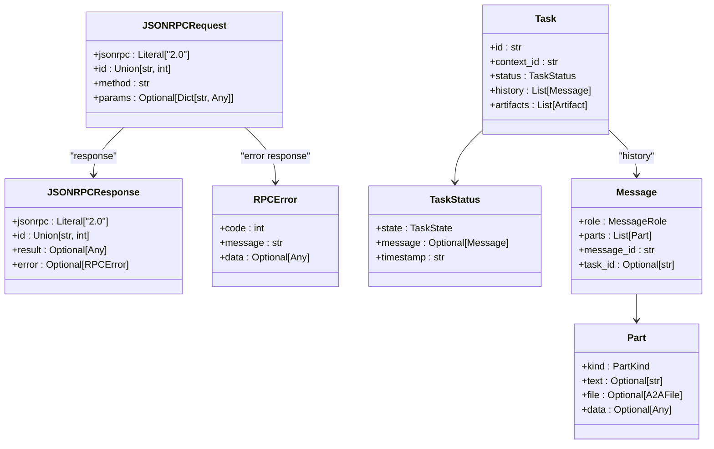
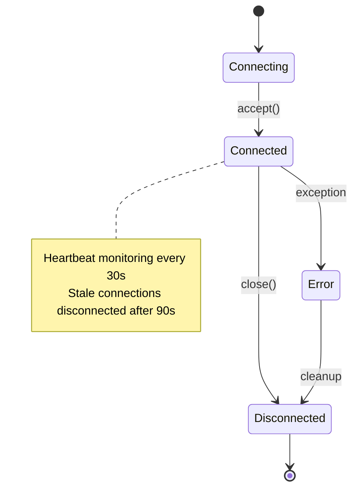
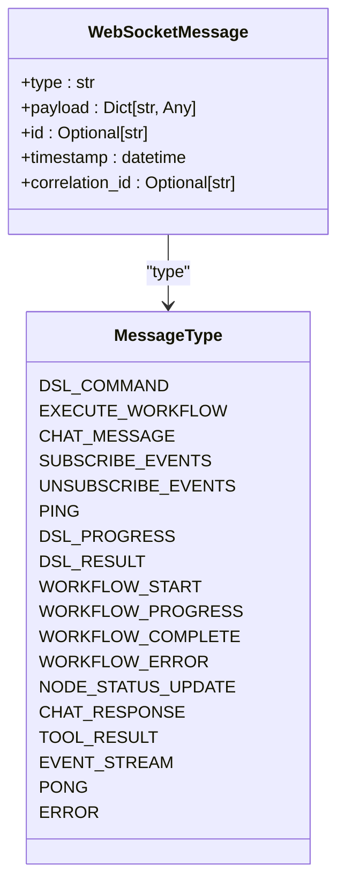
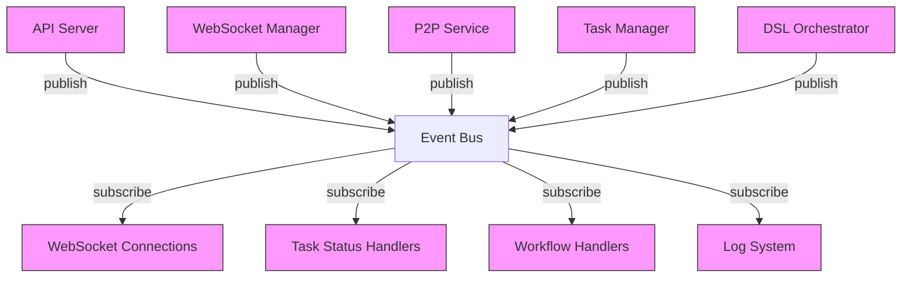
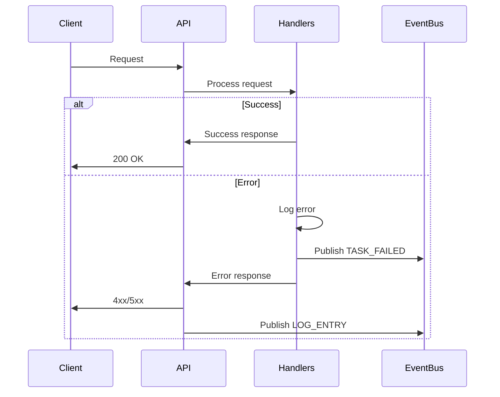
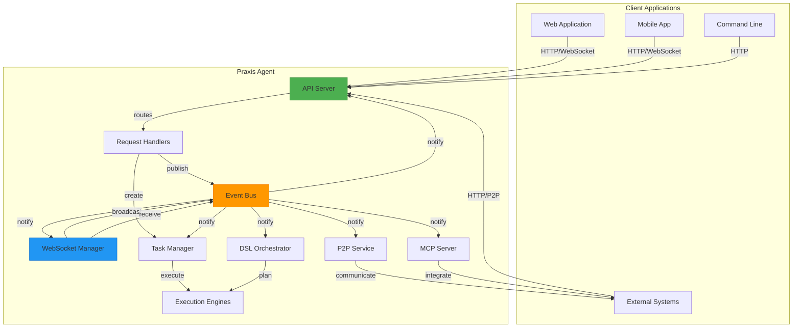
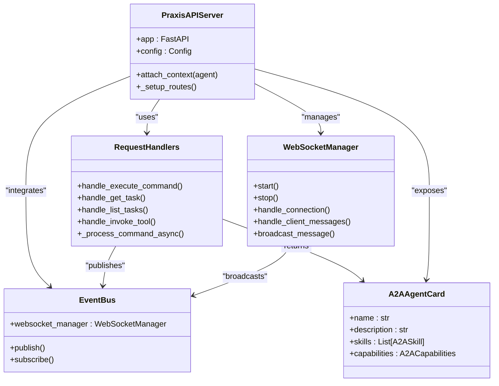

# API & WebSocket Communication


## Table of Contents
1. [Introduction](#introduction)
2. [REST API Endpoints](#rest-api-endpoints)
3. [WebSocket Communication](#websocket-communication)
4. [Event Bus Integration](#event-bus-integration)
5. [Client Implementation Examples](#client-implementation-examples)
6. [Error Handling and Security](#error-handling-and-security)
7. [Architecture Overview](#architecture-overview)

## Introduction
This document provides comprehensive documentation for the REST and WebSocket communication interfaces of the Praxis Python SDK. The API enables interaction with agent systems through HTTP endpoints and real-time WebSocket connections, supporting both legacy DSL commands and the standardized A2A (Agent-to-Agent) protocol. The system integrates with an internal event bus for state synchronization across components, enabling real-time updates and distributed coordination.

The API surface includes endpoints for task management, tool invocation, agent discovery, and workflow execution, with comprehensive support for JSON-RPC 2.0 format as specified by the A2A protocol. WebSocket connections provide real-time event streaming for task progress, workflow execution, and system events, enabling responsive client applications.

**Section sources**
- [server.py](file://src/praxis_sdk/api/server.py#L1-L1063)
- [handlers.py](file://src/praxis_sdk/api/handlers.py#L1-L752)

## REST API Endpoints

### HTTP Methods and URL Patterns
The REST API provides a comprehensive set of endpoints for agent interaction, task management, and system monitoring. All endpoints are served through FastAPI with proper CORS configuration and middleware.

```mermaid
graph TD
A[REST API Endpoints] --> B[/health]
A --> C[/agent/card]
A --> D[/execute]
A --> E[/tasks/{task_id}]
A --> F[/tasks]
A --> G[/tools]
A --> H[/p2p/connect]
A --> I[/p2p/tools]
A --> J[/a2a/message/send]
A --> K[/a2a/tasks/get]
A --> L[/api/workflow/execute]
A --> M[/api/upload]
A --> N[/mcp/tools]
A --> O[/cache/stats]
```

**Diagram sources**
- [server.py](file://src/praxis_sdk/api/server.py#L150-L800)

### Core Execution Endpoints
The primary execution endpoints support both legacy DSL format and A2A JSON-RPC standard:

**POST /execute** - Main A2A execution endpoint supporting JSON-RPC 2.0
- Accepts JSON-RPC requests with method field determining operation
- Supports message/send, tasks/get, and tasks/list methods
- Returns JSON-RPC response format with result or error

**POST /agent/execute** - Legacy execution endpoint for backward compatibility
- Accepts simple DSL command in {"dsl": "command text"} format
- Returns simple JSON response with task submission status

### Request/Response Schemas
The API uses Pydantic models for request validation and response serialization, ensuring type safety and proper documentation.



**Diagram sources**
- [models.py](file://src/praxis_sdk/a2a/models.py#L1-L494)

### Authentication Mechanisms
The API currently supports API key authentication through HTTP headers:

- **X-API-Key**: Required for all requests in production environments
- **Authorization**: Bearer token support for future OAuth integration
- Configurable through `config.api.auth_enabled` setting

When authentication is enabled, endpoints validate credentials before processing requests and return 401 Unauthorized for invalid credentials.

### Task Management Endpoints
Comprehensive task management is provided through REST endpoints:

**GET /tasks/{task_id}** - Retrieve specific task by ID
- Returns Task object in A2A-compliant format
- Returns 404 if task not found

**GET /tasks** - List tasks with optional filtering
- Parameters: state (TaskState), limit (default 100), offset (default 0)
- Returns paginated list of tasks with total count

**POST /tasks** - Create new task from message
- Accepts Message object in request body
- Returns created Task object

### Tool Management Endpoints
Tool invocation and discovery endpoints:

**GET /tools** - List available tools
- Returns list of ToolInfo objects with name, description, parameters
- Includes enabled status and parameter schema

**POST /tools/{tool_name}/invoke** - Invoke specific tool
- Parameters: tool_name (path), request body with parameters and context_id
- Returns task submission response with task_id

### P2P Network Endpoints
Peer-to-peer network management:

**POST /p2p/connect** - Connect to peer
- Request body: {"multiaddr": "address"}
- Returns connection result

**GET /p2p/peers** - List connected peers
- Returns list of connected peer information

**POST /p2p/tool** - Invoke tool on remote peer
- Request body: {"peer_id": "id", "tool": "tool_name", "arguments": {}}
- Returns remote tool execution result

### A2A Protocol Endpoints
Full A2A protocol compliance:

**POST /a2a/message/send** - Direct A2A message/send endpoint
- Accepts JSON-RPC 2.0 format only
- Handles message submission and task creation

**GET /a2a/tasks/stream/{task_id}** - SSE stream for task updates
- Server-Sent Events endpoint for real-time task updates
- Emits JSON-RPC responses with task snapshots

**GET /.well-known/agent-card.json** - Standard A2A agent card location
- Returns A2AAgentCard in A2A specification format

### Workflow API Endpoints
Frontend-integrated workflow management:

**POST /api/workflow/execute** - Execute workflow
- Request body: WorkflowExecutionPayload with nodes, edges, metadata
- Returns WorkflowExecutionResponse with execution details

**GET /api/workflow/status/{workflow_id}** - Get workflow status
- Returns current execution state, progress, and node status

**POST /api/workflow/cancel/{workflow_id}** - Cancel workflow execution
- Stops ongoing workflow processing

**Section sources**
- [server.py](file://src/praxis_sdk/api/server.py#L150-L800)
- [handlers.py](file://src/praxis_sdk/api/handlers.py#L1-L752)
- [workflow_handlers.py](file://src/praxis_sdk/api/workflow_handlers.py#L1-L582)

## WebSocket Communication

### Connection Lifecycle
WebSocket connections follow a standardized lifecycle managed by the WebSocketManager:



**Diagram sources**
- [websocket.py](file://src/praxis_sdk/api/websocket.py#L1-L807)

### Message Formats
WebSocket messages use a standardized format for client-server communication:



**Diagram sources**
- [websocket.py](file://src/praxis_sdk/api/websocket.py#L1-L807)

### Event Types
The system broadcasts various event types for real-time updates:

- **DSL_PROGRESS**: LLM analysis and planning progress
- **DSL_RESULT**: DSL command processing result
- **WORKFLOW_START**: Workflow execution started
- **WORKFLOW_PROGRESS**: Workflow node execution progress
- **WORKFLOW_COMPLETE**: Workflow execution completed
- **WORKFLOW_ERROR**: Workflow execution error
- **NODE_STATUS_UPDATE**: Individual node status change
- **CHAT_RESPONSE**: Chat message from agent
- **TOOL_RESULT**: Tool execution result
- **EVENT_STREAM**: Generic event stream

### Real-time Interaction Patterns
The WebSocket API supports several interaction patterns:

**Event Subscription Pattern**
Clients can subscribe to specific event types:
```json
{
  "type": "SUBSCRIBE_EVENTS",
  "payload": {
    "event_types": ["WORKFLOW_PROGRESS", "WORKFLOW_COMPLETE"]
  }
}
```

**Command Execution Pattern**
Clients can send DSL commands for processing:
```json
{
  "type": "DSL_COMMAND",
  "payload": {
    "command": "analyze the sales data and create a report"
  }
}
```

**Workflow Execution Pattern**
Clients can submit workflows for execution:
```json
{
  "type": "EXECUTE_WORKFLOW",
  "payload": {
    "workflowId": "wf-123",
    "nodes": [...],
    "edges": [...]
  }
}
```

**Heartbeat Pattern**
Clients can send ping messages for connection health:
```json
{
  "type": "PING",
  "payload": {}
}
```

The server responds with PONG messages to confirm connectivity.

**Section sources**
- [websocket.py](file://src/praxis_sdk/api/websocket.py#L1-L807)
- [server.py](file://src/praxis_sdk/api/server.py#L150-L800)

## Event Bus Integration

### Internal Event Bus Architecture
The event bus provides a centralized communication mechanism between components:



**Diagram sources**
- [bus.py](file://src/praxis_sdk/bus.py#L1-L368)
- [server.py](file://src/praxis_sdk/api/server.py#L150-L800)

### Event Types and Flow
The system defines comprehensive event types for different operations:


**Diagram sources**
- [bus.py](file://src/praxis_sdk/bus.py#L1-L368)

### State Synchronization
The event bus enables real-time state synchronization across components:

1. **Task State Updates**: When a task state changes, the event bus publishes TASK_STARTED, TASK_COMPLETED, or TASK_FAILED events, which are received by the API server to update task status and WebSocket connections to broadcast progress to clients.

2. **Workflow Coordination**: Workflow execution events are published when workflows start, progress, or complete, allowing multiple components to react to workflow state changes.

3. **Real-time Notifications**: The WebSocket manager subscribes to relevant events and transforms them into frontend-compatible messages, enabling real-time UI updates.

4. **Cross-component Communication**: Components can publish events that other components subscribe to, enabling loose coupling and modular design.

**Section sources**
- [bus.py](file://src/praxis_sdk/bus.py#L1-L368)
- [websocket.py](file://src/praxis_sdk/api/websocket.py#L1-L807)
- [handlers.py](file://src/praxis_sdk/api/handlers.py#L1-L752)

## Client Implementation Examples

### Python Client Implementation
```python
import asyncio
import json
import websockets
import requests
from typing import Dict, Any

class PraxisClient:
    """Python client for Praxis API and WebSocket communication."""
    
    def __init__(self, base_url: str = "http://localhost:8000"):
        self.base_url = base_url
        self.session = requests.Session()
    
    def execute_dsl_command(self, command: str) -> Dict[str, Any]:
        """Execute a DSL command via REST API."""
        response = self.session.post(
            f"{self.base_url}/agent/execute",
            json={"dsl": command}
        )
        response.raise_for_status()
        return response.json()
    
    def get_task(self, task_id: str) -> Dict[str, Any]:
        """Retrieve task information."""
        response = self.session.get(f"{self.base_url}/tasks/{task_id}")
        response.raise_for_status()
        return response.json()
    
    async def connect_websocket(self):
        """Connect to WebSocket for real-time events."""
        websocket = await websockets.connect(f"{self.base_url}/ws/events")
        
        # Send subscription message
        await websocket.send(json.dumps({
            "type": "SUBSCRIBE_EVENTS",
            "payload": {
                "event_types": [
                    "workflowStart", 
                    "workflowProgress", 
                    "workflowComplete", 
                    "workflowError"
                ]
            }
        }))
        
        try:
            while True:
                message = await websocket.recv()
                data = json.loads(message)
                print(f"Received: {data['type']} - {data['payload']}")
        except websockets.exceptions.ConnectionClosed:
            print("WebSocket connection closed")
        finally:
            await websocket.close()

# Usage example
def main():
    client = PraxisClient()
    
    # Execute command via REST
    result = client.execute_dsl_command("create a sales report from the data")
    print(f"Task submitted: {result['task_id']}")
    
    # Get task details
    task = client.get_task(result['task_id'])
    print(f"Task status: {task['status']['state']}")
    
    # Connect WebSocket for real-time updates
    asyncio.run(client.connect_websocket())

if __name__ == "__main__":
    main()
```

### JavaScript Client Implementation
```javascript
class PraxisClient {
    constructor(baseUrl = 'http://localhost:8000') {
        this.baseUrl = baseUrl;
        this.websocket = null;
    }
    
    // REST API methods
    async executeDSLCommand(command) {
        const response = await fetch(`${this.baseUrl}/agent/execute`, {
            method: 'POST',
            headers: {
                'Content-Type': 'application/json',
            },
            body: JSON.stringify({ dsl: command })
        });
        
        if (!response.ok) {
            throw new Error(`HTTP error! status: ${response.status}`);
        }
        
        return await response.json();
    }
    
    async getTask(taskId) {
        const response = await fetch(`${this.baseUrl}/tasks/${taskId}`);
        
        if (!response.ok) {
            throw new Error(`HTTP error! status: ${response.status}`);
        }
        
        return await response.json();
    }
    
    // WebSocket methods
    connectWebSocket(onMessage) {
        this.websocket = new WebSocket(`${this.baseUrl.replace('http', 'ws')}/ws/events`);
        
        this.websocket.onopen = () => {
            console.log('WebSocket connected');
            
            // Subscribe to workflow events
            this.websocket.send(JSON.stringify({
                type: 'SUBSCRIBE_EVENTS',
                payload: {
                    event_types: [
                        'workflowStart',
                        'workflowProgress',
                        'workflowComplete',
                        'workflowError'
                    ]
                }
            }));
        };
        
        this.websocket.onmessage = (event) => {
            const data = JSON.parse(event.data);
            onMessage(data);
        };
        
        this.websocket.onclose = () => {
            console.log('WebSocket disconnected');
        };
        
        this.websocket.onerror = (error) => {
            console.error('WebSocket error:', error);
        };
    }
    
    disconnectWebSocket() {
        if (this.websocket) {
            this.websocket.close();
        }
    }
    
    // Workflow execution
    async executeWorkflow(workflow) {
        const response = await fetch(`${this.baseUrl}/api/workflow/execute`, {
            method: 'POST',
            headers: {
                'Content-Type': 'application/json',
            },
            body: JSON.stringify(workflow)
        });
        
        if (!response.ok) {
            throw new Error(`HTTP error! status: ${response.status}`);
        }
        
        return await response.json();
    }
}

// Usage example
const client = new PraxisClient();

// Execute DSL command
client.executeDSLCommand('analyze the sales data and create a report')
    .then(result => {
        console.log('Task submitted:', result.task_id);
        return client.getTask(result.task_id);
    })
    .then(task => {
        console.log('Task status:', task.status.state);
    })
    .catch(error => {
        console.error('Error:', error);
    });

// Connect WebSocket for real-time updates
client.connectWebSocket((message) => {
    console.log(`Received ${message.type}:`, message.payload);
});
```

**Section sources**
- [server.py](file://src/praxis_sdk/api/server.py#L150-L800)
- [websocket.py](file://src/praxis_sdk/api/websocket.py#L1-L807)
- [handlers.py](file://src/praxis_sdk/api/handlers.py#L1-L752)

## Error Handling and Security

### Error Handling Strategies
The API implements comprehensive error handling across all components:



**Diagram sources**
- [server.py](file://src/praxis_sdk/api/server.py#L150-L800)
- [handlers.py](file://src/praxis_sdk/api/handlers.py#L1-L752)

The system uses standardized error responses:
- **400 Bad Request**: Invalid parameters or request format
- **404 Not Found**: Resource not found (e.g., task ID)
- **500 Internal Server Error**: Unexpected server error
- **503 Service Unavailable**: Component not available

### Rate Limiting
Rate limiting is implemented at the middleware level:

- Configurable through `config.api.rate_limit` settings
- Default: 100 requests per minute per IP
- Returns 429 Too Many Requests when limit exceeded
- Includes Retry-After header with reset time

### Connection Recovery
The system implements connection recovery strategies:

**WebSocket Reconnection**
Clients should implement exponential backoff reconnection:
```javascript
let retryDelay = 1000; // Start with 1 second
const maxRetryDelay = 30000; // Maximum 30 seconds

function connectWithRetry() {
    client.connectWebSocket(handleMessage)
        .catch(error => {
            console.log(`Connection failed, retrying in ${retryDelay}ms`);
            setTimeout(() => {
                retryDelay = Math.min(retryDelay * 2, maxRetryDelay);
                connectWithRetry();
            }, retryDelay);
        });
}
```

**Automatic Reconnection**
The WebSocket manager automatically disconnects stale connections (no heartbeat for 90 seconds) and clients should reconnect when disconnected.

### Security Considerations
The system implements multiple security measures:

**Authentication**
- API key authentication via X-API-Key header
- Configurable enable/disable through configuration
- Future support for OAuth 2.0 and JWT tokens

**Input Validation**
- All requests validated using Pydantic models
- String length limits for all text fields
- Parameter type checking and coercion
- Sanitization of user input

**Protection Against Web Vulnerabilities**
- CORS configured with specific origins (not wildcard in production)
- CSRF protection for state-changing operations
- Content-Type validation for all requests
- Rate limiting to prevent abuse
- Input sanitization to prevent injection attacks
- Secure headers (X-Content-Type-Options, X-Frame-Options)

**Data Protection**
- All sensitive data encrypted at rest
- HTTPS recommended for production deployments
- API keys stored securely in configuration
- Audit logging for security-critical operations

**Section sources**
- [server.py](file://src/praxis_sdk/api/server.py#L150-L800)
- [handlers.py](file://src/praxis_sdk/api/handlers.py#L1-L752)
- [websocket.py](file://src/praxis_sdk/api/websocket.py#L1-L807)

## Architecture Overview

### System Architecture
The API and WebSocket system integrates with the broader Praxis agent architecture:



**Diagram sources**
- [server.py](file://src/praxis_sdk/api/server.py#L1-L1063)
- [agent.py](file://src/praxis_sdk/agent.py#L1-L1088)
- [bus.py](file://src/praxis_sdk/bus.py#L1-L368)

### Integration Points
The API integrates with multiple internal systems:

**Event Bus Integration**
- All state changes published to event bus
- Components subscribe to relevant events
- Real-time updates propagated to WebSocket clients

**Task Management Integration**
- Tasks created through API endpoints
- Task state changes published to event bus
- Task completion triggers downstream processing

**P2P Network Integration**
- API endpoints for peer discovery and connection
- Remote tool invocation through P2P network
- Peer card exchange for capability discovery

**MCP Integration**
- MCP tools exposed through API endpoints
- Tool invocation routed to MCP server
- Schema discovery for tool parameters

**DSL Orchestration Integration**
- DSL commands processed by orchestrator
- LLM planning integrated with tool execution
- Workflow generation from natural language

### Component Relationships
The key component relationships enable the system's functionality:



**Diagram sources**
- [server.py](file://src/praxis_sdk/api/server.py#L1-L1063)
- [handlers.py](file://src/praxis_sdk/api/handlers.py#L1-L752)
- [websocket.py](file://src/praxis_sdk/api/websocket.py#L1-L807)
- [models.py](file://src/praxis_sdk/a2a/models.py#L1-L494)

The architecture enables a clean separation of concerns while maintaining tight integration through the event bus, allowing components to communicate without direct dependencies.

**Section sources**
- [server.py](file://src/praxis_sdk/api/server.py#L1-L1063)
- [agent.py](file://src/praxis_sdk/agent.py#L1-L1088)
- [bus.py](file://src/praxis_sdk/bus.py#L1-L368)

**Referenced Files in This Document**   
- [server.py](file://src/praxis_sdk/api/server.py)
- [handlers.py](file://src/praxis_sdk/api/handlers.py)
- [websocket.py](file://src/praxis_sdk/api/websocket.py)
- [workflow_handlers.py](file://src/praxis_sdk/api/workflow_handlers.py)
- [models.py](file://src/praxis_sdk/a2a/models.py)
- [bus.py](file://src/praxis_sdk/bus.py)
- [gateway.py](file://src/praxis_sdk/api/gateway.py)
- [agent.py](file://src/praxis_sdk/agent.py)