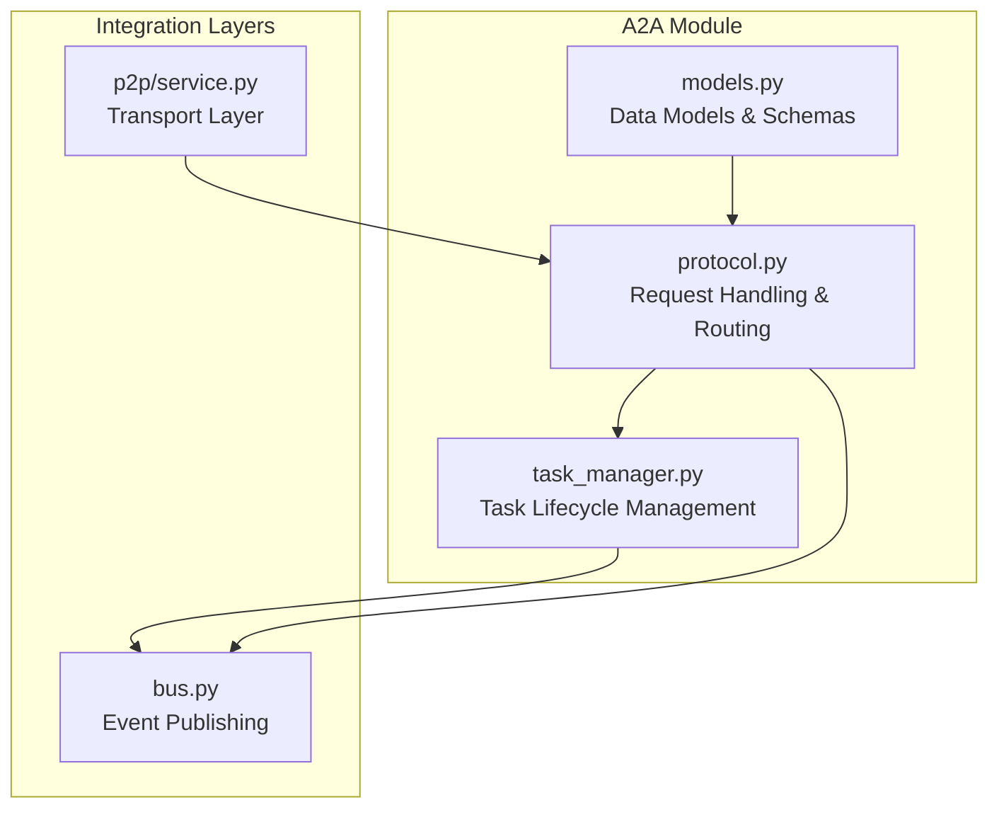
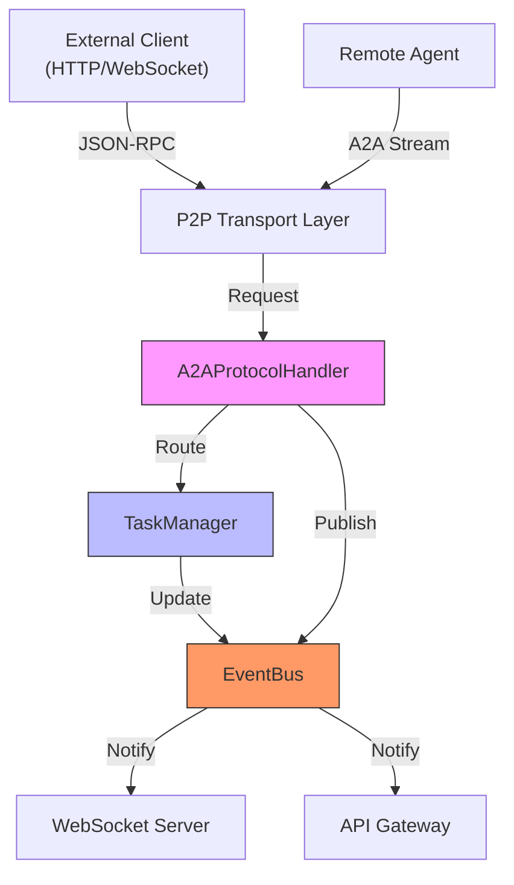
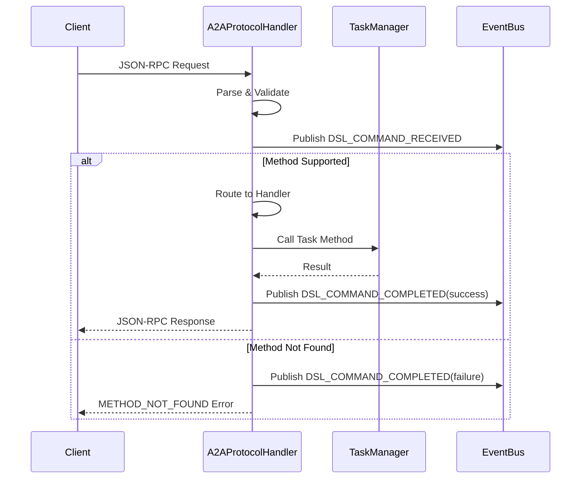
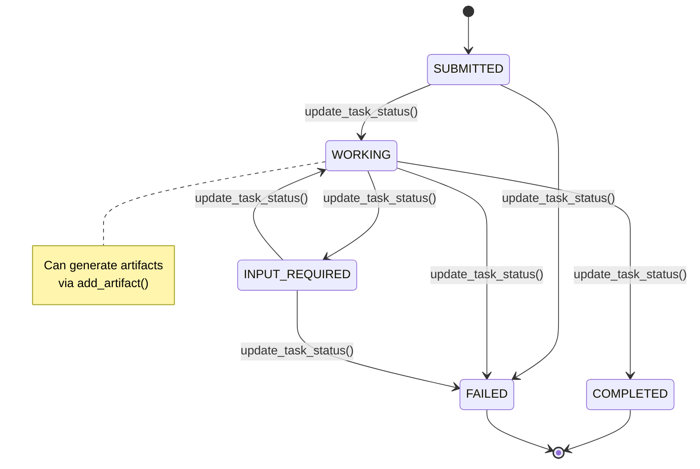
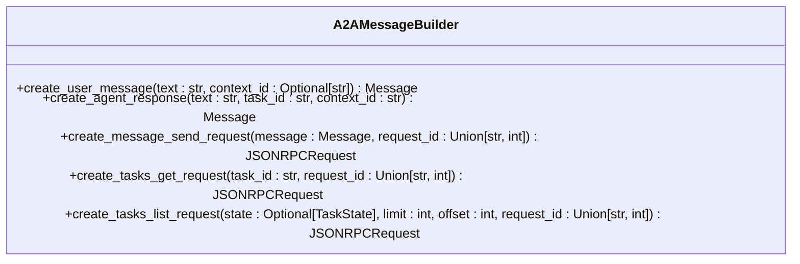
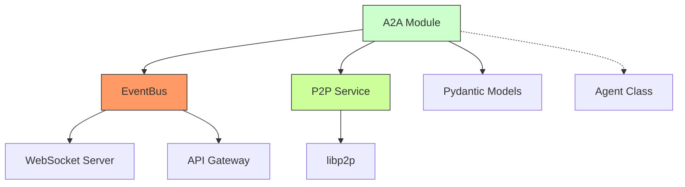

# Agent-to-Agent (A2A) Protocol


## Table of Contents
1. [Introduction](#introduction)
2. [Project Structure](#project-structure)
3. [Core Components](#core-components)
4. [Architecture Overview](#architecture-overview)
5. [Detailed Component Analysis](#detailed-component-analysis)
6. [Dependency Analysis](#dependency-analysis)
7. [Performance Considerations](#performance-considerations)
8. [Troubleshooting Guide](#troubleshooting-guide)
9. [Conclusion](#conclusion)

## Introduction
The Agent-to-Agent (A2A) protocol is a standardized communication framework enabling interoperability between autonomous AI agents within the Praxis ecosystem. Built on JSON-RPC 2.0, it defines structured message formats, task lifecycle management, capability discovery, and error handling for cross-agent collaboration. This document details the implementation of the A2A protocol in the Praxis Python SDK, focusing on message formats, handshake procedures, task delegation workflows, and integration with the P2P transport layer.

## Project Structure
The A2A protocol implementation is organized within the `src/praxis_sdk/a2a` directory, following a modular design that separates concerns into models, protocol handling, and task management. The core components are tightly integrated with the event bus and P2P networking layers to enable real-time coordination.



**Diagram sources**
- [protocol.py](file://src/praxis_sdk/a2a/protocol.py#L1-L535)
- [models.py](file://src/praxis_sdk/a2a/models.py#L1-L494)
- [task_manager.py](file://src/praxis_sdk/a2a/task_manager.py#L1-L553)
- [service.py](file://src/praxis_sdk/p2p/service.py#L267-L304)

**Section sources**
- [protocol.py](file://src/praxis_sdk/a2a/protocol.py#L1-L535)
- [models.py](file://src/praxis_sdk/a2a/models.py#L1-L494)

## Core Components
The A2A protocol implementation consists of three primary components: data models, protocol handler, and task manager. These components work together to manage cross-agent communication and task execution.

### Data Models
The `models.py` file defines Pydantic models that implement the A2A specification with full JSON-RPC 2.0 compliance. Key models include:

- **Task**: The fundamental unit of work with ID, context, status, history, and artifacts
- **Message**: Communication turn between agents with role, parts, and metadata
- **Part**: Content unit (text, file, or data) within messages
- **Artifact**: Output generated by task execution
- **JSONRPCRequest/Response**: Standardized request/response envelopes
- **A2AAgentCard**: Agent capability advertisement with skills and metadata

These models enforce schema validation and provide helper functions for object creation.

### Protocol Handler
The `A2AProtocolHandler` class in `protocol.py` processes incoming JSON-RPC requests, validates parameters, and routes them to appropriate handlers. It supports the following methods:

- `message/send`: Create or update tasks with user messages
- `tasks/get`: Retrieve specific task by ID
- `tasks/list`: List tasks with filtering and pagination
- `capabilities/get`: Get agent capabilities
- `agent/card`: Get complete agent card
- `agent/status`: Get agent status and statistics

The handler integrates with the event bus to publish command lifecycle events.

### Task Manager
The `TaskManager` class manages the complete lifecycle of A2A tasks, including creation, status transitions, artifact generation, and cleanup. It enforces valid state transitions according to the A2A specification and tracks task timeouts.

**Section sources**
- [models.py](file://src/praxis_sdk/a2a/models.py#L1-L494)
- [protocol.py](file://src/praxis_sdk/a2a/protocol.py#L1-L535)
- [task_manager.py](file://src/praxis_sdk/a2a/task_manager.py#L1-L553)

## Architecture Overview
The A2A protocol implementation follows a layered architecture that separates data modeling, protocol handling, and business logic while integrating with system-wide eventing and transport layers.



**Diagram sources**
- [protocol.py](file://src/praxis_sdk/a2a/protocol.py#L1-L535)
- [task_manager.py](file://src/praxis_sdk/a2a/task_manager.py#L1-L553)
- [service.py](file://src/praxis_sdk/p2p/service.py#L267-L304)
- [bus.py](file://src/praxis_sdk/bus.py)

## Detailed Component Analysis

### A2A Protocol Handler Analysis
The `A2AProtocolHandler` class implements the core message processing logic for the A2A protocol, handling incoming requests and coordinating with the task manager.

#### Request Handling Flow


**Diagram sources**
- [protocol.py](file://src/praxis_sdk/a2a/protocol.py#L1-L535)

#### Message Send Handler
The `_handle_message_send` method processes the `message/send` request, which can either create a new task or add to an existing one:

```python
async def _handle_message_send(self, params: Dict[str, Any]) -> Task:
    message_params = MessageSendParams(**params)
    message = message_params.message
    
    if message.task_id:
        # Add to existing task
        existing_task = await self.task_manager.get_task(message.task_id)
        await self.task_manager.add_message_to_history(message.task_id, message)
        if existing_task.status.state == TaskState.INPUT_REQUIRED:
            await self.task_manager.update_task_status(message.task_id, TaskState.WORKING)
        return existing_task
    else:
        # Create new task
        task = await self.task_manager.create_task(message, context_id=message.context_id)
        return task
```

This handler supports task continuation and state transitions from input-required to working.

**Section sources**
- [protocol.py](file://src/praxis_sdk/a2a/protocol.py#L213-L248)

### Task Manager Analysis
The `TaskManager` class manages the complete lifecycle of A2A tasks, ensuring proper state transitions and event publishing.

#### Task State Machine


**Diagram sources**
- [task_manager.py](file://src/praxis_sdk/a2a/task_manager.py#L1-L553)

#### Task Creation and Management
The task manager provides comprehensive methods for task lifecycle management:

```python
async def create_task(self, initial_message: Message, context_id: Optional[str] = None) -> Task:
    # Creates task in SUBMITTED state
    # Sets timeout
    # Publishes TASK_CREATED event
    pass

async def update_task_status(self, task_id: str, new_state: TaskState) -> bool:
    # Validates state transition
    # Updates timestamp
    # Publishes TASK_PROGRESS event
    # Publishes TASK_COMPLETED/FAILED on terminal states
    pass

async def add_artifact(self, task_id: str, name: str, parts: List[Part]) -> Optional[Artifact]:
    # Adds output artifact to task
    # Publishes progress event
    pass
```

The manager enforces valid state transitions and automatically handles timeouts.

**Section sources**
- [task_manager.py](file://src/praxis_sdk/a2a/task_manager.py#L1-L553)

### A2A Message Builder Analysis
The `A2AMessageBuilder` class provides utility methods for constructing A2A messages and requests:



**Diagram sources**
- [protocol.py](file://src/praxis_sdk/a2a/protocol.py#L389-L431)

These helper methods simplify client-side interaction with the A2A protocol.

**Section sources**
- [protocol.py](file://src/praxis_sdk/a2a/protocol.py#L389-L431)

## Dependency Analysis
The A2A protocol implementation has well-defined dependencies on other system components, creating a cohesive integration between communication, task management, and eventing.



The A2A module depends on the event bus for real-time notifications and the P2P service for transport. It exposes functionality to the agent class while being independent of higher-level application logic.

**Diagram sources**
- [protocol.py](file://src/praxis_sdk/a2a/protocol.py#L1-L535)
- [task_manager.py](file://src/praxis_sdk/a2a/task_manager.py#L1-L553)
- [service.py](file://src/praxis_sdk/p2p/service.py#L267-L304)
- [bus.py](file://src/praxis_sdk/bus.py)

**Section sources**
- [protocol.py](file://src/praxis_sdk/a2a/protocol.py#L1-L535)
- [task_manager.py](file://src/praxis_sdk/a2a/task_manager.py#L1-L553)

## Performance Considerations
The A2A protocol implementation includes several performance optimizations:

- **Asynchronous Processing**: All operations are async/await to maximize concurrency
- **Task Locking**: Fine-grained locking in TaskManager prevents race conditions
- **History Trimming**: Message history is limited to prevent memory bloat
- **Background Cleanup**: Completed tasks are periodically cleaned up
- **Timeout Tracking**: Efficient timeout checking with O(n) complexity

The implementation is designed for high-throughput scenarios with multiple concurrent tasks while maintaining data integrity.

## Troubleshooting Guide
Common issues and their solutions:

**Task Not Found Errors**
- Verify task ID exists in the task manager
- Check that the task hasn't been cleaned up (completed tasks older than 24h are removed)
- Ensure correct agent is being contacted

**Invalid State Transitions**
- Validate that transitions follow the state machine rules
- Common valid transitions: SUBMITTED → WORKING, WORKING → COMPLETED
- Invalid transitions are logged and rejected

**P2P Communication Failures**
- Verify peer is online and reachable
- Check that A2A protocol is registered in the P2P service
- Validate that the agent card exchange completed successfully

**Serialization Issues**
- Ensure all messages are properly serialized to JSON
- Validate that Pydantic models are correctly instantiated
- Check for circular references in complex objects

**Section sources**
- [protocol.py](file://src/praxis_sdk/a2a/protocol.py#L1-L535)
- [task_manager.py](file://src/praxis_sdk/a2a/task_manager.py#L1-L553)
- [service.py](file://src/praxis_sdk/p2p/service.py#L267-L304)

## Conclusion
The A2A protocol implementation in the Praxis Python SDK provides a robust foundation for agent-to-agent communication with full JSON-RPC 2.0 compliance. By separating concerns into models, protocol handling, and task management, the implementation achieves high modularity and maintainability. The integration with the event bus enables real-time coordination, while the P2P transport layer ensures decentralized communication. The protocol supports complex workflows including task delegation, capability discovery, and result submission, making it suitable for sophisticated multi-agent systems.

**Referenced Files in This Document**   
- [protocol.py](file://src/praxis_sdk/a2a/protocol.py#L1-L535)
- [models.py](file://src/praxis_sdk/a2a/models.py#L1-L494)
- [task_manager.py](file://src/praxis_sdk/a2a/task_manager.py#L1-L553)
- [__init__.py](file://src/praxis_sdk/a2a/__init__.py#L1-L129)
- [service.py](file://src/praxis_sdk/p2p/service.py#L267-L304)
- [service_simplified.py](file://src/praxis_sdk/p2p/service_simplified.py#L152-L179)
- [service_fixed.py](file://src/praxis_sdk/p2p/service_fixed.py#L212-L249)
- [protocols.py](file://src/praxis_sdk/p2p/protocols.py#L791-L828)