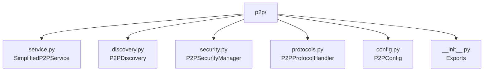
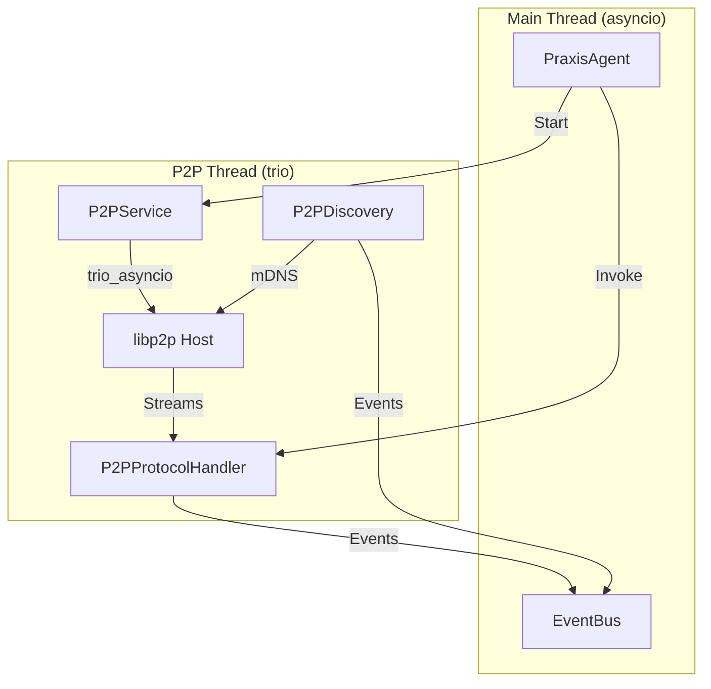
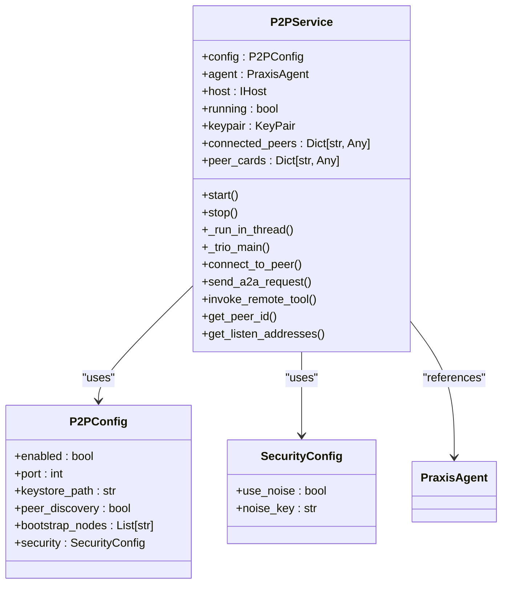
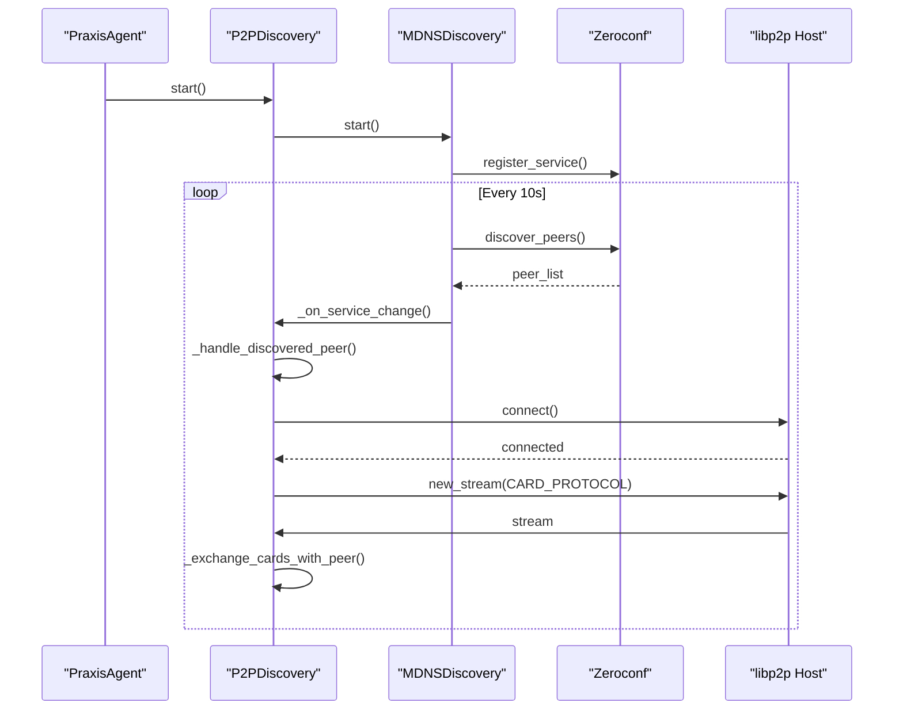
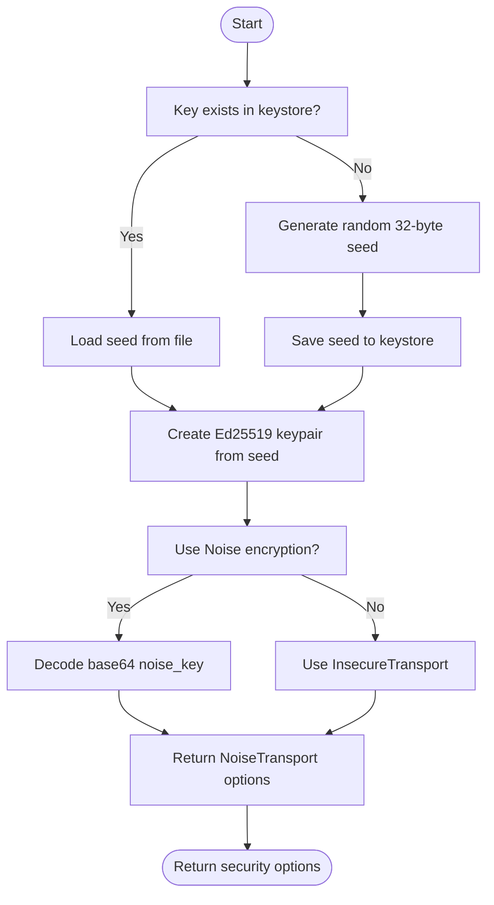
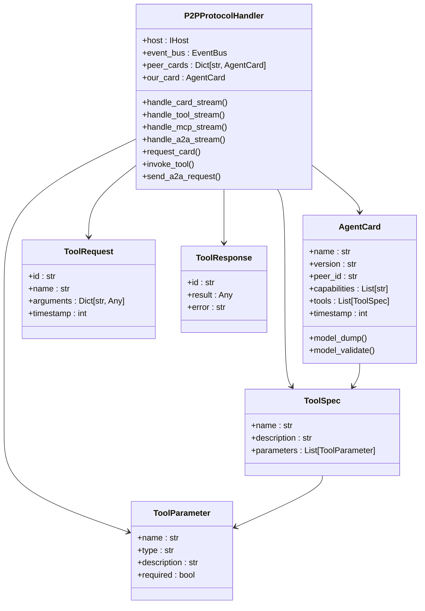
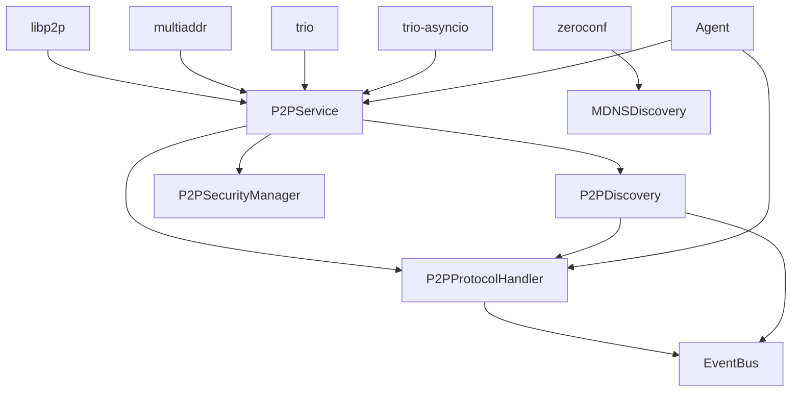

# P2P Networking

## Table of Contents
1. [Introduction](#introduction)
2. [Project Structure](#project-structure)
3. [Core Components](#core-components)
4. [Architecture Overview](#architecture-overview)
5. [Detailed Component Analysis](#detailed-component-analysis)
6. [Dependency Analysis](#dependency-analysis)
7. [Performance Considerations](#performance-considerations)
8. [Troubleshooting Guide](#troubleshooting-guide)
9. [Conclusion](#conclusion)

## Introduction
This document provides comprehensive architectural documentation for the P2P networking subsystem in the Praxis Python SDK. The system is built on libp2p and enables decentralized, secure peer-to-peer communication between autonomous agents. It supports dynamic peer discovery, encrypted communication, and structured protocol-based interactions for agent coordination, tool invocation, and task management. The design emphasizes resilience, security, and interoperability in distributed environments.

## Project Structure
The P2P subsystem is organized within the `src/praxis_sdk/p2p` directory and consists of modular components that handle service management, discovery, security, and protocol handling. The structure supports multiple service implementations and clean separation of concerns.

**Diagram sources**
- [service.py](file://src/praxis_sdk/p2p/service.py)
- [discovery.py](file://src/praxis_sdk/p2p/discovery.py)
- [security.py](file://src/praxis_sdk/p2p/security.py)
- [protocols.py](file://src/praxis_sdk/p2p/protocols.py)
- [config.py](file://src/praxis_sdk/config.py)

**Section sources**
- [service.py](file://src/praxis_sdk/p2p/service.py)
- [discovery.py](file://src/praxis_sdk/p2p/discovery.py)
- [security.py](file://src/praxis_sdk/p2p/security.py)
- [protocols.py](file://src/praxis_sdk/p2p/protocols.py)
- [config.py](file://src/praxis_sdk/config.py)

## Core Components
The P2P subsystem consists of five core components: the P2P service for host management, discovery for peer detection, security for cryptographic operations, protocols for structured communication, and configuration for runtime settings. These components work together to enable a robust decentralized network.

**Section sources**
- [service.py](file://src/praxis_sdk/p2p/service.py#L1-L627)
- [discovery.py](file://src/praxis_sdk/p2p/discovery.py#L1-L603)
- [security.py](file://src/praxis_sdk/p2p/security.py#L1-L59)
- [protocols.py](file://src/praxis_sdk/p2p/protocols.py#L1-L829)
- [config.py](file://src/praxis_sdk/config.py#L1-L412)

## Architecture Overview
The P2P architecture is built around a libp2p host that runs in a separate thread using a trio_asyncio bridge to integrate with the main asyncio event loop. This allows non-blocking P2P operations while maintaining compatibility with the rest of the SDK. The system supports multiple communication protocols and uses mDNS for local peer discovery.

**Diagram sources**
- [service.py](file://src/praxis_sdk/p2p/service.py#L1-L627)
- [agent.py](file://src/praxis_sdk/agent.py#L1-L1088)
- [discovery.py](file://src/praxis_sdk/p2p/discovery.py#L1-L603)
- [protocols.py](file://src/praxis_sdk/p2p/protocols.py#L1-L829)

## Detailed Component Analysis

### P2PService Analysis
The `P2PService` class manages the lifecycle of the libp2p host, handling startup, shutdown, and peer connections. It uses a threading model to isolate the trio event loop while providing a synchronous API to the main application.

#### Class Diagram

**Diagram sources**
- [service.py](file://src/praxis_sdk/p2p/service.py#L1-L627)
- [config.py](file://src/praxis_sdk/config.py#L1-L412)

**Section sources**
- [service.py](file://src/praxis_sdk/p2p/service.py#L1-L627)

### Discovery Analysis
The `P2PDiscovery` component enables automatic peer detection using mDNS (Multicast DNS) and supports both service announcement and discovery. It integrates with libp2p to automatically connect to discovered peers and exchange capability information.

#### Sequence Diagram

**Diagram sources**
- [discovery.py](file://src/praxis_sdk/p2p/discovery.py#L1-L603)
- [service.py](file://src/praxis_sdk/p2p/service.py#L1-L627)

**Section sources**
- [discovery.py](file://src/praxis_sdk/p2p/discovery.py#L1-L603)

### Security Analysis
The `P2PSecurityManager` handles cryptographic key management for the P2P network, supporting both secure Noise protocol encryption and insecure plaintext for development. It manages Ed25519 keypairs and provides utilities for key storage and retrieval.

#### Flowchart

**Diagram sources**
- [security.py](file://src/praxis_sdk/p2p/security.py#L1-L59)
- [service.py](file://src/praxis_sdk/p2p/service.py#L1-L627)

**Section sources**
- [security.py](file://src/praxis_sdk/p2p/security.py#L1-L59)

### Protocol Analysis
The `P2PProtocolHandler` manages multiple communication protocols for different types of interactions between peers, including agent capability exchange, remote tool invocation, and A2A task management. Each protocol operates over a dedicated stream with structured message formats.

#### Class Diagram

**Diagram sources**
- [protocols.py](file://src/praxis_sdk/p2p/protocols.py#L1-L829)

**Section sources**
- [protocols.py](file://src/praxis_sdk/p2p/protocols.py#L1-L829)

## Dependency Analysis
The P2P subsystem has well-defined dependencies on core SDK components and external libraries. The dependency graph shows how the P2P system integrates with the broader agent architecture while maintaining isolation of the libp2p event loop.

**Diagram sources**
- [service.py](file://src/praxis_sdk/p2p/service.py#L1-L627)
- [discovery.py](file://src/praxis_sdk/p2p/discovery.py#L1-L603)
- [protocols.py](file://src/praxis_sdk/p2p/protocols.py#L1-L829)
- [agent.py](file://src/praxis_sdk/agent.py#L1-L1088)

**Section sources**
- [service.py](file://src/praxis_sdk/p2p/service.py#L1-L627)
- [discovery.py](file://src/praxis_sdk/p2p/discovery.py#L1-L603)
- [protocols.py](file://src/praxis_sdk/p2p/protocols.py#L1-L829)

## Performance Considerations
The P2P subsystem is designed with performance and scalability in mind. The use of a separate thread for the libp2p host prevents blocking the main event loop, while the trio_asyncio bridge ensures efficient cross-thread communication. Message sizes are limited to 8KB to prevent memory exhaustion, and connection timeouts are enforced to avoid hanging operations. For large networks, the bootstrap node mechanism provides a reliable entry point, while mDNS discovery enables automatic local network formation. Bandwidth usage is optimized by only exchanging capability cards upon connection, and message routing is direct between peers without intermediate hops.

## Troubleshooting Guide
Common issues in the P2P subsystem typically involve key management, network configuration, or protocol mismatches. If a node fails to start, verify that the keystore directory is writable and the key format is correct. Connection failures may indicate firewall issues or incorrect bootstrap addresses. When debugging discovery problems, ensure that mDNS is enabled on the network and the service name matches across nodes. For protocol errors, check that both peers support the same protocol versions and that message formats are valid JSON. The system logs detailed information about connection attempts, stream handling, and error conditions, which can be used to trace the root cause of issues.

**Section sources**
- [service.py](file://src/praxis_sdk/p2p/service.py#L1-L627)
- [discovery.py](file://src/praxis_sdk/p2p/discovery.py#L1-L603)
- [protocols.py](file://src/praxis_sdk/p2p/protocols.py#L1-L829)

## Conclusion
The P2P networking subsystem in the Praxis SDK provides a robust foundation for decentralized agent communication. By leveraging libp2p, it offers secure, resilient, and scalable peer-to-peer connectivity with support for dynamic discovery and structured protocols. The architecture effectively bridges the gap between the trio-based libp2p implementation and the asyncio-based main application through a well-designed threading model. This enables agents to autonomously discover each other, establish secure channels, and exchange structured messages for coordination and task execution in distributed environments.

**Referenced Files in This Document**   
- [service.py](file://src/praxis_sdk/p2p/service.py)
- [discovery.py](file://src/praxis_sdk/p2p/discovery.py)
- [security.py](file://src/praxis_sdk/p2p/security.py)
- [protocols.py](file://src/praxis_sdk/p2p/protocols.py)
- [config.py](file://src/praxis_sdk/config.py)
- [agent.py](file://src/praxis_sdk/agent.py)