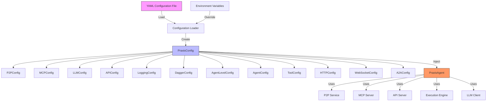
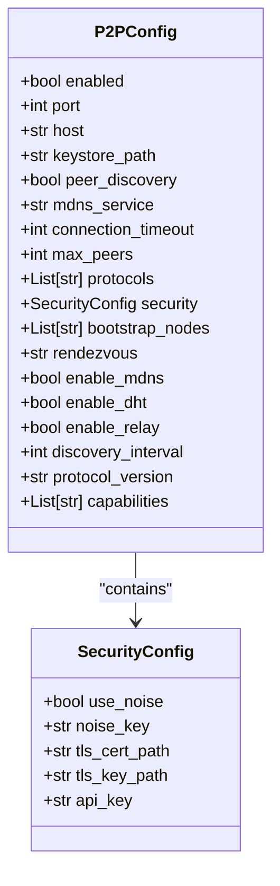
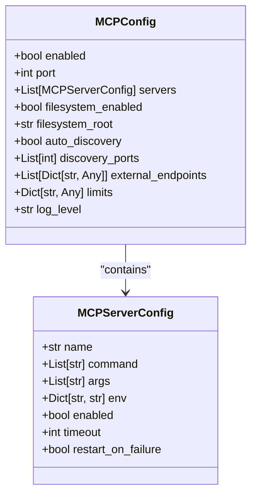
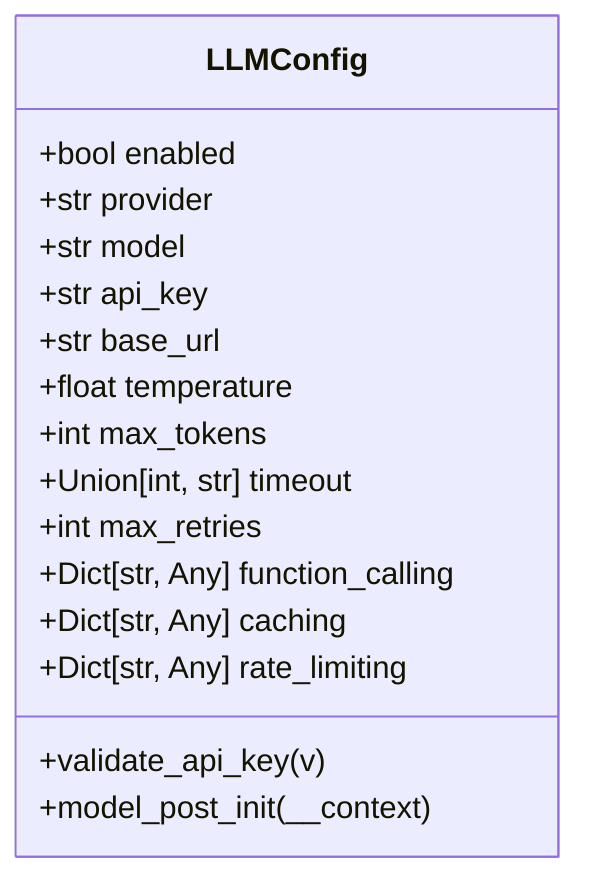

# Configuration System


## Table of Contents
1. [Introduction](#introduction)
2. [Configuration Architecture](#configuration-architecture)
3. [Core Configuration Components](#core-configuration-components)
4. [Configuration File Structure](#configuration-file-structure)
5. [Pydantic Model Validation](#pydantic-model-validation)
6. [Development vs Production Configurations](#development-vs-production-configurations)
7. [Configuration Injection Patterns](#configuration-injection-patterns)
8. [Security and Sensitive Data Management](#security-and-sensitive-data-management)
9. [Common Configuration Errors](#common-configuration-errors)
10. [Performance Implications](#performance-implications)
11. [Best Practices](#best-practices)

## Introduction
The Praxis Python SDK implements a comprehensive YAML-based configuration system that manages agent behavior, networking, execution engines, and integration points. This system provides a flexible and extensible approach to configuring distributed AI agents with support for environment-specific overrides, validation, and dynamic loading. The configuration system serves as the central control point for all SDK components, enabling consistent behavior across development, testing, and production environments.

## Configuration Architecture



**Diagram sources**
- [config.py](file://src/praxis_sdk/config.py#L300-L400)
- [agent.py](file://src/praxis_sdk/agent.py#L50-L100)

**Section sources**
- [config.py](file://src/praxis_sdk/config.py#L1-L50)
- [agent.py](file://src/praxis_sdk/agent.py#L1-L100)

## Core Configuration Components

The configuration system is built around the `PraxisConfig` class, which serves as the root configuration object containing nested configuration objects for different subsystems. Each component has its own Pydantic model that defines the structure, default values, and validation rules.

### P2P Configuration
The P2P (Peer-to-Peer) configuration manages networking settings for decentralized communication between agents.



**Diagram sources**
- [config.py](file://src/praxis_sdk/config.py#L50-L100)

**Section sources**
- [config.py](file://src/praxis_sdk/config.py#L50-L120)

### MCP Configuration
The MCP (Model Context Protocol) configuration manages integration with external services and tools.



**Diagram sources**
- [config.py](file://src/praxis_sdk/config.py#L120-L150)

**Section sources**
- [config.py](file://src/praxis_sdk/config.py#L120-L170)

### LLM Configuration
The LLM configuration manages settings for large language model integration and API connectivity.



**Diagram sources**
- [config.py](file://src/praxis_sdk/config.py#L170-L200)

**Section sources**
- [config.py](file://src/praxis_sdk/config.py#L170-L220)

## Configuration File Structure

The configuration system supports multiple YAML files for different agents, workers, and environments. The structure follows a hierarchical pattern with component-specific sections.

### Agent Configuration Structure
```yaml
agent:
  name: "praxis-python-dev"
  version: "1.0.0"
  description: "Praxis Python Agent - Development Environment"
  url: "http://localhost:8000"
  shared_dir: "./shared"
  external_mcp_endpoints:
    - "http://localhost:3000/mcp"
  tools:
    - name: "write_file"
      description: "Write content to a file in the shared directory"
      engine: "local"
      params:
        - name: "filename"
          type: "string"
          description: "Target file path relative to shared directory"
          required: true
        - name: "content"
          type: "string"
          description: "Content to write to the file"
          required: true
```

### P2P Configuration Structure
```yaml
p2p:
  enabled: true
  port: 4001
  host: "0.0.0.0"
  rendezvous: "praxis-agents-dev"
  enable_mdns: true
  enable_dht: true
  enable_relay: false
  bootstrap_nodes: []
  security:
    enabled: true
    noise_enabled: true
    max_peer_connections: 50
  connection_timeout: 30
  discovery_interval: 30
  protocol_version: "0.3.0"
```

### MCP Configuration Structure
```yaml
mcp:
  enabled: true
  servers: []
  limits:
    max_concurrent_requests: 50
    request_timeout_ms: 30000
    max_response_size_bytes: 10485760
    max_servers_per_node: 5
    connection_pool_size: 3
    retry_attempts: 3
    retry_backoff_ms: 1000
  log_level: "debug"
  discovery_enabled: true
  discovery_endpoints: []
  auto_register_tools: true
```

**Section sources**
- [agent_development.yaml](file://configs/agent_development.yaml#L1-L50)
- [agent_production.yaml](file://configs/agent_production.yaml#L1-L50)

## Pydantic Model Validation

The configuration system uses Pydantic models to validate and parse configuration data, ensuring type safety and data integrity.

### Field Validation
Pydantic field validators ensure that configuration values meet specific requirements:

```python
@field_validator('enable_mdns', mode='before')
@classmethod 
def sync_mdns_config(cls, v, info: ValidationInfo):
    """Sync enable_mdns with peer_discovery for compatibility."""
    if v is None and 'peer_discovery' in info.data:
        return info.data['peer_discovery']
    return v if v is not None else True
```

### API Key Validation
The LLM configuration includes automatic API key loading from environment variables:

```python
@field_validator('api_key', mode='before')
@classmethod
def validate_api_key(cls, v):
    if v is None or v == "":
        v = os.getenv('OPENAI_API_KEY')
    return v

def model_post_init(self, __context):
    """Post-initialization hook to ensure API key is loaded from environment."""
    if self.api_key is None or self.api_key == "":
        self.api_key = os.getenv('OPENAI_API_KEY')
    super().model_post_init(__context) if hasattr(super(), 'model_post_init') else None
```

### Directory Validation
The main configuration validates directory paths and ensures they exist:

```python
@field_validator('data_dir', 'shared_dir', mode='before')
@classmethod
def validate_directories(cls, v):
    """Validate directory paths."""
    return v

def ensure_directories(self):
    """Create necessary directories if they don't exist."""
    try:
        Path(self.data_dir).mkdir(parents=True, exist_ok=True)
        Path(self.shared_dir).mkdir(parents=True, exist_ok=True)
    except OSError as e:
        pass
```

**Section sources**
- [config.py](file://src/praxis_sdk/config.py#L200-L300)

## Development vs Production Configurations

The configuration system supports environment-specific settings through dedicated configuration files.

### Development Configuration
The development configuration prioritizes debugging, flexibility, and local development:

```yaml
environment: "development"
debug: true
logging:
  level: "DEBUG"
  format: "text"
  enable_console: true
  enable_file: true
  file_path: "./logs/praxis-agent.log"
  max_file_size: "100MB"
  backup_count: 5
  structured_logging: false
  log_requests: true
  log_p2p_traffic: false
```

Key development features:
- **Debug mode enabled**: Detailed logging and error reporting
- **Local file paths**: Relative paths for shared directories
- **Permissive CORS**: Allows connections from localhost development servers
- **Verbose logging**: Debug-level logs with console output
- **Local endpoints**: References to localhost services

### Production Configuration
The production configuration emphasizes security, performance, and reliability:

```yaml
environment: "production"
debug: false
logging:
  level: "INFO"
  format: "json"
  enable_console: true
  enable_file: true
  file_path: "/app/logs/praxis-agent.log"
  max_file_size: "500MB"
  backup_count: 10
  structured_logging: true
  log_requests: false
  log_p2p_traffic: false
```

Key production features:
- **Debug mode disabled**: Reduced logging for performance
- **Structured logging**: JSON format for log aggregation systems
- **Secure endpoints**: Production URLs and authentication
- **Resource limits**: Higher connection limits and timeouts
- **Bootstrap nodes**: Pre-configured peer connections for network stability

**Section sources**
- [agent_development.yaml](file://configs/agent_development.yaml#L150-L172)
- [agent_production.yaml](file://configs/agent_production.yaml#L145-L166)

## Configuration Injection Patterns

The configuration system uses dependency injection to provide configuration data to components throughout the codebase.

### Agent Initialization
The PraxisAgent class receives configuration during initialization:

```python
def __init__(self, config: Optional[PraxisConfig] = None, agent_name: str = "orchestrator"):
    self.config = config or load_config()
    self.agent_config = self._get_agent_config(agent_name)
    # ... component initialization using self.config
```

### Component-Specific Configuration
Components receive only the configuration they need:

```python
# LLM Client initialization
self.llm_client = LLMClient(self.config.llm)

# MCP Server initialization  
self.mcp_server = MCPServer(self.config.mcp, self.event_bus, external_endpoints=external_eps)

# P2P Service initialization
self.p2p_service = create_simplified_p2p_service(self.config.p2p, self)
```

### Dynamic Configuration Loading
The system supports loading configuration from files or environment variables:

```python
def load_config(config_file: Optional[str] = None) -> PraxisConfig:
    """Load configuration from file or environment."""
    if config_file and Path(config_file).exists():
        logger.info(f"Loading configuration from: {config_file}")
        return PraxisConfig.load_from_yaml(config_file)
    else:
        logger.info("Using default configuration with environment overrides")
        return PraxisConfig()
```

**Section sources**
- [agent.py](file://src/praxis_sdk/agent.py#L50-L100)
- [config.py](file://src/praxis_sdk/config.py#L300-L400)

## Security and Sensitive Data Management

The configuration system implements several security measures to protect sensitive data.

### Environment Variable Integration
Sensitive data like API keys are loaded from environment variables:

```python
@field_validator('api_key', mode='before')
@classmethod
def validate_api_key(cls, v):
    if v is None or v == "":
        v = os.getenv('OPENAI_API_KEY')
    return v
```

Configuration files use placeholders for sensitive values:
```yaml
llm:
  api_key: "${OPENAI_API_KEY}"
```

### Security Configuration
The system includes dedicated security settings for P2P and API communications:

```python
class SecurityConfig(BaseModel):
    use_noise: bool = True
    noise_key: Optional[str] = None
    tls_cert_path: Optional[str] = None
    tls_key_path: Optional[str] = None
    api_key: Optional[str] = None
```

Production configurations include additional security measures:
```yaml
p2p:
  security:
    enabled: true
    noise_enabled: true
    private_key_path: "/app/keys/priv.key"
    public_key_path: "/app/keys/pub.key"
    max_peer_connections: 200
    authorized_peers: []
    blacklisted_peers: []
```

### Configuration Loading Security
The system ignores extra environment variables to prevent unintended configuration:

```python
model_config = SettingsConfigDict(
    env_prefix='PRAXIS_',
    env_nested_delimiter='__',
    case_sensitive=False,
    env_file='.env',
    env_file_encoding='utf-8',
    extra='ignore'  # Ignore extra environment variables
)
```

**Section sources**
- [config.py](file://src/praxis_sdk/config.py#L30-L50)
- [config.py](file://src/praxis_sdk/config.py#L300-L400)

## Common Configuration Errors

### Missing Configuration File
When a specified configuration file does not exist:

```python
if not yaml_path.exists():
    raise FileNotFoundError(f"Configuration file not found: {yaml_path}")
```

**Solution**: Verify the file path and ensure the configuration file exists in the specified location.

### Invalid YAML Syntax
YAML parsing errors due to incorrect syntax:

```python
try:
    with open(yaml_path, 'r', encoding='utf-8') as f:
        yaml_data = yaml.safe_load(f)
except Exception as e:
    logger.error(f"Error loading YAML configuration: {e}")
    raise
```

**Solution**: Validate YAML syntax using a YAML validator and ensure proper indentation and structure.

### Missing Required Fields
When required configuration fields are missing:

```python
# Pydantic automatically validates required fields
class ToolParam(BaseModel):
    name: str  # Required field
    type: str  # Required field
    description: Optional[str] = None
    required: Union[bool, str] = False
```

**Solution**: Ensure all required fields are present in the configuration file.

### Environment Variable Not Set
When required environment variables are missing:

```python
if self.api_key is None or self.api_key == "":
    self.api_key = os.getenv('OPENAI_API_KEY')
```

**Solution**: Set the required environment variables or provide the values directly in the configuration file.

**Section sources**
- [config.py](file://src/praxis_sdk/config.py#L300-L400)

## Performance Implications

### P2P Configuration Impact
P2P settings significantly affect network performance and resource usage:

```yaml
p2p:
  connection_timeout: 30  # Lower values fail faster but may miss valid peers
  discovery_interval: 30  # Frequent discovery uses more bandwidth
  max_peers: 50  # Higher limits use more memory and CPU
  enable_dht: true  # DHT increases network traffic but improves discovery
  enable_relay: false  # Relay uses more bandwidth but improves connectivity
```

### Execution Engine Configuration
Execution engine settings impact task performance and resource utilization:

```yaml
execution:
  dagger:
    resource_limits:
      cpu: "2000m"  # 2 CPU cores
      memory: "1Gi"  # 1GB RAM
  max_execution_time: 1200  # 20 minutes maximum execution time
  concurrent_executions: 10  # Maximum concurrent tool executions
```

### LLM Configuration Impact
LLM settings affect API costs, response times, and quality:

```yaml
llm:
  model: "gpt-4o"  # More capable but more expensive than gpt-4o-mini
  max_tokens: 8192  # Higher values allow longer responses but cost more
  temperature: 0.0  # Lower values produce more deterministic output
  rate_limiting:
    requests_per_minute: 500  # Higher limits allow more API calls
    tokens_per_minute: 1000000  # Higher limits allow more token usage
```

### Logging Configuration Impact
Logging settings affect disk usage and performance:

```yaml
logging:
  level: "INFO"  # Less verbose than DEBUG, better performance
  max_file_size: "500MB"  # Larger files reduce rotation frequency
  backup_count: 10  # More backups use more disk space
  structured_logging: true  # JSON format has higher processing overhead
```

**Section sources**
- [agent_production.yaml](file://configs/agent_production.yaml#L50-L100)
- [worker_filesystem.yaml](file://configs/worker_filesystem.yaml#L50-L100)

## Best Practices

### Configuration File Organization
Organize configuration files by environment and component:

```
configs/
├── agent_development.yaml
├── agent_production.yaml
├── worker_analytics.yaml
├── worker_filesystem.yaml
└── orchestrator.yaml
```

### Environment Variable Usage
Use environment variables for sensitive data and environment-specific values:

```yaml
llm:
  api_key: "${OPENAI_API_KEY}"
  base_url: "${LLM_BASE_URL}"
```

Set environment variables in `.env` files or deployment configurations.

### Default Values
Provide sensible defaults in the Pydantic models to ensure functionality even with minimal configuration:

```python
class P2PConfig(BaseModel):
    enabled: bool = True
    port: int = 9000
    host: str = "0.0.0.0"
    max_peers: int = 50
    connection_timeout: int = 30
```

### Configuration Validation
Implement comprehensive validation to catch errors early:

```python
@field_validator('enable_mdns', mode='before')
@classmethod 
def sync_mdns_config(cls, v, info: ValidationInfo):
    """Sync enable_mdns with peer_discovery for compatibility."""
    if v is None and 'peer_discovery' in info.data:
        return info.data['peer_discovery']
    return v if v is not None else True
```

### Documentation
Document configuration options thoroughly in comments and external documentation:

```python
class MCPConfig(BaseModel):
    """MCP (Model Context Protocol) configuration."""
    
    enabled: bool = True  # Enable MCP server functionality
    port: int = 3001  # Port for MCP server to listen on
    filesystem_enabled: bool = True  # Enable built-in filesystem tool
    filesystem_root: str = "/app/shared"  # Root directory for filesystem operations
```

### Testing
Test configuration files across different environments:

```python
# In test configuration
environment: "test"
logging:
  level: "WARNING"
  enable_console: true
  enable_file: false
```

**Section sources**
- [config.py](file://src/praxis_sdk/config.py#L1-L50)
- [agent_development.yaml](file://configs/agent_development.yaml#L1-L50)

**Referenced Files in This Document**   
- [config.py](file://src/praxis_sdk/config.py)
- [agent_development.yaml](file://configs/agent_development.yaml)
- [agent_production.yaml](file://configs/agent_production.yaml)
- [worker_filesystem.yaml](file://configs/worker_filesystem.yaml)
- [sample_config.yaml](file://configs/sample_config.yaml)
- [agent.py](file://src/praxis_sdk/agent.py)