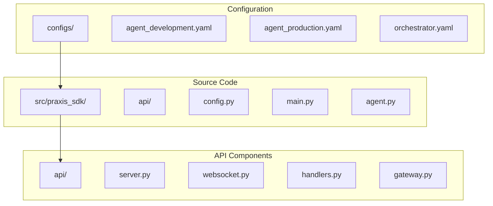
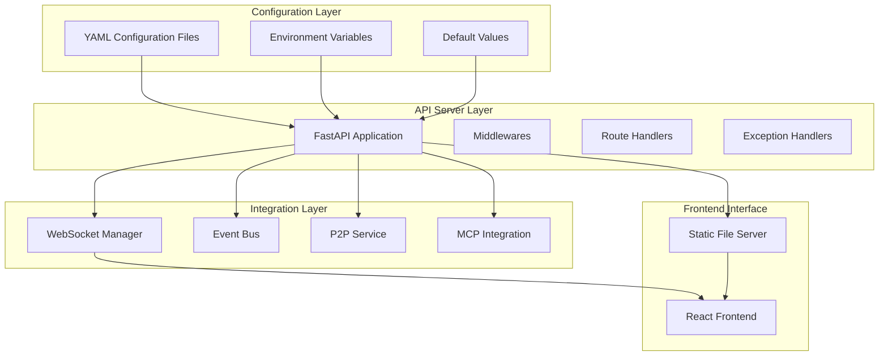
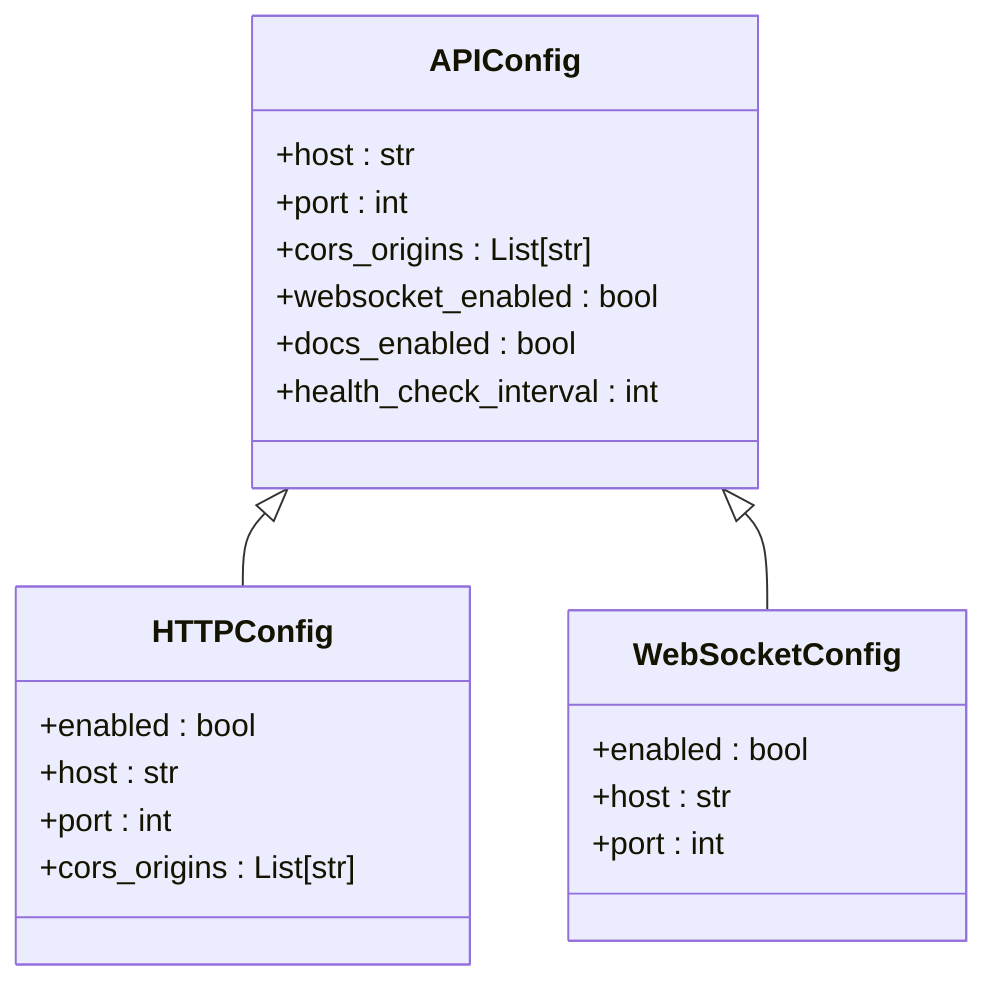
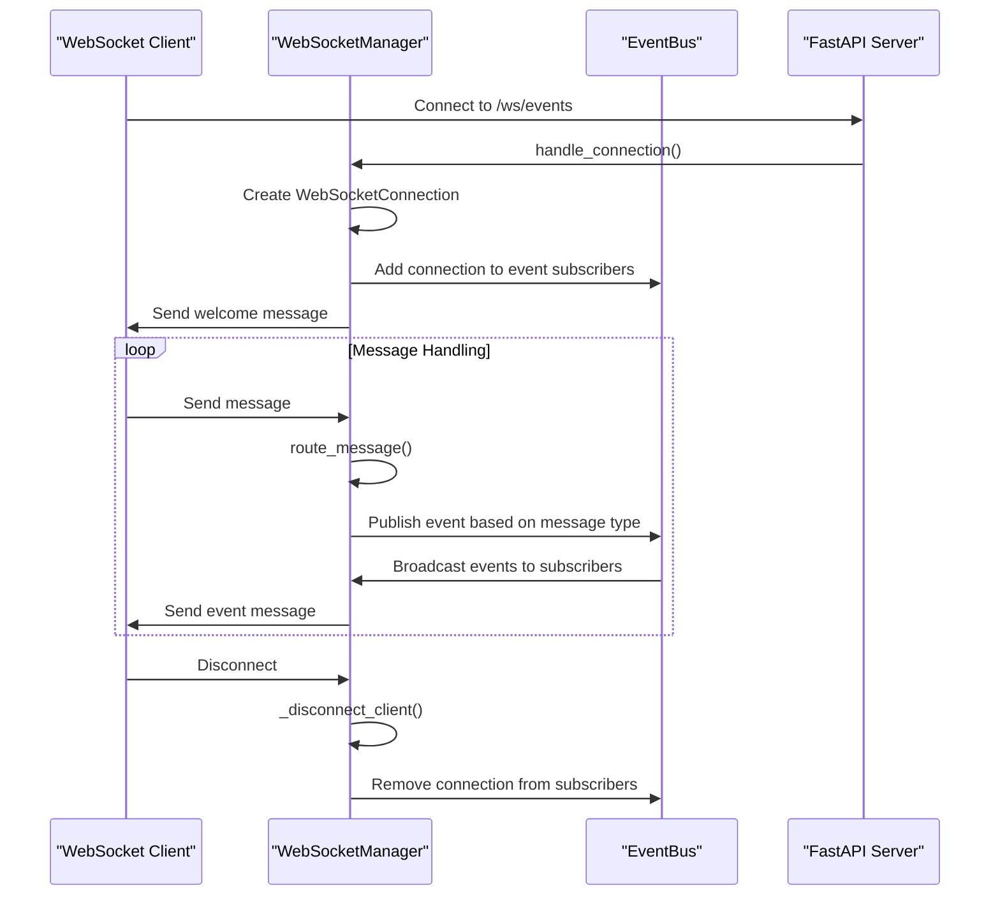
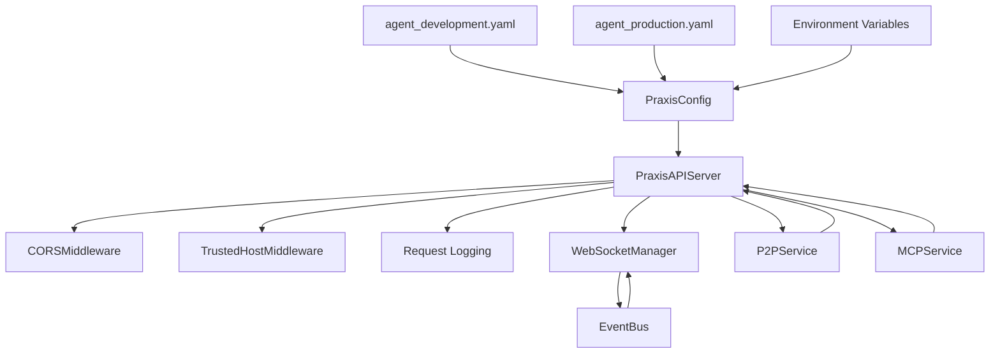

# API and Web Interface Configuration


## Table of Contents
1. [Introduction](#introduction)
2. [Project Structure](#project-structure)
3. [Core Components](#core-components)
4. [Architecture Overview](#architecture-overview)
5. [Detailed Component Analysis](#detailed-component-analysis)
6. [Dependency Analysis](#dependency-analysis)
7. [Performance Considerations](#performance-considerations)
8. [Troubleshooting Guide](#troubleshooting-guide)
9. [Conclusion](#conclusion)

## Introduction
This document provides comprehensive documentation for API and web interface configuration in the Praxis Python SDK. It covers HTTP/WebSocket endpoint settings, configuration options such as host binding, port assignment, CORS policies, and API versioning. The document explains how API settings in YAML files control the behavior of the FastAPI server, including debug mode, logging verbosity, and SSL termination. It also illustrates secure API endpoint configurations with authentication tokens and rate limiting, and addresses common configuration errors and best practices for production environments.

## Project Structure
The Praxis Python SDK is organized into a modular structure with clear separation of concerns. The configuration files are located in the `configs` directory, while the core API implementation resides in `src/praxis_sdk/api`. The project follows a component-based architecture with distinct modules for different functionalities such as P2P communication, MCP integration, and workflow execution.



**Diagram sources**
- [server.py](file://src/praxis_sdk/api/server.py)
- [config.py](file://src/praxis_sdk/config.py)

**Section sources**
- [server.py](file://src/praxis_sdk/api/server.py)
- [config.py](file://src/praxis_sdk/config.py)

## Core Components
The core components of the API and web interface configuration system include the FastAPI server implementation, configuration management system, and WebSocket manager. These components work together to provide a robust and flexible API infrastructure that can be easily configured for different environments and use cases.

The `PraxisAPIServer` class in `server.py` serves as the main entry point for the API, integrating FastAPI with the Praxis SDK's event-driven architecture. The configuration system, implemented in `config.py`, provides a hierarchical structure for managing settings across different environments and components.

**Section sources**
- [server.py](file://src/praxis_sdk/api/server.py#L1-L100)
- [config.py](file://src/praxis_sdk/config.py#L1-L100)

## Architecture Overview
The API architecture follows a layered approach with clear separation between configuration, routing, middleware, and business logic. The FastAPI application is configured through YAML files that define settings for HTTP, WebSocket, P2P, and other components. These settings are loaded into a configuration object that is used to initialize the API server.



**Diagram sources**
- [server.py](file://src/praxis_sdk/api/server.py#L1-L50)
- [config.py](file://src/praxis_sdk/config.py#L1-L30)

## Detailed Component Analysis

### API Server Configuration
The API server configuration is managed through the `APIConfig` class in `config.py`, which defines settings for host binding, port assignment, CORS policies, and documentation endpoints. These settings can be overridden by environment variables, allowing for flexible deployment across different environments.



**Diagram sources**
- [config.py](file://src/praxis_sdk/config.py#L139-L181)

**Section sources**
- [config.py](file://src/praxis_sdk/config.py#L139-L181)

### HTTP Server Implementation
The HTTP server implementation in `server.py` sets up the FastAPI application with middleware for CORS, request logging, and trusted host filtering. The server configuration is highly customizable, allowing for different settings in development and production environments.

```python
def _setup_middleware(self, app: FastAPI):
    """Setup FastAPI middleware."""
    
    # CORS middleware
    app.add_middleware(
        CORSMiddleware,
        allow_origins=self.config.api.cors_origins,
        allow_credentials=True,
        allow_methods=["*"],
        allow_headers=["*"],
    )
    
    # Trusted host middleware (for production)
    if self.config.environment == "production":
        app.add_middleware(
            TrustedHostMiddleware,
            allowed_hosts=["localhost", "127.0.0.1", "0.0.0.0"]
        )
    
    # Custom request logging middleware
    @app.middleware("http")
    async def log_requests(request, call_next):
        start_time = trio.current_time()
        response = await call_next(request)
        process_time = trio.current_time() - start_time
        
        logger.info(
            f"{request.method} {request.url.path} - "
            f"Status: {response.status_code} - "
            f"Time: {process_time:.3f}s"
        )
        return response
```

**Section sources**
- [server.py](file://src/praxis_sdk/api/server.py#L133-L176)

### WebSocket Configuration and Management
The WebSocket configuration is handled by the `WebSocketManager` class in `websocket.py`, which provides comprehensive connection management, event streaming, and real-time communication capabilities. The manager integrates with the event bus to broadcast events to connected clients and supports message routing and handling.



**Diagram sources**
- [websocket.py](file://src/praxis_sdk/api/websocket.py#L1-L50)

**Section sources**
- [websocket.py](file://src/praxis_sdk/api/websocket.py#L1-L100)

### Configuration File Structure
The configuration files in the `configs` directory define environment-specific settings for the Praxis agents. The structure follows a hierarchical pattern with common settings and environment-specific overrides. The configuration system supports both development and production environments with different security, performance, and logging settings.

```yaml
# agent_development.yaml
http:
  enabled: true
  port: 8000
  host: "0.0.0.0"
  cors_origins:
    - "http://localhost:3000"
    - "http://localhost:3001"

websocket:
  enabled: true
  port: 8090
  host: "0.0.0.0"
  path: "/ws/workflow"
  ping_interval: 30
  max_connections: 50
```

```yaml
# agent_production.yaml
http:
  enabled: true
  port: 8000
  host: "0.0.0.0"
  cors_origins:
    - "https://app.praxis.example.com"
    - "https://dashboard.praxis.example.com"
  max_connections: 1000
  request_timeout: 60

websocket:
  enabled: true
  port: 8090
  host: "0.0.0.0"
  path: "/ws/workflow"
  ping_interval: 30
  ping_timeout: 10
  max_connections: 500
  message_size_limit: 2097152  # 2MB
```

**Section sources**
- [agent_development.yaml](file://configs/agent_development.yaml)
- [agent_production.yaml](file://configs/agent_production.yaml)

### API Endpoint Configuration
The API endpoints are configured through the `_setup_routes` method in `server.py`, which defines various endpoints for health checking, agent card retrieval, task management, tool invocation, and P2P operations. The endpoints follow REST principles and include both standard and legacy routes for backward compatibility.

```python
def _setup_routes(self, app: FastAPI):
    """Setup API routes."""
    
    # Health endpoint
    @app.get("/health")
    async def health_check():
        return await get_request_handlers().handle_health_check()
    
    # Agent card endpoint
    @app.get("/agent/card", response_model=A2AAgentCard)
    async def get_agent_card():
        return await get_request_handlers().handle_get_agent_card()
    
    # Main execution endpoint (A2A standard)
    @app.post("/execute")
    async def execute_command_a2a(request: dict, background_tasks: BackgroundTasks):
        """Main A2A execution endpoint supporting JSON-RPC 2.0"""
        return await get_request_handlers().handle_execute_command(request, background_tasks)
    
    # Legacy command execution endpoint
    @app.post("/agent/execute") 
    async def execute_command_legacy(request: dict, background_tasks: BackgroundTasks):
        """Legacy execution endpoint for backward compatibility"""
        return await get_request_handlers().handle_execute_command(request, background_tasks)
```

**Section sources**
- [server.py](file://src/praxis_sdk/api/server.py#L178-L250)

## Dependency Analysis
The API and web interface components have well-defined dependencies on the configuration system, event bus, and P2P services. The dependency graph shows how configuration settings flow from YAML files to the API server, which then integrates with other components through the event bus.



**Diagram sources**
- [config.py](file://src/praxis_sdk/config.py)
- [server.py](file://src/praxis_sdk/api/server.py)
- [websocket.py](file://src/praxis_sdk/api/websocket.py)

**Section sources**
- [config.py](file://src/praxis_sdk/config.py)
- [server.py](file://src/praxis_sdk/api/server.py)
- [websocket.py](file://src/praxis_sdk/api/websocket.py)

## Performance Considerations
The API configuration includes several performance-related settings that can be tuned for different environments. In production, the server is configured with higher connection limits, longer timeouts, and optimized logging to handle increased load. The WebSocket manager includes connection pooling and message batching to improve real-time communication efficiency.

Key performance settings include:
- **Connection limits**: Configurable maximum connections for HTTP and WebSocket
- **Timeout settings**: Request and connection timeouts to prevent resource exhaustion
- **Logging verbosity**: Configurable logging levels to balance debugging information with performance
- **Message size limits**: Protection against large message payloads in WebSocket connections
- **Heartbeat monitoring**: Regular health checks to maintain connection integrity

These settings should be carefully tuned based on the expected load and infrastructure capabilities. In production environments, it's recommended to use reverse proxies and load balancers to distribute traffic and provide additional security layers.

## Troubleshooting Guide
Common configuration issues and their solutions:

### Port Conflicts
**Issue**: "Address already in use" error when starting the server.
**Solution**: Check if the configured port is already in use by another process. Use the `lsof` or `netstat` command to identify conflicting processes, or change the port in the configuration file.

```bash
# Check if port 8000 is in use
lsof -i :8000
# Or
netstat -an | grep 8000
```

### Invalid CORS Origins
**Issue**: Browser console shows CORS errors when accessing the API.
**Solution**: Verify that the origin in the browser matches exactly with the entries in the `cors_origins` list in the configuration file. Remember that protocol (http vs https), port, and trailing slashes all matter.

```yaml
# Correct configuration for development
cors_origins:
  - "http://localhost:3000"
  - "http://localhost:3001"

# Correct configuration for production
cors_origins:
  - "https://app.praxis.example.com"
  - "https://dashboard.praxis.example.com"
```

### Missing SSL Certificates
**Issue**: SSL handshake failures when using HTTPS.
**Solution**: Ensure that SSL certificate and key files are present at the specified paths and have correct permissions. Verify the file paths in the security configuration.

```yaml
security:
  tls_cert_path: "/path/to/certificate.crt"
  tls_key_path: "/path/to/private.key"
```

### WebSocket Connection Issues
**Issue**: WebSocket connections fail to establish or disconnect frequently.
**Solution**: Check the WebSocket configuration settings, particularly the ping interval and timeout values. Ensure that any intermediate proxies or firewalls allow WebSocket connections (upgrade requests).

```yaml
websocket:
  ping_interval: 30
  ping_timeout: 10
  max_connections: 500
```

**Section sources**
- [agent_development.yaml](file://configs/agent_development.yaml)
- [agent_production.yaml](file://configs/agent_production.yaml)
- [server.py](file://src/praxis_sdk/api/server.py)
- [websocket.py](file://src/praxis_sdk/api/websocket.py)

## Conclusion
The API and web interface configuration system in the Praxis Python SDK provides a flexible and robust foundation for building distributed agent applications. By leveraging YAML configuration files and environment variables, developers can easily customize the behavior of the API server for different environments and use cases.

Key takeaways:
- Configuration is hierarchical, with defaults, YAML files, and environment variables
- Security settings differ between development and production environments
- Performance can be tuned through connection limits, timeouts, and logging settings
- The system supports both REST and WebSocket communication patterns
- Proper configuration is essential for secure and reliable operation in production

Best practices include using environment-specific configuration files, validating configurations before deployment, and monitoring API performance and error rates in production environments.

**Referenced Files in This Document**   
- [server.py](file://src/praxis_sdk/api/server.py)
- [config.py](file://src/praxis_sdk/config.py)
- [websocket.py](file://src/praxis_sdk/api/websocket.py)
- [agent_development.yaml](file://configs/agent_development.yaml)
- [agent_production.yaml](file://configs/agent_production.yaml)