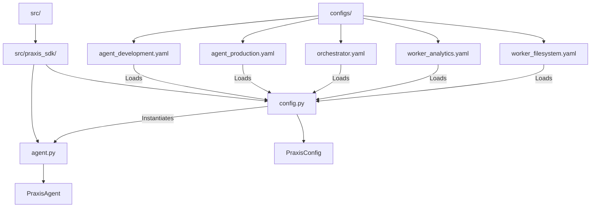
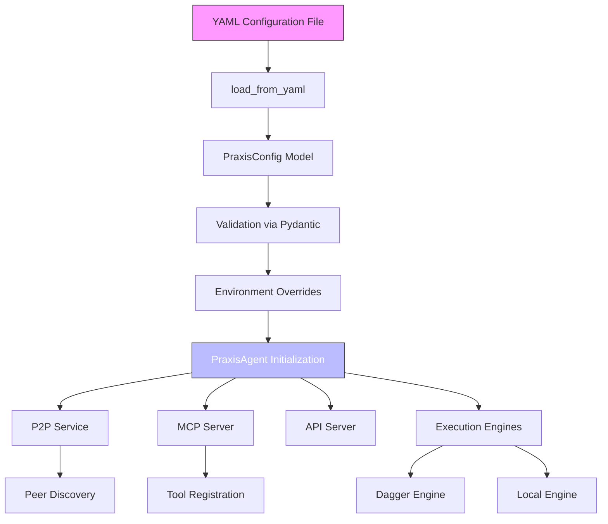
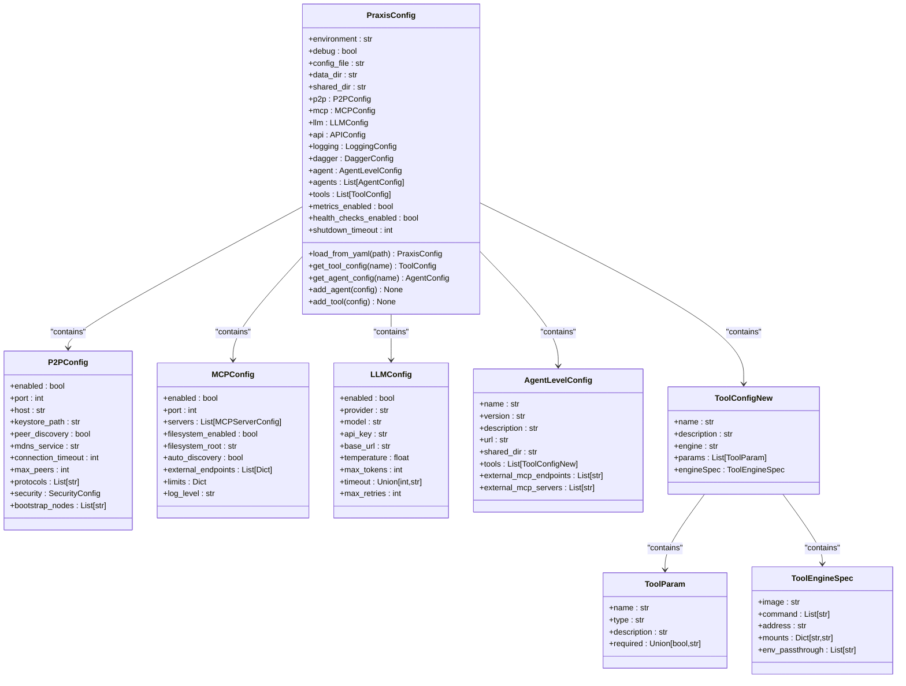
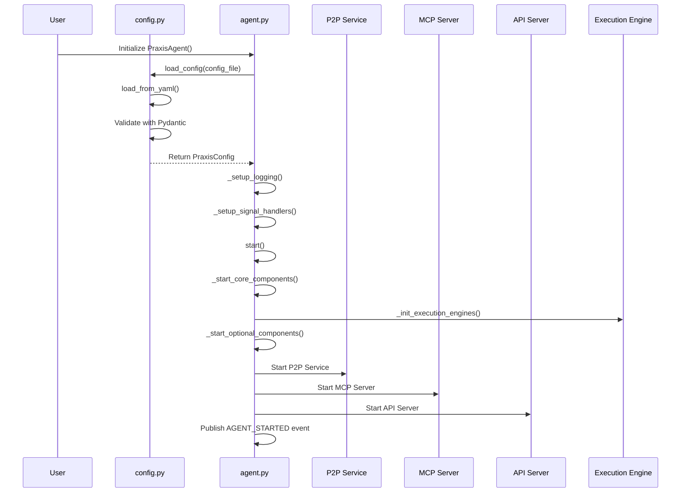
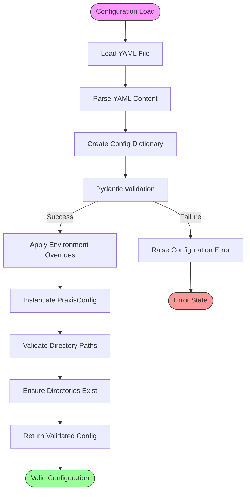
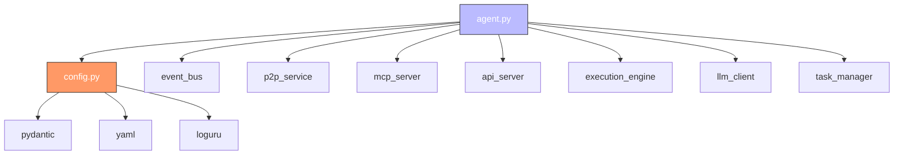

# Agent Configuration

## Table of Contents
1. [Introduction](#introduction)
2. [Project Structure](#project-structure)
3. [Core Components](#core-components)
4. [Architecture Overview](#architecture-overview)
5. [Detailed Component Analysis](#detailed-component-analysis)
6. [Dependency Analysis](#dependency-analysis)
7. [Performance Considerations](#performance-considerations)
8. [Troubleshooting Guide](#troubleshooting-guide)
9. [Conclusion](#conclusion)

## Introduction
This document provides a comprehensive guide to agent configuration within the Praxis Python SDK. It details how agents are defined, their capabilities declared, and operational parameters set through YAML configuration files. The document explains the structure of agent-specific configurations, how these are validated using Pydantic models, and how they influence system behavior such as P2P discovery, task routing, and execution engine selection. Special attention is given to differences between development and production environments, best practices for multi-agent setups, and common misconfiguration issues.

## Project Structure
The Praxis SDK organizes agent configurations in a dedicated `configs/` directory with distinct YAML files for different agent types and environments. This modular approach enables flexible deployment scenarios and environment-specific tuning.

**Diagram sources**
- [config.py](file://src/praxis_sdk/config.py)
- [agent.py](file://src/praxis_sdk/agent.py)

**Section sources**
- [config.py](file://src/praxis_sdk/config.py)
- [agent.py](file://src/praxis_sdk/agent.py)

## Core Components
The agent configuration system is built around two core components: the `PraxisConfig` class in `config.py` which defines the data model and validation logic, and the `PraxisAgent` class in `agent.py` which consumes and acts upon these configurations. The system uses Pydantic for robust configuration validation and supports loading from YAML files with environment variable overrides.

**Section sources**
- [config.py](file://src/praxis_sdk/config.py#L1-L412)
- [agent.py](file://src/praxis_sdk/agent.py#L1-L1088)

## Architecture Overview
The agent configuration architecture follows a layered approach where YAML configuration files are parsed into Pydantic models, which are then used to instantiate and configure agent behavior. This design ensures type safety, validation, and clear separation between configuration data and runtime behavior.

**Diagram sources**
- [config.py](file://src/praxis_sdk/config.py#L300-L400)
- [agent.py](file://src/praxis_sdk/agent.py#L50-L100)

## Detailed Component Analysis

### Configuration Model Analysis
The `PraxisConfig` class serves as the central configuration model, composed of several nested Pydantic models that represent different subsystems.

**Diagram sources**
- [config.py](file://src/praxis_sdk/config.py#L100-L300)

**Section sources**
- [config.py](file://src/praxis_sdk/config.py#L100-L300)

### Agent Initialization Flow
The agent initialization process follows a well-defined sequence from configuration loading to component startup.

**Diagram sources**
- [config.py](file://src/praxis_sdk/config.py#L300-L400)
- [agent.py](file://src/praxis_sdk/agent.py#L150-L300)

**Section sources**
- [agent.py](file://src/praxis_sdk/agent.py#L150-L300)

### Configuration Loading and Validation
The configuration system uses Pydantic for robust validation and type checking, ensuring that all configuration values meet required specifications before agent startup.

**Diagram sources**
- [config.py](file://src/praxis_sdk/config.py#L300-L400)

**Section sources**
- [config.py](file://src/praxis_sdk/config.py#L300-L400)

## Dependency Analysis
The agent configuration system has a clear dependency hierarchy where the agent depends on the configuration, which in turn validates and provides parameters to various subsystems.

**Diagram sources**
- [config.py](file://src/praxis_sdk/config.py)
- [agent.py](file://src/praxis_sdk/agent.py)

**Section sources**
- [config.py](file://src/praxis_sdk/config.py)
- [agent.py](file://src/praxis_sdk/agent.py)

## Performance Considerations
Configuration loading is a critical path operation that occurs at agent startup. The current implementation uses synchronous file I/O and YAML parsing, which could become a bottleneck with very large configuration files. However, for typical use cases, the performance impact is negligible. The use of Pydantic validation adds some overhead but provides significant benefits in terms of configuration correctness and error reporting.

## Troubleshooting Guide
Common configuration issues and their solutions:

**Section sources**
- [config.py](file://src/praxis_sdk/config.py)
- [agent.py](file://src/praxis_sdk/agent.py)

### Missing Configuration File
**Issue**: `FileNotFoundError: Configuration file not found`
**Solution**: Ensure the specified configuration file exists at the given path. Use the `config_file` parameter or set the `PRAXIS_CONFIG_FILE` environment variable.

### Invalid YAML Syntax
**Issue**: `yaml.YAMLError: unacceptable character`
**Solution**: Validate YAML syntax using a YAML validator. Common issues include improper indentation, unquoted special characters, or incorrect list formatting.

### Missing Required Fields
**Issue**: `ValidationError: field required`
**Solution**: Check the Pydantic model definitions in `config.py` for required fields. Ensure all mandatory fields are present in the YAML configuration.

### Environment Variable Not Resolved
**Issue**: `LLMConfig` fails to load API key despite environment variable being set
**Solution**: Ensure environment variables are available when the agent starts. The configuration system looks for `OPENAI_API_KEY` when `api_key` is not specified in the configuration.

### P2P Connection Issues
**Issue**: Agents cannot discover each other in P2P network
**Solution**: Verify `bootstrap_nodes` configuration and ensure `rendezvous` values match across agents that should connect. Check firewall settings for the configured P2P port.

### Tool Execution Failures
**Issue**: Tools fail to execute with "engine not available" error
**Solution**: Verify the required execution engine (Dagger, local, etc.) is properly configured and available. For Dagger, ensure the Dagger SDK is correctly installed.

## Conclusion
The agent configuration system in the Praxis Python SDK provides a robust, type-safe approach to defining agent identity, capabilities, and operational parameters. By leveraging Pydantic models and YAML configuration files, it offers a balance of flexibility and validation that supports both development and production use cases. The system enables fine-grained control over agent behavior, from P2P networking parameters to execution engine selection, and supports complex multi-agent architectures through specialized configuration files for different agent roles.

**Referenced Files in This Document**   
- [config.py](file://src/praxis_sdk/config.py)
- [agent.py](file://src/praxis_sdk/agent.py)
- [agent_development.yaml](file://configs/agent_development.yaml)
- [agent_production.yaml](file://configs/agent_production.yaml)
- [orchestrator.yaml](file://configs/orchestrator.yaml)
- [worker_analytics.yaml](file://configs/worker_analytics.yaml)
- [worker_filesystem.yaml](file://configs/worker_filesystem.yaml)