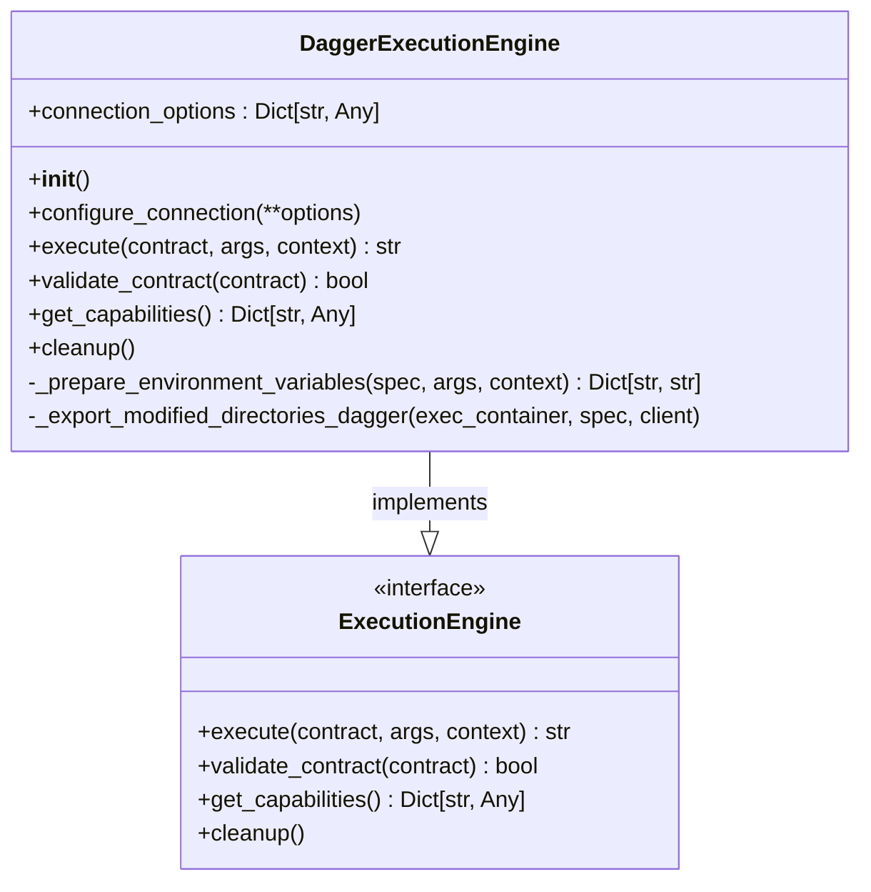
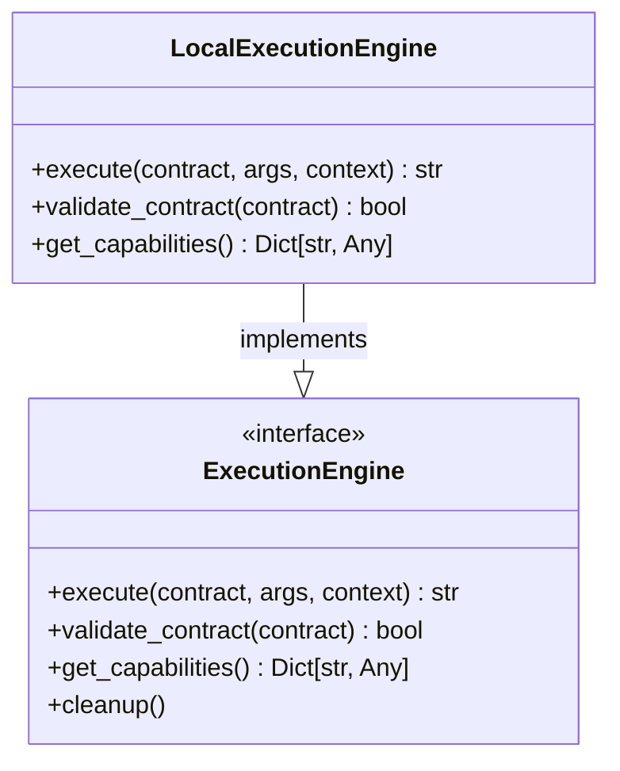
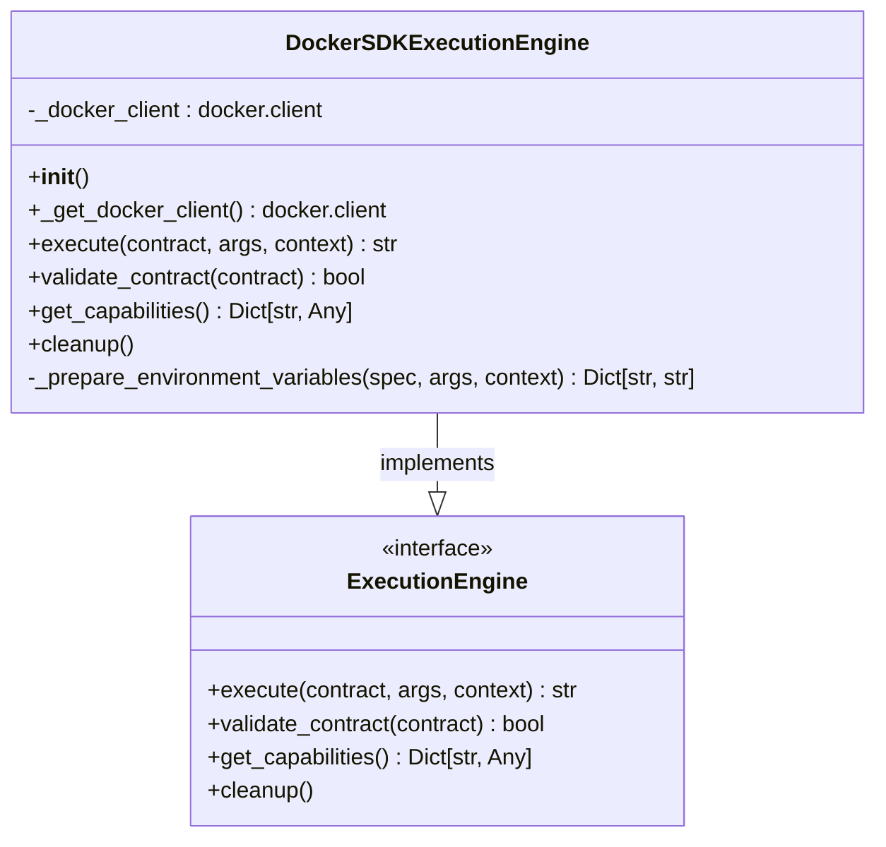
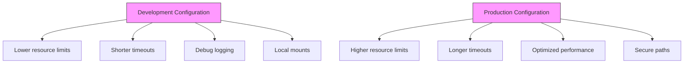
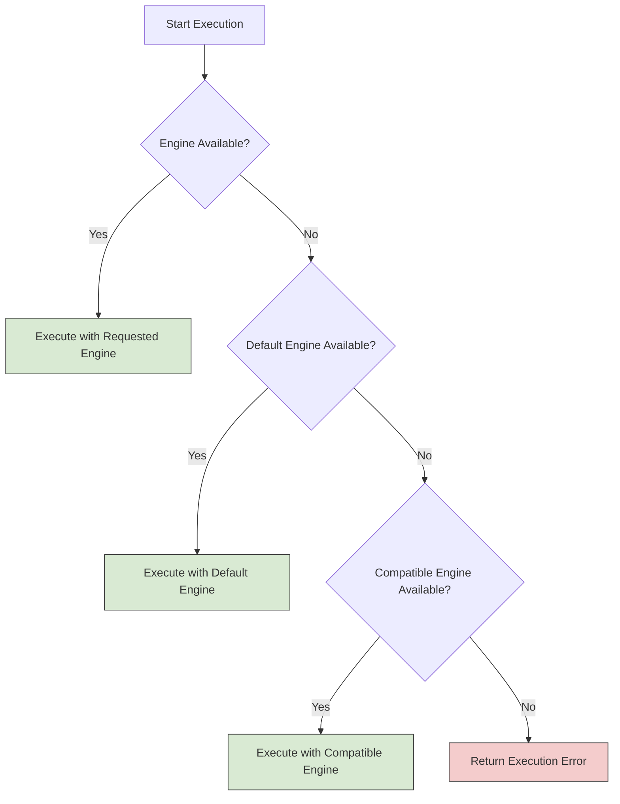
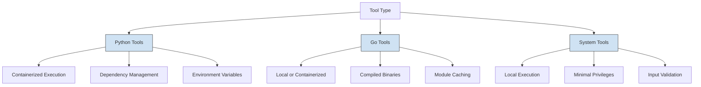
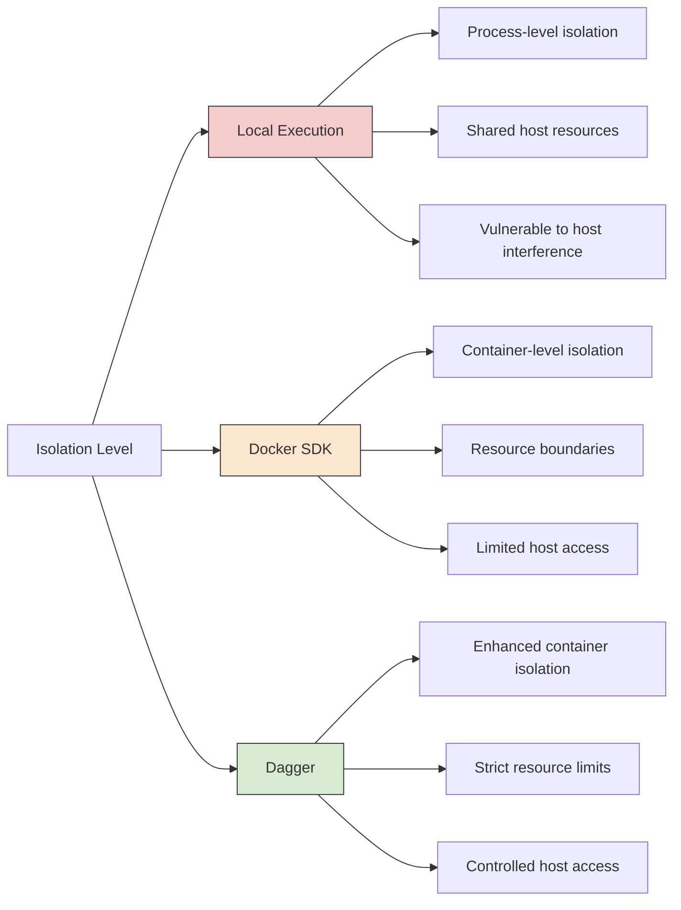

# Execution Engine Configuration


## Table of Contents
1. [Introduction](#introduction)
2. [Execution Engine Types](#execution-engine-types)
3. [Configuration via YAML](#configuration-via-yaml)
4. [Engine Selection and Fallback Mechanisms](#engine-selection-and-fallback-mechanisms)
5. [Tool-Specific Execution Environments](#tool-specific-execution-environments)
6. [Performance, Isolation, and Security Implications](#performance-isolation-and-security-implications)
7. [Common Issues and Troubleshooting](#common-issues-and-troubleshooting)
8. [Optimization Strategies](#optimization-strategies)
9. [Conclusion](#conclusion)

## Introduction

The Praxis Python SDK provides a flexible execution engine framework that supports multiple execution backends for running tools in isolated environments. This document details the configuration and usage of containerized (Dagger, Docker SDK) and local execution engines, focusing on runtime settings, resource constraints, and operational best practices. The system enables secure, reproducible, and scalable tool execution across development and production environments.

**Section sources**
- [engine.py](file://src/praxis_sdk/execution/engine.py#L0-L1052)
- [contracts.py](file://src/praxis_sdk/execution/contracts.py#L0-L378)

## Execution Engine Types

The SDK implements three primary execution engines, each designed for different use cases and operational requirements.

### DaggerExecutionEngine

The `DaggerExecutionEngine` leverages the Dagger.io platform to execute tools in containerized environments using the official Python SDK. It provides strong isolation, reproducibility, and advanced container orchestration capabilities.

**Key Features:**
- Containerized execution via Dagger
- Automatic dependency management
- Built-in logging and output streaming
- Directory mounting and export
- Environment variable injection
- Cache-busting mechanism



**Diagram sources**
- [engine.py](file://src/praxis_sdk/execution/engine.py#L100-L399)

**Section sources**
- [engine.py](file://src/praxis_sdk/execution/engine.py#L100-L399)

### LocalExecutionEngine

The `LocalExecutionEngine` executes tools directly on the host system using Python's `asyncio.subprocess`. This engine is suitable for lightweight operations and development scenarios where containerization overhead is unnecessary.

**Key Features:**
- Direct subprocess execution
- Shell command support
- Working directory specification
- Environment variable propagation
- Output capture and timeout handling



**Diagram sources**
- [engine.py](file://src/praxis_sdk/execution/engine.py#L400-L520)

**Section sources**
- [engine.py](file://src/praxis_sdk/execution/engine.py#L400-L520)

### DockerSDKExecutionEngine

The `DockerSDKExecutionEngine` serves as a fallback containerization solution when Dagger is unavailable. It uses the Docker Python SDK to manage container lifecycles directly.

**Key Features:**
- Direct Docker daemon communication
- Volume mounting support
- Environment variable configuration
- Container lifecycle management
- Error handling and cleanup



**Diagram sources**
- [engine.py](file://src/praxis_sdk/execution/engine.py#L521-L700)

**Section sources**
- [engine.py](file://src/praxis_sdk/execution/engine.py#L521-L700)

## Configuration via YAML

Execution engine behavior is controlled through YAML configuration files that define default settings, resource limits, and engine-specific parameters.

### Global Execution Settings

The `execution` section in agent configuration files controls overall execution behavior:

```yaml
execution:
  default_engine: "dagger"
  dagger:
    enabled: true
    session_timeout: 300
    default_image: "python:3.11-slim"
    mount_docker_socket: true
    resource_limits:
      cpu: "1000m"
      memory: "512Mi"
  enable_sandboxing: true
  max_execution_time: 600
  cleanup_temp_files: true
```

**Configuration Parameters:**
- **default_engine**: Specifies the default execution engine (`dagger`, `local`)
- **dagger.enabled**: Enables or disables Dagger engine
- **dagger.session_timeout**: Maximum duration for Dagger sessions (seconds)
- **dagger.default_image**: Default container image for Dagger executions
- **dagger.mount_docker_socket**: Whether to mount Docker socket for nested containerization
- **dagger.resource_limits**: CPU and memory constraints for containers
- **enable_sandboxing**: Enables isolated execution environments
- **max_execution_time**: Global maximum execution time (seconds)
- **cleanup_temp_files**: Automatically removes temporary files after execution

### Development vs Production Configuration

**Development Environment** (`agent_development.yaml`):
- Lower resource limits
- Shorter timeouts
- Debug logging enabled
- Local file system mounts
- Development-focused tooling

**Production Environment** (`agent_production.yaml`):
- Higher resource limits
- Longer timeouts
- Optimized performance settings
- Secure file paths
- Production-grade tooling



**Section sources**
- [agent_development.yaml](file://configs/agent_development.yaml#L0-L172)
- [agent_production.yaml](file://configs/agent_production.yaml#L0-L166)

## Engine Selection and Fallback Mechanisms

The system uses a registry pattern to manage multiple execution engines and provides flexible selection mechanisms.

### Engine Registry

The `EngineRegistry` class manages engine instances and provides lookup functionality:

```python
class EngineRegistry:
    def __init__(self):
        self._engines: Dict[str, ExecutionEngine] = {}
        self._default_engine: Optional[str] = None
    
    def register(self, name: str, engine: ExecutionEngine, is_default: bool = False):
        """Register an execution engine."""
        self._engines[name] = engine
        if is_default or not self._default_engine:
            self._default_engine = name
    
    def get(self, name: Optional[str] = None) -> ExecutionEngine:
        """Get an execution engine by name."""
        engine_name = name or self._default_engine
        if not engine_name:
            raise KeyError("No engines registered")
        if engine_name not in self._engines:
            raise KeyError(f"Engine '{engine_name}' not found")
        return self._engines[engine_name]
```

### Tool-Level Engine Specification

Tools can specify their preferred execution engine in their contract:

```yaml
tools:
  - name: "python_analyzer"
    description: "Analyze data using an external Python script via Dagger"
    engine: "dagger"
    engineSpec:
      image: "python:3.11-slim"
      command: ["python", "/shared/analyzer.py"]
      mounts:
        ./shared: /shared
```

### Fallback Strategy

When the requested engine is unavailable, the system follows this fallback sequence:
1. Use the engine specified in the tool contract
2. Fall back to the default engine configured in YAML
3. Attempt execution with alternative compatible engines
4. Return an error if no suitable engine is available



**Section sources**
- [contracts.py](file://src/praxis_sdk/execution/contracts.py#L305-L348)
- [agent.py](file://src/praxis_sdk/agent.py#L751-L789)

## Tool-Specific Execution Environments

Different tool types require specific execution configurations to ensure proper functionality.

### Python Tools

Python-based tools typically use containerized execution with proper dependency management:

```yaml
name: python_data_processor
engine: dagger
engine_spec:
  image: "python:3.11-slim"
  command:
    - "python"
    - "/app/tools/python_data_processor/main.py"
  mounts:
    "/app/tools": "/app/tools"
    "/app/data": "/app/data"
  env:
    PYTHONPATH: "/app"
    PYTHONIOENCODING: "utf-8"
    PYTHONUNBUFFERED: "1"
  env_passthrough:
    - "PATH"
    - "HOME"
```

**Best Practices:**
- Use minimal Python base images
- Mount code and data directories
- Set appropriate Python environment variables
- Pass through essential host environment variables
- Specify reasonable timeouts based on expected workload

### Go Tools

Go tools can be executed either locally or in containers, depending on complexity:

```yaml
name: go_hello_world
engine: local
engine_spec:
  command: ["go", "run", "main.go"]
  shell: false
  cwd: "/app/tools/go_hello_world"
  timeout: 60
```

**Best Practices:**
- Compile binaries for production use
- Use local execution for simple scripts
- Use containerized execution for complex dependencies
- Set appropriate working directories
- Manage Go module caching

### System Tools

System-level tools require careful configuration to balance functionality and security:

```yaml
name: system_info
engine: local
engine_spec:
  command: ["uname", "-a"]
  shell: false
  timeout: 30
  capture_output: true
```

**Best Practices:**
- Use local execution for system commands
- Minimize required privileges
- Validate input parameters
- Implement strict timeouts
- Log execution for audit purposes



**Section sources**
- [python_data_processor/contract.yaml](file://tools/python_data_processor/contract.yaml#L0-L96)
- [simple_python_tool/contract.yaml](file://tools/simple_python_tool/contract.yaml#L0-L15)

## Performance, Isolation, and Security Implications

The choice of execution engine significantly impacts performance, isolation, and security characteristics.

### Performance Characteristics

| Engine | Startup Time | Memory Overhead | CPU Overhead | I/O Performance |
|--------|--------------|-----------------|--------------|-----------------|
| Local | Low | None | None | High |
| Dagger | Medium | Medium | Medium | Medium |
| Docker SDK | Medium | Medium | Medium | Medium |

**Optimization Tips:**
- Use local execution for frequent, lightweight operations
- Leverage container caching for repeated executions
- Pre-pull commonly used container images
- Mount host caches (e.g., pip cache) to reduce download times
- Use resource limits to prevent single tools from consuming excessive resources

### Isolation Levels



### Security Considerations

**Local Execution:**
- Highest performance but lowest isolation
- Full access to host system
- Suitable for trusted tools in controlled environments

**Containerized Execution:**
- Strong process and filesystem isolation
- Resource limits prevent denial-of-service
- Network isolation by default
- Capability dropping possible
- Suitable for untrusted or third-party tools

**Best Practices:**
- Use containerized execution for untrusted code
- Apply principle of least privilege
- Regularly update base images
- Scan container images for vulnerabilities
- Monitor execution for anomalous behavior

**Section sources**
- [engine.py](file://src/praxis_sdk/execution/engine.py#L0-L1052)
- [agent_development.yaml](file://configs/agent_development.yaml#L0-L172)
- [agent_production.yaml](file://configs/agent_production.yaml#L0-L166)

## Common Issues and Troubleshooting

### Container Startup Failures

**Symptoms:**
- Timeout errors during container creation
- Image not found errors
- Permission denied on mount points

**Solutions:**
- Verify Docker daemon is running
- Check container image availability
- Ensure mount directories exist and have proper permissions
- Validate network connectivity for image pulls

```python
try:
    container = client.container().from_(spec.image)
except ImageNotFound:
    logger.error(f"Image {spec.image} not found. Pulling...")
    # Handle image pull
```

### Resource Exhaustion

**Symptoms:**
- Tools failing with out-of-memory errors
- System slowdown during execution
- CPU saturation

**Solutions:**
- Configure appropriate resource limits in YAML
- Monitor resource usage and adjust limits
- Implement graceful degradation
- Use fallback engines with lower resource requirements

```yaml
execution:
  dagger:
    resource_limits:
      cpu: "2000m"
      memory: "1Gi"
```

### Permission Errors

**Symptoms:**
- File access denied errors
- Unable to write to mounted directories
- Environment variable access issues

**Solutions:**
- Ensure proper file ownership and permissions
- Use appropriate user IDs in containers
- Validate environment variable passthrough configuration
- Check SELinux/AppArmor policies if applicable

### Network Issues

**Symptoms:**
- Dependency installation failures
- External API access problems
- Slow download speeds

**Solutions:**
- Configure proxy settings if behind firewall
- Use local package caches
- Implement retry logic with backoff
- Validate network policies and firewalls

**Section sources**
- [engine.py](file://src/praxis_sdk/execution/engine.py#L0-L1052)
- [contracts.py](file://src/praxis_sdk/execution/contracts.py#L0-L378)

## Optimization Strategies

### High-Throughput Scenarios

For systems handling many concurrent tool executions:

**Connection Pooling:**
- Reuse Dagger and Docker connections
- Implement connection timeouts
- Monitor connection health

**Resource Management:**
- Set appropriate concurrency limits
- Implement queueing for resource-intensive tasks
- Use priority-based scheduling

```yaml
execution:
  max_execution_time: 1200
  enable_sandboxing: true
```

### Caching Strategies

**Container Image Caching:**
- Pre-pull frequently used images
- Use local registry mirrors
- Implement image prefetching

**Output Caching:**
- Cache results of expensive operations
- Implement cache invalidation based on inputs
- Use content-addressable storage

```python
# Cache busting mechanism
cache_bust = str(int(time.time() * 1000000000))
container = container.with_env_variable("CACHE_BUST", cache_bust)
```

### Startup Time Optimization

**For Python Tools:**
- Mount pip cache directory
- Use pre-installed base images
- Minimize container layers

```python
# Mount pip cache
if 'python' in spec.image.lower():
    pip_cache_dir = Path.home() / '.cache' / 'pip'
    if pip_cache_dir.exists():
        host_pip_cache = client.host().directory(str(pip_cache_dir))
        container = container.with_directory('/root/.cache/pip', host_pip_cache)
```

**Engine Selection Guidelines:**

| Workload Type | Recommended Engine | Rationale |
|---------------|-------------------|-----------|
| Simple scripts | Local | Minimal overhead |
| Data processing | Dagger | Strong isolation |
| System commands | Local | Direct access needed |
| Untrusted code | Dagger | Maximum isolation |
| Frequent executions | Local or cached Dagger | Reduced startup time |
| Production workloads | Dagger with limits | Predictable resource usage |

**Section sources**
- [engine.py](file://src/praxis_sdk/execution/engine.py#L0-L1052)
- [agent_production.yaml](file://configs/agent_production.yaml#L0-L166)

## Conclusion

The Praxis Python SDK provides a comprehensive execution engine framework that balances flexibility, performance, and security. By understanding the capabilities and configuration options of each engine type, developers can optimize their tool execution for specific workloads and environments. The system's modular design allows for easy extension and adaptation to various use cases, from development to production deployments. Proper configuration of resource limits, isolation settings, and fallback mechanisms ensures reliable and secure operation across diverse scenarios.

**Referenced Files in This Document**   
- [engine.py](file://src/praxis_sdk/execution/engine.py#L0-L1052)
- [contracts.py](file://src/praxis_sdk/execution/contracts.py#L0-L378)
- [agent_development.yaml](file://configs/agent_development.yaml#L0-L172)
- [agent_production.yaml](file://configs/agent_production.yaml#L0-L166)
- [python_data_processor/contract.yaml](file://tools/python_data_processor/contract.yaml#L0-L96)
- [simple_python_tool/contract.yaml](file://tools/simple_python_tool/contract.yaml#L0-L15)
- [agent.py](file://src/praxis_sdk/agent.py#L751-L789)