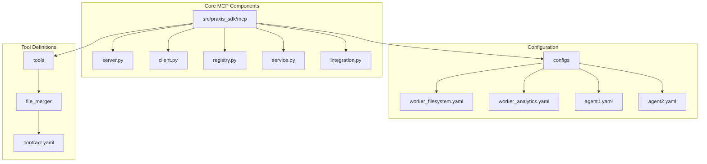
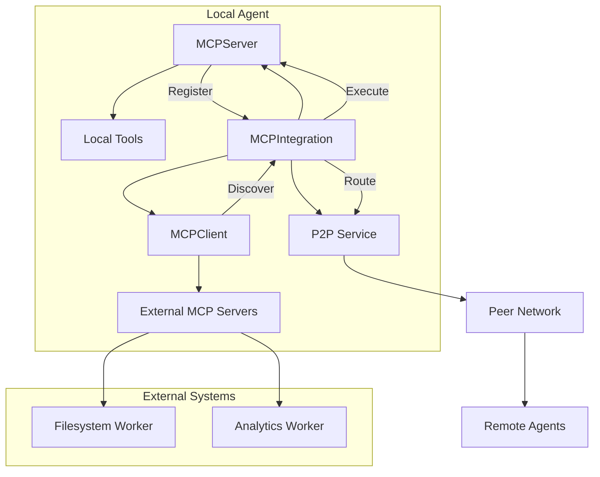
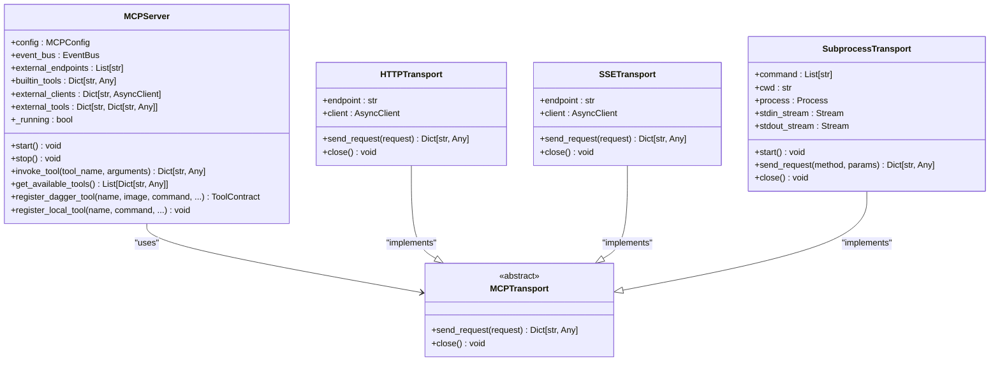
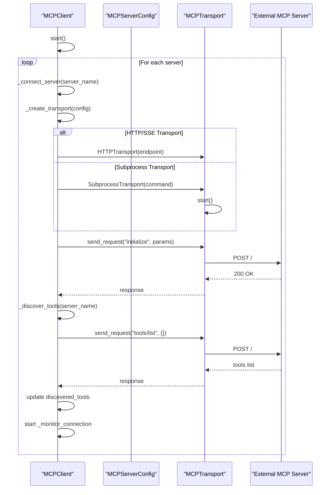
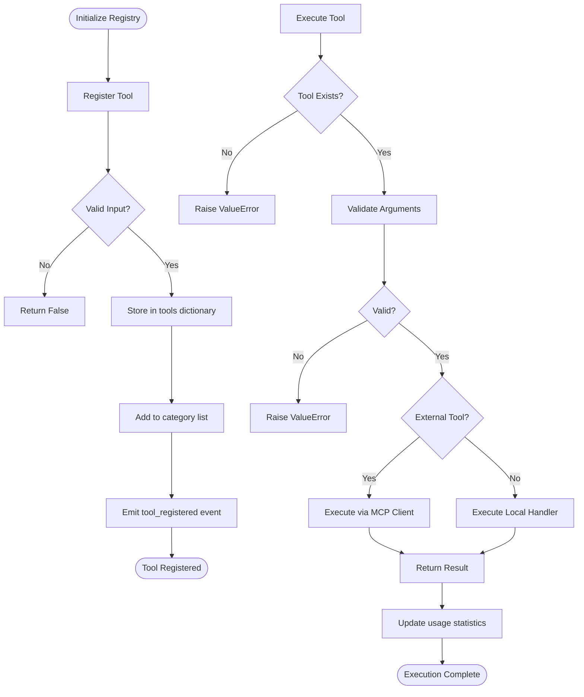
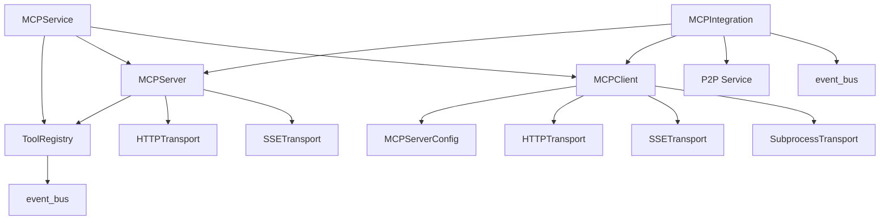

# MCP Integration Configuration

## Table of Contents
1. [Introduction](#introduction)
2. [Project Structure](#project-structure)
3. [Core Components](#core-components)
4. [Architecture Overview](#architecture-overview)
5. [Detailed Component Analysis](#detailed-component-analysis)
6. [Dependency Analysis](#dependency-analysis)
7. [Performance Considerations](#performance-considerations)
8. [Troubleshooting Guide](#troubleshooting-guide)
9. [Conclusion](#conclusion)

## Introduction
This document provides comprehensive documentation for MCP (Model Context Protocol) integration configuration within the Praxis SDK. It details the mechanisms for tool registration, discovery, and execution across distributed agents. The MCP system enables dynamic tool sharing between local and external services through standardized contracts and discovery protocols. This guide covers configuration parameters, server-client interactions, health monitoring, and best practices for secure and reliable tool integration.

## Project Structure
The MCP integration system is organized into a modular structure with clear separation of concerns. The core MCP functionality resides in the `src/praxis_sdk/mcp` directory, while configuration files are located in the `configs` directory. Tool definitions and contracts are stored in the `tools` directory.

**Diagram sources**
- [server.py](file://src/praxis_sdk/mcp/server.py#L0-L983)
- [client.py](file://src/praxis_sdk/mcp/client.py#L0-L391)
- [registry.py](file://src/praxis_sdk/mcp/registry.py#L0-L462)

**Section sources**
- [server.py](file://src/praxis_sdk/mcp/server.py#L0-L983)
- [client.py](file://src/praxis_sdk/mcp/client.py#L0-L391)
- [registry.py](file://src/praxis_sdk/mcp/registry.py#L0-L462)

## Core Components
The MCP integration system consists of several core components that work together to enable tool discovery and execution. The `MCPServer` handles local tool registration and execution, while the `MCPClient` manages connections to external MCP servers. The `ToolRegistry` maintains a centralized catalog of available tools, both local and external. The `MCPService` provides a unified interface for tool discovery and execution, and the `MCPIntegration` class coordinates between MCP components and the P2P network.

**Section sources**
- [server.py](file://src/praxis_sdk/mcp/server.py#L0-L983)
- [client.py](file://src/praxis_sdk/mcp/client.py#L0-L391)
- [registry.py](file://src/praxis_sdk/mcp/registry.py#L0-L462)
- [service.py](file://src/praxis_sdk/mcp/service.py#L0-L283)
- [integration.py](file://src/praxis_sdk/mcp/integration.py#L0-L479)

## Architecture Overview
The MCP architecture follows a distributed model where agents can expose their tools to other agents through standardized endpoints. Each agent runs an MCP server that exposes its local tools, and can connect to external MCP servers to access their tools. The integration layer connects the MCP system with the P2P network, enabling tool discovery and invocation across the network.

**Diagram sources**
- [integration.py](file://src/praxis_sdk/mcp/integration.py#L19-L56)
- [server.py](file://src/praxis_sdk/mcp/server.py#L0-L983)
- [client.py](file://src/praxis_sdk/mcp/client.py#L0-L391)

## Detailed Component Analysis

### MCPServer Analysis
The MCPServer component manages local tool registration and execution. It provides built-in tools for filesystem operations and system information, and can connect to external MCP servers to extend its capabilities.

#### For Object-Oriented Components:

**Diagram sources**
- [server.py](file://src/praxis_sdk/mcp/server.py#L0-L983)
- [client.py](file://src/praxis_sdk/mcp/client.py#L0-L391)

**Section sources**
- [server.py](file://src/praxis_sdk/mcp/server.py#L0-L983)

### MCPClient Analysis
The MCPClient component manages connections to external MCP servers, handling tool discovery, transport management, and automatic reconnection.

#### For API/Service Components:

**Diagram sources**
- [client.py](file://src/praxis_sdk/mcp/client.py#L0-L391)

**Section sources**
- [client.py](file://src/praxis_sdk/mcp/client.py#L0-L391)

### ToolRegistry Analysis
The ToolRegistry component maintains a centralized catalog of available tools, both local and external, with metadata and execution capabilities.

#### For Complex Logic Components:

**Diagram sources**
- [registry.py](file://src/praxis_sdk/mcp/registry.py#L0-L462)

**Section sources**
- [registry.py](file://src/praxis_sdk/mcp/registry.py#L0-L462)

## Dependency Analysis
The MCP components have a well-defined dependency structure that enables modular functionality while maintaining loose coupling between components.

**Diagram sources**
- [integration.py](file://src/praxis_sdk/mcp/integration.py#L19-L56)
- [service.py](file://src/praxis_sdk/mcp/service.py#L0-L283)
- [server.py](file://src/praxis_sdk/mcp/server.py#L0-L983)
- [client.py](file://src/praxis_sdk/mcp/client.py#L0-L391)

**Section sources**
- [integration.py](file://src/praxis_sdk/mcp/integration.py#L19-L56)
- [service.py](file://src/praxis_sdk/mcp/service.py#L0-L283)

## Performance Considerations
The MCP system is designed with performance in mind, using asynchronous operations throughout to maximize throughput and responsiveness. The registry uses a dictionary-based storage system for O(1) tool lookup, and all network operations are non-blocking. Connection pooling is used for HTTP transports to minimize connection overhead, and tools are cached after discovery to avoid repeated network requests. The system also includes comprehensive logging and monitoring to identify performance bottlenecks.

## Troubleshooting Guide
Common issues in MCP configuration typically involve connectivity problems, tool registration failures, or schema validation errors. When troubleshooting, first verify that the MCP server is running and accessible. Check the logs for connection errors or initialization failures. For tool discovery issues, ensure that the external endpoints are correctly configured in the agent configuration. Schema validation errors usually indicate a mismatch between the tool's expected parameters and the provided arguments. Health check intervals can be adjusted in the server configuration to accommodate slower external services.

**Section sources**
- [server.py](file://src/praxis_sdk/mcp/server.py#L0-L983)
- [client.py](file://src/praxis_sdk/mcp/client.py#L0-L391)
- [integration.py](file://src/praxis_sdk/mcp/integration.py#L0-L479)

## Conclusion
The MCP integration system provides a robust framework for tool discovery and execution in distributed agent environments. By standardizing tool interfaces and discovery mechanisms, it enables seamless collaboration between agents with different capabilities. The modular architecture allows for easy extension and integration with external services, while the comprehensive configuration options provide fine-grained control over tool availability and access. Proper configuration and monitoring are essential for maintaining reliable tool sharing across the agent network.

**Referenced Files in This Document**   
- [server.py](file://src/praxis_sdk/mcp/server.py)
- [client.py](file://src/praxis_sdk/mcp/client.py)
- [registry.py](file://src/praxis_sdk/mcp/registry.py)
- [service.py](file://src/praxis_sdk/mcp/service.py)
- [integration.py](file://src/praxis_sdk/mcp/integration.py)
- [worker_filesystem.yaml](file://configs/worker_filesystem.yaml)
- [worker_analytics.yaml](file://configs/worker_analytics.yaml)
- [agent1.yaml](file://configs/agent1.yaml)
- [agent2.yaml](file://configs/agent2.yaml)
- [contract.yaml](file://tools/file_merger/contract.yaml)