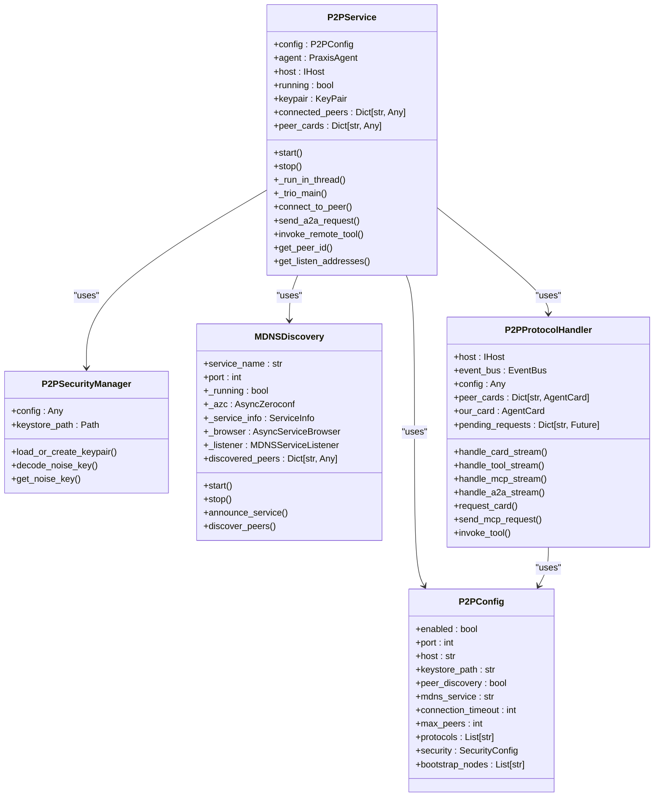
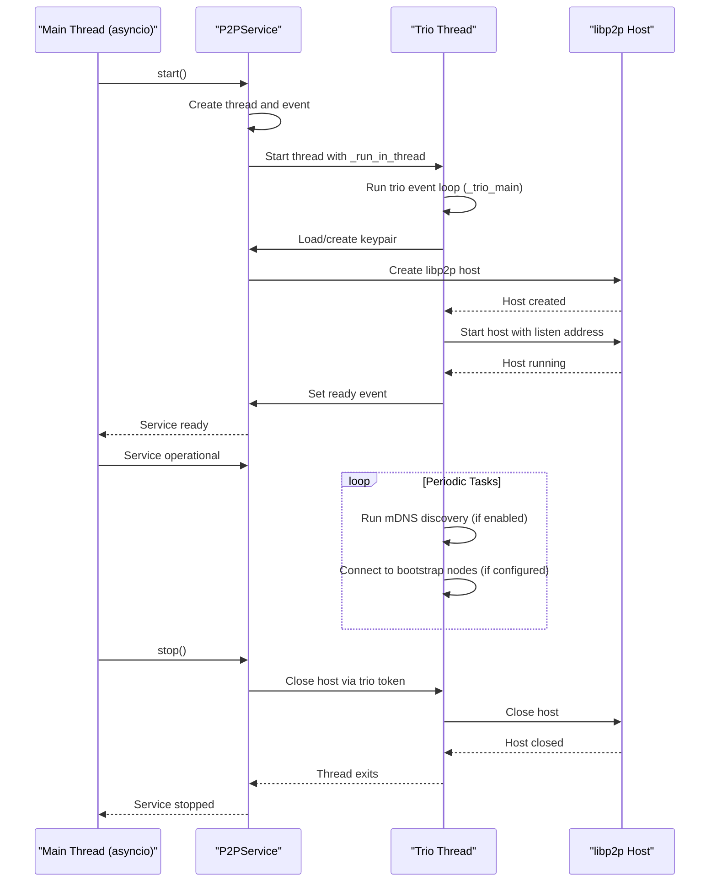
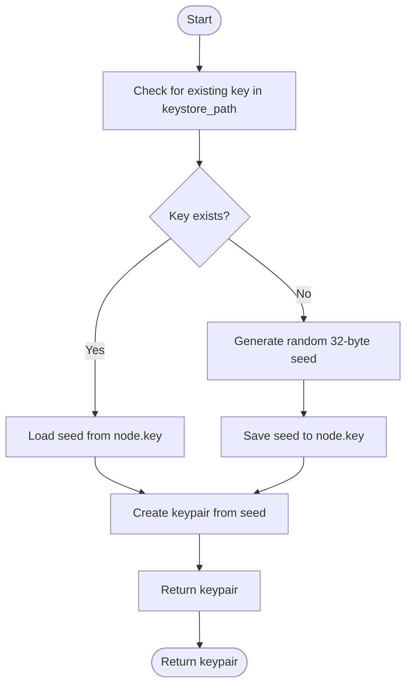
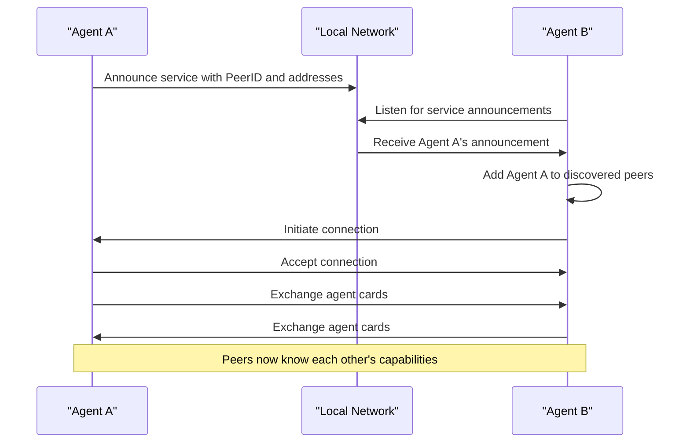
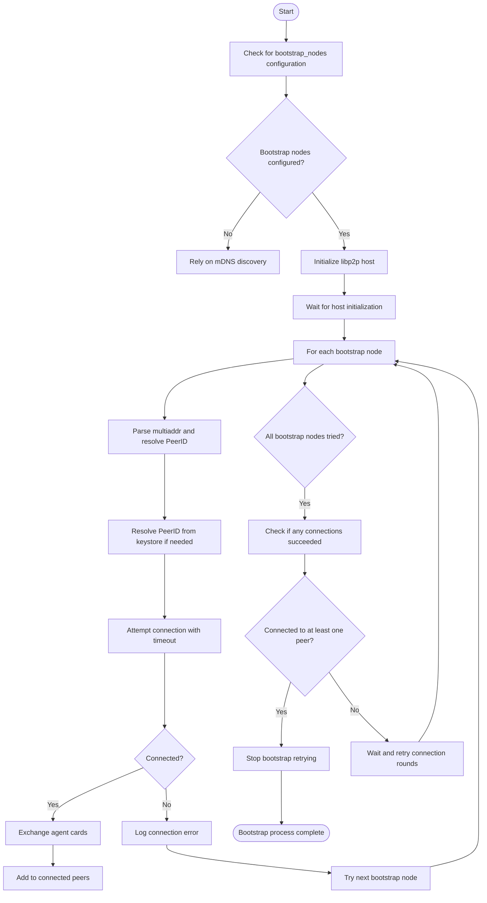
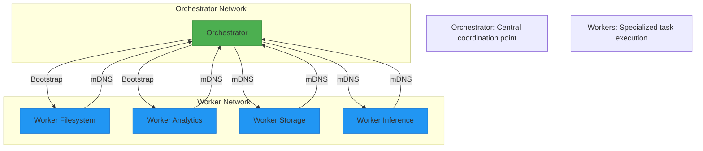
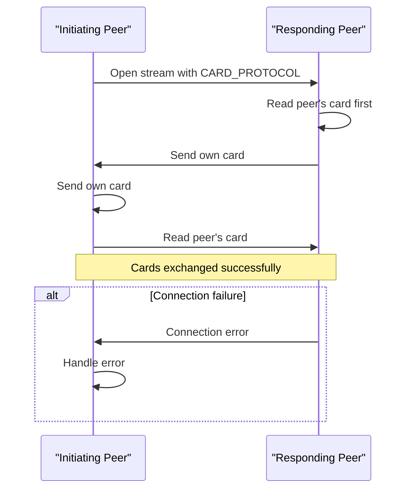
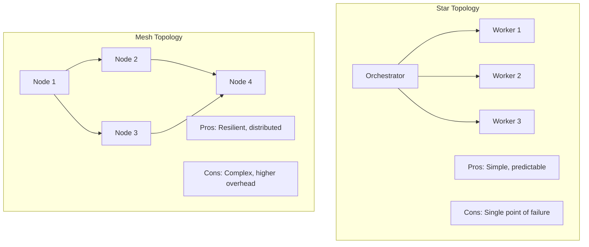

# P2P Networking Configuration


## Table of Contents
1. [Introduction](#introduction)
2. [P2P Configuration Overview](#p2p-configuration-overview)
3. [Core P2P Components](#core-p2p-components)
4. [P2P Service Initialization and Lifecycle](#p2p-service-initialization-and-lifecycle)
5. [Security and Encryption Settings](#security-and-encryption-settings)
6. [Peer Discovery Mechanisms](#peer-discovery-mechanisms)
7. [Bootstrap Node Configuration](#bootstrap-node-configuration)
8. [Agent-Specific P2P Configurations](#agent-specific-p2p-configurations)
9. [Protocol Handling and Message Exchange](#protocol-handling-and-message-exchange)
10. [Performance and Reliability Considerations](#performance-and-reliability-considerations)
11. [Troubleshooting Common P2P Issues](#troubleshooting-common-p2p-issues)
12. [Optimization for Large-Scale Deployments](#optimization-for-large-scale-deployments)

## Introduction
This document provides comprehensive guidance on configuring P2P networking in the Praxis Python SDK with a focus on libp2p integration. It covers configuration parameters, security settings, peer discovery mechanisms, and agent-specific network topologies. The documentation explains how YAML configuration files map to the P2PService initialization process and provides practical examples for securing P2P communications. The content is designed to help users understand and optimize P2P networking for both development and production environments.

## P2P Configuration Overview
The P2P networking configuration in Praxis is primarily managed through the `P2PConfig` class defined in `config.py` and instantiated via YAML configuration files. This configuration governs all aspects of peer-to-peer communication, including network parameters, security settings, and discovery mechanisms.

The P2P configuration is hierarchical and can be customized for different agent types (orchestrator, worker) to create specialized network topologies. Key configuration parameters include:

- **port**: The network port for P2P communication (default: 9000)
- **host**: The host interface to bind to (default: "0.0.0.0")
- **keystore_path**: Directory for storing cryptographic keys
- **peer_discovery**: Enable mDNS-based peer discovery
- **mdns_service**: Service name for mDNS discovery
- **connection_timeout**: Timeout for peer connections in seconds
- **max_peers**: Maximum number of concurrent peer connections
- **bootstrap_nodes**: List of bootstrap nodes for network entry
- **security**: Security configuration including encryption settings

```yaml
p2p:
  enabled: true
  port: 9000
  host: "0.0.0.0"
  keystore_path: "./keys/orchestrator"
  peer_discovery: true
  mdns_service: "praxis-p2p-mcp"
  connection_timeout: 30
  max_peers: 50
  protocols:
    - "/praxis/mcp/1.0.0"
    - "/praxis/card/1.0.0"
    - "/praxis/tool/1.0.0"
    - "/praxis/a2a/1.0.0"
  security:
    use_noise: false
    noise_key: null
  bootstrap_nodes: []
```

**Section sources**
- [config.py](file://src/praxis_sdk/config.py#L100-L150)
- [orchestrator.yaml](file://configs/orchestrator.yaml#L5-L34)

## Core P2P Components
The P2P system in Praxis consists of several interconnected components that work together to enable secure, decentralized communication between agents. These components are implemented across multiple Python modules, each responsible for specific aspects of P2P functionality.

The primary components include:

- **P2PService**: The main service class that manages the libp2p host and handles the P2P lifecycle
- **P2PConfig**: Configuration class that defines all P2P parameters
- **P2PSecurityManager**: Handles cryptographic key management and encryption
- **MDNSDiscovery**: Implements mDNS-based peer discovery
- **P2PProtocolHandler**: Manages protocol-specific message handling



**Diagram sources**
- [service.py](file://src/praxis_sdk/p2p/service.py#L100-L600)
- [config.py](file://src/praxis_sdk/config.py#L100-L150)
- [security.py](file://src/praxis_sdk/p2p/security.py#L10-L60)
- [discovery.py](file://src/praxis_sdk/p2p/discovery.py#L10-L600)
- [protocols.py](file://src/praxis_sdk/p2p/protocols.py#L10-L800)

**Section sources**
- [service.py](file://src/praxis_sdk/p2p/service.py#L1-L627)
- [config.py](file://src/praxis_sdk/config.py#L1-L412)
- [security.py](file://src/praxis_sdk/p2p/security.py#L1-L59)
- [discovery.py](file://src/praxis_sdk/p2p/discovery.py#L1-L603)
- [protocols.py](file://src/praxis_sdk/p2p/protocols.py#L1-L829)

## P2P Service Initialization and Lifecycle
The P2PService class manages the complete lifecycle of the P2P network connection, from initialization to shutdown. It uses a threading model with trio_asyncio to bridge between asyncio (used by the main application) and trio (required by libp2p).

The initialization process follows these steps:

1. Create a new Ed25519 keypair for the node
2. Load or create cryptographic keys from the keystore
3. Configure security options based on the configuration
4. Create the libp2p host with the specified keypair and security settings
5. Set up protocol handlers for various communication protocols
6. Start listening on the specified port
7. Begin peer discovery and bootstrap node connections



The service uses a thread-based isolation pattern where the libp2p host runs in a separate thread with its own trio event loop. This allows the main application to continue using asyncio while the P2P networking operates in a compatible but isolated environment. The `trio_asyncio` library provides the bridge between these two event loop systems.

Key lifecycle methods include:
- **start()**: Synchronous method that starts the P2P service and blocks until ready
- **stop()**: Synchronous method that gracefully shuts down the P2P service
- **_run_in_thread()**: Thread target function that runs the trio event loop
- **_trio_main()**: Main async function that initializes and runs the libp2p host

**Section sources**
- [service.py](file://src/praxis_sdk/p2p/service.py#L100-L300)

## Security and Encryption Settings
The Praxis P2P system provides configurable security settings to balance security requirements with performance considerations. Security is managed through the `SecurityConfig` class and can be configured via YAML files.

### Security Configuration Options
The security configuration includes the following key parameters:

- **use_noise**: Boolean flag to enable Noise protocol encryption
- **noise_key**: Base64-encoded private key for Noise protocol
- **tls_cert_path**: Path to TLS certificate file (future)
- **tls_key_path**: Path to TLS private key file (future)
- **api_key**: API key for authentication (future)

```yaml
security:
  use_noise: true
  noise_key: "base64_encoded_noise_private_key_here"
```

### Key Management
The P2P system uses Ed25519 keypairs for node identity and Noise protocol for encryption. Keys are managed through the keystore system:

1. **Keystore Path**: Configured via `keystore_path` parameter
2. **Node Key**: Stored as `node.key` in the keystore directory
3. **Key Generation**: Random 32-byte seed generated if no key exists
4. **Key Persistence**: Keys are saved to disk for consistent node identity

The key management process follows this flow:



### Encryption Protocols
The system supports two security transport options:

1. **Noise Protocol**: Production-grade encryption using the Noise cryptographic protocol
2. **Insecure Transport**: Plaintext communication for development and testing

When `use_noise` is enabled and a `noise_key` is provided, the system configures the Noise transport with the specified private key. Otherwise, it falls back to plaintext communication.

```python
def _get_security_options(self) -> Dict:
    """Get security transport options."""
    if self.config.security.use_noise and self.config.security.noise_key:
        # Use Noise protocol for encryption
        return {
            NOISE_PROTOCOL_ID: NoiseTransport(
                libp2p_keypair=self.keypair,
                noise_privkey=self._decode_noise_key(self.config.security.noise_key)
            )
        }
    else:
        # Use plaintext for development
        return {
            PLAINTEXT_PROTOCOL_ID: InsecureTransport(
                local_key_pair=self.keypair
            )
        }
```

For production deployments, it is strongly recommended to enable Noise encryption and provide a secure noise key. The noise key should be a base64-encoded Ed25519 private key, which can be generated using cryptographic tools.

**Section sources**
- [service.py](file://src/praxis_sdk/p2p/service.py#L250-L280)
- [security.py](file://src/praxis_sdk/p2p/security.py#L1-L60)
- [config.py](file://src/praxis_sdk/config.py#L80-L95)

## Peer Discovery Mechanisms
The Praxis P2P system implements multiple peer discovery mechanisms to facilitate automatic network formation and connection between agents. These mechanisms work together to create a robust and resilient network topology.

### mDNS Discovery
The primary discovery mechanism is mDNS (Multicast DNS), which allows agents to automatically discover each other on the local network. This is implemented in the `MDNSDiscovery` class.

Key configuration parameters:
- **peer_discovery**: Enables or disables mDNS discovery
- **mdns_service**: Service name for mDNS announcements
- **discovery_interval**: Interval between discovery attempts

The mDNS discovery process works as follows:

1. Each agent announces its presence on the network with its PeerID and addresses
2. Agents listen for announcements from other peers
3. When a new peer is discovered, a connection attempt is initiated
4. Successful connections trigger card exchange to share capabilities



### Discovery Lifecycle
The discovery service manages the complete lifecycle of peer discovery:

```python
class MDNSDiscovery:
    async def start(self):
        """Start mDNS service"""
        self._azc = AsyncZeroconf()
        self._listener = MDNSServiceListener(self._on_service_change)
        self._browser = AsyncServiceBrowser(
            self._azc.zeroconf, 
            self.service_type, 
            self._listener
        )
    
    async def announce_service(self, peer_id: str, addresses: List[str]):
        """Announce our service on mDNS"""
        properties = {
            b'peer_id': peer_id.encode('utf-8'),
            b'addresses': ','.join(addresses).encode('utf-8'),
            b'service': self.service_name.encode('utf-8')
        }
        await self._azc.async_register_service(self._service_info)
    
    async def _on_service_change(self, action: str, service_data: Dict[str, Any]):
        """Handle service changes"""
        if action == 'add' or action == 'update':
            # Process discovered peer
            pass
        elif action == 'remove':
            # Handle peer removal
            pass
```

The discovery service runs continuously, monitoring for new peers and maintaining the list of discovered agents. It also handles peer removal when agents go offline.

**Section sources**
- [discovery.py](file://src/praxis_sdk/p2p/discovery.py#L1-L603)
- [service.py](file://src/praxis_sdk/p2p/service.py#L400-L420)

## Bootstrap Node Configuration
Bootstrap nodes serve as entry points to the P2P network, allowing new agents to connect and discover other peers. They are particularly important in environments where mDNS discovery is not available or reliable.

### Bootstrap Node Configuration
Bootstrap nodes are configured through the `bootstrap_nodes` parameter in the P2P configuration. This parameter accepts a list of multiaddr strings that specify the network addresses of bootstrap nodes.

```yaml
bootstrap_nodes:
  - "/dns4/orchestrator/tcp/9000"
  - "/ip4/192.168.1.100/tcp/9000"
```

Each bootstrap node entry can use different address formats:
- **DNS4**: Domain name resolution (e.g., `/dns4/orchestrator/tcp/9000`)
- **IP4**: Direct IP address (e.g., `/ip4/192.168.1.100/tcp/9000`)
- **DNS6**: IPv6 domain name resolution
- **IP6**: IPv6 direct address

### Bootstrap Connection Process
When a node starts with bootstrap nodes configured, it follows this connection process:



### PeerID Resolution
One of the key features of the bootstrap system is automatic PeerID resolution. When a bootstrap address doesn't include a PeerID component (`/p2p/<peerid>`), the system attempts to resolve it from a shared keystore:

1. Extract the hostname or IP from the multiaddr
2. Look for a corresponding key file in the keystore root
3. Compute the PeerID from the Ed25519 seed
4. Append the PeerID to the multiaddr

This allows agents to connect using simple DNS names while still maintaining secure, identity-based connections.

```python
def _compute_peer_id_from_seed(self, seed_path: str) -> Optional[str]:
    """Compute a PeerID (base58) from an ed25519 seed file."""
    try:
        if not os.path.exists(seed_path):
            return None
        seed = open(seed_path, "rb").read()
        kp = create_new_key_pair(seed)
        pid = PeerID.from_pubkey(kp.public_key)
        return pid.to_base58()
    except Exception as e:
        logger.warning(f"Failed to compute peer id from seed {seed_path}: {e}")
        return None
```

In the orchestrator configuration, bootstrap nodes are not specified because the orchestrator typically serves as the bootstrap node for other agents. Workers, on the other hand, are configured to connect to the orchestrator as their bootstrap node.

**Section sources**
- [service.py](file://src/praxis_sdk/p2p/service.py#L450-L550)
- [orchestrator.yaml](file://configs/orchestrator.yaml#L32-L34)
- [worker_filesystem.yaml](file://configs/worker_filesystem.yaml#L170-L173)

## Agent-Specific P2P Configurations
Different agent types in the Praxis system have specialized P2P configurations tailored to their roles in the network topology. These configurations are defined in separate YAML files and reflect the distinct operational requirements of orchestrators and workers.

### Orchestrator Configuration
The orchestrator serves as the central coordination point in the network and has the following P2P characteristics:

- Acts as a bootstrap node for workers
- Typically has no bootstrap nodes configured
- Uses mDNS discovery to find other services
- Runs on standard port 9000
- Has relaxed security settings in development

```yaml
# orchestrator.yaml
p2p:
  enabled: true
  port: 9000
  host: "0.0.0.0"
  keystore_path: "./keys/orchestrator"
  peer_discovery: true
  mdns_service: "praxis-p2p-mcp"
  connection_timeout: 30
  max_peers: 50
  protocols:
    - "/praxis/mcp/1.0.0"
    - "/praxis/card/1.0.0"
    - "/praxis/tool/1.0.0"
    - "/praxis/a2a/1.0.0"
  security:
    use_noise: false  # Disabled for development
    noise_key: null
  bootstrap_nodes: []  # No bootstrap nodes - orchestrator is the root
```

### Worker Filesystem Configuration
The filesystem worker is specialized for file operations and has a configuration optimized for containerized environments:

- Connects to the orchestrator as a bootstrap node
- Uses DNS-based addressing for service discovery
- Shares a common keystore structure
- Configured for high availability

```yaml
# worker_filesystem.yaml
p2p:
  enabled: true
  port: 9000
  host: "0.0.0.0"
  keystore_path: "./keys/worker-filesystem"
  peer_discovery: true
  mdns_service: "praxis-p2p-mcp"
  connection_timeout: 30
  max_peers: 50
  protocols:
    - "/praxis/mcp/1.0.0"
    - "/praxis/card/1.0.0"
    - "/praxis/tool/1.0.0"
    - "/praxis/a2a/1.0.0"
  security:
    use_noise: false
    noise_key: null
  bootstrap_nodes:
    - "/dns4/orchestrator/tcp/9000"  # Connect to orchestrator
```

### Worker Analytics Configuration
The analytics worker has more stringent requirements for production environments:

- Uses different port (4003) to avoid conflicts
- Has enhanced security configuration
- Includes additional discovery parameters
- Configured for high-performance computing

```yaml
# worker_analytics.yaml
p2p:
  enabled: true
  port: 4003
  host: "0.0.0.0"
  rendezvous: "praxis-agents-production"
  enable_mdns: true
  enable_dht: true
  enable_relay: false
  bootstrap_nodes: []
  security:
    enabled: true
    noise_enabled: true
    max_peer_connections: 50
    allowed_peer_types: ["orchestrator", "worker"]
    accept_tasks_from: ["orchestrator"]
  connection_timeout: 60
  discovery_interval: 30
  protocol_version: "0.3.0"
```

### Network Topology Implications
These different configurations create a hierarchical network topology:



The orchestrator acts as the central hub, while workers connect to it either through bootstrap configuration or mDNS discovery. This creates a star topology that is easy to manage and scale.

**Section sources**
- [orchestrator.yaml](file://configs/orchestrator.yaml#L5-L34)
- [worker_filesystem.yaml](file://configs/worker_filesystem.yaml#L150-L173)
- [worker_analytics.yaml](file://configs/worker_analytics.yaml#L350-L380)

## Protocol Handling and Message Exchange
The Praxis P2P system supports multiple communication protocols for different types of interactions between agents. These protocols are implemented as stream handlers on the libp2p host and enable specialized communication patterns.

### Supported Protocols
The system defines several protocol identifiers for different communication purposes:

- **A2A_PROTOCOL**: Agent-to-Agent communication for task management
- **CARD_PROTOCOL**: Agent card exchange for capability discovery
- **TOOL_PROTOCOL**: Remote tool invocation
- **MCP_PROTOCOL**: Model Context Protocol bridge

```python
# Protocol definitions
A2A_PROTOCOL: TProtocol = TProtocol("/praxis/a2a/1.0.0")
CARD_PROTOCOL: TProtocol = TProtocol("/praxis/card/1.0.0")
TOOL_PROTOCOL: TProtocol = TProtocol("/praxis/tool/1.0.0")
MCP_PROTOCOL: TProtocol = TProtocol("/praxis/mcp/1.0.0")
```

### Protocol Handler Registration
Protocol handlers are registered with the libp2p host during initialization:

```python
def _setup_protocol_handlers(self):
    """Setup stream handlers for all protocols."""
    self.host.set_stream_handler(A2A_PROTOCOL, self._handle_a2a_stream)
    self.host.set_stream_handler(CARD_PROTOCOL, self._handle_card_stream)
    self.host.set_stream_handler(TOOL_PROTOCOL, self._handle_tool_stream)
    self.host.set_stream_handler(MCP_PROTOCOL, self._handle_mcp_stream)
```

### Card Exchange Protocol
The card exchange protocol allows agents to share their capabilities and tool availability:



The protocol follows a specific pattern to avoid deadlocks: the responder reads first, then writes, while the initiator writes first, then reads.

### Remote Tool Invocation
The tool protocol enables remote execution of tools across the network:

```python
async def _handle_tool_stream(self, stream: "INetStream"):
    """Handle remote tool invocation."""
    # Read tool request
    request_bytes = await stream.read(8192)
    request = json.loads(request_bytes.decode('utf-8'))
    
    # Execute tool via agent
    result = await trio_asyncio.aio_as_trio(
        self.agent.invoke_tool
    )(request["tool"], request["arguments"])
    
    # Send result
    response = {"success": True, "result": result}
    await stream.write(json.dumps(response).encode('utf-8'))
```

### A2A Protocol for Task Management
The A2A (Agent-to-Agent) protocol handles task delegation and workflow coordination:

```python
async def _handle_a2a_stream(self, stream: "INetStream"):
    """Handle A2A protocol stream."""
    # Read request
    request_bytes = await stream.read(8192)
    request = json.loads(request_bytes.decode('utf-8'))
    
    # Bridge to agent method
    response = await trio_asyncio.aio_as_trio(
        self.agent.dispatch_a2a_request
    )(request)
    
    # Send response
    response_bytes = json.dumps(response).encode('utf-8')
    await stream.write(response_bytes)
```

The protocol uses JSON-RPC 2.0 for structured request-response communication, enabling complex task orchestration across the network.

**Section sources**
- [service.py](file://src/praxis_sdk/p2p/service.py#L300-L400)
- [protocols.py](file://src/praxis_sdk/p2p/protocols.py#L1-L800)

## Performance and Reliability Considerations
The P2P configuration parameters have significant impacts on network performance, latency, and reliability. Understanding these trade-offs is essential for optimizing deployments.

### Connection Timeout Settings
The `connection_timeout` parameter controls how long the system waits for peer connections:

- **Shorter timeouts** (10-15 seconds): Faster failure detection but may drop connections in high-latency networks
- **Longer timeouts** (30-60 seconds): More resilient to network fluctuations but slower to detect failures

```yaml
connection_timeout: 30  # Balance between responsiveness and reliability
```

### Peer Management Parameters
Key parameters affecting peer management:

- **max_peers**: Limits concurrent connections to prevent resource exhaustion
- **discovery_interval**: Controls frequency of discovery operations
- **peer_discovery**: Enables automatic peer discovery but adds network overhead

For large-scale deployments, consider these guidelines:
- Set `max_peers` based on available system resources
- Increase `discovery_interval` in stable networks to reduce overhead
- Disable `peer_discovery` in controlled environments with known topology

### Protocol Optimization
The choice and configuration of protocols affect performance:

- **Noise encryption**: Adds computational overhead but provides security
- **Message size**: Large messages may require increased buffer sizes
- **Stream multiplexing**: Efficiently shares connections for multiple protocols

### Network Topology Impact
Different network topologies have distinct performance characteristics:



For production deployments, a hybrid approach often works best: use a star topology for core services with mesh connections for redundancy.

**Section sources**
- [config.py](file://src/praxis_sdk/config.py#L100-L150)
- [service.py](file://src/praxis_sdk/p2p/service.py#L450-L550)

## Troubleshooting Common P2P Issues
This section addresses common P2P networking problems and their solutions.

### Peer Connection Failures
Common causes and solutions:

**Issue**: Connection timeouts to bootstrap nodes
- **Cause**: Network connectivity issues or incorrect addresses
- **Solution**: Verify multiaddr format and network reachability
- **Debug**: Check logs for "Failed to connect to bootstrap node" messages

**Issue**: mDNS discovery not finding peers
- **Cause**: Firewall blocking multicast traffic or different service names
- **Solution**: Ensure `mdns_service` matches across agents or use bootstrap nodes
- **Debug**: Check logs for "Starting mDNS discovery" and "Discovered peer" messages

### NAT Traversal Problems
In environments with NAT (Network Address Translation):

**Issue**: Peers cannot connect through NAT
- **Cause**: libp2p cannot determine public address
- **Solution**: Configure explicit addresses or use relay nodes
- **Configuration**: Use `announce_addresses` to specify public endpoints

### Configuration Mismatches
**Issue**: Protocol negotiation failures
- **Cause**: Different protocol versions or missing protocols
- **Solution**: Ensure `protocols` lists are compatible across agents
- **Debug**: Check logs for "protocol not supported" errors

**Issue**: Security configuration conflicts
- **Cause**: Mismatched encryption settings between peers
- **Solution**: Align `use_noise` settings or ensure compatible keys
- **Best Practice**: Use consistent security settings in production

### Debugging Tools and Techniques
Enable detailed logging for troubleshooting:

```yaml
logging:
  level: "DEBUG"  # Increase verbosity for debugging
```

Use these diagnostic commands:
- Check peer connections: `get_connected_peers()`
- Verify listen addresses: `get_listen_addresses()`
- Test connectivity: `connect_to_peer()`
- Monitor discovery: `get_discovered_peers()`

Common log messages and their meanings:
- "P2P host started": Service initialized successfully
- "Connected to bootstrap node": Successful bootstrap connection
- "Card exchanged with": Capability exchange completed
- "Connection to X timed out": Network connectivity issue
- "Failed to load keypair": Key management problem

**Section sources**
- [service.py](file://src/praxis_sdk/p2p/service.py#L450-L550)
- [discovery.py](file://src/praxis_sdk/p2p/discovery.py#L1-L603)

## Optimization for Large-Scale Deployments
For large-scale deployments with many agents, specific optimizations can improve performance and reliability.

### Connection Pooling and Reuse
Configure connection parameters for efficiency:

```yaml
p2p:
  max_peers: 100  # Adjust based on available resources
  connection_timeout: 15  # Faster failure detection
  discovery_interval: 60  # Reduce discovery frequency
```

### Security Optimization
Balance security and performance:

```yaml
security:
  use_noise: true  # Always enable in production
  # Consider using pre-shared keys for large deployments
```

### Resource Management
Monitor and limit resource usage:

- Set appropriate `max_peers` based on system capacity
- Implement connection timeouts to prevent resource leaks
- Use connection pooling where possible

### Monitoring and Metrics
Enable monitoring for production deployments:

```yaml
metrics_enabled: true
monitoring:
  enabled: true
  metrics:
    enabled: true
    port: 9091
```

### Configuration Management
Use configuration templates and environment variables:

```yaml
p2p:
  port: ${P2P_PORT:-9000}
  host: ${P2P_HOST:-0.0.0.0}
  keystore_path: ${KEYSTORE_PATH:-./keys}
```

These optimizations help ensure reliable operation in large-scale, production environments.

**Section sources**
- [config.py](file://src/praxis_sdk/config.py#L1-L412)
- [worker_analytics.yaml](file://configs/worker_analytics.yaml#L350-L380)

**Referenced Files in This Document**   
- [service.py](file://src/praxis_sdk/p2p/service.py)
- [config.py](file://src/praxis_sdk/config.py)
- [orchestrator.yaml](file://configs/orchestrator.yaml)
- [worker_filesystem.yaml](file://configs/worker_filesystem.yaml)
- [worker_analytics.yaml](file://configs/worker_analytics.yaml)
- [security.py](file://src/praxis_sdk/p2p/security.py)
- [discovery.py](file://src/praxis_sdk/p2p/discovery.py)
- [protocols.py](file://src/praxis_sdk/p2p/protocols.py)