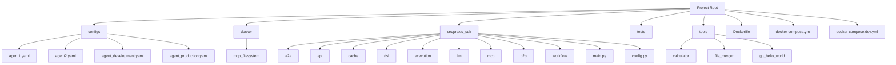
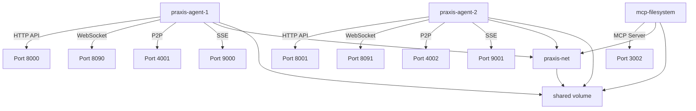
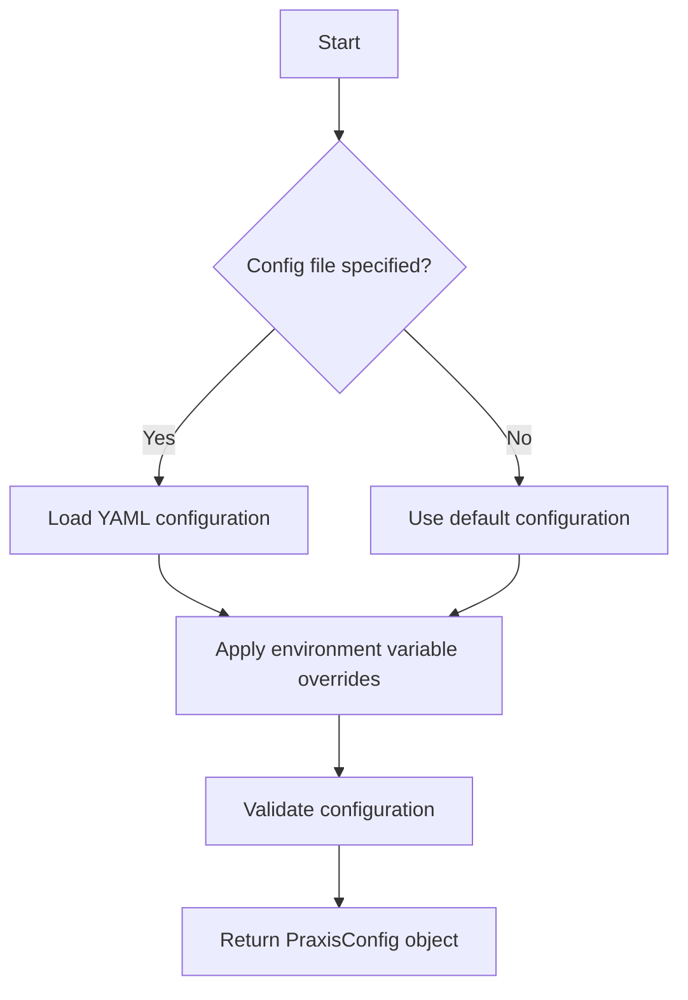
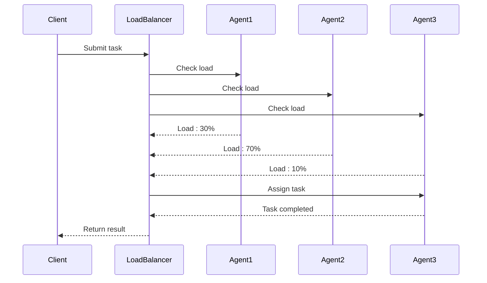
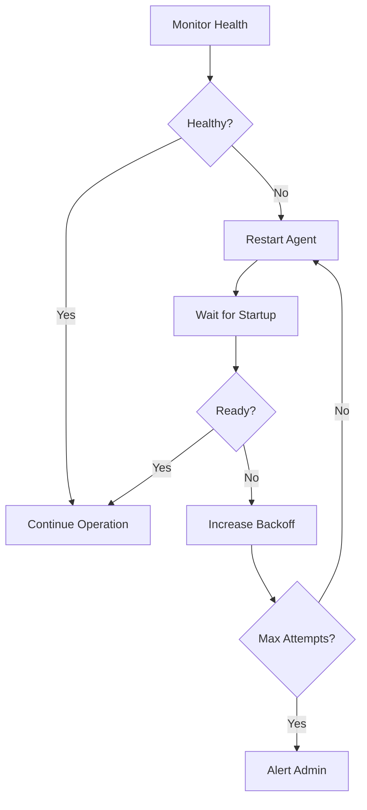

# Deployment and Operations


## Table of Contents
1. [Introduction](#introduction)
2. [Project Structure](#project-structure)
3. [Docker Containerization Strategy](#docker-containerization-strategy)
4. [Multi-Container Deployments with Docker Compose](#multi-container-deployments-with-docker-compose)
5. [Development vs Production Configurations](#development-vs-production-configurations)
6. [Step-by-Step Deployment Guides](#step-by-step-deployment-guides)
7. [Configuration Management with Environment Variables and Secrets](#configuration-management-with-environment-variables-and-secrets)
8. [Monitoring, Logging, and Observability](#monitoring-logging-and-observability)
9. [Scaling Strategies](#scaling-strategies)
10. [Health Check Endpoints and Failure Recovery](#health-check-endpoints-and-failure-recovery)
11. [Security Hardening Guidelines](#security-hardening-guidelines)
12. [Backup, Disaster Recovery, and Upgrade Procedures](#backup-disaster-recovery-and-upgrade-procedures)
13. [Performance Tuning Recommendations](#performance-tuning-recommendations)

## Introduction
This document provides comprehensive guidance for deploying and operating the Praxis Python SDK in production environments. It covers containerization strategies, configuration management, deployment workflows, monitoring, scaling, and security best practices. The Praxis SDK is a distributed agent platform that enables peer-to-peer communication, agent-to-agent protocols, and integration with various execution engines and LLM providers.

**Section sources**
- [README.md](file://README.md#L1-L577)

## Project Structure
The Praxis Python SDK follows a modular structure with clear separation of concerns. The project is organized into configuration files, source code, tests, and tools.



**Diagram sources**
- [README.md](file://README.md#L1-L577)

**Section sources**
- [README.md](file://README.md#L1-L577)

## Docker Containerization Strategy
The Praxis SDK uses Docker for containerization, providing consistent environments across development, testing, and production. The Dockerfile defines a minimal Python 3.11-slim base image with all necessary dependencies.

```dockerfile
FROM python:3.11-slim

# Set environment variables
ENV PYTHONDONTWRITEBYTECODE=1 \
    PYTHONUNBUFFERED=1 \
    PYTHONPATH=/app/src

# Install system dependencies
RUN apt-get update && apt-get install -y \
    build-essential \
    libgmp-dev \
    libssl-dev \
    libffi-dev \
    pkg-config \
    curl \
    wget \
    net-tools \
    ca-certificates \
    gnupg \
    lsb-release \
    && rm -rf /var/lib/apt/lists/*

# Install Docker CLI
RUN curl -fsSL https://download.docker.com/linux/debian/gpg | gpg --dearmor -o /usr/share/keyrings/docker-archive-keyring.gpg && \
    echo "deb [arch=$(dpkg --print-architecture) signed-by=/usr/share/keyrings/docker-archive-keyring.gpg] https://download.docker.com/linux/debian $(lsb_release -cs) stable" | tee /etc/apt/sources.list.d/docker.list > /dev/null && \
    apt-get update && \
    apt-get install -y docker-ce-cli && \
    rm -rf /var/lib/apt/lists/*

# Install Dagger CLI
ARG DAGGER_VERSION=0.18.14
RUN curl -L "https://dl.dagger.io/dagger/releases/${DAGGER_VERSION}/dagger_v${DAGGER_VERSION}_linux_$(dpkg --print-architecture | sed 's/amd64/amd64/; s/arm64/arm64/').tar.gz" -o /tmp/dagger.tar.gz && \
    tar -xzf /tmp/dagger.tar.gz -C /tmp && \
    mv /tmp/dagger /usr/local/bin/ && \
    chmod +x /usr/local/bin/dagger && \
    rm /tmp/dagger.tar.gz && \
    dagger version

WORKDIR /app

COPY . .

RUN pip install --no-cache-dir \
    libp2p \
    trio \
    trio-asyncio \
    multiaddr \
    loguru \
    pydantic \
    pydantic-settings \
    fastapi \
    uvicorn \
    httpx \
    pyyaml \
    openai \
    websockets \
    aiofiles \
    jinja2 \
    click \
    python-multipart \
    docker \
    gql[all]==3.5.0 \
    dagger-io==0.18.14

RUN mkdir -p logs data

EXPOSE 8000 4001

CMD ["python", "-m", "praxis_sdk.main"]
```

**Diagram sources**
- [Dockerfile](file://Dockerfile#L1-L76)

**Section sources**
- [Dockerfile](file://Dockerfile#L1-L76)

## Multi-Container Deployments with Docker Compose
The Praxis SDK uses Docker Compose for multi-container deployments, enabling coordinated startup of multiple agents and services. The docker-compose.yml file defines three services: two Praxis agents and an MCP filesystem server.



**Diagram sources**
- [docker-compose.yml](file://docker-compose.yml#L1-L155)

**Section sources**
- [docker-compose.yml](file://docker-compose.yml#L1-L155)

## Development vs Production Configurations
The Praxis SDK provides distinct configuration files for development and production environments, with different settings for logging, security, resource limits, and network discovery.

### Development Configuration
The development configuration (agent_development.yaml) is optimized for local development with verbose logging, relaxed security settings, and lower resource limits.

```yaml
environment: "development"
debug: true
logging:
  level: "DEBUG"
  format: "text"
p2p:
  max_peer_connections: 50
  discovery_interval: 30
llm:
  model: "gpt-4o-mini"
  max_tokens: 4096
  temperature: 0.1
execution:
  dagger:
    resource_limits:
      cpu: "1000m"
      memory: "512Mi"
```

### Production Configuration
The production configuration (agent_production.yaml) is hardened for production use with strict security, higher resource limits, and optimized performance settings.

```yaml
environment: "production"
debug: false
logging:
  level: "INFO"
  format: "json"
p2p:
  max_peer_connections: 200
  bootstrap_nodes:
    - "/ip4/10.0.0.100/tcp/4001/p2p/12D3KooWExample1"
    - "/ip4/10.0.0.101/tcp/4001/p2p/12D3KooWExample2"
llm:
  model: "gpt-4o"
  max_tokens: 8192
  temperature: 0.0
execution:
  dagger:
    resource_limits:
      cpu: "4000m"
      memory: "2Gi"
```

**Diagram sources**
- [configs/agent_development.yaml](file://configs/agent_development.yaml#L1-L172)
- [configs/agent_production.yaml](file://configs/agent_production.yaml#L1-L166)

**Section sources**
- [configs/agent_development.yaml](file://configs/agent_development.yaml#L1-L172)
- [configs/agent_production.yaml](file://configs/agent_production.yaml#L1-L166)

## Step-by-Step Deployment Guides
This section provides step-by-step deployment guides for various environments: local, cloud (AWS/GCP), and Kubernetes.

### Local Deployment
Deploy the Praxis SDK locally using Docker Compose:

```bash
# Clone the repository
git clone https://github.com/prxs-ai/praxis-py-sdk.git
cd praxis-py-sdk

# Set environment variables
export OPENAI_API_KEY=your_openai_api_key
export APIFY_API_TOKEN=your_apify_token

# Start the multi-agent environment
docker-compose up
```

### Cloud Deployment (AWS)
Deploy the Praxis SDK on AWS using ECS:

```bash
# Build and push Docker image to ECR
aws ecr get-login-password | docker login --username AWS --password-stdin $AWS_ACCOUNT.dkr.ecr.$AWS_REGION.amazonaws.com
docker build -t praxis-sdk .
docker tag praxis-sdk:latest $AWS_ACCOUNT.dkr.ecr.$AWS_REGION.amazonaws.com/praxis-sdk:latest
docker push $AWS_ACCOUNT.dkr.ecr.$AWS_REGION.amazonaws.com/praxis-sdk:latest

# Deploy to ECS using Fargate
aws ecs create-cluster --cluster-name praxis-cluster
aws ecs register-task-definition --cli-input-json file://ecs-task-definition.json
aws ecs run-task --cluster praxis-cluster --task-definition praxis-sdk --count 3 --launch-type FARGATE
```

### Cloud Deployment (GCP)
Deploy the Praxis SDK on GCP using Cloud Run:

```bash
# Build and push Docker image to GCR
gcloud auth configure-docker
docker build -t gcr.io/$PROJECT_ID/praxis-sdk .
docker push gcr.io/$PROJECT_ID/praxis-sdk

# Deploy to Cloud Run
gcloud run deploy praxis-agent \
  --image gcr.io/$PROJECT_ID/praxis-sdk \
  --platform managed \
  --region $REGION \
  --set-env-vars OPENAI_API_KEY=$OPENAI_API_KEY \
  --set-env-vars APIFY_API_TOKEN=$APIFY_API_TOKEN \
  --min-instances 3 \
  --max-instances 10 \
  --memory 2Gi \
  --cpu 2
```

### Kubernetes Deployment
Deploy the Praxis SDK on Kubernetes:

```yaml
# kubernetes/deployment.yaml
apiVersion: apps/v1
kind: Deployment
metadata:
  name: praxis-agent
spec:
  replicas: 3
  selector:
    matchLabels:
      app: praxis-agent
  template:
    metadata:
      labels:
        app: praxis-agent
    spec:
      containers:
      - name: praxis-agent
        image: praxis-sdk:latest
        ports:
        - containerPort: 8000
        - containerPort: 4001
        env:
        - name: OPENAI_API_KEY
          valueFrom:
            secretKeyRef:
              name: praxis-secrets
              key: openai-api-key
        - name: APIFY_API_TOKEN
          valueFrom:
            secretKeyRef:
              name: praxis-secrets
              key: apify-api-token
        resources:
          limits:
            memory: "2Gi"
            cpu: "2000m"
        volumeMounts:
        - name: shared-data
          mountPath: /app/shared
      volumes:
      - name: shared-data
        persistentVolumeClaim:
          claimName: praxis-shared-pvc
---
apiVersion: v1
kind: Service
metadata:
  name: praxis-agent-service
spec:
  selector:
    app: praxis-agent
  ports:
  - protocol: TCP
    port: 80
    targetPort: 8000
  type: LoadBalancer
```

```bash
# Apply Kubernetes configuration
kubectl apply -f kubernetes/secrets.yaml
kubectl apply -f kubernetes/pvc.yaml
kubectl apply -f kubernetes/deployment.yaml
```

**Section sources**
- [docker-compose.yml](file://docker-compose.yml#L1-L155)
- [configs/agent_production.yaml](file://configs/agent_production.yaml#L1-L166)

## Configuration Management with Environment Variables and Secrets
The Praxis SDK uses environment variables and configuration files for managing settings across different environments.

### Environment Variable Hierarchy
The configuration system follows a hierarchy where environment variables override configuration file settings:

1. Command-line arguments
2. Environment variables (PRAXIS_* prefix)
3. YAML configuration files
4. Default values

### Configuration Loading Process


**Diagram sources**
- [src/praxis_sdk/config.py](file://src/praxis_sdk/config.py#L1-L412)

**Section sources**
- [src/praxis_sdk/config.py](file://src/praxis_sdk/config.py#L1-L412)

## Monitoring, Logging, and Observability
The Praxis SDK provides comprehensive monitoring, logging, and observability features for production deployments.

### Logging Configuration
The logging system supports both text and JSON formats with configurable levels and output destinations.

```yaml
logging:
  level: "INFO"
  format: "json"
  enable_console: true
  enable_file: true
  file_path: "/app/logs/praxis-agent.log"
  max_file_size: "500MB"
  backup_count: 10
  structured_logging: true
  log_requests: false
  log_p2p_traffic: false
```

### Health Check Endpoints
The Praxis SDK exposes health check endpoints for monitoring:

- **HTTP Health Check**: `GET /health` - Returns 200 if agent is healthy
- **Docker Health Check**: Configured in docker-compose.yml with curl probe
- **Kubernetes Readiness/Liveness Probes**: Can be configured to use /health endpoint

### Metrics and Monitoring
The SDK includes built-in metrics collection for monitoring key performance indicators:

- Agent startup time
- P2P connection count
- Task execution duration
- LLM API call rates and latencies
- Memory and CPU usage

**Section sources**
- [configs/agent_production.yaml](file://configs/agent_production.yaml#L1-L166)
- [docker-compose.yml](file://docker-compose.yml#L1-L155)

## Scaling Strategies
The Praxis SDK supports horizontal and vertical scaling to handle increased agent and task loads.

### Horizontal Scaling
Scale out by adding more agent instances:

```bash
# Scale agents in Docker Compose
docker-compose up -d --scale praxis-agent-1=5

# Scale in Kubernetes
kubectl scale deployment praxis-agent --replicas=10
```

### Vertical Scaling
Scale up by increasing resource allocation:

```yaml
# Increase resource limits
execution:
  dagger:
    resource_limits:
      cpu: "8000m"
      memory: "4Gi"
p2p:
  max_peer_connections: 500
```

### Load Balancing
The A2A protocol automatically distributes tasks across available agents:



**Diagram sources**
- [configs/agent_production.yaml](file://configs/agent_production.yaml#L1-L166)
- [docker-compose.yml](file://docker-compose.yml#L1-L155)

**Section sources**
- [configs/agent_production.yaml](file://configs/agent_production.yaml#L1-L166)

## Health Check Endpoints and Failure Recovery
The Praxis SDK includes robust health checking and failure recovery mechanisms.

### Health Check Configuration
```yaml
# Docker Compose health check
healthcheck:
  test: ["CMD", "curl", "-f", "http://localhost:8000/health"]
  interval: 10s
  timeout: 5s
  retries: 3
  start_period: 30s
```

### Failure Recovery Procedures
1. **Agent Failure**: Docker/Kubernetes automatically restarts failed containers
2. **Network Partition**: P2P protocol detects disconnected peers and redistributes tasks
3. **LLM API Failure**: Automatic retries with exponential backoff
4. **Task Failure**: Failed tasks are retried or reassigned to other agents

### Self-Healing Architecture


**Diagram sources**
- [docker-compose.yml](file://docker-compose.yml#L1-L155)
- [configs/agent_production.yaml](file://configs/agent_production.yaml#L1-L166)

**Section sources**
- [docker-compose.yml](file://docker-compose.yml#L1-L155)

## Security Hardening Guidelines
The Praxis SDK includes multiple security features for production deployments.

### Network Security
- **P2P Security**: Noise protocol encryption with configurable private keys
- **API Security**: Optional API key authentication
- **CORS**: Configurable CORS origins for HTTP API
- **Firewall**: Restrict exposed ports to only necessary services

### Configuration Security
```yaml
p2p:
  security:
    enabled: true
    noise_enabled: true
    private_key_path: "/app/keys/priv.key"
    public_key_path: "/app/keys/pub.key"
    max_peer_connections: 200
    authorized_peers: []
    blacklisted_peers: []

http:
  cors_origins:
    - "https://app.praxis.example.com"
    - "https://dashboard.praxis.example.com"
```

### Secret Management
- Store API keys in environment variables or secrets management systems
- Never commit secrets to version control
- Use Kubernetes Secrets or AWS/GCP secret managers in production
- Rotate API keys regularly

### Container Security
- Use minimal base images (python:3.11-slim)
- Run containers as non-root user
- Mount only necessary volumes
- Limit container capabilities

**Section sources**
- [configs/agent_production.yaml](file://configs/agent_production.yaml#L1-L166)

## Backup, Disaster Recovery, and Upgrade Procedures
This section covers backup strategies, disaster recovery, and upgrade/migration procedures.

### Backup Strategy
- **Configuration Files**: Version controlled in Git
- **Shared Data**: Backed up daily to cloud storage
- **Logs**: Retained for 30 days with log rotation
- **Database**: Regular snapshots and point-in-time recovery

### Disaster Recovery
1. **Agent Failure**: Automated restart via orchestration platform
2. **Data Loss**: Restore from latest backup
3. **Network Outage**: Graceful degradation with local task queuing
4. **Security Breach**: Isolate affected agents, rotate keys, investigate

### Upgrade Procedures
1. **Test in Staging**: Deploy new version to staging environment
2. **Blue-Green Deployment**: Run old and new versions simultaneously
3. **Traffic Switching**: Gradually shift traffic to new version
4. **Rollback Plan**: Immediate rollback if critical issues detected

```bash
# Example upgrade procedure
docker-compose pull
docker-compose up -d --no-deps --scale praxis-agent-1=0 praxis-agent-1
docker-compose up -d --no-deps --scale praxis-agent-1=3 praxis-agent-1
```

**Section sources**
- [configs/agent_production.yaml](file://configs/agent_production.yaml#L1-L166)
- [docker-compose.yml](file://docker-compose.yml#L1-L155)

## Performance Tuning Recommendations
This section provides performance tuning recommendations for different deployment scenarios.

### Resource Allocation
```yaml
# High-performance configuration
execution:
  dagger:
    resource_limits:
      cpu: "8000m"
      memory: "8Gi"
p2p:
  max_peer_connections: 1000
  discovery_interval: 60
llm:
  rate_limiting:
    requests_per_minute: 1000
    tokens_per_minute: 2000000
    burst_limit: 100
```

### Caching Strategies
- **LLM Response Caching**: Cache responses for identical prompts
- **Tool Result Caching**: Cache expensive tool executions
- **DNS Caching**: Cache P2P peer lookups

### Network Optimization
- **P2P Bootstrap Nodes**: Use stable, high-bandwidth nodes
- **Relay Nodes**: Enable P2P relay for NAT traversal
- **Connection Pooling**: Reuse HTTP connections to external services

### Database and Storage
- **SSD Storage**: Use SSDs for shared data directory
- **Database Indexing**: Index frequently queried fields
- **Connection Pooling**: Use connection pools for database access

**Section sources**
- [configs/agent_production.yaml](file://configs/agent_production.yaml#L1-L166)

**Referenced Files in This Document**   
- [Dockerfile](file://Dockerfile)
- [docker-compose.yml](file://docker-compose.yml)
- [docker-compose.dev.yml](file://docker-compose.dev.yml)
- [configs/agent_production.yaml](file://configs/agent_production.yaml)
- [configs/agent_development.yaml](file://configs/agent_development.yaml)
- [src/praxis_sdk/main.py](file://src/praxis_sdk/main.py)
- [src/praxis_sdk/config.py](file://src/praxis_sdk/config.py)