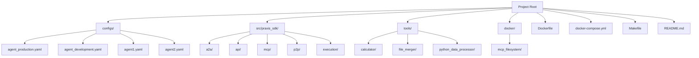
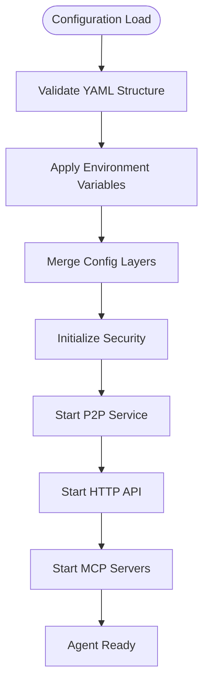
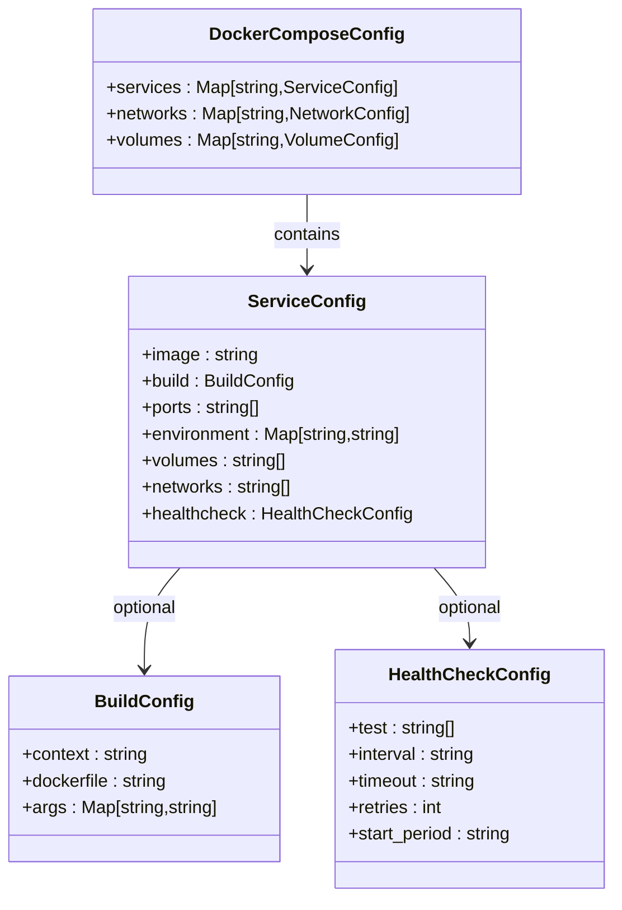
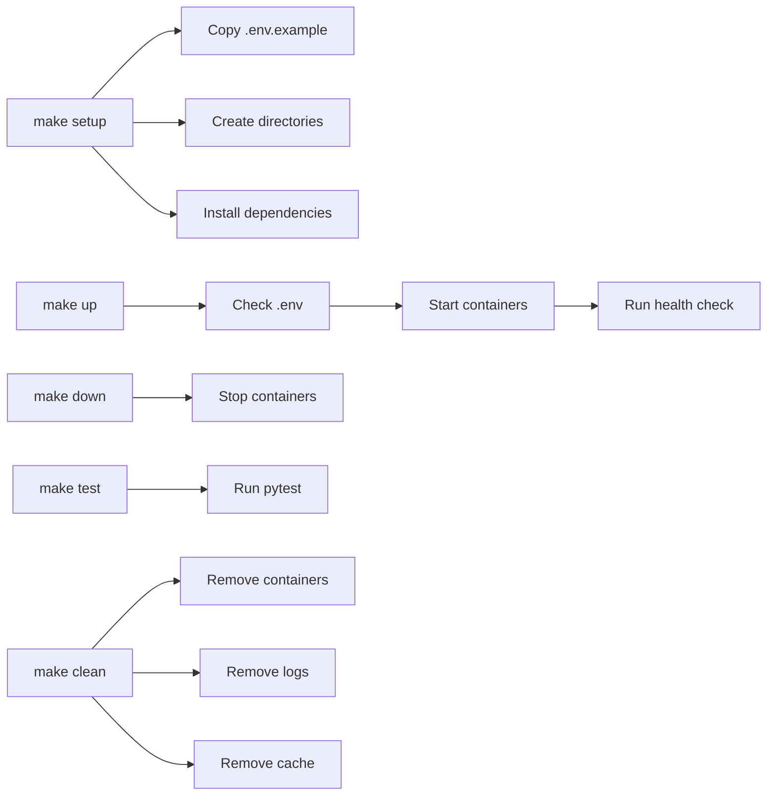
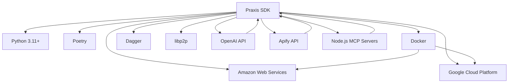
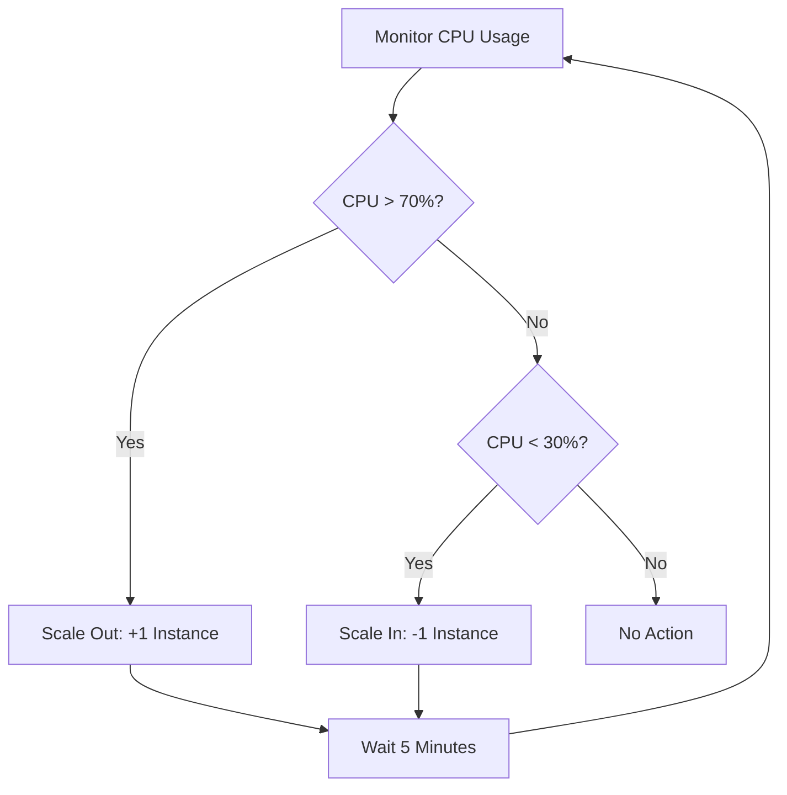

# Cloud Deployment (AWS/GCP)


## Table of Contents
1. [Introduction](#introduction)
2. [Project Structure](#project-structure)
3. [Core Components](#core-components)
4. [Architecture Overview](#architecture-overview)
5. [Detailed Component Analysis](#detailed-component-analysis)
6. [Dependency Analysis](#dependency-analysis)
7. [Performance Considerations](#performance-considerations)
8. [Troubleshooting Guide](#troubleshooting-guide)
9. [Conclusion](#conclusion)

## Introduction
This document provides comprehensive guidance for deploying the Praxis agent system on major cloud platforms, specifically Amazon Web Services (AWS) and Google Cloud Platform (GCP). The deployment strategy focuses on containerized execution using Docker and orchestration through cloud-native services such as Amazon ECS, Google Kubernetes Engine (GKE), and virtual machine instances like EC2 and Compute Engine. The document covers configuration adaptation for cloud environments, persistent storage implementation, secret management using AWS Secrets Manager and GCP Secret Manager, automation via Makefile, networking setup with load balancers and security groups, auto-scaling policies, cost optimization, high availability, and region selection. Additionally, troubleshooting guidance is provided for common issues related to connectivity, IAM permissions, and DNS resolution.

## Project Structure
The Praxis Python SDK follows a modular structure designed for distributed agent deployment and execution. The project is organized into configuration files, source code, tools, and infrastructure definitions. Configuration files in the `configs/` directory define agent behavior across different environments. The `src/praxis_sdk` directory contains the core implementation of agent functionality, including P2P communication, API interfaces, and execution engines. The `tools/` directory houses reusable tool implementations with contract definitions. Infrastructure is defined through Docker and Docker Compose files, enabling consistent deployment across environments.



**Diagram sources**
- [docker-compose.yml](file://docker-compose.yml#L1-L155)
- [configs/agent_production.yaml](file://configs/agent_production.yaml#L1-L166)

**Section sources**
- [docker-compose.yml](file://docker-compose.yml#L1-L155)
- [configs/agent_production.yaml](file://configs/agent_production.yaml#L1-L166)
- [configs/agent_development.yaml](file://configs/agent_development.yaml#L1-L172)

## Core Components
The Praxis system consists of several core components that enable distributed agent functionality. The agent component manages lifecycle, configuration, and coordination. The P2P service enables peer-to-peer communication using libp2p with mDNS and DHT discovery. The API server provides HTTP, WebSocket, and Server-Sent Events interfaces for external interaction. The MCP service manages tool registration and execution. The A2A protocol facilitates task delegation and capability exchange between agents. Execution engines support multiple execution modes including Dagger (containerized), Docker SDK, local, and remote MCP execution.

**Section sources**
- [src/praxis_sdk/agent.py](file://src/praxis_sdk/agent.py)
- [src/praxis_sdk/p2p/service.py](file://src/praxis_sdk/p2p/service.py)
- [src/praxis_sdk/api/server.py](file://src/praxis_sdk/api/server.py)
- [src/praxis_sdk/mcp/service.py](file://src/praxis_sdk/mcp/service.py)
- [src/praxis_sdk/a2a/task_manager.py](file://src/praxis_sdk/a2a/task_manager.py)
- [src/praxis_sdk/execution/engine.py](file://src/praxis_sdk/execution/engine.py)

## Architecture Overview
The Praxis architecture is designed for distributed, scalable agent deployment with multiple communication and execution pathways. Agents discover each other through P2P protocols and exchange capabilities via the A2A protocol. Tasks are distributed based on agent capabilities and workload. Tools execute in isolated environments using containerized or local execution engines. Communication occurs through multiple channels including HTTP API, WebSocket, and direct P2P connections.

```mermaid
graph TD
subgraph "Agent 1"
A1[HTTP API]
W1[WebSocket]
P1[P2P Service]
M1[MCP Service]
E1[Execution Engine]
end
subgraph "Agent 2"
A2[HTTP API]
W2[WebSocket]
P2[P2P Service]
M2[MCP Service]
E2[Execution Engine]
end
subgraph "External Services"
F[Filesystem MCP]
T[Telegram Bot]
X[Twitter API]
end
A1 --> |REST| Client
W1 --> |Real-time| Client
P1 < --> |P2P| P2
M1 < --> |MCP| F
E1 --> |Execute| T
E1 --> |Scrape| X
A2 --> |REST| Client
W2 --> |Real-time| Client
P2 < --> |P2P| P1
M2 < --> |MCP| F
```

**Diagram sources**
- [docker-compose.yml](file://docker-compose.yml#L1-L155)
- [configs/agent1.yaml](file://configs/agent1.yaml#L1-L279)
- [configs/agent2.yaml](file://configs/agent2.yaml#L1-L177)

## Detailed Component Analysis

### Agent Configuration and Environment Management
The agent configuration system uses YAML files to define agent behavior, with environment variables providing runtime overrides. Production and development configurations differ in logging levels, resource limits, and security settings.



**Diagram sources**
- [configs/agent_production.yaml](file://configs/agent_production.yaml#L1-L166)
- [configs/agent_development.yaml](file://configs/agent_development.yaml#L1-L172)

**Section sources**
- [configs/agent_production.yaml](file://configs/agent_production.yaml#L1-L166)
- [configs/agent_development.yaml](file://configs/agent_development.yaml#L1-L172)

### Docker Compose Orchestration
The Docker Compose configuration defines multi-container deployment with networking, volume mounting, and health checks. Each agent runs in its own container with mapped ports for API, WebSocket, and P2P communication.



**Diagram sources**
- [docker-compose.yml](file://docker-compose.yml#L1-L155)

**Section sources**
- [docker-compose.yml](file://docker-compose.yml#L1-L155)

### Makefile Automation
The Makefile provides automation for common development and deployment tasks, including setup, building, running, testing, and cleaning.



**Diagram sources**
- [Makefile](file://Makefile#L1-L170)

**Section sources**
- [Makefile](file://Makefile#L1-L170)

## Dependency Analysis
The Praxis system has several key dependencies that enable its functionality. The core runtime dependency is Python 3.11+. The system uses Poetry for dependency management. Docker is required for containerized tool execution. External services include OpenAI for LLM integration and Apify for Twitter scraping. The MCP ecosystem integrates with Node.js-based servers for filesystem operations.



**Diagram sources**
- [pyproject.toml](file://pyproject.toml)
- [docker-compose.yml](file://docker-compose.yml#L1-L155)
- [README.md](file://README.md#L1-L578)

**Section sources**
- [pyproject.toml](file://pyproject.toml)
- [docker-compose.yml](file://docker-compose.yml#L1-L155)
- [README.md](file://README.md#L1-L578)

## Performance Considerations
The Praxis system is designed with performance and scalability in mind. Configuration parameters in `agent_production.yaml` include resource limits for CPU and memory, connection limits for HTTP and WebSocket, and rate limiting for LLM requests. The execution engine can be configured with different resource allocations based on the environment. For production deployments, agents should be deployed with adequate CPU and memory resources, and auto-scaling policies should be implemented based on workload metrics.

### Auto-scaling Policy Example


For AWS ECS, configure service auto-scaling based on CPU utilization:
```json
{
  "service": "praxis-agent",
  "scalableDimension": "ecs:service:DesiredCount",
  "minCapacity": 2,
  "maxCapacity": 10,
  "targetTrackingConfiguration": {
    "predefinedMetricSpecification": {
      "predefinedMetricType": "ECSServiceAverageCPUUtilization"
    },
    "targetValue": 70.0
  }
}
```

For GKE, use Horizontal Pod Autoscaler:
```yaml
apiVersion: autoscaling/v2
kind: HorizontalPodAutoscaler
metadata:
  name: praxis-agent-hpa
spec:
  scaleTargetRef:
    apiVersion: apps/v1
    kind: Deployment
    name: praxis-agent
  minReplicas: 2
  maxReplicas: 10
  metrics:
  - type: Resource
    resource:
      name: cpu
      target:
        type: Utilization
        averageUtilization: 70
```

## Troubleshooting Guide
Common deployment issues and their solutions:

### Connectivity Issues
- **Symptom**: Agents cannot discover each other
- **Solution**: Verify P2P ports are open in security groups/firewalls. Check that `bootstrap_nodes` are correctly configured with reachable addresses.

### IAM Permissions Issues
- **Symptom**: Deployment fails with access denied errors
- **Solution**: Ensure IAM roles have appropriate permissions for ECR/EKS (AWS) or GCR/GKE (GCP). For AWS, required policies include `AmazonEC2ContainerRegistryFullAccess` and `AmazonEKS_CNI_Policy`. For GCP, ensure service accounts have `container.admin` and `storage.admin` roles.

### DNS Resolution Issues
- **Symptom**: Services cannot resolve each other by hostname
- **Solution**: Verify VPC/DNS configuration. For AWS, ensure VPC has DNS hostnames enabled. For GCP, verify Cloud DNS settings. Use fully qualified domain names when necessary.

### Secret Management
For AWS, store secrets in AWS Secrets Manager:
```bash
aws secretsmanager create-secret --name praxis/OpenAIKey --secret-string 'your-openai-key'
```

For GCP, use Secret Manager:
```bash
gcloud secrets create praxis-openai-key --replication-policy="automatic"
echo "your-openai-key" | gcloud secrets versions add praxis-openai-key --data-file=-
```

Then reference in deployment configurations:
```yaml
environment:
  - OPENAI_API_KEY={{resolve:secretsmanager:praxis/OpenAIKey}}
```

**Section sources**
- [configs/agent_production.yaml](file://configs/agent_production.yaml#L1-L166)
- [docker-compose.yml](file://docker-compose.yml#L1-L155)
- [README.md](file://README.md#L1-L578)

## Conclusion
The Praxis agent system can be effectively deployed on both AWS and GCP using containerized architectures. The system's modular design allows for flexible deployment patterns, from simple VM-based deployments to complex orchestrated environments using ECS or GKE. Key considerations include proper network configuration, secret management using cloud-native solutions, and implementing auto-scaling based on workload metrics. The provided Makefile and Docker Compose configurations offer a solid foundation for both development and production deployments, with configuration files tailored for different environments. By following the guidelines outlined in this document, users can successfully deploy and manage Praxis agents in cloud environments with high availability and scalability.

**Referenced Files in This Document**   
- [docker-compose.yml](file://docker-compose.yml)
- [Makefile](file://Makefile)
- [configs/agent_production.yaml](file://configs/agent_production.yaml)
- [configs/agent_development.yaml](file://configs/agent_development.yaml)
- [Dockerfile](file://Dockerfile)
- [README.md](file://README.md)