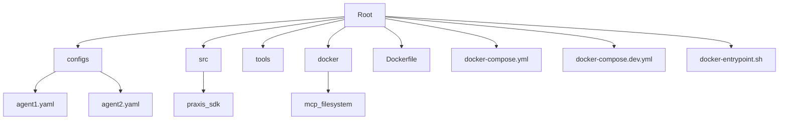
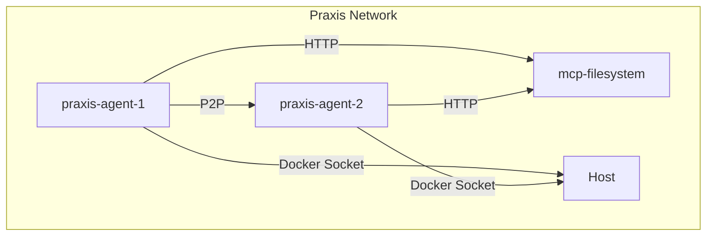
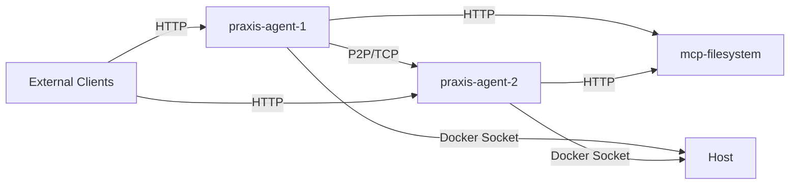

# Docker Deployment


## Table of Contents
1. [Introduction](#introduction)
2. [Project Structure](#project-structure)
3. [Dockerfile Analysis](#dockerfile-analysis)
4. [Multi-Container Orchestration](#multi-container-orchestration)
5. [Development vs Production Configuration](#development-vs-production-configuration)
6. [Entrypoint Script and Runtime Configuration](#entrypoint-script-and-runtime-configuration)
7. [Service Networking and Health Checks](#service-networking-and-health-checks)
8. [Volume Mounting and Data Persistence](#volume-mounting-and-data-persistence)
9. [Security and Dependency Management](#security-and-dependency-management)
10. [Deployment Instructions](#deployment-instructions)
11. [Troubleshooting Guide](#troubleshooting-guide)

## Introduction
This document provides a comprehensive overview of the Docker deployment strategy for the Praxis Python SDK. It details the containerization approach, multi-container orchestration, environment-specific configurations, and best practices for deployment. The system is designed to support agent-based distributed computing with P2P networking, MCP tool integration, and LLM-powered workflows. The deployment leverages Docker Compose for service orchestration and includes both production and development configurations.

## Project Structure
The project follows a modular structure with clear separation between source code, configuration, and infrastructure files. Key directories include:
- `src/praxis_sdk`: Core application logic and modules
- `configs`: Environment-specific YAML configuration files
- `tools`: External tool implementations used by agents
- `docker/mcp_filesystem`: Dedicated MCP server implementation
- Root-level Docker and Compose files for containerization



**Diagram sources**
- [Dockerfile](file://Dockerfile)
- [docker-compose.yml](file://docker-compose.yml)

**Section sources**
- [Dockerfile](file://Dockerfile)
- [docker-compose.yml](file://docker-compose.yml)

## Dockerfile Analysis
The Dockerfile implements a production-ready container image with optimized dependencies and security considerations.

### Base Image and Environment
```Dockerfile
FROM python:3.11-slim

ENV PYTHONDONTWRITEBYTECODE=1 \
    PYTHONUNBUFFERED=1 \
    PYTHONPATH=/app/src
```
The image uses `python:3.11-slim` as the base, providing a minimal footprint while ensuring Python 3.11 compatibility. Environment variables prevent bytecode writing and ensure unbuffered output for better logging.

### System Dependencies
```Dockerfile
RUN apt-get update && apt-get install -y \
    build-essential \
    libgmp-dev \
    libssl-dev \
    libffi-dev \
    pkg-config \
    curl \
    wget \
    net-tools \
    ca-certificates \
    gnupg \
    lsb-release \
    && rm -rf /var/lib/apt/lists/*
```
Installs essential build tools and cryptographic libraries required for libp2p and secure communications.

### Docker and Dagger CLI Installation
```Dockerfile
# Install Docker CLI (required by Dagger Engine)
RUN curl -fsSL https://download.docker.com/linux/debian/gpg | gpg --dearmor -o /usr/share/keyrings/docker-archive-keyring.gpg && \
    echo "deb [arch=$(dpkg --print-architecture) signed-by=/usr/share/keyrings/docker-archive-keyring.gpg] https://download.docker.com/linux/debian $(lsb_release -cs) stable" | tee /etc/apt/sources.list.d/docker.list > /dev/null && \
    apt-get update && \
    apt-get install -y docker-ce-cli && \
    rm -rf /var/lib/apt/lists/*

# Install Dagger CLI manually with specific version
ARG DAGGER_VERSION=0.18.14
RUN curl -L "https://dl.dagger.io/dagger/releases/${DAGGER_VERSION}/dagger_v${DAGGER_VERSION}_linux_$(dpkg --print-architecture | sed 's/amd64/amd64/; s/arm64/arm64/').tar.gz" -o /tmp/dagger.tar.gz && \
    tar -xzf /tmp/dagger.tar.gz -C /tmp && \
    mv /tmp/dagger /usr/local/bin/ && \
    chmod +x /usr/local/bin/dagger && \
    rm /tmp/dagger.tar.gz && \
    dagger version
```
Installs Docker CLI for container operations and Dagger CLI for workflow execution, ensuring version compatibility.

### Python Dependencies
```Dockerfile
RUN pip install --no-cache-dir \
    libp2p \
    trio \
    trio-asyncio \
    multiaddr \
    loguru \
    pydantic \
    pydantic-settings \
    fastapi \
    uvicorn \
    httpx \
    pyyaml \
    openai \
    websockets \
    aiofiles \
    jinja2 \
    click \
    python-multipart \
    docker \
    gql[all]==3.5.0 \
    dagger-io==0.18.14
```
Installs core Python dependencies with pinned versions for stability, including P2P networking, API framework, and LLM integration libraries.

### Directory Structure and Ports
```Dockerfile
RUN mkdir -p logs data

EXPOSE 8000 4001
```
Creates directories for logs and data persistence and exposes ports for HTTP API (8000) and P2P communication (4001).

**Section sources**
- [Dockerfile](file://Dockerfile#L1-L75)

## Multi-Container Orchestration
The deployment uses Docker Compose to manage multiple services with proper networking and dependencies.

### Production Orchestration (docker-compose.yml)


The production configuration defines three services:
- **praxis-agent-1**: Primary agent with HTTP API on port 8000
- **praxis-agent-2**: Secondary agent with HTTP API on port 8001
- **mcp-filesystem**: External MCP server for filesystem operations

### Service Configuration
Each agent service includes:
- Fixed port mappings for HTTP, WebSocket, P2P, and SSE
- Environment variables for configuration
- Volume mounts for shared data and configuration
- Health checks for service reliability
- Docker socket access for Dagger operations

```yaml
healthcheck:
  test: ["CMD", "curl", "-f", "http://localhost:8000/health"]
  interval: 10s
  timeout: 5s
  retries: 3
  start_period: 30s
```

### Network Configuration
```yaml
networks:
  praxis-net:
    name: praxis-net
    driver: bridge
    enable_ipv6: false
    driver_opts:
      com.docker.network.bridge.enable_icc: "true"
      com.docker.network.bridge.enable_ip_masquerade: "true"
      com.docker.network.bridge.host_binding_ipv4: "0.0.0.0"
```
Creates a dedicated bridge network with ICC (inter-container communication) enabled for agent discovery and communication.

**Diagram sources**
- [docker-compose.yml](file://docker-compose.yml#L1-L155)

**Section sources**
- [docker-compose.yml](file://docker-compose.yml#L1-L155)

## Development vs Production Configuration
The deployment strategy differentiates between development and production environments through configuration overrides.

### Development Configuration (docker-compose.dev.yml)
```yaml
# Docker Compose override for development
services:
  orchestrator:
    volumes:
      - ./src:/app/src:ro
      - ./configs:/app/configs:ro
      - ./shared:/shared:rw
      - ./logs:/app/logs:rw
      - ./keys:/app/keys:rw
      - ./data:/app/data:rw
    environment:
      - PRAXIS_ENV=development
      - PRAXIS_DEBUG=true
      - PRAXIS_LOG_LEVEL=DEBUG
```

### Key Differences
| Aspect | Development | Production |
|------|-------------|------------|
| **Volume Mounts** | Read-only source code, writable logs/data | Similar but optimized for production |
| **Environment Variables** | Debug mode enabled, verbose logging | Optimized for performance |
| **Configuration** | Development-specific settings | Production-specific settings |
| **Port Exposure** | Full port mapping for debugging | Minimal necessary exposure |

### Configuration Inheritance
The development configuration is designed to be used as an override:
```bash
docker-compose -f docker-compose.yml -f docker-compose.dev.yml up
```
This approach allows maintaining a single source of truth while enabling environment-specific customizations.

**Section sources**
- [docker-compose.yml](file://docker-compose.yml)
- [docker-compose.dev.yml](file://docker-compose.dev.yml)

## Entrypoint Script and Runtime Configuration
The docker-entrypoint.sh script handles runtime dependency management and command execution.

### Entrypoint Script Analysis
```bash
#!/bin/bash
set -e

# Ensure Poetry is in the path
export PATH="/usr/local/bin:$PATH"

# Install dependencies if not already installed
if ! poetry run python -c "import trio" 2>/dev/null; then
    echo "Installing dependencies..."
    poetry install --with dev
fi

# Run the command passed as arguments
exec poetry run "$@"
```

### Key Features
- **Path Configuration**: Ensures Poetry is available in the execution path
- **Dependency Check**: Verifies critical dependency (trio) is installed
- **Conditional Installation**: Only installs dependencies if missing
- **Command Execution**: Uses `exec` to replace the shell process with the target command

### Runtime Behavior
The script enables flexible deployment by:
1. Checking for existing dependencies to avoid redundant installations
2. Supporting development workflows with dev dependencies
3. Maintaining clean process hierarchy through `exec`
4. Ensuring error propagation with `set -e`

**Section sources**
- [docker-entrypoint.sh](file://docker-entrypoint.sh#L1-L14)

## Service Networking and Health Checks
The deployment implements robust networking and health monitoring for service reliability.

### Network Topology


### Health Check Implementation
Both agents implement HTTP-based health checks:
```yaml
healthcheck:
  test: ["CMD", "curl", "-f", "http://localhost:8000/health"]
  interval: 10s
  timeout: 5s
  retries: 3
  start_period: 30s
```

### Key Parameters
- **Test Command**: Uses curl to check the `/health` endpoint
- **Interval**: 10 seconds between checks
- **Timeout**: 5 seconds to respond
- **Retries**: 3 consecutive failures before restart
- **Start Period**: 30 seconds grace period on startup

### Service Dependencies
```yaml
depends_on:
  praxis-agent-1:
    condition: service_healthy
```
Ensures proper startup order and dependency resolution between agents.

**Diagram sources**
- [docker-compose.yml](file://docker-compose.yml#L1-L155)

**Section sources**
- [docker-compose.yml](file://docker-compose.yml#L1-L155)

## Volume Mounting and Data Persistence
The deployment strategy implements comprehensive volume mounting for configuration, data, and shared resources.

### Volume Configuration
```yaml
volumes:
  - ./shared:/app/shared
  - ./configs:/app/configs
  - ./keys:/app/keys
  - ./logs:/app/logs
  - ./src:/app/src:ro
  - ./data:/app/data
  - ./tools:/app/tools:ro
  - /var/run/docker.sock:/var/run/docker.sock
```

### Volume Purposes
| Volume | Host Path | Container Path | Purpose | Access Mode |
|-------|-----------|----------------|---------|-------------|
| Shared Data | ./shared | /app/shared | Cross-agent data sharing | Read-Write |
| Configuration | ./configs | /app/configs | Agent configuration files | Read-Only |
| Keys | ./keys | /app/keys | Cryptographic keys for P2P | Read-Write |
| Logs | ./logs | /app/logs | Application logging | Read-Write |
| Source Code | ./src | /app/src | Application source | Read-Only |
| Data | ./data | /app/data | Persistent data storage | Read-Write |
| Tools | ./tools | /app/tools | External tool implementations | Read-Only |
| Docker Socket | /var/run/docker.sock | /var/run/docker.sock | Docker API access | Read-Write |

### Data Persistence Strategy
The configuration ensures:
- Configuration files are synchronized across containers
- Log files persist beyond container lifecycle
- Shared data is accessible to all agents
- Cryptographic keys are preserved for P2P identity
- Docker socket access enables containerized tool execution

**Section sources**
- [docker-compose.yml](file://docker-compose.yml#L1-L155)

## Security and Dependency Management
The deployment implements several security and dependency management best practices.

### Security Considerations
- **Minimal Base Image**: Uses `python:3.11-slim` to reduce attack surface
- **Dependency Pinning**: Specifies exact versions for critical packages
- **Read-Only Mounts**: Source code and tools mounted as read-only
- **Environment Isolation**: Separate development and production configurations
- **Network Segmentation**: Dedicated bridge network for internal communication

### Dependency Management
- **System Dependencies**: Explicitly declared and minimized
- **Python Dependencies**: Installed via pip with `--no-cache-dir`
- **Version Pinning**: Dagger CLI and Python SDK versions aligned
- **Health Checks**: Ensure service reliability and automatic recovery

### Vulnerability Mitigation
- **Regular Updates**: Base image and dependencies kept current
- **Minimal Privilege**: No unnecessary permissions or capabilities
- **Secure Communication**: P2P connections use secure protocols
- **Configuration Hardening**: Sensitive data managed via environment variables

**Section sources**
- [Dockerfile](file://Dockerfile)
- [docker-compose.yml](file://docker-compose.yml)

## Deployment Instructions
Step-by-step guide for deploying the Praxis Python SDK.

### Prerequisites
- Docker Engine 20.10+
- Docker Compose 2.0+
- OpenAI API key (for LLM functionality)
- Optional: Apify API token (for Twitter scraping)

### Production Deployment
```bash
# Build and start all services
docker-compose up --build

# Start in detached mode
docker-compose up -d --build

# View logs
docker-compose logs -f

# Stop services
docker-compose down
```

### Development Deployment
```bash
# Use development override
docker-compose -f docker-compose.yml -f docker-compose.dev.yml up --build

# With environment variables
OPENAI_API_KEY=your_key docker-compose -f docker-compose.yml -f docker-compose.dev.yml up --build
```

### Configuration Customization
1. Copy sample configuration:
```bash
cp sample_config.yaml configs/agent1.yaml
```
2. Modify agent-specific settings in YAML files
3. Update environment variables as needed

### Service Management
```bash
# Restart specific service
docker-compose restart praxis-agent-1

# View service status
docker-compose ps

# Execute commands in running container
docker-compose exec praxis-agent-1 bash
```

**Section sources**
- [Dockerfile](file://Dockerfile)
- [docker-compose.yml](file://docker-compose.yml)
- [docker-compose.dev.yml](file://docker-compose.dev.yml)

## Troubleshooting Guide
Common issues and their solutions.

### Permission Errors
**Issue**: Docker socket access denied
**Solution**: Ensure user has Docker group membership
```bash
sudo usermod -aG docker $USER
```

### Network Isolation
**Issue**: Agents cannot discover each other
**Solution**: Verify network configuration and mDNS settings
- Check `praxis-net` bridge network
- Ensure `enable_icc` is true
- Verify container hostnames

### Log Aggregation
**Issue**: Logs not persisting or difficult to access
**Solution**: Use centralized logging approach
```bash
# View combined logs
docker-compose logs -f

# Follow specific service
docker-compose logs -f praxis-agent-1

# Export logs
docker-compose logs > deployment.log
```

### Health Check Failures
**Issue**: Service restarts due to failed health checks
**Solution**: 
- Verify `/health` endpoint is accessible
- Check port mappings and firewall settings
- Increase `start_period` if service needs more startup time

### Configuration Issues
**Issue**: Agent not loading expected configuration
**Solution**:
- Verify volume mount paths
- Check file permissions on configuration files
- Validate YAML syntax

### Dagger Integration Problems
**Issue**: Tool execution fails with Dagger
**Solution**:
- Verify Docker socket mount
- Check Dagger CLI version compatibility
- Ensure required tools are mounted in container

**Section sources**
- [docker-compose.yml](file://docker-compose.yml)
- [Dockerfile](file://Dockerfile)
- [configs/agent1.yaml](file://configs/agent1.yaml)

**Referenced Files in This Document**   
- [Dockerfile](file://Dockerfile)
- [docker-compose.yml](file://docker-compose.yml)
- [docker-compose.dev.yml](file://docker-compose.dev.yml)
- [docker-entrypoint.sh](file://docker-entrypoint.sh)
- [configs/agent1.yaml](file://configs/agent1.yaml)
- [configs/agent2.yaml](file://configs/agent2.yaml)
- [configs/agent_development.yaml](file://configs/agent_development.yaml)
- [configs/agent_production.yaml](file://configs/agent_production.yaml)