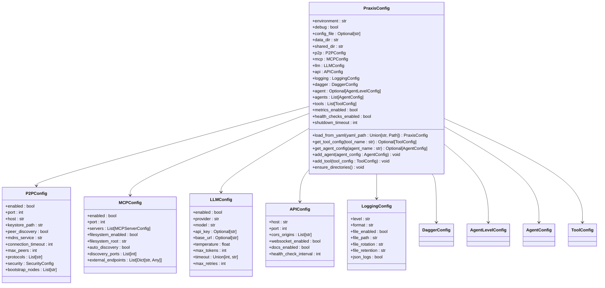

# Kubernetes Operations

## Table of Contents
1. [Introduction](#introduction)
2. [Project Structure](#project-structure)
3. [Core Components](#core-components)
4. [Architecture Overview](#architecture-overview)
5. [Detailed Component Analysis](#detailed-component-analysis)
6. [Dependency Analysis](#dependency-analysis)
7. [Performance Considerations](#performance-considerations)
8. [Troubleshooting Guide](#troubleshooting-guide)
9. [Conclusion](#conclusion)

## Introduction
This document provides a comprehensive Kubernetes operations guide for deploying and managing the Praxis agent framework in a cluster environment. It details the translation of Docker Compose configurations into Kubernetes manifests, container packaging using the provided Dockerfile, deployment of multiple agent instances with proper resource management, configuration handling via ConfigMaps and Secrets, scaling strategies, monitoring setup, logging configuration, and operational procedures including rolling updates, canary deployments, and disaster recovery.

## Project Structure

The Praxis Python SDK follows a modular structure organized by functionality and configuration:

**Diagram sources**
- [README.md](file://README.md#L1-L578)

**Section sources**
- [README.md](file://README.md#L1-L578)

## Core Components

The Praxis agent framework consists of several core components that enable distributed agent coordination, peer-to-peer communication, and tool execution:

- **Agent Coordinator**: Central orchestrator managing all subsystems (PraxisAgent class in agent.py)
- **Configuration System**: Hierarchical configuration loading from YAML files and environment variables (config.py)
- **API Server**: FastAPI-based HTTP and WebSocket server for external interaction (api/server.py)
- **P2P Service**: libp2p-based peer-to-peer networking for agent discovery and communication
- **MCP Service**: Model Context Protocol integration for tool server connectivity
- **Execution Engines**: Multiple execution backends including Dagger, Docker, and local execution
- **Event Bus**: Asynchronous event system for internal component communication

These components work together to create a distributed agent platform capable of autonomous task execution, collaboration, and workflow orchestration.

**Section sources**
- [agent.py](file://src/praxis_sdk/agent.py#L1-L1088)
- [config.py](file://src/praxis_sdk/config.py#L1-L412)
- [server.py](file://src/praxis_sdk/api/server.py#L1-L1063)

## Architecture Overview

The Praxis agent framework follows a microservices-inspired architecture with multiple interconnected components:

The architecture enables agents to communicate through multiple channels (HTTP, WebSocket, P2P), execute tools in isolated environments, and coordinate complex workflows through the event bus system.

**Diagram sources**
- [README.md](file://README.md#L1-L578)
- [agent.py](file://src/praxis_sdk/agent.py#L1-L1088)

## Detailed Component Analysis

### Agent Coordinator Analysis

The PraxisAgent class serves as the central coordinator for all SDK components, managing their lifecycle and interactions.

#### Class Diagram

**Diagram sources**
- [agent.py](file://src/praxis_sdk/agent.py#L1-L1088)

### Configuration System Analysis

The configuration system provides a flexible way to manage settings through YAML files and environment variables.

#### Class Diagram

**Diagram sources**
- [config.py](file://src/praxis_sdk/config.py#L1-L412)

### API Server Analysis

The API server provides HTTP and WebSocket endpoints for interacting with the Praxis agent.

#### Sequence Diagram

**Diagram sources**
- [server.py](file://src/praxis_sdk/api/server.py#L1-L1063)
- [agent.py](file://src/praxis_sdk/agent.py#L1-L1088)

## Dependency Analysis

The Praxis agent framework has a well-defined dependency structure that enables modular development and deployment.

The dependency graph shows that the PraxisAgent class serves as the central coordinator, depending on all major components. The API server has its own set of handlers that depend on the agent for business logic. Execution engines are pluggable components that can be selected based on the tool requirements.

**Diagram sources**
- [agent.py](file://src/praxis_sdk/agent.py#L1-L1088)
- [config.py](file://src/praxis_sdk/config.py#L1-L412)
- [server.py](file://src/praxis_sdk/api/server.py#L1-L1063)

## Performance Considerations

The Praxis agent framework is designed with performance in mind, particularly for distributed agent coordination and tool execution.

### Resource Management
- **Memory**: The agent uses asynchronous programming with Trio to minimize memory overhead
- **CPU**: Computationally intensive tasks are offloaded to execution engines
- **Network**: P2P communication uses efficient protocols with connection pooling
- **Disk I/O**: File operations are optimized through the shared directory structure

### Scalability Features
- **Horizontal Scaling**: Multiple agent instances can be deployed to handle increased load
- **Load Balancing**: Tasks are distributed across available agents through the A2A protocol
- **Caching**: LLM responses and tool execution results can be cached to improve performance
- **Connection Management**: The framework maintains persistent connections to reduce overhead

### Optimization Opportunities
- **Execution Engine Selection**: Choosing the appropriate execution engine (Dagger vs Local) based on tool requirements
- **Resource Limits**: Configuring proper CPU and memory limits for containerized tools
- **Connection Pooling**: Reusing connections to external services like LLM providers
- **Batch Processing**: Grouping similar tasks to reduce overhead

## Troubleshooting Guide

Common issues and their solutions when deploying and operating the Praxis agent framework:

### Configuration Issues
- **Missing Environment Variables**: Ensure all required environment variables are set, particularly OPENAI_API_KEY
- **Invalid YAML Configuration**: Validate YAML files for syntax errors using a YAML validator
- **Port Conflicts**: Check for port conflicts when running multiple agents on the same host

### Connectivity Problems
- **P2P Connection Failures**: Verify that bootstrap nodes are reachable and ports are open
- **API Server Not Responding**: Check if the API server port is correctly mapped and firewall rules allow traffic
- **MCP Server Unavailable**: Ensure external MCP servers are running and accessible

### Execution Engine Issues
- **Dagger Engine Not Available**: Install the correct version of the Dagger SDK (0.18.14)
- **Docker Socket Access**: Ensure the Docker socket is mounted and accessible to the container
- **Tool Execution Failures**: Check tool contracts and ensure required dependencies are installed

### Performance Problems
- **High Memory Usage**: Monitor memory usage and adjust resource limits accordingly
- **Slow Tool Execution**: Optimize tool implementations and consider using faster execution engines
- **API Latency**: Scale up agent instances or optimize the execution pipeline

**Section sources**
- [agent.py](file://src/praxis_sdk/agent.py#L1-L1088)
- [config.py](file://src/praxis_sdk/config.py#L1-L412)
- [server.py](file://src/praxis_sdk/api/server.py#L1-L1063)

## Conclusion

The Praxis agent framework provides a robust foundation for building distributed agent systems with advanced capabilities for peer-to-peer communication, tool integration, and workflow orchestration. By following the Kubernetes operations guidelines outlined in this document, organizations can effectively deploy and manage Praxis agents in production environments, leveraging the full power of container orchestration for scalability, reliability, and maintainability.

Key takeaways include:
- The importance of proper configuration management using ConfigMaps and Secrets
- The benefits of using Kubernetes for scaling and managing agent instances
- The value of monitoring and logging for operational visibility
- The need for robust disaster recovery procedures

With these practices in place, teams can successfully deploy and operate Praxis agents to solve complex problems requiring distributed intelligence and collaboration.

**Referenced Files in This Document**   
- [Dockerfile](file://Dockerfile)
- [docker-compose.yml](file://docker-compose.yml)
- [agent_production.yaml](file://configs/agent_production.yaml)
- [agent.py](file://src/praxis_sdk/agent.py)
- [config.py](file://src/praxis_sdk/config.py)
- [server.py](file://src/praxis_sdk/api/server.py)