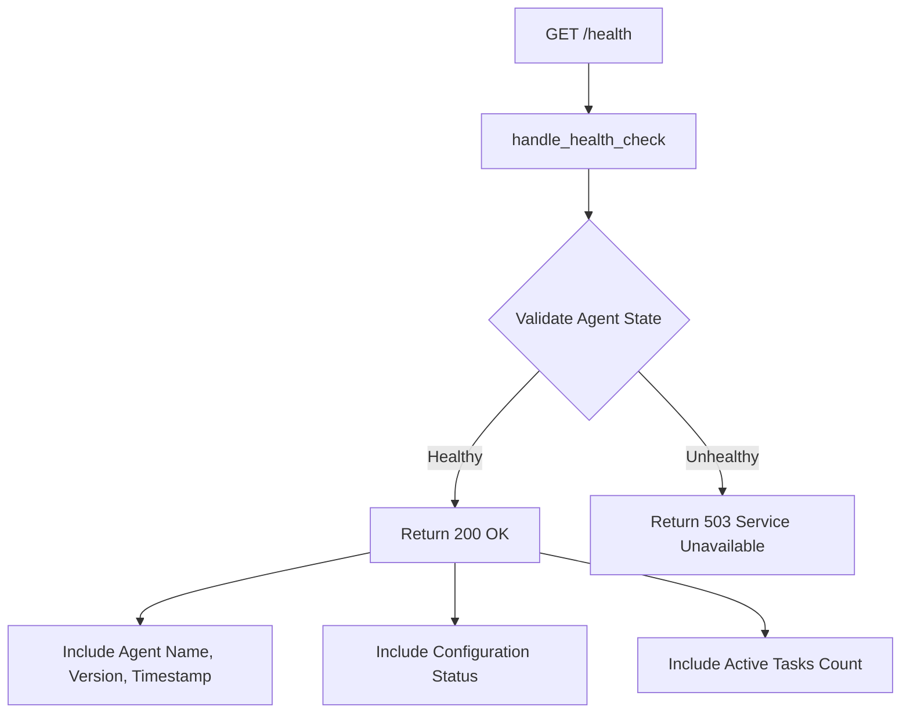
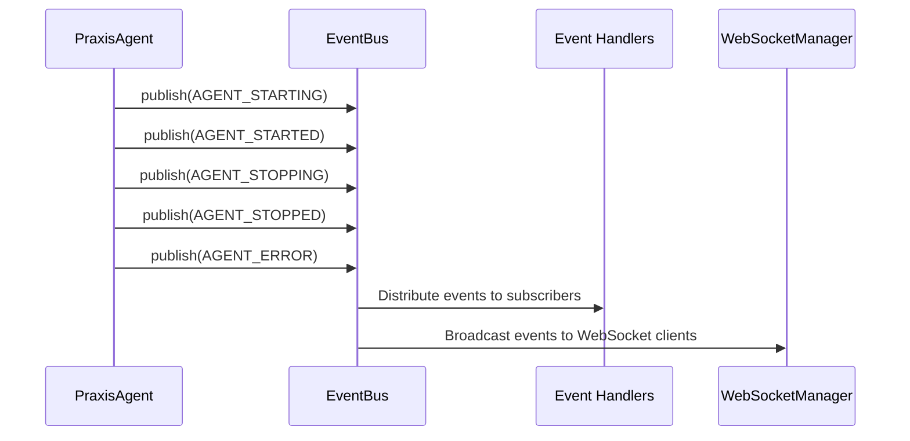
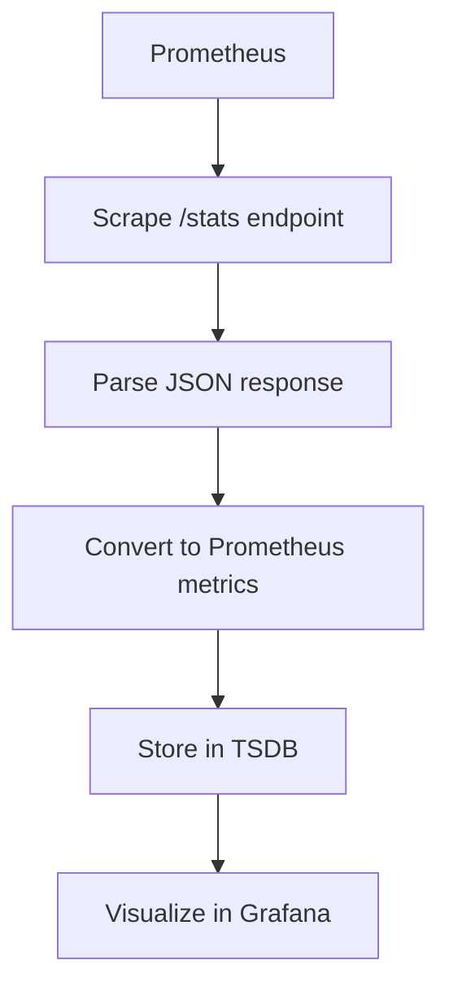
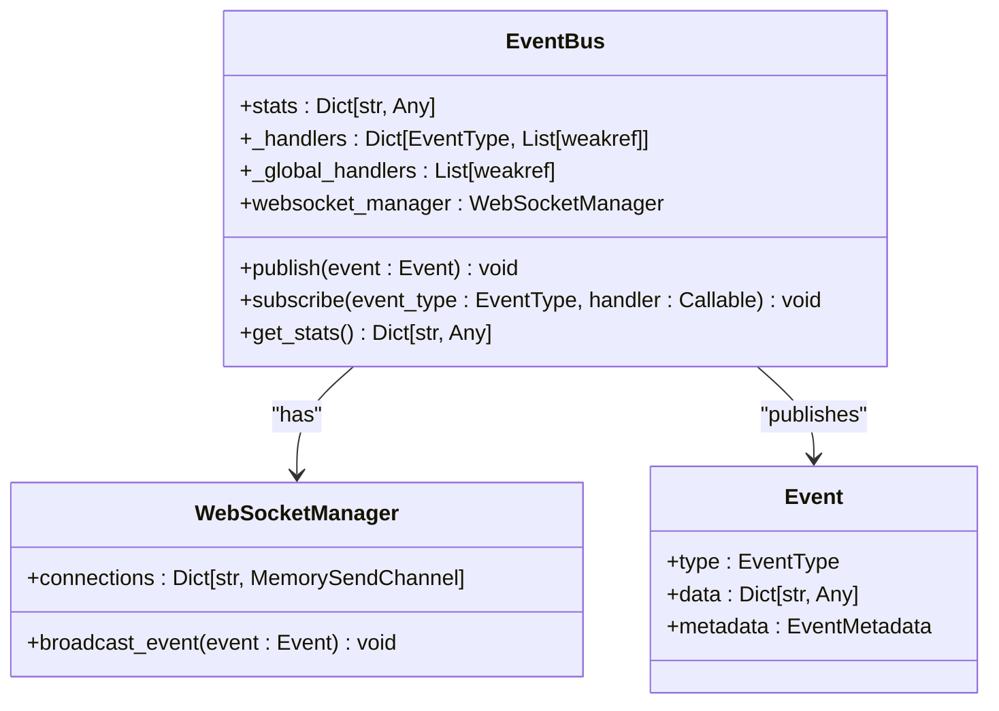

# Monitoring, Logging, and Observability


## Table of Contents
1. [Introduction](#introduction)
2. [Health Check Endpoints](#health-check-endpoints)
3. [Event Bus and Lifecycle Telemetry](#event-bus-and-lifecycle-telemetry)
4. [Log Collection and Aggregation](#log-collection-and-aggregation)
5. [Metrics Integration with Prometheus and Datadog](#metrics-integration-with-prometheus-and-datadog)
6. [Event-Driven Telemetry and Workflow Tracking](#event-driven-telemetry-and-workflow-tracking)
7. [Dashboard and Visualization](#dashboard-and-visualization)
8. [Alerting Rules for Critical Failures](#alerting-rules-for-critical-failures)
9. [Log Retention, Sampling, and Performance Impact](#log-retention-sampling-and-performance-impact)

## Introduction
The Praxis agent system provides comprehensive monitoring, logging, and observability features to ensure system reliability, performance, and debuggability. This document details the built-in health check endpoints, event-driven telemetry from the event bus, log aggregation strategies, metrics exposure for monitoring systems, and alerting mechanisms. The system is designed to support both standalone and distributed deployments with robust observability at every layer.

## Health Check Endpoints
The Praxis API server exposes a `/health` endpoint that returns the current health status of the agent. This endpoint is implemented in the `RequestHandlers` class and provides detailed information about the agent's operational state.



**Section sources**
- [api/handlers.py](file://src/praxis_sdk/api/handlers.py#L27-L64)
- [api/server.py](file://src/praxis_sdk/api/server.py#L133-L176)

The health check response includes:
- **status**: "healthy" or "unhealthy"
- **agent**: Agent name from configuration
- **version**: System version
- **timestamp**: Current UTC timestamp
- **uptime_seconds**: Running duration (currently placeholder)
- **config**: P2P enabled status, LLM availability, tools count, and active tasks

Additional health-related endpoints include:
- `/stats`: Comprehensive statistics from API gateway, request handlers, WebSocket manager, and event bus
- `/cache/stats`: Cache size and status information
- `/mcp/stats`: MCP service statistics including request counts and tool execution metrics

## Event Bus and Lifecycle Telemetry
The Praxis system uses a Trio-based event bus (`bus.py`) as the central nervous system for telemetry and inter-component communication. The event bus publishes lifecycle events that can be consumed for monitoring and debugging purposes.

### Agent Lifecycle Events
The event bus emits the following agent lifecycle events:
- **AGENT_STARTING**: Agent initialization begins
- **AGENT_STARTED**: Agent successfully started
- **AGENT_STOPPING**: Agent shutdown initiated
- **AGENT_STOPPED**: Agent stopped
- **AGENT_ERROR**: Agent encountered an error



**Diagram sources**
- [bus.py](file://src/praxis_sdk/bus.py#L323-L367)
- [agent.py](file://src/praxis_sdk/agent.py#L200-L250)

**Section sources**
- [bus.py](file://src/praxis_sdk/bus.py#L323-L367)
- [agent.py](file://src/praxis_sdk/agent.py#L200-L250)

### P2P Connectivity Events
Peer-to-peer connectivity events provide visibility into network topology:
- **P2P_PEER_DISCOVERED**: New peer detected
- **P2P_PEER_CONNECTED**: Successful connection established
- **P2P_PEER_DISCONNECTED**: Connection terminated
- **P2P_CARD_EXCHANGE**: Agent capability cards exchanged

### Task Execution Events
Task lifecycle events track workflow progress:
- **TASK_CREATED**: New task initialized
- **TASK_STARTED**: Task execution begins
- **TASK_PROGRESS**: Intermediate progress updates
- **TASK_COMPLETED**: Task finished successfully
- **TASK_FAILED**: Task execution failed
- **TASK_CANCELLED**: Task was cancelled

## Log Collection and Aggregation
Praxis uses Loguru for structured logging with support for both console and file output. Logs can be collected and aggregated using standard tools like ELK Stack or Grafana Loki.

### Log Configuration
The logging system is configured through the agent's configuration with the following parameters:
- **level**: Log level (DEBUG, INFO, WARNING, ERROR)
- **format**: Log format (text or structured)
- **file_enabled**: Enable file logging
- **file_path**: Path to log file
- **file_rotation**: Log rotation policy
- **file_retention**: Log retention period
- **json_logs**: Output logs in JSON format

```python
# Example log entry
INFO 2023-12-07 10:30:45 | agent.orchestrator | Praxis Agent 'orchestrator' started successfully
INFO 2023-12-07 10:31:15 | p2p.service | P2P Peer ID: 12D3KooW...
INFO 2023-12-07 10:32:01 | request_handlers | A2A HTTP REQUEST id=123 method=message/send
```

### Integration with ELK Stack
To integrate with ELK (Elasticsearch, Logstash, Kibana):
1. Configure Praxis to output JSON logs
2. Use Filebeat to collect log files from containers or pods
3. Ship logs to Logstash for processing
4. Store in Elasticsearch and visualize in Kibana

### Integration with Grafana Loki
For Loki-based aggregation:
1. Use Promtail to collect logs from Praxis containers
2. Configure labels for agent_name, component, and environment
3. Query logs using LogQL in Grafana

**Section sources**
- [agent.py](file://src/praxis_sdk/agent.py#L150-L180)
- [config.py](file://src/praxis_sdk/config.py#L139-L181)

## Metrics Integration with Prometheus and Datadog
Praxis exposes metrics endpoints that can be scraped by monitoring systems like Prometheus or forwarded to Datadog.

### Prometheus Integration
The `/stats` endpoint provides metrics in a format that can be easily converted to Prometheus exposition format. Key metrics include:



Key metrics available:
- **event_bus_events_published**: Total events published
- **event_bus_events_processed**: Total events processed
- **event_bus_handler_errors**: Number of handler errors
- **websocket_connections**: Current WebSocket connections
- **api_requests_total**: Total API requests
- **api_requests_successful**: Successful API requests
- **api_requests_failed**: Failed API requests
- **task_count_active**: Currently active tasks
- **mcp_requests_total**: MCP service requests
- **mcp_tools_executed**: MCP tools executed

### Datadog Integration
For Datadog integration:
1. Use the Datadog Agent to collect metrics from the `/stats` endpoint
2. Configure custom metrics in Datadog
3. Use tags for agent_name, environment, and component
4. Create monitors and dashboards

**Section sources**
- [api/server.py](file://src/praxis_sdk/api/server.py#L623-L654)
- [mcp/service.py](file://src/praxis_sdk/mcp/service.py#L200-L240)
- [bus.py](file://src/praxis_sdk/bus.py#L323-L367)

## Event-Driven Telemetry and Workflow Tracking
The event bus serves as the foundation for tracking agent communication, task execution, and errors across the system.

### Event Bus Architecture
The EventBus class provides a publish-subscribe pattern for decoupled component communication:



**Diagram sources**
- [bus.py](file://src/praxis_sdk/bus.py#L323-L367)

**Section sources**
- [bus.py](file://src/praxis_sdk/bus.py#L323-L367)

### Workflow Progress Tracking
The system tracks LLM workflow progress through specific event types:
- **DSL_COMMAND_RECEIVED**: Natural language command received
- **DSL_COMMAND_PROGRESS**: LLM planning and analysis in progress
- **DSL_COMMAND_COMPLETED**: Command processing completed
- **WORKFLOW_STARTED**: Workflow execution begins
- **WORKFLOW_PROGRESS**: Workflow intermediate state
- **WORKFLOW_COMPLETED**: Workflow finished

These events include correlation IDs to trace requests across components and provide end-to-end visibility into complex workflows orchestrated by the LLM.

## Dashboard and Visualization
Praxis provides built-in dashboards and visualization endpoints for monitoring system health and performance.

### Built-in Dashboard Endpoints
The API server exposes several endpoints for dashboard data:
- `/stats`: Comprehensive system statistics
- `/p2p/peers`: Connected peers information
- `/p2p/cards`: Peer capability cards
- `/p2p/tools`: Available tools from connected peers
- `/tasks`: Active tasks with state and progress
- `/tools`: Available tools and their status

### Recommended Dashboard Panels
For effective monitoring, create dashboards with the following panels:

**System Health Panel**
- Agent status (healthy/unhealthy)
- Uptime and startup time
- Resource utilization
- Error rates

**P2P Connectivity Panel**
- Network topology visualization
- Connected peers count
- Peer discovery rate
- Connection stability

**LLM Workflow Panel**
- Commands processed per minute
- Average processing time
- Success/failure rates
- Top commands and tools used

**Performance Panel**
- Request latency distribution
- Event processing rate
- WebSocket connection count
- Cache hit ratio

## Alerting Rules for Critical Failures
Implement alerting rules to detect and respond to critical failures in the Praxis system.

### Critical Alerting Rules
**Agent Disconnection Alert**
```
IF count(p2p_peer_connected) BY agent_name == 0 FOR 5m
THEN Critical: Agent has lost all P2P connections
```

**Execution Engine Crash Alert**
```
IF increase(mcp_requests_total{error="execution_engine_crash"}[15m]) > 0
THEN Critical: Execution engine crashed
```

**High Error Rate Alert**
```
IF (api_requests_failed / api_requests_total) > 0.1 FOR 10m
THEN Critical: API error rate exceeds 10%
```

**Event Bus Backlog Alert**
```
IF event_bus_events_published - event_bus_events_processed > 1000
THEN Warning: Event bus processing backlog detected
```

**Cache Failure Alert**
```
IF increase(cache_errors_total[15m]) > 5
THEN Critical: Cache system experiencing errors
```

### Alerting Configuration
Configure alerts with appropriate severity levels:
- **Critical**: Immediate attention required, page on-call engineer
- **High**: Requires investigation within 1 hour
- **Medium**: Should be addressed during business hours
- **Low**: Informational, review during routine maintenance

## Log Retention, Sampling, and Performance Impact
Praxis provides configurable log retention and performance optimization options to balance observability with system efficiency.

### Log Retention Configuration
Log retention is controlled through the configuration system:
- **file_retention**: Number of days to retain log files
- **file_rotation**: Size or time-based rotation (e.g., "100 MB" or "1 day")
- **max_log_files**: Maximum number of archived log files to keep

### Sampling Strategies
For high-volume deployments, implement sampling:
- **Head-based sampling**: Sample a percentage of all requests
- **Tail-based sampling**: Sample requests that exceed latency thresholds
- **Adaptive sampling**: Adjust sampling rate based on system load

### Performance Impact Mitigation
The observability system is designed to minimize performance impact:
- **Asynchronous processing**: Event handling and logging occur in background tasks
- **Bounded buffers**: Event queues have maximum sizes to prevent memory exhaustion
- **Weak references**: Event handlers use weak references to prevent memory leaks
- **Rate limiting**: High-frequency events are rate-limited or aggregated

The event bus uses a semaphore to limit concurrent handler execution, preventing system overload during high event volumes.

**Section sources**
- [bus.py](file://src/praxis_sdk/bus.py#L323-L367)
- [agent.py](file://src/praxis_sdk/agent.py#L150-L180)
- [config.py](file://src/praxis_sdk/config.py#L139-L181)

**Referenced Files in This Document**   
- [agent.py](file://src/praxis_sdk/agent.py)
- [bus.py](file://src/praxis_sdk/bus.py)
- [api/handlers.py](file://src/praxis_sdk/api/handlers.py)
- [api/server.py](file://src/praxis_sdk/api/server.py)
- [mcp/service.py](file://src/praxis_sdk/mcp/service.py)
- [config.py](file://src/praxis_sdk/config.py)