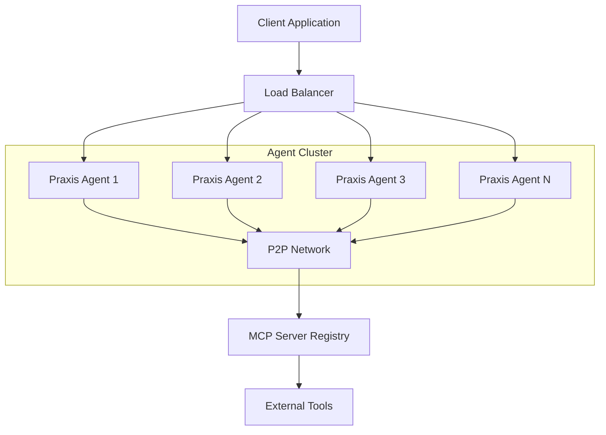
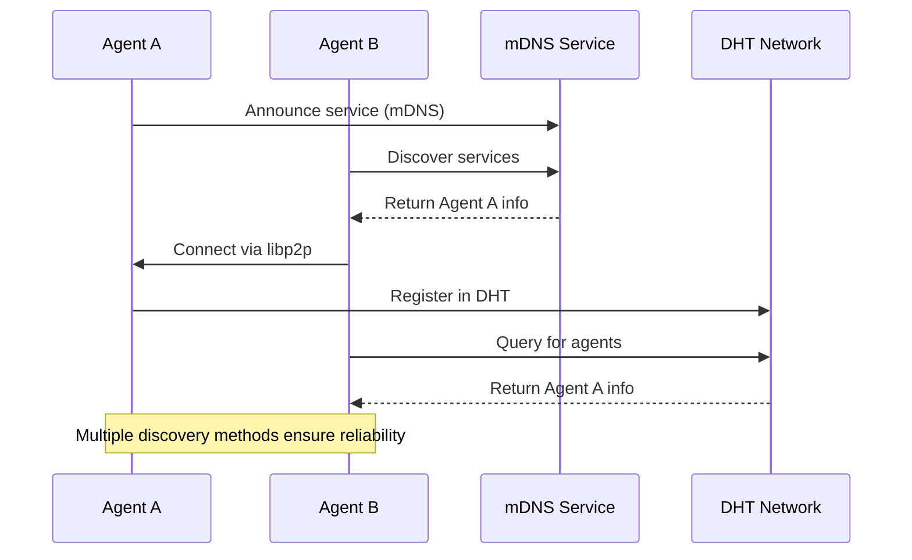
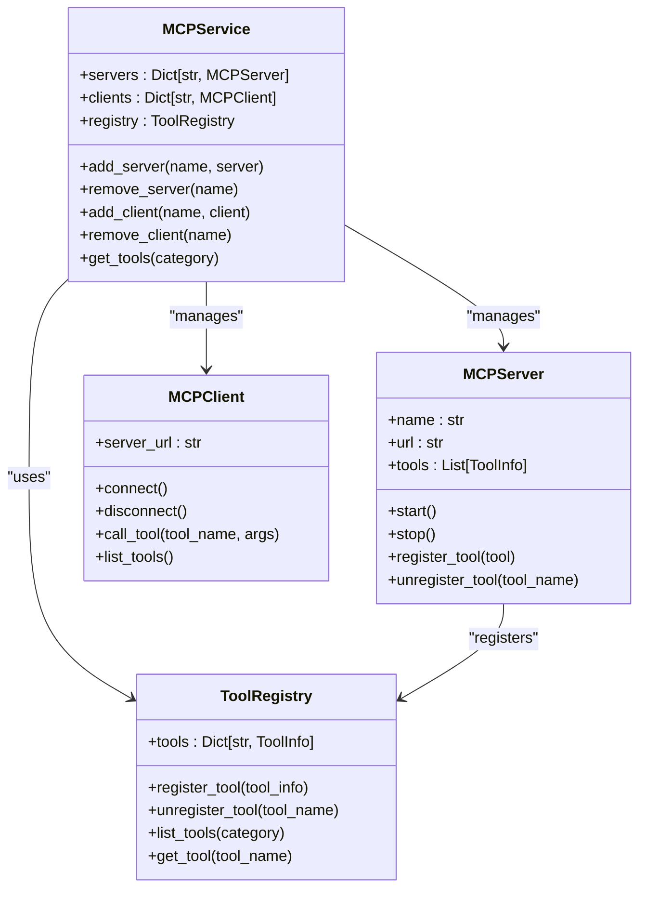
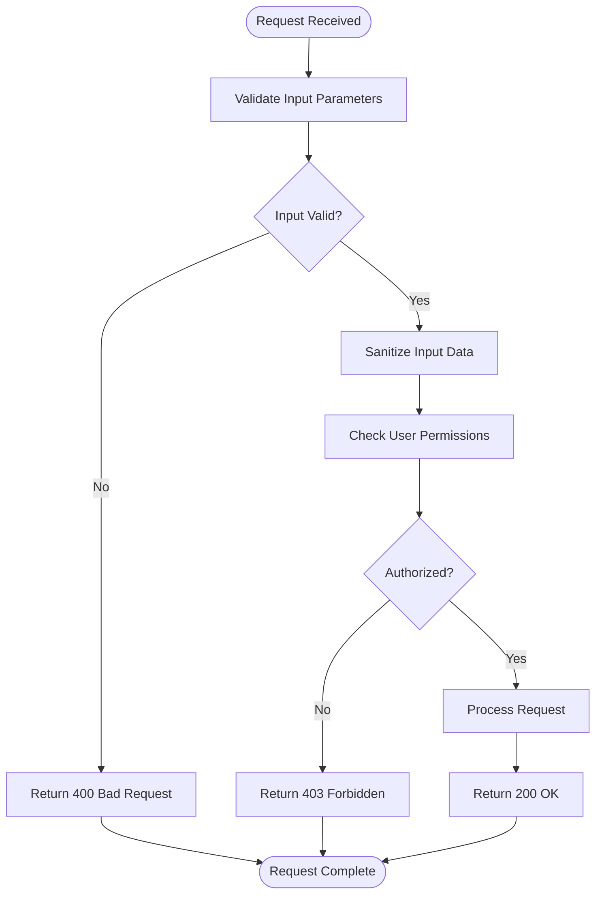

# Scaling and Security Hardening


## Table of Contents
1. [Introduction](#introduction)
2. [Horizontal Scaling and Load Distribution](#horizontal-scaling-and-load-distribution)
3. [P2P Service Discovery and MCP Registration](#p2p-service-discovery-and-mcp-registration)
4. [Security Hardening](#security-hardening)
5. [Docker and Host System Hardening](#docker-and-host-system-hardening)
6. [Input Validation and Rate Limiting](#input-validation-and-rate-limiting)
7. [Production Readiness Checklist](#production-readiness-checklist)
8. [Secure Configuration Example](#secure-configuration-example)

## Introduction
This document provides comprehensive guidance on scaling strategies and security hardening for production deployments of the Praxis Python SDK. It covers horizontal scaling of agent instances, load distribution patterns, P2P service discovery, MCP server registration, and various security best practices. The document also includes hardening steps for Docker containers and host systems, secure handling of LLM API keys, and protection against denial-of-service attacks. A production readiness checklist and secure configuration example are provided to ensure robust deployment.

## Horizontal Scaling and Load Distribution

### Agent Instance Scaling
The Praxis SDK supports horizontal scaling of agent instances through multiple deployment patterns. The system can be scaled by increasing the number of agent instances in a cluster, allowing for distributed workload processing and improved fault tolerance.



**Diagram sources**
- [agent_production.yaml](file://configs/agent_production.yaml)
- [discovery.py](file://src/praxis_sdk/p2p/discovery.py)

**Section sources**
- [agent_production.yaml](file://configs/agent_production.yaml)
- [discovery.py](file://src/praxis_sdk/p2p/discovery.py)

### Load Distribution Patterns
The Praxis SDK implements several load distribution patterns to ensure optimal resource utilization and prevent overloading individual agents:

1. **Round-Robin Distribution**: Incoming requests are distributed evenly across available agents.
2. **Weighted Distribution**: Agents with higher capacity receive proportionally more requests.
3. **Least Connections**: Requests are routed to the agent with the fewest active connections.
4. **Session Affinity**: Related requests are directed to the same agent when state persistence is required.

The load distribution is managed through the P2P network, where agents advertise their current load and capabilities, allowing intelligent routing of tasks to the most suitable nodes.

## P2P Service Discovery and MCP Registration

### P2P Service Discovery Mechanism
The Praxis SDK implements a robust P2P service discovery system that enables agents to automatically detect and connect with each other in the network. The discovery process uses multiple mechanisms:



**Diagram sources**
- [discovery.py](file://src/praxis_sdk/p2p/discovery.py)
- [agent_production.yaml](file://configs/agent_production.yaml)

**Section sources**
- [discovery.py](file://src/praxis_sdk/p2p/discovery.py)
- [agent_production.yaml](file://configs/agent_production.yaml)

The P2P discovery service uses mDNS for local network discovery and DHT (Distributed Hash Table) for global discovery. The configuration in `agent_production.yaml` enables both methods with appropriate settings:

```yaml
p2p:
  enabled: true
  port: 4001
  host: "0.0.0.0"
  rendezvous: "praxis-agents-prod"
  enable_mdns: true
  enable_dht: true
  enable_relay: true
  bootstrap_nodes:
    - "/ip4/10.0.0.100/tcp/4001/p2p/12D3KooWExample1"
    - "/ip4/10.0.0.101/tcp/4001/p2p/12D3KooWExample2"
```

### MCP Server Registration and Management
The MCP (Model Context Protocol) service handles registration and management of MCP servers, enabling agents to discover and utilize external tools and services:



**Diagram sources**
- [service.py](file://src/praxis_sdk/mcp/service.py)
- [server.py](file://src/praxis_sdk/mcp/server.py)

**Section sources**
- [service.py](file://src/praxis_sdk/mcp/service.py)
- [server.py](file://src/praxis_sdk/mcp/server.py)

The MCP service maintains a registry of available tools and servers, allowing agents to dynamically discover and utilize capabilities across the network. When a new MCP server is registered, the service broadcasts the updated tool availability to all connected peers through the P2P network.

## Security Hardening

### Network Segmentation
Implement network segmentation to isolate different components of the Praxis system:

1. **API Network**: Expose HTTP and WebSocket endpoints to clients.
2. **P2P Network**: Isolate P2P communication between agents.
3. **Management Network**: Separate network for monitoring and administration.
4. **Database Network**: Isolated network for data storage components.

### TLS Configuration
Secure all API and WebSocket endpoints with TLS encryption:

```yaml
p2p:
  security:
    enabled: true
    noise_enabled: true
    private_key_path: "/app/keys/priv.key"
    public_key_path: "/app/keys/pub.key"
```

The configuration enables Noise protocol encryption for P2P communications, ensuring end-to-end encryption between agents. For HTTP and WebSocket endpoints, TLS should be terminated at the load balancer or reverse proxy level.

### Authentication Mechanisms
Implement multiple authentication mechanisms:

1. **API Key Authentication**: For external clients accessing REST APIs.
2. **JWT Tokens**: For user authentication in web interfaces.
3. **Mutual TLS**: For service-to-service authentication in the P2P network.
4. **OAuth2**: For integration with external identity providers.

The system supports API key authentication through environment variables and configuration files, with keys stored securely in a secrets management system.

## Docker and Host System Hardening

### Docker Container Hardening
Apply the following hardening measures to Docker containers:

```dockerfile
FROM python:3.11-slim

# Create non-root user
RUN adduser --disabled-password --gecos '' praxis && \
    chown -R praxis:praxis /app

USER praxis
WORKDIR /app

COPY --chown=praxis:praxis . .
RUN pip install poetry && poetry install --no-dev

EXPOSE 8000 8090 4001
CMD ["poetry", "run", "praxis-agent", "configs/agent1.yaml", "praxis-agent-1"]
```

**Section sources**
- [Dockerfile](file://Dockerfile)
- [agent_production.yaml](file://configs/agent_production.yaml)

Key hardening measures include:
- Running containers as non-root users
- Using minimal base images (python:3.11-slim)
- Setting appropriate file permissions
- Removing unnecessary packages and tools
- Limiting container capabilities

### Host System Hardening
Secure the host systems running Praxis agents:

1. **Minimal OS Installation**: Install only necessary packages and services.
2. **Regular Updates**: Apply security patches promptly.
3. **Firewall Configuration**: Restrict network access to required ports only.
4. **Intrusion Detection**: Implement monitoring for suspicious activities.
5. **File Integrity Monitoring**: Track changes to critical system files.

The host system should be configured to meet industry security standards, with regular security audits and vulnerability scanning.

## Input Validation and Rate Limiting

### Input Validation
Implement comprehensive input validation to prevent injection attacks and other security vulnerabilities:



**Diagram sources**
- [server.py](file://src/praxis_sdk/api/server.py)
- [handlers.py](file://src/praxis_sdk/api/handlers.py)

**Section sources**
- [server.py](file://src/praxis_sdk/api/server.py)
- [handlers.py](file://src/praxis_sdk/api/handlers.py)

All inputs should be validated against defined schemas, with proper sanitization to prevent code injection and other attacks. The system should reject malformed requests with appropriate error codes.

### Rate Limiting
Implement rate limiting to protect against denial-of-service attacks:

```yaml
llm:
  rate_limiting:
    requests_per_minute: 500
    tokens_per_minute: 1000000
    burst_limit: 50
```

Rate limiting should be applied at multiple levels:
- Per-client rate limiting to prevent abuse
- Per-endpoint rate limiting to protect specific APIs
- Global rate limiting to prevent system overload
- Burst limiting to handle temporary traffic spikes

The rate limiting configuration should be tuned based on the system's capacity and expected usage patterns.

## Production Readiness Checklist

### Backup Procedures
Implement comprehensive backup procedures for agent state and configuration:

1. **Configuration Backups**: Regularly backup configuration files.
2. **State Backups**: Periodically backup agent state and persistent data.
3. **Tool Contracts**: Backup tool contract definitions.
4. **Key Material**: Securely backup encryption keys and certificates.
5. **Automated Backups**: Implement automated backup processes with verification.

### Disaster Recovery Plan
Develop a comprehensive disaster recovery plan:

1. **Recovery Time Objective (RTO)**: Define acceptable downtime.
2. **Recovery Point Objective (RPO)**: Define acceptable data loss.
3. **Failover Procedures**: Document steps for switching to backup systems.
4. **Data Restoration**: Test data restoration procedures regularly.
5. **Communication Plan**: Establish communication protocols during incidents.

The disaster recovery plan should be tested regularly through simulated failure scenarios to ensure its effectiveness.

## Secure Configuration Example

### Production Configuration
The following is a secure production configuration example:

```yaml
agent:
  name: "praxis-python-prod"
  version: "1.0.0"
  description: "Praxis Python Agent - Production Environment"
  url: "http://0.0.0.0:8000"
  shared_dir: "/app/shared"
  max_concurrent_tasks: 20
  task_timeout: 300

p2p:
  enabled: true
  port: 4001
  host: "0.0.0.0"
  rendezvous: "praxis-agents-prod"
  enable_mdns: true
  enable_dht: true
  enable_relay: true
  bootstrap_nodes:
    - "/ip4/10.0.0.100/tcp/4001/p2p/12D3KooWExample1"
  security:
    enabled: true
    noise_enabled: true
    private_key_path: "/app/keys/priv.key"
    public_key_path: "/app/keys/pub.key"
    max_peer_connections: 200

http:
  enabled: true
  port: 8000
  host: "0.0.0.0"
  cors_origins:
    - "https://app.praxis.example.com"
  max_connections: 1000
  request_timeout: 60

websocket:
  enabled: true
  port: 8090
  host: "0.0.0.0"
  path: "/ws/workflow"
  max_connections: 500

mcp:
  enabled: true
  servers: []
  limits:
    max_concurrent_requests: 200
    request_timeout_ms: 60000

llm:
  enabled: true
  provider: "openai"
  api_key: "${OPENAI_API_KEY}"
  model: "gpt-4o"
  rate_limiting:
    requests_per_minute: 500
    tokens_per_minute: 1000000

execution:
  default_engine: "dagger"
  dagger:
    enabled: true
    mount_docker_socket: true
    resource_limits:
      cpu: "4000m"
      memory: "2Gi"

logging:
  level: "INFO"
  format: "json"
  enable_console: true
  enable_file: true
  file_path: "/app/logs/praxis-agent.log"

environment: "production"
debug: false
```

**Section sources**
- [agent_production.yaml](file://configs/agent_production.yaml)

This configuration represents a hardened production setup with appropriate security settings, resource limits, and operational parameters. The configuration uses environment variables for sensitive data like API keys and follows security best practices for production deployments.

**Referenced Files in This Document**   
- [agent_production.yaml](file://configs/agent_production.yaml)
- [discovery.py](file://src/praxis_sdk/p2p/discovery.py)
- [service.py](file://src/praxis_sdk/mcp/service.py)
- [integration.py](file://src/praxis_sdk/mcp/integration.py)
- [server.py](file://src/praxis_sdk/mcp/server.py)
- [config.py](file://src/praxis_sdk/config.py)
- [websocket.py](file://src/praxis_sdk/api/websocket.py)
- [server.py](file://src/praxis_sdk/api/server.py)
- [Dockerfile](file://Dockerfile)
- [docker-compose.yml](file://docker-compose.yml)