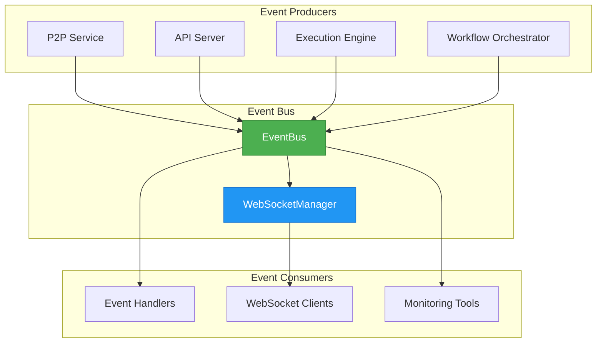
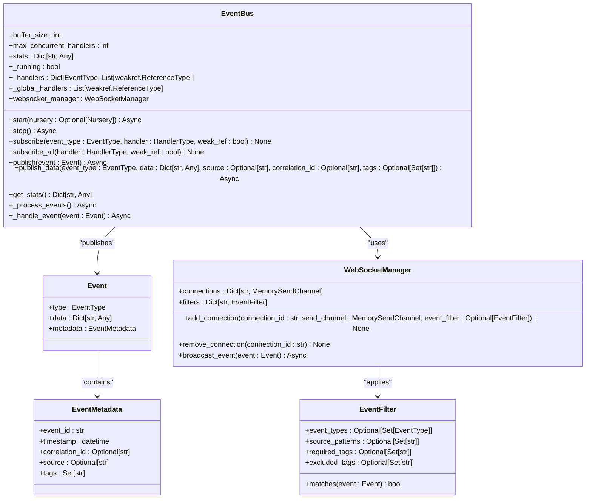
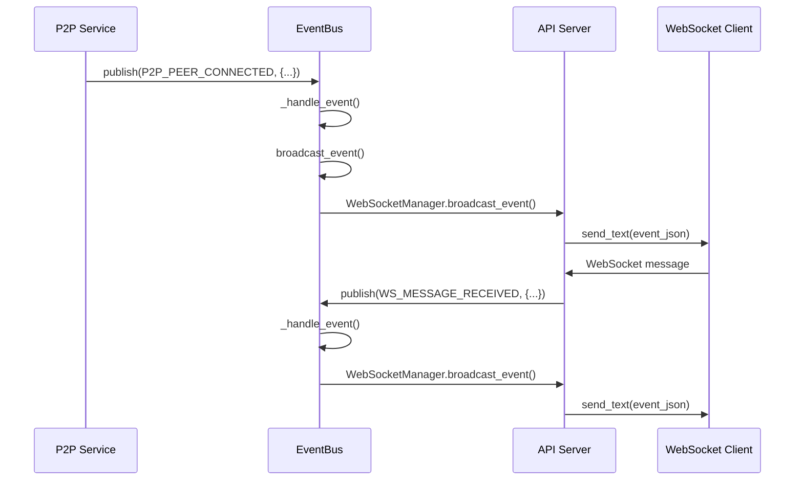
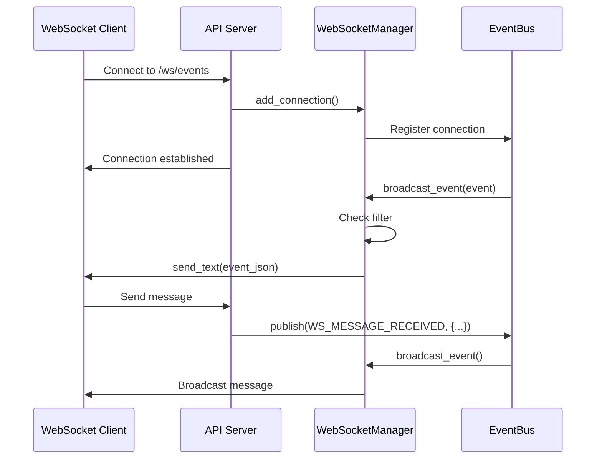
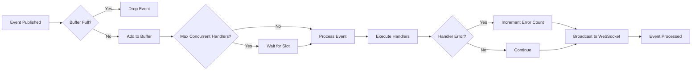
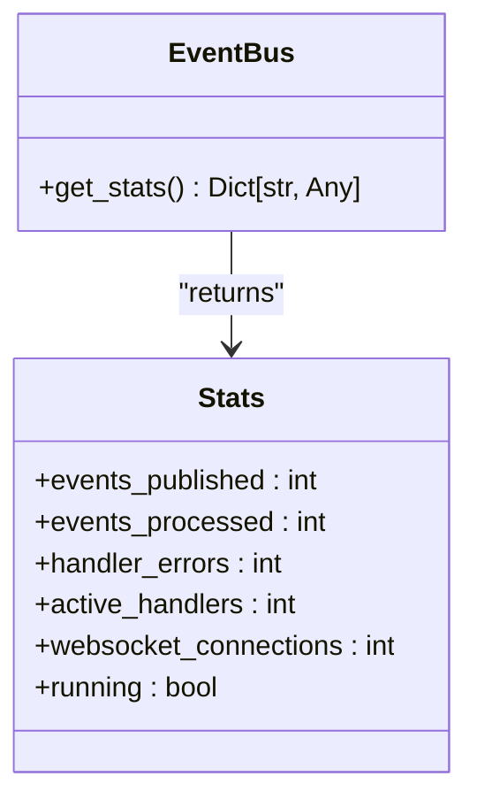

# Event System


## Table of Contents
1. [Introduction](#introduction)
2. [Core Architecture](#core-architecture)
3. [Event Bus Implementation](#event-bus-implementation)
4. [Event Types and Payloads](#event-types-and-payloads)
5. [Component Integration](#component-integration)
6. [Event Handling and Filtering](#event-handling-and-filtering)
7. [WebSocket Integration](#websocket-integration)
8. [Performance and Reliability](#performance-and-reliability)
9. [Debugging and Monitoring](#debugging-and-monitoring)

## Introduction

The Event System serves as the central nervous system for real-time communication between components in the Praxis agent platform. It implements a publish-subscribe pattern that enables decoupled, asynchronous communication between various system components including the P2P service, API server, execution engine, and workflow orchestrator. This event-driven architecture allows components to react to state changes and system events without direct dependencies, promoting modularity and scalability.

The event bus implementation is built on Trio's asynchronous primitives, providing efficient event processing with configurable concurrency limits. Events are published with rich metadata including timestamps, correlation IDs, and tags, enabling sophisticated filtering and tracing capabilities. The system supports both fire-and-forget event publishing and request-response patterns through event correlation.

**Section sources**
- [bus.py](file://src/praxis_sdk/bus.py#L1-L50)

## Core Architecture

The event system architecture centers around the EventBus class, which acts as the message broker for all inter-component communication. Components publish events to the bus and subscribe to events they need to handle, creating a loosely coupled system where components can be developed and scaled independently.



**Diagram sources**
- [bus.py](file://src/praxis_sdk/bus.py#L178-L215)
- [websocket.py](file://src/praxis_sdk/api/websocket.py#L1-L100)

**Section sources**
- [bus.py](file://src/praxis_sdk/bus.py#L1-L100)
- [websocket.py](file://src/praxis_sdk/api/websocket.py#L1-L100)

## Event Bus Implementation

The EventBus class provides a robust implementation of the publish-subscribe pattern with support for both synchronous and asynchronous event handling. The implementation uses Trio's memory channels for efficient event queuing and processing, with configurable buffer sizes and concurrency limits to prevent resource exhaustion.



**Diagram sources**
- [bus.py](file://src/praxis_sdk/bus.py#L178-L367)

**Section sources**
- [bus.py](file://src/praxis_sdk/bus.py#L178-L367)

## Event Types and Payloads

The system defines a comprehensive set of event types through the EventType enum, covering various aspects of agent operation including lifecycle management, task execution, P2P communication, and system monitoring. Each event type has a standardized payload structure that includes relevant data and metadata.

```mermaid
erDiagram
EventType ||--o{ Event : "has"
Event ||--o{ EventMetadata : "contains"
EventType {
string value
}
Event {
string type
json data
string metadata
}
EventMetadata {
string event_id
datetime timestamp
string correlation_id
string source
string tags
}
class EventType {
AGENT_STARTING
AGENT_STARTED
AGENT_STOPPING
AGENT_STOPPED
AGENT_ERROR
P2P_PEER_DISCOVERED
P2P_PEER_CONNECTED
P2P_PEER_DISCONNECTED
P2P_CARD_EXCHANGE
P2P_TOOL_REQUEST
P2P_TOOL_RESPONSE
TASK_CREATED
TASK_STARTED
TASK_PROGRESS
TASK_COMPLETED
TASK_FAILED
TASK_CANCELLED
DSL_COMMAND_RECEIVED
DSL_COMMAND_PROGRESS
DSL_COMMAND_COMPLETED
WORKFLOW_STARTED
WORKFLOW_PROGRESS
WORKFLOW_COMPLETED
TOOL_EXECUTED
TOOL_STARTING
TOOL_COMPLETED
TOOL_FAILED
WS_CLIENT_CONNECTED
WS_CLIENT_DISCONNECTED
WS_MESSAGE_RECEIVED
WS_MESSAGE_SENT
LOG_ENTRY
LOG_STREAM
SYSTEM_SHUTDOWN
SYSTEM_ERROR
}
```

**Diagram sources**
- [bus.py](file://src/praxis_sdk/bus.py#L10-L170)

**Section sources**
- [bus.py](file://src/praxis_sdk/bus.py#L10-L170)

## Component Integration

Various system components integrate with the event bus to publish and subscribe to events, enabling real-time coordination and state synchronization. The P2P service publishes peer discovery and connection events, while the API server handles WebSocket connections for real-time event streaming to clients.



**Diagram sources**
- [p2p/service.py](file://src/praxis_sdk/p2p/service.py#L1-L100)
- [api/server.py](file://src/praxis_sdk/api/server.py#L1-L100)
- [bus.py](file://src/praxis_sdk/bus.py#L1-L100)

**Section sources**
- [p2p/service.py](file://src/praxis_sdk/p2p/service.py#L1-L100)
- [api/server.py](file://src/praxis_sdk/api/server.py#L1-L100)

## Event Handling and Filtering

The event bus supports sophisticated event handling and filtering mechanisms, allowing components to subscribe to specific event types or all events with optional filtering based on source, tags, and other metadata. This enables fine-grained control over which events a component receives, reducing unnecessary processing and improving performance.

```mermaid
flowchart TD
Start([Event Published]) --> CheckRunning{"Bus Running?"}
CheckRunning --> |No| DropEvent[Drop Event]
CheckRunning --> |Yes| IncrementCounter[stats.events_published++]
IncrementCounter --> CheckChannel{"Has Send Channel?"}
CheckChannel --> |No| LogEvent[Log Event]
CheckChannel --> |Yes| SendToChannel[Send to Channel]
SendToChannel --> ProcessEvents{_process_events()}
ProcessEvents --> ReceiveEvent[Receive from Channel]
ReceiveEvent --> IncrementProcessed[stats.events_processed++]
ReceiveEvent --> CollectHandlers[Collect Handlers]
CollectHandlers --> TypeHandlers{Type-Specific Handlers?}
TypeHandlers --> |Yes| AddTypeHandlers[Add to Handlers]
TypeHandlers --> |No| SkipType
CollectHandlers --> GlobalHandlers{Global Handlers?}
GlobalHandlers --> |Yes| AddGlobalHandlers[Add to Handlers]
GlobalHandlers --> |No| SkipGlobal
AddTypeHandlers --> ExecuteHandlers
AddGlobalHandlers --> ExecuteHandlers
ExecuteHandlers --> ForEachHandler[For Each Handler]
ForEachHandler --> CheckReference{Valid Reference?}
CheckReference --> |No| SkipHandler
CheckReference --> |Yes| CallHandler[Call Handler]
CallHandler --> HandleError{Error?}
HandleError --> |Yes| IncrementErrors[stats.handler_errors++]
HandleError --> |No| Continue
ExecuteHandlers --> BroadcastWebSocket[Broadcast to WebSocket]
BroadcastWebSocket --> End([Event Processed])
```

**Diagram sources**
- [bus.py](file://src/praxis_sdk/bus.py#L253-L367)

**Section sources**
- [bus.py](file://src/praxis_sdk/bus.py#L253-L367)

## WebSocket Integration

The event bus integrates with WebSocket clients through the WebSocketManager class, enabling real-time event streaming to web-based interfaces. Clients can connect to the WebSocket endpoint and receive events in real-time, with optional filtering to receive only relevant events.



**Diagram sources**
- [websocket.py](file://src/praxis_sdk/api/websocket.py#L1-L100)
- [bus.py](file://src/praxis_sdk/bus.py#L1-L100)

**Section sources**
- [websocket.py](file://src/praxis_sdk/api/websocket.py#L1-L100)

## Performance and Reliability

The event bus is designed with performance and reliability in mind, featuring configurable concurrency limits, error handling, and statistics collection. The implementation uses weak references for event handlers to prevent memory leaks and supports both Trio and asyncio execution modes for maximum compatibility.

Key performance features include:
- Configurable buffer size to prevent memory exhaustion
- Maximum concurrent handlers limit to prevent resource starvation
- Statistics collection for monitoring event throughput and error rates
- Weak references to prevent memory leaks from unsubscribed handlers
- Error handling and logging for failed event processing



**Diagram sources**
- [bus.py](file://src/praxis_sdk/bus.py#L212-L255)

**Section sources**
- [bus.py](file://src/praxis_sdk/bus.py#L212-L255)

## Debugging and Monitoring

The event bus provides comprehensive debugging and monitoring capabilities through its statistics interface and logging. The get_stats() method returns detailed information about event processing, including counts of published and processed events, handler errors, and active WebSocket connections.



The system also supports event filtering for debugging purposes, allowing developers to subscribe to specific event types or filter events based on source and tags. This enables focused debugging of specific components or workflows without being overwhelmed by irrelevant events.

**Section sources**
- [bus.py](file://src/praxis_sdk/bus.py#L323-L367)
- [websocket.py](file://src/praxis_sdk/api/websocket.py#L1-L100)

**Referenced Files in This Document**   
- [bus.py](file://src/praxis_sdk/bus.py)
- [websocket.py](file://src/praxis_sdk/api/websocket.py)
- [p2p/service.py](file://src/praxis_sdk/p2p/service.py)
- [agent.py](file://src/praxis_sdk/agent.py)
- [api/server.py](file://src/praxis_sdk/api/server.py)
- [api/handlers.py](file://src/praxis_sdk/api/handlers.py)
- [execution/engine.py](file://src/praxis_sdk/execution/engine.py)