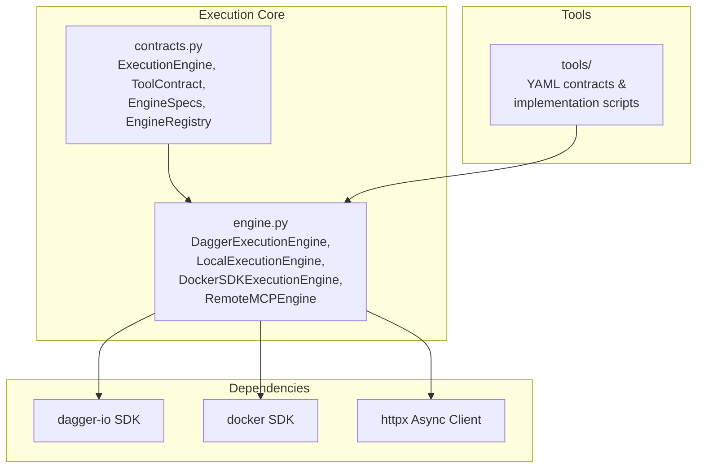
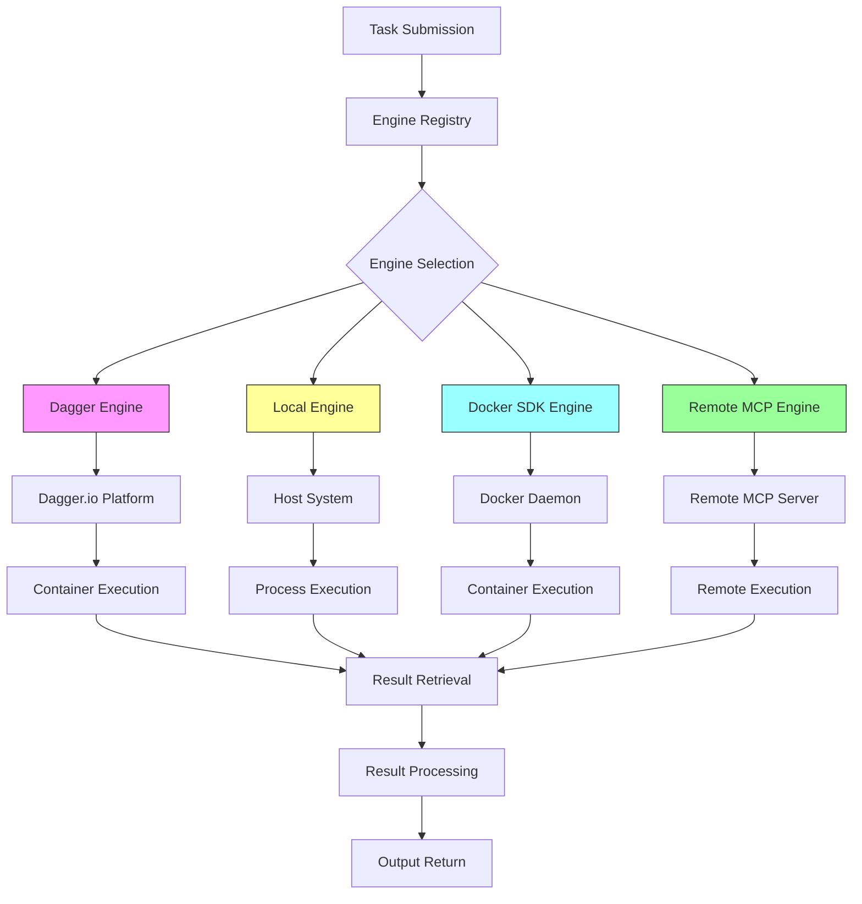
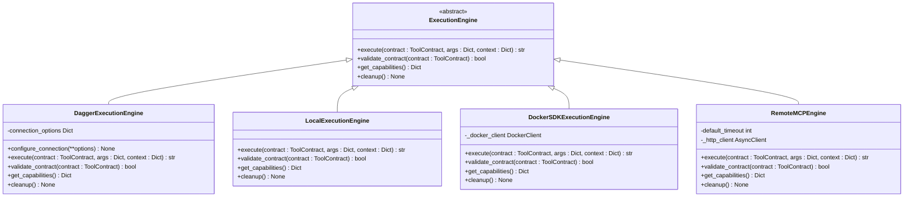
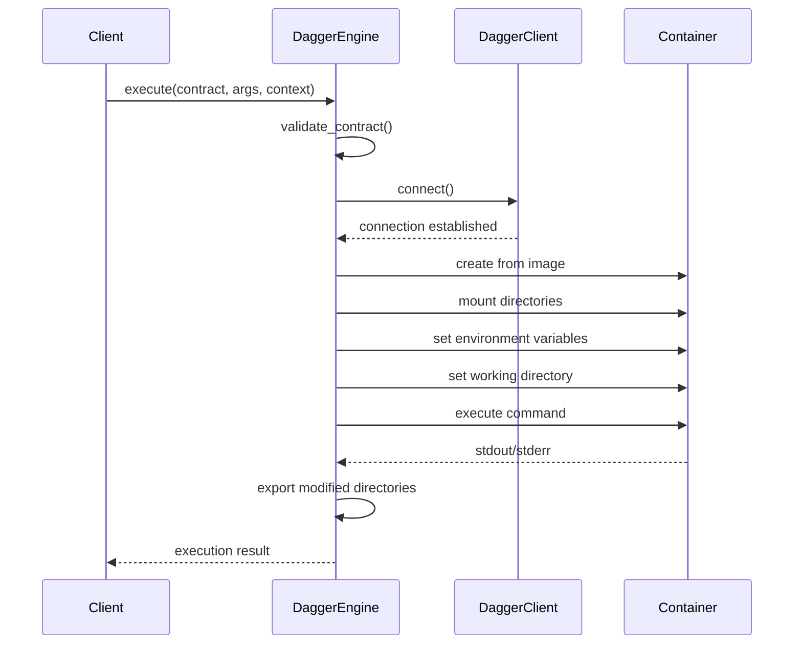
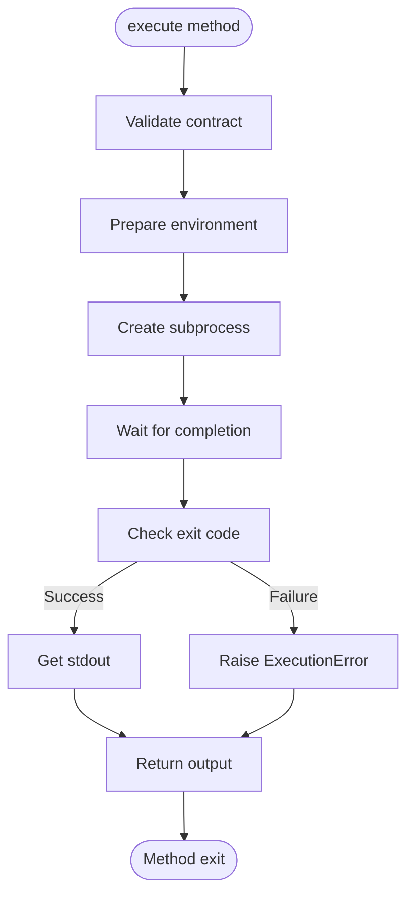
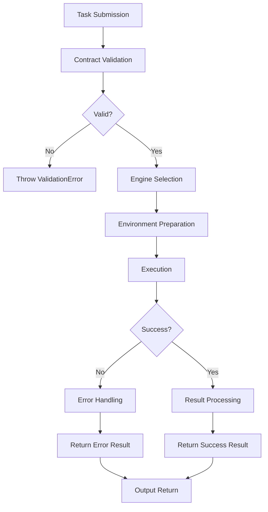
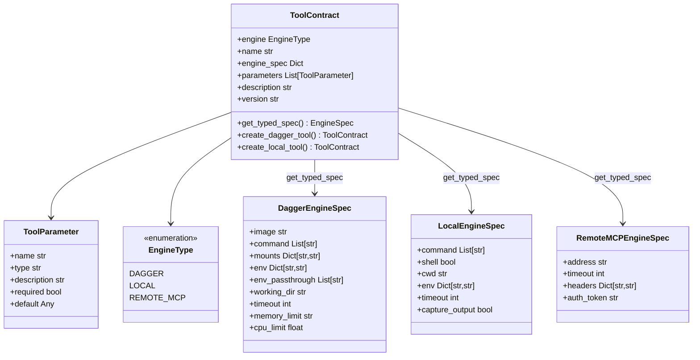
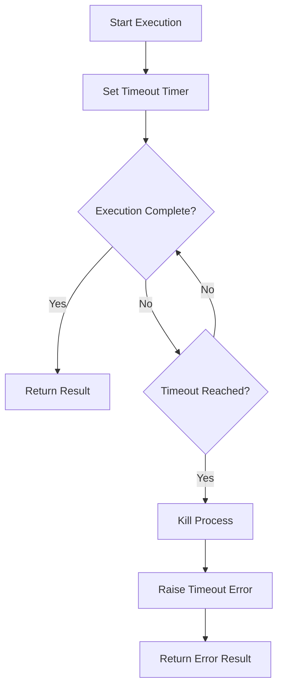
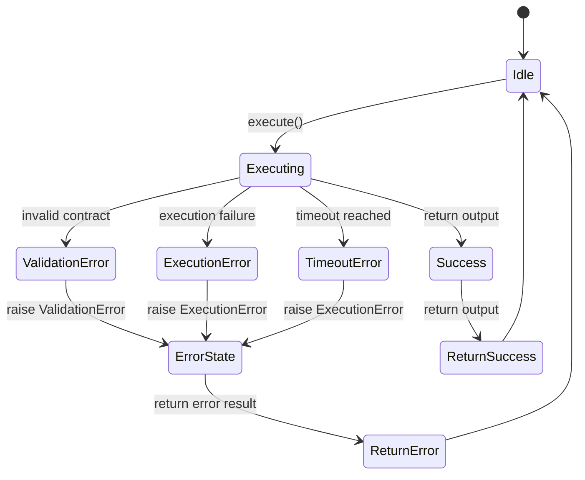

# Execution Engines


## Table of Contents
1. [Introduction](#introduction)
2. [Project Structure](#project-structure)
3. [Core Components](#core-components)
4. [Architecture Overview](#architecture-overview)
5. [Detailed Component Analysis](#detailed-component-analysis)
6. [Execution Workflow](#execution-workflow)
7. [Tool Contract System](#tool-contract-system)
8. [Security Considerations](#security-considerations)
9. [Configuration and Performance](#configuration-and-performance)
10. [Custom Engine Development](#custom-engine-development)
11. [Resource Management](#resource-management)
12. [Monitoring and Logging](#monitoring-and-logging)
13. [Engine Comparison and Trade-offs](#engine-comparison-and-trade-offs)

## Introduction
The Execution Engine subsystem provides a flexible, pluggable architecture for executing tools across multiple backends. This document details the design and implementation of the execution engine framework, which supports containerized execution via Dagger, local process execution, Docker SDK fallback, and remote MCP server invocation. The system enables secure, isolated execution of untrusted code through standardized tool contracts defined in YAML. The architecture emphasizes modularity, with a clear separation between execution logic and tool definition, allowing for easy extension and integration of new execution strategies.

## Project Structure
The execution engine components are organized within the `src/praxis_sdk/execution` directory, with supporting tool definitions in the `tools` directory. The core execution logic is separated into distinct modules for contracts, engine implementations, and supporting utilities.



**Diagram sources**
- [engine.py](file://src/praxis_sdk/execution/engine.py#L0-L1052)
- [contracts.py](file://src/praxis_sdk/execution/contracts.py#L0-L378)

**Section sources**
- [engine.py](file://src/praxis_sdk/execution/engine.py#L0-L1052)
- [contracts.py](file://src/praxis_sdk/execution/contracts.py#L0-L378)

## Core Components
The execution engine subsystem consists of several key components that work together to provide a robust tool execution framework. The core is built around the `ExecutionEngine` interface, which defines a standard contract for all execution backends. The `ToolContract` class provides a declarative way to define tool execution parameters, while the `EngineRegistry` manages multiple engine instances and facilitates engine selection.

The system supports four primary execution strategies:
- **DaggerExecutionEngine**: Containerized execution using the Dagger.io platform
- **LocalExecutionEngine**: Direct subprocess execution on the host
- **DockerSDKExecutionEngine**: Container execution using Docker Python SDK as fallback
- **RemoteMCPEngine**: HTTP-based execution on remote MCP servers

Each engine implements the same interface, allowing for consistent tool execution regardless of the underlying backend.

**Section sources**
- [engine.py](file://src/praxis_sdk/execution/engine.py#L0-L1052)
- [contracts.py](file://src/praxis_sdk/execution/contracts.py#L0-L378)

## Architecture Overview
The execution engine architecture follows a plugin-based design pattern, with a clear separation between the execution interface and concrete implementations. This allows for multiple execution backends to coexist and be selected based on tool requirements and system configuration.



**Diagram sources**
- [engine.py](file://src/praxis_sdk/execution/engine.py#L0-L1052)
- [contracts.py](file://src/praxis_sdk/execution/contracts.py#L0-L378)

## Detailed Component Analysis

### Execution Engine Interface
The `ExecutionEngine` abstract base class defines the contract that all execution backends must implement. This interface ensures consistency across different execution strategies and enables polymorphic behavior in the engine registry.



**Diagram sources**
- [engine.py](file://src/praxis_sdk/execution/engine.py#L0-L1052)
- [contracts.py](file://src/praxis_sdk/execution/contracts.py#L0-L378)

### Dagger Execution Engine
The `DaggerExecutionEngine` provides containerized execution using the Dagger.io platform, offering enhanced security and reproducibility. It creates containers from specified Docker images, mounts host directories, sets environment variables, and executes commands with comprehensive logging.



**Diagram sources**
- [engine.py](file://src/praxis_sdk/execution/engine.py#L51-L414)

### Local Execution Engine
The `LocalExecutionEngine` executes tools directly on the host system using subprocess, providing the fastest execution path but with reduced isolation. It supports both shell and direct command execution modes.



**Diagram sources**
- [engine.py](file://src/praxis_sdk/execution/engine.py#L415-L538)

## Execution Workflow
The execution workflow follows a standardized process from task submission to result retrieval, ensuring consistent behavior across all engine types.



**Diagram sources**
- [engine.py](file://src/praxis_sdk/execution/engine.py#L0-L1052)
- [contracts.py](file://src/praxis_sdk/execution/contracts.py#L0-L378)

## Tool Contract System
The tool contract system uses YAML specifications to define inputs, outputs, and execution requirements in a standardized format. This declarative approach enables consistent tool definition and execution across different backends.

### Contract Structure
The `ToolContract` class defines the structure of tool contracts, with support for different engine types through typed specifications.



**Diagram sources**
- [contracts.py](file://src/praxis_sdk/execution/contracts.py#L0-L378)

### Example Contract
The following example shows a simple Python tool contract that uses the Dagger engine:

```yaml
name: "text_analyzer"
description: "Analyzes text files and generates statistics reports"
engine: "dagger"
params:
  - name: "input_file"
    type: "string"
    description: "Path to the text file to analyze"
    required: "true"
engineSpec:
  image: "python:3.11-slim"
  command: ["python", "/shared/tools/simple_python_tool/main.py"]
  mounts:
    ./shared: /shared
    ./tools: /shared/tools
  env_passthrough: []
```

This contract defines a tool named "text_analyzer" that executes in a Python 3.11 container, mounting the shared and tools directories from the host. The tool requires an input_file parameter and executes the main.py script.

**Section sources**
- [simple_python_tool/contract.yaml](file://tools/simple_python_tool/contract.yaml#L0-L14)
- [simple_python_tool/main.py](file://tools/simple_python_tool/main.py#L0-L84)

## Security Considerations
The execution engine subsystem incorporates several security measures to protect against risks associated with running untrusted code:

1. **Container Isolation**: The Dagger and Docker SDK engines execute tools in isolated containers, preventing direct access to the host system.
2. **Limited Privileges**: Containers run without privileged mode by default, restricting access to host devices and kernel features.
3. **Controlled Mounts**: Directory mounts are explicitly defined in the tool contract, preventing unauthorized access to host filesystem.
4. **Environment Sanitization**: Host environment variables are not automatically passed to containers; only explicitly specified variables are included.
5. **Timeout Enforcement**: All executions are subject to configurable timeouts, preventing infinite loops and resource exhaustion.
6. **Input Validation**: Tool contracts are validated before execution to ensure they conform to expected schemas.

The system also provides mechanisms for additional security controls:
- **Network Isolation**: Containers can be configured with specific network modes to restrict network access.
- **Resource Limits**: Memory and CPU limits can be set to prevent resource exhaustion attacks.
- **Read-only Mounts**: Mounts can be configured as read-only to prevent modification of source files.

**Section sources**
- [engine.py](file://src/praxis_sdk/execution/engine.py#L0-L1052)
- [contracts.py](file://src/praxis_sdk/execution/contracts.py#L0-L378)

## Configuration and Performance
Each execution engine type offers different configuration options and performance characteristics:

### Configuration Options
**Dagger Engine:**
- `image`: Docker image to use as base
- `command`: Command to execute in container
- `mounts`: Host-to-container directory mappings
- `env`: Environment variables to set
- `env_passthrough`: Host environment variables to pass through
- `working_dir`: Working directory in container
- `timeout`: Execution timeout in seconds
- `memory_limit`: Memory limit (e.g., '512m')
- `cpu_limit`: CPU limit (e.g., 1.5)

**Local Engine:**
- `command`: Command to execute
- `shell`: Whether to execute in shell
- `cwd`: Working directory
- `env`: Environment variables
- `timeout`: Execution timeout
- `capture_output`: Whether to capture stdout/stderr

**Docker SDK Engine:**
- Same configuration as Dagger engine (uses same spec)

**Remote MCP Engine:**
- `address`: Remote server address
- `timeout`: Request timeout
- `headers`: HTTP headers
- `auth_token`: Authentication token

### Performance Characteristics
| Engine Type | Startup Time | Execution Speed | Resource Overhead | Isolation Level |
|-------------|--------------|-----------------|-------------------|-----------------|
| Dagger | Medium | Fast | Medium | High |
| Local | Fastest | Fastest | Lowest | Low |
| Docker SDK | Medium | Fast | Medium | High |
| Remote MCP | Slowest | Variable | Low (client) | High (server) |

The Dagger engine provides the best balance of performance and isolation, leveraging Dagger's optimized container execution. The local engine offers the fastest execution but with minimal isolation. The Docker SDK engine serves as a reliable fallback when Dagger is unavailable. The Remote MCP engine enables distributed execution but introduces network latency.

**Section sources**
- [engine.py](file://src/praxis_sdk/execution/engine.py#L0-L1052)
- [contracts.py](file://src/praxis_sdk/execution/contracts.py#L0-L378)

## Custom Engine Development
Developing custom execution engines is straightforward due to the well-defined `ExecutionEngine` interface. To create a new engine, implement the abstract methods and register the engine with the `EngineRegistry`.

### Example Custom Engine
```python
from praxis_sdk.execution.contracts import ExecutionEngine, ToolContract, ExecutionError
from typing import Dict, Any, Optional

class CustomExecutionEngine(ExecutionEngine):
    """Custom engine implementation for specialized execution needs."""
    
    def __init__(self, custom_param: str = None):
        self.custom_param = custom_param
        self.initialized = False
    
    async def execute(
        self, 
        contract: ToolContract, 
        args: Dict[str, Any],
        context: Optional[Dict[str, Any]] = None
    ) -> str:
        """Execute tool with custom logic."""
        if not self.initialized:
            await self._initialize()
        
        # Custom execution logic here
        # ...
        
        return "execution result"
    
    async def validate_contract(self, contract: ToolContract) -> bool:
        """Validate if this engine can execute the contract."""
        # Custom validation logic
        return True
    
    async def get_capabilities(self) -> Dict[str, Any]:
        """Return engine capabilities."""
        return {
            "engine_type": "custom",
            "supports_custom_feature": True,
            "max_concurrent_tasks": 10
        }
    
    async def cleanup(self):
        """Cleanup engine resources."""
        self.initialized = False
```

To integrate the custom engine:
```python
from praxis_sdk.execution.contracts import EngineRegistry

# Create registry and register custom engine
registry = EngineRegistry()
registry.register("custom", CustomExecutionEngine("custom_value"), is_default=True)

# Use the engine
engine = registry.get("custom")
result = await engine.execute(contract, args)
```

**Section sources**
- [engine.py](file://src/praxis_sdk/execution/engine.py#L0-L1052)
- [contracts.py](file://src/praxis_sdk/execution/contracts.py#L0-L378)

## Resource Management
The execution engine subsystem includes comprehensive resource management capabilities to ensure efficient and reliable operation.

### Resource Isolation
Each engine provides different levels of resource isolation:
- **Dagger Engine**: Full container isolation with optional resource limits (memory, CPU)
- **Local Engine**: Process-level isolation with no resource limits
- **Docker SDK Engine**: Container isolation with resource limits
- **Remote MCP Engine**: Complete isolation on remote server

### Timeout Handling
All engines enforce configurable timeouts to prevent long-running or hanging processes:



The timeout is enforced at the engine level, with the Dagger and Docker SDK engines using container-level timeouts, and the Local engine using asyncio timeouts.

### Error Propagation
Errors are propagated consistently across all engine types using the `ExecutionError` exception:



**Section sources**
- [engine.py](file://src/praxis_sdk/execution/engine.py#L0-L1052)
- [contracts.py](file://src/praxis_sdk/execution/contracts.py#L0-L378)

## Monitoring and Logging
The execution engine subsystem includes comprehensive monitoring and logging capabilities to track tool execution and diagnose issues.

### Logging Strategy
Each engine uses structured logging with consistent formatting and verbosity levels:

```python
logger.info(f"⚡ REAL DAGGER ENGINE: Starting execution of '{contract.name}'")
logger.info(f"   📊 Arguments: {args}")
logger.info(f"   🔧 Context: {context}")
logger.info(f"   📦 Container Image: {spec.image}")
```

The logging includes:
- Execution start and completion timestamps
- Input parameters and context
- Engine-specific configuration
- Step-by-step execution progress
- Resource usage metrics
- Error details with stack traces

### Monitoring Capabilities
The system provides several monitoring capabilities:
- **Execution Metrics**: Duration, output size, exit codes
- **Resource Usage**: Memory, CPU, disk I/O (when available)
- **Success/Failure Rates**: Per tool and engine type
- **Latency Measurements**: From submission to completion

The `get_capabilities()` method returns engine-specific capabilities that can be used for monitoring and reporting:

```python
async def get_capabilities(self) -> Dict[str, Any]:
    return {
        "engine_type": "dagger",
        "supports_containers": True,
        "supports_mounts": True,
        "supports_environment": True,
        "supports_resource_limits": False,
        "dagger_available": DAGGER_AVAILABLE,
        "real_dagger_engine": True
    }
```

**Section sources**
- [engine.py](file://src/praxis_sdk/execution/engine.py#L0-L1052)
- [contracts.py](file://src/praxis_sdk/execution/contracts.py#L0-L378)

## Engine Comparison and Trade-offs
Different execution strategies offer various trade-offs in terms of performance, security, and complexity. The choice of engine depends on the specific use case requirements.

### Use Case Recommendations
| Use Case | Recommended Engine | Rationale |
|---------|-------------------|---------|
| Development & Testing | Local Engine | Fastest execution, easy debugging |
| Production Workloads | Dagger Engine | High isolation, reproducible builds |
| Legacy Systems | Docker SDK Engine | Fallback when Dagger unavailable |
| Distributed Processing | Remote MCP Engine | Offload execution to specialized servers |
| Security-Sensitive Tasks | Dagger Engine | Strong container isolation |
| Simple Scripts | Local Engine | Minimal overhead |

### Trade-off Analysis
**Dagger Engine:**
- *Pros*: High isolation, reproducible execution, cloud-native, supports complex workflows
- *Cons*: Higher startup time, requires Dagger.io platform, more complex setup

**Local Engine:**
- *Pros*: Fastest execution, simple setup, direct access to host resources
- *Cons*: Low isolation, security risks with untrusted code, environment dependencies

**Docker SDK Engine:**
- *Pros*: Good isolation, widely available, familiar Docker interface
- *Cons*: Slower than native Dagger, requires Docker daemon, larger resource footprint

**Remote MCP Engine:**
- *Pros*: Complete isolation, scalable, distributed execution
- *Cons*: Network latency, dependency on remote server availability, network security considerations

The system's plugin architecture allows for easy switching between engines based on requirements, and the `EngineRegistry` enables dynamic engine selection at runtime.

**Section sources**
- [engine.py](file://src/praxis_sdk/execution/engine.py#L0-L1052)
- [contracts.py](file://src/praxis_sdk/execution/contracts.py#L0-L378)

**Referenced Files in This Document**   
- [engine.py](file://src/praxis_sdk/execution/engine.py#L0-L1052)
- [contracts.py](file://src/praxis_sdk/execution/contracts.py#L0-L378)
- [engine_broken.py](file://src/praxis_sdk/execution/engine_broken.py#L0-L980)
- [simple_python_tool/contract.yaml](file://tools/simple_python_tool/contract.yaml#L0-L14)
- [simple_python_tool/main.py](file://tools/simple_python_tool/main.py#L0-L84)