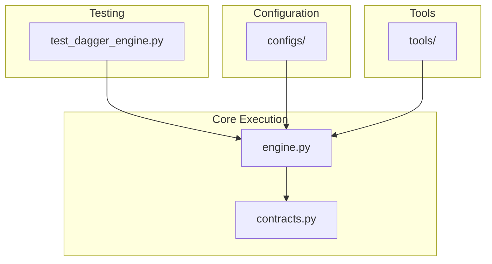
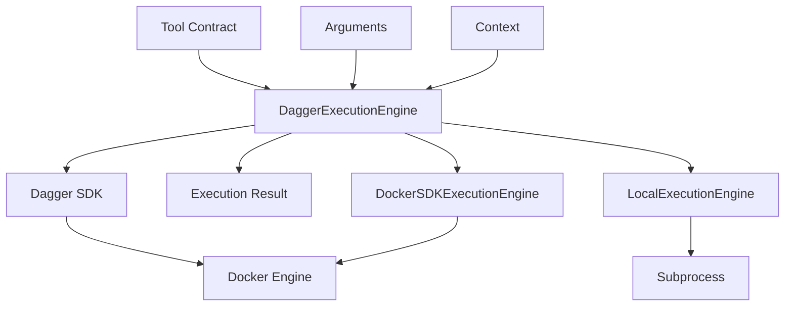
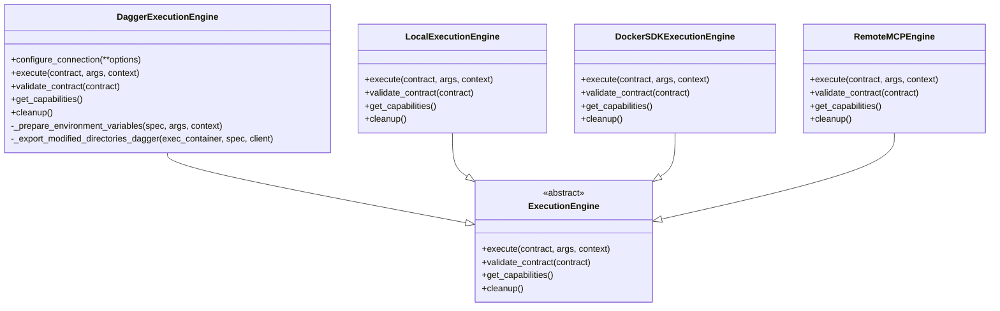
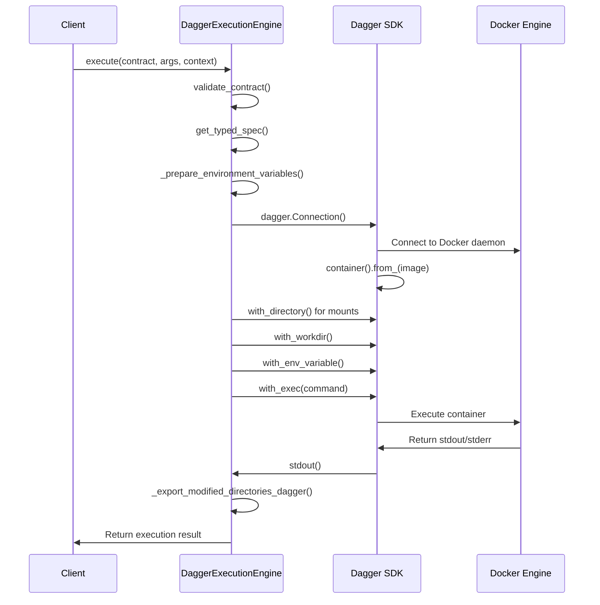
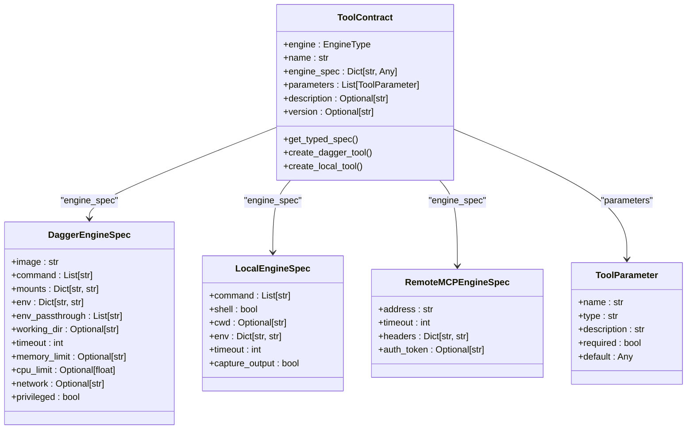
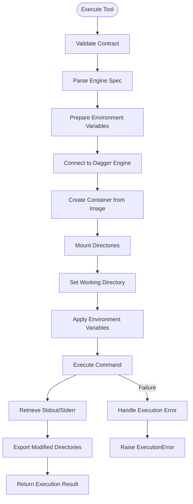
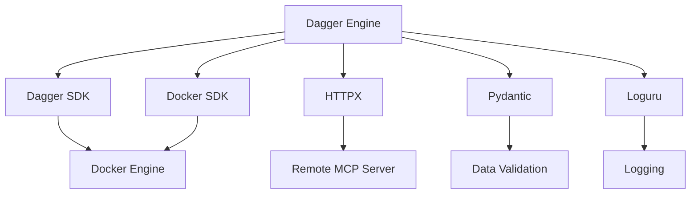

# Dagger Engine

## Table of Contents
1. [Introduction](#introduction)
2. [Project Structure](#project-structure)
3. [Core Components](#core-components)
4. [Architecture Overview](#architecture-overview)
5. [Detailed Component Analysis](#detailed-component-analysis)
6. [Dependency Analysis](#dependency-analysis)
7. [Performance Considerations](#performance-considerations)
8. [Troubleshooting Guide](#troubleshooting-guide)
9. [Conclusion](#conclusion)

## Introduction
The Dagger Engine is a core component of the Praxis framework, providing secure, reproducible, and containerized execution of CI/CD pipelines. It leverages the Dagger Python SDK to execute tools within isolated container environments, ensuring consistent behavior across different execution contexts. This document details the implementation, integration, and operational characteristics of the Dagger execution engine within the Praxis ecosystem, focusing on its role in enabling reproducible builds and secure execution workflows.

## Project Structure
The project structure reveals a modular architecture with clear separation of concerns. The execution engine components are located under `src/praxis_sdk/execution/`, with core functionality implemented in `engine.py` and `contracts.py`. The `tools/` directory contains sample tools with contract definitions, while `tests/` includes comprehensive test coverage for the Dagger engine. Configuration files in `configs/` suggest a distributed agent architecture, and the presence of MCP (Multi-Component Protocol) modules indicates integration with external tooling systems.

**Diagram sources**
- [engine.py](file://src/praxis_sdk/execution/engine.py)
- [contracts.py](file://src/praxis_sdk/execution/contracts.py)
- [test_dagger_engine.py](file://tests/test_dagger_engine.py)

**Section sources**
- [engine.py](file://src/praxis_sdk/execution/engine.py)
- [contracts.py](file://src/praxis_sdk/execution/contracts.py)

## Core Components
The core components of the Dagger engine implementation include the `DaggerExecutionEngine` class, the `ToolContract` model, and the execution lifecycle management system. These components work together to provide containerized execution with proper input/output mapping, resource isolation, and error handling. The engine supports multiple execution backends, with the primary implementation using the official Dagger Python SDK for maximum compatibility with the Dagger ecosystem.

**Section sources**
- [engine.py](file://src/praxis_sdk/execution/engine.py#L1-L1052)
- [contracts.py](file://src/praxis_sdk/execution/contracts.py#L1-L378)

## Architecture Overview
The Dagger engine architecture follows a modular design with clear separation between contract definition, execution logic, and resource management. The system uses the Dagger Python SDK to create containerized execution environments, with tool contracts defining the execution parameters. The architecture supports multiple engine types, including Dagger, local, and remote execution, with automatic capability detection and engine selection.

**Diagram sources**
- [engine.py](file://src/praxis_sdk/execution/engine.py#L1-L1052)
- [contracts.py](file://src/praxis_sdk/execution/contracts.py#L1-L378)

## Detailed Component Analysis

### DaggerExecutionEngine Analysis
The `DaggerExecutionEngine` class provides the primary implementation for containerized tool execution using the Dagger Python SDK. It handles the complete execution lifecycle from contract validation to result retrieval, with comprehensive logging and error handling.

#### For Object-Oriented Components:

**Diagram sources**
- [engine.py](file://src/praxis_sdk/execution/engine.py#L1-L1052)

#### For API/Service Components:

**Diagram sources**
- [engine.py](file://src/praxis_sdk/execution/engine.py#L1-L1052)

### ToolContract Analysis
The `ToolContract` class defines the interface between the Praxis framework and executable tools, specifying execution parameters and requirements. It uses Pydantic models for validation and type safety, ensuring that contracts are properly structured before execution.

#### For Object-Oriented Components:

**Diagram sources**
- [contracts.py](file://src/praxis_sdk/execution/contracts.py#L1-L378)

### Execution Lifecycle Analysis
The execution lifecycle follows a structured process from initialization to cleanup, with each step providing visibility through comprehensive logging. The engine implements a step-by-step execution process that ensures reproducibility and facilitates debugging.

#### For Complex Logic Components:

**Diagram sources**
- [engine.py](file://src/praxis_sdk/execution/engine.py#L1-L1052)

**Section sources**
- [engine.py](file://src/praxis_sdk/execution/engine.py#L1-L1052)
- [contracts.py](file://src/praxis_sdk/execution/contracts.py#L1-L378)

## Dependency Analysis
The Dagger engine has a well-defined dependency structure with clear separation between core functionality and external integrations. The primary dependencies include the Dagger SDK, Docker SDK, and HTTPX for remote execution. The system uses optional imports to handle missing dependencies gracefully, providing fallback execution mechanisms when necessary.

**Diagram sources**
- [engine.py](file://src/praxis_sdk/execution/engine.py#L1-L1052)
- [contracts.py](file://src/praxis_sdk/execution/contracts.py#L1-L378)

**Section sources**
- [engine.py](file://src/praxis_sdk/execution/engine.py#L1-L1052)
- [contracts.py](file://src/praxis_sdk/execution/contracts.py#L1-L378)

## Performance Considerations
The Dagger engine provides several performance characteristics that impact execution efficiency. Container startup overhead is present but mitigated by Docker's layer caching mechanism. The engine supports parallel execution through asynchronous processing, allowing multiple tools to run concurrently. Network efficiency is optimized through streaming of container output and minimal data transfer between host and container. Configuration options such as cache settings and resource limits allow fine-tuning of performance characteristics for specific use cases.

The engine implements several optimizations to improve performance:
- Cache-busting timestamps to prevent unwanted caching
- Pip cache mounting for Python environments
- Direct streaming of container output
- Asynchronous execution with timeout handling
- Efficient resource cleanup

These features ensure that the engine maintains high performance while providing reproducible and secure execution environments.

## Troubleshooting Guide
Common issues with the Dagger engine typically fall into several categories: connection failures, build step errors, and resource limits. The comprehensive logging system provides detailed information for diagnosing and resolving these issues.

**Section sources**
- [engine.py](file://src/praxis_sdk/execution/engine.py#L1-L1052)
- [test_dagger_engine.py](file://tests/test_dagger_engine.py#L1-L472)

### Connection Failures
Connection failures can occur due to several reasons:
- Missing Dagger CLI installation
- Docker daemon not running
- Network connectivity issues
- Permission problems with Docker socket

Solutions include:
- Installing the Dagger CLI: `pip install dagger-io`
- Ensuring Docker is running and accessible
- Checking network connectivity to remote services
- Verifying Docker socket permissions

### Build Step Errors
Build step errors typically manifest as container execution failures with non-zero exit codes. These can be caused by:
- Invalid commands or arguments
- Missing dependencies in the container image
- File permission issues
- Resource constraints

Debugging steps:
- Check container logs for detailed error messages
- Verify the base image contains required tools
- Ensure mounted directories have proper permissions
- Increase resource limits if necessary

### Resource Limits
Resource limitations can cause timeouts or out-of-memory errors. The engine provides configuration options to address these:
- Timeout settings in the tool contract
- Memory and CPU limits for containers
- Custom network configurations

Monitoring execution duration and resource usage can help identify appropriate limits for specific tools.

## Conclusion
The Dagger engine provides a robust foundation for CI/CD pipeline execution within the Praxis framework, enabling reproducible builds and secure execution through containerization. Its integration with the Dagger Python SDK ensures compatibility with the broader Dagger ecosystem while providing the flexibility to support multiple execution backends. The comprehensive contract system, detailed logging, and robust error handling make it a reliable choice for complex workflow orchestration. With proper configuration and monitoring, the engine delivers high performance and reliability for continuous integration and deployment workflows.

**Referenced Files in This Document**   
- [engine.py](file://src/praxis_sdk/execution/engine.py)
- [contracts.py](file://src/praxis_sdk/execution/contracts.py)
- [test_dagger_engine.py](file://tests/test_dagger_engine.py)