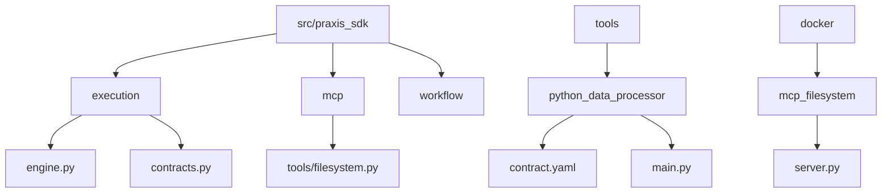
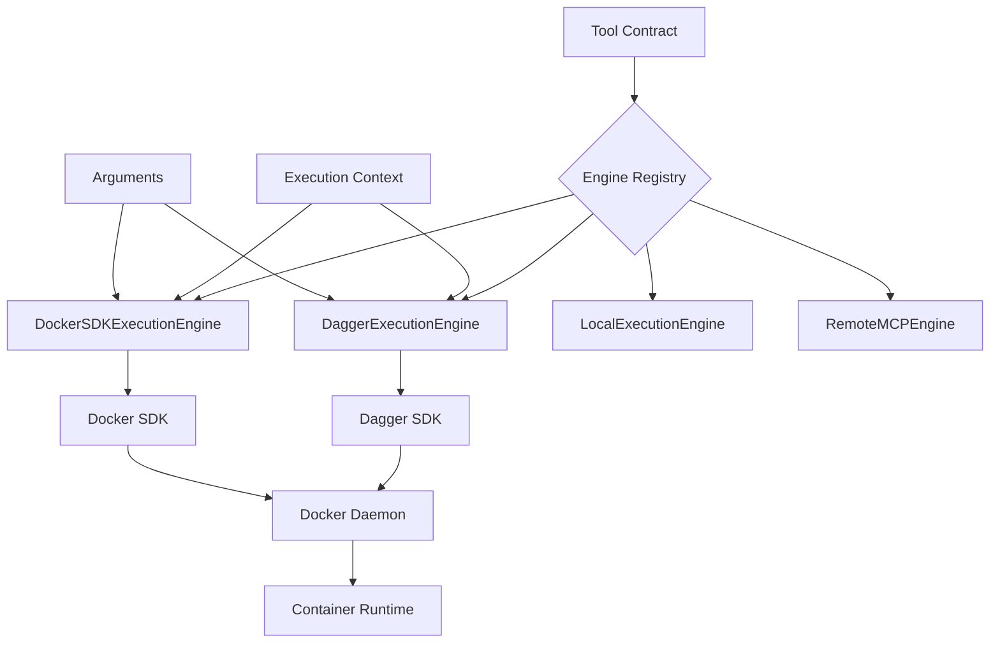
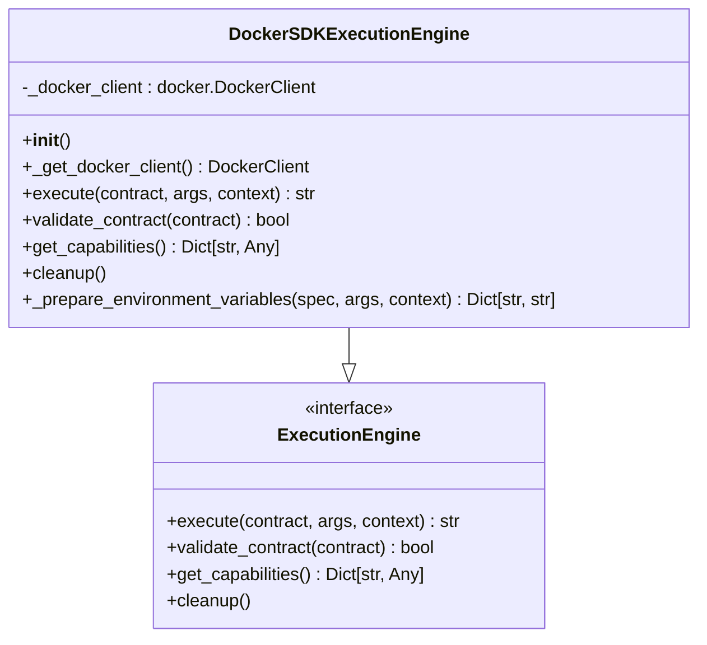
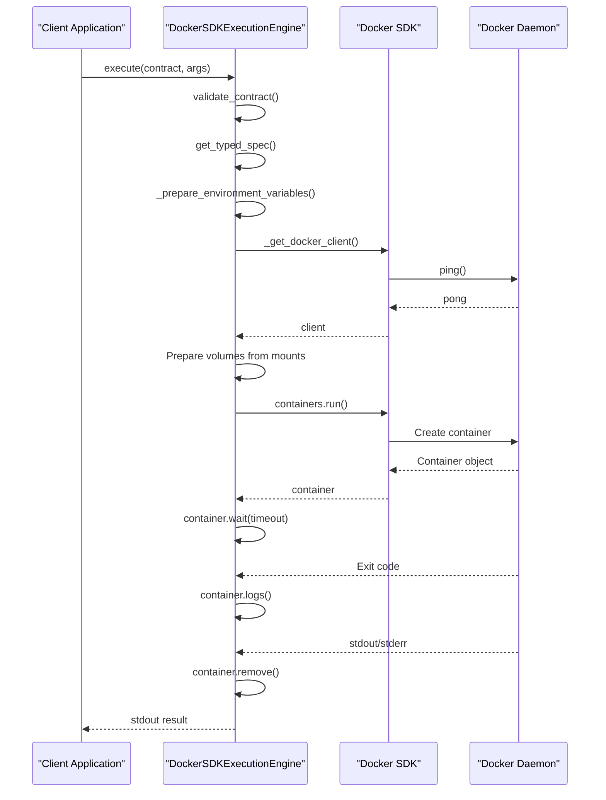
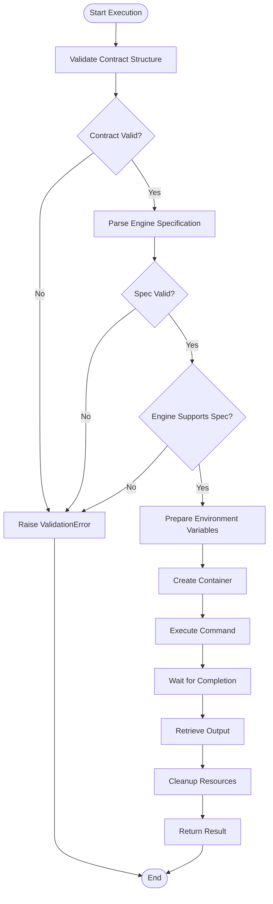
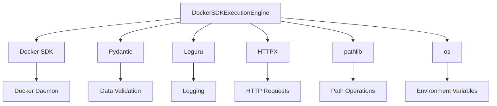

# Docker SDK Engine

## Table of Contents
1. [Introduction](#introduction)
2. [Project Structure](#project-structure)
3. [Core Components](#core-components)
4. [Architecture Overview](#architecture-overview)
5. [Detailed Component Analysis](#detailed-component-analysis)
6. [Dependency Analysis](#dependency-analysis)
7. [Performance Considerations](#performance-considerations)
8. [Troubleshooting Guide](#troubleshooting-guide)
9. [Conclusion](#conclusion)

## Introduction
The Docker SDK Engine is a critical component of the Praxis Python SDK, responsible for secure and isolated execution of tools within containerized environments. This document provides a comprehensive analysis of the engine's implementation, focusing on its use of Docker SDK for Python to manage container lifecycle operations such as image pulling, container creation, execution, and cleanup. The engine supports multiple execution strategies including Dagger, Docker SDK, local subprocess, and remote MCP execution, with robust fallback mechanisms and security features. It integrates seamlessly with tool contracts that define container specifications, environment variables, and command execution parameters.

## Project Structure
The project follows a modular structure with clear separation of concerns. The execution engine resides in the `src/praxis_sdk/execution/` directory, while tool definitions are stored in the `tools/` directory. Configuration files are located in `configs/`, and Docker-related assets are in the `docker/` directory. This organization enables easy maintenance and extension of both engine functionality and tool implementations.

**Diagram sources**
- [engine.py](file://src/praxis_sdk/execution/engine.py)
- [contracts.py](file://src/praxis_sdk/execution/contracts.py)
- [server.py](file://docker/mcp_filesystem/server.py)
- [python_data_processor/contract.yaml](file://tools/python_data_processor/contract.yaml)

## Core Components
The core components of the Docker SDK Engine include the `DockerSDKExecutionEngine`, `DaggerExecutionEngine`, and associated contract models. These components work together to provide containerized execution capabilities with proper resource management and security isolation. The engine leverages the Docker SDK for Python to interact with the Docker daemon, creating containers from specified images, mounting volumes, setting environment variables, and executing commands in isolated environments.

**Section sources**
- [engine.py](file://src/praxis_sdk/execution/engine.py#L539-L724)
- [contracts.py](file://src/praxis_sdk/execution/contracts.py#L1-L378)

## Architecture Overview
The Docker SDK Engine architecture is built around a pluggable execution engine interface that supports multiple backends. The primary execution path uses Dagger for container orchestration, with Docker SDK serving as a fallback when Dagger is unavailable. Tool contracts define the execution specifications, including container images, commands, mounts, and environment variables. The engine processes these contracts, validates them, and executes the tools in isolated containers with proper resource limits and security configurations.

**Diagram sources**
- [engine.py](file://src/praxis_sdk/execution/engine.py#L1-L938)
- [contracts.py](file://src/praxis_sdk/execution/contracts.py#L1-L378)

## Detailed Component Analysis

### Docker SDK Execution Engine Analysis
The `DockerSDKExecutionEngine` class provides containerized execution using the Docker Python SDK. It serves as a fallback mechanism when the Dagger engine is not available, ensuring reliable tool execution across different environments. The engine handles the complete container lifecycle from creation to cleanup, with proper error handling and resource management.

#### Class Diagram

**Diagram sources**
- [engine.py](file://src/praxis_sdk/execution/engine.py#L539-L724)

#### Execution Sequence

**Diagram sources**
- [engine.py](file://src/praxis_sdk/execution/engine.py#L576-L604)

### Tool Contract Implementation
Tool contracts define the specifications for tool execution, including container images, commands, environment variables, and mount points. The contract system enables declarative tool definition and consistent execution across different engine types. Contracts are validated before execution to ensure all required parameters are present and correctly formatted.

#### Contract Validation Flow

**Diagram sources**
- [contracts.py](file://src/praxis_sdk/execution/contracts.py#L1-L378)

## Dependency Analysis
The Docker SDK Engine has several key dependencies that enable its functionality. The primary dependency is the Docker SDK for Python, which provides the interface to the Docker daemon. Additional dependencies include Pydantic for data validation, Loguru for logging, and HTTPX for remote execution capabilities. The engine also depends on the Dagger SDK when available, providing an alternative execution backend with enhanced features.

**Diagram sources**
- [engine.py](file://src/praxis_sdk/execution/engine.py#L1-L938)
- [contracts.py](file://src/praxis_sdk/execution/contracts.py#L1-L378)

## Performance Considerations
The Docker SDK Engine implements several performance optimizations to ensure efficient tool execution. Image caching is leveraged through Docker's built-in layer caching mechanism, reducing startup time for frequently used images. Connection pooling is implemented through the reuse of Docker client instances across multiple executions. The engine also supports mounting host directories to containers, enabling efficient data sharing without copying. For Python-based tools, pip cache mounting is implemented to accelerate package installation during container execution.

## Troubleshooting Guide
Common issues with the Docker SDK Engine typically relate to Docker daemon availability, image pulling failures, or permission issues with volume mounts. The engine provides comprehensive logging through Loguru, capturing detailed information about each execution step. When troubleshooting, first verify Docker daemon availability using the `test_docker_availability()` function. Check that required images are available locally or can be pulled from registries. Ensure that mount paths exist and have appropriate permissions. For authentication issues with private registries, verify that Docker credentials are properly configured.

**Section sources**
- [engine.py](file://src/praxis_sdk/execution/engine.py#L900-L938)
- [engine.py](file://src/praxis_sdk/execution/engine.py#L539-L724)

## Conclusion
The Docker SDK Engine provides a robust and secure foundation for executing tools in isolated container environments. By leveraging the Docker SDK for Python, it offers reliable container lifecycle management with proper resource isolation and security controls. The engine's modular design supports multiple execution backends, with Dagger as the primary choice and Docker SDK as a reliable fallback. Integration with tool contracts enables declarative tool definition and consistent execution across different environments. The implementation includes comprehensive error handling, detailed logging, and performance optimizations that make it suitable for production use in automated workflows and agent systems.

**Referenced Files in This Document**   
- [engine.py](file://src/praxis_sdk/execution/engine.py)
- [contracts.py](file://src/praxis_sdk/execution/contracts.py)
- [server.py](file://docker/mcp_filesystem/server.py)
- [python_data_processor/main.py](file://tools/python_data_processor/main.py)
- [python_data_processor/contract.yaml](file://tools/python_data_processor/contract.yaml)