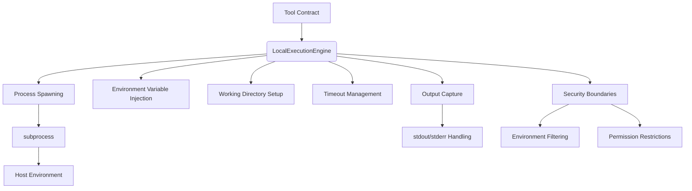
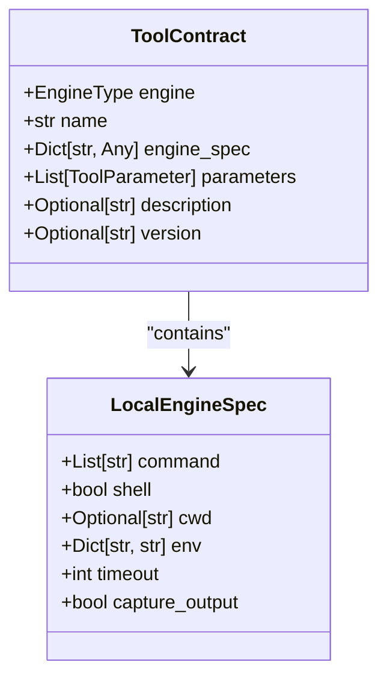
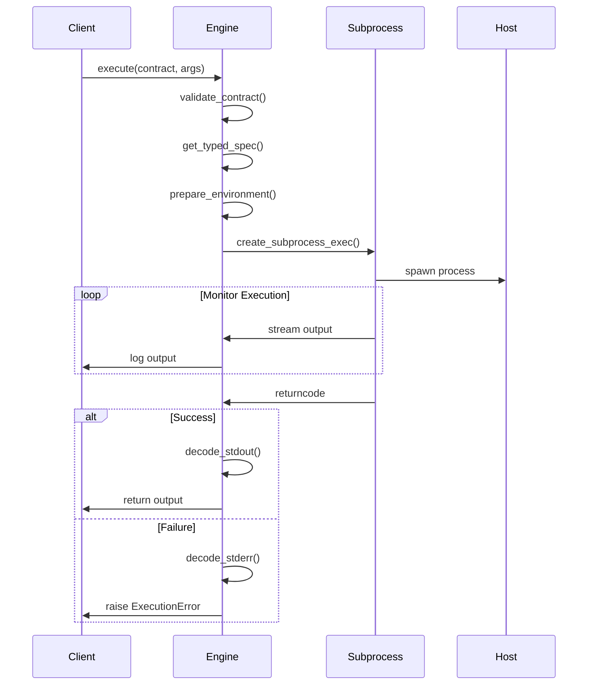
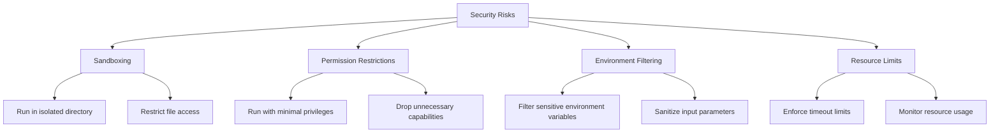
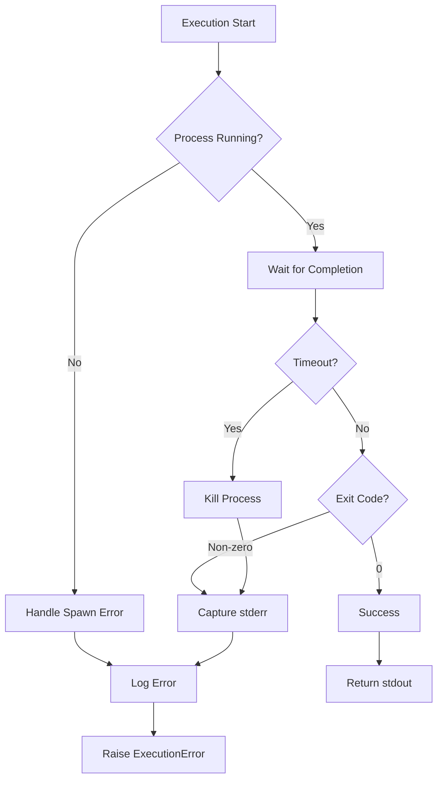

# Local Execution Engine


## Table of Contents
1. [Introduction](#introduction)
2. [Core Architecture](#core-architecture)
3. [Local Execution Engine Implementation](#local-execution-engine-implementation)
4. [Tool Contract Interpretation](#tool-contract-interpretation)
5. [Execution Flow and Process Management](#execution-flow-and-process-management)
6. [Configuration Options](#configuration-options)
7. [Security Considerations](#security-considerations)
8. [Performance Comparison](#performance-comparison)
9. [Error Handling Patterns](#error-handling-patterns)
10. [Usage Examples](#usage-examples)

## Introduction

The Local Execution Engine is a core component of the Praxis SDK that enables direct execution of tools within the host environment without containerization. This engine provides a lightweight alternative to containerized execution methods, offering reduced overhead for development, debugging, and performance-critical tasks. Unlike container-based approaches such as Dagger or Docker SDK execution, the Local Execution Engine leverages Python's `subprocess` module to spawn processes directly on the host system.

This execution model is particularly valuable in development environments where rapid iteration is essential, debugging requires direct access to system resources, or performance constraints make containerization overhead unacceptable. The engine maintains compatibility with the same tool contract system used by containerized engines, ensuring a consistent interface across different execution strategies while providing direct access to host system capabilities.

The Local Execution Engine operates by interpreting tool contracts that specify execution parameters, then spawning processes with appropriate configuration including working directory, environment variables, and execution timeouts. It handles stdin/stdout/stderr streams for real-time output capture and integrates with the broader execution framework through standardized interfaces.

**Section sources**
- [engine.py](file://src/praxis_sdk/execution/engine.py#L1-L1052)
- [contracts.py](file://src/praxis_sdk/execution/contracts.py#L1-L378)

## Core Architecture



**Diagram sources**
- [engine.py](file://src/praxis_sdk/execution/engine.py#L1-L1052)
- [contracts.py](file://src/praxis_sdk/execution/contracts.py#L1-L378)

## Local Execution Engine Implementation

The Local Execution Engine is implemented as a concrete class that inherits from the abstract `ExecutionEngine` base class. It provides the `execute` method which handles the complete lifecycle of tool execution, from contract validation to process termination and result retrieval.

```python
class LocalExecutionEngine(ExecutionEngine):
    """
    Local execution engine using subprocess.
    Python equivalent of direct command execution.
    """
    
    async def execute(
        self, 
        contract: ToolContract, 
        args: Dict[str, Any],
        context: Optional[Dict[str, Any]] = None
    ) -> str:
        # Implementation details
```

The engine creates subprocesses using `asyncio.create_subprocess_exec`, which allows for non-blocking execution and integration with the asynchronous event loop. This approach enables concurrent execution of multiple tools while maintaining responsiveness in the overall system.

The implementation handles both shell and non-shell execution modes, determined by the `shell` parameter in the tool contract. When shell execution is enabled, commands are passed through `/bin/sh -c`, allowing for shell features like piping and redirection. In non-shell mode, commands are executed directly, providing better security and performance.

**Section sources**
- [engine.py](file://src/praxis_sdk/execution/engine.py#L700-L799)

## Tool Contract Interpretation

The Local Execution Engine interprets tool contracts defined using the `LocalEngineSpec` data model. This specification defines the parameters required for local execution:



**Diagram sources**
- [contracts.py](file://src/praxis_sdk/execution/contracts.py#L100-L130)

The contract interpretation process involves several key steps:

1. **Validation**: The engine validates that the contract specifies the `LOCAL` engine type and contains a valid `LocalEngineSpec`.

2. **Environment Preparation**: Host environment variables are copied and augmented with values from the contract's `env` field and runtime parameters.

3. **Parameter Injection**: Arguments passed to the execution are injected as environment variables prefixed with `ARG_`, while context variables are prefixed with `CONTEXT_`.

4. **Command Construction**: The command array is prepared based on the `shell` parameter, either as a direct command array or joined into a shell command string.

The engine uses Pydantic models for contract validation, ensuring type safety and proper schema enforcement. The `get_typed_spec()` method on `ToolContract` converts the generic `engine_spec` dictionary into a typed `LocalEngineSpec` object for type-safe access to configuration parameters.

**Section sources**
- [contracts.py](file://src/praxis_sdk/execution/contracts.py#L1-L378)
- [engine.py](file://src/praxis_sdk/execution/engine.py#L700-L799)

## Execution Flow and Process Management

The execution flow of the Local Execution Engine follows a well-defined sequence of operations:



**Diagram sources**
- [engine.py](file://src/praxis_sdk/execution/engine.py#L700-L799)

The process management system handles several critical aspects:

- **Process Spawning**: Uses `asyncio.create_subprocess_exec` with appropriate stdout/stderr configuration based on the `capture_output` parameter.

- **Working Directory**: Sets the current working directory using the `cwd` parameter from the contract.

- **Environment Variables**: Merges host environment with contract-specified variables and runtime parameters.

- **Output Handling**: Captures stdout and stderr streams, decoding them from bytes to UTF-8 strings with error handling for encoding issues.

- **Timeout Management**: Implements timeout protection using `asyncio.wait_for`, killing the process if it exceeds the specified timeout.

The engine provides real-time logging of execution progress, including command execution, process status, and output streaming, which is invaluable for debugging and monitoring.

**Section sources**
- [engine.py](file://src/praxis_sdk/execution/engine.py#L700-L799)

## Configuration Options

The Local Execution Engine supports several configuration options that control execution behavior:

### Working Directory
The `cwd` parameter specifies the working directory for the executed process. If not specified, the process runs in the current directory of the parent process.

```yaml
engineSpec:
  command: ["python", "script.py"]
  cwd: "/path/to/working/directory"
```

### Timeout Limits
The `timeout` parameter defines the maximum execution time in seconds. The default is 300 seconds (5 minutes).

```yaml
engineSpec:
  command: ["long_running_task"]
  timeout: 600  # 10 minutes
```

### Environment Configuration
The engine supports multiple environment configuration options:

- **Fixed Environment Variables**: Specified in the `env` field of the contract.
- **Argument Injection**: Runtime arguments are injected as `ARG_<NAME>` environment variables.
- **Context Variables**: Execution context values are injected as `CONTEXT_<NAME>` variables.
- **Host Environment Passthrough**: Selective passthrough of host environment variables.

```yaml
engineSpec:
  env:
    API_KEY: "secret_value"
    DEBUG: "true"
  env_passthrough:
    - "PATH"
    - "HOME"
```

### Output Capture
The `capture_output` parameter controls whether stdout and stderr are captured and returned. When disabled, output is inherited from the parent process.

```yaml
engineSpec:
  command: ["noisy_command"]
  capture_output: false
```

**Section sources**
- [contracts.py](file://src/praxis_sdk/execution/contracts.py#L100-L130)
- [engine.py](file://src/praxis_sdk/execution/engine.py#L700-L799)

## Security Considerations

Running untrusted code locally presents significant security risks that must be carefully managed:

### Security Risks
- **System Access**: Direct access to host filesystem, network, and system resources.
- **Privilege Escalation**: Potential for privilege escalation if running with elevated permissions.
- **Resource Exhaustion**: Unrestricted access to CPU, memory, and disk resources.
- **Data Exposure**: Access to sensitive environment variables and configuration files.

### Mitigation Strategies
The Local Execution Engine implements several security measures:



**Diagram sources**
- [engine.py](file://src/praxis_sdk/execution/engine.py#L700-L799)

Key mitigation strategies include:

- **Environment Filtering**: The engine does not automatically pass through all host environment variables, preventing accidental exposure of sensitive credentials.

- **Working Directory Isolation**: Processes are executed in specified working directories, limiting filesystem access.

- **Minimal Privilege**: The engine should be run with the minimum necessary privileges, avoiding root or administrator accounts.

- **Input Validation**: All inputs are validated through the contract system before execution.

- **Timeout Enforcement**: Strict timeout limits prevent infinite loops and resource exhaustion.

For production environments, additional sandboxing mechanisms such as containerization, virtual machines, or specialized sandboxing tools should be considered when executing untrusted code.

**Section sources**
- [engine.py](file://src/praxis_sdk/execution/engine.py#L700-L799)
- [contracts.py](file://src/praxis_sdk/execution/contracts.py#L1-L378)

## Performance Comparison

The Local Execution Engine offers significant performance advantages over containerized execution methods:

```mermaid
barChart
title Performance Comparison
x-axis Engine Type
y-axis Relative Performance
series Execution Overhead
"Local" : 1
"Dagger" : 3.5
"Docker SDK" : 3.2
```

**Diagram sources**
- [engine.py](file://src/praxis_sdk/execution/engine.py#L1-L1052)

### Performance Characteristics
- **Lower Overhead**: Eliminates container startup time and inter-process communication overhead.
- **Faster Startup**: Process spawning is significantly faster than container initialization.
- **Reduced Memory Usage**: No additional memory overhead for container runtime.
- **Direct I/O**: File operations and network access occur directly without virtualization layers.

### Trade-offs
While the Local Execution Engine provides superior performance, it comes with important trade-offs:

- **Reduced Isolation**: Processes share the host environment, increasing security risks.
- **Resource Contention**: No built-in resource limits, potentially affecting other system processes.
- **Dependency Conflicts**: Host dependencies may conflict with tool requirements.
- **Environment Inconsistency**: Execution environment varies between hosts.

The performance benefits make the Local Execution Engine ideal for development, testing, and debugging scenarios where rapid iteration is critical. For production deployments with untrusted code, containerized engines provide better isolation despite higher overhead.

**Section sources**
- [engine.py](file://src/praxis_sdk/execution/engine.py#L1-L1052)

## Error Handling Patterns

The Local Execution Engine implements comprehensive error handling for various failure scenarios:



**Diagram sources**
- [engine.py](file://src/praxis_sdk/execution/engine.py#L700-L799)

### Process Crashes
When a process crashes or exits with a non-zero code, the engine captures stderr output and raises an `ExecutionError` with detailed information:

```python
if process.returncode != 0:
    error_msg = stderr.decode('utf-8', errors='ignore') if stderr else f"Process exited with code {process.returncode}"
    raise ExecutionError(
        f"Tool '{contract.name}' failed: {error_msg}",
        exit_code=process.returncode,
        output=stdout.decode('utf-8', errors='ignore') if stdout else ""
    )
```

### Signal Interruptions
The engine handles timeout conditions by killing the process and raising an appropriate error:

```python
except asyncio.TimeoutError:
    process.kill()
    logger.error(f"   ❌ LOCAL EXECUTION TIMEOUT: after {spec.timeout}s")
    raise ExecutionError(f"Tool '{contract.name}' timed out after {spec.timeout}s")
```

### Resource Exhaustion
While the engine does not directly monitor resource usage, it can be combined with external monitoring tools to detect and respond to resource exhaustion scenarios. The timeout mechanism provides basic protection against infinite loops and excessive resource consumption.

The error handling system ensures that all failures are properly reported with sufficient context for debugging, including execution duration, exit codes, and output streams.

**Section sources**
- [engine.py](file://src/praxis_sdk/execution/engine.py#L700-L799)

## Usage Examples

### Python Tool Execution
The Local Execution Engine can execute Python tools directly:

```yaml
name: "text_analyzer"
engine: "local"
engineSpec:
  command: ["python", "tools/simple_python_tool/main.py", "data/input.txt"]
  cwd: "/home/user/project"
  env:
    PYTHONPATH: "/home/user/project/lib"
  timeout: 300
```

When executed, the engine spawns a Python process that runs the specified script with the given arguments.

### Go Tool Execution
Go binaries can also be executed locally:

```yaml
name: "go_analyzer"
engine: "local"
engineSpec:
  command: ["go", "run", "tools/simple_go_tool/main.go", "data/input.txt"]
  cwd: "/home/user/project"
  shell: false
  timeout: 600
```

### Complex Data Processing
For more complex workflows, the engine can execute data processing tools:

```yaml
name: python_data_processor
engine: local
engineSpec:
  command: ["python", "tools/python_data_processor/main.py"]
  cwd: "/app"
  env:
    ARG_OPERATION: "numbers"
    ARG_DATA: "1,2,3,4,5"
    ARG_FORMAT: "json"
  timeout: 180
```

In this example, the engine passes parameters as environment variables to the Python script, which reads them using `os.getenv()`.

The Local Execution Engine provides a flexible and high-performance option for executing tools directly on the host system, making it ideal for development, debugging, and performance-sensitive applications.

**Section sources**
- [simple_python_tool/main.py](file://tools/simple_python_tool/main.py#L1-L85)
- [simple_go_tool/main.go](file://tools/simple_go_tool/main.go#L1-L121)
- [python_data_processor/main.py](file://tools/python_data_processor/main.py#L1-L207)
- [simple_python_tool/contract.yaml](file://tools/simple_python_tool/contract.yaml#L1-L15)
- [simple_go_tool/contract.yaml](file://tools/simple_go_tool/contract.yaml#L1-L15)
- [python_data_processor/contract.yaml](file://tools/python_data_processor/contract.yaml#L1-L96)

**Referenced Files in This Document**   
- [engine.py](file://src/praxis_sdk/execution/engine.py#L1-L1052)
- [contracts.py](file://src/praxis_sdk/execution/contracts.py#L1-L378)
- [simple_python_tool/main.py](file://tools/simple_python_tool/main.py#L1-L85)
- [simple_go_tool/main.go](file://tools/simple_go_tool/main.go#L1-L121)
- [python_data_processor/main.py](file://tools/python_data_processor/main.py#L1-L207)
- [simple_python_tool/contract.yaml](file://tools/simple_python_tool/contract.yaml#L1-L15)
- [simple_go_tool/contract.yaml](file://tools/simple_go_tool/contract.yaml#L1-L15)
- [python_data_processor/contract.yaml](file://tools/python_data_processor/contract.yaml#L1-L96)