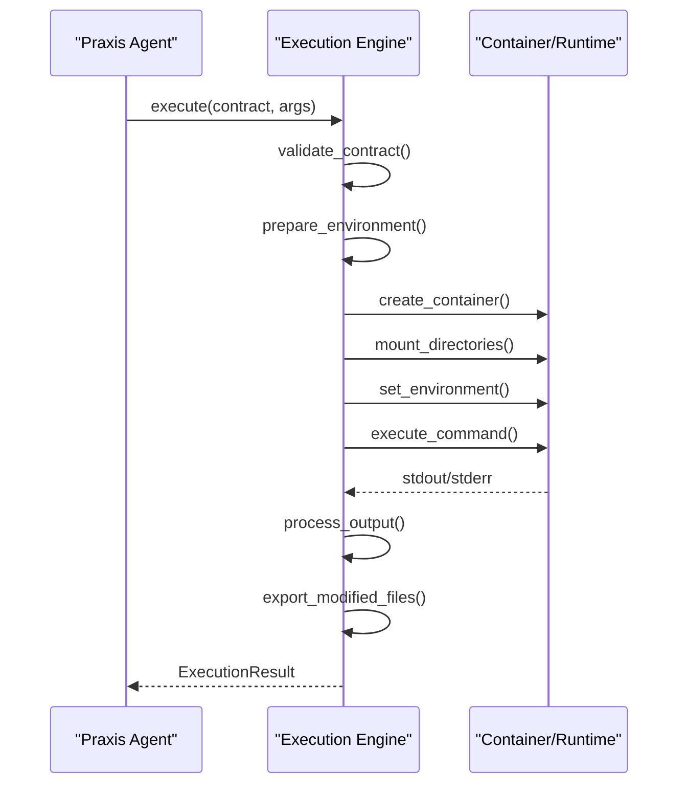

# Tool Contracts


## Table of Contents
1. [Introduction](#introduction)
2. [Core Data Models](#core-data-models)
3. [Tool Contract Structure](#tool-contract-structure)
4. [Execution Engines](#execution-engines)
5. [Validation and Error Handling](#validation-and-error-handling)
6. [Runtime Execution Flow](#runtime-execution-flow)
7. [MCP Integration](#mcp-integration)
8. [Schema Evolution and Versioning](#schema-evolution-and-versioning)
9. [Examples from Codebase](#examples-from-codebase)
10. [Best Practices](#best-practices)

## Introduction

Tool contracts define the interface between the Praxis agent system and executable tools. They provide a standardized way to describe how tools should be executed, what inputs they accept, and what outputs they produce. This documentation details the structure, validation, execution, and integration of tool contracts within the Praxis ecosystem.

**Section sources**
- [ToolContract](file://src/praxis_sdk/execution/contracts.py#L150-L257)

## Core Data Models

The tool contract system is built around several key data models that define the structure and behavior of executable tools.

### ToolContract Model

The `ToolContract` class is the central data structure that defines a tool's execution parameters:

```python
class ToolContract(BaseModel):
    engine: EngineType = Field(..., description="Execution engine type")
    name: str = Field(..., description="Tool name")
    engine_spec: Dict[str, Any] = Field(..., description="Engine-specific configuration")
    parameters: List[Union[ToolParameter, Dict[str, Any]]] = Field(default_factory=list, description="Tool parameters")
    description: Optional[str] = Field(None, description="Tool description")
    version: Optional[str] = Field(None, description="Tool version")
```

**Section sources**
- [ToolContract](file://src/praxis_sdk/execution/contracts.py#L150-L257)

### Engine Specifications

Different execution engines require different configuration parameters, represented by specialized specification classes.

#### Dagger Engine Specification

The `DaggerEngineSpec` defines configuration for containerized execution:

```python
class DaggerEngineSpec(BaseModel):
    image: str = Field(..., description="Docker image to use")
    command: List[str] = Field(..., description="Command to execute")
    mounts: Dict[str, str] = Field(default_factory=dict, description="Host-to-container mount mapping")
    env: Dict[str, str] = Field(default_factory=dict, description="Environment variables")
    env_passthrough: List[str] = Field(default_factory=list, description="Host env vars to pass through")
    working_dir: Optional[str] = Field(None, description="Working directory in container")
    timeout: int = Field(default=300, description="Execution timeout in seconds")
    memory_limit: Optional[str] = Field(None, description="Memory limit (e.g., '512m')")
    cpu_limit: Optional[float] = Field(None, description="CPU limit (e.g., 1.5)")
    network: Optional[str] = Field(None, description="Network mode")
    privileged: bool = Field(default=False, description="Run in privileged mode")
```

#### Local Engine Specification

The `LocalEngineSpec` defines configuration for local process execution:

```python
class LocalEngineSpec(BaseModel):
    command: List[str] = Field(..., description="Command to execute")
    shell: bool = Field(default=False, description="Execute command in shell")
    cwd: Optional[str] = Field(None, description="Working directory")
    env: Dict[str, str] = Field(default_factory=dict, description="Environment variables")
    timeout: int = Field(default=300, description="Execution timeout in seconds")
    capture_output: bool = Field(default=True, description="Capture stdout/stderr")
```

#### Remote MCP Engine Specification

The `RemoteMCPEngineSpec` defines configuration for remote tool execution:

```python
class RemoteMCPEngineSpec(BaseModel):
    address: str = Field(..., description="Remote MCP server address")
    timeout: int = Field(default=300, description="Request timeout in seconds")
    headers: Dict[str, str] = Field(default_factory=dict, description="HTTP headers")
    auth_token: Optional[str] = Field(None, description="Authentication token")
```

**Section sources**
- [DaggerEngineSpec](file://src/praxis_sdk/execution/contracts.py#L60-L110)
- [LocalEngineSpec](file://src/praxis_sdk/execution/contracts.py#L113-L147)
- [RemoteMCPEngineSpec](file://src/praxis_sdk/execution/contracts.py#L150-L170)

### Execution Result Model

The `ExecutionResult` class standardizes the output format for tool execution:

```python
class ExecutionResult(BaseModel):
    success: bool = Field(..., description="Whether execution was successful")
    output: str = Field(default="", description="Execution output")
    error: Optional[str] = Field(None, description="Error message if failed")
    exit_code: Optional[int] = Field(None, description="Process exit code")
    duration: float = Field(..., description="Execution duration in seconds")
    metadata: Dict[str, Any] = Field(default_factory=dict, description="Additional metadata")
```

**Section sources**
- [ExecutionResult](file://src/praxis_sdk/execution/contracts.py#L258-L302)

## Tool Contract Structure

Tool contracts are defined in YAML files that map directly to the `ToolContract` Pydantic model. The structure includes several key sections.

### Required Fields

Every tool contract must include these essential fields:

- **name**: Unique identifier for the tool
- **engine**: Execution engine type (dagger, local, remote-mcp)
- **engine_spec**: Engine-specific configuration

### Optional Fields

Additional fields provide metadata and enhanced functionality:

- **description**: Human-readable description of the tool
- **version**: Semantic version of the tool
- **parameters**: Schema defining input parameters
- **examples**: Usage examples for testing and documentation

### Parameters Schema

The parameters section defines the input interface for the tool, specifying:

- Parameter names and types
- Required vs optional parameters
- Default values
- Descriptions for documentation

```yaml
parameters:
  - name: "input_file"
    type: "string"
    description: "Path to the text file to analyze"
    required: true
```

**Section sources**
- [simple_python_tool/contract.yaml](file://tools/simple_python_tool/contract.yaml)
- [python_data_processor/contract.yaml](file://tools/python_data_processor/contract.yaml)

## Execution Engines

The Praxis system supports multiple execution engines, each with different capabilities and security characteristics.

### Engine Types

The system supports three primary engine types:

- **Dagger**: Containerized execution with isolation
- **Local**: Direct process execution on host
- **Remote-MCP**: Execution on remote servers via MCP protocol

```python
class EngineType(str, Enum):
    DAGGER = "dagger"
    LOCAL = "local"
    REMOTE_MCP = "remote-mcp"
```

### Engine Registry

The `EngineRegistry` manages available execution engines and provides engine selection:

```python
class EngineRegistry:
    def __init__(self):
        self._engines: Dict[str, ExecutionEngine] = {}
        self._default_engine: Optional[str] = None
    
    def register(self, name: str, engine: ExecutionEngine, is_default: bool = False):
        """Register an execution engine."""
        self._engines[name] = engine
        if is_default or not self._default_engine:
            self._default_engine = name
    
    def get(self, name: Optional[str] = None) -> ExecutionEngine:
        """Get an execution engine by name."""
        engine_name = name or self._default_engine
        if not engine_name:
            raise KeyError("No engines registered")
        if engine_name not in self._engines:
            raise KeyError(f"Engine '{engine_name}' not found")
        return self._engines[engine_name]
```

**Section sources**
- [engine.py](file://src/praxis_sdk/execution/engine.py)
- [contracts.py](file://src/praxis_sdk/execution/contracts.py#L290-L377)

## Validation and Error Handling

The tool contract system includes comprehensive validation to ensure contract integrity and predictable execution.

### Contract Validation

Contracts are validated at multiple levels:

1. **Pydantic Validation**: Automatic type and constraint checking
2. **Engine Compatibility**: Verification that the engine can handle the contract
3. **Security Checks**: Validation of mount points and environment variables

```python
@validator('image')
def validate_image(cls, v):
    if not v or not isinstance(v, str):
        raise ValueError("Image must be a non-empty string")
    return v
```

### Error Types

The system defines specific exception types for different failure modes:

- **ValidationError**: Contract structure is invalid
- **ExecutionError**: Tool execution failed
- **SecurityError**: Security policy violation

```python
class ValidationError(Exception):
    """Exception raised when contract validation fails."""
    pass

class ExecutionError(Exception):
    """Exception raised when tool execution fails."""
    def __init__(self, message: str, exit_code: Optional[int] = None, output: Optional[str] = None):
        super().__init__(message)
        self.exit_code = exit_code
        self.output = output
```

**Section sources**
- [contracts.py](file://src/praxis_sdk/execution/contracts.py#L304-L377)

## Runtime Execution Flow

The execution process follows a standardized flow from contract invocation to result return.

### Execution Sequence



**Diagram sources**
- [engine.py](file://src/praxis_sdk/execution/engine.py#L200-L700)

### Environment Preparation

Before execution, the engine prepares the environment by:

1. Resolving mount points
2. Setting environment variables
3. Passing through specified host variables
4. Adding execution context

```python
async def _prepare_environment_variables(
    self, 
    spec: DaggerEngineSpec, 
    args: Dict[str, Any],
    context: Dict[str, Any]
) -> Dict[str, str]:
    env_vars = {}
    
    # Add fixed environment variables from spec
    if spec.env:
        env_vars.update({k: str(v) for k, v in spec.env.items()})
    
    # Add passthrough environment variables from host
    for env_var in (spec.env_passthrough or []):
        if env_var and env_var in os.environ:
            env_vars[env_var] = os.environ[env_var]
    
    # Add arguments as environment variables
    for key, value in args.items():
        if key:
            env_vars[key] = str(value)
    
    # Add context variables
    for key, value in context.items():
        if key:
            context_key = f"CONTEXT_{key.upper()}"
            env_vars[context_key] = str(value)
    
    return env_vars
```

**Section sources**
- [engine.py](file://src/praxis_sdk/execution/engine.py#L600-L650)

## MCP Integration

Tool contracts integrate with the Model Context Protocol (MCP) for tool discovery and execution.

### Tool Registration

Dagger tools can be registered with the MCP server for discovery:

```python
async def register_dagger_tool(
    self,
    name: str,
    image: str,
    command: List[str],
    mounts: Dict[str, str] = None,
    env: Dict[str, str] = None,
    description: str = None,
    agent=None
):
    # Create tool contract
    contract = ToolContract.create_dagger_tool(
        name=name,
        image=image,
        command=command,
        mounts=mounts or {},
        env=env or {},
        env_passthrough=["PATH", "HOME", "USER", "OPENAI_API_KEY"],
        description=description
    )
    
    # Create tool handler
    async def dagger_tool_handler(**args) -> str:
        if not agent:
            raise ValueError("Agent not available for tool execution")
        
        # Execute tool using agent's execution engines
        result = await agent.execute_tool(contract, args)
        
        if result.success:
            return result.output or "Tool executed successfully"
        else:
            raise ValueError(f"Tool execution failed: {result.error}")
    
    # Register as built-in tool
    self.builtin_tools[name] = dagger_tool_handler
```

### Tool Discovery

The MCP server provides tool discovery through the `get_available_tools` method:

```python
def get_available_tools(self) -> List[Dict[str, Any]]:
    tools = []
    
    # Get built-in tools
    for tool_name in self.builtin_tools.keys():
        tool_metadata = getattr(self, 'tool_metadata', {}).get(tool_name, {})
        tools.append({
            "name": tool_name,
            "description": tool_metadata.get("description", f"Built-in tool: {tool_name}"),
            "source": "built-in",
            "parameters": tool_metadata.get("parameters", {}),
            "agent_id": "local",
            "agent_name": "praxis-agent-1",
            "agent_type": "local"
        })
    
    # Get external tools
    for server_id, server_tools in self.external_tools.items():
        for tool_name, tool_info in server_tools.items():
            tools.append({
                "name": tool_name,
                "description": tool_info.get("description", ""),
                "source": server_id,
                "parameters": tool_info.get("inputSchema", {}),
                "agent_id": server_id,
                "agent_name": f"external-{server_id}",
                "agent_type": "external"
            })
    
    return tools
```

**Section sources**
- [server.py](file://src/praxis_sdk/mcp/server.py#L500-L600)
- [filesystem.py](file://src/praxis_sdk/mcp/tools/filesystem.py)

## Schema Evolution and Versioning

The tool contract system supports schema evolution and backward compatibility.

### Versioning Strategy

Tools should include a version field to support backward compatibility:

```yaml
name: python_data_processor
description: "Advanced Python data processing tool"
version: "1.0.0"
```

### Backward Compatibility

When evolving tool contracts:

1. Add new parameters as optional
2. Maintain existing parameter names and types
3. Use version numbers to track changes
4. Provide migration paths for deprecated features

### Migration Example

```python
# Old contract
engineSpec:
  image: "python:3.9-slim"
  command: ["python", "/app/main.py"]

# New contract with backward compatibility
engine_spec:
  image: "python:3.11-slim"
  command: ["python", "/app/tools/python_data_processor/main.py"]
  working_dir: "/app"
  timeout: 180
  mounts:
    "/app/tools": "/app/tools"
    "/app/data": "/app/data"
```

**Section sources**
- [python_data_processor/contract.yaml](file://tools/python_data_processor/contract.yaml)

## Examples from Codebase

### Simple Python Tool

The `simple_python_tool` demonstrates a basic Dagger-based contract:

```yaml
name: "text_analyzer"
description: "Analyzes text files and generates statistics reports"
engine: "dagger"
params:
  - name: "input_file"
    type: "string"
    description: "Path to the text file to analyze"
    required: "true"
engineSpec:
  image: "python:3.11-slim"
  command: ["python", "/shared/tools/simple_python_tool/main.py"]
  mounts:
    ./shared: /shared
    ./tools: /shared/tools
  env_passthrough: []
```

### Calculator Tool

The `calculator` tool shows multiple input parameters:

```yaml
name: "calculator"
description: "Performs mathematical calculations"
engine: "dagger"
params:
  - name: "expression"
    type: "string"
    description: "Mathematical expression to evaluate"
    required: "false"
  - name: "operation"
    type: "string"
    description: "Basic operation: add, subtract, multiply, divide"
    required: "false"
  - name: "num1"
    type: "string"
    description: "First number for basic operations"
    required: "false"
  - name: "num2"
    type: "string"
    description: "Second number for basic operations"
    required: "false"
engineSpec:
  image: "python:3.11-slim"
  command: ["python", "/shared/tools/calculator/main.py"]
  mounts:
    ./shared: /shared
    ./tools: /shared/tools
  env_passthrough: ["EXPRESSION", "expression", "OPERATION", "operation", "NUM1", "num1", "NUM2", "num2"]
```

### Advanced Data Processor

The `python_data_processor` demonstrates a complex contract with examples and sample data:

```yaml
name: python_data_processor
description: "Advanced Python data processing tool"
version: "1.0.0"
engine: dagger
parameters:
  type: object
  properties:
    operation:
      type: string
      enum: ["stats", "numbers", "text", "file"]
      default: "stats"
    data:
      type: string
      description: "Input data"
      default: ""
    file:
      type: string
      description: "Path to file to analyze"
      default: ""
    format:
      type: string
      enum: ["text", "json"]
      default: "text"
  required: []
examples:
  - name: "Numeric statistics"
    parameters:
      operation: "numbers"
      data: "1,2,3,4,5,10,15,20"
    expected_output_contains: ["mean", "median", "std_dev"]
sample_data_files:
  - name: "sample_numbers.txt"
    content: "1.5, 2.3, 4.7, 8.1, 3.9, 6.2, 9.8, 1.2"
    description: "Comma-separated floating point numbers"
```

**Section sources**
- [simple_python_tool/contract.yaml](file://tools/simple_python_tool/contract.yaml)
- [calculator/contract.yaml](file://tools/calculator/contract.yaml)
- [python_data_processor/contract.yaml](file://tools/python_data_processor/contract.yaml)

## Best Practices

### Security Considerations

1. **Limit Mount Points**: Only mount necessary directories
2. **Restrict Environment Variables**: Only pass through required variables
3. **Use Non-Privileged Containers**: Avoid privileged mode when possible
4. **Validate Input Parameters**: Use strict type checking

### Performance Optimization

1. **Cache Dependencies**: Mount pip cache for Python tools
2. **Set Appropriate Timeouts**: Prevent hanging executions
3. **Limit Resource Usage**: Set CPU and memory limits
4. **Optimize Image Size**: Use minimal base images

### Development Workflow

1. **Include Examples**: Provide usage examples in contracts
2. **Add Sample Data**: Include test data for development
3. **Document Parameters**: Provide clear descriptions
4. **Version Contracts**: Use semantic versioning

```python
@staticmethod
def create_dagger_tool(
    name: str,
    image: str,
    command: List[str],
    mounts: Dict[str, str] = None,
    env: Dict[str, str] = None,
    env_passthrough: List[str] = None,
    working_dir: str = None,
    timeout: int = 300,
    description: str = None,
    **kwargs
) -> 'ToolContract':
    """Create a Dagger tool contract."""
    spec = {
        "image": image,
        "command": command,
        "mounts": mounts or {},
        "env": env or {},
        "env_passthrough": env_passthrough or [],
        "working_dir": working_dir,
        "timeout": timeout,
    }
    
    return ToolContract(
        engine=EngineType.DAGGER,
        name=name,
        engine_spec=spec,
        description=description
    )
```

**Section sources**
- [contracts.py](file://src/praxis_sdk/execution/contracts.py#L230-L257)

**Referenced Files in This Document**   
- [ToolContract](file://src/praxis_sdk/execution/contracts.py#L150-L257)
- [DaggerEngineSpec](file://src/praxis_sdk/execution/contracts.py#L60-L110)
- [LocalEngineSpec](file://src/praxis_sdk/execution/contracts.py#L113-L147)
- [RemoteMCPEngineSpec](file://src/praxis_sdk/execution/contracts.py#L150-L170)
- [ExecutionResult](file://src/praxis_sdk/execution/contracts.py#L258-L302)
- [simple_python_tool/contract.yaml](file://tools/simple_python_tool/contract.yaml)
- [python_data_processor/contract.yaml](file://tools/python_data_processor/contract.yaml)
- [calculator/contract.yaml](file://tools/calculator/contract.yaml)
- [engine.py](file://src/praxis_sdk/execution/engine.py)
- [filesystem.py](file://src/praxis_sdk/mcp/tools/filesystem.py)
- [server.py](file://src/praxis_sdk/mcp/server.py)