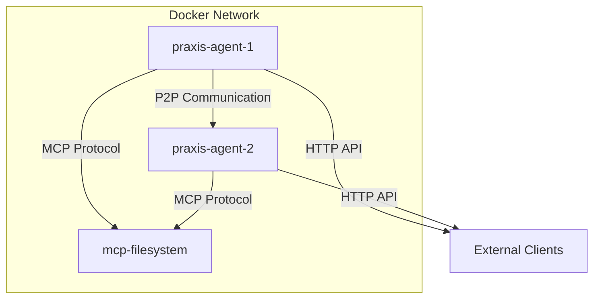
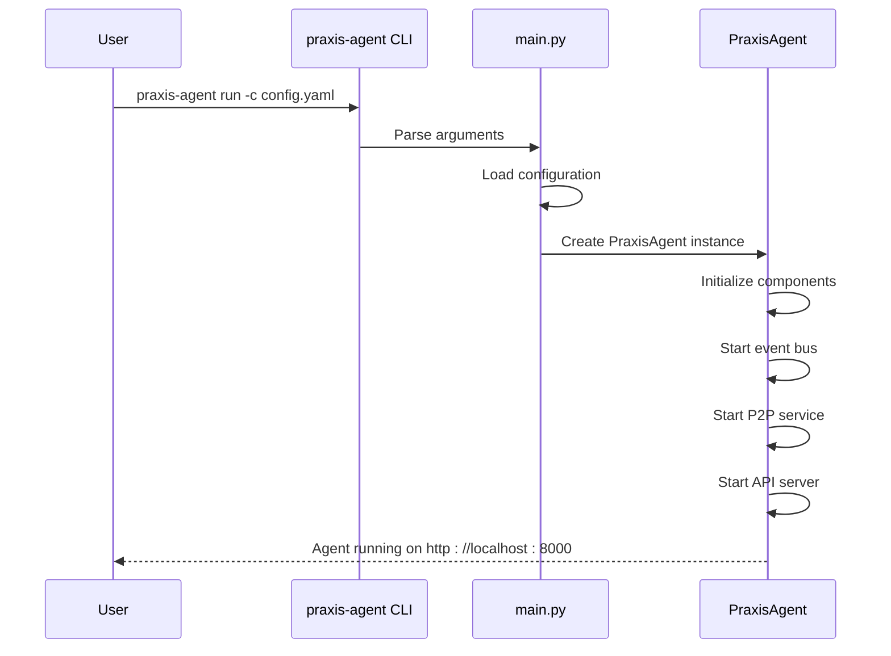

# Getting Started


## Table of Contents
1. [Prerequisites](#prerequisites)
2. [Installation](#installation)
3. [Docker Setup](#docker-setup)
4. [Configuration](#configuration)
5. [Running the Agent](#running-the-agent)
6. [Hello World Example](#hello-world-example)
7. [Troubleshooting](#troubleshooting)
8. [Verification](#verification)
9. [Next Steps](#next-steps)

## Prerequisites

Before installing the Praxis Python SDK, ensure your system meets the following requirements:

- **Python 3.11 or higher**: The SDK requires Python 3.11+ for async/await support and modern language features
- **Pip or Poetry**: Package manager for Python dependencies
- **Docker**: Required for containerized tool execution via Dagger engine
- **Git**: For cloning the repository
- **Basic understanding of async programming**: The SDK uses Trio and asyncio for concurrency
- **Familiarity with libp2p concepts**: Understanding of peer-to-peer networking fundamentals
- **OpenAI API key** (optional): Required for LLM integration features

**Section sources**
- [README.md](file://README.md#L20-L25)

## Installation

### Using pip (Recommended)

```bash
# Clone the repository
git clone https://github.com/prxs-ai/praxis-py-sdk.git
cd praxis-py-sdk

# Create and activate virtual environment
python -m venv venv
source venv/bin/activate  # On Windows: venv\Scripts\activate

# Install the SDK in development mode
pip install -e .
```

### Using Poetry

```bash
# Clone the repository
git clone https://github.com/prxs-ai/praxis-py-sdk.git
cd praxis-py-sdk

# Install dependencies with Poetry
poetry install

# Activate the virtual environment
poetry shell
```

The SDK will be installed with all required dependencies including:
- Trio for async concurrency
- FastAPI for HTTP interfaces
- Libp2p for peer-to-peer networking
- Dagger for containerized execution
- OpenAI client for LLM integration

**Section sources**
- [README.md](file://README.md#L50-L80)
- [pyproject.toml](file://pyproject.toml#L1-L73)

## Docker Setup

The Praxis SDK supports containerized execution for tool isolation and reproducibility.

### Building the Docker Image

```bash
# Build the Docker image
docker build -t praxis-sdk .

# Verify the image was built
docker images | grep praxis-sdk
```

### Running with Docker Compose

The repository includes a `docker-compose.yml` file for multi-agent setups:

```bash
# Start the full agent network
docker-compose up

# Start in detached mode
docker-compose up -d

# View logs
docker-compose logs -f praxis-agent-1
```

The Docker setup includes:
- Two Praxis agents (agent1 and agent2)
- An external MCP filesystem server
- Shared volumes for data persistence
- Proper network configuration for P2P communication



**Diagram sources**
- [docker-compose.yml](file://docker-compose.yml#L1-L155)
- [Dockerfile](file://Dockerfile#L1-L76)

**Section sources**
- [docker-compose.yml](file://docker-compose.yml#L1-L155)
- [Dockerfile](file://Dockerfile#L1-L76)
- [README.md](file://README.md#L100-L110)

## Configuration

### Configuration File Setup

The SDK uses YAML configuration files. A sample configuration is provided:

```bash
# Copy the sample configuration
cp sample_config.yaml my_agent.yaml
```

### Environment Variables

The SDK supports environment variable configuration with dot notation:

```bash
# Core agent settings
export AGENT_NAME=my-praxis-agent
export CONFIG_FILE=/app/configs/agent1.yaml

# API configuration
export PRAXIS_API__PORT=8000
export PRAXIS_WEBSOCKET__PORT=8090

# P2P configuration
export PRAXIS_P2P__PORT=4001
export PRAXIS_P2P__ENABLED=true

# LLM configuration
export OPENAI_API_KEY=your_openai_api_key_here
export PRAXIS_LLM__PROVIDER=openai
export PRAXIS_LLM__MODEL=gpt-4o-mini

# Logging
export PRAXIS_LOGGING__LEVEL=debug
```

### Configuration Hierarchy

The SDK follows this configuration priority:
1. Command line arguments (highest priority)
2. Environment variables
3. Configuration file
4. Default values (lowest priority)

**Section sources**
- [sample_config.yaml](file://sample_config.yaml#L1-L116)
- [README.md](file://README.md#L130-L150)

## Running the Agent

### Using the CLI

The SDK provides a command-line interface for agent management:

```bash
# Generate a new configuration file
praxis-agent init-config --env development my_agent.yaml

# Validate configuration
praxis-agent validate-config my_agent.yaml

# Run the agent with configuration
praxis-agent run -c my_agent.yaml --name my-agent

# Run with command line overrides
praxis-agent run --name test-agent --port 8001 --p2p-port 4002
```

### Programmatic Execution

You can also start the agent programmatically:

```python
from praxis_sdk.agent import PraxisAgent
from praxis_sdk.config import PraxisConfig
import asyncio

async def main():
    # Load configuration
    config = PraxisConfig.load_from_yaml("my_agent.yaml")
    
    # Create and start agent
    agent = PraxisAgent(config, "my-programmatic-agent")
    await agent.start()

if __name__ == "__main__":
    asyncio.run(main())
```

### Using main.py Directly

```bash
# Run using main.py
python src/praxis_sdk/main.py run -c sample_config.yaml --name hello-agent
```



**Diagram sources**
- [src/praxis_sdk/main.py](file://src/praxis_sdk/main.py#L1-L130)
- [src/praxis_sdk/agent.py](file://src/praxis_sdk/agent.py#L1-L799)

**Section sources**
- [src/praxis_sdk/main.py](file://src/praxis_sdk/main.py#L1-L130)
- [src/praxis_sdk/agent.py](file://src/praxis_sdk/agent.py#L1-L799)

## Hello World Example

### Creating a Simple Tool

Let's create a basic "Hello World" tool:

```python
# tools/hello_world/main.py
import os
import json

def main():
    # Get name from environment
    name = os.getenv('NAME', 'World')
    
    # Create result
    result = {
        "message": f"Hello, {name}!",
        "tool": "hello_world",
        "success": True
    }
    
    # Output as JSON
    print(json.dumps(result, indent=2))

if __name__ == "__main__":
    main()
```

### Tool Contract

```yaml
# tools/hello_world/contract.yaml
name: "hello_world"
description: "Simple hello world tool"
engine: "local"
params:
  - name: "name"
    type: "string"
    description: "Name to greet"
    required: false
    default: "World"
```

### Registering and Using the Tool

```python
from praxis_sdk.agent import PraxisAgent
from praxis_sdk.config import PraxisConfig
from praxis_sdk.execution.contracts import ToolContract
import asyncio
import yaml

async def hello_world_example():
    # Load configuration
    config = PraxisConfig.load_from_yaml("sample_config.yaml")
    
    # Create agent
    agent = PraxisAgent(config, "hello-world-agent")
    
    # Define tool contract
    contract_data = {
        "name": "hello_world",
        "description": "Greets a person",
        "engine": "local",
        "parameters": [
            {
                "name": "name",
                "type": "string",
                "required": False,
                "default": "World"
            }
        ]
    }
    
    # Create tool contract
    contract = ToolContract(**contract_data)
    
    # Add to agent (in a real scenario, this would be loaded from config)
    agent.tool_contracts["hello_world"] = contract
    
    # Start the agent
    await agent.start()
    
    # Invoke the tool
    result = await agent.invoke_tool("hello_world", {"name": "Alice"})
    print(f"Tool result: {result}")
    
    # Stop the agent
    await agent.stop()

# Run the example
asyncio.run(hello_world_example())
```

### Expected Output

```
INFO     Starting Praxis Agent 'hello-world-agent'...
INFO     Praxis Agent 'hello-world-agent' initialized
INFO     Starting Praxis Agent...
INFO     Task manager started
INFO     DSL orchestrator started
INFO     Initializing execution engines...
INFO     Local execution engine initialized
INFO     Available execution engines: [<EngineType.LOCAL: 'local'>]
INFO     API server started
INFO     Praxis Agent 'hello-world-agent' started successfully
INFO     🔧 TOOL INVOCATION: 'hello_world' on agent 'hello-world-agent'
INFO     📋 TOOL CONTRACT FOUND: hello_world -> local
INFO     🚀 EXECUTING VIA LOCAL ENGINE...
INFO     ✅ TOOL EXECUTION SUCCESS: hello_world
Tool result: {'success': True, 'tool': 'hello_world', 'engine': 'local', 'result': '{"message": "Hello, Alice!", "tool": "hello_world", "success": true}', 'execution_time': None}
```

**Section sources**
- [tools/simple_python_tool/main.py](file://tools/simple_python_tool/main.py#L1-L85)
- [src/praxis_sdk/agent.py](file://src/praxis_sdk/agent.py#L1-L799)

## Troubleshooting

### Common Issues and Solutions

#### Port Conflicts

**Problem**: "Address already in use" errors when starting the agent.

**Solution**: Change the port numbers in your configuration:

```yaml
http:
  port: 8001  # Changed from 8000
websocket:
  port: 8091  # Changed from 8090
p2p:
  port: 4002  # Changed from 4001
```

Or use command line arguments:
```bash
praxis-agent run --port 8001 --p2p-port 4002
```

#### Docker Permission Issues

**Problem**: Permission denied when accessing Docker socket.

**Solution**: Add your user to the docker group:
```bash
sudo usermod -aG docker $USER
# Then log out and back in
```

Or run with sudo (not recommended for production):
```bash
sudo docker-compose up
```

#### Dagger Engine Not Available

**Problem**: "DAGGER ENGINE NOT AVAILABLE!" error message.

**Solution**: Ensure the correct version of gql is installed:
```bash
pip install --force-reinstall 'gql[all]==3.5.0'
```

And verify Dagger CLI is available:
```bash
dagger version
```

#### Network Configuration Issues

**Problem**: Agents cannot discover each other.

**Solution**: Ensure mDNS is enabled in configuration:
```yaml
p2p:
  enable_mdns: true
  enable_dht: true
```

And verify Docker network is properly configured:
```bash
docker network inspect praxis-net
```

#### OpenAI Configuration Issues

**Problem**: LLM features not working.

**Solution**: Set the OpenAI API key:
```bash
export OPENAI_API_KEY=your_actual_api_key_here
```

Verify the configuration:
```yaml
llm:
  provider: openai
  model: gpt-4o-mini
```

**Section sources**
- [README.md](file://README.md#L200-L250)
- [src/praxis_sdk/agent.py](file://src/praxis_sdk/agent.py#L1-L799)

## Verification

### Checking Installation

Verify the SDK is properly installed:

```bash
# Check version
praxis-agent version
# Expected output: Praxis Python SDK v0.1.0

# Validate default configuration
praxis-agent validate-config
```

### Testing Agent Startup

Start the agent and verify it's running:

```bash
# Start the agent
praxis-agent run -c sample_config.yaml --name verification-agent

# In another terminal, check health endpoint
curl http://localhost:8000/health
# Expected output: {"status":"healthy","agent_name":"praxis-python-agent"}

# Check agent information
curl http://localhost:8000/api/agent/info
```

### Testing P2P Connectivity

Verify P2P functionality:

```bash
# Check P2P peers
curl http://localhost:8000/api/p2p/peers

# Check P2P protocols
curl http://localhost:8000/api/p2p/protocols
```

### Testing Tool Execution

Test a built-in tool:

```bash
# Execute calculator tool
curl -X POST http://localhost:8000/api/tools/execute \
  -H "Content-Type: application/json" \
  -d '{
    "tool_name": "calculator",
    "params": {
      "expression": "2 + 2"
    }
  }'
```

### Expected Success Indicators

- Agent starts without errors
- Health endpoint returns 200 OK
- API server accessible on configured port
- P2P service initialized with peer ID
- Execution engines available (at least local engine)

**Section sources**
- [README.md](file://README.md#L300-L350)
- [src/praxis_sdk/agent.py](file://src/praxis_sdk/agent.py#L1-L799)

## Next Steps

### Configuration Reference

For detailed configuration options, refer to the [Configuration Guide](https://docs.praxis.ai/configuration) which covers all available settings in the YAML configuration file.

### API Documentation

Explore the full API documentation at [API Reference](https://docs.praxis.ai/api) to understand all available endpoints for agent control and monitoring.

### Advanced Features

Once you have the basic setup working, explore these advanced features:

- **Multi-agent workflows**: Set up multiple agents to collaborate on tasks
- **Custom tool development**: Create your own tools with specific functionality
- **Dagger execution**: Use containerized execution for complex tool requirements
- **P2P networking**: Implement peer-to-peer communication patterns
- **LLM integration**: Leverage large language models for intelligent task planning

### Community Support

Join the Praxis community for support and collaboration:

- **Discord**: [Join our Discord server](https://discord.gg/praxis-ai)
- **GitHub Issues**: [Report bugs and request features](https://github.com/prxs-ai/praxis-py-sdk/issues)
- **Email**: [team@praxis.ai](mailto:team@praxis.ai)

**Referenced Files in This Document**   
- [README.md](file://README.md)
- [sample_config.yaml](file://sample_config.yaml)
- [src/praxis_sdk/main.py](file://src/praxis_sdk/main.py)
- [src/praxis_sdk/agent.py](file://src/praxis_sdk/agent.py)
- [docker-compose.yml](file://docker-compose.yml)
- [Dockerfile](file://Dockerfile)
- [pyproject.toml](file://pyproject.toml)
- [tools/simple_python_tool/main.py](file://tools/simple_python_tool/main.py)