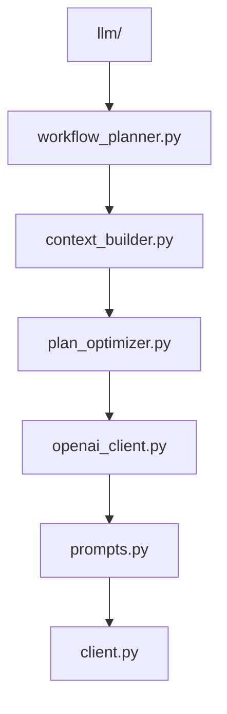
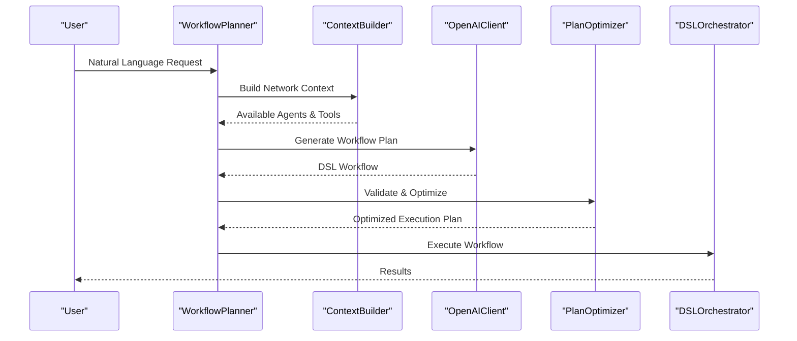
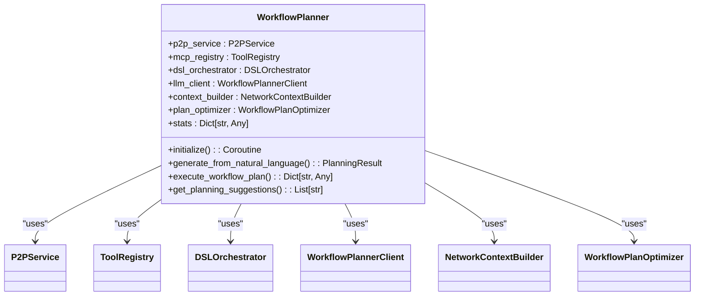
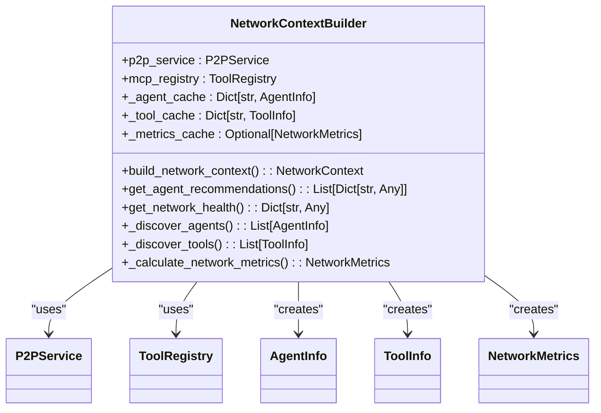
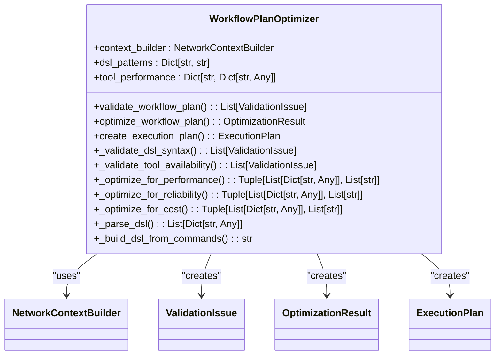
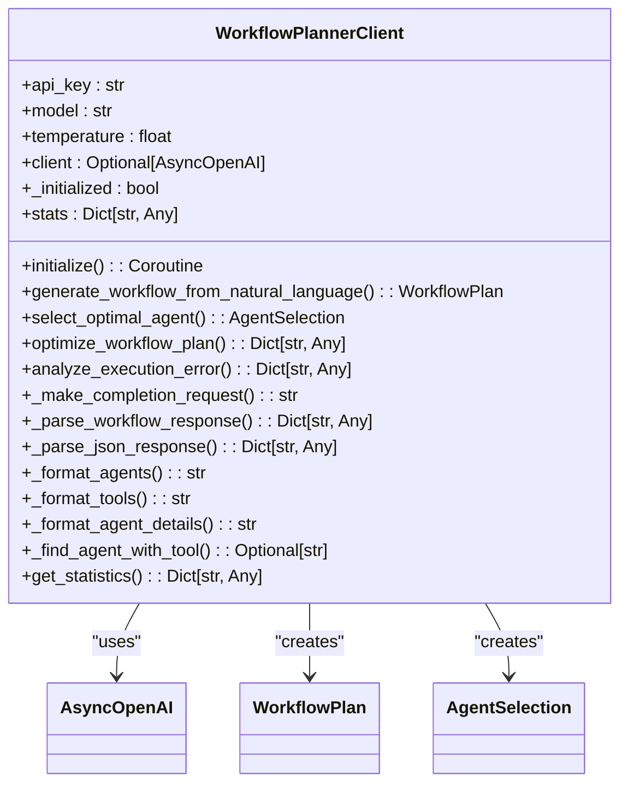
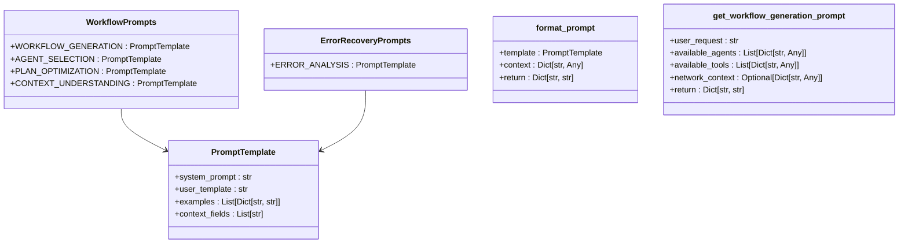
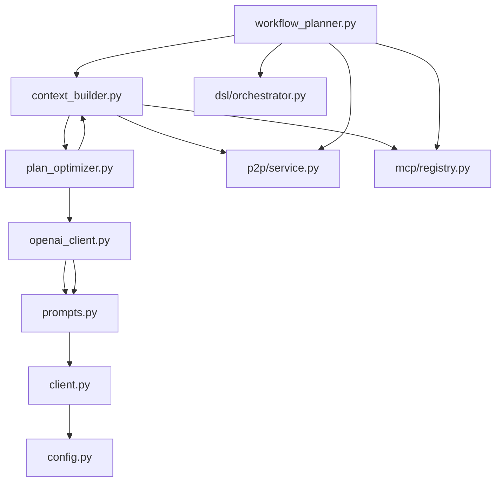

# LLM Integration

## Table of Contents
1. [Introduction](#introduction)
2. [Project Structure](#project-structure)
3. [Core Components](#core-components)
4. [Architecture Overview](#architecture-overview)
5. [Detailed Component Analysis](#detailed-component-analysis)
6. [Dependency Analysis](#dependency-analysis)
7. [Performance Considerations](#performance-considerations)
8. [Troubleshooting Guide](#troubleshooting-guide)
9. [Conclusion](#conclusion)

## Introduction
The Praxis Python SDK is a distributed agent platform designed for building autonomous, collaborative systems. This document focuses on the LLM integration components that enable natural language processing and intelligent workflow planning. The system leverages Large Language Models (LLMs) to convert natural language requests into executable workflows, utilizing a sophisticated architecture that includes workflow planning, context building, and plan optimization.

The LLM integration components work together to provide a seamless experience where users can express their needs in natural language, and the system automatically generates, optimizes, and executes complex workflows across a distributed network of agents. This documentation provides a comprehensive analysis of how these components work together to deliver advanced AI-powered automation capabilities.

## Project Structure
The LLM integration components are organized within the `src/praxis_sdk/llm` directory, which contains specialized modules for different aspects of LLM-powered workflow planning. The structure follows a modular design pattern with clear separation of concerns between workflow planning, context building, optimization, and client implementation.

**Diagram sources**
- [workflow_planner.py](file://src/praxis_sdk/llm/workflow_planner.py)
- [context_builder.py](file://src/praxis_sdk/llm/context_builder.py)
- [plan_optimizer.py](file://src/praxis_sdk/llm/plan_optimizer.py)
- [openai_client.py](file://src/praxis_sdk/llm/openai_client.py)
- [prompts.py](file://src/praxis_sdk/llm/prompts.py)
- [client.py](file://src/praxis_sdk/llm/client.py)

**Section sources**
- [workflow_planner.py](file://src/praxis_sdk/llm/workflow_planner.py)
- [context_builder.py](file://src/praxis_sdk/llm/context_builder.py)
- [plan_optimizer.py](file://src/praxis_sdk/llm/plan_optimizer.py)
- [openai_client.py](file://src/praxis_sdk/llm/openai_client.py)
- [prompts.py](file://src/praxis_sdk/llm/prompts.py)
- [client.py](file://src/praxis_sdk/llm/client.py)

## Core Components
The LLM integration system consists of several core components that work together to transform natural language requests into executable workflows. The workflow_planner serves as the central orchestrator, coordinating between the context_builder, plan_optimizer, and LLM clients to generate optimized execution plans.

The context_builder gathers information about available agents and tools in the network, creating a comprehensive context for the LLM to make informed decisions. The plan_optimizer validates and enhances generated workflows for better performance and reliability. The openai_client provides a specialized interface for interacting with OpenAI's API, while the prompts module contains carefully crafted templates that guide the LLM's behavior.

**Section sources**
- [workflow_planner.py](file://src/praxis_sdk/llm/workflow_planner.py#L1-L50)
- [context_builder.py](file://src/praxis_sdk/llm/context_builder.py#L1-L50)
- [plan_optimizer.py](file://src/praxis_sdk/llm/plan_optimizer.py#L1-L50)
- [openai_client.py](file://src/praxis_sdk/llm/openai_client.py#L1-L50)
- [prompts.py](file://src/praxis_sdk/llm/prompts.py#L1-L50)

## Architecture Overview
The LLM integration architecture follows a layered approach where natural language requests are processed through multiple stages to produce executable workflows. The system begins with the workflow_planner receiving a natural language request, which then coordinates with the context_builder to gather network information.

**Diagram sources**
- [workflow_planner.py](file://src/praxis_sdk/llm/workflow_planner.py#L1-L50)
- [context_builder.py](file://src/praxis_sdk/llm/context_builder.py#L1-L50)
- [openai_client.py](file://src/praxis_sdk/llm/openai_client.py#L1-L50)
- [plan_optimizer.py](file://src/praxis_sdk/llm/plan_optimizer.py#L1-L50)

## Detailed Component Analysis

### Workflow Planner Analysis
The WorkflowPlanner class serves as the central orchestrator for converting natural language requests into executable workflows. It coordinates between various components to generate, validate, and optimize workflow plans.

**Diagram sources**
- [workflow_planner.py](file://src/praxis_sdk/llm/workflow_planner.py#L1-L50)

**Section sources**
- [workflow_planner.py](file://src/praxis_sdk/llm/workflow_planner.py#L1-L500)

### Context Builder Analysis
The NetworkContextBuilder class is responsible for gathering comprehensive information about the network state, including available agents, tools, and performance metrics. This context is essential for making informed decisions during workflow planning.

**Diagram sources**
- [context_builder.py](file://src/praxis_sdk/llm/context_builder.py#L1-L50)

**Section sources**
- [context_builder.py](file://src/praxis_sdk/llm/context_builder.py#L1-L600)

### Plan Optimizer Analysis
The WorkflowPlanOptimizer class is responsible for validating and optimizing workflow plans for better performance, reliability, and resource utilization. It analyzes DSL syntax, validates tool availability, and applies various optimization strategies.

**Diagram sources**
- [plan_optimizer.py](file://src/praxis_sdk/llm/plan_optimizer.py#L1-L50)

**Section sources**
- [plan_optimizer.py](file://src/praxis_sdk/llm/plan_optimizer.py#L1-L700)

### OpenAI Client Analysis
The WorkflowPlannerClient class provides a specialized interface for interacting with OpenAI's API, focusing on workflow planning and agent selection tasks. It handles connection management, request formatting, and response parsing.

**Diagram sources**
- [openai_client.py](file://src/praxis_sdk/llm/openai_client.py#L1-L50)

**Section sources**
- [openai_client.py](file://src/praxis_sdk/llm/openai_client.py#L1-L450)

### Prompt Engineering Analysis
The prompts module contains carefully crafted templates that guide the LLM's behavior during workflow planning. These templates include system prompts, user templates, examples, and context fields that ensure consistent and reliable output.

**Diagram sources**
- [prompts.py](file://src/praxis_sdk/llm/prompts.py#L1-L50)

**Section sources**
- [prompts.py](file://src/praxis_sdk/llm/prompts.py#L1-L300)

## Dependency Analysis
The LLM integration components have a well-defined dependency structure where higher-level components depend on lower-level utilities. The workflow_planner depends on all other components, serving as the central orchestrator.

**Diagram sources**
- [workflow_planner.py](file://src/praxis_sdk/llm/workflow_planner.py)
- [context_builder.py](file://src/praxis_sdk/llm/context_builder.py)
- [plan_optimizer.py](file://src/praxis_sdk/llm/plan_optimizer.py)
- [openai_client.py](file://src/praxis_sdk/llm/openai_client.py)
- [prompts.py](file://src/praxis_sdk/llm/prompts.py)
- [client.py](file://src/praxis_sdk/llm/client.py)
- [config.py](file://src/praxis_sdk/config.py)

**Section sources**
- [workflow_planner.py](file://src/praxis_sdk/llm/workflow_planner.py)
- [context_builder.py](file://src/praxis_sdk/llm/context_builder.py)
- [plan_optimizer.py](file://src/praxis_sdk/llm/plan_optimizer.py)
- [openai_client.py](file://src/praxis_sdk/llm/openai_client.py)
- [prompts.py](file://src/praxis_sdk/llm/prompts.py)
- [client.py](file://src/praxis_sdk/llm/client.py)

## Performance Considerations
The LLM integration system incorporates several performance optimization strategies to ensure efficient operation. The workflow_planner includes caching mechanisms and fallback strategies to handle LLM failures gracefully. The context_builder caches network information to reduce redundant queries, while the plan_optimizer applies various optimization techniques to improve workflow efficiency.

Cost optimization is achieved through intelligent agent selection and resource allocation. The system prioritizes local agents to reduce network overhead and applies batching strategies for similar operations. Rate limiting is implemented at the LLM client level to prevent API abuse, with retry mechanisms in place for transient failures.

Caching strategies are employed at multiple levels, with the context_builder maintaining caches of agent and tool information. The workflow_planner also tracks statistics to identify performance bottlenecks and optimize future requests. These performance considerations ensure that the system can handle high volumes of requests while maintaining responsiveness and reliability.

**Section sources**
- [workflow_planner.py](file://src/praxis_sdk/llm/workflow_planner.py)
- [context_builder.py](file://src/praxis_sdk/llm/context_builder.py)
- [plan_optimizer.py](file://src/praxis_sdk/llm/plan_optimizer.py)
- [openai_client.py](file://src/praxis_sdk/llm/openai_client.py)
- [client.py](file://src/praxis_sdk/llm/client.py)

## Troubleshooting Guide
The LLM integration system includes comprehensive error handling and troubleshooting capabilities. When LLM generation fails, the system automatically falls back to rule-based approaches to ensure continuity of service. The workflow_planner logs detailed information about each planning request, including processing time, success rate, and error messages.

Common issues include missing API keys, network connectivity problems, and unavailable tools. The system provides clear error messages and recovery suggestions through the analyze_execution_error method. The get_network_health method offers insights into the overall system status, helping identify potential bottlenecks.

For debugging purposes, the system includes detailed logging at multiple levels, from high-level planning decisions to low-level API interactions. The statistics tracking in each component provides valuable insights into system performance and reliability. These troubleshooting features ensure that issues can be quickly identified and resolved, minimizing downtime and maintaining service quality.

**Section sources**
- [workflow_planner.py](file://src/praxis_sdk/llm/workflow_planner.py)
- [openai_client.py](file://src/praxis_sdk/llm/openai_client.py)
- [plan_optimizer.py](file://src/praxis_sdk/llm/plan_optimizer.py)

## Conclusion
The LLM integration in the Praxis Python SDK provides a sophisticated framework for converting natural language requests into executable workflows. By combining workflow planning, context building, and optimization, the system delivers a powerful automation platform that can adapt to complex distributed environments.

The architecture demonstrates careful consideration of performance, reliability, and usability, with features like fallback strategies, caching, and comprehensive error handling. The modular design allows for easy extension and customization, making it suitable for a wide range of applications.

Future enhancements could include support for additional LLM providers, more sophisticated optimization algorithms, and enhanced security features for data privacy. Overall, the LLM integration represents a significant advancement in autonomous agent technology, enabling more natural and intuitive interaction with distributed systems.

**Referenced Files in This Document**   
- [workflow_planner.py](file://src/praxis_sdk/llm/workflow_planner.py)
- [context_builder.py](file://src/praxis_sdk/llm/context_builder.py)
- [plan_optimizer.py](file://src/praxis_sdk/llm/plan_optimizer.py)
- [openai_client.py](file://src/praxis_sdk/llm/openai_client.py)
- [prompts.py](file://src/praxis_sdk/llm/prompts.py)
- [client.py](file://src/praxis_sdk/llm/client.py)
- [config.py](file://src/praxis_sdk/config.py)