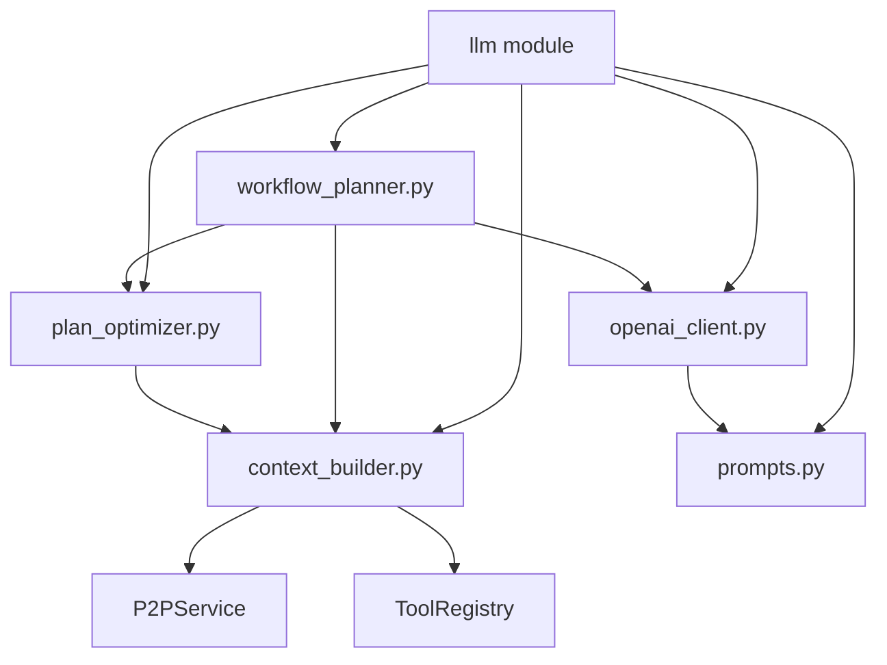
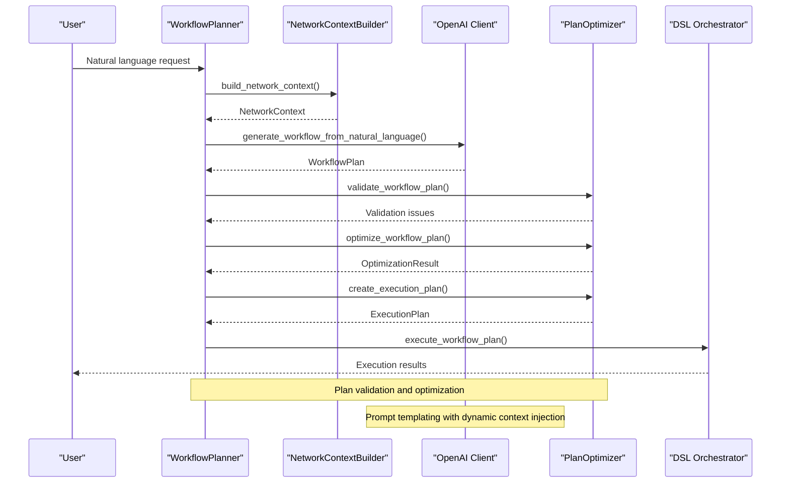
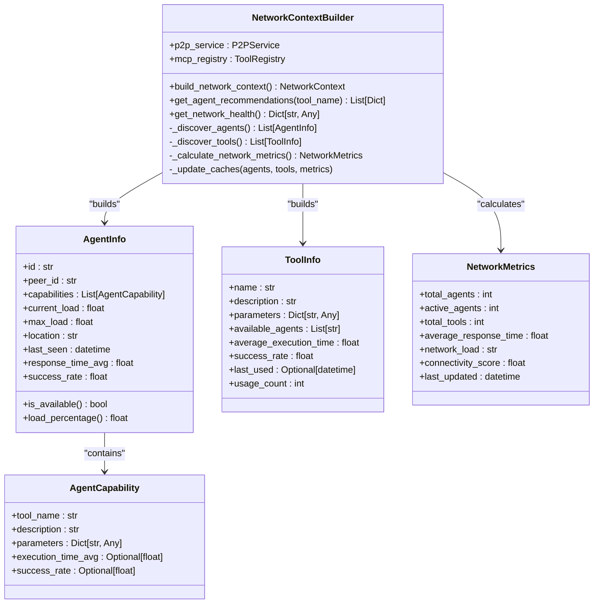
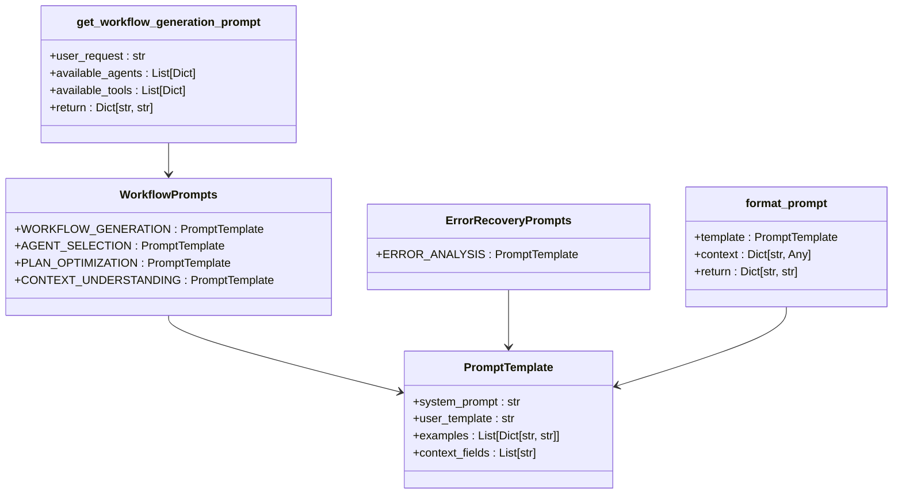
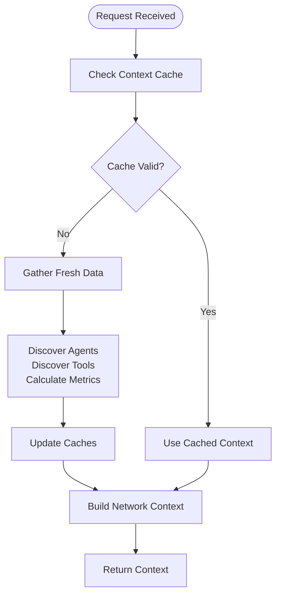
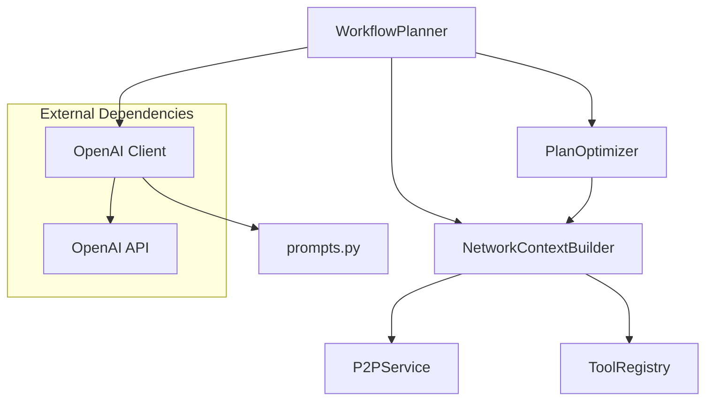

# Context Building and Prompt Engineering


## Table of Contents
1. [Introduction](#introduction)
2. [Project Structure](#project-structure)
3. [Core Components](#core-components)
4. [Architecture Overview](#architecture-overview)
5. [Detailed Component Analysis](#detailed-component-analysis)
6. [Dependency Analysis](#dependency-analysis)
7. [Performance Considerations](#performance-considerations)
8. [Troubleshooting Guide](#troubleshooting-guide)
9. [Conclusion](#conclusion)

## Introduction
This document provides a comprehensive analysis of the context building and prompt engineering system within the Praxis-Py-SDK. The system enables intelligent workflow planning by aggregating network state, agent capabilities, tool availability, and historical performance data into structured prompts for Large Language Models (LLMs). These prompts guide LLMs in generating executable Domain Specific Language (DSL) workflows, selecting optimal agents, optimizing execution plans, and recovering from errors. The documentation covers the architecture, implementation details, and best practices for extending this system.

## Project Structure
The context building and prompt engineering functionality is located in the `src/praxis_sdk/llm/` directory. This module integrates with other components of the system including P2P networking, MCP tool registry, and DSL execution engine. The core files are organized to separate concerns between context aggregation, prompt templating, LLM interaction, and workflow optimization.



**Diagram sources**
- [src/praxis_sdk/llm/context_builder.py](file://src/praxis_sdk/llm/context_builder.py)
- [src/praxis_sdk/llm/prompts.py](file://src/praxis_sdk/llm/prompts.py)
- [src/praxis_sdk/llm/openai_client.py](file://src/praxis_sdk/llm/openai_client.py)
- [src/praxis_sdk/llm/workflow_planner.py](file://src/praxis_sdk/llm/workflow_planner.py)
- [src/praxis_sdk/llm/plan_optimizer.py](file://src/praxis_sdk/llm/plan_optimizer.py)

**Section sources**
- [src/praxis_sdk/llm/context_builder.py](file://src/praxis_sdk/llm/context_builder.py)
- [src/praxis_sdk/llm/prompts.py](file://src/praxis_sdk/llm/prompts.py)

## Core Components
The context building and prompt engineering system consists of five core components that work together to transform natural language requests into executable workflows. The NetworkContextBuilder gathers real-time information about available agents and tools. The prompts module defines structured templates for different planning tasks. The OpenAI client handles communication with LLMs. The WorkflowPlanner orchestrates the entire planning process. The PlanOptimizer validates and improves generated workflows.

**Section sources**
- [src/praxis_sdk/llm/context_builder.py](file://src/praxis_sdk/llm/context_builder.py#L1-L609)
- [src/praxis_sdk/llm/prompts.py](file://src/praxis_sdk/llm/prompts.py#L1-L304)
- [src/praxis_sdk/llm/openai_client.py](file://src/praxis_sdk/llm/openai_client.py#L1-L481)
- [src/praxis_sdk/llm/workflow_planner.py](file://src/praxis_sdk/llm/workflow_planner.py#L1-L491)
- [src/praxis_sdk/llm/plan_optimizer.py](file://src/praxis_sdk/llm/plan_optimizer.py#L1-L738)

## Architecture Overview
The context building and prompt engineering system follows a layered architecture that transforms natural language requests into executable workflows through a series of well-defined stages. The process begins with context aggregation from distributed agents and tools, followed by prompt construction using specialized templates. The LLM generates an initial workflow plan, which is then validated and optimized before execution.



**Diagram sources**
- [src/praxis_sdk/llm/workflow_planner.py](file://src/praxis_sdk/llm/workflow_planner.py#L1-L491)
- [src/praxis_sdk/llm/context_builder.py](file://src/praxis_sdk/llm/context_builder.py#L1-L609)
- [src/praxis_sdk/llm/openai_client.py](file://src/praxis_sdk/llm/openai_client.py#L1-L481)
- [src/praxis_sdk/llm/plan_optimizer.py](file://src/praxis_sdk/llm/plan_optimizer.py#L1-L738)

## Detailed Component Analysis

### Context Builder Analysis
The NetworkContextBuilder is responsible for aggregating comprehensive information about the distributed agent network. It discovers available agents through the P2P service, identifies available tools via the MCP registry, and calculates network-wide performance metrics. The builder maintains caches to reduce redundant network calls and provides methods for agent recommendations and network health assessment.



**Diagram sources**
- [src/praxis_sdk/llm/context_builder.py](file://src/praxis_sdk/llm/context_builder.py#L1-L609)

**Section sources**
- [src/praxis_sdk/llm/context_builder.py](file://src/praxis_sdk/llm/context_builder.py#L1-L609)

### Prompt Engineering Analysis
The prompts module defines structured templates for various workflow planning tasks. Each template includes a system prompt that establishes the LLM's role and constraints, a user template for the specific request, few-shot examples to guide output format, and a list of required context fields. The system supports different types of planning tasks including workflow generation, agent selection, plan optimization, and error recovery.



**Diagram sources**
- [src/praxis_sdk/llm/prompts.py](file://src/praxis_sdk/llm/prompts.py#L1-L304)

**Section sources**
- [src/praxis_sdk/llm/prompts.py](file://src/praxis_sdk/llm/prompts.py#L1-L304)

### Dynamic Context Injection Example
The system enhances LLM output quality through dynamic context injection, where real-time network information is inserted into prompt templates. This ensures that generated workflows are grounded in current system capabilities and constraints.

**Example of Dynamic Context Injection:**

```python
# Before context injection
system_prompt = """You are an intelligent workflow planner...
AVAILABLE TOOLS:
{available_tools}

RULES:
1. Always use available tools from the provided context"""

# After context injection
system_prompt = """You are an intelligent workflow planner...
AVAILABLE TOOLS:
- file_read: Read contents of a file
- file_write: Write content to a file  
- http_request: Make HTTP requests to external APIs
- data_analyze: Process and analyze structured data

RULES:
1. Always use available tools from the provided context"""
```

This injection process occurs through the `format_prompt()` function, which takes a template and context dictionary, validates required fields, and returns fully formatted system and user prompts. The inclusion of current agent availability, tool capabilities, and network load enables the LLM to make informed decisions about workflow design and agent routing.

**Section sources**
- [src/praxis_sdk/llm/prompts.py](file://src/praxis_sdk/llm/prompts.py#L150-L180)

### Best Practices for Prompt Design
The system implements several prompt engineering best practices to improve LLM reliability and output consistency:

**Few-Shot Examples:** Each prompt template includes representative input-output pairs that demonstrate the expected response format and content. For example, the workflow generation template shows how to convert a tweet analysis request into a DSL workflow with proper JSON formatting.

**Chain-of-Thought Prompting:** The system prompts encourage step-by-step reasoning by structuring the task into clear phases. The agent selection prompt, for instance, guides the LLM to consider capability, load, performance, and locality in sequence before making a recommendation.

**Constraint Enforcement:** System prompts include explicit rules and validation requirements. The workflow generation prompt mandates JSON output with specific fields (dsl, description, agents_used, estimated_time), while the plan optimization prompt requires listing changes made and potential risks.

**Structured Output:** All templates require JSON responses with defined schemas, making it easier to parse and validate LLM output programmatically. The response_format parameter in the OpenAI API call enforces this structure.

**Contextual Awareness:** Prompts include relevant contextual information such as current network load, agent capabilities, and tool descriptions, enabling the LLM to make grounded decisions rather than relying on internal knowledge.

**Section sources**
- [src/praxis_sdk/llm/prompts.py](file://src/praxis_sdk/llm/prompts.py#L1-L304)

### Security Considerations
When handling sensitive context data, the system implements several security measures:

- **Data Minimization:** Only essential information is included in prompts. Sensitive details like agent IP addresses or authentication credentials are excluded from the context.
- **Context Sanitization:** Before injecting data into prompts, the system should validate and sanitize inputs to prevent prompt injection attacks.
- **API Key Protection:** OpenAI API keys are handled through environment variables or secure configuration, never hardcoded in prompts.
- **Error Handling:** Error messages are sanitized to avoid leaking system internals to users or LLMs.
- **Access Control:** The context builder should implement authentication and authorization when retrieving agent and tool information.

While the current implementation focuses on functionality, production deployments should enhance these security aspects, particularly around input validation and sensitive data handling.

**Section sources**
- [src/praxis_sdk/llm/openai_client.py](file://src/praxis_sdk/llm/openai_client.py#L25-L50)
- [src/praxis_sdk/llm/context_builder.py](file://src/praxis_sdk/llm/context_builder.py#L1-L609)

### Customization and Extension
The prompt system is designed to be extensible for specialized domains. Developers can create new prompt templates by defining additional PromptTemplate instances within the appropriate category class (WorkflowPrompts, ErrorRecoveryPrompts, etc.). Custom templates can include domain-specific instructions, examples, and context fields.

To extend the system for a new domain like healthcare:

```python
class MedicalWorkflowPrompts:
    MEDICAL_DIAGNOSIS = PromptTemplate(
        system_prompt="""You are a medical workflow advisor. Your task is to suggest diagnostic workflows...
        
        SPECIALIZED TOOLS:
        {available_medical_tools}
        
        MEDICAL GUIDELINES:
        1. Always prioritize patient safety
        2. Follow evidence-based medicine protocols
        3. Include appropriate diagnostic tests""",
        user_template="""Create a diagnostic workflow for symptoms: {symptoms}
        
        PATIENT CONTEXT:
        - Age: {age}
        - Medical history: {medical_history}""",
        examples=[
            {
                "input": "symptoms: fever, cough, shortness of breath",
                "output": """{"dsl": "vitals_check\\nlaboratory_tests --cbc --crp\\nimaging --chest_xray", "diagnosis_path": "respiratory_infection", "urgency": "high"}"""
            }
        ],
        context_fields=["symptoms", "age", "medical_history", "available_medical_tools"]
    )
```

New templates can then be integrated into the workflow planner or called directly through the OpenAI client.

**Section sources**
- [src/praxis_sdk/llm/prompts.py](file://src/praxis_sdk/llm/prompts.py#L1-L304)

### Performance Metrics and Caching
The system implements caching strategies to optimize repeated context patterns and reduce latency. The NetworkContextBuilder maintains caches for agent information, tool details, and network metrics with a configurable TTL (default 300 seconds). This prevents redundant network calls when multiple planning operations occur within a short timeframe.

Performance is tracked through comprehensive statistics in both the WorkflowPlanner and OpenAI client classes. Key metrics include:

- Plans generated and success rate
- Average processing time
- LLM usage rate vs. fallback rate
- Cache hit ratio
- Network discovery latency

These metrics are exposed through get_statistics() methods and can be integrated with monitoring systems. The caching strategy significantly improves performance for burst workloads, while the statistics enable capacity planning and system optimization.



**Diagram sources**
- [src/praxis_sdk/llm/context_builder.py](file://src/praxis_sdk/llm/context_builder.py#L1-L609)

**Section sources**
- [src/praxis_sdk/llm/context_builder.py](file://src/praxis_sdk/llm/context_builder.py#L1-L609)

## Dependency Analysis
The context building and prompt engineering system has well-defined dependencies on other components of the Praxis-Py-SDK. The core dependency is on the P2P service for agent discovery and the MCP registry for tool discovery. These dependencies enable the system to maintain an accurate view of available capabilities across the distributed network.



**Diagram sources**
- [src/praxis_sdk/llm/workflow_planner.py](file://src/praxis_sdk/llm/workflow_planner.py#L1-L491)
- [src/praxis_sdk/llm/context_builder.py](file://src/praxis_sdk/llm/context_builder.py#L1-L609)
- [src/praxis_sdk/llm/openai_client.py](file://src/praxis_sdk/llm/openai_client.py#L1-L481)
- [src/praxis_sdk/llm/plan_optimizer.py](file://src/praxis_sdk/llm/plan_optimizer.py#L1-L738)

**Section sources**
- [src/praxis_sdk/llm/workflow_planner.py](file://src/praxis_sdk/llm/workflow_planner.py#L1-L491)
- [src/praxis_sdk/llm/context_builder.py](file://src/praxis_sdk/llm/context_builder.py#L1-L609)

## Performance Considerations
The system balances performance between responsiveness and accuracy. The NetworkContextBuilder's caching mechanism reduces latency for repeated requests, while the fallback mechanism in WorkflowPlanner ensures availability even when the LLM service is unreachable. The asynchronous implementation allows concurrent operations, and the statistics tracking enables performance monitoring and optimization.

Key performance characteristics:
- Context building: ~200-500ms when cache is warm, 1-2s when cold
- LLM planning: 1-5s depending on model and complexity
- Fallback planning: <100ms
- Memory usage: Low to moderate, primarily for caching agent and tool information

For high-throughput scenarios, the system could be enhanced with distributed caching, request batching, and LLM response caching for identical requests.

## Troubleshooting Guide
Common issues and their solutions:

**LLM Planning Failures:**
- Check API key configuration and network connectivity
- Verify the OpenAI service is reachable
- Examine the error logs in the OpenAI client
- Ensure prompt context contains all required fields

**Invalid Workflow Generation:**
- Validate that all tools in the DSL are available in the network
- Check for syntax errors in the generated DSL
- Verify agent capabilities match tool requirements
- Review validation issues from the PlanOptimizer

**Poor Performance:**
- Monitor cache hit ratio; low hits indicate need for longer TTL
- Check network latency between agents
- Analyze LLM response times
- Review system resource utilization

**Agent Selection Issues:**
- Verify agent heartbeats are being received
- Check tool registry synchronization
- Validate agent capability reporting
- Review load calculation accuracy

**Section sources**
- [src/praxis_sdk/llm/openai_client.py](file://src/praxis_sdk/llm/openai_client.py#L1-L481)
- [src/praxis_sdk/llm/plan_optimizer.py](file://src/praxis_sdk/llm/plan_optimizer.py#L1-L738)
- [src/praxis_sdk/llm/context_builder.py](file://src/praxis_sdk/llm/context_builder.py#L1-L609)

## Conclusion
The context building and prompt engineering system in Praxis-Py-SDK provides a robust foundation for intelligent workflow automation. By aggregating distributed system state into structured prompts, it enables LLMs to generate effective workflows that leverage available agents and tools. The modular design separates concerns between context aggregation, prompt templating, LLM interaction, and workflow optimization, making the system maintainable and extensible. With its caching strategies, fallback mechanisms, and comprehensive monitoring, the system balances performance, reliability, and flexibility. Future enhancements could include more sophisticated optimization algorithms, enhanced security controls, and support for additional LLM providers.

**Referenced Files in This Document**   
- [context_builder.py](file://src/praxis_sdk/llm/context_builder.py)
- [prompts.py](file://src/praxis_sdk/llm/prompts.py)
- [openai_client.py](file://src/praxis_sdk/llm/openai_client.py)
- [workflow_planner.py](file://src/praxis_sdk/llm/workflow_planner.py)
- [plan_optimizer.py](file://src/praxis_sdk/llm/plan_optimizer.py)