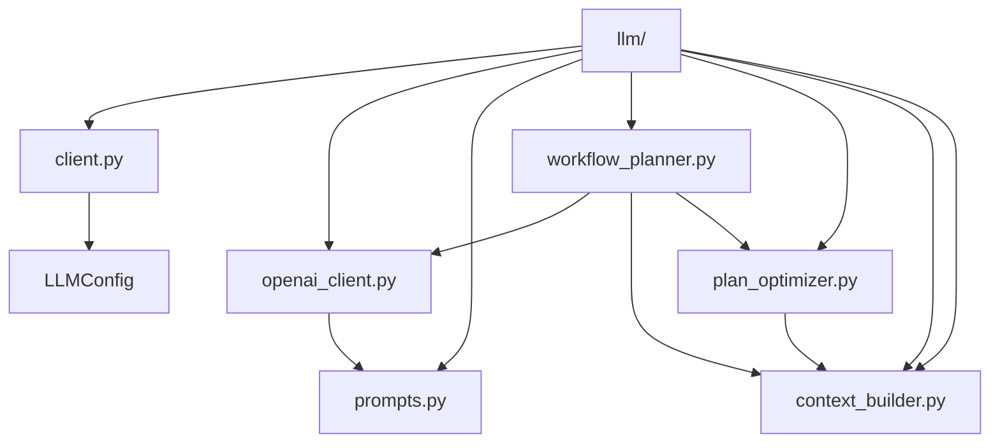
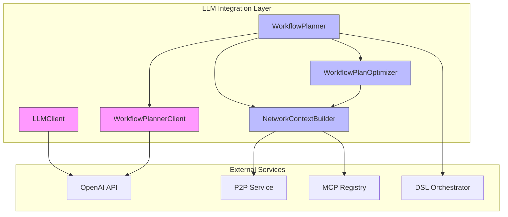
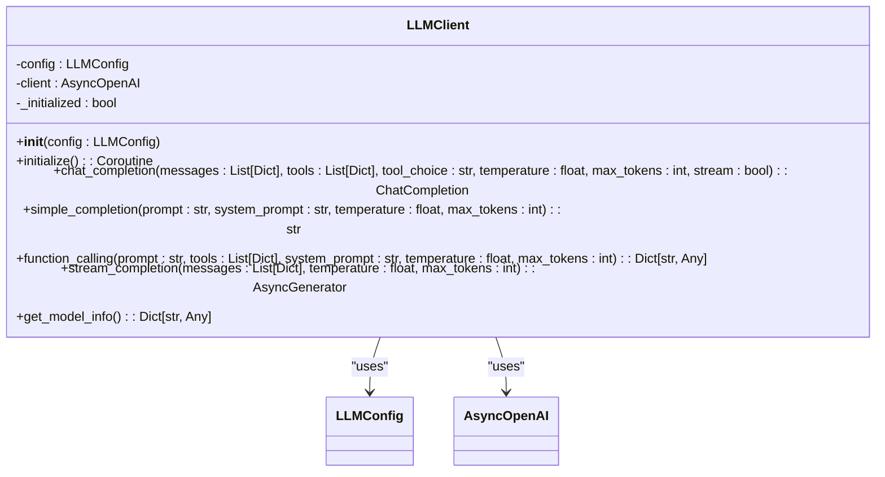
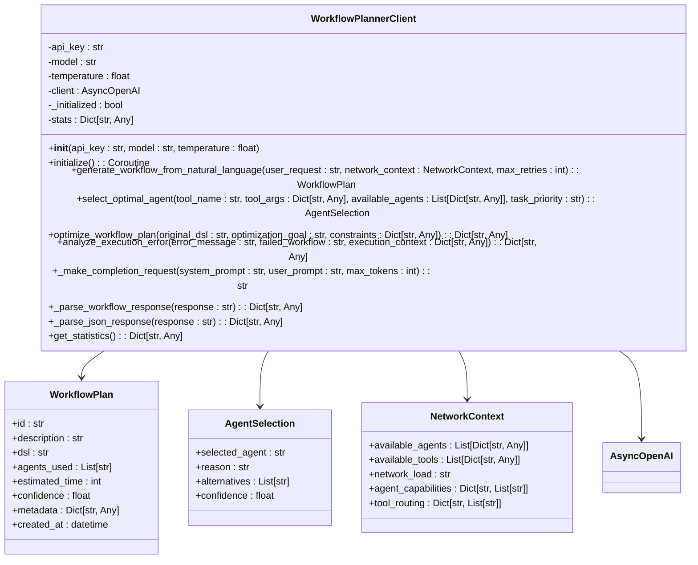
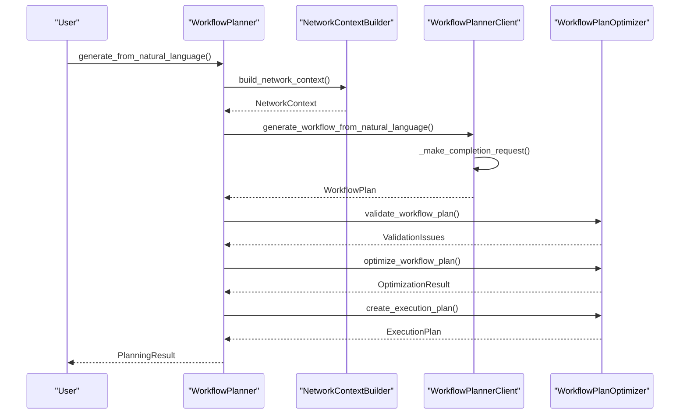
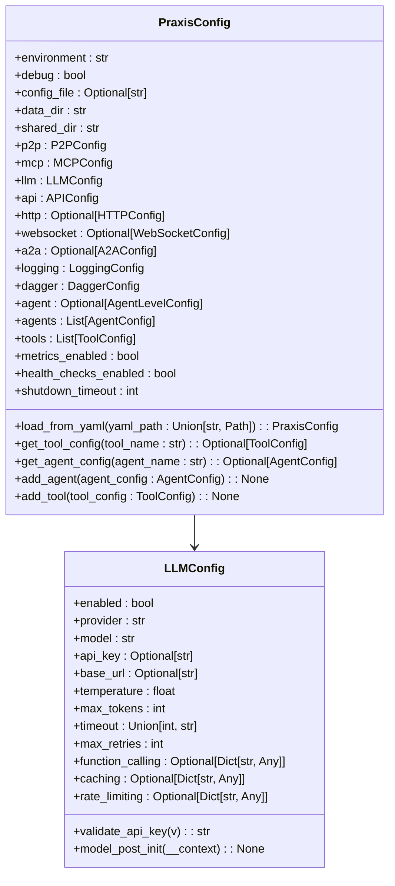
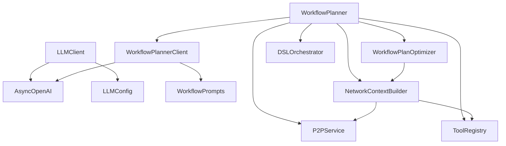

# LLM Client Integration and Provider Support

## Table of Contents
1. [Introduction](#introduction)
2. [Project Structure](#project-structure)
3. [Core Components](#core-components)
4. [Architecture Overview](#architecture-overview)
5. [Detailed Component Analysis](#detailed-component-analysis)
6. [Dependency Analysis](#dependency-analysis)
7. [Performance Considerations](#performance-considerations)
8. [Troubleshooting Guide](#troubleshooting-guide)
9. [Conclusion](#conclusion)

## Introduction
This document provides comprehensive documentation for the LLM client integration layer in the Praxis Python SDK. It details the abstract client interface, its OpenAI implementation, configuration parameters, error handling, and extensibility for multi-provider support. The system enables natural language to executable workflow conversion through intelligent planning, optimization, and execution.

## Project Structure
The LLM integration components are organized within the `src/praxis_sdk/llm` directory, following a modular architecture that separates concerns between client interfaces, specialized planners, context management, and optimization logic.

**Diagram sources**
- [src/praxis_sdk/llm/client.py](file://src/praxis_sdk/llm/client.py)
- [src/praxis_sdk/llm/openai_client.py](file://src/praxis_sdk/llm/openai_client.py)
- [src/praxis_sdk/llm/workflow_planner.py](file://src/praxis_sdk/llm/workflow_planner.py)
- [src/praxis_sdk/llm/plan_optimizer.py](file://src/praxis_sdk/llm/plan_optimizer.py)
- [src/praxis_sdk/llm/context_builder.py](file://src/praxis_sdk/llm/context_builder.py)

**Section sources**
- [src/praxis_sdk/llm/client.py](file://src/praxis_sdk/llm/client.py)
- [src/praxis_sdk/llm/openai_client.py](file://src/praxis_sdk/llm/openai_client.py)

## Core Components
The LLM integration layer consists of several core components that work together to provide intelligent workflow planning and execution capabilities. The primary components include the base LLM client, specialized workflow planner, context builder, and plan optimizer.

The `LLMClient` provides a generic interface for LLM interactions with support for chat completions, function calling, and streaming. The `WorkflowPlannerClient` specializes in workflow generation and optimization using OpenAI's API. The `NetworkContextBuilder` gathers network-wide information about available agents and tools, while the `WorkflowPlanner` orchestrates the entire planning process.

**Section sources**
- [src/praxis_sdk/llm/client.py](file://src/praxis_sdk/llm/client.py#L1-L297)
- [src/praxis_sdk/llm/openai_client.py](file://src/praxis_sdk/llm/openai_client.py#L1-L481)
- [src/praxis_sdk/llm/workflow_planner.py](file://src/praxis_sdk/llm/workflow_planner.py#L1-L491)

## Architecture Overview
The LLM client architecture follows a layered approach with clear separation between the client interface, specialized planners, and supporting services. The system integrates with the P2P network and MCP registry to gather context for intelligent workflow planning.

**Diagram sources**
- [src/praxis_sdk/llm/client.py](file://src/praxis_sdk/llm/client.py)
- [src/praxis_sdk/llm/openai_client.py](file://src/praxis_sdk/llm/openai_client.py)
- [src/praxis_sdk/llm/workflow_planner.py](file://src/praxis_sdk/llm/workflow_planner.py)
- [src/praxis_sdk/llm/plan_optimizer.py](file://src/praxis_sdk/llm/plan_optimizer.py)
- [src/praxis_sdk/llm/context_builder.py](file://src/praxis_sdk/llm/context_builder.py)
- [src/praxis_sdk/p2p/service.py](file://src/praxis_sdk/p2p/service.py)
- [src/praxis_sdk/mcp/registry.py](file://src/praxis_sdk/mcp/registry.py)
- [src/praxis_sdk/dsl/orchestrator.py](file://src/praxis_sdk/dsl/orchestrator.py)

## Detailed Component Analysis

### LLM Client Analysis
The `LLMClient` class provides a robust interface for interacting with LLM providers, currently focused on OpenAI. It handles initialization, configuration, and various completion patterns.

**Diagram sources**
- [src/praxis_sdk/llm/client.py](file://src/praxis_sdk/llm/client.py#L15-L297)

**Section sources**
- [src/praxis_sdk/llm/client.py](file://src/praxis_sdk/llm/client.py#L15-L297)

### Workflow Planner Client Analysis
The `WorkflowPlannerClient` specializes in generating and optimizing workflow plans from natural language requests. It uses structured prompts and JSON responses to ensure reliable output.

**Diagram sources**
- [src/praxis_sdk/llm/openai_client.py](file://src/praxis_sdk/llm/openai_client.py#L15-L481)

**Section sources**
- [src/praxis_sdk/llm/openai_client.py](file://src/praxis_sdk/llm/openai_client.py#L15-L481)

### Workflow Planning Process
The workflow planning process involves multiple steps from natural language input to executable DSL output, with optimization and validation.

**Diagram sources**
- [src/praxis_sdk/llm/workflow_planner.py](file://src/praxis_sdk/llm/workflow_planner.py#L15-L491)
- [src/praxis_sdk/llm/context_builder.py](file://src/praxis_sdk/llm/context_builder.py#L15-L609)
- [src/praxis_sdk/llm/plan_optimizer.py](file://src/praxis_sdk/llm/plan_optimizer.py#L15-L738)

**Section sources**
- [src/praxis_sdk/llm/workflow_planner.py](file://src/praxis_sdk/llm/workflow_planner.py#L15-L491)

### Configuration System
The LLM configuration system provides flexible settings for API keys, models, and performance parameters.

**Diagram sources**
- [src/praxis_sdk/config.py](file://src/praxis_sdk/config.py#L15-L412)

**Section sources**
- [src/praxis_sdk/config.py](file://src/praxis_sdk/config.py#L15-L412)

## Dependency Analysis
The LLM integration layer has well-defined dependencies on external services and internal components. The dependency graph shows the relationships between components.

**Diagram sources**
- [src/praxis_sdk/llm/client.py](file://src/praxis_sdk/llm/client.py)
- [src/praxis_sdk/llm/openai_client.py](file://src/praxis_sdk/llm/openai_client.py)
- [src/praxis_sdk/llm/workflow_planner.py](file://src/praxis_sdk/llm/workflow_planner.py)
- [src/praxis_sdk/llm/plan_optimizer.py](file://src/praxis_sdk/llm/plan_optimizer.py)
- [src/praxis_sdk/llm/context_builder.py](file://src/praxis_sdk/llm/context_builder.py)
- [src/praxis_sdk/p2p/service.py](file://src/praxis_sdk/p2p/service.py)
- [src/praxis_sdk/mcp/registry.py](file://src/praxis_sdk/mcp/registry.py)
- [src/praxis_sdk/dsl/orchestrator.py](file://src/praxis_sdk/dsl/orchestrator.py)

**Section sources**
- [src/praxis_sdk/llm/client.py](file://src/praxis_sdk/llm/client.py)
- [src/praxis_sdk/llm/openai_client.py](file://src/praxis_sdk/llm/openai_client.py)
- [src/praxis_sdk/llm/workflow_planner.py](file://src/praxis_sdk/llm/workflow_planner.py)
- [src/praxis_sdk/llm/plan_optimizer.py](file://src/praxis_sdk/llm/plan_optimizer.py)
- [src/praxis_sdk/llm/context_builder.py](file://src/praxis_sdk/llm/context_builder.py)

## Performance Considerations
The LLM client implementation includes several performance optimizations:

- **Connection Reuse**: The AsyncOpenAI client maintains persistent connections
- **Caching**: Network context is cached for 5 minutes to reduce discovery overhead
- **Streaming**: Support for streaming responses reduces latency for long completions
- **Batching**: Multiple network queries are executed concurrently using asyncio.gather
- **Fallback Mechanisms**: Rule-based fallback generation ensures availability when LLM is unavailable
- **Optimization**: Workflow plans are optimized for performance, reliability, and cost

The system also includes comprehensive statistics tracking for monitoring performance metrics such as processing time, success rates, and LLM usage patterns.

## Troubleshooting Guide
Common issues and their solutions:

**LLM Client Initialization Failures**
- **Symptom**: "Failed to initialize LLM client" error
- **Cause**: Invalid API key, network connectivity issues, or rate limiting
- **Solution**: Verify OPENAI_API_KEY environment variable, check network connectivity, and validate API key permissions

**Workflow Generation Failures**
- **Symptom**: "Failed to generate workflow plan" error
- **Cause**: LLM service unavailability or invalid network context
- **Solution**: Check P2P network connectivity, verify MCP registry availability, and ensure agents are online

**Tool Availability Issues**
- **Symptom**: "Tool 'tool_name' is not available" validation error
- **Solution**: Verify the tool is registered in the MCP registry and the agent hosting it is online

**Performance Problems**
- **Symptom**: Slow workflow planning or execution
- **Solution**: Check network latency between agents, verify agent load levels, and consider optimizing the workflow DSL

**Debugging Tips**
- Enable debug logging to trace LLM requests and responses
- Use `get_network_status()` to check overall network health
- Examine planning statistics via `get_statistics()` methods
- Validate DSL syntax using the built-in validation system

**Section sources**
- [src/praxis_sdk/llm/client.py](file://src/praxis_sdk/llm/client.py#L15-L297)
- [src/praxis_sdk/llm/openai_client.py](file://src/praxis_sdk/llm/openai_client.py#L15-L481)
- [src/praxis_sdk/llm/workflow_planner.py](file://src/praxis_sdk/llm/workflow_planner.py#L15-L491)
- [src/praxis_sdk/llm/plan_optimizer.py](file://src/praxis_sdk/llm/plan_optimizer.py#L15-L738)

## Conclusion
The LLM client integration layer provides a robust foundation for natural language to executable workflow conversion. The architecture separates concerns between client interfaces, specialized planners, context management, and optimization, enabling extensible and maintainable code.

Key strengths include:
- Comprehensive configuration system with environment variable support
- Robust error handling and fallback mechanisms
- Extensive logging and monitoring capabilities
- Modular design that supports multi-provider extensibility
- Intelligent workflow optimization based on performance, reliability, and cost goals

The system effectively bridges natural language requests with executable workflows through a sophisticated planning process that considers network context, agent capabilities, and optimization objectives.

**Referenced Files in This Document**   
- [client.py](file://src/praxis_sdk/llm/client.py)
- [openai_client.py](file://src/praxis_sdk/llm/openai_client.py)
- [config.py](file://src/praxis_sdk/config.py)
- [prompts.py](file://src/praxis_sdk/llm/prompts.py)
- [workflow_planner.py](file://src/praxis_sdk/llm/workflow_planner.py)
- [plan_optimizer.py](file://src/praxis_sdk/llm/plan_optimizer.py)
- [context_builder.py](file://src/praxis_sdk/llm/context_builder.py)