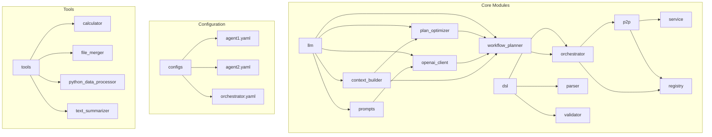
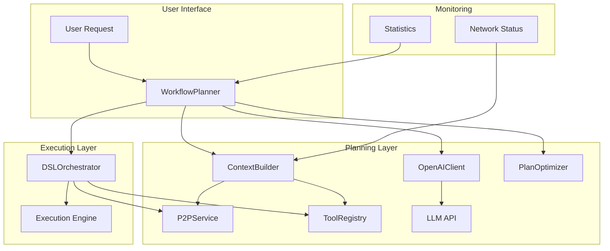
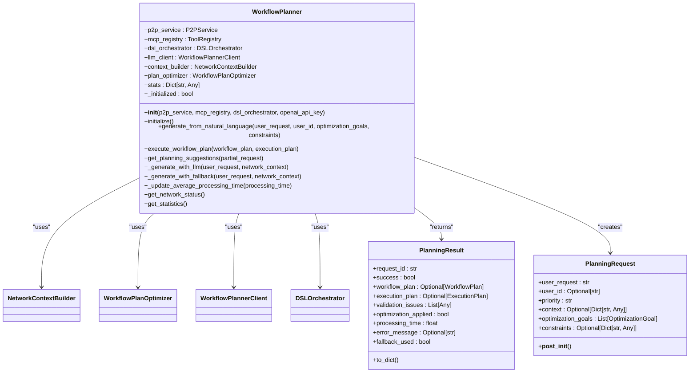
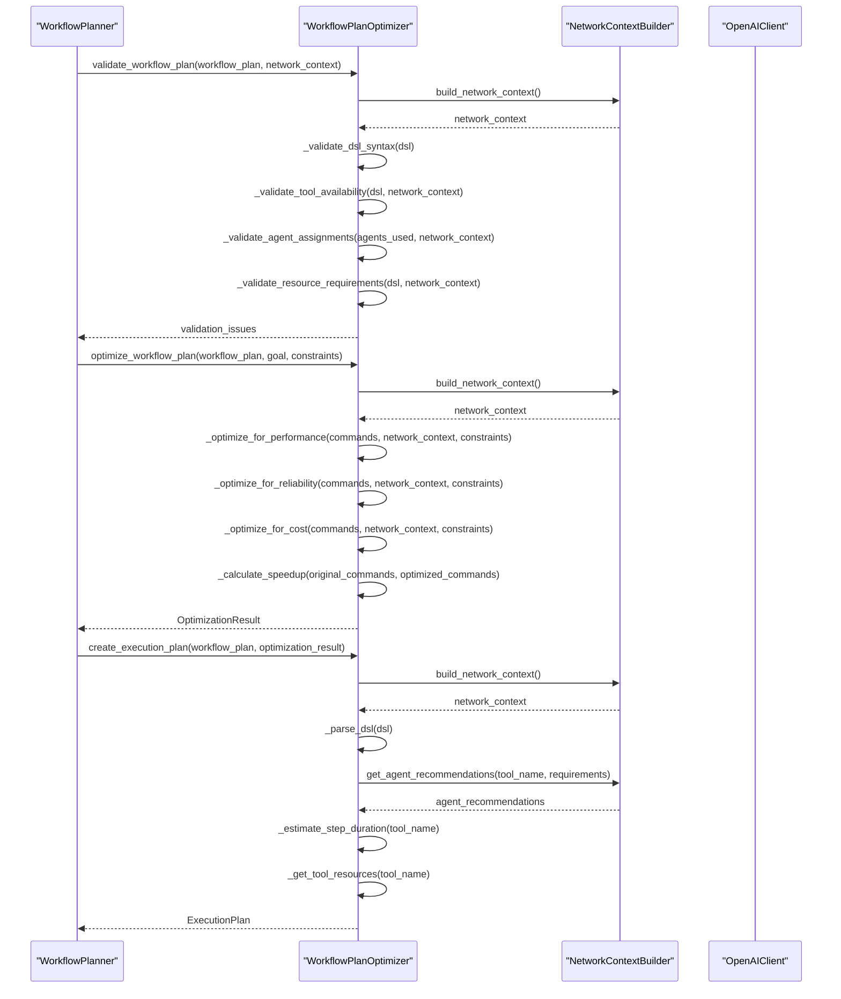
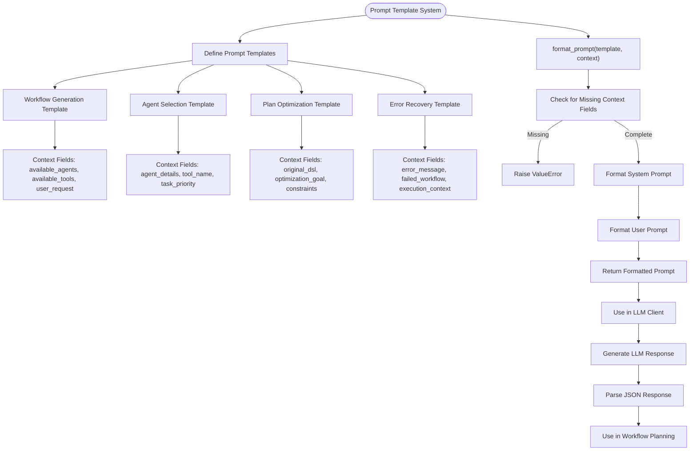
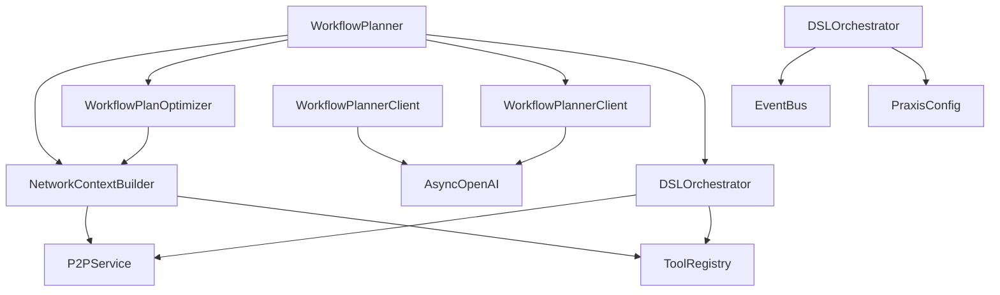
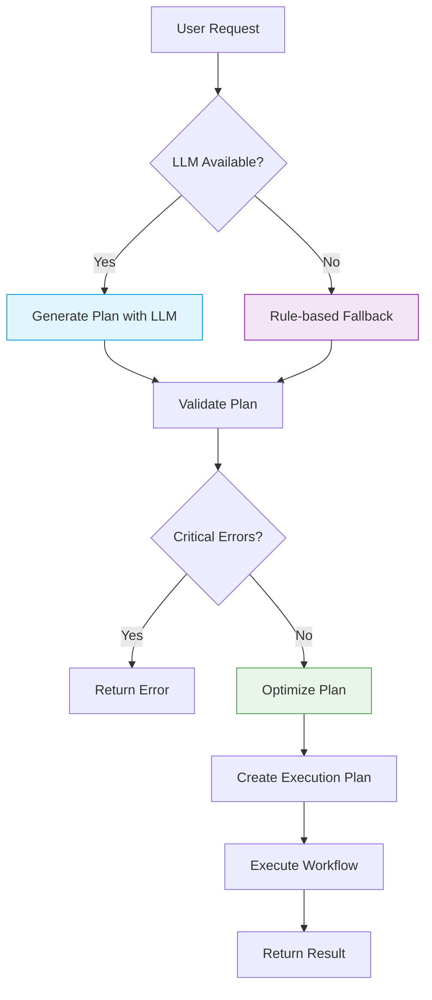

# Workflow Planning with LLMs

## Table of Contents
1. [Introduction](#introduction)
2. [Project Structure](#project-structure)
3. [Core Components](#core-components)
4. [Architecture Overview](#architecture-overview)
5. [Detailed Component Analysis](#detailed-component-analysis)
6. [Dependency Analysis](#dependency-analysis)
7. [Performance Considerations](#performance-considerations)
8. [Troubleshooting Guide](#troubleshooting-guide)
9. [Conclusion](#conclusion)

## Introduction
This document provides a comprehensive analysis of the LLM-powered workflow planning system in the Praxis Py SDK. The system enables natural language requests to be converted into executable Domain Specific Language (DSL) workflows through intelligent planning, optimization, and orchestration. It leverages large language models (LLMs) for intent understanding, task decomposition, tool selection, and dependency resolution. The architecture integrates with a distributed peer-to-peer (P2P) agent network, allowing dynamic discovery of available tools and agents across the network. This documentation details the implementation of the workflow planner, its interaction with the DSL orchestrator, optimization strategies, error handling, and performance characteristics.

## Project Structure
The project follows a modular structure with clear separation of concerns. The core functionality resides in the `src/praxis_sdk` directory, which contains specialized modules for LLM integration, DSL processing, P2P communication, and workflow execution.

**Diagram sources**
- [workflow_planner.py](file://src/praxis_sdk/llm/workflow_planner.py#L1-L490)
- [orchestrator.py](file://src/praxis_sdk/dsl/orchestrator.py#L1-L799)
- [context_builder.py](file://src/praxis_sdk/llm/context_builder.py#L1-L200)

**Section sources**
- [workflow_planner.py](file://src/praxis_sdk/llm/workflow_planner.py#L1-L490)
- [orchestrator.py](file://src/praxis_sdk/dsl/orchestrator.py#L1-L799)

## Core Components
The workflow planning system consists of several interconnected components that work together to convert natural language requests into executable workflows. The main components include the WorkflowPlanner, DSLOrchestrator, PlanOptimizer, OpenAIClient, and ContextBuilder. These components collaborate to handle natural language understanding, network context building, workflow generation, optimization, validation, and execution.

**Section sources**
- [workflow_planner.py](file://src/praxis_sdk/llm/workflow_planner.py#L1-L490)
- [plan_optimizer.py](file://src/praxis_sdk/llm/plan_optimizer.py#L1-L737)
- [openai_client.py](file://src/praxis_sdk/llm/openai_client.py#L1-L480)

## Architecture Overview
The workflow planning system follows a layered architecture that separates concerns and enables extensibility. The system begins with natural language input from the user, which is processed by the WorkflowPlanner. The planner uses the ContextBuilder to gather information about available agents and tools in the network. It then leverages the OpenAIClient to generate a workflow plan using LLM-powered reasoning. The generated plan is optimized and validated by the PlanOptimizer before being executed by the DSLOrchestrator.

**Diagram sources**
- [workflow_planner.py](file://src/praxis_sdk/llm/workflow_planner.py#L1-L490)
- [orchestrator.py](file://src/praxis_sdk/dsl/orchestrator.py#L1-L799)
- [context_builder.py](file://src/praxis_sdk/llm/context_builder.py#L1-L200)

## Detailed Component Analysis

### Workflow Planner Analysis
The WorkflowPlanner class is the central component responsible for converting natural language requests into executable DSL workflows. It coordinates the entire planning process, from context gathering to plan generation, optimization, and execution.

#### Class Diagram

**Diagram sources**
- [workflow_planner.py](file://src/praxis_sdk/llm/workflow_planner.py#L1-L490)

**Section sources**
- [workflow_planner.py](file://src/praxis_sdk/llm/workflow_planner.py#L1-L490)

### Plan Optimizer Analysis
The PlanOptimizer component is responsible for validating, optimizing, and creating execution plans for workflow plans. It ensures that generated workflows are syntactically correct, feasible given the current network context, and optimized for performance, reliability, or cost based on specified goals.

#### Sequence Diagram

**Diagram sources**
- [plan_optimizer.py](file://src/praxis_sdk/llm/plan_optimizer.py#L1-L737)

**Section sources**
- [plan_optimizer.py](file://src/praxis_sdk/llm/plan_optimizer.py#L1-L737)

### Prompt System Analysis
The prompt system provides structured templates for various LLM interactions, ensuring consistent and effective communication with the language model for different planning tasks. The system includes templates for workflow generation, agent selection, plan optimization, and error recovery.

#### Flowchart

**Diagram sources**
- [prompts.py](file://src/praxis_sdk/llm/prompts.py#L1-L303)

**Section sources**
- [prompts.py](file://src/praxis_sdk/llm/prompts.py#L1-L303)

## Dependency Analysis
The workflow planning system has a well-defined dependency structure that enables modularity and testability. The core dependencies flow from the WorkflowPlanner to supporting components like the ContextBuilder, PlanOptimizer, and OpenAIClient. These components in turn depend on lower-level services like the P2PService and ToolRegistry for network discovery and tool management.

**Diagram sources**
- [workflow_planner.py](file://src/praxis_sdk/llm/workflow_planner.py#L1-L490)
- [context_builder.py](file://src/praxis_sdk/llm/context_builder.py#L1-L200)
- [plan_optimizer.py](file://src/praxis_sdk/llm/plan_optimizer.py#L1-L737)
- [openai_client.py](file://src/praxis_sdk/llm/openai_client.py#L1-L480)
- [orchestrator.py](file://src/praxis_sdk/dsl/orchestrator.py#L1-L799)

**Section sources**
- [workflow_planner.py](file://src/praxis_sdk/llm/workflow_planner.py#L1-L490)
- [context_builder.py](file://src/praxis_sdk/llm/context_builder.py#L1-L200)
- [plan_optimizer.py](file://src/praxis_sdk/llm/plan_optimizer.py#L1-L737)

## Performance Considerations
The workflow planning system is designed with performance in mind, balancing the need for intelligent planning with execution efficiency. The system implements several performance optimizations, including caching, fallback mechanisms, and asynchronous processing.

The planning process involves multiple steps that contribute to overall latency: network context building, LLM inference, plan validation, and optimization. The system mitigates these latencies through asynchronous operations and intelligent fallbacks. When the LLM service is unavailable or fails, the system falls back to rule-based planning, ensuring continued operation.

Token usage is optimized by carefully crafting prompt templates that provide sufficient context without unnecessary verbosity. The system also implements retry logic with exponential backoff for failed LLM requests, preventing cascading failures during temporary service disruptions.

The PlanOptimizer analyzes workflows for potential bottlenecks and suggests improvements for performance, reliability, and cost. It estimates execution timelines and resource requirements, helping to prevent overloading of network agents.

**Diagram sources**
- [workflow_planner.py](file://src/praxis_sdk/llm/workflow_planner.py#L1-L490)
- [plan_optimizer.py](file://src/praxis_sdk/llm/plan_optimizer.py#L1-L737)

## Troubleshooting Guide
The workflow planning system includes comprehensive error handling and troubleshooting capabilities to ensure robust operation in various scenarios.

### Error Handling Strategies
The system handles invalid or ambiguous requests through multiple mechanisms:

1. **Validation**: The PlanOptimizer validates workflow plans for syntax correctness and tool availability, identifying issues before execution.
2. **Fallback Mechanisms**: When LLM-based planning fails, the system falls back to rule-based planning using keyword matching.
3. **Error Recovery**: The system can analyze execution errors and suggest recovery strategies.

Common issues and their solutions:

- **LLM Service Unavailable**: The system automatically falls back to rule-based planning. Ensure the OpenAI API key is configured correctly.
- **Tool Not Available**: The validation process identifies missing tools and suggests alternatives. Verify that required tools are registered in the ToolRegistry.
- **Network Discovery Issues**: The ContextBuilder handles P2P discovery failures by falling back to local tools. Check P2P service connectivity.
- **Syntax Errors in DSL**: The PlanOptimizer detects and reports DSL syntax issues, helping users correct their requests.

### Configuration Options
The planning behavior can be controlled through several configuration options:

- **Planning Depth**: Controlled by the optimization goals parameter, allowing users to specify whether to prioritize performance, reliability, or cost.
- **Creativity**: Influenced by the LLM temperature setting, with lower values producing more deterministic outputs.
- **Tool Constraints**: Users can specify constraints to limit tool selection or execution parameters.

**Section sources**
- [workflow_planner.py](file://src/praxis_sdk/llm/workflow_planner.py#L1-L490)
- [plan_optimizer.py](file://src/praxis_sdk/llm/plan_optimizer.py#L1-L737)
- [openai_client.py](file://src/praxis_sdk/llm/openai_client.py#L1-L480)

## Conclusion
The LLM-powered workflow planning system in the Praxis Py SDK provides a sophisticated framework for converting natural language requests into executable workflows. By leveraging large language models, the system enables users to interact with complex distributed systems using simple, intuitive language. The architecture combines intelligent planning with robust execution, validation, and optimization capabilities.

Key strengths of the system include its modular design, comprehensive error handling, and ability to operate in both connected and degraded modes. The integration with a P2P agent network allows for dynamic discovery of capabilities across distributed systems, enabling flexible and scalable workflow execution.

The system demonstrates a practical application of LLMs in workflow automation, balancing the power of AI with the need for reliability and predictability in production environments. Future enhancements could include support for parallel execution, more sophisticated optimization strategies, and enhanced user feedback mechanisms.

**Referenced Files in This Document**   
- [workflow_planner.py](file://src/praxis_sdk/llm/workflow_planner.py#L1-L490)
- [prompts.py](file://src/praxis_sdk/llm/prompts.py#L1-L303)
- [plan_optimizer.py](file://src/praxis_sdk/llm/plan_optimizer.py#L1-L737)
- [openai_client.py](file://src/praxis_sdk/llm/openai_client.py#L1-L480)
- [context_builder.py](file://src/praxis_sdk/llm/context_builder.py#L1-L200)
- [orchestrator.py](file://src/praxis_sdk/dsl/orchestrator.py#L1-L799)