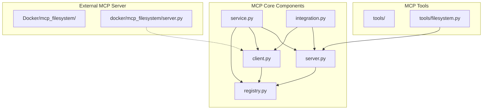
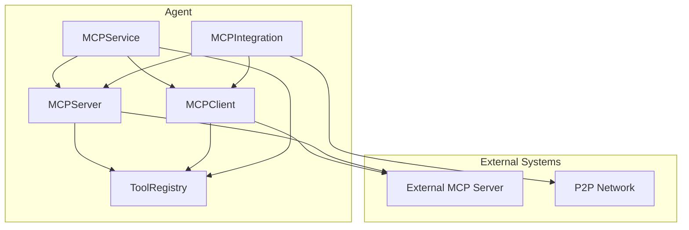
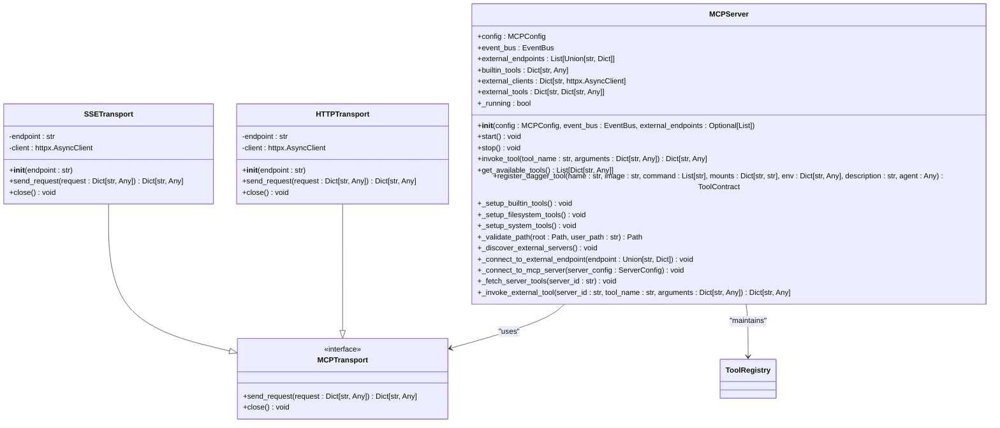
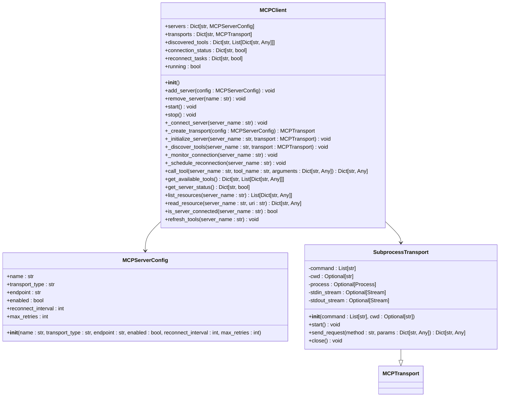
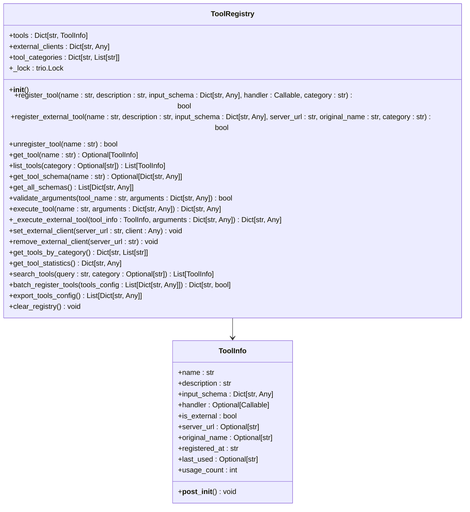
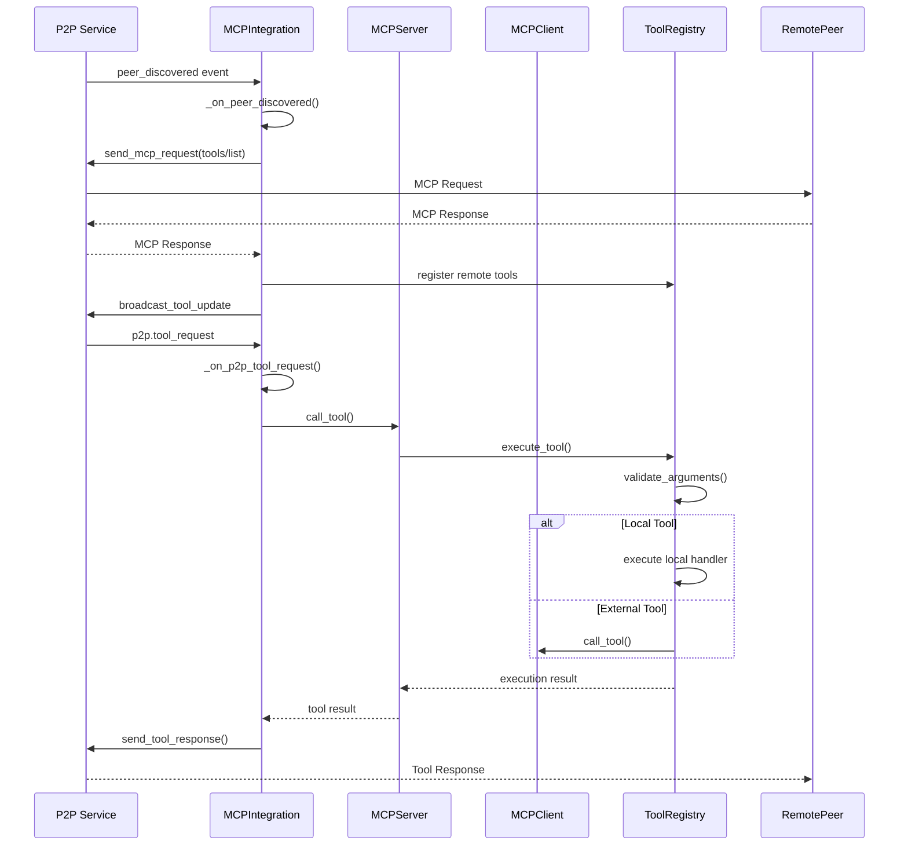
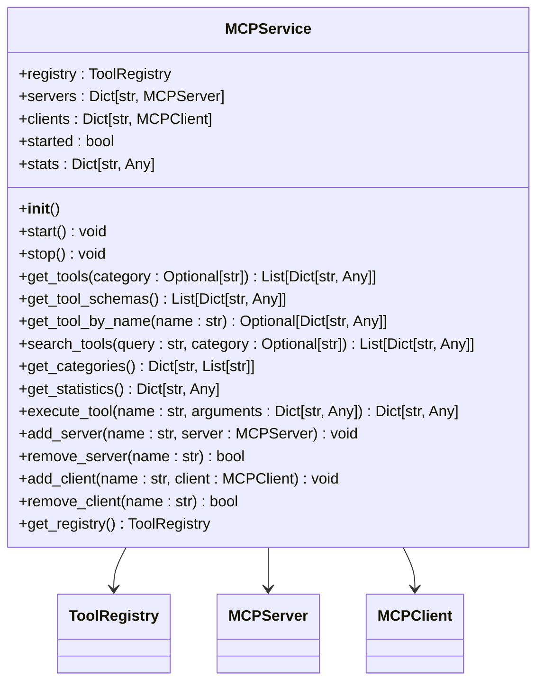
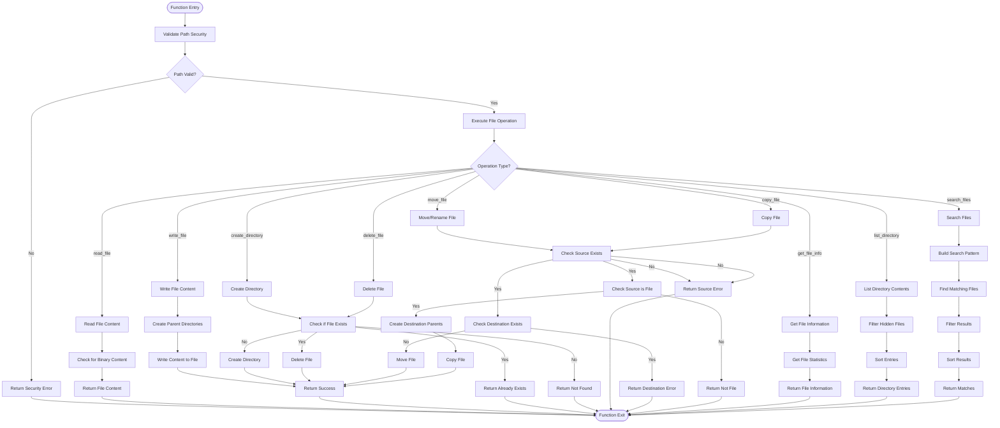
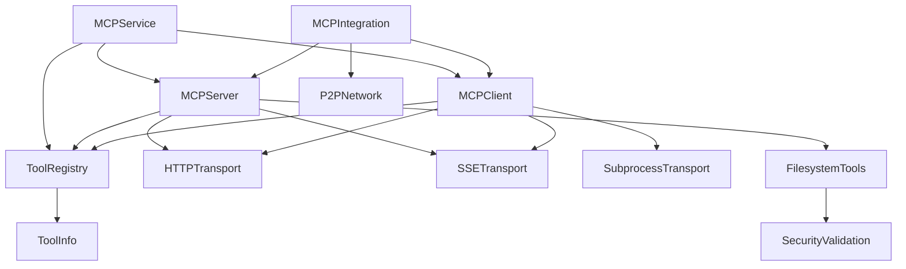

# MCP Integration

## Table of Contents
1. [Introduction](#introduction)
2. [Project Structure](#project-structure)
3. [Core Components](#core-components)
4. [Architecture Overview](#architecture-overview)
5. [Detailed Component Analysis](#detailed-component-analysis)
6. [Dependency Analysis](#dependency-analysis)
7. [Performance Considerations](#performance-considerations)
8. [Troubleshooting Guide](#troubleshooting-guide)
9. [Conclusion](#conclusion)

## Introduction
The Model Context Protocol (MCP) integration enables tools to expose their capabilities to Large Language Models (LLMs) and intelligent agents. This document provides a comprehensive analysis of the MCP implementation within the Praxis SDK, detailing how the system exposes tool metadata, handles execution requests, manages client-server communication, and integrates with workflow orchestration systems. The implementation supports both local tool execution and discovery of external MCP servers, providing a unified interface for tool capability discovery and invocation.

## Project Structure
The MCP implementation is organized within the `src/praxis_sdk/mcp` directory, with supporting components in the `docker/mcp_filesystem` directory for external server examples. The structure follows a modular design pattern with clear separation of concerns between server, client, registry, and integration components.

**Diagram sources**
- [server.py](file://src/praxis_sdk/mcp/server.py)
- [client.py](file://src/praxis_sdk/mcp/client.py)
- [registry.py](file://src/praxis_sdk/mcp/registry.py)
- [service.py](file://src/praxis_sdk/mcp/service.py)
- [integration.py](file://src/praxis_sdk/mcp/integration.py)
- [filesystem.py](file://src/praxis_sdk/mcp/tools/filesystem.py)
- [docker/mcp_filesystem/server.py](file://docker/mcp_filesystem/server.py)

**Section sources**
- [server.py](file://src/praxis_sdk/mcp/server.py)
- [client.py](file://src/praxis_sdk/mcp/client.py)
- [registry.py](file://src/praxis_sdk/mcp/registry.py)
- [service.py](file://src/praxis_sdk/mcp/service.py)
- [integration.py](file://src/praxis_sdk/mcp/integration.py)
- [filesystem.py](file://src/praxis_sdk/mcp/tools/filesystem.py)
- [docker/mcp_filesystem/server.py](file://docker/mcp_filesystem/server.py)

## Core Components
The MCP integration consists of several core components that work together to provide tool discovery, registration, and execution capabilities. The `MCPServer` class exposes local tools to LLMs and agents, while the `MCPClient` discovers and connects to external MCP servers. The `ToolRegistry` maintains a central repository of all available tools, and the `MCPService` provides a high-level interface for tool discovery and execution. The `MCPIntegration` class coordinates between MCP components and the P2P protocol for distributed tool invocation.

**Section sources**
- [server.py](file://src/praxis_sdk/mcp/server.py)
- [client.py](file://src/praxis_sdk/mcp/client.py)
- [registry.py](file://src/praxis_sdk/mcp/registry.py)
- [service.py](file://src/praxis_sdk/mcp/service.py)
- [integration.py](file://src/praxis_sdk/mcp/integration.py)

## Architecture Overview
The MCP architecture follows a client-server model with a central registry that maintains information about all available tools, both local and external. The MCPServer exposes built-in tools and connects to external MCP servers, while the MCPClient discovers and manages connections to external servers. The ToolRegistry provides a unified interface for tool discovery and execution, and the MCPService exposes these capabilities through HTTP endpoints. The MCPIntegration component bridges the MCP functionality with the P2P network for distributed agent communication.

**Diagram sources**
- [server.py](file://src/praxis_sdk/mcp/server.py)
- [client.py](file://src/praxis_sdk/mcp/client.py)
- [registry.py](file://src/praxis_sdk/mcp/registry.py)
- [service.py](file://src/praxis_sdk/mcp/service.py)
- [integration.py](file://src/praxis_sdk/mcp/integration.py)

## Detailed Component Analysis

### MCPServer Analysis
The MCPServer class serves as the primary interface for exposing tool capabilities to LLMs and agents. It manages both built-in tools and connections to external MCP servers, providing a unified API for tool discovery and execution.

#### MCPServer Class Diagram

**Diagram sources**
- [server.py](file://src/praxis_sdk/mcp/server.py#L15-L983)

**Section sources**
- [server.py](file://src/praxis_sdk/mcp/server.py#L15-L983)

### MCPClient Analysis
The MCPClient class provides functionality for connecting to external MCP servers, discovering available tools, and invoking them remotely. It supports multiple transport mechanisms and includes automatic reconnection logic for robust operation.

#### MCPClient Class Diagram

**Diagram sources**
- [client.py](file://src/praxis_sdk/mcp/client.py#L15-L392)

**Section sources**
- [client.py](file://src/praxis_sdk/mcp/client.py#L15-L392)

### ToolRegistry Analysis
The ToolRegistry class serves as the central repository for all MCP tools, both local and external. It manages tool registration, schema validation, and execution coordination, providing a unified interface for tool discovery and invocation.

#### ToolRegistry Class Diagram

**Diagram sources**
- [registry.py](file://src/praxis_sdk/mcp/registry.py#L15-L463)

**Section sources**
- [registry.py](file://src/praxis_sdk/mcp/registry.py#L15-L463)

### MCPIntegration Analysis
The MCPIntegration class provides the bridge between MCP functionality and the P2P network, enabling distributed tool invocation across agents. It coordinates between the MCPServer, MCPClient, and P2P service to provide seamless tool discovery and execution.

#### MCPIntegration Sequence Diagram

**Diagram sources**
- [integration.py](file://src/praxis_sdk/mcp/integration.py#L15-L480)

**Section sources**
- [integration.py](file://src/praxis_sdk/mcp/integration.py#L15-L480)

### MCPService Analysis
The MCPService class provides a high-level interface to MCP functionality, exposing tools discovery, statistics, and execution capabilities through a simple API. It serves as the primary interface for HTTP endpoint integration.

#### MCPService Class Diagram

**Diagram sources**
- [service.py](file://src/praxis_sdk/mcp/service.py#L15-L284)

**Section sources**
- [service.py](file://src/praxis_sdk/mcp/service.py#L15-L284)

### Filesystem Tools Analysis
The filesystem.py module implements MCP-compliant tools for filesystem operations with security validation and integration with the shared directory system. These tools provide basic file operations while enforcing security constraints.

#### Filesystem Tools Flowchart

**Diagram sources**
- [filesystem.py](file://src/praxis_sdk/mcp/tools/filesystem.py#L15-L679)

**Section sources**
- [filesystem.py](file://src/praxis_sdk/mcp/tools/filesystem.py#L15-L679)

## Dependency Analysis
The MCP components have a well-defined dependency structure that enables modular development and testing. The core dependencies flow from the service layer down to the implementation details, with proper separation of concerns.

**Diagram sources**
- [server.py](file://src/praxis_sdk/mcp/server.py)
- [client.py](file://src/praxis_sdk/mcp/client.py)
- [registry.py](file://src/praxis_sdk/mcp/registry.py)
- [service.py](file://src/praxis_sdk/mcp/service.py)
- [integration.py](file://src/praxis_sdk/mcp/integration.py)
- [filesystem.py](file://src/praxis_sdk/mcp/tools/filesystem.py)

**Section sources**
- [server.py](file://src/praxis_sdk/mcp/server.py)
- [client.py](file://src/praxis_sdk/mcp/client.py)
- [registry.py](file://src/praxis_sdk/mcp/registry.py)
- [service.py](file://src/praxis_sdk/mcp/service.py)
- [integration.py](file://src/praxis_sdk/mcp/integration.py)
- [filesystem.py](file://src/praxis_sdk/mcp/tools/filesystem.py)

## Performance Considerations
The MCP implementation includes several performance considerations to ensure efficient operation in distributed environments. The system uses asynchronous I/O for all network operations, preventing blocking during tool execution and server communication. Connection pooling is implemented through the use of persistent HTTP clients, reducing the overhead of establishing new connections for each request. The tool registry maintains an in-memory cache of available tools, eliminating the need for repeated discovery operations. For filesystem operations, the implementation includes size limits and binary file detection to prevent excessive resource consumption. The P2P integration uses event-driven architecture to minimize polling and reduce network traffic. Error handling is designed to be non-blocking, allowing the system to continue operating even when individual tool invocations fail.

## Troubleshooting Guide
Common issues with MCP integration typically fall into several categories: connectivity problems, tool discovery failures, and execution errors. For connectivity issues, verify that external MCP servers are running and accessible from the agent environment. Check firewall settings and network configuration, particularly when running in containerized environments. For tool discovery failures, ensure that the MCP server has been properly initialized and that the external endpoints are correctly configured in the agent configuration. Execution errors may occur due to invalid arguments or security restrictions; check the logs for specific error messages and validate that the tool parameters match the expected schema. When debugging, enable verbose logging to capture detailed information about MCP requests and responses. For P2P-related issues, verify that the P2P service is running and that peers are properly discovered and connected. Use the MCP service endpoints to inspect the current state of registered tools and server connections.

**Section sources**
- [server.py](file://src/praxis_sdk/mcp/server.py)
- [client.py](file://src/praxis_sdk/mcp/client.py)
- [registry.py](file://src/praxis_sdk/mcp/registry.py)
- [service.py](file://src/praxis_sdk/mcp/service.py)
- [integration.py](file://src/praxis_sdk/mcp/integration.py)

## Conclusion
The MCP integration in the Praxis SDK provides a comprehensive framework for exposing tool capabilities to LLMs and agents. The system supports both local tool execution and discovery of external MCP servers, providing a unified interface for tool capability discovery and invocation. The modular architecture with clear separation of concerns enables flexible deployment and integration with various agent systems. Security is prioritized throughout the implementation, particularly in filesystem operations where path validation prevents directory traversal attacks. The integration with P2P protocols enables distributed agent networks to share tool capabilities seamlessly. Future enhancements could include support for additional transport mechanisms, improved error handling and recovery strategies, and enhanced security features such as authentication and authorization for tool access.

**Referenced Files in This Document**   
- [server.py](file://src/praxis_sdk/mcp/server.py)
- [client.py](file://src/praxis_sdk/mcp/client.py)
- [registry.py](file://src/praxis_sdk/mcp/registry.py)
- [integration.py](file://src/praxis_sdk/mcp/integration.py)
- [service.py](file://src/praxis_sdk/mcp/service.py)
- [filesystem.py](file://src/praxis_sdk/mcp/tools/filesystem.py)
- [docker/mcp_filesystem/server.py](file://docker/mcp_filesystem/server.py)