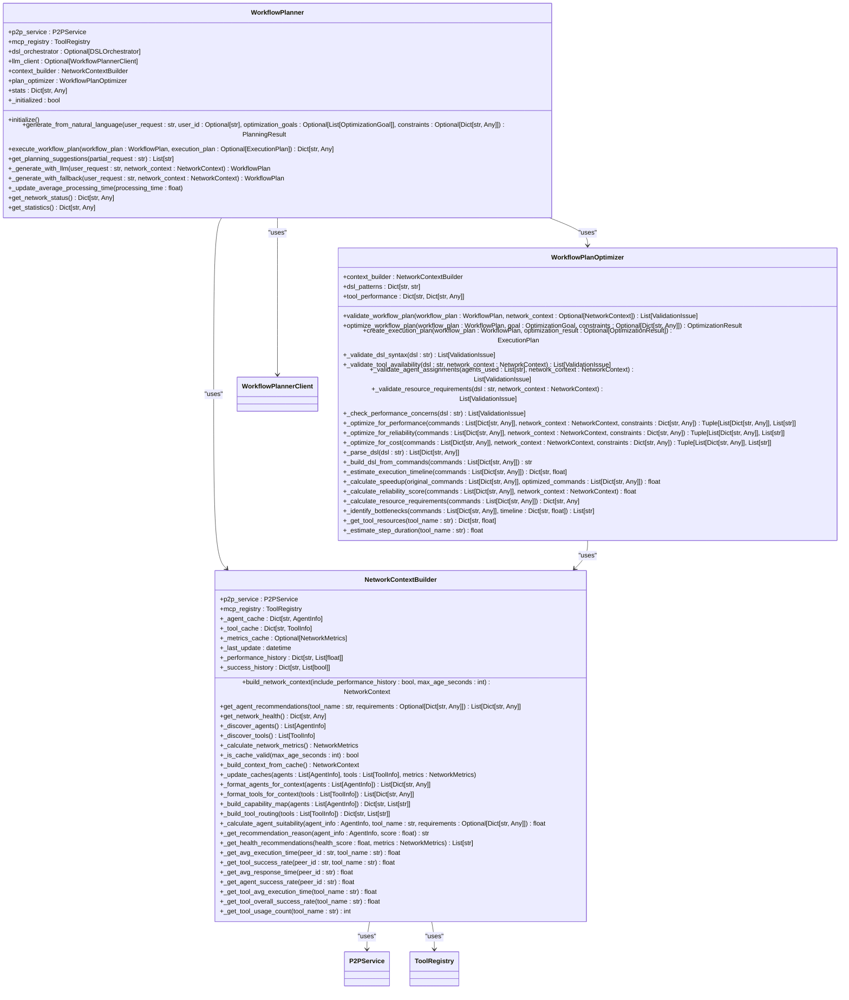

# MCP Client


## Table of Contents
1. [Introduction](#introduction)
2. [Project Structure](#project-structure)
3. [Core Components](#core-components)
4. [Architecture Overview](#architecture-overview)
5. [Detailed Component Analysis](#detailed-component-analysis)
6. [Dependency Analysis](#dependency-analysis)
7. [Performance Considerations](#performance-considerations)
8. [Troubleshooting Guide](#troubleshooting-guide)
9. [Conclusion](#conclusion)

## Introduction
The MCP Client is a core component of the Praxis SDK that enables agents to discover and interact with remote MCP servers for accessing external tools. This document provides a comprehensive analysis of the MCP Client functionality, covering client initialization, connection management, capability fetching, caching strategies, retry logic, API for invoking remote tools, integration with third-party servers, orchestration of cross-agent tool usage, integration with the LLM planner for dynamic tool selection, security practices, and performance considerations.

## Project Structure
The MCP Client functionality is organized within the `src/praxis_sdk/mcp` directory, which contains several key modules:


The structure follows a modular design with clear separation of concerns:
- `client.py`: Implements the MCPClient class for connecting to external MCP servers
- `service.py`: Provides a high-level service wrapper for MCP functionality
- `registry.py`: Manages the central registry for all MCP tools
- `server.py`: Implements the MCPServer class for local tool execution
- `integration.py`: Coordinates integration between MCP components and P2P protocols
- `tools/`: Contains specific tool implementations

**Diagram sources**
- [client.py](file://src/praxis_sdk/mcp/client.py)
- [service.py](file://src/praxis_sdk/mcp/service.py)
- [registry.py](file://src/praxis_sdk/mcp/registry.py)
- [server.py](file://src/praxis_sdk/mcp/server.py)
- [integration.py](file://src/praxis_sdk/mcp/integration.py)

**Section sources**
- [client.py](file://src/praxis_sdk/mcp/client.py)
- [service.py](file://src/praxis_sdk/mcp/service.py)
- [registry.py](file://src/praxis_sdk/mcp/registry.py)
- [server.py](file://src/praxis_sdk/mcp/server.py)
- [integration.py](file://src/praxis_sdk/mcp/integration.py)

## Core Components
The MCP Client system consists of several interconnected components that work together to enable tool discovery and execution across distributed agents:

- **MCPClient**: Manages connections to external MCP servers, handles transport protocols, and provides tool discovery and invocation capabilities
- **MCPServer**: Provides local tool execution capabilities and serves as an endpoint for other agents
- **ToolRegistry**: Central registry that manages all available tools, both local and external
- **MCPService**: High-level service wrapper that integrates MCP functionality with HTTP endpoints
- **MCPIntegration**: Coordinates MCP functionality with P2P protocols and event bus

These components work together to create a distributed system where agents can discover and invoke tools across the network, enabling complex workflows that span multiple agents and systems.

**Section sources**
- [client.py](file://src/praxis_sdk/mcp/client.py)
- [service.py](file://src/praxis_sdk/mcp/service.py)
- [registry.py](file://src/praxis_sdk/mcp/registry.py)
- [server.py](file://src/praxis_sdk/mcp/server.py)
- [integration.py](file://src/praxis_sdk/mcp/integration.py)

## Architecture Overview
The MCP Client architecture is designed to enable seamless tool discovery and execution across distributed agents. The system follows a client-server model where agents can act as both clients (consuming tools from other agents) and servers (providing tools to other agents).


The architecture enables several key capabilities:
- **Tool Discovery**: Agents can discover tools available on other agents through the MCP protocol
- **Remote Execution**: Tools can be invoked on remote agents as if they were local
- **Dynamic Registration**: Tools can be registered and unregistered at runtime
- **Cross-Agent Orchestration**: Complex workflows can be orchestrated across multiple agents
- **Event-Driven Integration**: The system integrates with an event bus for monitoring and coordination

**Diagram sources**
- [client.py](file://src/praxis_sdk/mcp/client.py)
- [service.py](file://src/praxis_sdk/mcp/service.py)
- [registry.py](file://src/praxis_sdk/mcp/registry.py)
- [server.py](file://src/praxis_sdk/mcp/server.py)
- [integration.py](file://src/praxis_sdk/mcp/integration.py)

## Detailed Component Analysis

### MCP Client Analysis
The MCPClient class is responsible for connecting to external MCP servers and managing the communication with them. It supports multiple transport protocols and provides automatic reconnection capabilities.


**Diagram sources**
- [client.py](file://src/praxis_sdk/mcp/client.py#L1-L392)

**Section sources**
- [client.py](file://src/praxis_sdk/mcp/client.py#L1-L392)

#### Client Initialization and Connection Management
The MCPClient follows a structured initialization and connection management process:


The client initialization process involves:
1. Adding server configurations via `add_server()`
2. Starting the client with `start()`
3. Connecting to each enabled server
4. Creating the appropriate transport based on configuration
5. Initializing the connection with the server
6. Discovering available tools
7. Starting connection monitoring

**Diagram sources**
- [client.py](file://src/praxis_sdk/mcp/client.py#L1-L392)

**Section sources**
- [client.py](file://src/praxis_sdk/mcp/client.py#L1-L392)

#### Tool Discovery and Capability Fetching
The MCPClient implements a robust tool discovery mechanism that fetches capabilities from remote servers:


The tool discovery process:
1. Sends a "tools/list" JSON-RPC request to the server
2. Checks for errors in the response
3. Extracts the list of tools from the response
4. Stores the tools in the `discovered_tools` dictionary
5. Logs the discovered tools for debugging

**Diagram sources**
- [client.py](file://src/praxis_sdk/mcp/client.py#L1-L392)

**Section sources**
- [client.py](file://src/praxis_sdk/mcp/client.py#L1-L392)

#### Caching Strategies and Retry Logic
The MCPClient implements sophisticated caching and retry mechanisms to handle transient failures:


The retry logic includes:
- Automatic reconnection attempts on connection failure
- Configurable retry intervals and maximum retry counts
- Background monitoring of connection health
- Prevention of duplicate reconnection tasks

**Diagram sources**
- [client.py](file://src/praxis_sdk/mcp/client.py#L1-L392)

**Section sources**
- [client.py](file://src/praxis_sdk/mcp/client.py#L1-L392)

### MCP Service Analysis
The MCPService provides a high-level interface to MCP functionality, integrating various components and providing statistics and monitoring capabilities.


**Diagram sources**
- [service.py](file://src/praxis_sdk/mcp/service.py#L1-L284)
- [registry.py](file://src/praxis_sdk/mcp/registry.py#L1-L463)

**Section sources**
- [service.py](file://src/praxis_sdk/mcp/service.py#L1-L284)
- [registry.py](file://src/praxis_sdk/mcp/registry.py#L1-L463)

#### Tool Registry and Management
The ToolRegistry is the central component for managing all MCP tools, both local and external:


The tool registration process ensures:
- Unique tool names
- Callable handlers
- Valid input schemas
- Proper categorization
- Usage statistics tracking

**Diagram sources**
- [registry.py](file://src/praxis_sdk/mcp/registry.py#L1-L463)

**Section sources**
- [registry.py](file://src/praxis_sdk/mcp/registry.py#L1-L463)

### MCP Server Analysis
The MCPServer component provides local tool execution capabilities and serves as an endpoint for other agents to connect to.


**Diagram sources**
- [server.py](file://src/praxis_sdk/mcp/server.py#L1-L983)

**Section sources**
- [server.py](file://src/praxis_sdk/mcp/server.py#L1-L983)

#### Built-in Tools and External Integration
The MCPServer supports both built-in tools and integration with external MCP servers:


The server initialization process:
1. Sets up built-in tools based on configuration
2. Starts the server
3. Discovers external servers if auto-discovery is enabled
4. Connects to configured MCP servers
5. Connects to explicitly configured external endpoints

**Diagram sources**
- [server.py](file://src/praxis_sdk/mcp/server.py#L1-L983)

**Section sources**
- [server.py](file://src/praxis_sdk/mcp/server.py#L1-L983)

### MCP Integration Analysis
The MCPIntegration component coordinates between MCP functionality and P2P protocols, enabling seamless tool invocation across the agent network.


**Diagram sources**
- [integration.py](file://src/praxis_sdk/mcp/integration.py#L1-L480)

**Section sources**
- [integration.py](file://src/praxis_sdk/mcp/integration.py#L1-L480)

#### Event-Driven Integration
The MCPIntegration uses an event-driven architecture to coordinate between components:


The event-driven integration enables:
- Automatic discovery of tools on newly connected peers
- Broadcasting of tool availability changes
- Handling of remote tool execution requests
- Coordination between MCP and P2P components

**Diagram sources**
- [integration.py](file://src/praxis_sdk/mcp/integration.py#L1-L480)

**Section sources**
- [integration.py](file://src/praxis_sdk/mcp/integration.py#L1-L480)

### LLM Integration Analysis
The MCP Client integrates with the LLM planner to enable dynamic tool selection based on natural language requests.



**Diagram sources**
- [workflow_planner.py](file://src/praxis_sdk/llm/workflow_planner.py#L1-L491)
- [context_builder.py](file://src/praxis_sdk/llm/context_builder.py#L1-L609)
- [plan_optimizer.py](file://src/praxis_sdk/llm/plan_optimizer.py#L1-L738)

**Section sources**
- [workflow_planner.py](file://src/praxis_sdk/llm/workflow_planner.py#L1-L491)
- [context_builder.py](file://src/praxis_sdk/llm/context_builder.py#L1-L609)
- [plan_optimizer.py](file://src/praxis_sdk/llm/plan_optimizer.py#L1-L738)

#### Natural Language to Tool Execution Flow
The integration between the MCP Client and LLM planner enables natural language requests to be converted into tool executions:


The natural language processing flow:
1. User submits a natural language request
2. WorkflowPlanner builds network context with available tools and agents
3. LLM generates a workflow plan (or falls back to rule-based)
4. Plan is validated and optimized
5. Execution plan is created
6. DSL Orchestrator executes the workflow
7. MCP Client/Server invokes tools (local or remote)
8. Results are returned to the user

**Diagram sources**
- [workflow_planner.py](file://src/praxis_sdk/llm/workflow_planner.py#L1-L491)
- [context_builder.py](file://src/praxis_sdk/llm/context_builder.py#L1-L609)
- [plan_optimizer.py](file://src/praxis_sdk/llm/plan_optimizer.py#L1-L738)

**Section sources**
- [workflow_planner.py](file://src/praxis_sdk/llm/workflow_planner.py#L1-L491)
- [context_builder.py](file://src/praxis_sdk/llm/context_builder.py#L1-L609)
- [plan_optimizer.py](file://src/praxis_sdk/llm/plan_optimizer.py#L1-L738)

## Dependency Analysis
The MCP Client system has a complex dependency structure that enables its distributed functionality:

```mermaid
graph TD
MCPClient --> MCPTransport
MCPTransport <|-- HTTPTransport
MCPTransport <|-- SSETransport
MCPTransport <|-- SubprocessTransport
MCPClient --> MCPServerConfig
MCPService --> ToolRegistry
MCPService --> MCPServer
MCPService --> MCPClient
ToolRegistry --> ToolInfo
MCPServer --> MCPTransport
MCPServer --> EventBus
MCPIntegration --> MCPServer
MCPIntegration --> MCPClient
MCPIntegration --> P2PService
MCPIntegration --> EventBus
WorkflowPlanner --> NetworkContextBuilder
WorkflowPlanner --> WorkflowPlanOptimizer
WorkflowPlanner --> WorkflowPlannerClient
NetworkContextBuilder --> P2PService
NetworkContextBuilder --> ToolRegistry
WorkflowPlanOptimizer --> NetworkContextBuilder
MCPClient --> ToolRegistry
MCPServer --> ToolRegistry
MCPIntegration --> ToolRegistry
WorkflowPlanner --> ToolRegistry
```

Key dependency relationships:
- **MCPClient depends on MCPTransport**: For communication with external servers
- **MCPService depends on ToolRegistry**: For tool management
- **MCPIntegration depends on P2PService**: For peer-to-peer communication
- **WorkflowPlanner depends on NetworkContextBuilder**: For network context
- **Multiple components depend on ToolRegistry**: Central tool management

**Diagram sources**
- [client.py](file://src/praxis_sdk/mcp/client.py)
- [service.py](file://src/praxis_sdk/mcp/service.py)
- [registry.py](file://src/praxis_sdk/mcp/registry.py)
- [server.py](file://src/praxis_sdk/mcp/server.py)
- [integration.py](file://src/praxis_sdk/mcp/integration.py)
- [workflow_planner.py](file://src/praxis_sdk/llm/workflow_planner.py)
- [context_builder.py](file://src/praxis_sdk/llm/context_builder.py)
- [plan_optimizer.py](file://src/praxis_sdk/llm/plan_optimizer.py)

**Section sources**
- [client.py](file://src/praxis_sdk/mcp/client.py)
- [service.py](file://src/praxis_sdk/mcp/service.py)
- [registry.py](file://src/praxis_sdk/mcp/registry.py)
- [server.py](file://src/praxis_sdk/mcp/server.py)
- [integration.py](file://src/praxis_sdk/mcp/integration.py)
- [workflow_planner.py](file://src/praxis_sdk/llm/workflow_planner.py)
- [context_builder.py](file://src/praxis_sdk/llm/context_builder.py)
- [plan_optimizer.py](file://src/praxis_sdk/llm/plan_optimizer.py)

## Performance Considerations
The MCP Client system incorporates several performance optimizations:

- **Connection Pooling**: HTTP and SSE transports use connection pooling to reduce connection overhead
- **Caching**: Network context and tool information are cached to reduce redundant queries
- **Asynchronous Execution**: All operations are implemented asynchronously using trio and asyncio
- **Batch Operations**: Multiple tool registrations can be performed in batch
- **Efficient Data Structures**: Dictionaries are used for O(1) lookups of tools and servers
- **Connection Monitoring**: Background tasks monitor connection health to enable quick recovery
- **Retry Logic**: Configurable retry intervals and maximum retries balance reliability and resource usage

The system is designed to handle transient failures gracefully while maintaining responsiveness. The use of asynchronous programming ensures that I/O operations do not block other operations, enabling high concurrency.

**Section sources**
- [client.py](file://src/praxis_sdk/mcp/client.py)
- [service.py](file://src/praxis_sdk/mcp/service.py)
- [registry.py](file://src/praxis_sdk/mcp/registry.py)
- [server.py](file://src/praxis_sdk/mcp/server.py)
- [integration.py](file://src/praxis_sdk/mcp/integration.py)

## Troubleshooting Guide
Common issues and their solutions:

1. **Connection failures to external servers**:
   - Verify the server endpoint is correct
   - Check network connectivity
   - Ensure the server is running and accessible
   - Review the transport type configuration

2. **Tool discovery not working**:
   - Verify the server supports the "tools/list" method
   - Check that the server has tools registered
   - Review server logs for errors
   - Ensure proper initialization has completed

3. **Authentication issues**:
   - Verify credentials if required
   - Check that the client info is properly configured
   - Review server authentication requirements

4. **Performance issues**:
   - Monitor connection latency
   - Check for network bottlenecks
   - Review server resource usage
   - Consider connection pooling settings

5. **Serialization errors**:
   - Verify JSON formatting
   - Check for special characters in payloads
   - Review encoding settings

**Section sources**
- [client.py](file://src/praxis_sdk/mcp/client.py)
- [server.py](file://src/praxis_sdk/mcp/server.py)

## Conclusion
The MCP Client is a sophisticated system that enables distributed agents to discover and invoke tools across a network. Its modular architecture, robust error handling, and integration with LLM planning make it a powerful component for building intelligent agent systems. The system's design emphasizes reliability, performance, and ease of integration, making it suitable for complex workflows that span multiple agents and systems.

The MCP Client's ability to seamlessly integrate local and remote tools, combined with its event-driven architecture and natural language processing capabilities, positions it as a key enabler for next-generation agent-based systems. Its comprehensive tool management, caching strategies, and retry logic ensure reliable operation in dynamic network environments.

**Section sources**
- [client.py](file://src/praxis_sdk/mcp/client.py)
- [service.py](file://src/praxis_sdk/mcp/service.py)
- [registry.py](file://src/praxis_sdk/mcp/registry.py)
- [server.py](file://src/praxis_sdk/mcp/server.py)
- [integration.py](file://src/praxis_sdk/mcp/integration.py)
- [workflow_planner.py](file://src/praxis_sdk/llm/workflow_planner.py)
- [context_builder.py](file://src/praxis_sdk/llm/context_builder.py)
- [plan_optimizer.py](file://src/praxis_sdk/llm/plan_optimizer.py)

**Referenced Files in This Document**   
- [client.py](file://src/praxis_sdk/mcp/client.py)
- [service.py](file://src/praxis_sdk/mcp/service.py)
- [registry.py](file://src/praxis_sdk/mcp/registry.py)
- [server.py](file://src/praxis_sdk/mcp/server.py)
- [integration.py](file://src/praxis_sdk/mcp/integration.py)
- [workflow_planner.py](file://src/praxis_sdk/llm/workflow_planner.py)
- [openai_client.py](file://src/praxis_sdk/llm/openai_client.py)
- [context_builder.py](file://src/praxis_sdk/llm/context_builder.py)
- [plan_optimizer.py](file://src/praxis_sdk/llm/plan_optimizer.py)