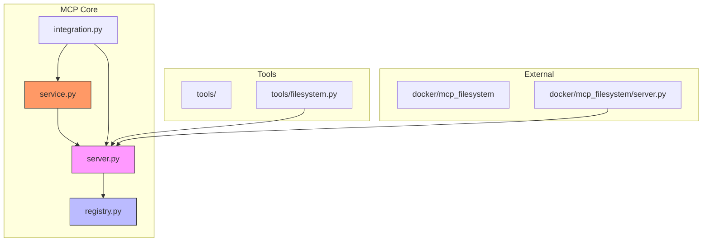
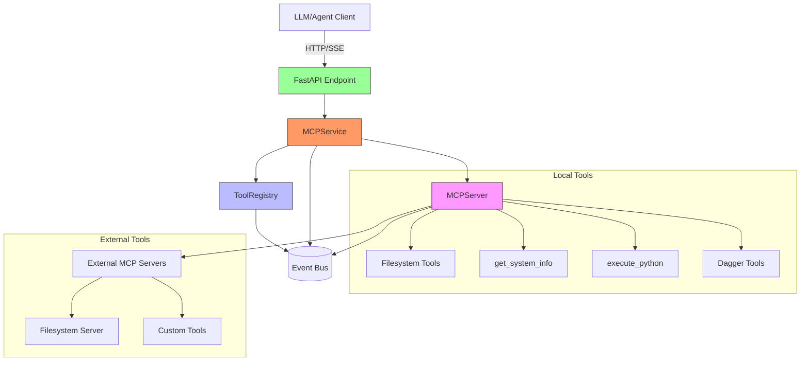
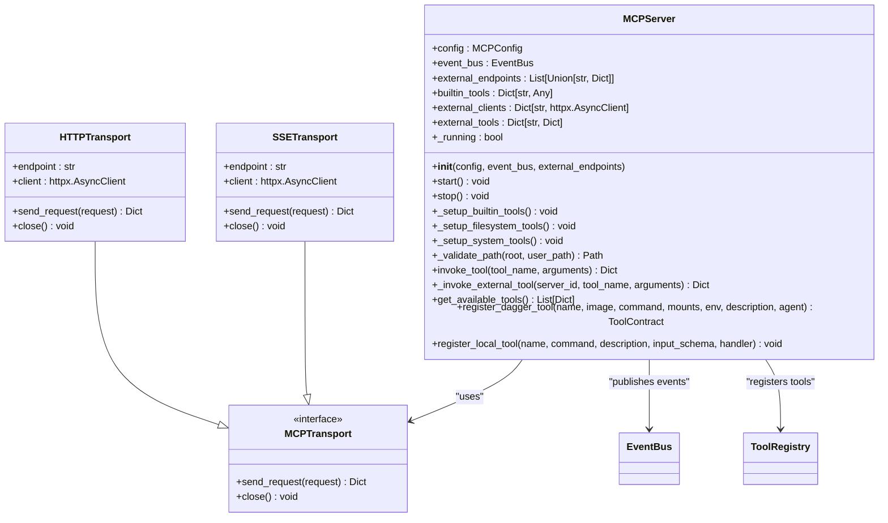
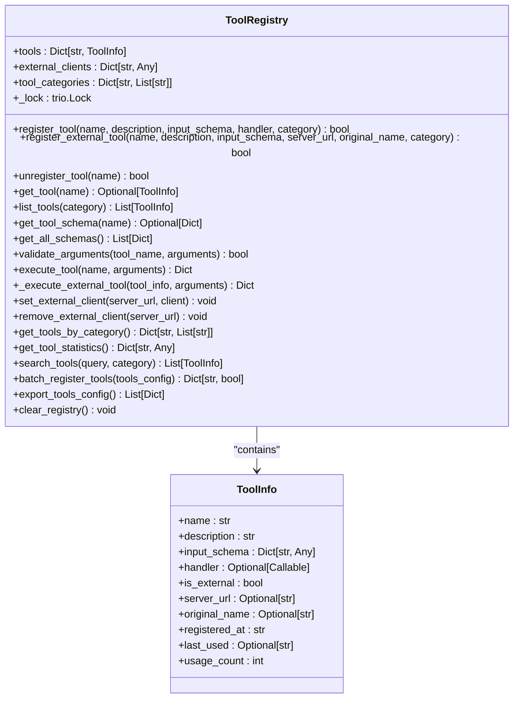
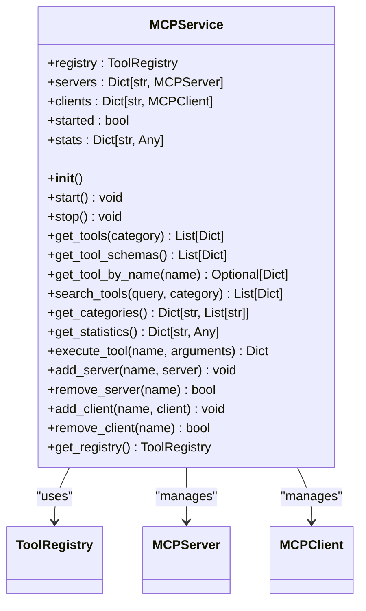
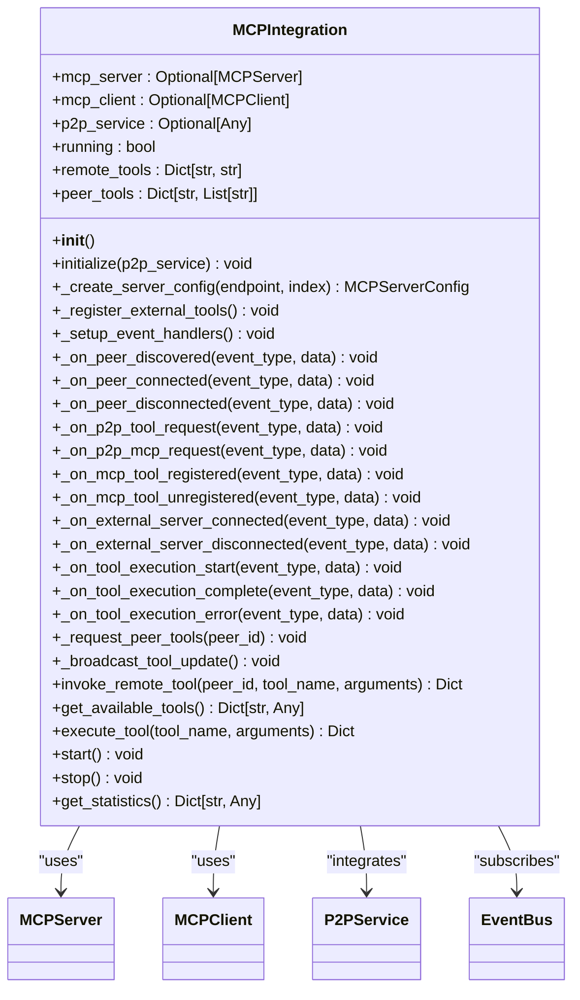
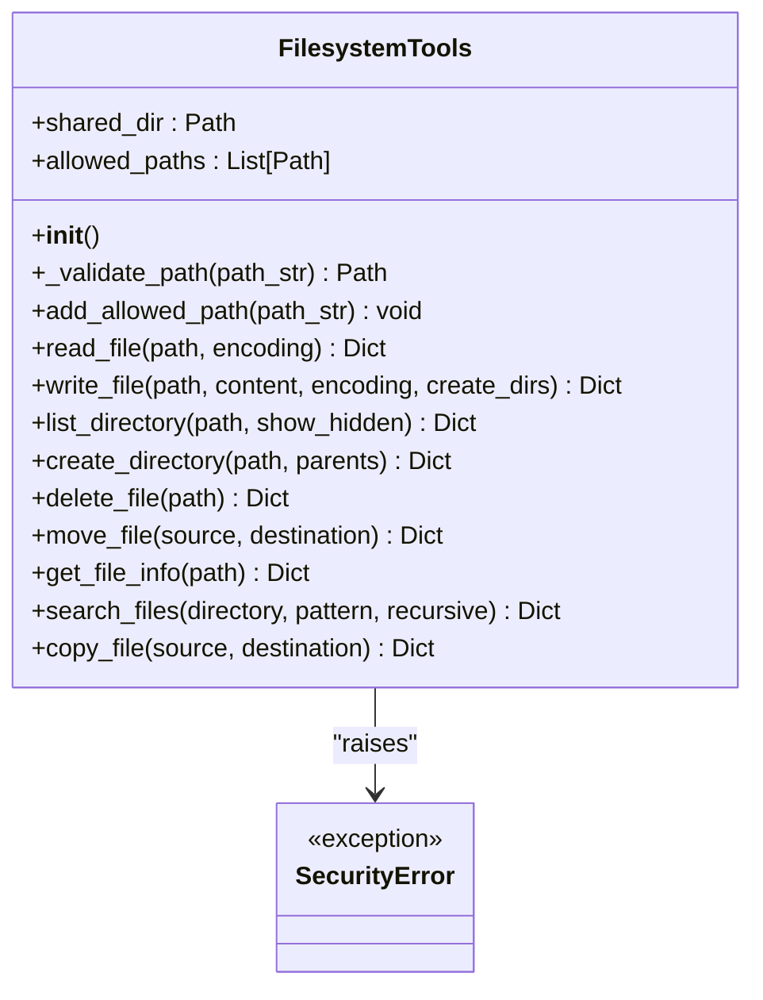
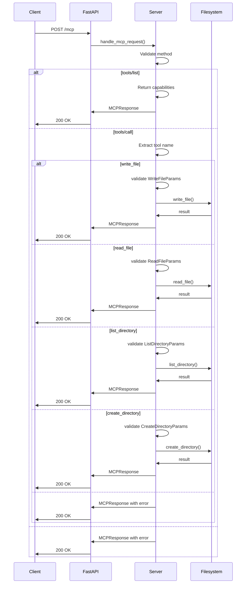
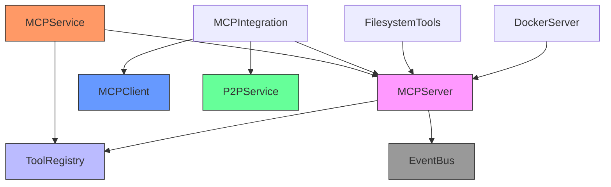

# MCP Server

## Table of Contents
1. [Introduction](#introduction)
2. [Project Structure](#project-structure)
3. [Core Components](#core-components)
4. [Architecture Overview](#architecture-overview)
5. [Detailed Component Analysis](#detailed-component-analysis)
6. [Dependency Analysis](#dependency-analysis)
7. [Performance Considerations](#performance-considerations)
8. [Troubleshooting Guide](#troubleshooting-guide)
9. [Conclusion](#conclusion)

## Introduction
The MCP (Model Context Protocol) Server is a core component of the Praxis Agent ecosystem, designed to expose tool capabilities to agents and LLMs through standardized endpoints. It enables seamless integration of both local and external tools, providing a unified interface for tool discovery, registration, and execution. Built on FastAPI, the server supports JSON-RPC 2.0 protocol for communication and integrates with the PraxisAgent event bus for real-time monitoring and coordination. The architecture supports dynamic tool registration, including Docker-based tools via Dagger, and provides robust security features such as path validation and input sanitization. This document provides a comprehensive analysis of the MCP Server implementation, covering its architecture, component relationships, data flows, and integration patterns.

## Project Structure
The MCP Server implementation is organized within the `src/praxis_sdk/mcp` directory, with supporting components in the `docker/mcp_filesystem` directory for external tool execution. The structure follows a modular design pattern, separating concerns into distinct components for transport, server logic, registry management, and service integration.

**Diagram sources**
- [server.py](file://src/praxis_sdk/mcp/server.py)
- [registry.py](file://src/praxis_sdk/mcp/registry.py)
- [service.py](file://src/praxis_sdk/mcp/service.py)
- [integration.py](file://src/praxis_sdk/mcp/integration.py)
- [filesystem.py](file://src/praxis_sdk/mcp/tools/filesystem.py)
- [server.py](file://docker/mcp_filesystem/server.py)

**Section sources**
- [server.py](file://src/praxis_sdk/mcp/server.py)
- [registry.py](file://src/praxis_sdk/mcp/registry.py)
- [service.py](file://src/praxis_sdk/mcp/service.py)

## Core Components
The MCP Server architecture consists of several core components that work together to provide tool management and execution capabilities. The `MCPServer` class serves as the main entry point, handling incoming requests and coordinating tool execution. The `ToolRegistry` maintains a centralized catalog of available tools, both local and external, with metadata and schema information. The `MCPService` provides a high-level interface for HTTP endpoint integration, exposing tool capabilities through RESTful APIs. The `MCPIntegration` class bridges the MCP functionality with the P2P network and event bus, enabling distributed tool discovery and execution. Each component follows the single responsibility principle, ensuring maintainability and testability.

**Section sources**
- [server.py](file://src/praxis_sdk/mcp/server.py#L1-L50)
- [registry.py](file://src/praxis_sdk/mcp/registry.py#L1-L50)
- [service.py](file://src/praxis_sdk/mcp/service.py#L1-L50)
- [integration.py](file://src/praxis_sdk/mcp/integration.py#L1-L50)

## Architecture Overview
The MCP Server architecture follows a layered design pattern, with clear separation between transport, business logic, and service layers. The system exposes standardized endpoints for tool discovery and execution, enabling seamless integration with LLMs and agent frameworks. The architecture supports both local tool execution and delegation to external MCP servers, providing flexibility in deployment scenarios.

**Diagram sources**
- [server.py](file://src/praxis_sdk/mcp/server.py#L1-L100)
- [registry.py](file://src/praxis_sdk/mcp/registry.py#L1-L50)
- [service.py](file://src/praxis_sdk/mcp/service.py#L1-L50)

## Detailed Component Analysis

### MCPServer Analysis
The `MCPServer` class is the central component responsible for handling tool execution requests and managing connections to external servers. It implements both HTTP and SSE (Server-Sent Events) transports for MCP communication, providing flexibility in deployment scenarios. The server supports automatic discovery of external MCP servers on configured ports and can connect to explicitly specified endpoints.

**Diagram sources**
- [server.py](file://src/praxis_sdk/mcp/server.py#L1-L400)

**Section sources**
- [server.py](file://src/praxis_sdk/mcp/server.py#L1-L983)

### ToolRegistry Analysis
The `ToolRegistry` class provides a centralized catalog for all MCP tools, both local and external. It manages tool metadata, input schemas, and execution handlers, ensuring consistent validation and execution across different tool types. The registry supports categorization of tools and maintains usage statistics for monitoring and optimization.

**Diagram sources**
- [registry.py](file://src/praxis_sdk/mcp/registry.py#L1-L463)

**Section sources**
- [registry.py](file://src/praxis_sdk/mcp/registry.py#L1-L463)

### MCPService Analysis
The `MCPService` class provides a high-level interface for HTTP endpoint integration, exposing tool capabilities through RESTful APIs. It acts as a facade for the underlying MCP components, handling request routing, statistics collection, and resource management. The service maintains comprehensive statistics on tool usage and system performance.

**Diagram sources**
- [service.py](file://src/praxis_sdk/mcp/service.py#L1-L284)

**Section sources**
- [service.py](file://src/praxis_sdk/mcp/service.py#L1-L284)

### MCPIntegration Analysis
The `MCPIntegration` class bridges the MCP functionality with the P2P network and event bus, enabling distributed tool discovery and execution. It coordinates between the MCP server, client, and P2P protocols, providing seamless integration across the agent network.

**Diagram sources**
- [integration.py](file://src/praxis_sdk/mcp/integration.py#L1-L480)

**Section sources**
- [integration.py](file://src/praxis_sdk/mcp/integration.py#L1-L480)

### Filesystem Tools Analysis
The `FilesystemTools` class implements secure filesystem operations with comprehensive validation and error handling. It enforces security policies by restricting operations to allowed directories and validating all paths to prevent directory traversal attacks.

**Diagram sources**
- [filesystem.py](file://src/praxis_sdk/mcp/tools/filesystem.py#L1-L679)

**Section sources**
- [filesystem.py](file://src/praxis_sdk/mcp/tools/filesystem.py#L1-L679)

### External Filesystem Server Analysis
The external MCP Filesystem Server is implemented as a FastAPI application, providing filesystem operations through the Model Context Protocol. It runs in a Docker container and exposes standardized endpoints for file operations, with security features such as path validation and size limits.

**Diagram sources**
- [server.py](file://docker/mcp_filesystem/server.py#L1-L367)

**Section sources**
- [server.py](file://docker/mcp_filesystem/server.py#L1-L367)

## Dependency Analysis
The MCP Server implementation has a well-defined dependency structure, with clear separation between components. The core dependencies flow from the service layer down to the registry and server components, with integration components bridging to external systems.

**Diagram sources**
- [service.py](file://src/praxis_sdk/mcp/service.py#L1-L50)
- [server.py](file://src/praxis_sdk/mcp/server.py#L1-L50)
- [registry.py](file://src/praxis_sdk/mcp/registry.py#L1-L50)
- [integration.py](file://src/praxis_sdk/mcp/integration.py#L1-L50)

**Section sources**
- [service.py](file://src/praxis_sdk/mcp/service.py#L1-L50)
- [server.py](file://src/praxis_sdk/mcp/server.py#L1-L50)
- [registry.py](file://src/praxis_sdk/mcp/registry.py#L1-L50)
- [integration.py](file://src/praxis_sdk/mcp/integration.py#L1-L50)

## Performance Considerations
The MCP Server implementation includes several performance optimizations and considerations. The use of asynchronous programming with asyncio and trio enables efficient handling of concurrent requests without blocking. The registry maintains an in-memory catalog of tools, providing O(1) lookup performance for tool discovery. The server implements connection pooling for external MCP servers through persistent HTTP clients, reducing connection overhead. For filesystem operations, the implementation uses buffered I/O and validates paths efficiently using Path.resolve() and string prefix matching. The architecture supports horizontal scaling through external MCP servers, allowing compute-intensive operations to be distributed across multiple containers or hosts. Rate limiting and input validation prevent denial-of-service attacks and ensure system stability under load.

## Troubleshooting Guide
Common issues with the MCP Server typically fall into several categories: connectivity problems, tool registration issues, and execution errors. For connectivity issues, verify that the server is running and accessible at the configured address and port. Check the logs for error messages related to HTTP client connections or SSE streaming. For tool registration problems, ensure that the tool metadata includes required fields such as name, description, and input schema. Verify that handlers are properly defined and accessible. For execution errors, check the input validation against the tool's schema and ensure that all required parameters are provided. Security-related errors often stem from path validation failures, so verify that file operations are within allowed directories. When integrating with external MCP servers, confirm that the server is properly initialized with the correct endpoint and that the capabilities endpoint returns the expected tools. Use the /health endpoint to verify server status and the /capabilities endpoint to inspect available tools.

**Section sources**
- [server.py](file://src/praxis_sdk/mcp/server.py#L330-L372)
- [service.py](file://src/praxis_sdk/mcp/service.py#L60-L99)
- [worker_filesystem.yaml](file://configs/worker_filesystem.yaml)

## Conclusion
The MCP Server implementation provides a robust and flexible framework for exposing tool capabilities to agents and LLMs through standardized endpoints. Its modular architecture, built on FastAPI and integrated with the PraxisAgent event bus, enables seamless tool discovery, registration, and execution. The system supports both local and external tools, with comprehensive security features and performance optimizations. The detailed analysis of core components reveals a well-designed system with clear separation of concerns and efficient data flows. The implementation demonstrates best practices in asynchronous programming, error handling, and security validation, making it suitable for production deployment in agent-based systems.

**Referenced Files in This Document**   
- [server.py](file://src/praxis_sdk/mcp/server.py)
- [registry.py](file://src/praxis_sdk/mcp/registry.py)
- [service.py](file://src/praxis_sdk/mcp/service.py)
- [integration.py](file://src/praxis_sdk/mcp/integration.py)
- [filesystem.py](file://src/praxis_sdk/mcp/tools/filesystem.py)
- [server.py](file://docker/mcp_filesystem/server.py)
- [worker_filesystem.yaml](file://configs/worker_filesystem.yaml)