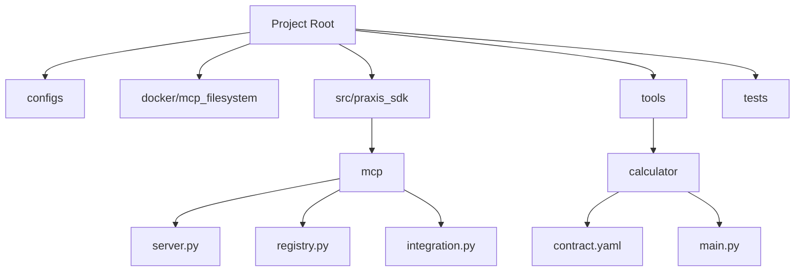
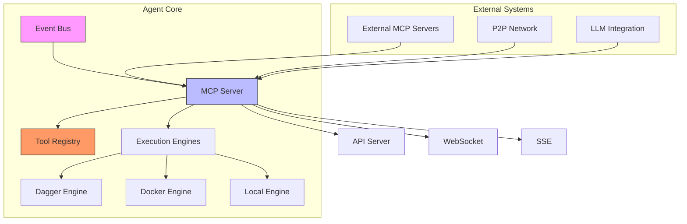
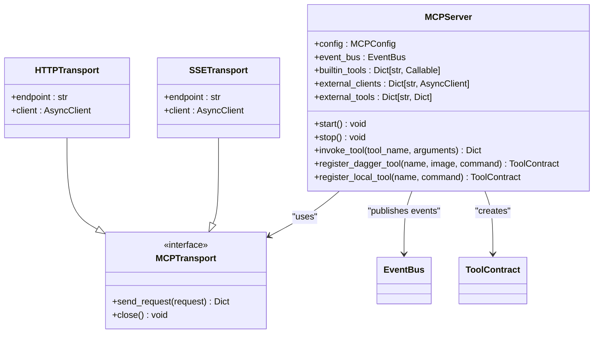
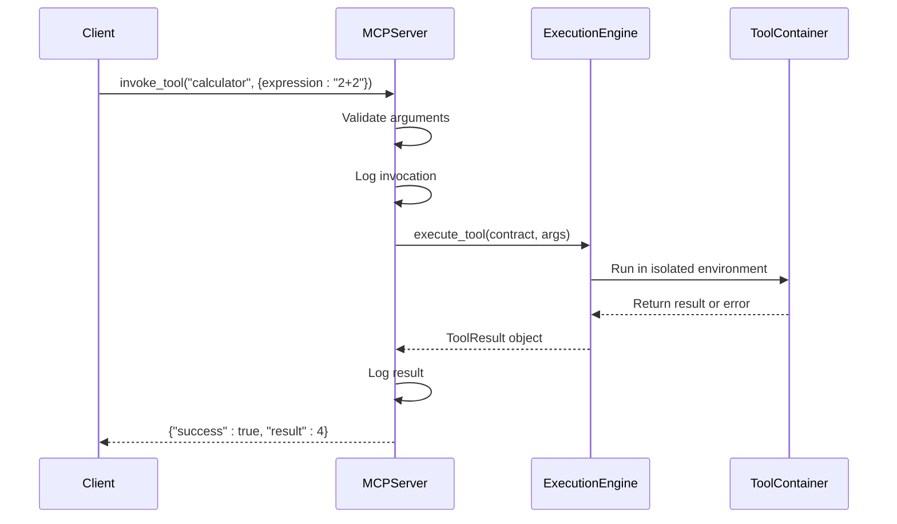
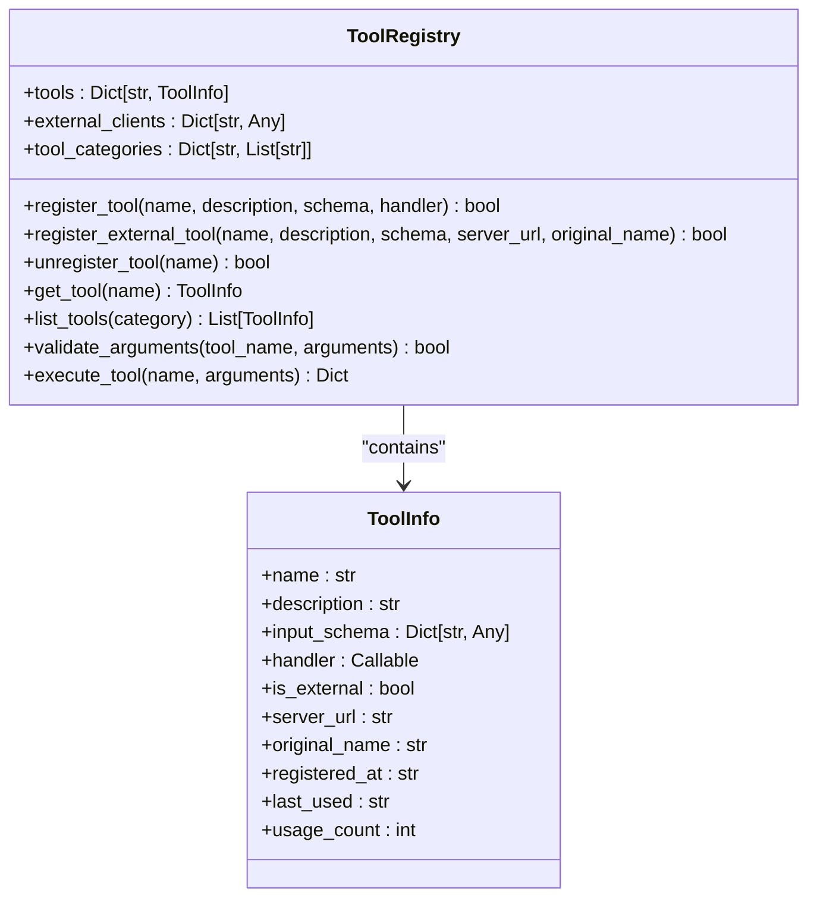
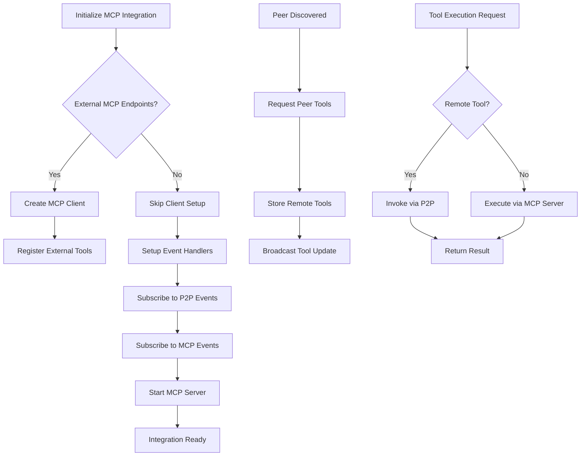
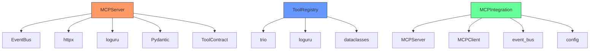

# MCP Tools Integration


## Table of Contents
1. [Introduction](#introduction)
2. [Project Structure](#project-structure)
3. [Core Components](#core-components)
4. [Architecture Overview](#architecture-overview)
5. [Detailed Component Analysis](#detailed-component-analysis)
6. [Dependency Analysis](#dependency-analysis)
7. [Performance Considerations](#performance-considerations)
8. [Troubleshooting Guide](#troubleshooting-guide)
9. [Conclusion](#conclusion)

## Introduction
The Praxis Python SDK provides a comprehensive framework for building distributed agent systems with integrated tool execution via the Model Context Protocol (MCP). This document details the integration of MCP-compliant tools, focusing on contract definition, runtime execution, containerization, and registry management. The system enables agents to discover, register, and execute tools locally or remotely in secure, isolated environments. Key components include the MCP server for tool hosting, the registry for tool management, and integration layers for P2P communication and event-driven coordination.

## Project Structure
The project follows a modular structure with clear separation of concerns. Core functionality is organized under `src/praxis_sdk`, while reusable tools are located in the `tools` directory. Configuration files in the `configs` folder define agent behavior and tool availability. The `docker/mcp_filesystem` directory contains a standalone MCP server implementation for filesystem operations.



**Diagram sources**
- [server.py](file://docker/mcp_filesystem/server.py)
- [server.py](file://src/praxis_sdk/mcp/server.py)
- [contract.yaml](file://tools/calculator/contract.yaml)

**Section sources**
- [server.py](file://docker/mcp_filesystem/server.py)
- [server.py](file://src/praxis_sdk/mcp/server.py)
- [contract.yaml](file://tools/calculator/contract.yaml)

## Core Components
The MCP tool integration system consists of several core components that work together to enable distributed tool execution. The MCP server acts as the primary interface for tool registration and invocation, supporting both built-in and external tools. The tool registry maintains metadata about available tools, including their input schemas and execution handlers. The integration layer connects the MCP system with P2P networking and event bus components, enabling cross-agent tool discovery and execution. Execution engines provide isolated environments for running tools, with support for containerized (Dagger), local, and remote execution.

**Section sources**
- [server.py](file://src/praxis_sdk/mcp/server.py)
- [registry.py](file://src/praxis_sdk/mcp/registry.py)
- [integration.py](file://src/praxis_sdk/mcp/integration.py)

## Architecture Overview
The MCP tools architecture follows a distributed, event-driven design where agents can host, discover, and execute tools across a network. The system uses a layered approach with clear separation between tool definition, execution, and communication.



**Diagram sources**
- [server.py](file://src/praxis_sdk/mcp/server.py)
- [registry.py](file://src/praxis_sdk/mcp/registry.py)
- [integration.py](file://src/praxis_sdk/mcp/integration.py)

## Detailed Component Analysis

### MCP Server Implementation
The MCP server serves as the central component for tool management and execution. It provides built-in tools for filesystem and system operations while also connecting to external MCP servers to extend its capabilities.

#### Server Architecture


**Diagram sources**
- [server.py](file://src/praxis_sdk/mcp/server.py#L1-L982)

**Section sources**
- [server.py](file://src/praxis_sdk/mcp/server.py#L1-L982)

### Tool Contract and Schema Definition
Tool contracts define the interface and execution parameters for MCP tools. The YAML contract specifies the tool's name, description, parameters, and engine-specific configuration.

#### Calculator Tool Contract
```yaml
name: "calculator"
description: "Performs mathematical calculations with support for basic operations and expressions"
engine: "dagger"
params:
  - name: "expression"
    type: "string"
    description: "Mathematical expression to evaluate (e.g., '2+2*3', 'sqrt(16)')"
    required: "false"
  - name: "operation"
    type: "string"
    description: "Basic operation: add, subtract, multiply, divide, power, modulo"
    required: "false"
  - name: "num1"
    type: "string"
    description: "First number for basic operations"
    required: "false"
  - name: "num2"
    type: "string"
    description: "Second number for basic operations"
    required: "false"
engineSpec:
  image: "python:3.11-slim"
  command: ["python", "/shared/tools/calculator/main.py"]
  mounts:
    ./shared: /shared
    ./tools: /shared/tools
  env_passthrough: ["EXPRESSION", "expression", "OPERATION", "operation", "NUM1", "num1", "NUM2", "num2"]
```

**Section sources**
- [contract.yaml](file://tools/calculator/contract.yaml#L1-L26)

### Tool Execution Flow
The tool execution process involves several steps from invocation to result delivery, with proper error handling and logging throughout.

#### Execution Sequence


**Diagram sources**
- [server.py](file://src/praxis_sdk/mcp/server.py#L800-L982)
- [main.py](file://tools/calculator/main.py#L1-L157)

**Section sources**
- [server.py](file://src/praxis_sdk/mcp/server.py#L800-L982)
- [main.py](file://tools/calculator/main.py#L1-L157)

### Tool Registry and Management
The tool registry provides centralized management of all available tools, both local and external, with support for dynamic registration and discovery.

#### Registry Class Diagram


**Diagram sources**
- [registry.py](file://src/praxis_sdk/mcp/registry.py#L1-L462)

**Section sources**
- [registry.py](file://src/praxis_sdk/mcp/registry.py#L1-L462)

### MCP Integration with P2P and Event Bus
The integration layer connects the MCP system with peer-to-peer networking and event-driven architecture, enabling distributed tool execution across agents.

#### Integration Flowchart


**Diagram sources**
- [integration.py](file://src/praxis_sdk/mcp/integration.py#L1-L479)

**Section sources**
- [integration.py](file://src/praxis_sdk/mcp/integration.py#L1-L479)

## Dependency Analysis
The MCP tools system has a well-defined dependency structure with clear boundaries between components. The core dependencies include FastAPI for HTTP server functionality, httpx for asynchronous HTTP requests, and loguru for logging. The system uses Pydantic for data validation and model definition, ensuring type safety and schema compliance.



**Diagram sources**
- [server.py](file://src/praxis_sdk/mcp/server.py)
- [registry.py](file://src/praxis_sdk/mcp/registry.py)
- [integration.py](file://src/praxis_sdk/mcp/integration.py)

**Section sources**
- [server.py](file://src/praxis_sdk/mcp/server.py)
- [registry.py](file://src/praxis_sdk/mcp/registry.py)
- [integration.py](file://src/praxis_sdk/mcp/integration.py)

## Performance Considerations
The MCP tools system is designed with performance and scalability in mind. The asynchronous architecture using Trio and httpx allows for efficient handling of concurrent tool executions. Containerized execution via Dagger provides isolation without significant overhead, while local execution offers the fastest performance for simple tools. The event-driven design minimizes polling and enables real-time updates through Server-Sent Events and WebSockets. For high-throughput scenarios, the system can be deployed in a clustered configuration with load balancing across multiple agent instances.

## Troubleshooting Guide
Common issues in the MCP tools system typically fall into several categories: configuration errors, connectivity problems, and execution failures.

### Configuration Issues
- **Missing environment variables**: Ensure all required environment variables are set, particularly for external services like OpenAI API.
- **Invalid YAML syntax**: Validate configuration files using a YAML linter to prevent parsing errors.
- **Incorrect tool paths**: Verify that tool mount paths in contract.yaml are correct and accessible.

### Connectivity Problems
- **MCP server not reachable**: Check that the MCP server is running and accessible at the specified endpoint.
- **P2P discovery failures**: Ensure mDNS is enabled and agents are on the same network segment.
- **Authentication errors**: Verify API keys and authentication tokens for external services.

### Execution Failures
- **Schema mismatches**: Validate that tool arguments match the expected input schema defined in contract.yaml.
- **Timeout errors**: Increase timeout values in configuration for long-running tools.
- **Permission failures**: Ensure the execution environment has appropriate permissions for file operations and network access.

**Section sources**
- [server.py](file://src/praxis_sdk/mcp/server.py)
- [registry.py](file://src/praxis_sdk/mcp/registry.py)
- [integration.py](file://src/praxis_sdk/mcp/integration.py)

## Conclusion
The MCP tools integration in the Praxis Python SDK provides a robust framework for building distributed agent systems with rich tool ecosystems. By combining standardized tool contracts, secure execution environments, and seamless P2P integration, the system enables flexible and scalable agent collaboration. The architecture supports multiple execution engines, allowing tools to run in containerized, local, or remote environments based on requirements. With comprehensive logging, error handling, and monitoring capabilities, the system is well-suited for production deployment in complex multi-agent scenarios.

**Referenced Files in This Document**   
- [server.py](file://docker/mcp_filesystem/server.py)
- [server.py](file://src/praxis_sdk/mcp/server.py)
- [registry.py](file://src/praxis_sdk/mcp/registry.py)
- [integration.py](file://src/praxis_sdk/mcp/integration.py)
- [contract.yaml](file://tools/calculator/contract.yaml)
- [main.py](file://tools/calculator/main.py)