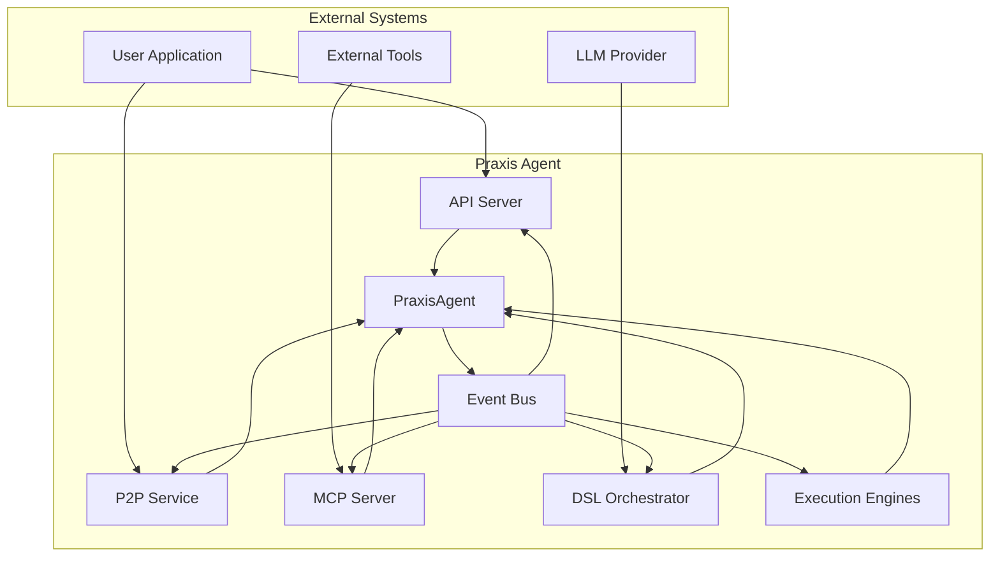

# Project Overview

## Table of Contents
1. [Introduction](#introduction)
2. [Core Architecture](#core-architecture)
3. [Component Relationships](#component-relationships)
4. [Key Features](#key-features)
5. [System Context Diagram](#system-context-diagram)
6. [Workflow Orchestration](#workflow-orchestration)
7. [Execution Engines](#execution-engines)
8. [Agent Communication](#agent-communication)
9. [Setup and Configuration](#setup-and-configuration)
10. [Use Cases](#use-cases)
11. [Technology Stack](#technology-stack)
12. [Common Misconceptions](#common-misconceptions)

## Introduction

The praxis-py-sdk is a Python implementation of the Praxis distributed agent platform, designed for building autonomous, collaborative systems with peer-to-peer (P2P) communication, Model Context Protocol (MCP) integration, and multi-engine execution capabilities. This SDK enables developers to create distributed, autonomous agent systems that can discover each other, share capabilities, and execute complex tasks through a unified interface while maintaining full autonomy and scalability.

The framework combines modern asynchronous Python with cutting-edge technologies like libp2p networking, MCP tool integration, and containerized execution engines to create a robust platform for multi-agent workflows. Agents built with this SDK can operate in both local and distributed environments, making it suitable for a wide range of applications from simple task automation to complex distributed AI systems.

The praxis-py-sdk provides a comprehensive toolkit for building intelligent agent systems that can communicate, collaborate, and execute tasks across network boundaries. It supports multiple execution engines, including containerized execution via Dagger, direct Docker management, and local in-process execution, allowing developers to choose the appropriate execution environment based on their requirements.

## Core Architecture

The praxis-py-sdk follows a modular, event-driven architecture centered around the PraxisAgent coordinator, which manages all subsystems and ensures proper lifecycle coordination between components. The architecture is designed to be highly extensible, with clear separation of concerns between different functional areas.

The core components of the system include the P2P service for decentralized communication, the MCP server for tool integration, the API server for external access, and the event bus for internal communication. These components work together through the PraxisAgent, which acts as the central orchestrator, managing component lifecycle, health monitoring, and coordination.

The system follows an event-driven design pattern, where components communicate through the event bus rather than direct method calls. This decoupling allows for greater flexibility and scalability, as components can be added or removed without affecting the overall system architecture. Events are published to the bus when significant state changes occur, and interested components can subscribe to relevant events.

The architecture supports both synchronous and asynchronous operations, with the primary execution model being asynchronous to handle concurrent operations efficiently. The use of asyncio and trio libraries enables the system to handle multiple connections and operations simultaneously without blocking.

**Section sources**
- [agent.py](file://src/praxis_sdk/agent.py#L1-L100)
- [README.md](file://README.md#L1-L50)

## Component Relationships

The praxis-py-sdk consists of several interconnected components that work together to provide a comprehensive agent system. The PraxisAgent serves as the central coordinator, managing the lifecycle and interactions of all other components.

The P2P service enables decentralized communication between agents using libp2p networking, allowing agents to discover each other and exchange information directly without relying on centralized servers. This service uses a simplified P2P implementation that handles connection management, message routing, and protocol handling.

The MCP server provides integration with external tools and services through the Model Context Protocol, allowing agents to access a wide range of capabilities. It can connect to both built-in tools and external MCP servers, providing a unified interface for tool execution.

The API server exposes the agent's functionality through REST, WebSocket, and Server-Sent Events interfaces, enabling external applications to interact with the agent. It runs as a background thread and provides endpoints for agent information, tool execution, task management, and P2P network operations.

The event bus serves as the communication backbone of the system, allowing components to publish and subscribe to events without direct dependencies. This decoupled communication pattern enables loose coupling between components and facilitates extensibility.

The execution engines handle the actual execution of tasks, with support for multiple execution environments including containerized execution via Dagger, direct Docker container management, and local in-process execution. These engines are managed by the PraxisAgent and can be selected based on the requirements of specific tasks.

The DSL orchestrator provides a high-level interface for workflow execution, translating natural language commands and DSL instructions into executable tasks. It integrates with the LLM client to enable intelligent task decomposition and planning.

**Section sources**
- [agent.py](file://src/praxis_sdk/agent.py#L100-L300)
- [README.md](file://README.md#L50-L100)

## Key Features

### Distributed P2P Architecture

The praxis-py-sdk features a robust distributed P2P architecture built on libp2p networking. This enables agents to discover each other, communicate securely, and share capabilities without relying on centralized infrastructure. The P2P service supports mDNS discovery for automatic agent discovery within local networks and DHT support for global agent discovery.

Agents can establish direct connections with each other, enabling efficient communication and task delegation. The P2P service handles connection management, message routing, and protocol negotiation, abstracting away the complexity of decentralized networking.

The architecture supports multi-protocol communication, allowing different agents to use different communication patterns based on their capabilities and requirements. This flexibility enables interoperability between agents with different feature sets.

### Agent-to-Agent (A2A) Protocol

The A2A protocol enables structured communication between agents, allowing them to exchange capabilities, delegate tasks, and coordinate workflows. Agents automatically broadcast their available tools and skills, enabling intelligent routing of tasks to the most suitable agents.

The protocol supports load balancing, automatically distributing workload across the agent network based on capacity and availability. It also provides fault tolerance, with graceful handling of agent failures and network partitions.

The A2A protocol is implemented as a JSON-RPC 2.0 compliant interface, providing a standardized way for agents to communicate. It supports methods for message sending, task retrieval, capability discovery, and agent status checking.

### Comprehensive Tool Ecosystem

The praxis-py-sdk includes a rich ecosystem of pre-built tools for various purposes, including text processing, data processing, and system utilities. These tools can be executed in isolated environments using different execution engines, ensuring dependency isolation and security.

The framework supports multiple execution engines, including Dagger for container-based execution with full isolation, Docker SDK for direct container management, and local execution for lightweight tasks. This flexibility allows developers to choose the appropriate execution environment based on their requirements.

The MCP integration enables seamless connection with external tool services, expanding the capabilities of the agent system. Tools can be defined with contracts that specify their execution parameters, making them easy to discover and use.

### Rich Communication Interfaces

The praxis-py-sdk provides multiple communication interfaces to accommodate different use cases and integration requirements. The HTTP API offers a RESTful interface for external integration, supporting standard HTTP methods and JSON payloads.

WebSocket support enables real-time bidirectional communication, allowing for interactive applications and live updates. Server-Sent Events provide a streaming interface for notifications and updates, ideal for monitoring agent status and task progress.

The P2P protocols enable direct agent-to-agent communication, bypassing centralized servers for more efficient and resilient communication. This decentralized approach enhances privacy and reduces dependency on external infrastructure.

### LLM Integration

The framework includes built-in integration with Large Language Models, currently supporting OpenAI models like GPT-4 and GPT-3.5. This integration enables intelligent workflow planning, context-aware task decomposition, and natural language processing.

The LLM client handles function calling, allowing structured tool invocation through the language model. This enables the creation of AI-powered workflows where the LLM can intelligently select and coordinate the execution of appropriate tools based on the task requirements.

Context management features ensure that relevant information is provided to the LLM for complex workflows, improving the quality and relevance of the generated plans and responses.

**Section sources**
- [README.md](file://README.md#L100-L300)
- [agent.py](file://src/praxis_sdk/agent.py#L300-L500)

## System Context Diagram

**Diagram sources**
- [agent.py](file://src/praxis_sdk/agent.py#L1-L100)
- [README.md](file://README.md#L1-L50)

## Workflow Orchestration

The praxis-py-sdk provides sophisticated workflow orchestration capabilities through its DSL orchestrator and LLM integration. The system can execute both simple DSL commands and complex multi-step workflows, with support for natural language processing and intelligent task planning.

The DSL orchestrator serves as the central component for workflow execution, translating high-level commands into executable tasks. It supports a variety of command types, including file operations, tool execution, and workflow management. The orchestrator integrates with the LLM client to enable natural language understanding and intelligent task decomposition.

When a command is received, the orchestrator first analyzes it to determine the appropriate course of action. For simple commands, it may execute them directly. For complex requests, it leverages the LLM to generate a detailed execution plan, breaking down the task into smaller, manageable steps.

The orchestrator coordinates the execution of these steps across different components and execution engines, managing dependencies and ensuring proper sequencing. It handles error conditions and can implement retry logic or alternative approaches when necessary.

Workflow execution is event-driven, with the orchestrator publishing events to the event bus at key points in the execution process. This allows other components to react to workflow progress and provides visibility into the execution status.

The system supports both synchronous and asynchronous workflow execution, with the ability to monitor long-running tasks and provide progress updates. Results from individual steps are aggregated and processed to produce the final output.

**Section sources**
- [orchestrator.py](file://src/praxis_sdk/dsl/orchestrator.py#L1-L100)
- [agent.py](file://src/praxis_sdk/agent.py#L500-L600)

## Execution Engines

The praxis-py-sdk supports multiple execution engines, providing flexibility in how tasks are executed. The primary execution engines include Dagger for container-based execution, Docker SDK for direct container management, and local execution for lightweight tasks.

The DaggerExecutionEngine provides containerized execution with full isolation, using the Dagger SDK to create and manage containers. This engine is ideal for tasks that require dependency isolation or have specific environment requirements. It supports mounting host directories, setting environment variables, and configuring resource limits.

The DockerSDKExecutionEngine provides direct management of Docker containers through the Docker Python SDK. This engine offers similar capabilities to the Dagger engine but uses the native Docker API. It serves as an alternative execution environment for users who prefer direct Docker integration.

The LocalExecutionEngine executes tasks directly in the host process, making it the fastest option for simple tasks that don't require isolation. This engine is suitable for lightweight operations and tools that don't have complex dependencies.

Each execution engine implements a common interface, allowing the system to switch between engines seamlessly. The choice of engine is specified in the tool contract, which defines the execution parameters and requirements.

The execution engines are managed by the PraxisAgent, which handles their lifecycle and ensures proper cleanup of resources. They integrate with the event bus to provide execution status updates and error reporting.

**Section sources**
- [engine.py](file://src/praxis_sdk/execution/engine.py#L1-L100)
- [contracts.py](file://src/praxis_sdk/execution/contracts.py#L1-L100)

## Agent Communication

Agent communication in the praxis-py-sdk is facilitated through multiple channels, including P2P networking, MCP integration, and API interfaces. The system supports both direct agent-to-agent communication and indirect communication through centralized services.

The P2P service enables direct communication between agents using libp2p networking. Agents can discover each other through mDNS or DHT, establish secure connections, and exchange information directly. This decentralized approach enhances privacy and reduces dependency on external infrastructure.

The A2A protocol provides a structured way for agents to communicate, with support for capability exchange, task delegation, and result aggregation. Agents broadcast their available tools and skills, allowing other agents to discover and utilize their capabilities.

The MCP server enables integration with external tools and services, providing a standardized interface for tool execution. It can connect to both built-in tools and external MCP servers, expanding the capabilities of the agent system.

The API server exposes the agent's functionality through REST, WebSocket, and Server-Sent Events interfaces, enabling external applications to interact with the agent. This provides a bridge between the decentralized P2P network and traditional client-server architectures.

Communication is secured through various mechanisms, including encrypted P2P connections and authentication for API access. The system also supports message signing and verification to ensure the integrity of communications.

**Section sources**
- [service_simplified.py](file://src/praxis_sdk/p2p/service_simplified.py#L1-L100)
- [protocol.py](file://src/praxis_sdk/a2a/protocol.py#L1-L100)
- [server.py](file://src/praxis_sdk/mcp/server.py#L1-L100)

## Setup and Configuration

Setting up the praxis-py-sdk requires Python 3.11 or higher, Poetry (recommended) or pip, Docker for containerized tool execution, and Git. The installation process can be completed using Poetry, pip, or Docker, depending on the preferred deployment method.

Using Poetry is the recommended approach, as it provides better dependency management and virtual environment isolation. After cloning the repository, users can install dependencies with `poetry install` and activate the virtual environment with `poetry shell`.

For users preferring pip, the installation involves creating a virtual environment, activating it, and installing the package in editable mode with `pip install -e .`. This approach provides more control over the installation process but requires manual management of dependencies.

Docker installation allows for containerized deployment, either as a single agent or as part of a multi-agent network using Docker Compose. This method provides the highest level of isolation and consistency across different environments.

Configuration is managed through YAML files and environment variables, with support for different environments (development, production). The configuration system validates settings and provides default values for missing parameters.

The SDK includes a CLI for common operations, such as running agents, generating configuration files, and validating configuration. This makes it easy to get started and manage agent instances.

**Section sources**
- [README.md](file://README.md#L300-L500)
- [main.py](file://src/praxis_sdk/main.py#L1-L100)

## Use Cases

### Multi-Agent Collaboration

The praxis-py-sdk is ideal for scenarios requiring collaboration between multiple autonomous agents. In a distributed research environment, for example, different agents could specialize in specific domains (e.g., data analysis, literature review, report generation) and work together to produce comprehensive research papers.

Agents can discover each other on the network, exchange capabilities, and delegate tasks based on their expertise. This enables efficient division of labor and specialization, with each agent focusing on tasks it is best suited for.

The P2P architecture ensures that the system remains functional even if some agents go offline, as tasks can be reassigned to available agents. This fault tolerance makes the system suitable for mission-critical applications.

### Distributed AI Workflows

The framework excels at orchestrating complex AI workflows that span multiple systems and require coordination between different components. For example, a content generation pipeline could involve agents for research, writing, editing, and publishing, each contributing their specialized capabilities.

The LLM integration enables intelligent workflow planning, where the system can automatically decompose high-level goals into executable steps. The execution engines ensure that each step is performed in the appropriate environment, whether that's a containerized tool, a local script, or an external service.

The event-driven architecture allows for real-time monitoring and adjustment of workflows, with the ability to respond to changing conditions or unexpected results. This adaptability makes the system suitable for dynamic environments.

### Secure Tool Orchestration

The praxis-py-sdk provides a secure environment for executing potentially untrusted code through its containerized execution engines. This makes it ideal for scenarios where security is paramount, such as processing user-submitted code or executing third-party tools.

The isolation provided by containerization ensures that tools cannot access unauthorized resources or interfere with other processes. The system can enforce resource limits and monitor execution for suspicious behavior.

The MCP integration allows for controlled access to external tools and services, with the ability to restrict permissions and monitor usage. This enables organizations to provide a rich set of capabilities while maintaining security and compliance.

**Section sources**
- [README.md](file://README.md#L500-L577)
- [agent.py](file://src/praxis_sdk/agent.py#L600-L700)

## Technology Stack

The praxis-py-sdk is built on a modern technology stack that combines cutting-edge libraries and frameworks to provide a robust and scalable agent system. The core technologies include:

- **Python 3.11+**: The primary programming language, chosen for its extensive ecosystem and strong support for asynchronous programming.
- **Poetry**: Dependency management and packaging tool, providing reliable dependency resolution and virtual environment management.
- **libp2p**: Networking stack for decentralized communication, enabling P2P connectivity and secure message routing.
- **Dagger**: Containerized execution engine, providing dependency isolation and reproducible builds.
- **FastAPI**: Web framework for the API server, offering high performance and automatic API documentation.
- **trio**: Async concurrency library, providing structured concurrency primitives for managing complex asynchronous operations.
- **loguru**: Logging library, offering rich formatting and flexible output options.
- **pydantic**: Data validation and settings management, ensuring type safety and configuration correctness.
- **OpenAI SDK**: Integration with Large Language Models, enabling intelligent workflow planning and natural language processing.

The system leverages asyncio for asynchronous operations, allowing it to handle multiple connections and tasks concurrently without blocking. The use of type hints and pydantic models ensures type safety and helps catch errors early in the development process.

The modular architecture allows for easy extension and customization, with clear interfaces between components. This makes it possible to replace or enhance individual components without affecting the overall system.

**Section sources**
- [README.md](file://README.md#L1-L50)
- [pyproject.toml](file://pyproject.toml#L1-L50)

## Common Misconceptions

### Misconception: The framework requires a centralized server

Contrary to this belief, the praxis-py-sdk is designed for decentralized operation using P2P networking. While it can integrate with centralized services through the MCP server, the core communication between agents occurs directly through the P2P network, eliminating the need for a central server.

### Misconception: Containerized execution is mandatory

While the framework supports containerized execution through Dagger and Docker, it also provides a local execution engine for lightweight tasks. Developers can choose the appropriate execution environment based on their requirements, with the option to execute simple tasks directly in the host process.

### Misconception: The system is only suitable for AI applications

Although the praxis-py-sdk includes LLM integration, it is a general-purpose agent framework that can be used for a wide range of applications beyond AI. Its capabilities in task automation, workflow orchestration, and distributed computing make it suitable for various domains, including system administration, data processing, and application integration.

### Misconception: Complex setup is required

The framework is designed to be easy to set up and use, with comprehensive documentation and a CLI for common operations. While advanced configurations are possible, the default settings allow users to get started quickly and experiment with the system's capabilities.

### Misconception: Agents must be homogeneous

The praxis-py-sdk supports heterogeneous agents with different capabilities and configurations. Agents can specialize in specific domains or tasks, and the system can intelligently route tasks to the most suitable agents based on their capabilities and availability.

**Referenced Files in This Document**   
- [README.md](file://README.md)
- [main.py](file://src/praxis_sdk/main.py)
- [agent.py](file://src/praxis_sdk/agent.py)
- [service_simplified.py](file://src/praxis_sdk/p2p/service_simplified.py)
- [protocol.py](file://src/praxis_sdk/a2a/protocol.py)
- [orchestrator.py](file://src/praxis_sdk/dsl/orchestrator.py)
- [server.py](file://src/praxis_sdk/mcp/server.py)
- [engine.py](file://src/praxis_sdk/execution/engine.py)
- [contracts.py](file://src/praxis_sdk/execution/contracts.py)